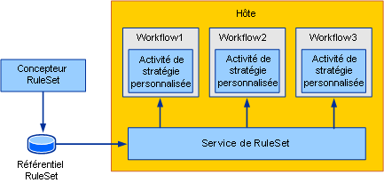
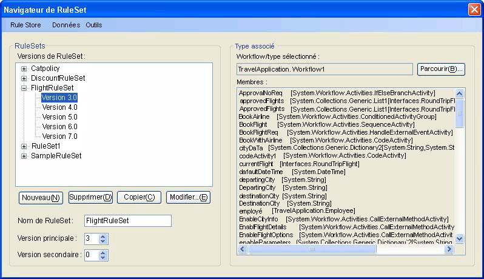
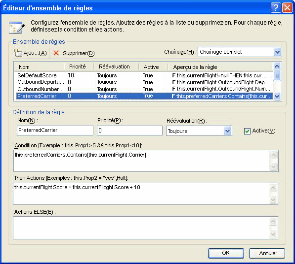
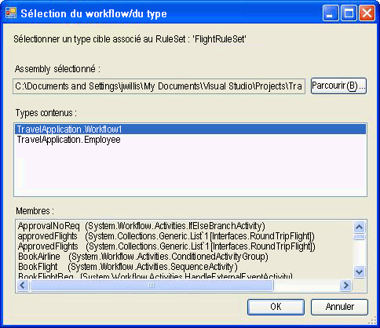
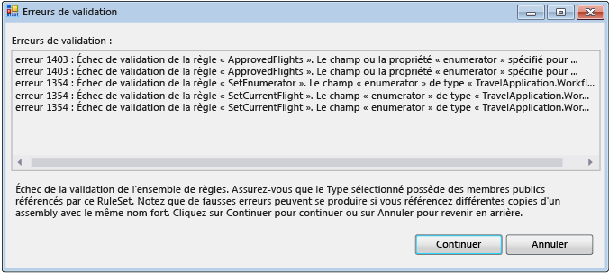
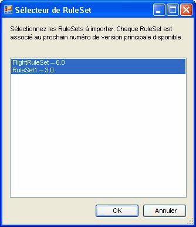

# <a name="external-ruleset-toolkit"></a><span data-ttu-id="2f2bf-102">External RuleSet Toolkit</span><span class="sxs-lookup"><span data-stu-id="2f2bf-102">External Ruleset Toolkit</span></span>
<span data-ttu-id="2f2bf-103">Généralement, lorsque des règles sont utilisées dans une application de workflow, elles font partie de l'assembly.</span><span class="sxs-lookup"><span data-stu-id="2f2bf-103">Normally when rules are used within a workflow application, the rules are part of the assembly.</span></span> <span data-ttu-id="2f2bf-104">Dans certains cas, il peut être préférable de gérer les RuleSets séparément de l'assembly afin qu'ils soient mis à jour sans que la génération et le déploiement de l'assembly de workflow ne soient nécessaires.</span><span class="sxs-lookup"><span data-stu-id="2f2bf-104">In some scenarios, you may want to maintain the RuleSets separately from the assembly so that they can be updated without rebuilding and deploying the workflow assembly.</span></span> <span data-ttu-id="2f2bf-105">Cet exemple vous permet de gérer et de modifier des RuleSets dans une base de données et d'accéder à ceux-ci à partir d'un workflow au moment de son exécution,</span><span class="sxs-lookup"><span data-stu-id="2f2bf-105">This sample allows you to manage and edit RuleSets in a database and access those RuleSets from a workflow at runtime.</span></span> <span data-ttu-id="2f2bf-106">opération qui permet aux instances de workflow en cours d'intégrer automatiquement des modifications de RuleSets.</span><span class="sxs-lookup"><span data-stu-id="2f2bf-106">This enables running workflow instances to automatically incorporate RuleSet changes.</span></span>  
  
 <span data-ttu-id="2f2bf-107">L'exemple External RuleSet Toolkit contient un utilitaire basé sur les Windows Forms pouvant être utilisé pour gérer et modifier les versions d'un RuleSet dans une base de données.</span><span class="sxs-lookup"><span data-stu-id="2f2bf-107">The External RuleSet Toolkit sample contains a Windows Forms-based tool that you can use to manage and edit RuleSet versions in a database.</span></span> <span data-ttu-id="2f2bf-108">Il inclut également une activité et un service hôte permettant d'exécuter ces règles.</span><span class="sxs-lookup"><span data-stu-id="2f2bf-108">It also includes an activity and a host service for executing those rules.</span></span>  
  
> [!NOTE]
>  <span data-ttu-id="2f2bf-109">Cet exemple requiert [Microsoft SQL Server](http://go.microsoft.com/fwlink/?LinkId=96181).</span><span class="sxs-lookup"><span data-stu-id="2f2bf-109">This sample requires [Microsoft SQL Server](http://go.microsoft.com/fwlink/?LinkId=96181).</span></span>  
  
 [!INCLUDE[vsprvsext](../../../../includes/vsprvsext-md.md)]<span data-ttu-id="2f2bf-110"> contient un outil RuleSet editor, issu de Windows Workflow Foundation (WF).</span><span class="sxs-lookup"><span data-stu-id="2f2bf-110"> provides a RuleSet editor as part of the Windows Workflow Foundation (WF).</span></span> <span data-ttu-id="2f2bf-111">Vous pouvez démarrer cet éditeur en double-cliquant sur l'activité `Policy` dans un workflow ; cette opération sérialise l'objet RuleSet défini au fichier .rules associé au workflow (une activité `Policy` exécute une instance RuleSet sur le workflow).</span><span class="sxs-lookup"><span data-stu-id="2f2bf-111">You can start this editor by double-clicking the `Policy` activity in a workflow; it serializes the defined RuleSet object to the .rules file associated with the workflow (a `Policy` activity runs a RuleSet instance against the workflow).</span></span> <span data-ttu-id="2f2bf-112">Le fichier .rules est compilé dans l'assembly en tant que ressource lors de la génération du projet de workflow.</span><span class="sxs-lookup"><span data-stu-id="2f2bf-112">The .rules file is compiled into the assembly as a resource when you build the workflow project.</span></span>  
  
 <span data-ttu-id="2f2bf-113">Les composants de cet exemple incluent les éléments suivants :</span><span class="sxs-lookup"><span data-stu-id="2f2bf-113">The components of this sample include:</span></span>  
  
-   <span data-ttu-id="2f2bf-114">Un outil GUI RuleSet pouvant être utilisé pour modifier et gérer des versions de RuleSets dans la base de données.</span><span class="sxs-lookup"><span data-stu-id="2f2bf-114">A RuleSet graphical user interface tool that you can use to edit and manage RuleSet versions in the database.</span></span>  
  
-   <span data-ttu-id="2f2bf-115">Un service de RuleSet configuré dans l'application hôte et accédant aux RuleSets de la base de données.</span><span class="sxs-lookup"><span data-stu-id="2f2bf-115">A RuleSet service that is configured on the host application and accesses RuleSets from the database.</span></span>  
  
-   <span data-ttu-id="2f2bf-116">Une activité `ExternalPolicy` nécessitant un RuleSet du service de RuleSet et exécutant ce RuleSet sur le workflow.</span><span class="sxs-lookup"><span data-stu-id="2f2bf-116">An `ExternalPolicy` activity that requests a RuleSet from the RuleSet service and runs the RuleSet against the workflow.</span></span>  
  
 <span data-ttu-id="2f2bf-117">L'interaction des composants est présentée sur la figure 1.</span><span class="sxs-lookup"><span data-stu-id="2f2bf-117">The interaction of the components is shown in Figure 1.</span></span> <span data-ttu-id="2f2bf-118">Les sections qui suivent décrivent chacun de ces composants.</span><span class="sxs-lookup"><span data-stu-id="2f2bf-118">The sections that follow describe each component.</span></span>  
  
 <span data-ttu-id="2f2bf-119"></span><span class="sxs-lookup"><span data-stu-id="2f2bf-119"></span></span>  
  
 <span data-ttu-id="2f2bf-120">Figure 1 : Vue d'ensemble de l'exemple</span><span class="sxs-lookup"><span data-stu-id="2f2bf-120">Figure 1: Sample Overview</span></span>  
  
> [!IMPORTANT]
>  <span data-ttu-id="2f2bf-121">Les exemples peuvent déjà être installés sur votre ordinateur.</span><span class="sxs-lookup"><span data-stu-id="2f2bf-121">The samples may already be installed on your machine.</span></span> <span data-ttu-id="2f2bf-122">Recherchez le répertoire (par défaut) suivant avant de continuer.</span><span class="sxs-lookup"><span data-stu-id="2f2bf-122">Check for the following (default) directory before continuing.</span></span>  
>   
>  `<InstallDrive>:\WF_WCF_Samples`  
>   
>  <span data-ttu-id="2f2bf-123">Si ce répertoire n’existe pas, accédez à la page [Windows Communication Foundation (WCF) and Windows Workflow Foundation (WF) Samples for .NET Framework 4](http://go.microsoft.com/fwlink/?LinkId=150780) pour télécharger tous les exemples [!INCLUDE[indigo1](../../../../includes/indigo1-md.md)] et [!INCLUDE[wf1](../../../../includes/wf1-md.md)] .</span><span class="sxs-lookup"><span data-stu-id="2f2bf-123">If this directory does not exist, go to [Windows Communication Foundation (WCF) and Windows Workflow Foundation (WF) Samples for .NET Framework 4](http://go.microsoft.com/fwlink/?LinkId=150780) to download all [!INCLUDE[indigo1](../../../../includes/indigo1-md.md)] and [!INCLUDE[wf1](../../../../includes/wf1-md.md)] samples.</span></span> <span data-ttu-id="2f2bf-124">Cet exemple se trouve dans le répertoire suivant.</span><span class="sxs-lookup"><span data-stu-id="2f2bf-124">This sample is located in the following directory.</span></span>  
>   
>  `<InstallDrive>:\WF_WCF_Samples\WF\Scenario\ExternalRuleSetToolKit`  
  
## <a name="ruleset-tool"></a><span data-ttu-id="2f2bf-125">Outil RuleSet</span><span class="sxs-lookup"><span data-stu-id="2f2bf-125">RuleSet Tool</span></span>  
 <span data-ttu-id="2f2bf-126">La figure 2 présente une capture d'écran de l'outil RuleSet.</span><span class="sxs-lookup"><span data-stu-id="2f2bf-126">A screen shot of the RuleSet tool is shown in Figure 2.</span></span> <span data-ttu-id="2f2bf-127">À partir de la **magasin de règles** menu, vous pouvez charger les ensembles de règles disponibles à partir de la base de données et enregistrer des groupes de règles modifiées dans le magasin.</span><span class="sxs-lookup"><span data-stu-id="2f2bf-127">From the **Rule Store** menu, you can load the available RuleSets from the database and save modified RuleSets back to the store.</span></span> <span data-ttu-id="2f2bf-128">Un fichier de configuration d'application contient une chaîne de connexion pour la base de données RuleSet.</span><span class="sxs-lookup"><span data-stu-id="2f2bf-128">An application configuration file provides a database connection string for the RuleSet database.</span></span> <span data-ttu-id="2f2bf-129">Lorsque vous démarrez l'outil, ce dernier charge automatiquement les RuleSets à partir de la base de données configurée.</span><span class="sxs-lookup"><span data-stu-id="2f2bf-129">When you start the tool, it automatically loads the RuleSets from the configured database.</span></span>  
  
 <span data-ttu-id="2f2bf-130"></span><span class="sxs-lookup"><span data-stu-id="2f2bf-130"></span></span>  
  
 <span data-ttu-id="2f2bf-131">Figure 2 : Navigateur de RuleSet</span><span class="sxs-lookup"><span data-stu-id="2f2bf-131">Figure 2: RuleSet Browser</span></span>  
  
 <span data-ttu-id="2f2bf-132">L'outil RuleSet applique aux RuleSets des numéros de version principaux et secondaires, vous permettant de gérer et de stocker simultanément plusieurs versions. Il ne dispose pas de fonctionnalités de verrouillage ou de contrôle de configuration en plus de ces fonctionnalités de versions.</span><span class="sxs-lookup"><span data-stu-id="2f2bf-132">The RuleSet tool applies major and minor version numbers to the RuleSets, allowing you to simultaneously maintain and store multiple versions (the tool provides no locking or other configuration management features in addition to the versioning capability).</span></span> <span data-ttu-id="2f2bf-133">Cet outil vous permet de créer des versions de RuleSets ou de supprimer des versions existantes.</span><span class="sxs-lookup"><span data-stu-id="2f2bf-133">Using the tool, you can create new RuleSet versions or delete existing versions.</span></span> <span data-ttu-id="2f2bf-134">Lorsque vous cliquez sur **nouveau**, l’outil crée un nouveau nom de groupe de règles et s’applique à la version 1.0.</span><span class="sxs-lookup"><span data-stu-id="2f2bf-134">When you click **New**, the tool creates a new RuleSet name and applies version 1.0.</span></span> <span data-ttu-id="2f2bf-135">Lorsque vous copiez une version, l'outil crée une copie de la version de l'ensemble de règles sélectionné, y compris les règles qu'il contient, et assigne de nouveaux numéros de version uniques.</span><span class="sxs-lookup"><span data-stu-id="2f2bf-135">When you copy a version, the tool creates a copy of the selected RuleSet version, including the contained rules, and assigns new, unique version numbers.</span></span> <span data-ttu-id="2f2bf-136">Ces numéros sont basés sur ceux de RuleSets existants.</span><span class="sxs-lookup"><span data-stu-id="2f2bf-136">These version numbers are based on the version numbers of existing RuleSets.</span></span> <span data-ttu-id="2f2bf-137">Vous pouvez changer le nom d'un RuleSet et ses numéros de version en utilisant les champs associés sur le formulaire.</span><span class="sxs-lookup"><span data-stu-id="2f2bf-137">You can change the RuleSet name and version numbers using the associated fields on the form.</span></span>  
  
 <span data-ttu-id="2f2bf-138">Lorsque vous cliquez sur **modifier les règles de**, l’outil RuleSet editor démarre, comme illustré dans la Figure 3.</span><span class="sxs-lookup"><span data-stu-id="2f2bf-138">When you click **Edit Rules**, the RuleSet editor starts, as shown in Figure 3.</span></span>  
  
 <span data-ttu-id="2f2bf-139"></span><span class="sxs-lookup"><span data-stu-id="2f2bf-139"></span></span>  
  
 <span data-ttu-id="2f2bf-140">Figure 3 : Outil RuleSet Editor</span><span class="sxs-lookup"><span data-stu-id="2f2bf-140">Figure 3: RuleSet Editor</span></span>  
  
 <span data-ttu-id="2f2bf-141">Il s'agit d'une nouvelle présentation de la boîte de dialogue de l'éditeur, qui fait partie du complément [!INCLUDE[vsprvs](../../../../includes/vsprvs-md.md)] de Windows Workflow Foundation.</span><span class="sxs-lookup"><span data-stu-id="2f2bf-141">This is a re-hosting of the editor dialog that is part of the Windows Workflow Foundation [!INCLUDE[vsprvs](../../../../includes/vsprvs-md.md)] add-in.</span></span> <span data-ttu-id="2f2bf-142">Elle contient les mêmes fonctionnalités, y compris la prise en charge Intellisense.</span><span class="sxs-lookup"><span data-stu-id="2f2bf-142">It provides the same functionality, including Intellisense support.</span></span> <span data-ttu-id="2f2bf-143">Les règles sont créées pour un type de cible (par exemple, un flux de travail) qui est associé à l’ensemble de règles dans l’outil ; Lorsque vous cliquez sur **Parcourir** dans la boîte de dialogue principale de l’outil, le **Workflow/Type Selector** boîte de dialogue s’affiche, comme illustré dans la Figure 4.</span><span class="sxs-lookup"><span data-stu-id="2f2bf-143">The rules are authored against a target type (such as a workflow) that is associated with the RuleSet in the tool; when you click **Browse** in the main tool dialog, the **Workflow/Type Selector** dialog appears, as shown in Figure 4.</span></span>  
  
 <span data-ttu-id="2f2bf-144"></span><span class="sxs-lookup"><span data-stu-id="2f2bf-144"></span></span>  
  
 <span data-ttu-id="2f2bf-145">Figure 4 : Workflow/Type Selector</span><span class="sxs-lookup"><span data-stu-id="2f2bf-145">Figure 4: Workflow/Type Selector</span></span>  
  
 <span data-ttu-id="2f2bf-146">Vous pouvez utiliser la **Workflow/Type Selector** boîte de dialogue pour spécifier un assembly et un type spécifique au sein de cet assembly.</span><span class="sxs-lookup"><span data-stu-id="2f2bf-146">You can use the **Workflow/Type Selector** dialog to specify an assembly and a specific type within that assembly.</span></span> <span data-ttu-id="2f2bf-147">Ce type correspond au type de cible pour lequel les règles sont créées (et exécutées).</span><span class="sxs-lookup"><span data-stu-id="2f2bf-147">This type is the target type against which the rules are authored (and run).</span></span> <span data-ttu-id="2f2bf-148">Dans de nombreux cas, le type de cible est un workflow ou un autre type d'activité.</span><span class="sxs-lookup"><span data-stu-id="2f2bf-148">In many cases, the target type is a workflow or some other activity type.</span></span> <span data-ttu-id="2f2bf-149">Toutefois, il est possible d'exécuter un RuleSet sur tout type .NET.</span><span class="sxs-lookup"><span data-stu-id="2f2bf-149">However, you can run a RuleSet against any .NET type.</span></span>  
  
 <span data-ttu-id="2f2bf-150">Le chemin d’accès pour le fichier d’assembly et le type `name are stored with the` RuleSet dans la base de données, afin que lorsque le RuleSet est récupéré à partir de la base de données, l’outil tente de charger le type de cible automatiquement.</span><span class="sxs-lookup"><span data-stu-id="2f2bf-150">The path to the assembly file and the type `name are stored with the` RuleSet in the database, so that when the RuleSet is retrieved from the database, the tool attempts to automatically load the target type.</span></span>  
  
 <span data-ttu-id="2f2bf-151">Lorsque vous cliquez sur **OK** dans les **Workflow/Type Selector** boîte de dialogue, il valide le type sélectionné pour le groupe de règles pour vous assurer que le type de cible dispose de tous les membres référencés par les règles.</span><span class="sxs-lookup"><span data-stu-id="2f2bf-151">When you click **OK** in the **Workflow/Type Selector** dialog, it validates the selected type against the RuleSet, to ensure that the target type has all the members referenced by the rules.</span></span> <span data-ttu-id="2f2bf-152">Les erreurs sont indiquées dans un **les erreurs de Validation** boîte de dialogue (voir Figure 5).</span><span class="sxs-lookup"><span data-stu-id="2f2bf-152">Errors are shown in a **Validation Errors** dialog (see Figure 5).</span></span> <span data-ttu-id="2f2bf-153">Vous pouvez choisir de continuer la modification malgré les erreurs, ou cliquez sur **Annuler**.</span><span class="sxs-lookup"><span data-stu-id="2f2bf-153">You can choose to continue with the change despite the errors, or click **Cancel**.</span></span> <span data-ttu-id="2f2bf-154">À partir de la **outils** menu dans la boîte de dialogue principale de l’outil, vous pouvez cliquer sur **Validate** pour valider à nouveau la version de l’ensemble de règles à l’activité cible.</span><span class="sxs-lookup"><span data-stu-id="2f2bf-154">From the **Tools** menu in the main tool dialog, you can click **Validate** to re-validate the RuleSet version against the target activity.</span></span>  
  
 <span data-ttu-id="2f2bf-155"></span><span class="sxs-lookup"><span data-stu-id="2f2bf-155"></span></span>  
  
 <span data-ttu-id="2f2bf-156">Figure 5 : Erreurs de validation</span><span class="sxs-lookup"><span data-stu-id="2f2bf-156">Figure 5: Validation Errors</span></span>  
  
 <span data-ttu-id="2f2bf-157">À partir de la **données** menu dans l’outil, vous pouvez importer et exporter des groupes de règles.</span><span class="sxs-lookup"><span data-stu-id="2f2bf-157">From the **Data** menu in the tool, you can import and export RuleSets.</span></span> <span data-ttu-id="2f2bf-158">Lorsque vous cliquez sur **importation**, une boîte de dialogue Sélecteur de fichier s’affiche, dans laquelle vous pouvez sélectionner un fichier .rules.</span><span class="sxs-lookup"><span data-stu-id="2f2bf-158">When you click **Import**, a file-chooser dialog appears, from which you can select a .rules file.</span></span> <span data-ttu-id="2f2bf-159">Il peut s'agir ou non d'un fichier créé initialement dans [!INCLUDE[vsprvs](../../../../includes/vsprvs-md.md)].</span><span class="sxs-lookup"><span data-stu-id="2f2bf-159">This may or may not be a file initially created in [!INCLUDE[vsprvs](../../../../includes/vsprvs-md.md)].</span></span> <span data-ttu-id="2f2bf-160">Le fichier .rules doit contenir une instance de `RuleDefinitions` sérialisée qui dispose d'une collection de conditions et d'une collection de RuleSets.</span><span class="sxs-lookup"><span data-stu-id="2f2bf-160">The .rules file should contain a serialized `RuleDefinitions` instance that contains a collection of conditions and a collection of RuleSets.</span></span> <span data-ttu-id="2f2bf-161">L'outil n'utilise pas la collection de conditions, mais il utilise le format `RuleDefinitions`.rules pour permettre l'interaction avec l'environnement [!INCLUDE[vsprvs](../../../../includes/vsprvs-md.md)].</span><span class="sxs-lookup"><span data-stu-id="2f2bf-161">The tool does not use the conditions collection, but it does use the `RuleDefinitions` .rules format to allow interaction with the [!INCLUDE[vsprvs](../../../../includes/vsprvs-md.md)] environment.</span></span>  
  
 <span data-ttu-id="2f2bf-162">Après avoir sélectionné un fichier .rules, un **RuleSet Selector** boîte de dialogue s’affiche (voir Figure 6).</span><span class="sxs-lookup"><span data-stu-id="2f2bf-162">After selecting a .rules file, a **RuleSet Selector** dialog appears (see Figure 6).</span></span> <span data-ttu-id="2f2bf-163">Celle-ci permet de sélectionner les ensembles de règles que vous souhaitez importer à partir du fichier (par défaut, tous les ensembles de règles sont sélectionnés).</span><span class="sxs-lookup"><span data-stu-id="2f2bf-163">You can use the dialog to select the RuleSets from the file that you want to import (the default specifies all RuleSets).</span></span> <span data-ttu-id="2f2bf-164">Les RuleSets d'un fichier .rules ne disposent pas de numéros de version, car leur version dans un projet WF est identique à celle de l'assembly.</span><span class="sxs-lookup"><span data-stu-id="2f2bf-164">RuleSets in the .rules file do not have version numbers, because their versioning within a WF project is the same as the version of the assembly.</span></span> <span data-ttu-id="2f2bf-165">Pendant le processus d’importation, l’outil assigne automatiquement le numéro de version principal disponible suivant (que vous pouvez modifier après l’importation) ; Vous pouvez voir les numéros de version attribué dans le **RuleSet Selector** liste.</span><span class="sxs-lookup"><span data-stu-id="2f2bf-165">During the importing process, the tool automatically assigns the next available major version number (which you can change after importing); you can see the assigned version numbers in the **RuleSet Selector** list.</span></span>  
  
 <span data-ttu-id="2f2bf-166">Pour chaque RuleSet importé, l’outil tente de localiser le type associé dans le dossier bin\Debug qui se trouve sous l’emplacement du fichier .rules (s’il existe), en fonction des membres utilisés dans le RuleSet.</span><span class="sxs-lookup"><span data-stu-id="2f2bf-166">For each RuleSet it imports, the tool attempts to locate the associated type from the bin\Debug folder under the location of the .rules file (if it exists), based on the members used in the RuleSet.</span></span> <span data-ttu-id="2f2bf-167">Si l'outil détecte plusieurs types correspondants, il essaie d'en choisir un en fonction d'une correspondance entre le nom de fichier .rules et celui du type (par exemple, le type `Workflow1` correspond au fichier Workflow1.rules).</span><span class="sxs-lookup"><span data-stu-id="2f2bf-167">If the tool finds multiple matching types, it attempts to choose a type based on a match between the .rules file name and the type name (for example, the `Workflow1` type corresponds to Workflow1.rules).</span></span> <span data-ttu-id="2f2bf-168">Si plusieurs noms concordent, vous êtes invité à sélectionner le type.</span><span class="sxs-lookup"><span data-stu-id="2f2bf-168">If multiple matches exist, you are prompted to select the type.</span></span> <span data-ttu-id="2f2bf-169">Si ce mécanisme d’identification automatique ne parvient pas à localiser un assembly ou un type correspondant, après l’importation vous pouvez ensuite cliquer sur **Parcourir** dans la boîte de dialogue principale de l’outil pour accéder au type associé.</span><span class="sxs-lookup"><span data-stu-id="2f2bf-169">If this auto-identification mechanism fails to locate a matching assembly or type, then after importing you can click **Browse** on the main tool dialog to navigate to the associated type.</span></span>  
  
 <span data-ttu-id="2f2bf-170"></span><span class="sxs-lookup"><span data-stu-id="2f2bf-170"></span></span>  
  
 <span data-ttu-id="2f2bf-171">Figure 6 : RuleSet Selector</span><span class="sxs-lookup"><span data-stu-id="2f2bf-171">Figure 6: RuleSet Selector</span></span>  
  
 <span data-ttu-id="2f2bf-172">Lorsque vous cliquez sur **Data-Export** à partir du menu principale de l’outil, le **RuleSet Selector** boîte de dialogue s’affiche à nouveau, à partir de laquelle vous pouvez déterminer les ensembles de règles à partir de la base de données qui doit être exporté.</span><span class="sxs-lookup"><span data-stu-id="2f2bf-172">When you click **Data-Export** from the main tool menu, the **RuleSet Selector** dialog appears again, from which you can determine the RuleSets from the database that should be exported.</span></span> <span data-ttu-id="2f2bf-173">Lorsque vous cliquez sur **OK**, un **enregistrer le fichier** boîte de dialogue s’affiche, dans laquelle vous pouvez spécifier le nom et l’emplacement du fichier .rules.</span><span class="sxs-lookup"><span data-stu-id="2f2bf-173">When you click **OK**, a **Save File** dialog appears, in which you can specify the name and location of the resulting .rules file.</span></span> <span data-ttu-id="2f2bf-174">Le fichier .rules ne contenant aucune information sur la version, vous pouvez sélectionner une seule version de RuleSet répondant à un nom donné.</span><span class="sxs-lookup"><span data-stu-id="2f2bf-174">Because the .rules file does not contain version information, you can only select one RuleSet version with a given RuleSet name.</span></span>  
  
## <a name="policyfromservice-activity"></a><span data-ttu-id="2f2bf-175">Activité PolicyFromService</span><span class="sxs-lookup"><span data-stu-id="2f2bf-175">PolicyFromService Activity</span></span>  
 <span data-ttu-id="2f2bf-176">Le code correspondant à l'activité `PolicyFromService` est très simple.</span><span class="sxs-lookup"><span data-stu-id="2f2bf-176">The code for the `PolicyFromService` activity is straightforward.</span></span> <span data-ttu-id="2f2bf-177">Il fonctionne exactement comme l'activité `Policy` fournie avec WF, mais au lieu de récupérer le RuleSet cible dans le fichier .rules, il appelle un service hôte pour obtenir l'instance de ce RuleSet.</span><span class="sxs-lookup"><span data-stu-id="2f2bf-177">It works much like the `Policy` activity provided with WF, but instead of retrieving the target RuleSet from the .rules file, it calls a host service to obtain the RuleSet instance.</span></span> <span data-ttu-id="2f2bf-178">Il exécute ensuite le RuleSet sur l'instance de l'activité du workflow racine.</span><span class="sxs-lookup"><span data-stu-id="2f2bf-178">It then runs the RuleSet against the root workflow activity instance.</span></span>  
  
 <span data-ttu-id="2f2bf-179">Pour utiliser l'activité dans un workflow, ajoutez une référence aux assemblys `PolicyActivities` et `RuleSetService` de votre projet de workflow.</span><span class="sxs-lookup"><span data-stu-id="2f2bf-179">To use the activity in a workflow, add a reference to the `PolicyActivities` and `RuleSetService` assemblies from your workflow project.</span></span> <span data-ttu-id="2f2bf-180">Consultez la procédure située à la fin de cette rubrique pour savoir comment ajouter une activité à la boîte à outils.</span><span class="sxs-lookup"><span data-stu-id="2f2bf-180">See the procedure at the end of this topic for a discussion of how to add the activity to the toolbox.</span></span>  
  
 <span data-ttu-id="2f2bf-181">Après avoir ajouté l'activité à votre workflow, vous devez indiquer le nom du RuleSet à exécuter.</span><span class="sxs-lookup"><span data-stu-id="2f2bf-181">After placing the activity in your workflow, you must provide the name of the RuleSet to be run.</span></span> <span data-ttu-id="2f2bf-182">Vous pouvez indiquer ce nom en tant que valeur littérale ou le lier à la variable ou à la propriété de workflow d'une autre activité.</span><span class="sxs-lookup"><span data-stu-id="2f2bf-182">You can enter the name as a literal value, or bind to a workflow variable or property of another activity.</span></span> <span data-ttu-id="2f2bf-183">Vous pouvez également indiquer des numéros de version pour le RuleSet à exécuter (facultatif).</span><span class="sxs-lookup"><span data-stu-id="2f2bf-183">Optionally, you can enter version numbers for the specific RuleSet that should be run.</span></span> <span data-ttu-id="2f2bf-184">Si vous laissez la valeur par défaut (0) comme numéro de version principal ou secondaire, le numéro de version le plus récent figurant dans la base de données sera automatiquement assigné à l'activité.</span><span class="sxs-lookup"><span data-stu-id="2f2bf-184">If you leave the default value of 0 for the major and minor version numbers, the latest version number in the database is automatically provided for the activity.</span></span>  
  
## <a name="ruleset-service"></a><span data-ttu-id="2f2bf-185">Service de RuleSet</span><span class="sxs-lookup"><span data-stu-id="2f2bf-185">RuleSet Service</span></span>  
 <span data-ttu-id="2f2bf-186">Ce service est chargé de récupérer dans la base de données la version indiquée du RuleSet et de la renvoyer à l'activité appelante.</span><span class="sxs-lookup"><span data-stu-id="2f2bf-186">The service is responsible for retrieving the specified RuleSet version from the database and returning it to the calling activity.</span></span> <span data-ttu-id="2f2bf-187">Comme indiqué précédemment, si la valeur des versions principales et secondaires passées dans l'appel `GetRuleSet` est de 0, le service récupère la version la plus récente.</span><span class="sxs-lookup"><span data-stu-id="2f2bf-187">As previously discussed, if the major and minor version values passed in the `GetRuleSet` call are both 0, the service retrieves the latest version.</span></span> <span data-ttu-id="2f2bf-188">À ce stade, aucune mise en cache des définitions ou des instances de RuleSets n'est effectuée ; de la même façon, aucune fonctionnalité visant à marquer certaines versions de RuleSets comme étant « déployées » (afin de les différencier des RuleSets en cours) n'est appliquée.</span><span class="sxs-lookup"><span data-stu-id="2f2bf-188">At this point, there is no caching of RuleSet definitions or instances; similarly, there are no features for marking RuleSet versions as "deployed" to differentiate them from in-progress RuleSets.</span></span>  
  
 <span data-ttu-id="2f2bf-189">La base de données devant être consultée par le service doit être configurée sur l'hôte à l'aide d'un fichier de configuration d'application.</span><span class="sxs-lookup"><span data-stu-id="2f2bf-189">The database to be accessed by the service should be configured on the host using an application configuration file.</span></span>  
  
#### <a name="to-run-the-tool"></a><span data-ttu-id="2f2bf-190">Pour exécuter l'outil</span><span class="sxs-lookup"><span data-stu-id="2f2bf-190">To run the tool</span></span>  
  
1.  <span data-ttu-id="2f2bf-191">Le dossier de configuration de la table RuleSet utilisée par l'outil et par le service contient un fichier Setup.sql.</span><span class="sxs-lookup"><span data-stu-id="2f2bf-191">The folder that sets up the RuleSet table used by the tool and the service contains a Setup.sql file.</span></span> <span data-ttu-id="2f2bf-192">Vous pouvez exécuter le fichier de commandes Setup.cmd pour créer la base de données Rules dans SQL Express et configurer la table RuleSet.</span><span class="sxs-lookup"><span data-stu-id="2f2bf-192">You can run the Setup.cmd batch file to create the Rules database on SQL Express and to set up the RuleSet table.</span></span>  
  
2.  <span data-ttu-id="2f2bf-193">Si vous modifiez le fichier de commandes ou Setup.sql et indiquez de ne pas utiliser SQL Express ou d'ajouter la table dans une base de données autre que `Rules`, les fichiers de configuration d'application de l'outil RuleSet et les projets `UsageSample` doivent être modifiés pour contenir les mêmes informations.</span><span class="sxs-lookup"><span data-stu-id="2f2bf-193">If you edit the batch file or Setup.sql and specify not to use SQL Express or to place the table in a database named something other than `Rules`, the application configuration files in the RuleSet tool and `UsageSample` projects should be edited with the same information.</span></span>  
  
3.  <span data-ttu-id="2f2bf-194">Après avoir exécuté le script Setup.sql, vous pouvez générer la solution `ExternalRuleSetToolkit` puis exécuter l'outil RuleSet à partir du projet ExternalRuleSetTool.</span><span class="sxs-lookup"><span data-stu-id="2f2bf-194">After you run the Setup.sql script, you can build the `ExternalRuleSetToolkit` solution and then launch the RuleSet tool from the ExternalRuleSetTool project.</span></span>  
  
4.  <span data-ttu-id="2f2bf-195">La solution `RuleSetToolkitUsageSample` Sequential Workflow Console Application contient un exemple de workflow.</span><span class="sxs-lookup"><span data-stu-id="2f2bf-195">The `RuleSetToolkitUsageSample` Sequential Workflow Console Application solution includes a sample workflow.</span></span> <span data-ttu-id="2f2bf-196">Ce dernier se compose d'une activité `PolicyFromService` et de deux variables (`orderValue` et `discount`) sur lesquelles le RuleSet cible s'exécute.</span><span class="sxs-lookup"><span data-stu-id="2f2bf-196">The workflow consists of a `PolicyFromService` activity and two variables, `orderValue` and `discount`, against which the target RuleSet runs.</span></span>  
  
5.  <span data-ttu-id="2f2bf-197">Pour utiliser cet exemple, générez la solution `RuleSetToolkitUsageSample`.</span><span class="sxs-lookup"><span data-stu-id="2f2bf-197">To use the sample, build the `RuleSetToolkitUsageSample` solution.</span></span> <span data-ttu-id="2f2bf-198">Puis, dans le menu principal outil de RuleSet, cliquez sur **Data-Import** et pointer vers le fichier discountruleset.Rules qui se trouve dans le dossier RuleSetToolkitUsageSample.</span><span class="sxs-lookup"><span data-stu-id="2f2bf-198">Then from the RuleSet tool main menu, click **Data-Import** and point to the DiscountRuleSet.rules file in the RuleSetToolkitUsageSample folder.</span></span> <span data-ttu-id="2f2bf-199">Cliquez sur le **Rule Store-Save** option de menu pour enregistrer le RuleSet importé pour la base de données.</span><span class="sxs-lookup"><span data-stu-id="2f2bf-199">Click the **Rule Store-Save** menu option to save the imported RuleSet to the database.</span></span>  
  
6.  <span data-ttu-id="2f2bf-200">L'assembly `PolicyActivities` étant référencé à partir du projet de workflow exemple, l'activité `PolicyFromService` apparaît dans le workflow.</span><span class="sxs-lookup"><span data-stu-id="2f2bf-200">Because the `PolicyActivities` assembly is referenced from the sample workflow project, the `PolicyFromService` activity appears in the workflow.</span></span> <span data-ttu-id="2f2bf-201">Toutefois, elle ne s'affiche pas par défaut dans la boîte à outils.</span><span class="sxs-lookup"><span data-stu-id="2f2bf-201">It does not, however, appear in the toolbox by default.</span></span> <span data-ttu-id="2f2bf-202">Pour l'ajouter à la boîte à outils, procédez comme suit :</span><span class="sxs-lookup"><span data-stu-id="2f2bf-202">To add it to the toolbox, do the following:</span></span>  
  
    -   <span data-ttu-id="2f2bf-203">Avec le bouton droit de la boîte à outils et sélectionnez **choisir des éléments** (cette opération peut prendre un certain temps).</span><span class="sxs-lookup"><span data-stu-id="2f2bf-203">Right-click the toolbox and select **Choose Items** (this may take a while).</span></span>  
  
    -   <span data-ttu-id="2f2bf-204">Lorsque le **choisir des éléments de boîte à outils** boîte de dialogue s’affiche, cliquez sur le **activités** onglet.</span><span class="sxs-lookup"><span data-stu-id="2f2bf-204">When the **Choose Toolbox Items** dialog appears, click the **Activities** tab.</span></span>  
  
    -   <span data-ttu-id="2f2bf-205">Accédez à la `PolicyActivities` assembly dans le `ExternalRuleSetToolkit` solution et cliquez sur **ouvrir**.</span><span class="sxs-lookup"><span data-stu-id="2f2bf-205">Browse to the `PolicyActivities` assembly in the `ExternalRuleSetToolkit` solution and click **Open**.</span></span>  
  
    -   <span data-ttu-id="2f2bf-206">Vérifiez que le `PolicyFromService` activité est sélectionnée dans le **choisir des éléments de boîte à outils** boîte de dialogue, puis cliquez sur **OK**.</span><span class="sxs-lookup"><span data-stu-id="2f2bf-206">Ensure that the `PolicyFromService` activity is selected in the **Choose Toolbox Items** dialog and then click **OK**.</span></span>  
  
    -   <span data-ttu-id="2f2bf-207">L’activité doit maintenant apparaître dans la boîte à outils dans le **RuleSetToolkitUsageSample Components** catégorie.</span><span class="sxs-lookup"><span data-stu-id="2f2bf-207">The activity should now appear in the toolbox in the **RuleSetToolkitUsageSample Components** category.</span></span>  
  
7.  <span data-ttu-id="2f2bf-208">Le service de RuleSet est déjà configuré dans l'application console hôte via l'instruction suivante dans Program.cs.</span><span class="sxs-lookup"><span data-stu-id="2f2bf-208">The RuleSet service is already configured on the console application host using the following statement in Program.cs.</span></span>  
  
    ```  
    workflowRuntime.AddService(new RuleSetService());  
    ```  
  
8.  <span data-ttu-id="2f2bf-209">Vous pouvez également configurer le service sur l'hôte en utilisant un fichier de configuration ; consultez la documentation du kit de développement logiciel (SDK) pour plus de détails.</span><span class="sxs-lookup"><span data-stu-id="2f2bf-209">You can also configure the service on the host using a configuration file; see the SDK documentation for details.</span></span>  
  
9. <span data-ttu-id="2f2bf-210">Un fichier de configuration d'application est ajouté au projet de workflow afin d'indiquer la chaîne de connexion correspondant à la base de données devant être utilisée par le service.</span><span class="sxs-lookup"><span data-stu-id="2f2bf-210">An application configuration file is added to the workflow project to specify the connection string for the database to be used by the service.</span></span> <span data-ttu-id="2f2bf-211">Cette chaîne doit être la même que celle utilisée par l'outil RuleSet, laquelle cible la base de données contenant la table RuleSet.</span><span class="sxs-lookup"><span data-stu-id="2f2bf-211">This should be the same connection string used by the RuleSet tool, which points to the database that contains the RuleSet table.</span></span>  
  
10. <span data-ttu-id="2f2bf-212">Vous pouvez désormais exécuter le projet `RuleSetToolkitUsageSample` comme s'il s'agissait de toute autre application console de workflow.</span><span class="sxs-lookup"><span data-stu-id="2f2bf-212">You can now run the `RuleSetToolkitUsageSample` project as you would any other workflow console application.</span></span> <span data-ttu-id="2f2bf-213">Appuyez sur F5 ou Ctrl+F5 dans [!INCLUDE[vsprvs](../../../../includes/vsprvs-md.md)] ou exécutez directement le fichier RuleSetToolkitUsageSample.exe.</span><span class="sxs-lookup"><span data-stu-id="2f2bf-213">Press F5 or Ctrl+F5 within [!INCLUDE[vsprvs](../../../../includes/vsprvs-md.md)] or run the RuleSetToolkitUsageSample.exe file directly.</span></span>  
  
    > [!NOTE]
    >  <span data-ttu-id="2f2bf-214">Vous devez fermer l'outil RuleSet pour recompiler l'exemple d'utilisation, car l'outil charge l'assembly correspondant à cet exemple.</span><span class="sxs-lookup"><span data-stu-id="2f2bf-214">You must close the RuleSet tool to recompile the usage sample, because the tool loads the usage sample assembly.</span></span>