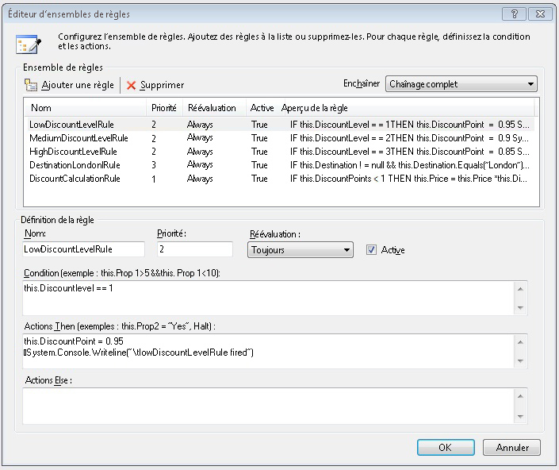
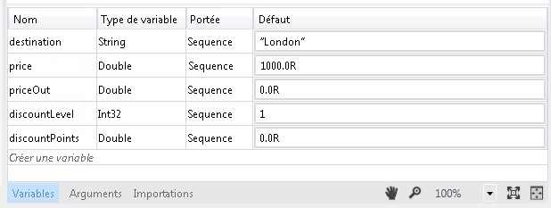
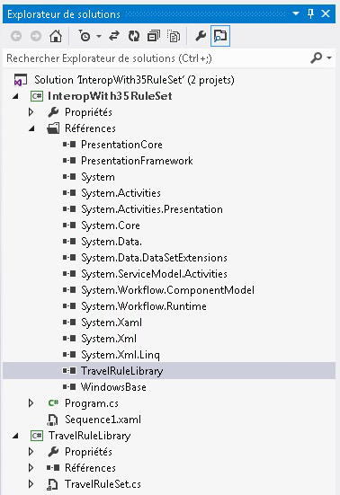
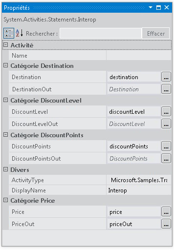

# <a name="interop-with-35-rule-set"></a>Interopérabilité avec l'ensemble de règles 3.5
Cet exemple illustre l’utilisation de la <xref:System.Activities.Statements.Interop> activité qui permet d’intégrer une activité personnalisée dans [!INCLUDE[netfx35_short](../../../../includes/netfx35-short-md.md)] à l’aide de <!--zz <xref:System.Workflow.Activities.Policy> --> `System.Workflow.Activities.Policy` et les règles. Il passe des données à l'activité personnalisée en liant des variables [!INCLUDE[netfx_current_long](../../../../includes/netfx-current-long-md.md)] aux propriétés de dépendance exposées par l'activité personnalisée.  
  
## <a name="requirements"></a>Spécifications  
  
1.  [!INCLUDE[vs_current_long](../../../../includes/vs-current-long-md.md)]  
  
2.  [!INCLUDE[netfx_current_long](../../../../includes/netfx-current-long-md.md)]  
  
3.  [!INCLUDE[netfx35_long](../../../../includes/netfx35-long-md.md)]  
  
## <a name="demonstrates"></a>Démonstrations  
 <xref:System.Activities.Statements.Interop>activité, <!--zz <xref:System.Workflow.Activities.Policy> --> `System.Workflow.Activities.Policy` activité dans [!INCLUDE[netfx35_short](../../../../includes/netfx35-short-md.md)] avec les propriétés de dépendance  
  
## <a name="discussion"></a>Discussion  
 L'exemple illustre l'un des scénarios d'intégration pour l'intégration avec une activité [!INCLUDE[netfx35_short](../../../../includes/netfx35-short-md.md)]. Cet exemple inclut un [!INCLUDE[netfx35_short](../../../../includes/netfx35-short-md.md)] activité personnalisée qui appelle un <!--zz <xref:System.Workflow.Activities.Policy> --> `System.Workflow.Activities.Policy` activité.  
  
## <a name="travelrulelibrary"></a>TravelRuleLibrary  
 L'ouverture de TravelRuleSet.cs dans le concepteur affiche une activité séquentielle personnalisée qui contient une activité Policy telles que la suivante :  
  
   
  
 Double-cliquez sur le **DiscountPolicy** activité pour examiner les règles de stratégie. L'éditeur de règles semble afficher les règles.  
  
   
  
 Avec le bouton droit le **DiscountPolicy** activité et sélectionnez le **afficher le Code** option pour examiner le code-beside code c# qui accède à cette activité. Observez le paramètre de propriété de dépendance pour `DiscountLevel`. Cela est équivalent à un <xref:System.Activities.Argument> dans [!INCLUDE[netfx_current_short](../../../../includes/netfx-current-short-md.md)].  
  
```  
public static DependencyProperty DiscountLevelProperty = DependencyProperty.Register("DiscountLevel", typeof(int), typeof(TravelRuleSet));  
  
[DescriptionAttribute("DiscountLevel")]  
[CategoryAttribute("DiscountLevel Category")]  
[BrowsableAttribute(true)]  
[DesignerSerializationVisibilityAttribute(DesignerSerializationVisibility.Visible)]  
public int DiscountLevel  
{  
   get  
   {  
return ((int)base.GetValue(TravelRuleSet.DiscountLevelProperty)));  
   }  
   set  
   {  
base.SetValue(TravelRuleSet.DiscountLevelProperty, value);  
   }  
}  
```  
  
## <a name="interopwith35ruleset"></a>InteropWith35RuleSet  
 C'est un projet de workflow séquentiel [!INCLUDE[netfx_current_short](../../../../includes/netfx-current-short-md.md)] qui utilise l'activité <xref:System.Activities.Statements.Interop> pour une intégration à l'ensemble de règles personnalisé créé dans le projet TravelRuleLibrary. Les variables sont créées sur le <xref:System.Activities.Statements.Sequence> de niveau supérieur, comme suit.  
  
   
  
   
  
 Pour finir, l'activité <xref:System.Activities.Statements.Interop> est utilisée pour s'intégrer à TravelRuleSet. Les variables qui ont été déclarées précédemment sur <xref:System.Activities.Statements.Sequence> sont utilisées pour créer une liaison aux propriétés de dépendance.  
  
   
  
   
  
   
  
> [!IMPORTANT]
>  Les exemples peuvent déjà être installés sur votre ordinateur. Recherchez le répertoire (par défaut) suivant avant de continuer.  
>   
>  `<InstallDrive>:\WF_WCF_Samples`  
>   
>  Si ce répertoire n’existe pas, accédez à la page [Windows Communication Foundation (WCF) and Windows Workflow Foundation (WF) Samples for .NET Framework 4](http://go.microsoft.com/fwlink/?LinkId=150780) pour télécharger tous les exemples [!INCLUDE[indigo1](../../../../includes/indigo1-md.md)] et [!INCLUDE[wf1](../../../../includes/wf1-md.md)] . Cet exemple se trouve dans le répertoire suivant.  
>   
>  `<InstallDrive>:\WF_WCF_Samples\WF\Basic\Built-InActivities\InteropWith35RuleSet`
