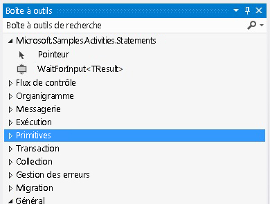

# Activit&#233; Wait For Input
Cet exemple montre comment créer des signets nommés dans un workflow.[!INCLUDE[wf](../../../../includes/wf-md.md)] ne fournit pas d'activité pour la création déclarative de signet.Par conséquent, lorsque vous souhaitez créer un signet dans votre workflow, vous devez écrire une activité personnalisée pour ce faire.L'activité `WaitForInput` définie dans cet exemple fournit cette fonctionnalité afin que les utilisateurs puissent créer des signets de façon déclarative dans un workflow.  
  
## Projets dans cet exemple  
  
||||  
|-|-|-|  
|**Nom du projet**|**Description**|**Fichiers principaux**|  
|WaitForInput|Contient l'activité `WaitForInput` et son concepteur|WaitForInput.cs   Définition de l'activité `WaitForInput`.|  
|||WaitForInputDesigner.xaml   Concepteur personnalisé pour l'activité `WaitForInput`.|  
|||TypeToFirstGenericArgumentConverter.cs   Convertisseur de type WPF utilisé pour mettre à jour le type générique de l'activité dans le concepteur.|  
|WaitForInputTestClient|Exemple d'application cliente qui configure et exécute un workflow à l'aide de plusieurs activités WaitForInput utilisant le concepteur de workflow.|Sequence1.xaml   Workflow séquentiel qui utilise l'activité `WaitForInput`.|  
|||Program.cs   Exécute une instance du workflow définie dans Sequence1.xaml.|  
  
## Activité WaitForInput  
 L'activité `WaitForInput` crée un signet nommé dans un workflow.Le signet attend un signal et reçoit des données de son type configuré.Une fois le signet repris, les données passées dans le workflow sont disponibles via la propriété `Result`.  
  
 L'activité `WaitForInput` dérive de la classe <xref:System.Activities.NativeActivity> parce qu'elle doit créer des signets, qui sont accessibles uniquement via la classe <xref:System.Activities.NativeActivityContext>.  
  
 Trois attributs sont appliqués à l'activité pour la liaison d'un concepteur, l'ajout de la fonctionnalité d'argument générique qui peut être mise à jour et l'affectation au type générique par défaut de la valeur de chaîne.L'activité a également les arguments répertoriés dans le tableau suivant.  
  
||||  
|-|-|-|  
|**Nom**|**Type**|**Description**|  
|TResult|Argument générique \(TResult\)|Type du signet.Il s'agit du type des données à passer au signet lors de la reprise.|  
|BookmarkName|InArgument\<chaîne\>|Nom du signet.|  
|Résultat|InArgument\<TResult\>|Données passées à l'activité lorsque le signet est repris.|  
  
## Concepteur d'activités WaitForInput  
 Le concepteur d'activités `WaitForInput` est implémenté dans le fichier WaitForInputDesigner.xaml.L'activité `WaitForInput` et son concepteur sont inclus dans le même assembly.Le graphique suivant affiche l'activité `WaitForInput` dans la boîte à outils dans une catégorie qui a le même nom que l'assembly.  
  
   
  
 Le graphique suivant affiche le concepteur `WaitForInput`.Étant donné que l'activité `WaitForInput` est très basique, le concepteur permet de définir tous ses arguments directement sur l'aire du concepteur.  
  
   
  
#### Pour utiliser cet exemple  
  
1.  À l'aide de [!INCLUDE[vs2010](../../../../includes/vs2010-md.md)], ouvrez le fichier WaitForInput.sln.  
  
2.  Pour générer la solution, appuyez sur Ctrl\+Maj\+B.  
  
3.  Pour démarrer l'exemple sans débogage, appuyez sur CTRL\+F5.  
  
> [!IMPORTANT]
>  Les exemples peuvent déjà être installés sur votre ordinateur.Recherchez le répertoire \(par défaut\) suivant avant de continuer.  
>   
>  `<LecteurInstall>:\WF_WCF_Samples`  
>   
>  Si ce répertoire n'existe pas, rendez\-vous sur la page \(éventuellement en anglais\) des [exemples Windows Communication Foundation \(WCF\) et Windows Workflow Foundation \(WF\) pour .NET Framework 4](http://go.microsoft.com/fwlink/?LinkId=150780) pour télécharger tous les exemples [!INCLUDE[indigo1](../../../../includes/indigo1-md.md)] et [!INCLUDE[wf1](../../../../includes/wf1-md.md)].Cet exemple se trouve dans le répertoire suivant.  
>   
>  `<LecteurInstall>:\WF_WCF_Samples\WF\Scenario\ActivityLibrary\WaitForInput`  
  
## Voir aussi