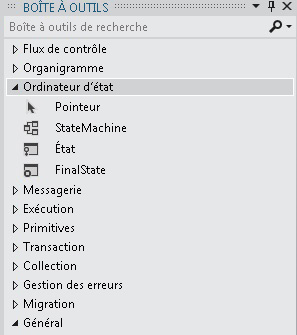

# Workflows d'ordinateur d'étatState Machine Workflows
Une machine à états représente un paradigme connu pour développer des programmes.A state machine is a well-known paradigm for developing programs. L'activité <xref:System.Activities.Statements.StateMachine>, avec <xref:System.Activities.Statements.State>, <xref:System.Activities.Statements.Transition>, et d'autres activités peut être utilisée pour générer des programmes de workflow de machine à états.The <xref:System.Activities.Statements.StateMachine> activity, along with <xref:System.Activities.Statements.State>, <xref:System.Activities.Statements.Transition>, and other activities can be used to build state machine workflow programs. Cette rubrique fournit une vue d'ensemble de la création des workflows de machine à états.This topic provides an overview of creating state machine workflows.  
  
## Présentation du workflow de machine à étatsState Machine Workflow Overview  
 Les workflows de machine à états fournissent un style de modélisation avec lequel vous pouvez modéliser votre workflow de façon pilotée par événements.State machine workflows provide a modeling style with which you can model your workflow in an event-driven manner. Une activité <xref:System.Activities.Statements.StateMachine> contient les états et les transitions qui composent la logique de la machine à états, et peut être utilisée partout où une activité peut être utilisée.A <xref:System.Activities.Statements.StateMachine> activity contains the states and transitions that make up the logic of the state machine, and can be used anywhere an activity can be used. Il existe plusieurs classes dans le runtime de machine à états :There are several classes in the state machine runtime:  
  
-   <xref:System.Activities.Statements.StateMachine>  
  
-   <xref:System.Activities.Statements.State>  
  
-   <xref:System.Activities.Statements.Transition>  
  
 Pour créer un workflow de machine à états, les états sont ajoutés à une activité <xref:System.Activities.Statements.StateMachine>, et les transitions sont utilisées pour contrôler le flux entre les états.To create a state machine workflow, states are added to a <xref:System.Activities.Statements.StateMachine> activity, and transitions are used control the flow between states. La capture d’écran suivante, à partir de la [Getting Started Tutorial](../../../docs/framework/windows-workflow-foundation/getting-started-tutorial.md) étape [Comment : créer un Workflow de Machine d’état](../../../docs/framework/windows-workflow-foundation/how-to-create-a-state-machine-workflow.md), affiche un workflow de machine d’état avec trois états et transitions de trois.The following screenshot, from the [Getting Started Tutorial](../../../docs/framework/windows-workflow-foundation/getting-started-tutorial.md) step [How to: Create a State Machine Workflow](../../../docs/framework/windows-workflow-foundation/how-to-create-a-state-machine-workflow.md), shows a state machine workflow with three states and three transitions. **Initialize Target** est l’état initial et représente le premier état dans le flux de travail.**Initialize Target** is the initial state and represents the first state in the workflow. Cela est indiqué par la ligne de début à partir du **Démarrer** nœud.This is designated by the line leading to it from the **Start** node. L’état final dans le flux de travail est nommé **FinalState**et représente le point auquel le flux de travail est terminé.The final state in the workflow is named **FinalState**, and represents the point at which the workflow is completed.  
  
   
  
 Un workflow de machine à états ne doit avoir qu'un seul état initial, et au moins un état final.A state machine workflow must have one and only one initial state, and at least one final state. Chaque état qui n'est pas un état final doit avoir au moins une transition.Each state that is not a final state must have at least one transition. Les sections suivantes décrivent la création et la configuration des états et des transitions.The following sections cover creating and configuring states and transitions.  
  
## Création et configuration d'étatsCreating and Configuring States  
 Un <xref:System.Activities.Statements.State> représente un état dans lequel une machine à états peut être.A <xref:System.Activities.Statements.State> represents a state in which a state machine can be in. Pour ajouter un <xref:System.Activities.Statements.State> à un workflow, faites glisser le **état** Concepteur d’activités de le **Machine à états** section de la **boîte à outils** et déposez-le sur une <xref:System.Activities.Statements.StateMachine> activité sur le [!INCLUDE[wfd1](../../../includes/wfd1-md.md)] surface.To add a <xref:System.Activities.Statements.State> to a workflow, drag the **State** activity designer from the **State Machine** section of the **Toolbox** and drop it onto a <xref:System.Activities.Statements.StateMachine> activity on the [!INCLUDE[wfd1](../../../includes/wfd1-md.md)] surface.  
  
   
  
 Pour configurer un état en tant que le **état Initial**, avec le bouton droit de l’état et sélectionnez **définir comme état Initial**.To configure a state as the **Initial State**, right-click the state and select **Set as Initial State**. En outre, s’il n’existe aucun état initial actuel, l’état initial peut être désigné en faisant glisser une ligne à partir de la **Démarrer** nœud en haut du flux de travail à l’état souhaité.Additionally, if there is no current initial state, the initial state can be designated by dragging a line from the **Start** node at the top of the workflow to the desired state. Lorsqu’un <xref:System.Activities.Statements.StateMachine> activité est déposée dans le Concepteur de flux de travail, elle est préconfigurée avec un premier état nommé **State1**.When a <xref:System.Activities.Statements.StateMachine> activity is dropped onto the workflow designer, it is pre-configured with an initial state named **State1**. Un workflow de machine à états ne doit avoir qu'un seul état initial.A state machine workflow must have one and only one initial state.  
  
 Un état qui représente un état d'arrêt dans une machine à états est appelé un état final.A state that represents a terminating state in a state machine is called a final state. Un état final est un état dont la propriété <xref:System.Activities.Statements.State.IsFinal%2A> a la valeur `true`, n'a aucune activité <xref:System.Activities.Statements.State.Exit%2A>, et aucune transition provenant de cette dernière.A final state is a state that has its <xref:System.Activities.Statements.State.IsFinal%2A> property set to `true`, has no <xref:System.Activities.Statements.State.Exit%2A> activity, and no transitions originating from it. Pour ajouter un état final à un workflow, faites glisser un **FinalState** Concepteur d’activités à partir de la **Machine à états** section de la **boîte à outils** et déposez-le sur une <xref:System.Activities.Statements.StateMachine> activité sur le [!INCLUDE[wfd1](../../../includes/wfd1-md.md)] surface.To add a final state to a workflow, drag a **FinalState** activity designer from the **State Machine** section of the **Toolbox** and drop it onto a <xref:System.Activities.Statements.StateMachine> activity on the [!INCLUDE[wfd1](../../../includes/wfd1-md.md)] surface. Un workflow de machine à états doit avoir au moins un état final.A state machine workflow must have at least one final state.  
  
### Configurer les actions d'entrée et de sortieConfiguring Entry and Exit Actions  
 Un état peut avoir une propriété <xref:System.Activities.Statements.State.Entry%2A> et une action <xref:System.Activities.Statements.State.Exit%2A>.A state can have an <xref:System.Activities.Statements.State.Entry%2A> and an <xref:System.Activities.Statements.State.Exit%2A> action. (Un état configuré comme état final ne peut avoir qu'une action d'entrée.)(A state configured as a final state may have only an entry action). Lorsqu'une instance du workflow entre dans un état, toutes les activités de l'action d'entrée s'exécutent.When a workflow instance enters a state, any activities in the entry action execute. Lorsque l'action d'entrée est terminée, les déclencheurs pour les transitions de l'état sont planifiés.When the entry action is complete, the triggers for the state’s transitions are scheduled. Lorsqu'une transition vers un autre état est validée, les activités de l'action de sortie sont exécutées, même si l'état revient au même état.When a transition to another state is confirmed, the activities in the exit action are executed, even if the state transitions back to the same state. Une fois que l'action de sortie est terminée, les activités dans l'action de transition s'exécutent, et le nouvel état est passé, puis ses actions d'entrée sont planifiées.After the exit action completes, the activities in the transition’s action execute, and then the new state is transitioned to, and its entry actions are scheduled.  
  
> [!NOTE]
>  Lors du débogage d'un workflow de machine à états, les points d'arrêt peuvent être placés sur l'activité de machine à états racine et les états dans le workflow de machine à états.When debugging a state machine workflow, breakpoints can be placed on the root state machine activity and states within the state machine workflow. Les points d'arrêt ne peuvent pas être placés directement sur les transitions, mais ils peuvent être placés sur toutes les activités contenues dans les états et les transitions.Breakpoints may not be placed directly on the transitions, but they may be placed on any activities contained within the states and transitions.  
  
## Création et configuration de transitionsCreating and Configuring Transitions  
 Tous les états doivent avoir au moins une transition, à l'exception d'un état final qui peut ne pas avoir de transitions.All states must have at least one transition, except for a final state which may not have any transitions. Des transitions peuvent être ajoutées après ajout d’un état à un workflow de machine à états, ou elles peuvent être créées à mesure que l’état est déposé.Transitions may be added after a state is added to a state machine workflow, or they can be created as the state is dropped.  
  
 Pour ajouter un <xref:System.Activities.Statements.State> et créer une transition en une seule étape, faites glisser un **état** activité à partir de la **Machine à états** section de la **boîte à outils** et placez-la sur un autre état dans le Concepteur de flux de travail.To add a <xref:System.Activities.Statements.State> and create a transition in one step, drag a **State** activity from the **State Machine** section of the **Toolbox** and hover it over another state in the workflow designer. Lorsque le <xref:System.Activities.Statements.State> est déplacé vers un autre <xref:System.Activities.Statements.State>, quatre triangles apparaissent autour de l'autre <xref:System.Activities.Statements.State>.When the dragged <xref:System.Activities.Statements.State> is over another <xref:System.Activities.Statements.State>, four triangles will appear around the other <xref:System.Activities.Statements.State>. Si <xref:System.Activities.Statements.State> est déposé sur un des quatre triangles, il est ajouté à la machine à états et une transition est créée à partir du <xref:System.Activities.Statements.State> source vers le <xref:System.Activities.Statements.State> de destination de dépôt.If the <xref:System.Activities.Statements.State> is dropped onto one of the four triangles, it is added to the state machine and a transition is created from the source <xref:System.Activities.Statements.State> to the dropped destination <xref:System.Activities.Statements.State>. Pour plus d’informations, consultez [Concepteur d’activités Transition](/visualstudio/workflow-designer/transition-activity-designer).For more information, see [Transition Activity Designer](/visualstudio/workflow-designer/transition-activity-designer).  
  
 Pour créer une transition après ajout d'un état, il existe deux options.To create a transition after a state is added, there are two options. La première option consiste à faire glisser l'état depuis l'aire du concepteur de workflow et à le placer sur un état existant, puis à le déposer sur l'un des points de dépôt.The first option is to drag the state from the workflow designer surface and hover it over an existing state and drop it on one of the drop points. Elle est très similaire à la méthode décrite dans la section précédente.This is very similar to the method described in the previous section. Vous pouvez également pointer la souris sur l'état source souhaité, et faire glisser une ligne vers l'état de destination souhaité.You can also hover the mouse over the desired source state, and drag a line to the desired destination state.  
  
> [!NOTE]
>  Un seul état dans une machine à états peut contenir jusqu'à 76 transitions créées à l'aide du concepteur de workflow.A single state in a state machine can have up to 76 transitions created using the workflow designer. Le nombre maximal de transitions d'un état pour les workflows créés en dehors du concepteur est limité uniquement par les ressources système.The limit on transitions for a state for workflows created outside the designer is limited only by system resources.  
  
 Une transition peut avoir un <xref:System.Activities.Statements.Transition.Trigger%2A>, un <xref:System.Activities.Statements.Transition.Condition%2A> et un <xref:System.Activities.Statements.Transition.Action%2A>.A transition may have a <xref:System.Activities.Statements.Transition.Trigger%2A>, a <xref:System.Activities.Statements.Transition.Condition%2A>, and an <xref:System.Activities.Statements.Transition.Action%2A>. Le <xref:System.Activities.Statements.Transition.Trigger%2A> d'une transition est planifié lorsque l'action <xref:System.Activities.Statements.State.Entry%2A> de l'état source de la transition est terminée.A transition’s <xref:System.Activities.Statements.Transition.Trigger%2A> is scheduled when the transition’s source state’s <xref:System.Activities.Statements.State.Entry%2A> action is complete. En général, <xref:System.Activities.Statements.Transition.Trigger%2A> est une activité qui attend qu'un type d'événement se produise, mais il peut s'agir de n'importe quelle activité, ou d'aucune activité.Typically the <xref:System.Activities.Statements.Transition.Trigger%2A> is an activity that waits for some type of event to occur, but it can be any activity, or no activity at all. Une fois que l'activité <xref:System.Activities.Statements.Transition.Trigger%2A> est terminée, <xref:System.Activities.Statements.Transition.Condition%2A>, le cas échéant, est évalué.Once the <xref:System.Activities.Statements.Transition.Trigger%2A> activity is complete, the <xref:System.Activities.Statements.Transition.Condition%2A>, if present, is evaluated. S'il n'existe aucune activité <xref:System.Activities.Statements.Transition.Trigger%2A>, <xref:System.Activities.Statements.Transition.Condition%2A> est évalué immédiatement.If there is no <xref:System.Activities.Statements.Transition.Trigger%2A> activity then the <xref:System.Activities.Statements.Transition.Condition%2A> is immediately evaluated. Si la condition a la valeur `false`, la transition est annulée, et l'activité <xref:System.Activities.Statements.Transition.Trigger%2A> de toutes les transitions de l'état est replanifiée.If the condition evaluates to `false`, the transition is cancelled, and the <xref:System.Activities.Statements.Transition.Trigger%2A> activity for all transitions from the state are rescheduled. S'il existe d'autres transitions qui partagent le même état source que la transition actuelle, ces actions <xref:System.Activities.Statements.Transition.Trigger%2A> sont également annulées et replanifiées.If there are other transitions that share the same source state as the current transition, those <xref:System.Activities.Statements.Transition.Trigger%2A> actions are cancelled and rescheduled as well. Si <xref:System.Activities.Statements.Transition.Condition%2A> a la valeur `true`, ou s'il n'existe aucune condition, l'action <xref:System.Activities.Statements.State.Exit%2A> de l'état source est exécutée, puis le <xref:System.Activities.Statements.Transition.Action%2A> de la transition est exécuté.If the <xref:System.Activities.Statements.Transition.Condition%2A> evaluates to `true`, or there is no condition, then the <xref:System.Activities.Statements.State.Exit%2A> action of the source state is executed, and then the <xref:System.Activities.Statements.Transition.Action%2A> of the transition is executed. Lorsque le <xref:System.Activities.Statements.Transition.Action%2A> terminée, le contrôle passe à la **cible** étatWhen the <xref:System.Activities.Statements.Transition.Action%2A> completes, control passes to the **Target** state  
  
 Les transitions qui partagent un déclencheur commun sont appelées transitions de déclencheur partagées.Transitions that share a common trigger are known as shared trigger transitions. Chaque transition d'un groupe de transitions de déclencheur partagé a le même déclencheur, mais un <xref:System.Activities.Statements.Transition.Condition%2A> et une action uniques.Each transition in a group of shared trigger transitions has the same trigger, but a unique <xref:System.Activities.Statements.Transition.Condition%2A> and Action. Pour ajouter des actions supplémentaires à une transition et créer une transition partagée, cliquez sur le cercle qui indique le début de la transition souhaitée et faites-le glisser vers l'état souhaité.To add additional actions to a transition and create a shared transition, click the circle that indicates the start of the desired transition and drag it to the desired state. La nouvelle transition partagera le même déclencheur que la transition d'origine, mais elle aura une condition et une action uniques.The new transition will share a same trigger as the initial transition, but it will have a unique condition and action. Des transitions partagées peuvent également être créées à partir du Concepteur de transition en cliquant sur **ajouter une transition de déclencheur partagée** au bas du Concepteur de transition, puis en sélectionnant l’état cible souhaité dans le  **Les états disponibles pour la connexion** liste déroulante.Shared transitions can also be created from within the transition designer by clicking **Add shared trigger transition** at the bottom of the transition designer, and then selecting the desired target state from the **Available states to connect** drop-down.  
  
> [!NOTE]
>  Notez que si la condition <xref:System.Activities.Statements.Transition.Condition%2A> d'une transition a pour valeur `False` (ou si toutes les conditions d'une transition de déclencheur partagée ont la valeur `False`), la transition n'a pas lieu et tous les déclencheurs de toutes les transitions de l'état sont replanifiés.Note that if the <xref:System.Activities.Statements.Transition.Condition%2A> of a transition evaluates to `False` (or all of the conditions of a shared trigger transition evaluate to `False`), the transition will not occur and all triggers for all the transitions from the state will be rescheduled.  
  
 Pour plus d’informations sur la création de workflows d’ordinateur d’état, consultez [Comment : créer un Workflow de Machine d’état](../../../docs/framework/windows-workflow-foundation/how-to-create-a-state-machine-workflow.md), [Concepteur d’activités StateMachine](/visualstudio/workflow-designer/statemachine-activity-designer), [Concepteur d’activités état](/visualstudio/workflow-designer/state-activity-designer), [Concepteur d’activités FinalState](/visualstudio/workflow-designer/finalstate-activity-designer), et [Concepteur d’activités de Transition](/visualstudio/workflow-designer/transition-activity-designer).For more information on creating state machine workflows, see [How to: Create a State Machine Workflow](../../../docs/framework/windows-workflow-foundation/how-to-create-a-state-machine-workflow.md), [StateMachine Activity Designer](/visualstudio/workflow-designer/statemachine-activity-designer), [State Activity Designer](/visualstudio/workflow-designer/state-activity-designer), [FinalState Activity Designer](/visualstudio/workflow-designer/finalstate-activity-designer), and [Transition Activity Designer](/visualstudio/workflow-designer/transition-activity-designer).  
  
## Terminologie de machine à étatsState Machine Terminology  
 Cette section explique la terminologie de machine à états utilisée dans cette rubrique.This section defines the state machine vocabulary used throughout this topic.  
  
 ÉtatState  
 Unité de base qui constitue une machine à états.The basic unit that composes a state machine. Une machine à états peut être dans un état à un moment donné.A state machine can be in one state at any particular time.  
  
 Action d'entréeEntry Action  
 Activité exécutée lors de la transition à l'étatAn activity executed when entering the state  
  
 Action de sortieExit Action  
 Activité exécutée lors de la sortie de l'étatAn activity executed when exiting the state  
  
 TransitionTransition  
 Relation directe entre deux états qui représente la réponse complète d'une machine à états à une occurrence d'un événement d'un type particulier.A directed relationship between two states which represents the complete response of a state machine to an occurrence of an event of a particular type.  
  
 Transition partagéeShared Transition  
 Transition qui partage un état source et un déclencheur avec une ou plusieurs transitions, mais qui possède une condition et une action uniques.A transition that shares a source state and trigger with one or more transitions, but has a unique condition and action.  
  
 DéclencheurTrigger  
 Activité de déclenchement qui provoque une transition.A triggering activity that causes a transition to occur.  
  
 ConditionCondition  
 Contrainte qui doit avoir la valeur `true` après l'exécution du déclencheur de sorte que la transition se termine.A constraint which must evaluate to `true` after the trigger occurs in order for the transition to complete.  
  
 Action de transitionTransition Action  
 Activité qui est exécutée lors de l'exécution d'une certaine transition.An activity which is executed when performing a certain transition.  
  
 Transition conditionnelleConditional Transition  
 Transition avec une condition explicite.A transition with an explicit condition.  
  
 TransitionSelf-transition  
 Transition qui passe d'un état à elle-même.A transition which transits from a state to itself.  
  
 État initialInitial State  
 État qui représente le point de départ de la machine à états.A state which represents the starting point of the state machine.  
  
 État finalFinal State  
 État qui représente l'achèvement de la machine à états.A state which represents the completion of the state machine.  
  
## Voir aussiSee Also  
 [Guide pratique pour créer un workflow de machine à étatsHow to: Create a State Machine Workflow](../../../docs/framework/windows-workflow-foundation/how-to-create-a-state-machine-workflow.md)  
 [Concepteur d’activités StateMachineStateMachine Activity Designer](/visualstudio/workflow-designer/statemachine-activity-designer)  
 [Concepteur d’activités StateState Activity Designer](/visualstudio/workflow-designer/state-activity-designer)  
 [Concepteur d’activités FinalStateFinalState Activity Designer](/visualstudio/workflow-designer/finalstate-activity-designer)  
 [Concepteur d’activités TransitionTransition Activity Designer](/visualstudio/workflow-designer/transition-activity-designer)
