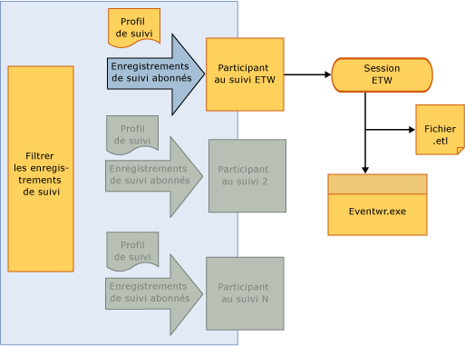

# <a name="tracking-participants"></a>Participants de suivi
Les participants de traçage sont des points d'extensibilité qui permettent à un développeur de workflow d'accéder aux objets <xref:System.Activities.Tracking.InteropTrackingRecord.TrackingRecord%2A> et de les traiter. [!INCLUDE[netfx_current_long](../../../includes/netfx-current-long-md.md)] inclut un participant de trace standard qui écrit des enregistrements de suivi en tant qu'événements de suivi d'événements pour Windows (ETW). Si cela ne répond pas à vos besoins, vous pouvez également écrire un participant de suivi personnalisé.  
  
## <a name="tracking-participants"></a>Participants de suivi  
 L'infrastructure de suivi permet l'application d'un filtre sur les enregistrements de suivi sortants pour permettre à un participant de s'abonner à un sous-ensemble des enregistrements. L'application d'un filtre s'effectue par l'intermédiaire d'un modèle de suivi.  
  
 [!INCLUDE[wf](../../../includes/wf-md.md)] dans [!INCLUDE[netfx_current_short](../../../includes/netfx-current-short-md.md)] fournit un participant de suivi qui écrit les enregistrements de suivi dans une session ETW. Le participant est configuré sur un service de flux de travail en ajoutant un comportement spécifique au suivi dans un fichier de configuration. L'activation d'un participant au suivi ETW permet d'afficher les enregistrements de suivi dans l'Observateur d'événements. L'exemple du Kit de développement logiciel pour le suivi ETW constitue un bon moyen de se familiariser avec le suivi WF à l'aide du participant de suivi ETW.  
  
## <a name="etw-tracking-participant"></a>Participant de suivi ETW  
 [!INCLUDE[netfx_current_short](../../../includes/netfx-current-short-md.md)] inclut un participant de suivi ETW qui écrit les enregistrements de suivi dans une session ETW. Cette opération est effectuée de façon très efficace avec un impact minimal sur les performances de l'application ou sur le débit du serveur. L'un des avantages de l'utilisation du participant de suivi ETW standard est que les enregistrements de suivi qu'il reçoit peuvent être affichés avec l'autre application et les journaux système dans l'observateur d'événements Windows.  
  
 Le participant de suivi ETW standard est configuré dans le fichier Web.config comme indiqué dans l'exemple suivant.  
  
```xml  
<configuration>  
  <system.web>  
    <compilation debug="true" targetFramework="4.0" />  
  </system.web>  
  <system.serviceModel>  
    <behaviors>  
      <serviceBehaviors>  
        <behavior>  
          <etwTracking profileName="Sample Tracking Profile"/>  
        </behavior>  
      </serviceBehaviors>  
    </behaviors>  
   <tracking>  
      <profiles>  
        <trackingProfile name="Sample Tracking Profile">  
        ….  
       </trackingProfile>  
      </profiles>  
    </tracking>  
  </system.serviceModel>  
</configuration>  
```  
  
> [!NOTE]
>  Si un nom `trackingProfile` n'est pas spécifié, par exemple seulement `<etwTracking/>` ou `<etwTracking profileName=""/>`, le modèle de suivi par défaut installé avec [!INCLUDE[netfx_current_short](../../../includes/netfx-current-short-md.md)] dans le fichier Machine.config est utilisé.  
  
 Dans le fichier Machine.config, le modèle de suivi par défaut s'abonne aux enregistrements et aux erreurs de l'instance de workflow.  
  
 Dans ETW, les événements sont écrits dans la session ETW via un ID de fournisseur. L'ID de fournisseur que le participant de suivi ETW utilise pour écrire les enregistrements de suivi dans ETW est défini dans la section de diagnostic du fichier Web.config (sous `<system.serviceModel><diagnostics>`). Par défaut, le participant de suivi ETW utilise un ID de fournisseur par défaut si aucun ID n'a pas été spécifié, comme le montre l'exemple suivant.  
  
```xml  
<system.serviceModel>  
        <diagnostics etwProviderId="52A3165D-4AD9-405C-B1E8-7D9A257EAC9F" />  
```  
  
 L'illustration suivante montre le flux des données de suivi via le participant de suivi ETW. Une fois que les données de suivi ont atteint la session ETW, il est possible d'y accéder de plusieurs façons. L'observateur d'événements, un outil Windows courant utilisé pour l'affichage des journaux et des suivis provenant d'applications et de services constitue l'un des moyens les plus pratiques pour accéder à ces événements.  
  
   
  
## <a name="tracking-participant-event-data"></a>Données d'événement des participants de suivi  
 Un participant de suivi sérialise les données d'événement ayant fait l'objet d'un suivi dans une session ETW sous la forme d'un événement par enregistrement de suivi.  Un événement est identifié à l'aide d'un ID compris entre 100 et 199. Pour les définitions de l’événement de suivi enregistrements émis par un participant de suivi, consultez le [référence de suivi des événements](../../../docs/framework/windows-workflow-foundation/tracking-events-reference.md) rubrique.  
  
 La taille d'un événement ETW est limitée par la taille de la mémoire tampon ETW, ou par la charge utile maximale pour un événement ETW, selon la valeur la plus petite. Si la taille de l'événement dépasse l'une ou l'autre de ces limites ETW, l'événement est tronqué et son contenu supprimé de façon arbitraire. Les variables, arguments, annotations et données personnalisées ne sont pas supprimés de manière sélective. Dans le cas de troncation, tous ces éléments sont tronqués indépendamment de la valeur à l'origine du dépassement de la limite ETW.  Les données supprimées sont remplacées par `<item>..<item>`.  
  
 Types complexes dans les variables, arguments et éléments de données personnalisés sont sérialisés à l’enregistrement d’événement ETW à l’aide du [classe NetDataContractSerializer](http://go.microsoft.com/fwlink/?LinkId=177537). Cette classe inclut les informations de type CLR dans le flux XML sérialisé.  
  
 La troncation des données de charge utile en raison de limites ETW peut provoquer l'envoi d'enregistrements de suivi en double à une session ETW. Cela peut se produire si plusieurs sessions écoutent les événements et si ces sessions ont des limites de charge utile différentes pour les événements.  
  
 Pour la session ayant la limite inférieure, l'événement peut être tronqué. Le participant de suivi ETW ne connaît pas le nombre de sessions qui écoutent les événements ; si un événement est tronqué pour une session, le participant ETW essaie à nouveau d'envoyer l'événement. Dans ce cas, la session configurée pour accepter une charge utile plus importante recevra l'événement deux fois (l'événement non tronqué et l'événement tronqué). La duplication peut être évitée en configurant toutes les sessions ETW avec les mêmes limites de taille de mémoire tampon.  
  
## <a name="accessing-tracking-data-from-an-etw-participant-in-the-event-viewer"></a>Accès aux données de suivi d'un participant ETW dans l'observateur d'événements  
 Les événements écrits dans une session ETW par le participant de suivi ETW sont accessibles par le biais de l'observateur d'événements (lors de l'utilisation de l'ID de fournisseur par défaut). Cela permet d'afficher rapidement les enregistrements de suivi émis par le workflow.  
  
> [!NOTE]
>  Les événements d'enregistrement de suivi émis vers une session ETW utilisent des ID d'événement compris entre 100 et 199.  
  
#### <a name="to-enable-viewing-the-tracking-records-in-event-viewer"></a>Pour activer l'affichage des enregistrements de suivi dans l'observateur d'événements  
  
1.  Démarrez l'observateur d'événements (EVENTVWR.EXE).  
  
2.  Sélectionnez **Observateur d’événements, les Applications et les journaux des Services Microsoft, Windows, serveur d’applications-Applications**.  
  
3.  Avec le bouton droit et vérifiez que **affichage, afficher les journaux d’analyse et débogage** est sélectionnée. Si tel n'est pas le cas, activez cette case à cocher de façon à ce que la coche apparaisse en regard de celle-ci. Cela permet d’afficher le **analyse**, **Perf**, et **déboguer** journaux.  
  
4.  Cliquez sur le **analyse** et sélectionnez **activer le journal**. Le journal existera dans le fichier %SystemRoot%\System32\Winevt\Logs\Microsoft-Windows-Application Server-Applications%4Analytic.etl.  
  
## <a name="custom-tracking-participant"></a>Participant de suivi personnalisé  
 L'API de participant de suivi permet d'étendre l'exécution du suivi avec un participant de suivi fourni par l'utilisateur, qui peut inclure une logique personnalisée permettant de gérer les enregistrements de suivi émis par l'exécution du workflow. Pour écrire un participant de suivi personnalisé, le développeur doit implémenter la méthode `Track` sur la classe <xref:System.Activities.Tracking.TrackingParticipant>. Cette méthode est appelée lorsqu'un enregistrement de suivi est émis par l'exécution du workflow.  
  
 Les participants de suivi dérivent de la classe <xref:System.Activities.Tracking.TrackingParticipant>. Le <xref:System.Activities.Tracking.EtwTrackingParticipant> fourni par le système émet un événement de suivi des événements pour Windows pour chaque enregistrement de suivi reçu. Pour créer un participant de suivi personnalisé, une classe qui dérive de <xref:System.Activities.Tracking.TrackingParticipant> est créée. Pour fournir des fonctionnalités de suivi de base, substituez <xref:System.Activities.Tracking.TrackingParticipant.Track%2A>. La méthode <xref:System.Activities.Tracking.TrackingParticipant.Track%2A> est appelée lorsqu'un enregistrement de suivi est transmis par l'exécution et qu'il peut être traité de la manière souhaitée. Dans l'exemple suivant, une classe de participant de suivi personnalisé émettant tous les enregistrements de suivi vers la fenêtre de console est définie. Vous pouvez également implémenter un objet <xref:System.Activities.Tracking.TrackingParticipant> qui traite les enregistrements de suivi de façon asynchrone à l'aide de ses méthodes `BeginTrack` et `EndTrack`.  
  
```csharp  
class ConsoleTrackingParticipant : TrackingParticipant  
{  
    protected override void Track(TrackingRecord record, TimeSpan timeout)  
    {  
        if (record != null)  
        {  
            Console.WriteLine("=================================");  
            Console.WriteLine(record);  
        }  
    }  
}  
```  
  
 Pour utiliser un participant de suivi particulier, enregistrez-le avec l'instance de workflow que vous souhaitez suivre, comme indiqué dans l'exemple suivant.  
  
```csharp  
myInstance.Extensions.Add(new ConsoleTrackingParticipant());  
```  
  
 Dans l'exemple suivant, un workflow consistant en une activité <xref:System.Activities.Statements.Sequence> qui contient une activité <xref:System.Activities.Statements.WriteLine> est créé. `ConsoleTrackingParticipant` est ajouté aux extensions et le workflow est appelé.  
  
```csharp  
Activity activity= new Sequence()  
{  
    Activities =  
    {  
        new WriteLine()  
        {  
            Text = "Hello World."  
        }  
    }  
};  
  
WorkflowApplication instance = new WorkflowApplication(activity);  
  
instance.Extensions.Add(new ConsoleTrackingParticipant());  
  instance.Completed = delegate(WorkflowApplicationCompletedEventArgs e)  
            {  
                Console.WriteLine("workflow instance completed, Id = " + instance.Id);  
                resetEvent.Set();  
            };  
            instance.Run();  
            Console.ReadLine();  
```  
  
## <a name="see-also"></a>Voir aussi  
 [Analyse de Windows Server App Fabric](http://go.microsoft.com/fwlink/?LinkId=201273)  
 [Analyse des Applications avec AppFabric](http://go.microsoft.com/fwlink/?LinkId=201275)
