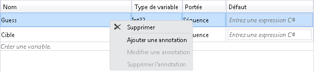
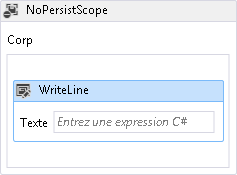
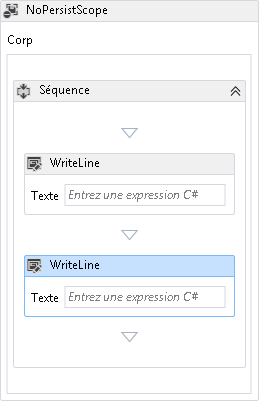
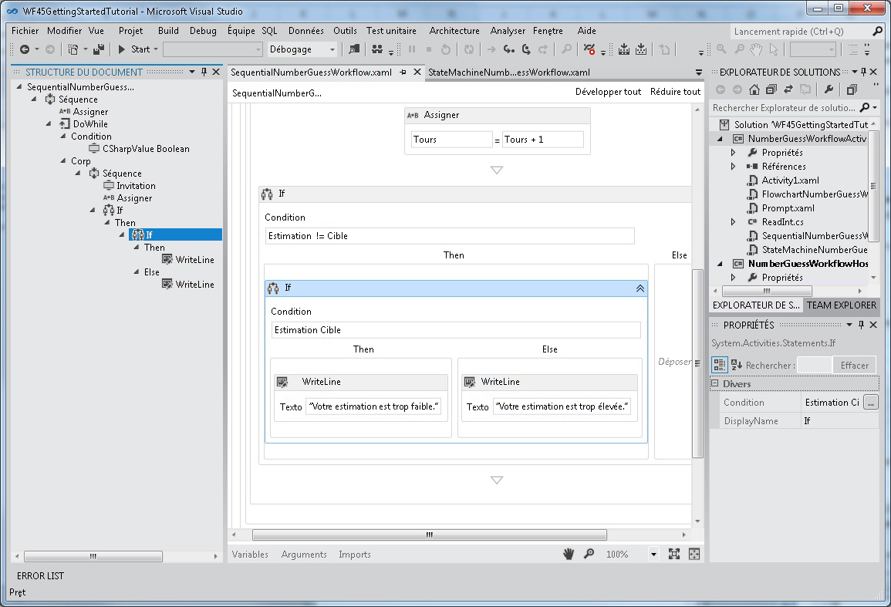
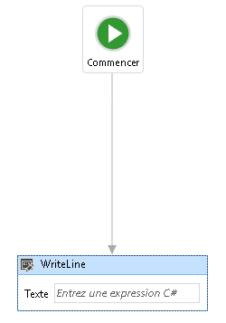
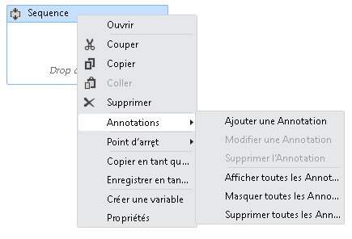
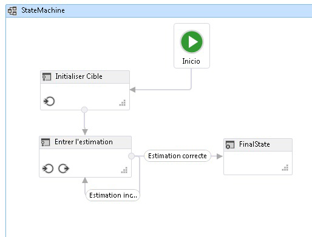

# <a name="what39s-new-in-windows-workflow-foundation-in-net-45"></a><span data-ttu-id="5cfe4-102">Quel &#39; nouveauté dans Windows Workflow Foundation dans .NET 4.5</span><span class="sxs-lookup"><span data-stu-id="5cfe4-102">What&#39;s New in Windows Workflow Foundation in .NET 4.5</span></span>
[!INCLUDE[wf](../../../includes/wf-md.md)]<span data-ttu-id="5cfe4-103"> dans le [!INCLUDE[net_v45](../../../includes/net-v45-md.md)] possède de nombreuses nouvelles fonctionnalités, telles que de nouvelles activités, fonctions du concepteur et modèles de développement de workflow.</span><span class="sxs-lookup"><span data-stu-id="5cfe4-103"> in [!INCLUDE[net_v45](../../../includes/net-v45-md.md)] introduces many new features, such as new activities, designer capabilities, and workflow development models.</span></span> <span data-ttu-id="5cfe4-104">Nombre des nouvelles fonctionnalités de workflow introduites dans [!INCLUDE[net_v45](../../../includes/net-v45-md.md)] sont prises en charge dans le concepteur de workflow réhébergé.</span><span class="sxs-lookup"><span data-stu-id="5cfe4-104">Many, but not all, of the new workflow features introduced in [!INCLUDE[net_v45](../../../includes/net-v45-md.md)] are supported in the re-hosted workflow designer.</span></span> [!INCLUDE[crabout](../../../includes/crabout-md.md)]<span data-ttu-id="5cfe4-105">les nouvelles fonctionnalités qui sont prises en charge, consultez [prise en charge de nouvelles Workflow Foundation 4.5 dans le Concepteur de Workflow réhébergés](../../../docs/framework/windows-workflow-foundation/wf-features-in-the-rehosted-workflow-designer.md).</span><span class="sxs-lookup"><span data-stu-id="5cfe4-105"> the new features that are supported, see [Support for New Workflow Foundation 4.5 Features in the Rehosted Workflow Designer](../../../docs/framework/windows-workflow-foundation/wf-features-in-the-rehosted-workflow-designer.md).</span></span> [!INCLUDE[crabout](../../../includes/crabout-md.md)]<span data-ttu-id="5cfe4-106">migration de .NET 3.0 et 3.5 de .NET des applications de workflow à utiliser la version la plus récente, consultez [conseils de Migration](../../../docs/framework/windows-workflow-foundation/migration-guidance.md).</span><span class="sxs-lookup"><span data-stu-id="5cfe4-106"> migrating .NET 3.0 and .NET 3.5 workflow applications to use the latest version, see [Migration Guidance](../../../docs/framework/windows-workflow-foundation/migration-guidance.md).</span></span> <span data-ttu-id="5cfe4-107">Cette rubrique fournit une vue d'ensemble des nouvelles fonctionnalités de workflow introduites dans [!INCLUDE[net_v45](../../../includes/net-v45-md.md)].</span><span class="sxs-lookup"><span data-stu-id="5cfe4-107">This topic provides an overview of the new workflow features introduced in [!INCLUDE[net_v45](../../../includes/net-v45-md.md)].</span></span>  
  
> [!WARNING]
>  <span data-ttu-id="5cfe4-108">Les nouvelles fonctionnalités [!INCLUDE[wf2](../../../includes/wf2-md.md)] introduites dans [!INCLUDE[net_v45](../../../includes/net-v45-md.md)] ne sont pas disponibles pour les projets qui ciblent les versions antérieures du .NET Framework.</span><span class="sxs-lookup"><span data-stu-id="5cfe4-108">The new [!INCLUDE[wf2](../../../includes/wf2-md.md)] features introduced in [!INCLUDE[net_v45](../../../includes/net-v45-md.md)] are not available for projects that target previous versions of the framework.</span></span> <span data-ttu-id="5cfe4-109">Si un projet qui cible [!INCLUDE[net_v45](../../../includes/net-v45-md.md)] est reciblé vers une version antérieure du .NET Framework, plusieurs problèmes peuvent se produire.</span><span class="sxs-lookup"><span data-stu-id="5cfe4-109">If a project that targets [!INCLUDE[net_v45](../../../includes/net-v45-md.md)] is re-targeted to a previous version of the framework, several issues can occur.</span></span>  
>   
>  -   <span data-ttu-id="5cfe4-110">Les expressions c# seront remplacées dans le concepteur avec le message **valeur a été définie en XAML**.</span><span class="sxs-lookup"><span data-stu-id="5cfe4-110">C# expressions will be replaced in the designer with the message **Value was set in XAML**.</span></span>  
> -   <span data-ttu-id="5cfe4-111">De nombreuses erreurs de build se produisent, y compris l'erreur suivante.</span><span class="sxs-lookup"><span data-stu-id="5cfe4-111">Many build errors will occur, including the following error.</span></span>  
>   
>  <span data-ttu-id="5cfe4-112">**Le format de fichier n’est pas compatible avec le framework cible actuel. Pour convertir le format de fichier, enregistrez-le de manière explicite. Ce message d’erreur disparaîtra une fois que vous enregistrez le fichier et rouvrez le concepteur.**</span><span class="sxs-lookup"><span data-stu-id="5cfe4-112">**The file format is not compatible with current targeting framework. To convert the file format, please explicitly save the file. This error message will go away after you save the file and reopen the designer.**</span></span>  
  
##  <span data-ttu-id="5cfe4-113"><a name="BKMK_Versioning"></a>Contrôle de version de flux de travail</span><span class="sxs-lookup"><span data-stu-id="5cfe4-113"><a name="BKMK_Versioning"></a> Workflow Versioning</span></span>  
 <span data-ttu-id="5cfe4-114">Le [!INCLUDE[net_v45](../../../includes/net-v45-md.md)] présente plusieurs nouvelles fonctionnalités de contrôle de version basées sur la nouvelle classe <xref:System.Activities.WorkflowIdentity>.</span><span class="sxs-lookup"><span data-stu-id="5cfe4-114">[!INCLUDE[net_v45](../../../includes/net-v45-md.md)] introduced several new versioning features based around the new <xref:System.Activities.WorkflowIdentity> class.</span></span> <span data-ttu-id="5cfe4-115"><xref:System.Activities.WorkflowIdentity> fournit aux auteurs d'applications de workflow un mécanisme pour mapper une instance de workflow persistante avec sa définition.</span><span class="sxs-lookup"><span data-stu-id="5cfe4-115"><xref:System.Activities.WorkflowIdentity> provides workflow application authors a mechanism for mapping a persisted workflow instance with its definition.</span></span>  
  
-   <span data-ttu-id="5cfe4-116">Les développeurs qui utilisent l'hébergement <xref:System.Activities.WorkflowApplication> peuvent utiliser <xref:System.Activities.WorkflowIdentity> pour permettre l'hébergement de plusieurs versions d'un workflow côte à côte.</span><span class="sxs-lookup"><span data-stu-id="5cfe4-116">Developers using <xref:System.Activities.WorkflowApplication> hosting can use <xref:System.Activities.WorkflowIdentity> to enable hosting multiple versions of a workflow side-by-side.</span></span> <span data-ttu-id="5cfe4-117">Les instances de workflow persistantes peuvent être chargées à l'aide de la nouvelle classe <xref:System.Activities.WorkflowApplicationInstance>, puis <xref:System.Activities.WorkflowApplicationInstance.DefinitionIdentity%2A> peut être utilisé par l'hôte pour fournir la version appropriée de la définition de workflow en instanciant <xref:System.Activities.WorkflowApplication>.</span><span class="sxs-lookup"><span data-stu-id="5cfe4-117">Persisted workflow instances can be loaded using the new <xref:System.Activities.WorkflowApplicationInstance> class, and then the <xref:System.Activities.WorkflowApplicationInstance.DefinitionIdentity%2A> can be used by the host to provide the correct version of the workflow definition when instantiating the <xref:System.Activities.WorkflowApplication>.</span></span> <span data-ttu-id="5cfe4-118">Pour plus d’informations, consultez [à l’aide de WorkflowIdentity et du Versioning](../../../docs/framework/windows-workflow-foundation/using-workflowidentity-and-versioning.md) et [Comment : hôte de plusieurs Versions d’un Workflow côte à côte](../../../docs/framework/windows-workflow-foundation/how-to-host-multiple-versions-of-a-workflow-side-by-side.md).</span><span class="sxs-lookup"><span data-stu-id="5cfe4-118">For more information, see [Using WorkflowIdentity and Versioning](../../../docs/framework/windows-workflow-foundation/using-workflowidentity-and-versioning.md) and [How to: Host Multiple Versions of a Workflow Side-by-Side](../../../docs/framework/windows-workflow-foundation/how-to-host-multiple-versions-of-a-workflow-side-by-side.md).</span></span>  
  
-   <span data-ttu-id="5cfe4-119"><xref:System.ServiceModel.WorkflowServiceHost> est maintenant un hôte multi-version.</span><span class="sxs-lookup"><span data-stu-id="5cfe4-119"><xref:System.ServiceModel.WorkflowServiceHost> is now a multi-version host.</span></span> <span data-ttu-id="5cfe4-120">Lorsqu'une nouvelle version d'un service de workflow est déployée, les nouvelles instances sont créées à l'aide du nouveau service, mais les instances existantes s'exécutent à l'aide de la version antérieure.</span><span class="sxs-lookup"><span data-stu-id="5cfe4-120">When a new version of a workflow service is deployed, new instances are created using the new service, but existing instances complete using the previous version.</span></span> <span data-ttu-id="5cfe4-121">Pour plus d’informations, consultez [le contrôle de version côte à côte dans WorkflowServiceHost](../../../docs/framework/wcf/feature-details/side-by-side-versioning-in-workflowservicehost.md).</span><span class="sxs-lookup"><span data-stu-id="5cfe4-121">For more information, see [Side by Side Versioning in WorkflowServiceHost](../../../docs/framework/wcf/feature-details/side-by-side-versioning-in-workflowservicehost.md).</span></span>  
  
-   <span data-ttu-id="5cfe4-122">Cette rubrique présente la mise à jour dynamique qui fournit un mécanisme pour mettre à jour la définition d'une instance persistante de workflow.</span><span class="sxs-lookup"><span data-stu-id="5cfe4-122">Dynamic update is introduced which provides a mechanism for updating the definition of a persisted workflow instance.</span></span> <span data-ttu-id="5cfe4-123">Pour plus d’informations, consultez [mise à jour dynamique](../../../docs/framework/windows-workflow-foundation/dynamic-update.md) et [Comment : mettre à jour la définition d’une Instance de Workflow en cours d’exécution](../../../docs/framework/windows-workflow-foundation/how-to-update-the-definition-of-a-running-workflow-instance.md).</span><span class="sxs-lookup"><span data-stu-id="5cfe4-123">For more information, see [Dynamic Update](../../../docs/framework/windows-workflow-foundation/dynamic-update.md) and [How to: Update the Definition of a Running Workflow Instance](../../../docs/framework/windows-workflow-foundation/how-to-update-the-definition-of-a-running-workflow-instance.md).</span></span>  
  
-   <span data-ttu-id="5cfe4-124">Le script de base de données SqlWorkflowInstanceStoreSchemaUpgrade.sql est fourni pour mettre à niveau les bases de données de persistance créées à l'aide de scripts de base de données [!INCLUDE[netfx40_short](../../../includes/netfx40-short-md.md)].</span><span class="sxs-lookup"><span data-stu-id="5cfe4-124">A SqlWorkflowInstanceStoreSchemaUpgrade.sql database script is provided to upgrade persistence databases created using the [!INCLUDE[netfx40_short](../../../includes/netfx40-short-md.md)] database scripts.</span></span> <span data-ttu-id="5cfe4-125">Ce script met à jour les bases de données de persistance [!INCLUDE[netfx40_short](../../../includes/netfx40-short-md.md)] pour prendre en charge les nouvelles fonctions de versioning introduites dans le [!INCLUDE[net_v45](../../../includes/net-v45-md.md)].</span><span class="sxs-lookup"><span data-stu-id="5cfe4-125">This script updates [!INCLUDE[netfx40_short](../../../includes/netfx40-short-md.md)] persistence databases to support the new versioning capabilities introduced in [!INCLUDE[net_v45](../../../includes/net-v45-md.md)].</span></span> <span data-ttu-id="5cfe4-126">Des valeurs de versioning par défaut sont attribuées à toutes les instances persistantes de workflow dans la base de données et ces instances peuvent ensuite participer côte à côte à l'exécution et à la mise à jour dynamique.</span><span class="sxs-lookup"><span data-stu-id="5cfe4-126">The persisted workflow instances in the database are given default versioning values, and can participate in side-by-side execution and dynamic update.</span></span> [!INCLUDE[crdefault](../../../includes/crdefault-md.md)]<span data-ttu-id="5cfe4-127">[La mise à niveau des bases de données de persistance .NET Framework 4 pour prendre en charge le Versioning de Workflow](../../../docs/framework/windows-workflow-foundation/using-workflowidentity-and-versioning.md#UpdatingWF4PersistenceDatabases).</span><span class="sxs-lookup"><span data-stu-id="5cfe4-127"> [Upgrading .NET Framework 4 Persistence Databases to Support Workflow Versioning](../../../docs/framework/windows-workflow-foundation/using-workflowidentity-and-versioning.md#UpdatingWF4PersistenceDatabases).</span></span>  
  
##  <span data-ttu-id="5cfe4-128"><a name="BKMK_NewActivities"></a>Activités</span><span class="sxs-lookup"><span data-stu-id="5cfe4-128"><a name="BKMK_NewActivities"></a> Activities</span></span>  
 <span data-ttu-id="5cfe4-129">La bibliothèque d’activités intégrée contient de nouvelles activités et de nouvelles fonctionnalités pour les activités existantes.</span><span class="sxs-lookup"><span data-stu-id="5cfe4-129">The built-in activity library contains new activities and new features for existing activities.</span></span>  
  
###  <span data-ttu-id="5cfe4-130"><a name="BKMK_NoPersistScope"></a>Nopersistscope</span><span class="sxs-lookup"><span data-stu-id="5cfe4-130"><a name="BKMK_NoPersistScope"></a> NoPersist Scope</span></span>  
 <span data-ttu-id="5cfe4-131"><xref:System.Activities.Statements.NoPersistScope> est une nouvelle activité de conteneur qui empêche la persistance d'un workflow lorsque des activités enfants de NoPersistScope sont en cours d'exécution.</span><span class="sxs-lookup"><span data-stu-id="5cfe4-131"><xref:System.Activities.Statements.NoPersistScope> is a new container activity that prevents a workflow from being persisted when the NoPersistScope’s child activities are executing.</span></span> <span data-ttu-id="5cfe4-132">Cela s'avère utile dans les scénarios où il n'est pas nécessaire que le workflow soit rendu persistant, par exemple lorsque le workflow utilise des ressources propres à l'ordinateur telles que les handles de fichiers, ou pendant les transactions de bases de données.</span><span class="sxs-lookup"><span data-stu-id="5cfe4-132">This is useful in scenarios where it is not appropriate for the workflow to be persisted, such as when the workflow is using machine-specific resources such as file handles, or during database transactions.</span></span> <span data-ttu-id="5cfe4-133">Auparavant, pour empêcher la persistance de se produire pendant l'exécution d'une activité, un <xref:System.Activities.NativeActivity> personnalisé utilisant un utilisait<xref:System.Activities.NoPersistHandle> était nécessaire.</span><span class="sxs-lookup"><span data-stu-id="5cfe4-133">Previously, to prevent persistence from occurring during an activity's execution, a custom <xref:System.Activities.NativeActivity> that used a <xref:System.Activities.NoPersistHandle> was required.</span></span>  
  
###  <span data-ttu-id="5cfe4-134"><a name="BKMK_NewFlowchartCapabilities"></a>Nouvelles fonctions d’organigramme</span><span class="sxs-lookup"><span data-stu-id="5cfe4-134"><a name="BKMK_NewFlowchartCapabilities"></a> New Flowchart Capabilities</span></span>  
 <span data-ttu-id="5cfe4-135">Les organigrammes sont mis à jour pour le [!INCLUDE[net_v45](../../../includes/net-v45-md.md)] et disposent des nouvelles fonctionnalités suivantes :</span><span class="sxs-lookup"><span data-stu-id="5cfe4-135">Flowcharts are updated for [!INCLUDE[net_v45](../../../includes/net-v45-md.md)] and have the following new capabilities:</span></span>  
  
-   <span data-ttu-id="5cfe4-136">La propriété `DisplayName` d'une activité <xref:System.Activities.Statements.FlowSwitch%601> ou <xref:System.Activities.Statements.FlowDecision> est modifiable.</span><span class="sxs-lookup"><span data-stu-id="5cfe4-136">The `DisplayName` property of a <xref:System.Activities.Statements.FlowSwitch%601> or <xref:System.Activities.Statements.FlowDecision> activity is editable.</span></span> <span data-ttu-id="5cfe4-137">Cela laisse le concepteur d'activités afficher davantage d'informations sur l'objectif de l'activité.</span><span class="sxs-lookup"><span data-stu-id="5cfe4-137">This will let the activity designer show more information about the activity's purpose.</span></span>  
  
-   <span data-ttu-id="5cfe4-138">Les organigrammes ont une nouvelle propriété appelée <xref:System.Activities.Statements.Flowchart.ValidateUnconnectedNodes%2A> ; la valeur par défaut de cette propriété est `False`.</span><span class="sxs-lookup"><span data-stu-id="5cfe4-138">Flowcharts have a new property called <xref:System.Activities.Statements.Flowchart.ValidateUnconnectedNodes%2A>; the default for this property is `False`.</span></span> <span data-ttu-id="5cfe4-139">Si cette propriété a la valeur `True`, les nœuds déconnectés d'organigramme génèreront des erreurs de validation.</span><span class="sxs-lookup"><span data-stu-id="5cfe4-139">If this property is set to `True`, then unconnected flowchart nodes will produce validation errors.</span></span>  
  
## <a name="support-for-partial-trust"></a><span data-ttu-id="5cfe4-140">Prise en charge de la confiance partielle</span><span class="sxs-lookup"><span data-stu-id="5cfe4-140">Support for Partial Trust</span></span>  
 <span data-ttu-id="5cfe4-141">Les workflows dans [!INCLUDE[netfx40_long](../../../includes/netfx40-long-md.md)] nécessitaient un domaine d'application bénéficiant d'un niveau de confiance total.</span><span class="sxs-lookup"><span data-stu-id="5cfe4-141">Workflows in [!INCLUDE[netfx40_long](../../../includes/netfx40-long-md.md)] required a fully trusted application domain.</span></span> <span data-ttu-id="5cfe4-142">Dans le [!INCLUDE[net_v45](../../../includes/net-v45-md.md)], les workflows peuvent s'exécuter dans un environnement de confiance partielle.</span><span class="sxs-lookup"><span data-stu-id="5cfe4-142">In [!INCLUDE[net_v45](../../../includes/net-v45-md.md)], workflows can operate in a partial trust environment.</span></span> <span data-ttu-id="5cfe4-143">Dans un environnement de confiance partielle, des composants tiers peuvent être utilisés sans leur octroyer un accès total aux ressources de l'hôte.</span><span class="sxs-lookup"><span data-stu-id="5cfe4-143">In a partial trust environment, third-party components can be used without granting them full access to the resources of the host.</span></span> <span data-ttu-id="5cfe4-144">Les problèmes liés à l'exécution des workflows dans un environnement de confiance partielle sont les suivants :</span><span class="sxs-lookup"><span data-stu-id="5cfe4-144">Some concerns about running workflows in partial trust are as follows:</span></span>  
  
1.  <span data-ttu-id="5cfe4-145">L'utilisation de composants hérités (comprenant des règles) contenus dans l'activité <xref:System.Activities.Statements.Interop> n'est pas prise en charge dans un environnement de confiance partielle.</span><span class="sxs-lookup"><span data-stu-id="5cfe4-145">Using legacy components (including Rules) contained in the <xref:System.Activities.Statements.Interop> activity is not supported under partial trust.</span></span>  
  
2.  <span data-ttu-id="5cfe4-146">L'exécution de workflows dans un environnement de confiance partielle dans <xref:System.ServiceModel.WorkflowServiceHost> n'est pas prise en charge.</span><span class="sxs-lookup"><span data-stu-id="5cfe4-146">Running workflows in partial trust in <xref:System.ServiceModel.WorkflowServiceHost> is not supported.</span></span>  
  
3.  <span data-ttu-id="5cfe4-147">Les exceptions de persistance dans un scénario de confiance partielle sont une menace potentielle à la sécurité.</span><span class="sxs-lookup"><span data-stu-id="5cfe4-147">Persisting exceptions in a partial-trust scenario is a potential security threat.</span></span> <span data-ttu-id="5cfe4-148">Pour désactiver la persistance des exceptions, une extension de type <xref:System.Activities.ExceptionPersistenceExtension> doit être ajoutée au projet pour supprimer les exceptions persistantes.</span><span class="sxs-lookup"><span data-stu-id="5cfe4-148">To disable persisting of exceptions, an extension of type <xref:System.Activities.ExceptionPersistenceExtension> must be added to the project in order to opt out of persisting exceptions.</span></span> <span data-ttu-id="5cfe4-149">L'exemple de code suivant illustre l'implémentation de ce type.</span><span class="sxs-lookup"><span data-stu-id="5cfe4-149">The following code example demonstrates how to implement this type.</span></span>  
  
    ```  
    public class ExceptionPersistenceExtension   
    {  
        public ExceptionPersistenceExtension()   
        {   
            this.PersistExceptions = false;   
        }   
        public bool PersistExceptions { get; set; }   
    }  
    ```  
  
     <span data-ttu-id="5cfe4-150">Si les exceptions ne doivent pas être sérialisées, assurez-vous qu'elles sont utilisées dans un <xref:System.Activities.Statements.NoPersistScope>.</span><span class="sxs-lookup"><span data-stu-id="5cfe4-150">If exceptions are not to be serialized, ensure that exceptions are used within a <xref:System.Activities.Statements.NoPersistScope>.</span></span>  
  
4.  <span data-ttu-id="5cfe4-151">Les auteurs d'activités doivent substituer <xref:System.Activities.Activity.CacheMetadata%2A> pour éviter que le runtime du workflow exécute automatiquement la réflexion sur le type.</span><span class="sxs-lookup"><span data-stu-id="5cfe4-151">Activity authors should override <xref:System.Activities.Activity.CacheMetadata%2A> to avoid having the workflow runtime automatically execute reflection against the type.</span></span> <span data-ttu-id="5cfe4-152">Les arguments et les activités enfants doivent être non-null, et <xref:System.Activities.ActivityMetadata.Bind%2A> doit être appelé explicitement.</span><span class="sxs-lookup"><span data-stu-id="5cfe4-152">Arguments and child activities must be non-null, and <xref:System.Activities.ActivityMetadata.Bind%2A> must be called explicitly.</span></span> <span data-ttu-id="5cfe4-153">Pour plus d’informations sur la substitution <xref:System.Activities.Activity.CacheMetadata%2A>, consultez [exposition de données avec CacheMetadata](../../../docs/framework/windows-workflow-foundation/exposing-data-with-cachemetadata.md).</span><span class="sxs-lookup"><span data-stu-id="5cfe4-153">For more information on overriding <xref:System.Activities.Activity.CacheMetadata%2A>, see [Exposing data with CacheMetadata](../../../docs/framework/windows-workflow-foundation/exposing-data-with-cachemetadata.md).</span></span> <span data-ttu-id="5cfe4-154">En outre, les instances des arguments qui sont d’un type qui est `internal` ou **privé** doivent être créées explicitement dans <xref:System.Activities.Activity.CacheMetadata%2A> pour éviter d’être créées par la réflexion.</span><span class="sxs-lookup"><span data-stu-id="5cfe4-154">Also, instances of arguments that are of a type that is `internal` or **private** must be explicitly created in  <xref:System.Activities.Activity.CacheMetadata%2A> to avoid being created by reflection.</span></span>  
  
5.  <span data-ttu-id="5cfe4-155">Les types n'utilisent pas <xref:System.Runtime.Serialization.ISerializable> ou <xref:System.SerializableAttribute> pour la sérialisation ; les types qui doivent être sérialisés doivent prendre en charge <xref:System.Runtime.Serialization.DataContractSerializer>.</span><span class="sxs-lookup"><span data-stu-id="5cfe4-155">Types will not use <xref:System.Runtime.Serialization.ISerializable> or <xref:System.SerializableAttribute> for serialization; types that are to be serialized must support <xref:System.Runtime.Serialization.DataContractSerializer>.</span></span>  
  
6.  <span data-ttu-id="5cfe4-156">Les expressions qui utilisent <xref:System.Activities.Expressions.LambdaValue%601> nécessitent <xref:System.Security.Permissions.ReflectionPermissionAttribute.RestrictedMemberAccess%2A> et, par conséquent, ne fonctionnent pas dans un scénario de confiance partielle.</span><span class="sxs-lookup"><span data-stu-id="5cfe4-156">Expressions that use <xref:System.Activities.Expressions.LambdaValue%601> require <xref:System.Security.Permissions.ReflectionPermissionAttribute.RestrictedMemberAccess%2A>, and thus will not work under partial trust.</span></span> <span data-ttu-id="5cfe4-157">Les workflows qui utilisent <xref:System.Activities.Expressions.LambdaValue%601> doivent remplacer les expressions qui ont des activités qui dérivent de <xref:System.Activities.CodeActivity%601>.</span><span class="sxs-lookup"><span data-stu-id="5cfe4-157">Workflows that use <xref:System.Activities.Expressions.LambdaValue%601> should replace those expressions with activities that derive from <xref:System.Activities.CodeActivity%601>.</span></span> <span data-ttu-id="5cfe4-158">.</span><span class="sxs-lookup"><span data-stu-id="5cfe4-158">.</span></span>  
  
7.  <span data-ttu-id="5cfe4-159">Les expressions ne peuvent pas être compilées à l'aide de <xref:System.Activities.XamlIntegration.TextExpressionCompiler> ou du compilateur hébergé Visual Basic, mais les expressions précédemment compilées peuvent être exécutées.</span><span class="sxs-lookup"><span data-stu-id="5cfe4-159">Expressions cannot be compiled using <xref:System.Activities.XamlIntegration.TextExpressionCompiler> or the Visual Basic hosted compiler in partial trust, but previously compiled expressions can be run.</span></span>  
  
8.  <span data-ttu-id="5cfe4-160">Un assembly unique qui utilise [transparence de niveau 2](http://aka.ms/Level2Transparency) ne peut pas être utilisé dans [!INCLUDE[netfx40_short](../../../includes/netfx40-short-md.md)], [!INCLUDE[netfx_current_short](../../../includes/netfx-current-short-md.md)] avec une confiance totale, et [!INCLUDE[netfx_current_short](../../../includes/netfx-current-short-md.md)] avec une confiance partielle.</span><span class="sxs-lookup"><span data-stu-id="5cfe4-160">A single assembly that uses [Level 2 Transparency](http://aka.ms/Level2Transparency) cannot be used in [!INCLUDE[netfx40_short](../../../includes/netfx40-short-md.md)], [!INCLUDE[netfx_current_short](../../../includes/netfx-current-short-md.md)] in full trust, and [!INCLUDE[netfx_current_short](../../../includes/netfx-current-short-md.md)] in partial trust.</span></span>  
  
##  <span data-ttu-id="5cfe4-161"><a name="BKMK_NewDesignerCapabilites"></a>Nouvelles fonctions du Concepteur</span><span class="sxs-lookup"><span data-stu-id="5cfe4-161"><a name="BKMK_NewDesignerCapabilites"></a> New Designer Capabilities</span></span>  
  
###  <span data-ttu-id="5cfe4-162"><a name="BKMK_DesignerSearch"></a>Recherche du Concepteur</span><span class="sxs-lookup"><span data-stu-id="5cfe4-162"><a name="BKMK_DesignerSearch"></a> Designer Search</span></span>  
 <span data-ttu-id="5cfe4-163">Pour rendre les plus grands workflows plus pratiques, les workflows peuvent maintenant être trouvés par mot clé.</span><span class="sxs-lookup"><span data-stu-id="5cfe4-163">To make larger workflows more manageable, workflows can now be searched by keyword.</span></span> <span data-ttu-id="5cfe4-164">Cette fonctionnalité est disponible uniquement dans [!INCLUDE[vs_current_short](../../../includes/vs-current-short-md.md)] ; elle n'est pas disponible dans un concepteur réhébergé.</span><span class="sxs-lookup"><span data-stu-id="5cfe4-164">This feature is only available in [!INCLUDE[vs_current_short](../../../includes/vs-current-short-md.md)]; this feature is not available in a rehosted designer.</span></span> <span data-ttu-id="5cfe4-165">Il existe deux types de recherche disponibles :</span><span class="sxs-lookup"><span data-stu-id="5cfe4-165">There are two kinds of searches available:</span></span>  
  
-   <span data-ttu-id="5cfe4-166">Recherche rapide, initialisée avec l’option **Ctrl + F** ou **modifier**, **rechercher et remplacer**, **recherche rapide**.</span><span class="sxs-lookup"><span data-stu-id="5cfe4-166">Quick Find, initiated with either **Ctrl+F** or **Edit**, **Find and Replace**, **Quick Find**.</span></span>  
  
-   <span data-ttu-id="5cfe4-167">Rechercher dans les fichiers, initialisé avec **Ctrl + Maj + F** ou **modifier**, **rechercher et remplacer**, **rechercher dans les fichiers**.</span><span class="sxs-lookup"><span data-stu-id="5cfe4-167">Find in Files, initiated with either **Ctrl+Shift+F** or **Edit**, **Find and Replace**, **Find in Files**.</span></span>  
  
 <span data-ttu-id="5cfe4-168">Notez que Remplacer n'est pas pris en charge.</span><span class="sxs-lookup"><span data-stu-id="5cfe4-168">Note that Replace is not supported.</span></span>  
  
####  <span data-ttu-id="5cfe4-169"><a name="BKMK_QuickFind"></a>Recherche rapide</span><span class="sxs-lookup"><span data-stu-id="5cfe4-169"><a name="BKMK_QuickFind"></a> Quick Find</span></span>  
 <span data-ttu-id="5cfe4-170">Les mots clés trouvés dans les workflows correspondent aux éléments de concepteur suivants :</span><span class="sxs-lookup"><span data-stu-id="5cfe4-170">Keywords searched in workflows will match the following designer items:</span></span>  
  
-   <span data-ttu-id="5cfe4-171">Propriétés des objets <xref:System.Activities.Activity>, des objets <xref:System.Activities.Statements.FlowNode>, des objets <xref:System.Activities.Statements.State>, des objets <xref:System.Activities.Statements.Transition>, et d'autres éléments de contrôle de flux personnalisés.</span><span class="sxs-lookup"><span data-stu-id="5cfe4-171">Properties of <xref:System.Activities.Activity> objects, <xref:System.Activities.Statements.FlowNode> objects, <xref:System.Activities.Statements.State> objects, <xref:System.Activities.Statements.Transition> objects, and other custom flow-control items.</span></span>  
  
-   <span data-ttu-id="5cfe4-172">Variables</span><span class="sxs-lookup"><span data-stu-id="5cfe4-172">Variables</span></span>  
  
-   <span data-ttu-id="5cfe4-173">Arguments</span><span class="sxs-lookup"><span data-stu-id="5cfe4-173">Arguments</span></span>  
  
-   <span data-ttu-id="5cfe4-174">Expressions</span><span class="sxs-lookup"><span data-stu-id="5cfe4-174">Expressions</span></span>  
  
 <span data-ttu-id="5cfe4-175">La recherche rapide est exécutée sur l'arborescence <xref:System.Activities.Presentation.Model.ModelItem> du concepteur.</span><span class="sxs-lookup"><span data-stu-id="5cfe4-175">Quick Find is performed on the designer's <xref:System.Activities.Presentation.Model.ModelItem> tree.</span></span> <span data-ttu-id="5cfe4-176">La recherche rapide n'ajoutera pas d'espaces de noms importés dans la définition de workflow.</span><span class="sxs-lookup"><span data-stu-id="5cfe4-176">Quick Find will not locate namespaces imported in the workflow definition.</span></span>  
  
####  <span data-ttu-id="5cfe4-177"><a name="BKMK_FindInFiles"></a>Rechercher dans les fichiers</span><span class="sxs-lookup"><span data-stu-id="5cfe4-177"><a name="BKMK_FindInFiles"></a> Find in Files</span></span>  
 <span data-ttu-id="5cfe4-178">Les mots clés trouvés dans les workflows correspondent au contenu réel des fichiers de workflow.</span><span class="sxs-lookup"><span data-stu-id="5cfe4-178">Keywords searched in workflows will match the actual content of the workflow files.</span></span> <span data-ttu-id="5cfe4-179">Les résultats de la recherche sont affichés dans le volet d'affichage des résultats de recherche de Visual Studio.</span><span class="sxs-lookup"><span data-stu-id="5cfe4-179">The search results will be shown in Visual Studio Find Results view pane.</span></span> <span data-ttu-id="5cfe4-180">Double-cliquez sur l'élément de résultat pour accéder à l'activité qui contient la correspondance dans le concepteur de workflow.</span><span class="sxs-lookup"><span data-stu-id="5cfe4-180">Double-clicking the result item will navigate to the activity which contains the match in workflow designer.</span></span>  
  
###  <span data-ttu-id="5cfe4-181"><a name="BKMK_VariableDeleteContextMenu"></a>Supprimer l’élément de menu contextuel dans le Concepteur de variables et des arguments</span><span class="sxs-lookup"><span data-stu-id="5cfe4-181"><a name="BKMK_VariableDeleteContextMenu"></a> Delete context menu item in variable and argument designer</span></span>  
 <span data-ttu-id="5cfe4-182">Dans le [!INCLUDE[netfx40_short](../../../includes/netfx40-short-md.md)], les variables et les arguments ne pouvaient être supprimés dans le concepteur qu'en utilisant le clavier.</span><span class="sxs-lookup"><span data-stu-id="5cfe4-182">In [!INCLUDE[netfx40_short](../../../includes/netfx40-short-md.md)], variables and arguments could only be deleted in the designer using the keyboard.</span></span> <span data-ttu-id="5cfe4-183">À partir du [!INCLUDE[net_v45](../../../includes/net-v45-md.md)], les variables et les arguments peuvent être supprimés à l'aide du menu contextuel.</span><span class="sxs-lookup"><span data-stu-id="5cfe4-183">Starting with [!INCLUDE[net_v45](../../../includes/net-v45-md.md)], variables and arguments can be deleted using the context menu.</span></span>  
  
 <span data-ttu-id="5cfe4-184">La capture d’écran suivante indique le menu contextuel du concepteur de variable et d’argument.</span><span class="sxs-lookup"><span data-stu-id="5cfe4-184">The following screenshot shows the variable and argument designer context menu.</span></span>  
  
 <span data-ttu-id="5cfe4-185"></span><span class="sxs-lookup"><span data-stu-id="5cfe4-185"></span></span>  
  
###  <span data-ttu-id="5cfe4-186"><a name="BKMK_AutoSurround"></a>Encadrement automatique avec séquence</span><span class="sxs-lookup"><span data-stu-id="5cfe4-186"><a name="BKMK_AutoSurround"></a> Auto-surround with Sequence</span></span>  
 <span data-ttu-id="5cfe4-187">Étant donné qu'un workflow ou certaines activités de conteneur (telles que <xref:System.Activities.Statements.NoPersistScope>) peuvent uniquement contenir une seule activité de corps, l'ajout d'une deuxième activité exigeait que le développeur supprime la première activité, ajoute une activité <xref:System.Activities.Statements.Sequence>, puis ajoute les deux activités à l'activité de séquence.</span><span class="sxs-lookup"><span data-stu-id="5cfe4-187">Since a workflow or certain container activities (such as <xref:System.Activities.Statements.NoPersistScope>) can only contain a single body activity, adding a second activity required the developer to delete the first activity, add a <xref:System.Activities.Statements.Sequence> activity, and then add both activities to the sequence activity.</span></span> <span data-ttu-id="5cfe4-188">À partir du [!INCLUDE[net_v45](../../../includes/net-v45-md.md)], lors de l'ajout d'une deuxième activité sur l'aire du concepteur, un activité `Sequence` est créée automatiquement pour encapsuler les deux activités.</span><span class="sxs-lookup"><span data-stu-id="5cfe4-188">Starting with [!INCLUDE[net_v45](../../../includes/net-v45-md.md)], when adding a second activity to the designer surface, a `Sequence` activity will be automatically created to wrap both activities.</span></span>  
  
 <span data-ttu-id="5cfe4-189">La capture d'écran suivante affiche une activité `WriteLine` avec le `Body` d'un `NoPersistScope`.</span><span class="sxs-lookup"><span data-stu-id="5cfe4-189">The following screenshot shows a `WriteLine` activity in the `Body` of a `NoPersistScope`.</span></span>  
  
 <span data-ttu-id="5cfe4-190"></span><span class="sxs-lookup"><span data-stu-id="5cfe4-190"></span></span>  
  
 <span data-ttu-id="5cfe4-191">La capture d'écran suivante montre l'activité `Sequence` créée automatiquement dans le `Body` lorsqu'un second `WriteLine` est supprimé sous le premier.</span><span class="sxs-lookup"><span data-stu-id="5cfe4-191">The following screenshot shows the automatically created `Sequence` activity in the `Body` when a second `WriteLine` is dropped below the first.</span></span>  
  
 <span data-ttu-id="5cfe4-192"></span><span class="sxs-lookup"><span data-stu-id="5cfe4-192"></span></span>  
  
###  <span data-ttu-id="5cfe4-193"><a name="BKMK_PanMode"></a>Mode panoramique</span><span class="sxs-lookup"><span data-stu-id="5cfe4-193"><a name="BKMK_PanMode"></a> Pan Mode</span></span>  
 <span data-ttu-id="5cfe4-194">Pour naviguer plus facilement dans un grand workflow dans le concepteur, le mode panoramiques peut être activé, ce qui permet au développeur de cliquer sur la partie visible du workflow et de la faire glisser, plutôt que d'utiliser les barres de défilement.</span><span class="sxs-lookup"><span data-stu-id="5cfe4-194">To more easily navigate a large workflow in the designer, pan mode can be enabled, allowing the developer to click and drag to move the visible portion of the workflow, rather than needing to use the scroll bars.</span></span> <span data-ttu-id="5cfe4-195">Le bouton pour activer le mode panoramiques se trouve dans le coin inférieur droit du concepteur.</span><span class="sxs-lookup"><span data-stu-id="5cfe4-195">The button to activate pan mode is in the lower right corner of the designer.</span></span>  
  
 <span data-ttu-id="5cfe4-196">La capture d'écran suivante indique le bouton de panoramique qui se trouve dans le coin inférieur droit du concepteur de workflow.</span><span class="sxs-lookup"><span data-stu-id="5cfe4-196">The following screenshot shows the pan button which is located at the bottom right corner of the workflow designer.</span></span>  
  
 <span data-ttu-id="5cfe4-197"></span><span class="sxs-lookup"><span data-stu-id="5cfe4-197"></span></span>  
  
 <span data-ttu-id="5cfe4-198">Le bouton central de la souris ou la barre d'espace peut également être utilisé pour appliquer un panoramique au concepteur de workflow.</span><span class="sxs-lookup"><span data-stu-id="5cfe4-198">The middle mouse button or space bar can also be used to pan the workflow designer.</span></span>  
  
###  <span data-ttu-id="5cfe4-199"><a name="BKMK_MultiSelect"></a>Sélection multiple</span><span class="sxs-lookup"><span data-stu-id="5cfe4-199"><a name="BKMK_MultiSelect"></a> Multi-select</span></span>  
 <span data-ttu-id="5cfe4-200">Plusieurs activités peuvent être sélectionnées en même temps, en faisant glisser un rectangle autour d'elles (lorsque le mode panoramique n'est pas activé), ou en maintenant la touche Ctrl enfoncée et en cliquant sur les activités souhaitées une à une.</span><span class="sxs-lookup"><span data-stu-id="5cfe4-200">Multiple activities can be selected at one time, either by dragging a rectangle around them (when pan mode is not enabled), or by holding down Ctrl and click the desired activities one by one.</span></span>  
  
 <span data-ttu-id="5cfe4-201">Il est également possible de glisser-déposer plusieurs activités sélectionnées et de les utiliser dans une interaction à l’aide du menu contextuel.</span><span class="sxs-lookup"><span data-stu-id="5cfe4-201">Multiple activity selections can also be dragged and dropped within the designer, and can also be interacted with using the context menu.</span></span>  
  
###  <span data-ttu-id="5cfe4-202"><a name="BKMK_DocumentOutline"></a>Mode plan des éléments de flux de travail</span><span class="sxs-lookup"><span data-stu-id="5cfe4-202"><a name="BKMK_DocumentOutline"></a> Outline view of workflow items</span></span>  
 <span data-ttu-id="5cfe4-203">Afin de simplifier la navigation dans les workflows hiérarchiques, les composants d’un workflow s’affichent dans un mode Plan de style arborescent.</span><span class="sxs-lookup"><span data-stu-id="5cfe4-203">In order to make hierarchical workflows easier to navigate, components of a workflow are shown in a tree-style outline view.</span></span> <span data-ttu-id="5cfe4-204">Le mode plan est affiché dans le **structure du Document** vue.</span><span class="sxs-lookup"><span data-stu-id="5cfe4-204">The outline view is displayed in the **Document Outline** view.</span></span> <span data-ttu-id="5cfe4-205">Pour ouvrir cette vue, dans le menu principal, sélectionnez **vue**, **autres fenêtres**, **structure du Document**, ou appuyez sur Ctrl W, U.</span><span class="sxs-lookup"><span data-stu-id="5cfe4-205">To open this view, from the top menu, select **View**, **Other Windows**, **Document Outline**, or press Ctrl W,U.</span></span> <span data-ttu-id="5cfe4-206">Cliquer sur un nœud en mode Plan permet d'accéder à l'activité correspondante dans le Concepteur de workflow, et le mode Plan est mis à jour pour afficher les activités qui sont sélectionnées dans le concepteur.</span><span class="sxs-lookup"><span data-stu-id="5cfe4-206">Clicking on a node in outline view will navigate to the corresponding activity in the workflow designer, and the outline view will be updated to show activities that are selected in the designer.</span></span>  
  
 <span data-ttu-id="5cfe4-207">La capture d’écran suivante du flux de travail terminé à partir de la [Getting Started Tutorial](../../../docs/framework/windows-workflow-foundation/getting-started-tutorial.md) montre le mode plan avec un flux de travail séquentiel.</span><span class="sxs-lookup"><span data-stu-id="5cfe4-207">The following screenshot of the completed workflow from the [Getting Started Tutorial](../../../docs/framework/windows-workflow-foundation/getting-started-tutorial.md) shows the outline view with a sequential workflow.</span></span>  
  
 <span data-ttu-id="5cfe4-208"></span><span class="sxs-lookup"><span data-stu-id="5cfe4-208"></span></span>  
  
###  <span data-ttu-id="5cfe4-209"><a name="BKMK_CSharpExpressions"></a>Expressions c#</span><span class="sxs-lookup"><span data-stu-id="5cfe4-209"><a name="BKMK_CSharpExpressions"></a> C# Expressions</span></span>  
 <span data-ttu-id="5cfe4-210">Avant le [!INCLUDE[net_v45](../../../includes/net-v45-md.md)], toutes les expressions de workflow ne pouvaient être écrites que dans Visual Basic.</span><span class="sxs-lookup"><span data-stu-id="5cfe4-210">Prior to [!INCLUDE[net_v45](../../../includes/net-v45-md.md)], all expressions in workflows could only be written in Visual Basic.</span></span> <span data-ttu-id="5cfe4-211">Dans le [!INCLUDE[net_v45](../../../includes/net-v45-md.md)], les expressions Visual Basic sont uniquement utilisées pour les projets créés à l'aide de Visual Basic.</span><span class="sxs-lookup"><span data-stu-id="5cfe4-211">In [!INCLUDE[net_v45](../../../includes/net-v45-md.md)], Visual Basic expressions are only used for projects created using Visual Basic.</span></span> <span data-ttu-id="5cfe4-212">Les projets Visual C# utilisent C# pour les expressions.</span><span class="sxs-lookup"><span data-stu-id="5cfe4-212">Visual C# projects now use C# for expressions.</span></span> <span data-ttu-id="5cfe4-213">Un éditeur d'expressions C# fonctionnel est fourni, qui a des fonctions telles que la mise en surbrillance de la grammaire et IntelliSense.</span><span class="sxs-lookup"><span data-stu-id="5cfe4-213">A fully functional C# expression editor is provided which capabilities such as grammar highlighting and intellisense.</span></span> <span data-ttu-id="5cfe4-214">Les projets de workflow C# créés dans les versions antérieures qui utilisent des expressions Visual Basic continueront à fonctionner.</span><span class="sxs-lookup"><span data-stu-id="5cfe4-214">C# workflow projects created in previous versions that use Visual Basic expressions will continue to work.</span></span>  
  
 <span data-ttu-id="5cfe4-215">Les expressions C# sont validées au moment de la conception.</span><span class="sxs-lookup"><span data-stu-id="5cfe4-215">C# expressions are validated at design-time.</span></span> <span data-ttu-id="5cfe4-216">Les erreurs dans les expressions C# sont marquées avec un soulignement ondulé rouge.</span><span class="sxs-lookup"><span data-stu-id="5cfe4-216">Errors in C# expressions will be marked with a red wavy underline.</span></span>  
  
 [!INCLUDE[crabout](../../../includes/crabout-md.md)]<span data-ttu-id="5cfe4-217">Les expressions c#, consultez [Expressions c#](../../../docs/framework/windows-workflow-foundation/csharp-expressions.md).</span><span class="sxs-lookup"><span data-stu-id="5cfe4-217"> C# expressions, see [C# Expressions](../../../docs/framework/windows-workflow-foundation/csharp-expressions.md).</span></span>  
  
###  <span data-ttu-id="5cfe4-218"><a name="BKMK_Visibility"></a>Davantage de contrôle de la visibilité de barre de shell et l’en-tête des éléments</span><span class="sxs-lookup"><span data-stu-id="5cfe4-218"><a name="BKMK_Visibility"></a> More control of visibility of shell bar and header items</span></span>  
 <span data-ttu-id="5cfe4-219">Dans un concepteur réhébergé, certains des contrôles d'interface utilisateur standard peuvent ne pas avoir de signification pour un workflow donné, et peuvent être désactivés.</span><span class="sxs-lookup"><span data-stu-id="5cfe4-219">In a rehosted designer, some of the standard UI controls may not have meaning for a given workflow, and may be turned off.</span></span> <span data-ttu-id="5cfe4-220">Dans le [!INCLUDE[netfx40_short](../../../includes/netfx40-short-md.md)], cette personnalisation est prise en charge uniquement par la barre de shell en bas du concepteur.</span><span class="sxs-lookup"><span data-stu-id="5cfe4-220">In [!INCLUDE[netfx40_short](../../../includes/netfx40-short-md.md)], this customization is only supported by the shell bar at the bottom of the designer.</span></span> <span data-ttu-id="5cfe4-221">Dans [!INCLUDE[net_v45](../../../includes/net-v45-md.md)], la visibilité des éléments d'en-tête de shell en haut du concepteur peut être ajustée en affectant à <xref:System.Activities.Presentation.View.DesignerView.WorkflowShellHeaderItemsVisibility%2A> la valeur <xref:System.Activities.Presentation.View.ShellHeaderItemsVisibility> appropriée.</span><span class="sxs-lookup"><span data-stu-id="5cfe4-221">In [!INCLUDE[net_v45](../../../includes/net-v45-md.md)], the visibility of shell header items at the top of the designer can be adjusted by setting <xref:System.Activities.Presentation.View.DesignerView.WorkflowShellHeaderItemsVisibility%2A> with the appropriate <xref:System.Activities.Presentation.View.ShellHeaderItemsVisibility> value.</span></span>  
  
###  <span data-ttu-id="5cfe4-222"><a name="BKMK_AutoConnect"></a>Connexion automatique et insertion automatique dans les workflows d’organigramme et Machine à États</span><span class="sxs-lookup"><span data-stu-id="5cfe4-222"><a name="BKMK_AutoConnect"></a> Auto-connect and auto-insert in Flowchart and State Machine workflows</span></span>  
 <span data-ttu-id="5cfe4-223">Dans le [!INCLUDE[netfx40_short](../../../includes/netfx40-short-md.md)], les connexions entre les nœuds d'un workflow Organigramme devaient être ajoutées manuellement.</span><span class="sxs-lookup"><span data-stu-id="5cfe4-223">In [!INCLUDE[netfx40_short](../../../includes/netfx40-short-md.md)], connections between nodes in a Flowchart workflow had to be added manually.</span></span> <span data-ttu-id="5cfe4-224">Dans le [!INCLUDE[net_v45](../../../includes/net-v45-md.md)], les nœuds Organigramme et Machine à états ont des points de connexion automatique qui sont visibles lorsqu'une activité est déplacée de la boîte à outils vers l'aire du concepteur.</span><span class="sxs-lookup"><span data-stu-id="5cfe4-224">In [!INCLUDE[net_v45](../../../includes/net-v45-md.md)], Flowchart and State Machine nodes have auto-connect points that become visible when an activity is dragged from the toolbox onto the designer surface.</span></span> <span data-ttu-id="5cfe4-225">Le dépôt d'une activité sur un de ces points ajoute automatiquement l'activité avec la connexion nécessaire.</span><span class="sxs-lookup"><span data-stu-id="5cfe4-225">Dropping an activity on one of these points automatically adds the activity along with the necessary connection.</span></span>  
  
 <span data-ttu-id="5cfe4-226">La capture d'écran suivante montre les points d'attachement qui sont visibles lorsqu'une activité est déplacée depuis la boîte à outils.</span><span class="sxs-lookup"><span data-stu-id="5cfe4-226">The following screenshot shows the attachment points that become visible when an activity is dragged from the toolbox.</span></span>  
  
 <span data-ttu-id="5cfe4-227"></span><span class="sxs-lookup"><span data-stu-id="5cfe4-227"></span></span>  
  
 <span data-ttu-id="5cfe4-228">Les activités peuvent également être déplacées sur les connexions entre des nœuds d'organigramme et des états de façon à insérer automatiquement le nœud entre deux autres nœuds.</span><span class="sxs-lookup"><span data-stu-id="5cfe4-228">Activities can also be dragged onto connections between flowchart nodes and states to auto-insert the node between two other nodes.</span></span> <span data-ttu-id="5cfe4-229">La capture d’écran suivante montre la ligne de connexion en surbrillance où les activités peuvent être glissées-déposées depuis la boîte à outils.</span><span class="sxs-lookup"><span data-stu-id="5cfe4-229">The following screenshot shows the highlighted connecting line where activities can be dragged from the toolbox and dropped.</span></span>  
  
 <span data-ttu-id="5cfe4-230"></span><span class="sxs-lookup"><span data-stu-id="5cfe4-230"></span></span>  
  
###  <span data-ttu-id="5cfe4-231"><a name="BKMK_Annotations"></a>Annotations du Concepteur</span><span class="sxs-lookup"><span data-stu-id="5cfe4-231"><a name="BKMK_Annotations"></a> Designer Annotations</span></span>  
 <span data-ttu-id="5cfe4-232">Pour faciliter le développement de plus grands workflows, le concepteur prend désormais en charge l'ajout d'annotations pour faciliter le suivi du processus de création.</span><span class="sxs-lookup"><span data-stu-id="5cfe4-232">To facilitate developing larger workflows, the designer now supports adding annotations to help keep track of the design process.</span></span> <span data-ttu-id="5cfe4-233">Une annotation peut être ajoutée aux activités, états, nœuds d'organigramme, variables et arguments.</span><span class="sxs-lookup"><span data-stu-id="5cfe4-233">Annotation can be added to activities, states, flowchart nodes, variables and arguments.</span></span> <span data-ttu-id="5cfe4-234">La capture d'écran suivante montre le menu contextuel utilisé pour ajouter des annotations au concepteur.</span><span class="sxs-lookup"><span data-stu-id="5cfe4-234">The following screenshot shows the context menu used to add annotations to the designer.</span></span>  
  
 <span data-ttu-id="5cfe4-235"></span><span class="sxs-lookup"><span data-stu-id="5cfe4-235"></span></span>  
  
### <a name="debugging-states"></a><span data-ttu-id="5cfe4-236">États de débogage</span><span class="sxs-lookup"><span data-stu-id="5cfe4-236">Debugging states</span></span>  
 <span data-ttu-id="5cfe4-237">Dans le [!INCLUDE[netfx40_short](../../../includes/netfx40-short-md.md)], les éléments autres que des activités ne prennent pas en charge les points d'arrêt du débogage étant donné qu'ils n'étaient pas des unités d'exécution.</span><span class="sxs-lookup"><span data-stu-id="5cfe4-237">In [!INCLUDE[netfx40_short](../../../includes/netfx40-short-md.md)], non-activity elements could not support debug breakpoints since they were not units of execution.</span></span> <span data-ttu-id="5cfe4-238">Cette version fournit un mécanisme pour ajouter des points d'arrêt aux objets <xref:System.Activities.Statements.State>.</span><span class="sxs-lookup"><span data-stu-id="5cfe4-238">This release provides a mechanism for adding breakpoints to <xref:System.Activities.Statements.State> objects.</span></span> <span data-ttu-id="5cfe4-239">Lorsqu'un point d'arrêt est défini sur un <xref:System.Activities.Statements.State>, l'exécution s'arrête lorsque l'état subit une transition, avant que ses activités d'entrée ou déclencheurs ne soient planifiés.</span><span class="sxs-lookup"><span data-stu-id="5cfe4-239">When a breakpoint is set on a <xref:System.Activities.Statements.State>, execution will break when the state is transitioned to, before its entry activities or triggers are scheduled.</span></span>  
  
###  <span data-ttu-id="5cfe4-240"><a name="BKMK_ActivityDelegates"></a>Définir et consommer des objets ActivityDelegate dans le Concepteur</span><span class="sxs-lookup"><span data-stu-id="5cfe4-240"><a name="BKMK_ActivityDelegates"></a> Define and consume ActivityDelegate objects in the designer</span></span>  
 <span data-ttu-id="5cfe4-241">Les activités dans le [!INCLUDE[netfx40_short](../../../includes/netfx40-short-md.md)] utilisaient des objets <xref:System.Activities.ActivityDelegate> pour exposer des points d'exécution où d'autres parties du workflow peuvent interagir avec l'exécution d'un workflow, mais l'utilisation de ces points d'exécution nécessite généralement du code.</span><span class="sxs-lookup"><span data-stu-id="5cfe4-241">Activities in [!INCLUDE[netfx40_short](../../../includes/netfx40-short-md.md)] used <xref:System.Activities.ActivityDelegate> objects to expose execution points where other parts of the workflow could interact with a workflow's execution, but using these execution points usually required a fair amount of code.</span></span> <span data-ttu-id="5cfe4-242">Dans cette mise en production, les développeurs peuvent définir et utiliser des délégués d’activité à l’aide du concepteur de workflow.</span><span class="sxs-lookup"><span data-stu-id="5cfe4-242">In this release, developers can define and consume activity delegates using the workflow designer.</span></span> <span data-ttu-id="5cfe4-243">Pour plus d’informations, consultez [Comment : définir et utiliser des délégués d’activité dans le Concepteur de flux de travail](/visualstudio/workflow-designer/how-to-define-and-consume-activity-delegates-in-the-workflow-designer).</span><span class="sxs-lookup"><span data-stu-id="5cfe4-243">For more information, see [How to: Define and consume activity delegates in the Workflow Designer](/visualstudio/workflow-designer/how-to-define-and-consume-activity-delegates-in-the-workflow-designer).</span></span>  
  
###  <span data-ttu-id="5cfe4-244"><a name="BKMK_BuildTimeValidation"></a>Validation au moment de la build</span><span class="sxs-lookup"><span data-stu-id="5cfe4-244"><a name="BKMK_BuildTimeValidation"></a> Build-time validation</span></span>  
 <span data-ttu-id="5cfe4-245">Dans le [!INCLUDE[netfx40_short](../../../includes/netfx40-short-md.md)], les erreurs de validation de workflow n'étaient pas été comptées comme des erreurs de build pendant la génération d'un projet de workflow.</span><span class="sxs-lookup"><span data-stu-id="5cfe4-245">In [!INCLUDE[netfx40_short](../../../includes/netfx40-short-md.md)], workflow validation errors weren’t counted as build errors during the build of a workflow project.</span></span> <span data-ttu-id="5cfe4-246">Cela signifiait que la génération d'un projet de workflow pouvait réussir même lorsqu'il existait des erreurs de validation de workflow.</span><span class="sxs-lookup"><span data-stu-id="5cfe4-246">This meant that building a workflow project could succeed even when there were workflow validation errors.</span></span> <span data-ttu-id="5cfe4-247">Dans le [!INCLUDE[net_v45](../../../includes/net-v45-md.md)], des erreurs de validation de workflow provoquent l'échec de la génération.</span><span class="sxs-lookup"><span data-stu-id="5cfe4-247">In [!INCLUDE[net_v45](../../../includes/net-v45-md.md)], workflow validation errors cause the build to fail.</span></span>  
  
###  <span data-ttu-id="5cfe4-248"><a name="BKMK_DesignTimeValidation"></a>Validation de l’arrière-plan de la conception</span><span class="sxs-lookup"><span data-stu-id="5cfe4-248"><a name="BKMK_DesignTimeValidation"></a> Design-time background validation</span></span>  
 <span data-ttu-id="5cfe4-249">Dans le [!INCLUDE[netfx40_short](../../../includes/netfx40-short-md.md)], les workflows étaient validés en tant que processus de premier plan, ce qui pouvait éventuellement bloquer l'interface utilisateur pendant les processus de validation complexes ou longs.</span><span class="sxs-lookup"><span data-stu-id="5cfe4-249">In [!INCLUDE[netfx40_short](../../../includes/netfx40-short-md.md)], workflows were validated as a foreground process, which could potentially hang the UI during complex or time-consuming validation processes.</span></span> <span data-ttu-id="5cfe4-250">La validation de workflow a lieu à présent sur un thread d’arrière-plan, afin que l’interface utilisateur ne soit pas bloquée.</span><span class="sxs-lookup"><span data-stu-id="5cfe4-250">Workflow validation now takes place on a background thread, so that the UI is not blocked.</span></span>  
  
###  <span data-ttu-id="5cfe4-251"><a name="BKMK_ViewState"></a>État d’affichage dans un emplacement distinct dans les fichiers XAML</span><span class="sxs-lookup"><span data-stu-id="5cfe4-251"><a name="BKMK_ViewState"></a> View state located in a separate location in XAML files</span></span>  
 <span data-ttu-id="5cfe4-252">Dans le [!INCLUDE[netfx40_short](../../../includes/netfx40-short-md.md)], les informations d'état d'affichage pour un workflow sont stockées dans le fichier XAML en différents emplacements.</span><span class="sxs-lookup"><span data-stu-id="5cfe4-252">In [!INCLUDE[netfx40_short](../../../includes/netfx40-short-md.md)], the view state information for a workflow is stored across the XAML file in many different locations.</span></span> <span data-ttu-id="5cfe4-253">Cela n'est pas pratique pour les développeurs qui souhaitent lire le XAML directement, ou écrire du code pour supprimer les informations d'état d'affichage.</span><span class="sxs-lookup"><span data-stu-id="5cfe4-253">This is inconvenient for developers who want to read XAML directly, or write code to remove the view state information.</span></span> <span data-ttu-id="5cfe4-254">Dans [!INCLUDE[net_v45](../../../includes/net-v45-md.md)], les informations d’état de vue dans le fichier XAML sont sérialisées comme un élément distinct dans le fichier XAML.</span><span class="sxs-lookup"><span data-stu-id="5cfe4-254">In [!INCLUDE[net_v45](../../../includes/net-v45-md.md)], the view state information in the XAML file is serialized as a separate element in the XAML file.</span></span>  <span data-ttu-id="5cfe4-255">Les développeurs peuvent facilement localiser et modifier les informations de l’état d’affichage d’une activité ou supprimer complètement de l’état d’affichage.</span><span class="sxs-lookup"><span data-stu-id="5cfe4-255">Developers can easily locate and edit the view state information of an activity, or remove the view state altogether.</span></span>  
  
###  <span data-ttu-id="5cfe4-256"><a name="BKMK_ExpressionExtensibility"></a>Extensibilité des expressions</span><span class="sxs-lookup"><span data-stu-id="5cfe4-256"><a name="BKMK_ExpressionExtensibility"></a> Expression extensibility</span></span>  
 <span data-ttu-id="5cfe4-257">Dans le [!INCLUDE[net_v45](../../../includes/net-v45-md.md)], nous fournissons une méthode permettant aux développeurs de créer leur propre expression et expérience de création d'expression qui peut être intégrée au concepteur de workflow.</span><span class="sxs-lookup"><span data-stu-id="5cfe4-257">In [!INCLUDE[net_v45](../../../includes/net-v45-md.md)], we provide a way for developers to create their own expression and expression authoring experience that can be plugged into the workflow designer.</span></span>  
  
###  <span data-ttu-id="5cfe4-258"><a name="BKMK_BackwardCompatRehostedDesigner"></a>Opter pour des fonctionnalités de Workflow 4.5 dans le concepteur réhébergé</span><span class="sxs-lookup"><span data-stu-id="5cfe4-258"><a name="BKMK_BackwardCompatRehostedDesigner"></a> Opt-in for Workflow 4.5 features in rehosted designer</span></span>  
 <span data-ttu-id="5cfe4-259">Pour conserver la compatibilité descendante, certaines nouvelles fonctionnalités incluses dans le [!INCLUDE[net_v45](../../../includes/net-v45-md.md)] ne sont pas activées par défaut dans le concepteur réhébergé.</span><span class="sxs-lookup"><span data-stu-id="5cfe4-259">To preserve backward compatibility, some new features included in [!INCLUDE[net_v45](../../../includes/net-v45-md.md)] are not enabled by default in the rehosted designer.</span></span> <span data-ttu-id="5cfe4-260">Il s'agit de garantir que les applications existantes qui utilisent le concepteur réhébergé ne sont pas interrompues par la mise à jour vers la version la plus récente.</span><span class="sxs-lookup"><span data-stu-id="5cfe4-260">This is to ensure that existing applications that use the rehosted designer are not broken by updating to the latest version.</span></span> <span data-ttu-id="5cfe4-261">Pour activer les nouvelles fonctionnalités du concepteur réhébergé, affectez à <xref:System.Activities.Presentation.DesignerConfigurationService.TargetFrameworkName%2A> la valeur « .NET Framework 4.5 », ou définissez des membres de <xref:System.Activities.Presentation.DesignerConfigurationService> pour activer des fonctionnalités.</span><span class="sxs-lookup"><span data-stu-id="5cfe4-261">To enable new features in the rehosted designer, either set <xref:System.Activities.Presentation.DesignerConfigurationService.TargetFrameworkName%2A> to ".NET Framework 4.5", or set individual members of <xref:System.Activities.Presentation.DesignerConfigurationService> to enable individual features.</span></span>  
  
##  <span data-ttu-id="5cfe4-262"><a name="BKMK_NewWFModels"></a>Nouveaux modèles de développement de flux de travail</span><span class="sxs-lookup"><span data-stu-id="5cfe4-262"><a name="BKMK_NewWFModels"></a> New Workflow Development Models</span></span>  
 <span data-ttu-id="5cfe4-263">Outre les modèles de développement d’organigramme et workflow séquentiel, cette mise en production inclut des workflows Machine à états, et les services de workflow Contrat en premier.</span><span class="sxs-lookup"><span data-stu-id="5cfe4-263">In addition to flowchart and sequential workflow development models, this release includes State Machine workflows, and contract-first workflow services.</span></span>  
  
###  <span data-ttu-id="5cfe4-264"><a name="BKMK_StateMachine"></a>Flux de travail de machine à États</span><span class="sxs-lookup"><span data-stu-id="5cfe4-264"><a name="BKMK_StateMachine"></a> State machine workflows</span></span>  
 <span data-ttu-id="5cfe4-265">Flux de travail de machine à états ont été introduites dans le cadre de .NET Framework 4, version 4.0.1 dans le [Microsoft .NET Framework 4 Platform Update 1](http://go.microsoft.com/fwlink/?LinkID=215092).</span><span class="sxs-lookup"><span data-stu-id="5cfe4-265">State machine workflows were introduced as part of the .NET Framework 4, version 4.0.1 in the [Microsoft .NET Framework 4 Platform Update 1](http://go.microsoft.com/fwlink/?LinkID=215092).</span></span> <span data-ttu-id="5cfe4-266">Cette mise à jour inclut plusieurs nouvelles classes et activités qui permettent aux développeurs de créer des workflow de machine à états.</span><span class="sxs-lookup"><span data-stu-id="5cfe4-266">This update included several new classes and activities which allowed developers to create state machine workflows.</span></span> <span data-ttu-id="5cfe4-267">Ces classes et activités ont été mises à jour pour le [!INCLUDE[net_v45](../../../includes/net-v45-md.md)].</span><span class="sxs-lookup"><span data-stu-id="5cfe4-267">These classes and activities have been updated for [!INCLUDE[net_v45](../../../includes/net-v45-md.md)].</span></span> <span data-ttu-id="5cfe4-268">Les mises à jour comprennent :</span><span class="sxs-lookup"><span data-stu-id="5cfe4-268">Updates include:</span></span>  
  
1.  <span data-ttu-id="5cfe4-269">Possibilité de définir des points d'arrêt sur des états</span><span class="sxs-lookup"><span data-stu-id="5cfe4-269">The ability to set breakpoints on states</span></span>  
  
2.  <span data-ttu-id="5cfe4-270">Possibilité de copier et coller des transitions dans le concepteur de workflow</span><span class="sxs-lookup"><span data-stu-id="5cfe4-270">The ability to copy and paste transitions in the workflow designer</span></span>  
  
3.  <span data-ttu-id="5cfe4-271">Prise en charge du concepteur pour la création de transition de déclencheur partagée</span><span class="sxs-lookup"><span data-stu-id="5cfe4-271">Designer support for shared trigger transition creation</span></span>  
  
4.  <span data-ttu-id="5cfe4-272">Les activités utilisées pour créer des workflows Machine à états, notamment : <xref:System.Activities.Statements.StateMachine>, <xref:System.Activities.Statements.State> et <xref:System.Activities.Statements.Transition></span><span class="sxs-lookup"><span data-stu-id="5cfe4-272">Activities used to create State Machine workflows, including: <xref:System.Activities.Statements.StateMachine>, <xref:System.Activities.Statements.State>, and <xref:System.Activities.Statements.Transition></span></span>  
  
 <span data-ttu-id="5cfe4-273">La capture d’écran suivante montre le workflow de machine d’état terminé à partir du [Getting Started Tutorial](../../../docs/framework/windows-workflow-foundation/getting-started-tutorial.md) étape [Comment : créer un Workflow de Machine d’état](../../../docs/framework/windows-workflow-foundation/how-to-create-a-state-machine-workflow.md).</span><span class="sxs-lookup"><span data-stu-id="5cfe4-273">The following screenshot shows the completed state machine workflow from the [Getting Started Tutorial](../../../docs/framework/windows-workflow-foundation/getting-started-tutorial.md) step [How to: Create a State Machine Workflow](../../../docs/framework/windows-workflow-foundation/how-to-create-a-state-machine-workflow.md).</span></span>  
  
 <span data-ttu-id="5cfe4-274"></span><span class="sxs-lookup"><span data-stu-id="5cfe4-274"></span></span>  
  
 <span data-ttu-id="5cfe4-275">Pour plus d’informations sur la création de workflows d’ordinateur d’état, consultez [Workflows d’ordinateur d’état](../../../docs/framework/windows-workflow-foundation/state-machine-workflows.md).</span><span class="sxs-lookup"><span data-stu-id="5cfe4-275">For more information on creating state machine workflows, see [State Machine Workflows](../../../docs/framework/windows-workflow-foundation/state-machine-workflows.md).</span></span>  
  
###  <span data-ttu-id="5cfe4-276"><a name="BKMK_ContractFirst"></a>Développement de workflow contrat en premier</span><span class="sxs-lookup"><span data-stu-id="5cfe4-276"><a name="BKMK_ContractFirst"></a> Contract-first workflow development</span></span>  
 <span data-ttu-id="5cfe4-277">L'outil de développement Contrat en premier permet au développeur de concevoir un contrat dans le code en premier, puis, en quelques clics dans [!INCLUDE[vs_current_short](../../../includes/vs-current-short-md.md)], de générer automatiquement un modèle d'activité dans la boîte à outils représentant chaque opération.</span><span class="sxs-lookup"><span data-stu-id="5cfe4-277">The contract-first workflow development tool allows the developer to design a contract in code first, then, with a few clicks in [!INCLUDE[vs_current_short](../../../includes/vs-current-short-md.md)], automatically generate an activity template in the toolbox representing each operation.</span></span> <span data-ttu-id="5cfe4-278">Ces activités sont ensuite utilisées pour créer un workflow qui implémente les opérations définies par le contrat.</span><span class="sxs-lookup"><span data-stu-id="5cfe4-278">These activities are then used to create a workflow that implements the operations defined by the contract.</span></span> <span data-ttu-id="5cfe4-279">Le concepteur de workflow validera le service de workflow pour garantir que ces opérations sont implémentées et que la signature du workflow correspond à la signature du contrat.</span><span class="sxs-lookup"><span data-stu-id="5cfe4-279">The workflow designer will validate the workflow service to ensure that these operations are implemented and the signature of the workflow matches the contract signature.</span></span> <span data-ttu-id="5cfe4-280">Le développeur peut également associer un service de workflow à une collection de contrats implémentés.</span><span class="sxs-lookup"><span data-stu-id="5cfe4-280">The developer can also associate a workflow service with a collection of implemented contracts.</span></span> <span data-ttu-id="5cfe4-281">Pour plus d’informations sur le développement de service de workflow contrat en premier, consultez [Comment : créer un service de flux de travail qui consomme un contrat de service existant](../../../docs/framework/windows-workflow-foundation/how-to-create-a-workflow-service-that-consumes-an-existing-service-contract.md).</span><span class="sxs-lookup"><span data-stu-id="5cfe4-281">For more information on contract-first workflow service development, see [How to: Create a workflow service that consumes an existing service contract](../../../docs/framework/windows-workflow-foundation/how-to-create-a-workflow-service-that-consumes-an-existing-service-contract.md).</span></span>
