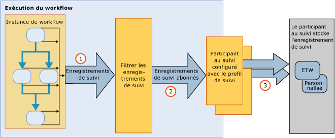

# Suivi et traçage de workflowWorkflow Tracking and Tracing
Le suivi Windows Workflow est une fonctionnalité de [!INCLUDE[netfx_current_long](../../../includes/netfx-current-long-md.md)] conçue pour offrir plus de visibilité lors de l'exécution de workflow.Windows Workflow tracking is a [!INCLUDE[netfx_current_long](../../../includes/netfx-current-long-md.md)] feature designed to provide visibility into workflow execution. Il fournit une infrastructure de suivi pour suivre l'exécution d'une instance de workflow.It provides a tracking infrastructure to track the execution of a workflow instance. L'infrastructure de suivi WF instrumente de façon transparente un workflow pour émettre des enregistrements qui reflètent des événements clés pendant l'exécution.The WF tracking infrastructure transparently instruments a workflow to emit records reflecting key events during the execution. Cette fonctionnalité est disponible par défaut pour tous les workflows [!INCLUDE[netfx_current_short](../../../includes/netfx-current-short-md.md)].This functionality is available by default for any [!INCLUDE[netfx_current_short](../../../includes/netfx-current-short-md.md)] workflow. Il n'est pas nécessaire de modifier un workflow [!INCLUDE[netfx_current_long](../../../includes/netfx-current-long-md.md)] pour activer son suivi.No changes are required to be made to a [!INCLUDE[netfx_current_long](../../../includes/netfx-current-long-md.md)] workflow for tracking to occur. Il suffit seulement de déterminer quelles données vous souhaitez obtenir.It is just a matter of deciding how much tracking data you want to receive. Lorsqu'une instance de workflow démarre ou se termine, les enregistrements de suivi de son exécution sont émis.When a workflow instance starts or completes, its processing tracking records are emitted. Le suivi peut également extraire des données métier pertinentes associées aux variables de workflow.Tracking can also extract business-relevant data associated with the workflow variables. Par exemple, si le workflow représente un système de traitement des commandes, l'ID de commande peut être extrait avec l'objet <xref:System.Activities.Tracking.TrackingRecord>.For example, if the workflow represents an order processing system, the order ID can be extracted along with the <xref:System.Activities.Tracking.TrackingRecord> object. En règle générale, le suivi WF facilite l'accès aux diagnostics ou aux analyses d'entreprise depuis l'exécution du workflow.In general, enabling WF tracking facilitates diagnostics or business analytics data to be accessed from a workflow execution.  
  
 Ces composants de suivi sont équivalents au service de suivi dans [!INCLUDE[vstecwinfx](../../../includes/vstecwinfx-md.md)].These tracking components are equivalent to the tracking service in [!INCLUDE[vstecwinfx](../../../includes/vstecwinfx-md.md)]. Dans [!INCLUDE[netfx_current_short](../../../includes/netfx-current-short-md.md)], les performances ont été améliorées et le modèle de programmation simplifié pour la fonctionnalité de suivi WF.In [!INCLUDE[netfx_current_short](../../../includes/netfx-current-short-md.md)], the performance has been improved and the programming model simplified for the WF tracking feature. L'exécution du suivi instrumente une instance de workflow pour émettre des événements associés au cycle de vie de workflow, aux activités de workflow et aux événements personnalisés.The tracking runtime instruments a workflow instance to emit events related to the workflow life cycle, workflow activities and custom events.  
  
 Windows Server AppFabric permet également de surveiller l'exécution de WCF et des services de workflow.Windows Server App Fabric also provides the ability to monitor the execution of a WCF and workflow services. [!INCLUDE[crdefault](../../../includes/crdefault-md.md)][Windows Server AppFabric analyse](http://go.microsoft.com/fwlink/?LinkId=201273) et [analyse d’Applications avec Windows Server AppFabric](http://go.microsoft.com/fwlink/?LinkId=201287) [Windows Server App Fabric Monitoring](http://go.microsoft.com/fwlink/?LinkId=201273) and [Monitoring Applications with Windows Server AppFabric](http://go.microsoft.com/fwlink/?LinkId=201287)  
  
 Pour résoudre les problèmes d'exécution de workflow, vous pouvez activer le suivi de workflow diagnostique.To troubleshoot the workflow runtime, you can turn on diagnostic workflow tracing. [!INCLUDE[crdefault](../../../includes/crdefault-md.md)][Le suivi de workflow](../../../docs/framework/windows-workflow-foundation/workflow-tracing.md). [Workflow Tracing](../../../docs/framework/windows-workflow-foundation/workflow-tracing.md).  
  
 Pour vous aider à comprendre le modèle de programmation, les principaux composants de l'infrastructure de suivi sont traités dans cette rubrique :To understand the programming model, the primary components of the tracking infrastructure are discussed in this topic:  
  
-   Des objets <xref:System.Activities.Tracking.TrackingRecord> sont émis par l'exécution du workflow.<xref:System.Activities.Tracking.TrackingRecord> objects emitted from the workflow runtime. [!INCLUDE[crdefault](../../../includes/crdefault-md.md)][Des enregistrements de suivi](../../../docs/framework/windows-workflow-foundation/tracking-records.md). [Tracking Records](../../../docs/framework/windows-workflow-foundation/tracking-records.md).  
  
-   Les objets <xref:System.Activities.Tracking.TrackingParticipant>  s'abonnent aux objets <xref:System.Activities.Tracking.TrackingRecord>.<xref:System.Activities.Tracking.TrackingParticipant> objects subscribe to <xref:System.Activities.Tracking.TrackingRecord> objects. Les participants de suivi contiennent la logique nécessaire pour traiter la charge utile des objets <xref:System.Activities.Tracking.TrackingRecord> (par exemple, ils peuvent choisir d'écrire dans un fichier).The tracking participants contain the logic to process the payload from the <xref:System.Activities.Tracking.TrackingRecord> objects (for example, they could choose to write to a file). [!INCLUDE[crdefault](../../../includes/crdefault-md.md)][Participants de suivi](../../../docs/framework/windows-workflow-foundation/tracking-participants.md). [Tracking Participants](../../../docs/framework/windows-workflow-foundation/tracking-participants.md).  
  
-   Les objets <xref:System.Activities.Tracking.TrackingProfile> filtrent les enregistrements de suivi émis par une instance de workflow.<xref:System.Activities.Tracking.TrackingProfile> objects filter tracking records emitted from a workflow instance. [!INCLUDE[crdefault](../../../includes/crdefault-md.md)][Profils de suivi](../../../docs/framework/windows-workflow-foundation/tracking-profiles.md). [Tracking Profiles](../../../docs/framework/windows-workflow-foundation/tracking-profiles.md).  
  
## Infrastructure du suivi des flux de travailWorkflow Tracking Infrastructure  
 L'infrastructure de suivi de workflow fonctionne sur un modèle Publier/Abonner.The workflow tracking infrastructure follows a publish-and-subscribe paradigm. L'instance de workflow est le serveur de publication des enregistrements de suivi, alors que les abonnés des enregistrements de suivi sont inscrits en tant qu'extensions du workflow.The workflow instance is the publisher of tracking records, while subscribers of the tracking records are registered as extensions to the workflow. Ces extensions qui s'abonnent aux objets <xref:System.Activities.Tracking.TrackingRecord> sont appelées des participants de suivi.These extensions that subscribe to <xref:System.Activities.Tracking.TrackingRecord> objects are called tracking participants. Les participants de suivi sont des points d'extensibilité qui accèdent aux objets <xref:System.Activities.Tracking.TrackingRecord> afin de les traiter de la manière prévue.Tracking participants are extensibility points that access <xref:System.Activities.Tracking.TrackingRecord> objects and process them in whatever manner they are written to do so. L'infrastructure de suivi permet l'application d'un filtre sur les enregistrements de suivi sortants pour permettre à un participant de s'abonner à un sous-ensemble des enregistrements.The tracking infrastructure allows the application of a filter on the outgoing tracking records to allow a participant to subscribe to a subset of the records. Ce mécanisme de filtrage s'effectue à l'aide d'un fichier modèle de suivi.This filtering mechanism is accomplished through a tracking profile file.  
  
 L'illustration suivante présente une vue globale de l'infrastructure de suivi.A high level view of the tracking infrastructure is shown in the following illustration.  
  
   
  
## Dans cette sectionIn This Section  
 [Enregistrements de suiviTracking Records](../../../docs/framework/windows-workflow-foundation/tracking-records.md)  
 Décrit les enregistrements de suivi émis par l'exécution du workflow.Describes the tracking records that the workflow runtime emits.  
  
 [Profils de suiviTracking Profiles](../../../docs/framework/windows-workflow-foundation/tracking-profiles.md)  
 Explique l'utilisation des modèles de suivi.Discusses how tracking profiles are used.  
  
 [Participants de suiviTracking Participants](../../../docs/framework/windows-workflow-foundation/tracking-participants.md)  
 Décrit comment utiliser le participant de suivi fourni par le système ou comment créer des participants de suivi personnalisés.Describes how to use system-provided tracking participant or how to create custom tracking participants.  
  
 [Configuration du suivi d’un workflowConfiguring Tracking for a Workflow](../../../docs/framework/windows-workflow-foundation/configuring-tracking-for-a-workflow.md)  
 Décrit comment configurer le suivi pour un workflow.Describes how to configure tracking for a workflow.  
  
 [Suivi de workflowWorkflow Tracing](../../../docs/framework/windows-workflow-foundation/workflow-tracing.md)  
 Décrit les deux méthodes d'activation du suivi de débogage pour un workflow.Describes the two ways to enable debug tracing for a workflow.  
  
 [Détermination de la durée d’exécution d’un workflow à l’aide du suiviDetermining Workflow Execution Duration Using Tracing](../../../docs/framework/windows-workflow-foundation/determining-workflow-execution-duration-using-tracing.md)  
 Décrit comment utiliser les messages de suivi pour déterminer la durée d'exécution du workflow.Describes how to use tracing messages to determine workflow execution duration.  
  
## Voir aussiSee Also  
 [Suivi SQLSQL Tracking](../../../docs/framework/windows-workflow-foundation/samples/sql-tracking.md)
