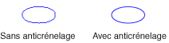

# Anticrénelage avec des lignes et des courbesAntialiasing with Lines and Curves
Lorsque vous utilisez [!INCLUDE[ndptecgdiplus](../../../../includes/ndptecgdiplus-md.md)] pour dessiner une ligne, vous fournissez le point de départ et le point de fin de la ligne, mais il est inutile de fournir des informations sur les pixels individuels sur la ligne.When you use [!INCLUDE[ndptecgdiplus](../../../../includes/ndptecgdiplus-md.md)] to draw a line, you provide the starting point and ending point of the line, but you do not have to provide any information about the individual pixels on the line. [!INCLUDE[ndptecgdiplus](../../../../includes/ndptecgdiplus-md.md)]fonctionne en association avec le logiciel de pilote d’affichage pour déterminer quels pixels seront activées pour afficher la ligne sur un périphérique d’affichage particulier. works in conjunction with the display driver software to determine which pixels will be turned on to show the line on a particular display device.  
  
## Utilisation d’aliasAliasing  
 Envisagez la ligne droite rouge qui va du point (4, 2) au point (16, 10).Consider the straight red line that goes from the point (4, 2) to the point (16, 10). Supposons que le système de coordonnées a son origine dans le coin supérieur gauche et que l’unité de mesure est le pixel.Assume the coordinate system has its origin in the upper-left corner and that the unit of measure is the pixel. Supposons également que l’axe des x point vers la droite et les points de l’axe des y vers le bas.Also assume that the x-axis points to the right and the y-axis points down. L’illustration suivante montre une vue agrandie de la ligne rouge dessinée sur un arrière-plan multicolore.The following illustration shows an enlarged view of the red line drawn on a multicolored background.  
  
   
  
 Les pixels rouges utilisés pour rendre la ligne sont opaques.The red pixels used to render the line are opaque. Il n’y a aucun pixel partiellement transparent dans la ligne.There are no partially transparent pixels in the line. Ce type de rendu donne une apparence en escalier à la ligne et la ligne ressemble escalier.This type of line rendering gives the line a jagged appearance, and the line looks somewhat like a staircase. Cette technique qui représente une ligne comme un escalier est appelée crénelage ; l’escalier est un alias pour la ligne théorique.This technique of representing a line with a staircase is called aliasing; the staircase is an alias for the theoretical line.  
  
## anticrénelageAntialiasing  
 Une technique plus sophistiquée pour le rendu d’une ligne implique l’utilisation de pixels partiellement transparents et pixels opaques.A more sophisticated technique for rendering a line involves using partially transparent pixels along with opaque pixels. Pixels sont définies sur rouge pur, ou un mélange de rouge et de la couleur d’arrière-plan, en fonction de leur proximité qu’ils sont à la ligne.Pixels are set to pure red, or to some blend of red and the background color, depending on how close they are to the line. Ce type de rendu est appelé anticrénelage et donne une ligne le œil humain perçoit plus lisse.This type of rendering is called antialiasing and results in a line that the human eye perceives as more smooth. L’illustration suivante montre comment certains pixels sont fusionnés avec l’arrière-plan pour produire une ligne non crénelé.The following illustration shows how certain pixels are blended with the background to produce an antialiased line.  
  
   
  
 L’anticrénelage, également appelé lissage, peut également être appliqué aux courbes.Antialiasing, also called smoothing, can also be applied to curves. L’illustration suivante montre une vue agrandie d’une ellipse lissée.The following illustration shows an enlarged view of a smoothed ellipse.  
  
   
  
 L’illustration suivante montre la même ellipse en taille réelle, sans anticrénelage et avec anticrénelage.The following illustration shows the same ellipse in its actual size, once without antialiasing and once with antialiasing.  
  
   
  
 Pour dessiner des lignes et des courbes qui utilisent l’anticrénelage, créez une instance de la <xref:System.Drawing.Graphics> puis définissez son <xref:System.Drawing.Graphics.SmoothingMode%2A> propriété <xref:System.Drawing.Drawing2D.SmoothingMode.AntiAlias> ou <xref:System.Drawing.Drawing2D.SmoothingMode.HighQuality>.To draw lines and curves that use antialiasing, create an instance of the <xref:System.Drawing.Graphics> class and set its <xref:System.Drawing.Graphics.SmoothingMode%2A> property to <xref:System.Drawing.Drawing2D.SmoothingMode.AntiAlias> or <xref:System.Drawing.Drawing2D.SmoothingMode.HighQuality>. Appelez ensuite l’une des méthodes de dessin de ce même <xref:System.Drawing.Graphics> classe.Then call one of the drawing methods of that same <xref:System.Drawing.Graphics> class.  
  
 [!code-csharp[LinesCurvesAndShapes#81](../../../../samples/snippets/csharp/VS_Snippets_Winforms/LinesCurvesAndShapes/CS/Class1.cs#81)]
 [!code-vb[LinesCurvesAndShapes#81](../../../../samples/snippets/visualbasic/VS_Snippets_Winforms/LinesCurvesAndShapes/VB/Class1.vb#81)]  
  
## Voir aussiSee Also  
 <xref:System.Drawing.Drawing2D.SmoothingMode?displayProperty=nameWithType>  
 [Lignes, courbes et formesLines, Curves, and Shapes](../../../../docs/framework/winforms/advanced/lines-curves-and-shapes.md)  
 [Guide pratique pour utiliser l‘anticrénelage avec du texteHow to: Use Antialiasing with Text](../../../../docs/framework/winforms/advanced/how-to-use-antialiasing-with-text.md)
