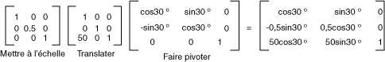

# Transformations globales et locales
Une transformation globale s'applique à tous les éléments dessinés par un objet <xref:System.Drawing.Graphics> donné.  En revanche, une transformation locale s'applique à un élément dessiné spécifique.  
  
## Transformations globales  
 Pour créer une transformation globale, vous construisez un objet <xref:System.Drawing.Graphics>, puis vous manipulez sa propriété <xref:System.Drawing.Graphics.Transform%2A>.  La propriété <xref:System.Drawing.Graphics.Transform%2A> est un objet <xref:System.Drawing.Drawing2D.Matrix> et peut donc contenir une séquence quelconque de transformations affines.  La transformation stockée dans la propriété <xref:System.Drawing.Graphics.Transform%2A> est appelée transformation universelle.  La classe <xref:System.Drawing.Graphics> fournit plusieurs méthodes pour construire une transformation universelle composite : <xref:System.Drawing.Graphics.MultiplyTransform%2A>, <xref:System.Drawing.Graphics.RotateTransform%2A>, <xref:System.Drawing.Graphics.ScaleTransform%2A> et <xref:System.Drawing.Graphics.TranslateTransform%2A>.  L'exemple suivant montre comment dessiner deux fois une ellipse : une fois avant de créer une transformation universelle et une fois après.  La transformation effectue tout d'abord une mise à l'échelle par un facteur 0,5 dans la direction y, puis une translation de 50 unités dans la direction x et enfin une rotation de 30 degrés.  
  
 [!code-csharp[System.Drawing.CoordinateSystems#21](../../../../samples/snippets/csharp/VS_Snippets_Winforms/System.Drawing.CoordinateSystems/CS/Class1.cs#21)]
 [!code-vb[System.Drawing.CoordinateSystems#21](../../../../samples/snippets/visualbasic/VS_Snippets_Winforms/System.Drawing.CoordinateSystems/VB/Class1.vb#21)]  
  
 L'illustration suivante représente les matrices de cette transformation.  
  
   
  
> [!NOTE]
>  Dans l'exemple précédent, l'ellipse subit une rotation par rapport à l'origine du système de coordonnées \(coin supérieur gauche de la zone cliente\).  Le résultat est différent de celui d'une rotation de l'ellipse autour de son propre centre.  
  
## Transformations locales  
 Une transformation locale s'applique à un élément dessiné spécifique.  Par exemple, un objet <xref:System.Drawing.Drawing2D.GraphicsPath> comprend une méthode <xref:System.Drawing.Drawing2D.GraphicsPath.Transform%2A> qui permet de transformer les points de données du tracé en question.  L'exemple suivant dessine un rectangle sans transformation et un tracé avec une transformation de rotation.  \(Supposez qu'il n'y a aucune transformation universelle.\)  
  
 [!code-csharp[System.Drawing.CoordinateSystems#22](../../../../samples/snippets/csharp/VS_Snippets_Winforms/System.Drawing.CoordinateSystems/CS/Class1.cs#22)]
 [!code-vb[System.Drawing.CoordinateSystems#22](../../../../samples/snippets/visualbasic/VS_Snippets_Winforms/System.Drawing.CoordinateSystems/VB/Class1.vb#22)]  
  
 Il est possible de combiner la transformation universelle avec des transformations locales pour obtenir divers résultats.  Par exemple, vous pouvez utiliser la transformation universelle pour réviser le système de coordonnées et des transformations locales pour faire pivoter et mettre à l'échelle des objets dessinés sur le nouveau système de coordonnées.  
  
 Supposons qu'il vous faut un système de coordonnées dont l'origine se trouve à 200 pixels du bord gauche de la zone cliente et à 150 pixels du bord supérieur de la zone cliente.  D'autre part, vous voulez le pixel comme unité de mesure, un axe x qui pointe vers la droite et un axe y qui pointe vers le haut.  Dans le système de coordonnées par défaut, l'axe y pointe vers le bas ; vous devez donc effectuer une réflexion par rapport à l'axe horizontal.  L'illustration suivante représente la matrice de cette réflexion.  
  
   
  
 Supposons maintenant que vous deviez effectuer une translation de 200 unités vers la droite et de 150 unités vers le bas.  
  
 L'exemple suivant établit le système de coordonnées décrit précédemment en définissant la transformation universelle d'un objet <xref:System.Drawing.Graphics>.  
  
 [!code-csharp[System.Drawing.CoordinateSystems#23](../../../../samples/snippets/csharp/VS_Snippets_Winforms/System.Drawing.CoordinateSystems/CS/Class1.cs#23)]
 [!code-vb[System.Drawing.CoordinateSystems#23](../../../../samples/snippets/visualbasic/VS_Snippets_Winforms/System.Drawing.CoordinateSystems/VB/Class1.vb#23)]  
  
 Le code suivant \(placé à la fin de l'exemple précédent\) crée un tracé constitué d'un rectangle dont le coin inférieur gauche se trouve sur l'origine du nouveau système de coordonnées.  Ce rectangle est rempli une fois sans transformation locale et une fois avec une transformation locale.  La transformation locale en question est une mise à l'échelle par un facteur 2 suivie d'une rotation de 30 degrés.  
  
 [!code-csharp[System.Drawing.CoordinateSystems#24](../../../../samples/snippets/csharp/VS_Snippets_Winforms/System.Drawing.CoordinateSystems/CS/Class1.cs#24)]
 [!code-vb[System.Drawing.CoordinateSystems#24](../../../../samples/snippets/visualbasic/VS_Snippets_Winforms/System.Drawing.CoordinateSystems/VB/Class1.vb#24)]  
  
 L'illustration suivante représente le nouveau système de coordonnées et les deux rectangles.  
  
   
  
## Voir aussi  
 [Systèmes de coordonnées et transformations](../../../../docs/framework/winforms/advanced/coordinate-systems-and-transformations.md)   
 [Utilisation des transformations dans GDI\+ managé](../../../../docs/framework/winforms/advanced/using-transformations-in-managed-gdi.md)