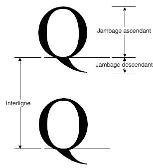

# Comment : obtenir la métrique des policesHow to: Obtain Font Metrics
La <xref:System.Drawing.FontFamily> classe fournit les méthodes suivantes qui récupèrent diverses métriques pour une combinaison famille/style particulière :The <xref:System.Drawing.FontFamily> class provides the following methods that retrieve various metrics for a particular family/style combination:  
  
-   <xref:System.Drawing.FontFamily.GetEmHeight%2A>(FontStyle)<xref:System.Drawing.FontFamily.GetEmHeight%2A>(FontStyle)  
  
-   <xref:System.Drawing.FontFamily.GetCellAscent%2A>(FontStyle)<xref:System.Drawing.FontFamily.GetCellAscent%2A>(FontStyle)  
  
-   <xref:System.Drawing.FontFamily.GetCellDescent%2A>(FontStyle)<xref:System.Drawing.FontFamily.GetCellDescent%2A>(FontStyle)  
  
-   <xref:System.Drawing.FontFamily.GetLineSpacing%2A>(FontStyle)<xref:System.Drawing.FontFamily.GetLineSpacing%2A>(FontStyle)  
  
 Les nombres retournés par ces méthodes sont en unités de design de police, afin qu’ils soient indépendants de la taille et les unités d’un particulier <xref:System.Drawing.Font> objet.The numbers returned by these methods are in font design units, so they are independent of the size and units of a particular <xref:System.Drawing.Font> object.  
  
 L’illustration suivante montre les diverses métriques.The following illustration shows the various metrics.  
  
   
  
## ExempleExample  
 L’exemple suivant affiche les métriques pour le style normal de la famille de polices Arial.The following example displays the metrics for the regular style of the Arial font family. Le code crée également un <xref:System.Drawing.Font> objet (basé sur la famille Arial) avec la taille de 16 pixels et affiche la métrique (en pixels) pour ce particulier <xref:System.Drawing.Font> objet.The code also creates a <xref:System.Drawing.Font> object (based on the Arial family) with size 16 pixels and displays the metrics (in pixels) for that particular <xref:System.Drawing.Font> object.  
  
 L’illustration suivante montre la sortie de l’exemple de code.The following illustration shows the output of the example code.  
  
   
  
 Notez les deux premières lignes de sortie dans l’illustration précédente.Note the first two lines of output in the preceding illustration. Le <xref:System.Drawing.Font> objet retourne une taille de 16 et le <xref:System.Drawing.FontFamily> object retourne une hauteur de 2 048.The <xref:System.Drawing.Font> object returns a size of 16, and the <xref:System.Drawing.FontFamily> object returns an em height of 2,048. Ces deux nombres (16 et 2 048) sont essentiels à la conversion entre les unités de design de police et les unités (dans ce cas des pixels) de la <xref:System.Drawing.Font> objet.These two numbers (16 and 2,048) are the key to converting between font design units and the units (in this case pixels) of the <xref:System.Drawing.Font> object.  
  
 Par exemple, vous pouvez convertir la hauteur d’unités de design en pixels comme suit :For example, you can convert the ascent from design units to pixels as follows:  
  
   
  
 Le code suivant positionne le texte verticalement en définissant le <xref:System.Drawing.PointF.Y%2A> membre de données d’un <xref:System.Drawing.PointF> objet.The following code positions text vertically by setting the <xref:System.Drawing.PointF.Y%2A> data member of a <xref:System.Drawing.PointF> object. Coordonnée y est augmentée `font.Height` pour chaque nouvelle ligne de texte.The y-coordinate is increased by `font.Height` for each new line of text. Le <xref:System.Drawing.Font.Height%2A> propriété d’un <xref:System.Drawing.Font> objet retourne l’interligne (en pixels) pour ce particulier <xref:System.Drawing.Font> objet.The <xref:System.Drawing.Font.Height%2A> property of a <xref:System.Drawing.Font> object returns the line spacing (in pixels) for that particular <xref:System.Drawing.Font> object. Dans cet exemple, le nombre retourné par <xref:System.Drawing.Font.Height%2A> est 19.In this example, the number returned by <xref:System.Drawing.Font.Height%2A> is 19. Notez que cela est le même que le nombre (arrondi à un entier) obtenu en convertissant la métrique d’interligne en pixels.Note that this is the same as the number (rounded up to an integer) obtained by converting the line-spacing metric to pixels.  
  
 Notez que la hauteur du carré cadratin (également appelée taille "em" ou de taille) n’est pas la somme de la hauteur et la profondeur.Note that the em height (also called size or em size) is not the sum of the ascent and the descent. La somme de la hauteur et la profondeur est appelée à la hauteur des cellules.The sum of the ascent and the descent is called the cell height. La hauteur de cellule moins l’espacement interne est égale à la hauteur du carré cadratin.The cell height minus the internal leading is equal to the em height. La hauteur de cellule plus l’espacement externe est égale à l’interligne.The cell height plus the external leading is equal to the line spacing.  
  
 [!code-csharp[System.Drawing.FontsAndText#71](../../../../samples/snippets/csharp/VS_Snippets_Winforms/System.Drawing.FontsAndText/CS/Class1.cs#71)]
 [!code-vb[System.Drawing.FontsAndText#71](../../../../samples/snippets/visualbasic/VS_Snippets_Winforms/System.Drawing.FontsAndText/VB/Class1.vb#71)]  
  
## Compilation du codeCompiling the Code  
 L'exemple précédent est conçu pour une utilisation avec Windows Forms et nécessite <xref:System.Windows.Forms.PaintEventArgs> `e`, qui est un paramètre de <xref:System.Windows.Forms.PaintEventHandler>.The preceding example is designed for use with Windows Forms, and it requires <xref:System.Windows.Forms.PaintEventArgs> `e`, which is a parameter of <xref:System.Windows.Forms.PaintEventHandler>.  
  
## Voir aussiSee Also  
 [Graphiques et dessins dans Windows FormsGraphics and Drawing in Windows Forms](../../../../docs/framework/winforms/advanced/graphics-and-drawing-in-windows-forms.md)  
 [Utilisation de polices et de texteUsing Fonts and Text](../../../../docs/framework/winforms/advanced/using-fonts-and-text.md)
