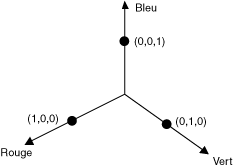
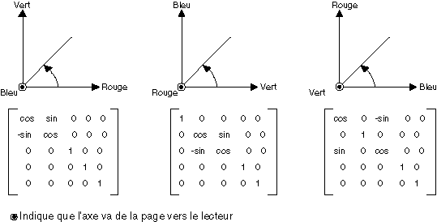
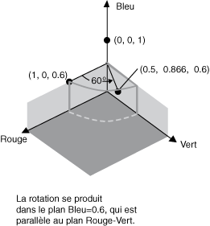

# Comment&#160;: faire pivoter des couleurs
La rotation dans un espace de couleurs à quatre dimensions est difficile à visualiser.  Pour faciliter la visualisation, choisissez de ne pas modifier l'une des composantes de couleur.  Supposez que la composante alpha soit fixée à 1 \(totalement opaque\).  Vous pouvez ensuite visualiser un espace de couleurs à trois dimensions ayant des axes rouges, verts et bleus, comme montré dans l'illustration suivante.  
  
   
  
 Une couleur peut être représentée sous la forme d'un point dans un espace en trois dimensions.  Par exemple, le point \(1, 0, 0\) dans l'espace représente la couleur rouge et le point \(0, 1, 0\) la couleur verte.  
  
 L'illustration suivante montre la rotation de la couleur \(1, 0, 0\) via un angle de 60 degrés du plan Rouge\-Vert.  La rotation d'un plan parallèle en plan Rouge\-Vert peut être représentée comme une rotation sur l'axe bleu.  
  
   
  
 L'illustration suivante montre la façon d'initialiser une matrice de couleurs pour effectuer des rotations sur chacun des trois axes de coordonnées \(rouge, vert, bleu\).  
  
   
  
## Exemple  
 L'exemple suivant prend une image d'une seule couleur \(1, 0, 0.6\) et applique une rotation de 60 degrés sur l'axe bleu.  L'angle de rotation est balayé pour passer d'un plan parallèle au plan rouge\-vert.  
  
 L'illustration suivante montre l'image d'origine sur la gauche et l'image dont les couleurs ont subi une rotation sur la droite.  
  
   
  
 L'illustration suivante montre une visualisation de la rotation de couleurs effectuée dans le code ci\-après.  
  
   
  
 [!code-csharp[System.Drawing.RotateColors#1](../../../../samples/snippets/csharp/VS_Snippets_Winforms/System.Drawing.RotateColors/CS/Form1.cs#1)]
 [!code-vb[System.Drawing.RotateColors#1](../../../../samples/snippets/visualbasic/VS_Snippets_Winforms/System.Drawing.RotateColors/VB/Form1.vb#1)]  
  
## Compilation du code  
 L'exemple précédent est destiné à une utilisation avec Windows Forms et nécessite <xref:System.Windows.Forms.PaintEventArgs> `e`, qui est un paramètre du gestionnaire d'événements <xref:System.Windows.Forms.Control.Paint>.  Remplacez `RotationInput.bmp` par le nom et le chemin d'accès d'un fichier image valides sur votre système.  
  
## Voir aussi  
 <xref:System.Drawing.Imaging.ColorMatrix>   
 <xref:System.Drawing.Imaging.ImageAttributes>   
 [Graphiques et dessins dans les Windows Forms](../../../../docs/framework/winforms/advanced/graphics-and-drawing-in-windows-forms.md)   
 [Recoloriage des images](../../../../docs/framework/winforms/advanced/recoloring-images.md)