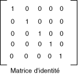

# Comment&#160;: utiliser une matrice de couleurs pour transformer une couleur unique
[!INCLUDE[ndptecgdiplus](../../../../includes/ndptecgdiplus-md.md)] fournit les classes <xref:System.Drawing.Image> et <xref:System.Drawing.Bitmap> pour le stockage et la manipulation des images.  Les objets <xref:System.Drawing.Image> et <xref:System.Drawing.Bitmap> stockent la couleur de chaque pixel comme un nombre 32 bits : 8 bits pour chaque rouge, vert, bleu et alpha.  Chacun des quatre composants est un nombre compris entre 0 et 255, 0 représentant une intensité nulle et 255 une intensité maximale.  Le composant alpha spécifie la transparence de la couleur : 0 est totalement transparent et 255 totalement opaque.  
  
 Un vecteur de couleur est un 4\-tuple de forme \(rouge, vert, bleu, alpha\).  Par exemple, le vecteur de couleur \(0, 255, 0, 255\) représente une couleur opaque dépourvue de rouge ou de bleu, mais avec une intensité de vert maximale.  
  
 Une autre convention de représentation des couleurs utilise le nombre 1 pour l'intensité maximale.  Avec cette convention, la couleur décrite dans le paragraphe précédent est représentée par le vecteur \(0, 1, 0, 1\).  [!INCLUDE[ndptecgdiplus](../../../../includes/ndptecgdiplus-md.md)] utilise la convention de 1 comme intensité complète lorsqu'il exécute des transformations de couleur.  
  
 Vous pouvez appliquer des transformations linéaires \(rotation, mise à l'échelle et autres\) aux vecteurs de couleurs en multipliant ces vecteurs par une matrice 4x4.  Toutefois, vous ne pouvez pas utiliser de matrice 4x4 pour effectuer une traduction \(non linéaire\).  Si vous ajoutez une cinquième coordonnée fictive \(par exemple, le nombre 1\) à chaque vecteur de couleur, vous pouvez utiliser une matrice 5x5 pour appliquer des combinaisons de transformations et de traductions linéaires.  Une transformation comprenant une transformation linéaire suivie d'une translation s'appelle une transformation affine.  
  
 Supposez, par exemple, que vous commenciez par la couleur \(0.2, 0.0, 0.4, 1.0\) et appliquiez les transformations suivantes :  
  
1.  Doubler la composante rouge.  
  
2.  Ajouter 0,2 aux composantes rouge, vert et bleu.  
  
 La multiplication de la matrice suivante va effectuer la paire de transformations dans l'ordre indiqué.  
  
   
  
 Les éléments d'une matrice de couleurs sont indexés \(base zéro\) par ligne, puis par colonne.  Par exemple, l'entrée sur la cinquième ligne et la troisième colonne de la matrice M est représentée par M\[4\]\[2\].  
  
 La matrice d'identité 5x5 \(présentée dans l'illustration ci\-après\) possède des 1 sur la diagonale et des 0 partout ailleurs.  Si vous multipliez un vecteur de couleur par la matrice d'identité, le vecteur de couleur ne change pas.  Un moyen pratique de former la matrice d'une transformation de couleur consiste à commencer par la matrice d'identité, puis à apporter une légère modification pour générer la transformation souhaitée.  
  
   
  
 Pour une présentation détaillée des matrices et des transformations, consultez [Systèmes de coordonnées et transformations](../../../../docs/framework/winforms/advanced/coordinate-systems-and-transformations.md).  
  
## Exemple  
 L'exemple suivant prend une image en une seule couleur \(0.2, 0.0, 0.4, 1.0\) et applique la transformation décrite dans les paragraphes précédents.  
  
 L'illustration suivante montre l'image d'origine sur la gauche et l'image transformée sur la droite.  
  
   
  
 Pour effectuer le recoloriage, le code de l'exemple suivant effectue les étapes ci\-après :  
  
1.  Initialise un objet <xref:System.Drawing.Imaging.ColorMatrix>.  
  
2.  Crée un objet <xref:System.Drawing.Imaging.ImageAttributes> et passe l'objet <xref:System.Drawing.Imaging.ColorMatrix> à la méthode <xref:System.Drawing.Imaging.ImageAttributes.SetColorMatrix%2A> de l'objet <xref:System.Drawing.Imaging.ImageAttributes>.  
  
3.  Passe l'objet <xref:System.Drawing.Imaging.ImageAttributes> à la méthode <xref:System.Drawing.Graphics.DrawImage%2A> d'un objet <xref:System.Drawing.Graphics>.  
  
 [!code-csharp[System.Drawing.RecoloringImages#21](../../../../samples/snippets/csharp/VS_Snippets_Winforms/System.Drawing.RecoloringImages/CS/Class1.cs#21)]
 [!code-vb[System.Drawing.RecoloringImages#21](../../../../samples/snippets/visualbasic/VS_Snippets_Winforms/System.Drawing.RecoloringImages/VB/Class1.vb#21)]  
  
## Compilation du code  
 L'exemple précédent est destiné à une utilisation avec Windows Forms et nécessite <xref:System.Windows.Forms.PaintEventArgs> `e`, qui est un paramètre du gestionnaire d'événements <xref:System.Windows.Forms.Control.Paint>.  
  
## Voir aussi  
 [Recoloriage des images](../../../../docs/framework/winforms/advanced/recoloring-images.md)   
 [Systèmes de coordonnées et transformations](../../../../docs/framework/winforms/advanced/coordinate-systems-and-transformations.md)