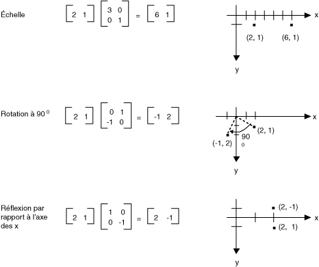
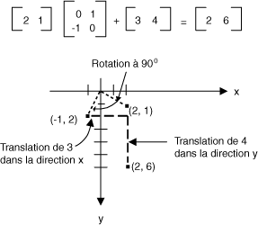
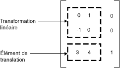

# Représentation matricielle des transformations
Une matrice m × n est un ensemble de nombres organisés dans des lignes de m et n colonnes. L’illustration suivante montre plusieurs matrices.  
  
   
  
 Vous pouvez ajouter deux matrices de même taille en ajoutant des éléments individuels. L’illustration suivante montre deux exemples d’ajout de la matrice.  
  
   
  
 Une matrice m × n peut être multipliée par une matrice de p × n, et le résultat est une matrice de p × m. Le nombre de colonnes dans la première matrice doit être le même que le nombre de lignes dans la deuxième matrice. Par exemple, une matrice 4 × 2 peut être multipliée par une matrice de 2 x 3 pour produire une matrice 4 × 3.  
  
 Les points dans le plan et les lignes et les colonnes d’une matrice peuvent être considérés comme des vecteurs. Par exemple, (2, 5) est un vecteur de deux composants et (3, 7, 1) est un vecteur à trois composants. Le produit scalaire de deux vecteurs est défini comme suit :  
  
 (a, b) • (c, d) = CA + bd  
  
 (a, b, c) • (d, e, f) + = ad + cf  
  
 Par exemple, le produit scalaire de (2, 3) et (5, 4) est (2)(5) + (3)(4) = 22. Le produit scalaire de (2, 5, 1) et (4, 3, 1) est (2)(4) + (5)(3) + (1)(1) = 24. Notez que le produit scalaire de deux vecteurs est un nombre, et non un autre vecteur. Notez également que vous pouvez calculer le produit scalaire uniquement si les deux vecteurs ont le même nombre de composants.  
  
 Permettent de A(i, j) est la valeur de la matrice A dans la ligne i et la colonne j. Par exemple, A (3, 2) est l’entrée de la matrice A à la ligne 3 et de la colonne 2. Supposons que A, B et C sont des matrices et AB = C. Les entrées de C sont calculées comme suit :  
  
 C (i, j) = (ligne i de A) • (colonne j de B)  
  
 L’illustration suivante montre plusieurs exemples de multiplication des matrices.  
  
   
  
 Si vous pensez que d’un point dans un plan est une 1 matrice × 2, vous pouvez transformer ce point en le multipliant par une matrice 2 x 2. L’illustration suivante montre plusieurs transformations appliquées au point (2, 1).  
  
   
  
 Toutes les transformations indiquées dans la figure précédente sont des transformations linéaires. Certaines transformations, telles que la traduction, ne sont pas linéaires et ne peuvent pas être exprimées en tant que la multiplication par une matrice 2 x 2. Supposons que vous souhaitez démarrer avec le point (2, 1), faire pivoter de 90 degrés, translation de 3 unités dans la direction x et translation de 4 unités dans la direction y. Pour cela, à l’aide d’une multiplication des matrices suivie d’une addition de matrice.  
  
   
  
 Une transformation linéaire (multiplication par une matrice 2 x 2) suivie d’une translation (addition d’une 1 matrice × 2) est appelée une transformation affine. Une alternative au stockage d’une transformation affine dans une paire de matrices (une pour la partie linéaire) et une pour la traduction consiste à stocker de la transformation ensemble dans une matrice 3 x 3. Pour ce faire, un point dans le plan doit être stocké dans une matrice 1 × 3 avec une coordonnée 3e factice. La technique habituelle consiste à rendre toutes les 3e coordonnées égal à 1. Par exemple, le point (2, 1) est représenté par la matrice [2 1 1]. L’illustration suivante montre une transformation affine (rotation à 90 degrés ; translation de 3 unités dans la direction x et 4 unités dans la direction y) exprimée sous la forme de la multiplication par une matrice unique 3 x 3.  
  
   
  
 Dans l’exemple précédent, le point (2, 1) est mappé au point (2, 6). Notez que la troisième colonne de la matrice 3 x 3 contient les nombres 0, 0, 1. Ce sera toujours le cas pour la matrice 3 x 3 d’une transformation affine. Les nombres importants sont les six nombres des colonnes 1 et 2. La partie supérieure gauche 2 × 2 de la matrice représente la partie linéaire de la transformation, et les deux premières entrées de la 3e ligne représentent la translation.  
  
   
  
 Dans [!INCLUDE[ndptecgdiplus](../../../../includes/ndptecgdiplus-md.md)] vous pouvez stocker une transformation affine dans un <xref:System.Drawing.Drawing2D.Matrix> objet. Étant donné que la troisième colonne d’une matrice qui représente une transformation affine est toujours (0, 0, 1), vous spécifiez uniquement les six nombres dans les deux premières colonnes lorsque vous construisez un <xref:System.Drawing.Drawing2D.Matrix> objet. L’instruction `Matrix myMatrix = new Matrix(0, 1, -1, 0, 3, 4)` construit la matrice affichée dans l’illustration précédente.  
  
## Transformations composites  
 Une transformation composite est une séquence de transformations, un après l’autre. Prenons les matrices et les transformations dans la liste suivante :  
  
|||  
|-|-|  
|Matrice A|Rotation de 90 degrés|  
|Matrice B|Mettre à l’échelle par un facteur de 2 dans la direction x|  
|Matrice C|Translation de 3 unités dans la direction y|  
  
 Si nous commençons avec le point (2, 1), représenté par la matrice [2 1 1] — et multiplier par A, puis B, puis C, le point (2, 1) subiront les trois transformations dans l’ordre indiqué.  
  
 [1 DE 1 2] ABC = [1 DE 5-2]  
  
 Au lieu de cela les trois parties de la transformation composite dans trois matrices distinctes, vous pouvez multiplier A, B et C ensemble pour obtenir une matrice 3 x 3 unique qui stocke la transformation composite entière. Supposons que ABC = D. Puis un point multiplié par D donne le même résultat qu’un point multiplié par A, puis B, puis sur C.  
  
 [1 DE 1 2] D = [1 DE 5-2]  
  
 L’illustration suivante montre les matrices A, B, C et D.  
  
   
  
 Le fait que la matrice d’une transformation composite peut être formée en multipliant les matrices de transformation individuelles signifie que n’importe quelle séquence de transformations affines peut être stockée dans un seul <xref:System.Drawing.Drawing2D.Matrix> objet.  
  
> [!CAUTION]
>  L’ordre d’une transformation composite est important. En règle générale, faire pivoter, mettre à l’échelle, puis traduire n’est pas le même que l’échelle, faire pivoter, puis traduire. De même, l’ordre de la multiplication des matrices est important. En général, ABC n’est pas identique à l’arrière.  
  
 Le <xref:System.Drawing.Drawing2D.Matrix> classe fournit plusieurs méthodes pour créer une transformation composite : <xref:System.Drawing.Drawing2D.Matrix.Multiply%2A>, <xref:System.Drawing.Drawing2D.Matrix.Rotate%2A>, <xref:System.Drawing.Drawing2D.Matrix.RotateAt%2A>, <xref:System.Drawing.Drawing2D.Matrix.Scale%2A>, <xref:System.Drawing.Drawing2D.Matrix.Shear%2A>, et <xref:System.Drawing.Drawing2D.Matrix.Translate%2A>. L’exemple suivant crée la matrice d’une transformation composite qui pivote tout d’abord de 30 degrés, puis met à l’échelle par un facteur de 2 sur l’axe y et enfin une translation de 5 unités dans la direction x :  
  
 [!code-csharp[System.Drawing.CoordinateSystems#11](../../../../samples/snippets/csharp/VS_Snippets_Winforms/System.Drawing.CoordinateSystems/CS/Class1.cs#11)]
 [!code-vb[System.Drawing.CoordinateSystems#11](../../../../samples/snippets/visualbasic/VS_Snippets_Winforms/System.Drawing.CoordinateSystems/VB/Class1.vb#11)]  
  
 L’illustration suivante montre la matrice.  
  
   
  
## Voir aussi  
 [Systèmes de coordonnées et transformations](../../../../docs/framework/winforms/advanced/coordinate-systems-and-transformations.md)  
 [Utilisation des transformations dans GDI+ managé](../../../../docs/framework/winforms/advanced/using-transformations-in-managed-gdi.md)
