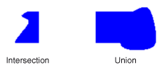

# R&#233;gions dans GDI+
Une région est une portion de la zone d'affichage d'un périphérique de sortie.  Une région peut être simple \(un rectangle\) ou complexe \(combinaison de polygones et de courbes fermées\).  L'illustration suivante présente deux régions : l'une construite à partir d'un rectangle et l'autre construite à partir d'un tracé.  
  
   
  
## Utilisation de régions  
 Les régions sont souvent utilisées pour le découpage et les tests d'atteinte.  Le découpage consiste à restreindre le dessin à une certaine région de la zone d'affichage \(il s'agit généralement de la partie qui doit être mise à jour\).  Les tests d'atteinte consistent à vérifier si le curseur se trouve dans une certaine zone de l'écran au moment de l'activation d'un bouton de la souris.  
  
 Vous pouvez construire une région à partir d'un rectangle ou à partir d'un tracé.  Vous pouvez également créer des régions complexes en combinant des régions existantes.  La classe <xref:System.Drawing.Region> fournit les méthodes suivantes pour combiner des régions : <xref:System.Drawing.Region.Intersect%2A>, <xref:System.Drawing.Region.Union%2A>, <xref:System.Drawing.Region.Xor%2A>, <xref:System.Drawing.Region.Exclude%2A> et <xref:System.Drawing.Region.Complement%2A>.  
  
 L'intersection de deux régions est l'ensemble de tous les points qui appartiennent aux deux régions.  L'union est l'ensemble de tous les points qui appartiennent à au moins l'une des deux régions.  Le complément d'une région est l'ensemble de tous les points qui n'appartiennent pas à cette région.  L'illustration suivante montre l'intersection et l'union des deux régions représentées dans la figure précédente.  
  
   
  
 La méthode <xref:System.Drawing.Region.Xor%2A> appliquée à deux régions produit une région qui contient tous les points appartenant à l'une ou l'autre des deux régions, mais pas aux deux à la fois.  La méthode <xref:System.Drawing.Region.Exclude%2A> appliquée à deux régions produit une région qui contient tous les points de la première région qui n'appartiennent pas à la seconde région.  L'illustration suivante représente les régions résultant de l'application des méthodes <xref:System.Drawing.Region.Xor%2A> et <xref:System.Drawing.Region.Exclude%2A> aux deux régions illustrées au début de cette rubrique.  
  
   
  
 Pour remplir une région, vous avez besoin d'un objet <xref:System.Drawing.Graphics>, d'un objet <xref:System.Drawing.Brush> et d'un objet <xref:System.Drawing.Region>.  L'objet <xref:System.Drawing.Graphics> fournit la méthode <xref:System.Drawing.Graphics.FillRegion%2A> et l'objet <xref:System.Drawing.Brush> stocke les attributs de remplissage, tels que la couleur ou le modèle.  L'exemple suivant remplit une région avec une couleur unie.  
  
 [!code-csharp[LinesCurvesAndShapes#61](../../../../samples/snippets/csharp/VS_Snippets_Winforms/LinesCurvesAndShapes/CS/Class1.cs#61)]
 [!code-vb[LinesCurvesAndShapes#61](../../../../samples/snippets/visualbasic/VS_Snippets_Winforms/LinesCurvesAndShapes/VB/Class1.vb#61)]  
  
## Voir aussi  
 <xref:System.Drawing.Region?displayProperty=fullName>   
 [Lignes, courbes et formes](../../../../docs/framework/winforms/advanced/lines-curves-and-shapes.md)   
 [Utilisation de régions](../../../../docs/framework/winforms/advanced/using-regions.md)