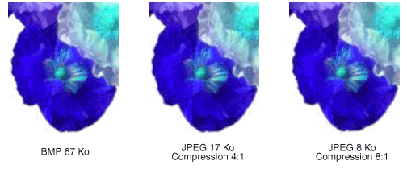

# Types de bitmapsTypes of Bitmaps
Une image bitmap est un tableau de bits qui spécifient la couleur de chaque pixel dans un tableau rectangulaire de pixels.A bitmap is an array of bits that specify the color of each pixel in a rectangular array of pixels. Le nombre de bits associés à un pixel donné détermine le nombre de couleurs qui peuvent être affectés à ce pixel.The number of bits devoted to an individual pixel determines the number of colors that can be assigned to that pixel. Par exemple, si chaque pixel est représenté par 4 bits, puis un pixel donné peut être attribué une des 16 couleurs différentes (2 ^ 4 = 16).For example, if each pixel is represented by 4 bits, then a given pixel can be assigned one of 16 different colors (2^4 = 16). Le tableau suivant présente quelques exemples du nombre de couleurs qui peuvent être attribuées à un pixel représenté par un nombre donné de bits.The following table shows a few examples of the number of colors that can be assigned to a pixel represented by a given number of bits.  
  
|Bits par pixelBits per pixel|Nombre de couleurs qui peuvent être affectés à un pixelNumber of colors that can be assigned to a pixel|  
|--------------------|------------------------------------------------------|  
|11|2^1 = 22^1 = 2|  
|22|2^2 = 42^2 = 4|  
|44|2^4 = 162^4 = 16|  
|88|2^8 = 2562^8 = 256|  
|1616|2^16 = 65,5362^16 = 65,536|  
|2424|2^24 = 16,777,2162^24 = 16,777,216|  
  
 Les fichiers de disque qui stockent généralement les bitmaps contiennent un ou plusieurs blocs d’informations qui stockent des informations telles que le nombre de bits par pixel, nombre de pixels dans chaque ligne et le nombre de lignes dans le tableau.Disk files that store bitmaps usually contain one or more information blocks that store information such as the number of bits per pixel, number of pixels in each row, and number of rows in the array. Un tel fichier peut également contenir une table des couleurs (parfois appelée une palette de couleurs).Such a file might also contain a color table (sometimes called a color palette). Une table des couleurs mappe les nombres dans la bitmap à des couleurs spécifiques.A color table maps numbers in the bitmap to specific colors. L’illustration suivante montre l’image agrandie avec sa table de bitmap et la couleur.The following illustration shows an enlarged image along with its bitmap and color table. Chaque pixel est représenté par un nombre de 4 bits, il y a 2 ^ 4 = 16 couleurs dans la table des couleurs.Each pixel is represented by a 4-bit number, so there are 2^4 = 16 colors in the color table. Chaque couleur de la table est représentée par un nombre de 24 bits : 8 bits pour le rouge, 8 bits pour le vert et 8 bits pour le bleu.Each color in the table is represented by a 24-bit number: 8 bits for red, 8 bits for green, and 8 bits for blue. Les nombres sont affichés au format hexadécimal (base 16) : A = 10, B = 11, C = 12, D = 13, E = 14, F = 15.The numbers are shown in hexadecimal (base 16) form: A = 10, B = 11, C = 12, D = 13, E = 14, F = 15.  
  
   
  
 Examinons le pixel dans la ligne 3, colonne 5 de l’image.Look at the pixel in row 3, column 5 of the image. Le numéro correspondant dans la bitmap est 1.The corresponding number in the bitmap is 1. La table des couleurs indique que le nombre 1 représente la couleur rouge.The color table tells us that 1 represents the color red so the pixel is red. Toutes les entrées dans la ligne supérieure de l’image bitmap seront 3.All the entries in the top row of the bitmap are 3. La table des couleurs indique que 3 représente tous les pixels de la ligne supérieure de l’image sont en bleus.The color table tells us that 3 represents blue, so all the pixels in the top row of the image are blue.  
  
> [!NOTE]
>  Certaines images sont stockées au format de bas en haut ; les nombres dans la première ligne de la bitmap correspondent aux pixels de la ligne inférieure de l’image.Some bitmaps are stored in bottom-up format; the numbers in the first row of the bitmap correspond to the pixels in the bottom row of the image.  
  
 Une bitmap qui stocke des index dans une table des couleurs est appelée une image bitmap de palette indexée.A bitmap that stores indexes into a color table is called a palette-indexed bitmap. Certaines images ont pas besoin d’une table des couleurs.Some bitmaps have no need for a color table. Par exemple, si une bitmap utilise 24 bits par pixel, elle peut stocker les couleurs elles-mêmes plutôt que des index dans une table des couleurs.For example, if a bitmap uses 24 bits per pixel, that bitmap can store the colors themselves rather than indexes into a color table. L’illustration suivante montre une bitmap qui stocke directement les couleurs (24 bits par pixel) au lieu d’utiliser une table des couleurs.The following illustration shows a bitmap that stores colors directly (24 bits per pixel) rather than using a color table. L’illustration montre également une vue agrandie de l’image correspondante.The illustration also shows an enlarged view of the corresponding image. Dans la bitmap, FFFFFF représente le blanc, FF0000 représente rouge, 00FF00 le vert et 0000FF représente le bleu.In the bitmap, FFFFFF represents white, FF0000 represents red, 00FF00 represents green, and 0000FF represents blue.  
  
   
  
## Formats de fichiers graphiquesGraphics File Formats  
 Il existe de nombreux formats standards pour enregistrer des bitmaps dans les fichiers de disque.There are many standard formats for saving bitmaps in disk files. [!INCLUDE[ndptecgdiplus](../../../../includes/ndptecgdiplus-md.md)]prend en charge le fichier graphique formats décrits dans les paragraphes suivants. supports the graphics file formats described in the following paragraphs.  
  
### BMPBMP  
 BMP est un format standard utilisé par Windows pour stocker des images indépendantes du périphérique et indépendant des applications.BMP is a standard format used by Windows to store device-independent and application-independent images. Le nombre de bits par pixel (1, 4, 8, 15, 24, 32 ou 64) pour un fichier BMP donné est spécifié dans un en-tête de fichier.The number of bits per pixel (1, 4, 8, 15, 24, 32, or 64) for a given BMP file is specified in a file header. Les fichiers BMP dotés de 24 bits par pixel sont courants.BMP files with 24 bits per pixel are common. Les fichiers BMP ne sont généralement pas compressés et, par conséquent, ne sont pas adaptés pour le transfert sur Internet.BMP files are usually not compressed and, therefore, are not well suited for transfer across the Internet.  
  
### GIF (Graphics Interchange Format)Graphics Interchange Format (GIF)  
 GIF est un format commun pour les images qui apparaissent sur les pages Web.GIF is a common format for images that appear on Web pages. Fichiers GIF fonctionnent bien pour les dessins, des images avec des blocs de couleur unie et des images avec netteté des limites entre les couleurs.GIFs work well for line drawings, pictures with blocks of solid color, and pictures with sharp boundaries between colors. Ils sont compressés, mais aucune information n’est perdue dans le processus de compression ; une image décompressée est exactement le même que l’original.GIFs are compressed, but no information is lost in the compression process; a decompressed image is exactly the same as the original. Une couleur dans un fichier GIF peut être désignée comme étant transparent, afin que l’image aura la couleur d’arrière-plan d’une page Web qui l’affiche.One color in a GIF can be designated as transparent, so that the image will have the background color of any Web page that displays it. Une séquence d’images GIF peut être stockée dans un seul fichier pour former une image GIF animée.A sequence of GIF images can be stored in a single file to form an animated GIF. Fichiers GIF stockent au maximum 8 bits par pixel, ils sont limités à 256 couleurs.GIFs store at most 8 bits per pixel, so they are limited to 256 colors.  
  
### Joint Photographic Experts Group (JPEG)Joint Photographic Experts Group (JPEG)  
 JPEG est un schéma de compression qui fonctionne bien pour les scènes naturelles, telles que des photographies numérisés.JPEG is a compression scheme that works well for natural scenes such as scanned photographs. Certaines informations sont perdues dans le processus de compression, mais ces pertes sont souvent imperceptibles pour le œil humain.Some information is lost in the compression process, but often the loss is imperceptible to the human eye. Fichiers JPEG stockent 24 bits par pixel, ce qui leur permet d’afficher plus de 16 millions de couleurs.JPEGs store 24 bits per pixel, so they are capable of displaying more than 16 million colors. JPEG ne prennent pas en charge transparence ou une animation.JPEGs do not support transparency or animation.  
  
 Le niveau de compression dans les images JPEG est configurable, mais les niveaux de compression élevés (fichiers plus petits) entraîner une perte de plus d’informations.The level of compression in JPEG images is configurable, but higher compression levels (smaller files) result in more loss of information. Un taux de compression de 20:1 produit souvent une image qui le œil humain recherche difficile à distinguer l’original.A 20:1 compression ratio often produces an image that the human eye finds difficult to distinguish from the original. L’illustration suivante montre une image BMP et deux images JPEG compressées à partir de cette image BMP.The following illustration shows a BMP image and two JPEG images that were compressed from that BMP image. La première image JPEG a un taux de compression de 4:1 et le deuxième JPEG a un taux de compression d’environ 8:1.The first JPEG has a compression ratio of 4:1 and the second JPEG has a compression ratio of about 8:1.  
  
   
  
 La compression JPEG ne pas fonctionnent bien pour les dessins, les blocs de couleur unie et des limites.JPEG compression does not work well for line drawings, blocks of solid color, and sharp boundaries. L’illustration suivante montre une image BMP ainsi que deux images JPEG et GIF.The following illustration shows a BMP along with two JPEGs and a GIF. Les images JPEG et l’image GIF ont été compressées à partir de la BMP.The JPEGs and the GIF were compressed from the BMP. Le taux de compression est 4:1 pour l’image GIF, 4:1 pour la plus petite image JPEG et 8:3 pour la plus grande image JPEG.The compression ratio is 4:1 for the GIF, 4:1 for the smaller JPEG, and 8:3 for the larger JPEG. Notez que l’image GIF conserve la netteté des limites le long des lignes, mais les images JPEG ont tendance à brouiller les limites.Note that the GIF maintains the sharp boundaries along the lines, but the JPEGs tend to blur the boundaries.  
  
   
  
 JPEG est un schéma de compression, pas un format de fichier.JPEG is a compression scheme, not a file format. JPEG File Interchange Format (JFIF) est un format de fichier couramment utilisé pour stocker et transférer les images qui ont été compressées conformément au schéma JPEG.JPEG File Interchange Format (JFIF) is a file format commonly used for storing and transferring images that have been compressed according to the JPEG scheme. Les fichiers JFIF affichés par les navigateurs Web utilisent l’extension .jpg.JFIF files displayed by Web browsers use the .jpg extension.  
  
### Exchangeable Image File (EXIF)Exchangeable Image File (EXIF)  
 EXIF est un format de fichier utilisé pour les photographies capturées par les appareils photo numériques.EXIF is a file format used for photographs captured by digital cameras. Un fichier EXIF contient une image qui est compressée après la spécification JPEG.An EXIF file contains an image that is compressed according to the JPEG specification. Un fichier EXIF contient également des informations sur la photographie (date de prise, vitesse d’obturation, temps d’exposition et ainsi de suite) et des informations sur l’appareil photo (fabricant, modèle et ainsi de suite).An EXIF file also contains information about the photograph (date taken, shutter speed, exposure time, and so on) and information about the camera (manufacturer, model, and so on).  
  
### PNG (Portable Network Graphics)Portable Network Graphics (PNG)  
 Le format PNG présente de nombreux avantages du format GIF, mais fournit également des fonctionnalités supplémentaires.The PNG format retains many of the advantages of the GIF format but also provides capabilities beyond those of GIF. Comme les fichiers GIF, PNG sont compressés sans perte d’informations.Like GIF files, PNG files are compressed with no loss of information. Fichiers PNG peuvent stocker des couleurs avec 8, 24 ou 48 bits par pixel et des nuances de gris avec 1, 2, 4, 8 ou 16 bits par pixel.PNG files can store colors with 8, 24, or 48 bits per pixel and grayscales with 1, 2, 4, 8, or 16 bits per pixel. En revanche, les fichiers GIF peuvent utiliser que 1, 2, 4 ou 8 bits par pixel.In contrast, GIF files can use only 1, 2, 4, or 8 bits per pixel. Un fichier PNG peut également stocker une valeur alpha pour chaque pixel, qui spécifie le degré auquel la couleur de ce pixel est fusionnée avec la couleur d’arrière-plan.A PNG file can also store an alpha value for each pixel, which specifies the degree to which the color of that pixel is blended with the background color.  
  
 Format PNG surpasse dans sa capacité à afficher progressivement une image GIF (autrement dit, pour afficher des approximations de plus en plus de l’image en tant qu’il arrive sur une connexion réseau).PNG improves on GIF in its ability to progressively display an image (that is, to display better and better approximations of the image as it arrives over a network connection). Fichiers PNG peuvent contenir des informations de correction des couleurs et de correction gamma afin que les images peuvent être rendus correctement sur divers périphériques d’affichage.PNG files can contain gamma correction and color correction information so that the images can be accurately rendered on a variety of display devices.  
  
### Tag Image File Format (TIFF)Tag Image File Format (TIFF)  
 TIFF est un format flexible et extensible qui est pris en charge par un large éventail de plateformes et les applications de traitement d’image.TIFF is a flexible and extendable format that is supported by a wide variety of platforms and image-processing applications. Fichiers TIFF peuvent stocker des images avec un nombre arbitraire de bits par pixel et utilisent différents d’algorithmes de compression.TIFF files can store images with an arbitrary number of bits per pixel and can employ a variety of compression algorithms. Plusieurs images peuvent être stockées dans un seul fichier TIFF à plusieurs pages.Several images can be stored in a single, multiple-page TIFF file. Relatives à l’image (marque de scanneur, ordinateur hôte, type de compression, orientation, échantillons par pixel et ainsi de suite) peuvent être stockés dans le fichier et organisées à l’aide de balises.Information related to the image (scanner make, host computer, type of compression, orientation, samples per pixel, and so on) can be stored in the file and arranged through the use of tags. Le format TIFF peut être étendu si nécessaire par l’approbation et l’ajout de nouvelles balises.The TIFF format can be extended as needed by the approval and addition of new tags.  
  
## Voir aussiSee Also  
 <xref:System.Drawing.Image?displayProperty=nameWithType>  
 <xref:System.Drawing.Bitmap?displayProperty=nameWithType>  
 <xref:System.Drawing.Imaging.PixelFormat?displayProperty=nameWithType>  
 [Images, bitmaps et métafichiersImages, Bitmaps, and Metafiles](../../../../docs/framework/winforms/advanced/images-bitmaps-and-metafiles.md)  
 [Utilisation des images, bitmaps, icônes et métafichiersWorking with Images, Bitmaps, Icons, and Metafiles](../../../../docs/framework/winforms/advanced/working-with-images-bitmaps-icons-and-metafiles.md)
