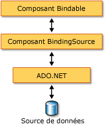

# Vue d'ensemble du composant BindingSource
Le composant <xref:System.Windows.Forms.BindingSource> est conçu pour simplifier le processus de liaison de contrôles à une source de données sous-jacente. Le composant <xref:System.Windows.Forms.BindingSource> agit à la fois comme un canal de communication et comme une source de données avec laquelle d'autres contrôles établissent une liaison. Il fournit une abstraction de la connexion de données de votre formulaire tout en transmettant les commandes à la liste de données sous-jacente. De plus, vous pouvez y ajouter des données directement, pour que le composant lui-même fonctionne comme une source de données.  
  
## Composant BindingSource comme intermédiaire  
 Le composant <xref:System.Windows.Forms.BindingSource> agit comme source de données pour tout ou une partie des contrôles du formulaire. Dans Visual Studio, le <xref:System.Windows.Forms.BindingSource> peut être lié à un contrôle à l’aide de la `DataBindings` propriété, qui est accessible à partir de la **propriétés** fenêtre. Consultez également [Comment : lier des contrôles Windows Forms au composant BindingSource à l'aide du concepteur](../../../../docs/framework/winforms/controls/bind-wf-controls-with-the-bindingsource.md).  
  
 Vous pouvez lier le composant <xref:System.Windows.Forms.BindingSource> à des sources de données simples (comme une seule propriété d'un objet ou une collection de base telle que <xref:System.Collections.ArrayList>) et à des sources de données complexes (comme une table de base de données). Le composant <xref:System.Windows.Forms.BindingSource> joue le rôle d'intermédiaire fournissant des services de liaison et de gestions de devises. Au moment du design ou de l'exécution, vous pouvez lier un composant <xref:System.Windows.Forms.BindingSource> à une source de données complexe en affectant respectivement la base de données et la table à ses propriétés <xref:System.Windows.Forms.BindingSource.DataSource%2A> et <xref:System.Windows.Forms.BindingSource.DataMember%2A>. L'illustration suivante montre où vient se placer le composant <xref:System.Windows.Forms.BindingSource> dans l'architecture de liaison de données existante.  
  
   
  
> [!NOTE]
>  Au moment du design, certaines actions (comme le déplacement d'une table de base de données d'une fenêtre de données vers un nouveau formulaire) créent le composant <xref:System.Windows.Forms.BindingSource>, le lient à la source de données sous-jacente et ajoutent des contrôles de données en une seule opération. Consultez également [Liaison de contrôles Windows Forms à des données dans Visual Studio](/visualstudio/data-tools/bind-windows-forms-controls-to-data-in-visual-studio).  
  
## Composant BindingSource comme source de données  
 Si vous commencez à ajouter des éléments au composant <xref:System.Windows.Forms.BindingSource> sans spécifier au préalable une liste avec laquelle établir une liaison, il agit comme une source de données de liste et accepte ces éléments ajoutés.  
  
 En outre, vous pouvez écrire du code pour fournir une fonctionnalité « AddNew » personnalisée à l'aide de l'événement <xref:System.Windows.Forms.BindingSource.AddingNew>, qui est déclenché quand la méthode <xref:System.Windows.Forms.BindingSource.AddNew%2A> est appelée avant l'ajout de l'élément à la liste. Pour plus d'informations, consultez [Architecture du composant BindingSource](../../../../docs/framework/winforms/controls/bindingsource-component-architecture.md).  
  
## Navigation  
 Pour les utilisateurs qui doivent parcourir les données d'un formulaire, le composant <xref:System.Windows.Forms.BindingNavigator> permet de parcourir et de manipuler les données conjointement avec un composant <xref:System.Windows.Forms.BindingSource>. Pour plus d'informations, consultez [BindingNavigator, contrôle](../../../../docs/framework/winforms/controls/bindingnavigator-control-windows-forms.md).  
  
## Manipulation de données  
 Le composant <xref:System.Windows.Forms.BindingSource> agit comme un <xref:System.Windows.Forms.CurrencyManager> pour toutes ses liaisons et peut par conséquent fournir l'accès aux informations de devise et de position concernant la source de données. Le tableau suivant montre les membres fournis par le composant <xref:System.Windows.Forms.BindingSource> pour accéder aux données sous-jacentes et les manipuler.  
  
|Membre|Description|  
|------------|-----------------|  
|Propriété <xref:System.Windows.Forms.BindingSource.Current%2A>|Obtient l'élément actuel de la source de données.|  
|Propriété <xref:System.Windows.Forms.BindingSource.Position%2A>|Obtient ou définit la position actuelle dans la liste sous-jacente.|  
|Propriété <xref:System.Windows.Forms.BindingSource.List%2A>|Obtient la liste qui est l'évaluation de <xref:System.Windows.Forms.BindingSource.DataSource%2A> et <xref:System.Windows.Forms.BindingSource.DataMember%2A>. Si <xref:System.Windows.Forms.BindingSource.DataMember%2A> n'est pas défini, retourne la liste spécifiée par <xref:System.Windows.Forms.BindingSource.DataSource%2A>.|  
|Méthode <xref:System.Windows.Forms.BindingSource.Insert%2A>|Insère un élément dans la liste à l'index spécifié.|  
|Méthode <xref:System.Windows.Forms.BindingSource.RemoveCurrent%2A>|Supprime l'élément sélectionné de la liste.|  
|Méthode <xref:System.Windows.Forms.BindingSource.EndEdit%2A>|Applique des modifications en attente à la source de données sous-jacente.|  
|Méthode <xref:System.Windows.Forms.BindingSource.CancelEdit%2A>|Annule l'opération de modification actuelle.|  
|Méthode <xref:System.Windows.Forms.BindingSource.AddNew%2A>|Ajoute un nouvel élément à la liste sous-jacente. Si la source de données implémente <xref:System.ComponentModel.IBindingList> et retourne un élément à partir de l'événement <xref:System.Windows.Forms.BindingSource.AddingNew>, ajoute cet élément. Dans le cas contraire, la demande est passée à la méthode <xref:System.ComponentModel.IBindingList.AddNew%2A> de la liste. Si la liste sous-jacente n'est pas un <xref:System.ComponentModel.IBindingList>, l'élément est créé automatiquement via son constructeur public par défaut.|  
  
## Tri et filtrage  
 En règle générale, vous devez travailler avec un affichage ordonné ou filtré de la source de données. Le tableau suivant montre les membres fournis par la source de données du composant <xref:System.Windows.Forms.BindingSource>.  
  
|Membre|Description|  
|------------|-----------------|  
|Propriété <xref:System.Windows.Forms.BindingSource.Sort%2A>|Si la source de données est un <xref:System.ComponentModel.IBindingList>, obtient ou définit un nom de colonne utilisé pour le tri et les informations d'ordre de tri. Si la source de données est un <xref:System.ComponentModel.IBindingListView> et prend en charge le tri avancé, obtient plusieurs noms de colonnes utilisés pour le tri et les informations d'ordre de tri.|  
|Propriété <xref:System.Windows.Forms.BindingSource.Filter%2A>|Si la source de données est un <xref:System.ComponentModel.IBindingListView>, obtient ou définit l'expression utilisée pour filtrer les lignes affichées.|  
  
## Voir aussi  
 <xref:System.Windows.Forms.BindingSource>  
 <xref:System.Windows.Forms.BindingNavigator>  
 [Architecture du composant BindingSource](../../../../docs/framework/winforms/controls/bindingsource-component-architecture.md)  
 [BindingSource, composant](../../../../docs/framework/winforms/controls/bindingsource-component.md)  
 [BindingNavigator, contrôle](../../../../docs/framework/winforms/controls/bindingnavigator-control-windows-forms.md)  
 [Liaison de données Windows Forms](../../../../docs/framework/winforms/windows-forms-data-binding.md)  
 [Contrôles à utiliser dans les Windows Forms](../../../../docs/framework/winforms/controls/controls-to-use-on-windows-forms.md)
