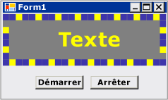

# Proc&#233;dure pas &#224; pas&#160;: cr&#233;ation d&#39;un contr&#244;le Windows Forms qui tire parti des fonctionnalit&#233;s au moment du design de Visual Studio
L'expérience au moment du design pour un contrôle personnalisé peut être améliorée en créant un concepteur personnalisé associé.  
  
 Cette procédure pas à pas illustre comment créer un concepteur personnalisé pour un contrôle personnalisé.  Vous implémenterez un type `MarqueeControl` et une classe de concepteur associée, du nom `MarqueeControlRootDesigner`.  
  
 Le type `MarqueeControl` implémente un affichage semblable à un texte défilant de théâtre, avec des lumières animées et du texte qui clignote.  
  
 Le concepteur pour ce contrôle interagit avec l'environnement de design pour fournir une expérience au moment du design personnalisée.  Avec le concepteur personnalisé, vous pouvez assembler une implémentation de `MarqueeControl` personnalisée avec des lumières animées et du texte qui clignote dans beaucoup de combinaisons.  Vous pouvez utiliser le contrôle assemblé sur un formulaire comme n'importe quel autre contrôle Windows Forms.  
  
 Cette procédure pas à pas illustre les tâches suivantes :  
  
-   Création du projet  
  
-   Création d'un projet de bibliothèque de contrôles  
  
-   Référence au projet de contrôle personnalisé  
  
-   Définition d'un contrôle personnalisé et de son concepteur personnalisé  
  
-   Création d'une instance de votre contrôle personnalisé  
  
-   Configuration du projet pour le débogage au moment du design  
  
-   Implémentation de votre contrôle personnalisé  
  
-   Création d'un contrôle enfant pour votre contrôle personnalisé  
  
-   Création du contrôle enfant MarqueeBorder  
  
-   Création d'un concepteur personnalisé pour masquer et filtrer les propriétés  
  
-   Gestion des modifications des composants  
  
-   Ajout de verbes de concepteur à votre concepteur personnalisé  
  
-   Création d'un CustomUITypeEditor  
  
-   Test de votre contrôle personnalisé dans le concepteur  
  
 Lorsque vous avez terminé, votre contrôle personnalisé doit ressembler à ce qui suit :  
  
   
  
 Pour la liste de code complète, consultez [How to: Create a Windows Forms Control That Takes Advantage of Design\-Time Features](../Topic/How%20to:%20Create%20a%20Windows%20Forms%20Control%20That%20Takes%20Advantage%20of%20Design-Time%20Features.md).  
  
> [!NOTE]
>  Les boîtes de dialogue et les commandes de menu qui s'affichent peuvent être différentes de celles qui sont décrites dans l'aide, en fonction de vos paramètres actifs ou de l'édition utilisée.  Pour modifier vos paramètres, choisissez **Importation et exportation de paramètres** dans le menu **Outils**.  Pour plus d'informations, consultez [Customizing Development Settings in Visual Studio](http://msdn.microsoft.com/fr-fr/22c4debb-4e31-47a8-8f19-16f328d7dcd3).  
  
## Composants requis  
 Pour exécuter cette procédure pas à pas, vous devez disposer des composants suivants :  
  
-   Avoir des autorisations suffisantes pour être en mesure de créer et d'exécuter des projets d'application Windows Forms sur l'ordinateur où Visual Studio est installé.  
  
## Création du projet  
 La première étape consiste à créer le projet d'application.  Vous utiliserez ce projet pour générer l'application qui héberge le contrôle personnalisé.  
  
#### Pour créer le projet  
  
-   Créez un projet d'application Windows Forms appelé « MarqueeControlTest ». Pour plus d'informations, consultez [How to: Create a Windows Application Project](http://msdn.microsoft.com/fr-fr/b2f93fed-c635-4705-8d0e-cf079a264efa).  
  
## Création d'un projet de bibliothèque de contrôles  
 La première étape consiste à créer le projet de bibliothèque de contrôles.  Vous créerez un nouveau contrôle personnalisé et son concepteur personnalisé correspondant.  
  
#### Pour créer le projet de bibliothèque de contrôles  
  
1.  Ajoutez un projet de bibliothèque de contrôles Windows Forms à la solution.  Nommez le projet "MarqueeControlLibrary".  
  
2.  À l'aide de l'**Explorateur de solutions**, supprimez le contrôle par défaut du projet en supprimant le fichier source nommé "UserControl1.cs" ou "UserControl1.vb", selon le langage de votre choix.  Pour plus d'informations, consultez [NIB:How to: Remove, Delete, and Exclude Items](http://msdn.microsoft.com/fr-fr/6dffdc86-29c8-4eff-bcd8-e3a0dd9e9a73).  
  
3.  Ajoutez un nouvel élément <xref:System.Windows.Forms.UserControl> au projet `MarqueeControlLibrary`.  Donnez le nom de base "MarqueeControl" au nouveau fichier source.  
  
4.  À l'aide de l'**Explorateur de solutions**, créez un nouveau dossier dans le projet `MarqueeControlLibrary`.  Pour plus d'informations, consultez [NIB:How to: Add New Project Items](http://msdn.microsoft.com/fr-fr/63d3e16b-de6e-4bb5-a0e3-ecec762201ce).  Nommez le nouveau dossier "Design".  
  
5.  Cliquez avec le bouton droit sur le dossier **Design** et ajoutez une nouvelle classe.  Donnez le nom de base "MarqueeControlRootDesigner" au fichier source.  
  
6.  Comme vous devrez utiliser des types de l'assembly System.Design, ajoutez cette référence au projet `MarqueeControlLibrary`.  
  
    > [!NOTE]
    >  Pour utiliser l'assembly System.Design, votre projet doit cibler la version complète du .NET Framework, non le .NET Framework Client Profile.  Pour modifier le framework cible, consultez [Comment : cibler une version du .NET Framework](../Topic/How%20to:%20Target%20a%20Version%20of%20the%20.NET%20Framework.md).  
  
## Référence au projet de contrôle personnalisé  
 Vous utiliserez le projet `MarqueeControlTest` pour tester le contrôle personnalisé.  Le projet de test sera informé de l'existence du contrôle personnalisé lorsque vous ajouterez une référence de projet à l'assembly `MarqueeControlLibrary`.  
  
#### Pour référencer le projet de contrôle personnalisé  
  
-   Dans le projet `MarqueeControlTest`, ajoutez une référence de projet à l'assembly `MarqueeControlLibrary`.  Veillez à utiliser l'onglet **Projets** de la boîte de dialogue **Ajouter une référence** au lieu de référencer directement l'assembly `MarqueeControlLibrary`.  
  
## Définition d'un contrôle personnalisé et de son concepteur personnalisé  
 Votre contrôle personnalisé dérivera de la classe <xref:System.Windows.Forms.UserControl>.  Cela permet à votre contrôle de contenir d'autres contrôles, et donne une grande quantité de fonctionnalités par défaut à votre contrôle.  
  
 Votre contrôle personnalisé disposera d'un concepteur personnalisé associé.  Cela vous permet de créer une expérience de conception unique spécifiquement adaptée à votre contrôle personnalisé.  
  
 Vous associez le contrôle à son concepteur en utilisant la classe <xref:System.ComponentModel.DesignerAttribute>.  Dans la mesure où vous développez entièrement le comportement au moment du design de votre contrôle personnalisé, le concepteur personnalisé implémentera l'interface <xref:System.ComponentModel.Design.IRootDesigner>.  
  
#### Pour définir un contrôle personnalisé et son concepteur personnalisé  
  
1.  Ouvrez le fichier source `MarqueeControl` dans l'**éditeur de code**.  En haut du fichier, importez les espaces de noms suivants :  
  
     [!code-csharp[System.Windows.Forms.Design.DocumentDesigner#220](../../../../samples/snippets/csharp/VS_Snippets_Winforms/System.Windows.Forms.Design.DocumentDesigner/CS/marqueecontrol.cs#220)]
     [!code-vb[System.Windows.Forms.Design.DocumentDesigner#220](../../../../samples/snippets/visualbasic/VS_Snippets_Winforms/System.Windows.Forms.Design.DocumentDesigner/VB/marqueecontrol.vb#220)]  
  
2.  Ajoutez <xref:System.ComponentModel.DesignerAttribute> à la déclaration de classe `MarqueeControl`.  Cela associe le contrôle personnalisé à son concepteur.  
  
     [!code-csharp[System.Windows.Forms.Design.DocumentDesigner#240](../../../../samples/snippets/csharp/VS_Snippets_Winforms/System.Windows.Forms.Design.DocumentDesigner/CS/marqueecontrol.cs#240)]
     [!code-vb[System.Windows.Forms.Design.DocumentDesigner#240](../../../../samples/snippets/visualbasic/VS_Snippets_Winforms/System.Windows.Forms.Design.DocumentDesigner/VB/marqueecontrol.vb#240)]  
  
3.  Ouvrez le fichier source `MarqueeControlRootDesigner` dans l'**éditeur de code**.  En haut du fichier, importez les espaces de noms suivants :  
  
     [!code-csharp[System.Windows.Forms.Design.DocumentDesigner#520](../../../../samples/snippets/csharp/VS_Snippets_Winforms/System.Windows.Forms.Design.DocumentDesigner/CS/marqueecontrolrootdesigner.cs#520)]
     [!code-vb[System.Windows.Forms.Design.DocumentDesigner#520](../../../../samples/snippets/visualbasic/VS_Snippets_Winforms/System.Windows.Forms.Design.DocumentDesigner/VB/marqueecontrolrootdesigner.vb#520)]  
  
4.  Modifiez la déclaration de `MarqueeControlRootDesigner` pour hériter de la classe <xref:System.Windows.Forms.Design.DocumentDesigner>.  Appliquez l'<xref:System.ComponentModel.ToolboxItemFilterAttribute> pour spécifier l'interaction du concepteur avec la **Boîte à outils**.  
  
     **Remarque**La définition de la classe `MarqueeControlRootDesigner` a été intégrée dans un espace de noms appelé « MarqueeControlLibrary.Design ». Cette déclaration place le concepteur dans un espace de noms spécialement réservé pour les types liés au design.  
  
     [!code-csharp[System.Windows.Forms.Design.DocumentDesigner#530](../../../../samples/snippets/csharp/VS_Snippets_Winforms/System.Windows.Forms.Design.DocumentDesigner/CS/marqueecontrolrootdesigner.cs#530)]
     [!code-vb[System.Windows.Forms.Design.DocumentDesigner#530](../../../../samples/snippets/visualbasic/VS_Snippets_Winforms/System.Windows.Forms.Design.DocumentDesigner/VB/marqueecontrolrootdesigner.vb#530)]  
  
5.  Définissez le constructeur pour la classe `MarqueeControlRootDesigner`.  Insérez une instruction <xref:System.Diagnostics.Trace.WriteLine%2A> dans le corps du constructeur.  Cela sera utile à des fins de débogage.  
  
     [!code-csharp[System.Windows.Forms.Design.DocumentDesigner#540](../../../../samples/snippets/csharp/VS_Snippets_Winforms/System.Windows.Forms.Design.DocumentDesigner/CS/marqueecontrolrootdesigner.cs#540)]
     [!code-vb[System.Windows.Forms.Design.DocumentDesigner#540](../../../../samples/snippets/visualbasic/VS_Snippets_Winforms/System.Windows.Forms.Design.DocumentDesigner/VB/marqueecontrolrootdesigner.vb#540)]  
  
## Création d'une instance de votre contrôle personnalisé  
 Pour observer le comportement personnalisé au moment du design de votre contrôle, vous placerez une instance de votre contrôle sur le formulaire dans le projet `MarqueeControlTest`.  
  
#### Pour créer une instance de votre contrôle personnalisé  
  
1.  Ajoutez un nouvel élément <xref:System.Windows.Forms.UserControl> au projet `MarqueeControlTest`.  Donnez le nom de base "DemoMarqueeControl" au nouveau fichier source.  
  
2.  Ouvrez le fichier `DemoMarqueeControl` dans l'**éditeur de code**.  En haut du fichier, importez l'espace de noms `MarqueeControlLibrary` :  
  
```vb  
Imports MarqueeControlLibrary  
```  
  
```csharp  
using MarqueeControlLibrary;  
```  
  
1.  Modifiez la déclaration de `DemoMarqueeControl` pour hériter de la classe `MarqueeControl`.  
  
2.  Générez le projet.  
  
3.  Ouvrez `Form1` dans le Concepteur Windows Forms.  
  
4.  Recherchez l'onglet **Composants MarqueeControlTest** dans la **boîte à outils** et ouvrez\-le.  Faites glisser un contrôle `DemoMarqueeControl` de la **Boîte à outils** jusqu'à votre formulaire.  
  
5.  Générez le projet.  
  
## Configuration du projet pour le débogage au moment du design  
 Lorsque vous développez une expérience personnalisée au moment du design, il est nécessaire de déboguer vos contrôles et composants.  Il existe une façon simple de définir votre projet pour autoriser le débogage au moment du design.  Pour plus d'informations, consultez [Procédure pas à pas : débogage des contrôles Windows Forms personnalisés au moment du design](../../../../docs/framework/winforms/controls/walkthrough-debugging-custom-windows-forms-controls-at-design-time.md).  
  
#### Pour configurer le projet pour le débogage au moment du design  
  
1.  Cliquez avec le bouton droit sur le projet `MarqueeControlLibrary`, puis sélectionnez **Propriétés**.  
  
2.  Dans la boîte de dialogue « Pages de propriétés de MarqueeControlLibrary », sélectionnez la page **Déboguer**.  
  
3.  Dans la section **Action de démarrage**, sélectionnez **Démarrer le programme externe**.  Comme vous allez déboguer une instance séparée de Visual Studio, cliquez sur le bouton de sélection \(\) pour rechercher l'IDE de Visual Studio.  Le nom du fichier exécutable est devenv.exe et, si vous avez effectué l'installation dans l'emplacement par défaut, son chemin d'accès est %programfiles%\\Microsoft Visual Studio 9.0\\Common7\\IDE\\devenv.exe.  
  
4.  Cliquez sur OK pour fermer la boîte de dialogue.  
  
5.  Cliquez avec le bouton droit sur le projet `MarqueeControlLibrary` et sélectionnez "Définir comme projet de démarrage" pour activer cette configuration de débogage.  
  
## Point de contrôle  
 Vous êtes maintenant prêt à déboguer le comportement au moment du design de votre contrôle personnalisé.  Une fois que vous avez déterminé que l'environnement de débogage est installé correctement, vous testerez l'association entre le contrôle personnalisé et le concepteur personnalisé.  
  
#### Pour tester l'environnement de débogage et l'association avec le concepteur  
  
1.  Ouvrez le fichier source `MarqueeControlRootDesigner` dans l'**éditeur de code**, puis placez un point d'arrêt sur l'instruction <xref:System.Diagnostics.Trace.WriteLine%2A>.  
  
2.  Appuyez sur F5 pour démarrer la session de débogage.  Notez qu'une nouvelle instance de Visual Studio est créée.  
  
3.  Dans la nouvelle instance de Visual Studio, ouvrez la solution "MarqueeControlTest."  Vous pouvez rechercher facilement la solution en sélectionnant **Projets récents** dans le menu **Fichier**.  Le fichier solution "MarqueeControlTest.sln" sera répertorié comme étant le dernier fichier utilisé.  
  
4.  Ouvrez le `DemoMarqueeControl` dans le concepteur.  Notez que l'instance de débogage de Visual Studio acquiert le focus et l'exécution s'arrête à votre point d'arrêt.  Appuyez sur F5 pour poursuivre la session de débogage.  
  
 À ce stade, tout est en place pour vous permettre de développer et déboguer votre contrôle personnalisé et son concepteur personnalisé associé.  Le reste de cette procédure pas à pas portera sur les détails d'implémentation des fonctionnalités du contrôle et de son concepteur.  
  
## Implémentation de votre contrôle personnalisé  
 Le `MarqueeControl` est un <xref:System.Windows.Forms.UserControl> avec un petit peu de personnalisation.  Il expose deux méthodes : `Start`, qui démarre l'animation de texte défilant et `Stop`, qui arrête l'animation.  Dans la mesure où le `MarqueeControl` contient les contrôles enfants qui implémentent l'interface `IMarqueeWidget`, `Start` et `Stop` énumèrent chaque contrôle enfant et appellent les méthodes `StartMarquee` et `StopMarquee`, respectivement, sur chaque contrôle enfant qui implémente `IMarqueeWidget`.  
  
 L'apparence des contrôles `MarqueeBorder` et `MarqueeText` est dépendante de la disposition, ce qui fait que `MarqueeControl` substitue la méthode <xref:System.Windows.Forms.Control.OnLayout%2A> et appelle <xref:System.Windows.Forms.Control.PerformLayout%2A> sur les contrôles enfants de ce type.  
  
 Il s'agit de l'étendue des personnalisations de `MarqueeControl`.  Les fonctionnalités runtime sont implémentées par les contrôles `MarqueeBorder` et `MarqueeText`, alors que les fonctionnalités au moment du design sont implémentées par les classes `MarqueeBorderDesigner` et `MarqueeControlRootDesigner`.  
  
#### Pour implémenter votre contrôle personnalisé  
  
1.  Ouvrez le fichier source `MarqueeControl` dans l'**éditeur de code**.  Implémentez les méthodes `Start` et `Stop`.  
  
     [!code-csharp[System.Windows.Forms.Design.DocumentDesigner#260](../../../../samples/snippets/csharp/VS_Snippets_Winforms/System.Windows.Forms.Design.DocumentDesigner/CS/marqueecontrol.cs#260)]
     [!code-vb[System.Windows.Forms.Design.DocumentDesigner#260](../../../../samples/snippets/visualbasic/VS_Snippets_Winforms/System.Windows.Forms.Design.DocumentDesigner/VB/marqueecontrol.vb#260)]  
  
2.  Remplacez la méthode <xref:System.Windows.Forms.Control.OnLayout%2A>.  
  
     [!code-csharp[System.Windows.Forms.Design.DocumentDesigner#270](../../../../samples/snippets/csharp/VS_Snippets_Winforms/System.Windows.Forms.Design.DocumentDesigner/CS/marqueecontrol.cs#270)]
     [!code-vb[System.Windows.Forms.Design.DocumentDesigner#270](../../../../samples/snippets/visualbasic/VS_Snippets_Winforms/System.Windows.Forms.Design.DocumentDesigner/VB/marqueecontrol.vb#270)]  
  
## Création d'un contrôle enfant pour votre contrôle personnalisé  
 Le `MarqueeControl` hébergera deux types de contrôle enfant : le contrôle `MarqueeBorder` et le contrôle `MarqueeText`.  
  
-   `MarqueeBorder` : ce contrôle peint une bordure de « lumières » autour de ses bords.  Les lumières clignotent dans l'ordre, d'où l'impression qu'elles se déplacent autour de la bordure.  La vitesse à laquelle les mémoires clignotent est contrôlée par une propriété appelée `UpdatePeriod`.  Plusieurs autres propriétés personnalisées déterminent les autres aspects de l'apparence du contrôle.  Deux méthodes, appelées `StartMarquee` et `StopMarquee`, déterminent quand l'animation démarre et s'arrête.  
  
-   `MarqueeText` : ce contrôle peint une chaîne clignotante.  Comme le contrôle `MarqueeBorder`, la vitesse à laquelle les mémoires clignotent est contrôlée par la propriété `UpdatePeriod`.  Le contrôle `MarqueeText` a également les méthodes `StartMarquee` et `StopMarquee` en commun avec le contrôle `MarqueeBorder`.  
  
 Au moment du design, le `MarqueeControlRootDesigner` autorise l'ajout de ces deux types de contrôle à un `MarqueeControl` dans toute combinaison.  
  
 Les fonctionnalités communes des deux contrôles sont prises en charge dans une interface appelée `IMarqueeWidget`.  Cela permet au `MarqueeControl` de découvrir tous les contrôles enfants connexes au texte défilant et de leur réserver un traitement spécial.  
  
 Pour implémenter la fonctionnalité d'animation périodique, vous utiliserez des objets <xref:System.ComponentModel.BackgroundWorker> de l'espace de noms <xref:System.ComponentModel?displayProperty=fullName>.  Vous pourriez utiliser des objets <xref:System.Windows.Forms.Timer>, mais lorsque beaucoup d'objets `IMarqueeWidget` sont présents, le thread d'interface utilisateur seul peut\-être incapable de suivre l'animation.  
  
#### Pour créer un contrôle enfant pour votre contrôle personnalisé  
  
1.  Ajoutez un nouvel élément de classe au projet `MarqueeControlLibrary`.  Donnez le nom de base "IMarqueeWidget" au nouveau fichier source.  
  
2.  Ouvrez le fichier source `IMarqueeWidget` dans l'**éditeur de code** et modifiez la déclaration de `class` en `interface` :  
  
     [!code-csharp[System.Windows.Forms.Design.DocumentDesigner#2](../../../../samples/snippets/csharp/VS_Snippets_Winforms/System.Windows.Forms.Design.DocumentDesigner/CS/imarqueewidget.cs#2)]
     [!code-vb[System.Windows.Forms.Design.DocumentDesigner#2](../../../../samples/snippets/visualbasic/VS_Snippets_Winforms/System.Windows.Forms.Design.DocumentDesigner/VB/imarqueewidget.vb#2)]  
  
3.  Ajoutez le code suivant à l'interface `IMarqueeWidget` pour exposer deux méthodes et une propriété qui manipulent l'animation de texte défilant :  
  
     [!code-csharp[System.Windows.Forms.Design.DocumentDesigner#3](../../../../samples/snippets/csharp/VS_Snippets_Winforms/System.Windows.Forms.Design.DocumentDesigner/CS/imarqueewidget.cs#3)]
     [!code-vb[System.Windows.Forms.Design.DocumentDesigner#3](../../../../samples/snippets/visualbasic/VS_Snippets_Winforms/System.Windows.Forms.Design.DocumentDesigner/VB/imarqueewidget.vb#3)]  
  
4.  Ajoutez un nouvel élément **Contrôle personnalisé** au projet `MarqueeControlLibrary`.  Donnez le nom de base "MarqueeText" au nouveau fichier source.  
  
5.  Faites glisser un composant <xref:System.ComponentModel.BackgroundWorker> de la **Boîte à outils** sur votre contrôle `MarqueeText`.  Ce composant permettra au contrôle `MarqueeText` de se mettre à jour de façon asynchrone.  
  
6.  Dans la fenêtre Propriétés, affectez la valeur `true` aux propriétés `WorkerReportsProgess` et <xref:System.ComponentModel.BackgroundWorker.WorkerSupportsCancellation%2A> du contrôle <xref:System.ComponentModel.BackgroundWorker>.  Ces paramètres permettent au composant <xref:System.ComponentModel.BackgroundWorker> de déclencher périodiquement l'événement <xref:System.ComponentModel.BackgroundWorker.ProgressChanged> et d'annuler les mises à jour asynchrones.  Pour plus d'informations, consultez [BackgroundWorker, composant](../../../../docs/framework/winforms/controls/backgroundworker-component.md).  
  
7.  Ouvrez le fichier source `MarqueeText` dans l'**éditeur de code**.  En haut du fichier, importez les espaces de noms suivants :  
  
     [!code-csharp[System.Windows.Forms.Design.DocumentDesigner#120](../../../../samples/snippets/csharp/VS_Snippets_Winforms/System.Windows.Forms.Design.DocumentDesigner/CS/marqueetext.cs#120)]
     [!code-vb[System.Windows.Forms.Design.DocumentDesigner#120](../../../../samples/snippets/visualbasic/VS_Snippets_Winforms/System.Windows.Forms.Design.DocumentDesigner/VB/marqueetext.vb#120)]  
  
8.  Modifiez la déclaration de `MarqueeText` pour hériter de <xref:System.Windows.Forms.Label> et implémenter l'interface `IMarqueeWidget` :  
  
     [!code-csharp[System.Windows.Forms.Design.DocumentDesigner#130](../../../../samples/snippets/csharp/VS_Snippets_Winforms/System.Windows.Forms.Design.DocumentDesigner/CS/marqueetext.cs#130)]
     [!code-vb[System.Windows.Forms.Design.DocumentDesigner#130](../../../../samples/snippets/visualbasic/VS_Snippets_Winforms/System.Windows.Forms.Design.DocumentDesigner/VB/marqueetext.vb#130)]  
  
9. Déclarez les variables d'instance qui correspondent aux propriétés exposées et initialisez\-les dans le constructeur.  Le champ `isLit` détermine si le texte doit être peint dans la couleur donnée par la propriété `LightColor`.  
  
     [!code-csharp[System.Windows.Forms.Design.DocumentDesigner#140](../../../../samples/snippets/csharp/VS_Snippets_Winforms/System.Windows.Forms.Design.DocumentDesigner/CS/marqueetext.cs#140)]
     [!code-vb[System.Windows.Forms.Design.DocumentDesigner#140](../../../../samples/snippets/visualbasic/VS_Snippets_Winforms/System.Windows.Forms.Design.DocumentDesigner/VB/marqueetext.vb#140)]  
  
10. Implémenter l'interface `IMarqueeWidget`.  
  
     Les méthodes `StartMarquee` et `StopMarquee` appellent les méthodes <xref:System.ComponentModel.BackgroundWorker.RunWorkerAsync%2A> et <xref:System.ComponentModel.BackgroundWorker.CancelAsync%2A> du composant <xref:System.ComponentModel.BackgroundWorker> pour démarrer et arrêter l'animation.  
  
     Les attributs <xref:System.ComponentModel.CategoryAttribute.Category%2A> et <xref:System.ComponentModel.BrowsableAttribute.Browsable%2A> sont appliqués à la propriété `UpdatePeriod` afin qu'elle apparaisse dans une section personnalisée de la fenêtre Propriétés appelée "Texte défilant".  
  
     [!code-csharp[System.Windows.Forms.Design.DocumentDesigner#150](../../../../samples/snippets/csharp/VS_Snippets_Winforms/System.Windows.Forms.Design.DocumentDesigner/CS/marqueetext.cs#150)]
     [!code-vb[System.Windows.Forms.Design.DocumentDesigner#150](../../../../samples/snippets/visualbasic/VS_Snippets_Winforms/System.Windows.Forms.Design.DocumentDesigner/VB/marqueetext.vb#150)]  
  
11. Implémentez les accesseurs de la propriété.  Vous exposerez deux propriétés aux clients : `LightColor` et `DarkColor`.  Les attributs <xref:System.ComponentModel.CategoryAttribute.Category%2A> et <xref:System.ComponentModel.BrowsableAttribute.Browsable%2A> sont appliqués à ces propriétés  afin qu'elles apparaissent dans une section personnalisée de la fenêtre Propriétés appelée "Texte défilant".  
  
     [!code-csharp[System.Windows.Forms.Design.DocumentDesigner#160](../../../../samples/snippets/csharp/VS_Snippets_Winforms/System.Windows.Forms.Design.DocumentDesigner/CS/marqueetext.cs#160)]
     [!code-vb[System.Windows.Forms.Design.DocumentDesigner#160](../../../../samples/snippets/visualbasic/VS_Snippets_Winforms/System.Windows.Forms.Design.DocumentDesigner/VB/marqueetext.vb#160)]  
  
12. Implémentez les gestionnaires pour les événements <xref:System.ComponentModel.BackgroundWorker.DoWork> et <xref:System.ComponentModel.BackgroundWorker.ProgressChanged> du composant <xref:System.ComponentModel.BackgroundWorker>.  
  
     Le gestionnaire d'événements <xref:System.ComponentModel.BackgroundWorker.DoWork> reste en veille le nombre de millisecondes spécifié par `UpdatePeriod`, puis déclenche ensuite l'événement <xref:System.ComponentModel.BackgroundWorker.ProgressChanged>, jusqu'à ce que votre code arrête l'animation en appelant <xref:System.ComponentModel.BackgroundWorker.CancelAsync%2A>.  
  
     Le gestionnaire d'événements <xref:System.ComponentModel.BackgroundWorker.ProgressChanged> bascule le texte entre son état clair et sombre pour donner l'apparence d'un clignotement.  
  
     [!code-csharp[System.Windows.Forms.Design.DocumentDesigner#180](../../../../samples/snippets/csharp/VS_Snippets_Winforms/System.Windows.Forms.Design.DocumentDesigner/CS/marqueetext.cs#180)]
     [!code-vb[System.Windows.Forms.Design.DocumentDesigner#180](../../../../samples/snippets/visualbasic/VS_Snippets_Winforms/System.Windows.Forms.Design.DocumentDesigner/VB/marqueetext.vb#180)]  
  
13. Substituez la méthode <xref:System.Windows.Forms.Control.OnPaint%2A> pour activer l'animation.  
  
     [!code-csharp[System.Windows.Forms.Design.DocumentDesigner#170](../../../../samples/snippets/csharp/VS_Snippets_Winforms/System.Windows.Forms.Design.DocumentDesigner/CS/marqueetext.cs#170)]
     [!code-vb[System.Windows.Forms.Design.DocumentDesigner#170](../../../../samples/snippets/visualbasic/VS_Snippets_Winforms/System.Windows.Forms.Design.DocumentDesigner/VB/marqueetext.vb#170)]  
  
14. Appuyez sur F6 pour générer la solution.  
  
## Création du contrôle enfant MarqueeBorder  
 Le contrôle `MarqueeBorder` est légèrement plus sophistiqué que le contrôle `MarqueeText`.  Il a plus de propriétés et l'animation dans la méthode <xref:System.Windows.Forms.Control.OnPaint%2A> est plus impliquée.  En principe, il est assez semblable au contrôle `MarqueeText`.  
  
 Dans la mesure où le contrôle `MarqueeBorder` peut avoir des contrôles enfants, il doit être informé des événements <xref:System.Windows.Forms.Control.Layout>.  
  
#### Pour créer le contrôle MarqueeBorder  
  
1.  Ajoutez un nouvel élément **Contrôle personnalisé** au projet `MarqueeControlLibrary`.  Donnez le nom de base "MarqueeBorder" au nouveau fichier source.  
  
2.  Faites glisser un composant <xref:System.ComponentModel.BackgroundWorker> de la **Boîte à outils** sur votre contrôle `MarqueeBorder`.  Ce composant permettra au contrôle `MarqueeBorder` de se mettre à jour de façon asynchrone.  
  
3.  Dans la fenêtre Propriétés, affectez la valeur `true` aux propriétés `WorkerReportsProgess` et <xref:System.ComponentModel.BackgroundWorker.WorkerSupportsCancellation%2A> du contrôle <xref:System.ComponentModel.BackgroundWorker>.  Ces paramètres permettent au composant <xref:System.ComponentModel.BackgroundWorker> de déclencher périodiquement l'événement <xref:System.ComponentModel.BackgroundWorker.ProgressChanged> et d'annuler les mises à jour asynchrones.  Pour plus d'informations, consultez [BackgroundWorker, composant](../../../../docs/framework/winforms/controls/backgroundworker-component.md).  
  
4.  Dans la fenêtre Propriétés, cliquez sur le bouton Événements.  Associez des gestionnaires aux événements <xref:System.ComponentModel.BackgroundWorker.DoWork> et <xref:System.ComponentModel.BackgroundWorker.ProgressChanged>.  
  
5.  Ouvrez le fichier source `MarqueeBorder` dans l'**éditeur de code**.  En haut du fichier, importez les espaces de noms suivants :  
  
     [!code-csharp[System.Windows.Forms.Design.DocumentDesigner#20](../../../../samples/snippets/csharp/VS_Snippets_Winforms/System.Windows.Forms.Design.DocumentDesigner/CS/marqueeborder.cs#20)]
     [!code-vb[System.Windows.Forms.Design.DocumentDesigner#20](../../../../samples/snippets/visualbasic/VS_Snippets_Winforms/System.Windows.Forms.Design.DocumentDesigner/VB/marqueeborder.vb#20)]  
  
6.  Modifiez la déclaration de `MarqueeBorder` pour hériter de <xref:System.Windows.Forms.Panel> et implémenter l'interface `IMarqueeWidget`.  
  
     [!code-csharp[System.Windows.Forms.Design.DocumentDesigner#30](../../../../samples/snippets/csharp/VS_Snippets_Winforms/System.Windows.Forms.Design.DocumentDesigner/CS/marqueeborder.cs#30)]
     [!code-vb[System.Windows.Forms.Design.DocumentDesigner#30](../../../../samples/snippets/visualbasic/VS_Snippets_Winforms/System.Windows.Forms.Design.DocumentDesigner/VB/marqueeborder.vb#30)]  
  
7.  Déclarez deux énumérations pour gérer l'état du contrôle `MarqueeBorder` : `MarqueeSpinDirection` qui détermine la direction dans laquelle les lumières « tournent » autour de la bordure et `MarqueeLightShape`, qui détermine la forme des lumières \(carrée ou circulaire\).  Placez ces déclarations avant la déclaration de classe `MarqueeBorder`.  
  
     [!code-csharp[System.Windows.Forms.Design.DocumentDesigner#97](../../../../samples/snippets/csharp/VS_Snippets_Winforms/System.Windows.Forms.Design.DocumentDesigner/CS/marqueeborder.cs#97)]
     [!code-vb[System.Windows.Forms.Design.DocumentDesigner#97](../../../../samples/snippets/visualbasic/VS_Snippets_Winforms/System.Windows.Forms.Design.DocumentDesigner/VB/marqueeborder.vb#97)]  
  
8.  Déclarez les variables d'instance qui correspondent aux propriétés exposées et initialisez\-les dans le constructeur.  
  
     [!code-csharp[System.Windows.Forms.Design.DocumentDesigner#40](../../../../samples/snippets/csharp/VS_Snippets_Winforms/System.Windows.Forms.Design.DocumentDesigner/CS/marqueeborder.cs#40)]
     [!code-vb[System.Windows.Forms.Design.DocumentDesigner#40](../../../../samples/snippets/visualbasic/VS_Snippets_Winforms/System.Windows.Forms.Design.DocumentDesigner/VB/marqueeborder.vb#40)]  
  
9. Implémenter l'interface `IMarqueeWidget`.  
  
     Les méthodes `StartMarquee` et `StopMarquee` appellent les méthodes <xref:System.ComponentModel.BackgroundWorker.RunWorkerAsync%2A> et <xref:System.ComponentModel.BackgroundWorker.CancelAsync%2A> du composant <xref:System.ComponentModel.BackgroundWorker> pour démarrer et arrêter l'animation.  
  
     Dans la mesure où le contrôle `MarqueeBorder` peut contenir des contrôles enfants, la méthode `StartMarquee` énumère tous les contrôles enfants et appelle `StartMarquee` sur ceux qui implémentent `IMarqueeWidget`.  La méthode `StopMarquee` a une implémentation semblable.  
  
     [!code-csharp[System.Windows.Forms.Design.DocumentDesigner#50](../../../../samples/snippets/csharp/VS_Snippets_Winforms/System.Windows.Forms.Design.DocumentDesigner/CS/marqueeborder.cs#50)]
     [!code-vb[System.Windows.Forms.Design.DocumentDesigner#50](../../../../samples/snippets/visualbasic/VS_Snippets_Winforms/System.Windows.Forms.Design.DocumentDesigner/VB/marqueeborder.vb#50)]  
  
10. Implémentez les accesseurs de la propriété.  Le contrôle `MarqueeBorder` a plusieurs propriétés pour contrôler son apparence.  
  
     [!code-csharp[System.Windows.Forms.Design.DocumentDesigner#60](../../../../samples/snippets/csharp/VS_Snippets_Winforms/System.Windows.Forms.Design.DocumentDesigner/CS/marqueeborder.cs#60)]
     [!code-vb[System.Windows.Forms.Design.DocumentDesigner#60](../../../../samples/snippets/visualbasic/VS_Snippets_Winforms/System.Windows.Forms.Design.DocumentDesigner/VB/marqueeborder.vb#60)]  
  
11. Implémentez les gestionnaires pour les événements <xref:System.ComponentModel.BackgroundWorker.DoWork> et <xref:System.ComponentModel.BackgroundWorker.ProgressChanged> du composant <xref:System.ComponentModel.BackgroundWorker>.  
  
     Le gestionnaire d'événements <xref:System.ComponentModel.BackgroundWorker.DoWork> reste en veille le nombre de millisecondes spécifié par `UpdatePeriod`, puis déclenche ensuite l'événement <xref:System.ComponentModel.BackgroundWorker.ProgressChanged>, jusqu'à ce que votre code arrête l'animation en appelant <xref:System.ComponentModel.BackgroundWorker.CancelAsync%2A>.  
  
     Le gestionnaire d'événements <xref:System.ComponentModel.BackgroundWorker.ProgressChanged> incrémente la position de la lumière « de base », qui permet de déterminer l'état clair\/sombre des autres lumières, et appelle la méthode <xref:System.Windows.Forms.Control.Refresh%2A> pour que le contrôle se repeigne lui\-même.  
  
     [!code-csharp[System.Windows.Forms.Design.DocumentDesigner#90](../../../../samples/snippets/csharp/VS_Snippets_Winforms/System.Windows.Forms.Design.DocumentDesigner/CS/marqueeborder.cs#90)]
     [!code-vb[System.Windows.Forms.Design.DocumentDesigner#90](../../../../samples/snippets/visualbasic/VS_Snippets_Winforms/System.Windows.Forms.Design.DocumentDesigner/VB/marqueeborder.vb#90)]  
  
12. Implémentez les méthodes d'assistance, `IsLit` et `DrawLight`.  
  
     La méthode `IsLit` détermine la couleur d'une lumière à une position donnée.  Les lumières qui sont allumées sont dessinées dans la couleur indiquée par la propriété `LightColor`, et celles qui sont « sombres » sont dessinées dans la couleur fournie par la propriété `DarkColor`.  
  
     La méthode `DrawLight` dessine une lumière à l'aide de la couleur, de forme et la position appropriée.  
  
     [!code-csharp[System.Windows.Forms.Design.DocumentDesigner#80](../../../../samples/snippets/csharp/VS_Snippets_Winforms/System.Windows.Forms.Design.DocumentDesigner/CS/marqueeborder.cs#80)]
     [!code-vb[System.Windows.Forms.Design.DocumentDesigner#80](../../../../samples/snippets/visualbasic/VS_Snippets_Winforms/System.Windows.Forms.Design.DocumentDesigner/VB/marqueeborder.vb#80)]  
  
13. Substituez les méthodes <xref:System.Windows.Forms.Control.OnLayout%2A> et <xref:System.Windows.Forms.Control.OnPaint%2A>.  
  
     La méthode <xref:System.Windows.Forms.Control.OnPaint%2A> dessine les lumières le long des bords du contrôle `MarqueeBorder`.  
  
     Dans la mesure où la méthode <xref:System.Windows.Forms.Control.OnPaint%2A> dépend des dimensions du contrôle `MarqueeBorder`, vous devez l'appeler toutes les fois que la disposition change.  Pour accomplir ceci, substituez <xref:System.Windows.Forms.Control.OnLayout%2A> et appelez <xref:System.Windows.Forms.Control.Refresh%2A>.  
  
     [!code-csharp[System.Windows.Forms.Design.DocumentDesigner#70](../../../../samples/snippets/csharp/VS_Snippets_Winforms/System.Windows.Forms.Design.DocumentDesigner/CS/marqueeborder.cs#70)]
     [!code-vb[System.Windows.Forms.Design.DocumentDesigner#70](../../../../samples/snippets/visualbasic/VS_Snippets_Winforms/System.Windows.Forms.Design.DocumentDesigner/VB/marqueeborder.vb#70)]  
  
## Création d'un concepteur personnalisé pour masquer et filtrer les propriétés  
 La classe `MarqueeControlRootDesigner` fournit l'implémentation pour le concepteur racine.  En plus de ce concepteur, qui fonctionne sur le `MarqueeControl`, vous aurez besoin d'un concepteur personnalisé qui est associé spécifiquement au contrôle `MarqueeBorder`.  Ce concepteur fournit un comportement personnalisé qui est approprié dans le contexte du concepteur racine personnalisé.  
  
 Spécifiquement, le `MarqueeBorderDesigner` masquera et filtrera certaines propriétés sur le contrôle `MarqueeBorder`, en modifiant leur interaction avec l'environnement de design.  
  
 L'interception des appels destinés à l'accesseur de propriété d'un composant est un phénomène appelé « occultation ». Il permet à un concepteur de suivre la valeur définie par l'utilisateur et, éventuellement, de passer cette valeur au composant qui est conçu.  
  
 Pour cet exemple, les propriétés <xref:System.Windows.Forms.Control.Visible%2A> et <xref:System.Windows.Forms.Control.Enabled%2A> seront occultées par le `MarqueeBorderDesigner`, qui empêche l'utilisateur de rendre le contrôle `MarqueeBorder` invisible ou désactivé au moment du design.  
  
 Les concepteurs peuvent également ajouter et supprimer des propriétés.  Pour cet exemple, la propriété <xref:System.Windows.Forms.Control.Padding%2A> sera supprimée au moment du design, parce que le contrôle `MarqueeBorder` définit par programme le remplissage selon la taille des lumières spécifiées par la propriété `LightSize`.  
  
 La classe de base pour `MarqueeBorderDesigner` est <xref:System.ComponentModel.Design.ComponentDesigner>, qui a des méthodes qui peuvent modifier les attributs, les propriétés et les événements exposés par un contrôle au moment du design :  
  
-   <xref:System.ComponentModel.Design.ComponentDesigner.PreFilterProperties%2A>  
  
-   <xref:System.ComponentModel.Design.ComponentDesigner.PostFilterProperties%2A>  
  
-   <xref:System.ComponentModel.Design.ComponentDesigner.PreFilterAttributes%2A>  
  
-   <xref:System.ComponentModel.Design.ComponentDesigner.PostFilterAttributes%2A>  
  
-   <xref:System.ComponentModel.Design.ComponentDesigner.PreFilterEvents%2A>  
  
-   <xref:System.ComponentModel.Design.ComponentDesigner.PostFilterEvents%2A>  
  
 Lorsque vous modifiez l'interface publique d'un composant qui utilise ces méthodes, vous devez suivre ces règles :  
  
-   Ajoutez ou supprimez des éléments uniquement dans les méthodes `PreFilter`  
  
-   Modifiez des éléments existants uniquement dans les méthodes `PostFilter`  
  
-   Toujours appelez l'implémentation de base en premier dans les méthodes `PreFilter`  
  
-   Toujours appelez l'implémentation de base en dernier dans les méthodes `PostFilter`  
  
 En adhérant à ces règles, vous garantissez que tous les concepteurs dans l'environnement au moment du design ont un affichage cohérent de tous les composants qui sont conçus.  
  
 La classe <xref:System.ComponentModel.Design.ComponentDesigner> fournit un dictionnaire pour gérer les valeurs des propriétés occultées, ce qui vous évite d'avoir à créer des variables d'instance spécifiques.  
  
#### Pour créer un concepteur personnalisé destiné à occulter et filtrer des propriétés  
  
1.  Cliquez avec le bouton droit sur le dossier **Design** et ajoutez une nouvelle classe.  Donnez le nom de base "MarqueeBorderDesigner" au fichier source.  
  
2.  Ouvrez le fichier source `MarqueeBorderDesigner` dans l'**éditeur de code**.  En haut du fichier, importez les espaces de noms suivants :  
  
     [!code-csharp[System.Windows.Forms.Design.DocumentDesigner#420](../../../../samples/snippets/csharp/VS_Snippets_Winforms/System.Windows.Forms.Design.DocumentDesigner/CS/marqueeborderdesigner.cs#420)]
     [!code-vb[System.Windows.Forms.Design.DocumentDesigner#420](../../../../samples/snippets/visualbasic/VS_Snippets_Winforms/System.Windows.Forms.Design.DocumentDesigner/VB/marqueeborderdesigner.vb#420)]  
  
3.  Modifiez la déclaration de `MarqueeBorderDesigner` pour hériter de <xref:System.Windows.Forms.Design.ParentControlDesigner>.  
  
     Dans la mesure où le contrôle `MarqueeBorder` peut contenir des contrôles enfants, `MarqueeBorderDesigner` hérite de <xref:System.Windows.Forms.Design.ParentControlDesigner>, qui gère l'interaction parent\-enfant.  
  
     [!code-csharp[System.Windows.Forms.Design.DocumentDesigner#430](../../../../samples/snippets/csharp/VS_Snippets_Winforms/System.Windows.Forms.Design.DocumentDesigner/CS/marqueeborderdesigner.cs#430)]
     [!code-vb[System.Windows.Forms.Design.DocumentDesigner#430](../../../../samples/snippets/visualbasic/VS_Snippets_Winforms/System.Windows.Forms.Design.DocumentDesigner/VB/marqueeborderdesigner.vb#430)]  
  
4.  Substituez l'implémentation de base de <xref:System.ComponentModel.Design.ComponentDesigner.PreFilterProperties%2A>.  
  
     [!code-csharp[System.Windows.Forms.Design.DocumentDesigner#450](../../../../samples/snippets/csharp/VS_Snippets_Winforms/System.Windows.Forms.Design.DocumentDesigner/CS/marqueeborderdesigner.cs#450)]
     [!code-vb[System.Windows.Forms.Design.DocumentDesigner#450](../../../../samples/snippets/visualbasic/VS_Snippets_Winforms/System.Windows.Forms.Design.DocumentDesigner/VB/marqueeborderdesigner.vb#450)]  
  
5.  Implémentez les propriétés <xref:System.Windows.Forms.Control.Enabled%2A> et <xref:System.Windows.Forms.Control.Visible%2A>.  Ces implémentations occultent les propriétés du contrôle.  
  
     [!code-csharp[System.Windows.Forms.Design.DocumentDesigner#440](../../../../samples/snippets/csharp/VS_Snippets_Winforms/System.Windows.Forms.Design.DocumentDesigner/CS/marqueeborderdesigner.cs#440)]
     [!code-vb[System.Windows.Forms.Design.DocumentDesigner#440](../../../../samples/snippets/visualbasic/VS_Snippets_Winforms/System.Windows.Forms.Design.DocumentDesigner/VB/marqueeborderdesigner.vb#440)]  
  
## Gestion des modifications des composants  
 La classe `MarqueeControlRootDesigner` fournit l'expérience au moment du design personnalisée pour vos instances de `MarqueeControl`.  La plupart des fonctionnalités au moment du design sont héritées de la classe <xref:System.Windows.Forms.Design.DocumentDesigner> ; votre code implémentera deux personnalisations spécifiques : gestion des modifications des composants et ajout de verbes de concepteur.  
  
 Lorsque les utilisateurs conçoivent leurs instances de `MarqueeControl`, votre concepteur racine suit les modifications apportées au `MarqueeControl` et à ses contrôles enfants.  L'environnement au moment du design offre un service commode, <xref:System.ComponentModel.Design.IComponentChangeService>, pour le suivi des modifications dans l'état du composant.  
  
 Vous acquérez une référence à ce service en interrogeant l'environnement avec la méthode <xref:System.ComponentModel.Design.ComponentDesigner.GetService%2A>.  Si la requête est réussie, votre concepteur peut joindre un gestionnaire pour l'événement <xref:System.ComponentModel.Design.IComponentChangeService.ComponentChanged> et exécuter toutes les tâches sont requises pour maintenir un état cohérent au moment du design.  
  
 Dans le cas de la classe `MarqueeControlRootDesigner`, vous appellerez la méthode <xref:System.Windows.Forms.Control.Refresh%2A> sur chaque objet `IMarqueeWidget` contenu par le `MarqueeControl`.  L'objet `IMarqueeWidget` se repeindra alors lorsque des propriétés, comme <xref:System.Windows.Forms.Control.Size%2A>, de son parent sont modifiées.  
  
#### Pour gérer les modifications des composants  
  
1.  Ouvrez le fichier source `MarqueeControlRootDesigner` dans l'**éditeur de code** et substituez la méthode <xref:System.Windows.Forms.Design.DocumentDesigner.Initialize%2A>.  Appelez l'implémentation de base de <xref:System.Windows.Forms.Design.DocumentDesigner.Initialize%2A> et interrogez pour le <xref:System.ComponentModel.Design.IComponentChangeService>.  
  
     [!code-csharp[System.Windows.Forms.Design.DocumentDesigner#580](../../../../samples/snippets/csharp/VS_Snippets_Winforms/System.Windows.Forms.Design.DocumentDesigner/CS/marqueecontrolrootdesigner.cs#580)]
     [!code-vb[System.Windows.Forms.Design.DocumentDesigner#580](../../../../samples/snippets/visualbasic/VS_Snippets_Winforms/System.Windows.Forms.Design.DocumentDesigner/VB/marqueecontrolrootdesigner.vb#580)]  
  
2.  Implémentez le gestionnaire d'événements <xref:System.ComponentModel.Design.IComponentChangeService.OnComponentChanged%2A>.  Testez le type du composant d'émission, et s'il s'agit d'un `IMarqueeWidget`, appelez sa méthode <xref:System.Windows.Forms.Control.Refresh%2A>.  
  
     [!code-csharp[System.Windows.Forms.Design.DocumentDesigner#560](../../../../samples/snippets/csharp/VS_Snippets_Winforms/System.Windows.Forms.Design.DocumentDesigner/CS/marqueecontrolrootdesigner.cs#560)]
     [!code-vb[System.Windows.Forms.Design.DocumentDesigner#560](../../../../samples/snippets/visualbasic/VS_Snippets_Winforms/System.Windows.Forms.Design.DocumentDesigner/VB/marqueecontrolrootdesigner.vb#560)]  
  
## Ajout de verbes de concepteur à votre concepteur personnalisé  
 Un verbe de concepteur est une commande de menu liée à un gestionnaire d'événements.  Les verbes de concepteur sont ajoutés au menu contextuel d'un composant au moment du design.  Pour plus d'informations, consultez <xref:System.ComponentModel.Design.DesignerVerb>.  
  
 Vous ajouterez deux verbes de concepteur à vos concepteurs : **Exécuter le test** et **Arrêter le test**.  Ces verbes vous permettront de consulter le comportement au moment de l'exécution du `MarqueeControl` au moment du design.  Ces verbes seront ajoutés au `MarqueeControlRootDesigner`.  
  
 Lorsque le verbe **Exécuter le test** est appelé, le gestionnaire d'événements de verbe appelle la méthode `StartMarquee` sur le `MarqueeControl`.  Lorsque le verbe **Arrêter le test** est appelé, le gestionnaire d'événements de verbe appelle la méthode `StopMarquee` sur le `MarqueeControl`.  L'implémentation des méthodes `StartMarquee` et `StopMarquee` appelle ces méthodes sur les contrôles contenus qui implémentent `IMarqueeWidget` ; tout contrôle `IMarqueeWidget` contenu participe ainsi au test.  
  
#### Pour ajouter des verbes de concepteur à vos concepteurs personnalisés  
  
1.  Dans la classe `MarqueeControlRootDesigner`, ajoutez les gestionnaires d'événements nommés `OnVerbRunTest` et `OnVerbStopTest`.  
  
     [!code-csharp[System.Windows.Forms.Design.DocumentDesigner#570](../../../../samples/snippets/csharp/VS_Snippets_Winforms/System.Windows.Forms.Design.DocumentDesigner/CS/marqueecontrolrootdesigner.cs#570)]
     [!code-vb[System.Windows.Forms.Design.DocumentDesigner#570](../../../../samples/snippets/visualbasic/VS_Snippets_Winforms/System.Windows.Forms.Design.DocumentDesigner/VB/marqueecontrolrootdesigner.vb#570)]  
  
2.  Connectez ces gestionnaires d'événements aux verbes de concepteur correspondants.  `MarqueeControlRootDesigner` hérite d'un <xref:System.ComponentModel.Design.DesignerVerbCollection> à partir de sa classe de base.  Vous créerez deux nouveaux objets <xref:System.ComponentModel.Design.DesignerVerb> et les ajouterez à cette collection dans la méthode <xref:System.Windows.Forms.Design.DocumentDesigner.Initialize%2A>.  
  
     [!code-csharp[System.Windows.Forms.Design.DocumentDesigner#590](../../../../samples/snippets/csharp/VS_Snippets_Winforms/System.Windows.Forms.Design.DocumentDesigner/CS/marqueecontrolrootdesigner.cs#590)]
     [!code-vb[System.Windows.Forms.Design.DocumentDesigner#590](../../../../samples/snippets/visualbasic/VS_Snippets_Winforms/System.Windows.Forms.Design.DocumentDesigner/VB/marqueecontrolrootdesigner.vb#590)]  
  
## Création d'un CustomUITypeEditor  
 Lorsque vous créez une expérience personnalisée au moment du design pour les utilisateurs, il est souvent souhaitable de créer une interaction personnalisée avec la fenêtre Propriétés.  Vous pouvez accomplir ceci en créant un <xref:System.Drawing.Design.UITypeEditor>.  Pour plus d'informations, consultez [How to: Create a UI Type Editor](../Topic/How%20to:%20Create%20a%20UI%20Type%20Editor.md).  
  
 Le contrôle `MarqueeBorder` expose plusieurs propriétés dans la fenêtre Propriétés.  Deux de ces propriétés, `MarqueeSpinDirection` et `MarqueeLightShape` sont représentés par les énumérations.  Pour illustrer l'utilisation d'un éditeur de types muni d'une interface utilisateur, la propriété `MarqueeLightShape` aura une classe associée <xref:System.Drawing.Design.UITypeEditor>.  
  
#### Pour créer un éditeur de types muni d'une interface utilisateur personnalisé  
  
1.  Ouvrez le fichier source `MarqueeBorder` dans l'**éditeur de code**.  
  
2.  Dans la définition de la classe `MarqueeBorder`, déclarez une classe appelée `LightShapeEditor` qui dérive de <xref:System.Drawing.Design.UITypeEditor>.  
  
     [!code-csharp[System.Windows.Forms.Design.DocumentDesigner#96](../../../../samples/snippets/csharp/VS_Snippets_Winforms/System.Windows.Forms.Design.DocumentDesigner/CS/marqueeborder.cs#96)]
     [!code-vb[System.Windows.Forms.Design.DocumentDesigner#96](../../../../samples/snippets/visualbasic/VS_Snippets_Winforms/System.Windows.Forms.Design.DocumentDesigner/VB/marqueeborder.vb#96)]  
  
3.  Déclarez une variable d'instance de <xref:System.Windows.Forms.Design.IWindowsFormsEditorService> appelée `editorService`.  
  
     [!code-csharp[System.Windows.Forms.Design.DocumentDesigner#92](../../../../samples/snippets/csharp/VS_Snippets_Winforms/System.Windows.Forms.Design.DocumentDesigner/CS/marqueeborder.cs#92)]
     [!code-vb[System.Windows.Forms.Design.DocumentDesigner#92](../../../../samples/snippets/visualbasic/VS_Snippets_Winforms/System.Windows.Forms.Design.DocumentDesigner/VB/marqueeborder.vb#92)]  
  
4.  Remplacez la méthode <xref:System.Drawing.Design.UITypeEditor.GetEditStyle%2A>.  Cette implémentation retourne <xref:System.Drawing.Design.UITypeEditorEditStyle> qui indique à l'environnement de design comment afficher le `LightShapeEditor`.  
  
     [!code-csharp[System.Windows.Forms.Design.DocumentDesigner#93](../../../../samples/snippets/csharp/VS_Snippets_Winforms/System.Windows.Forms.Design.DocumentDesigner/CS/marqueeborder.cs#93)]
     [!code-vb[System.Windows.Forms.Design.DocumentDesigner#93](../../../../samples/snippets/visualbasic/VS_Snippets_Winforms/System.Windows.Forms.Design.DocumentDesigner/VB/marqueeborder.vb#93)]  
  
5.  Remplacez la méthode <xref:System.Drawing.Design.UITypeEditor.EditValue%2A>.  Cette implémentation interroge l'environnement de design pour un objet <xref:System.Windows.Forms.Design.IWindowsFormsEditorService>.  En cas de succès, elle crée un `LightShapeSelectionControl`.  La méthode <xref:System.Windows.Forms.Design.IWindowsFormsEditorService.DropDownControl%2A> est appelée pour lancer `LightShapeEditor`.  La valeur de retour de cet appel est retournée à l'environnement de design.  
  
     [!code-csharp[System.Windows.Forms.Design.DocumentDesigner#94](../../../../samples/snippets/csharp/VS_Snippets_Winforms/System.Windows.Forms.Design.DocumentDesigner/CS/marqueeborder.cs#94)]
     [!code-vb[System.Windows.Forms.Design.DocumentDesigner#94](../../../../samples/snippets/visualbasic/VS_Snippets_Winforms/System.Windows.Forms.Design.DocumentDesigner/VB/marqueeborder.vb#94)]  
  
## Création d'un contrôle d'affichage pour votre CustomUITypeEditor  
  
1.  La propriété `MarqueeLightShape` prend en charge deux types de formes légères : `Square` et `Circle`.  Vous créerez un contrôle personnalisé utilisé uniquement en vue d'afficher graphiquement ces valeurs dans la fenêtre Propriétés.  Ce contrôle personnalisé sera utilisé par votre <xref:System.Drawing.Design.UITypeEditor> pour interagir avec la fenêtre Propriétés.  
  
#### Pour créer un contrôle d'affichage pour votre éditeur de types muni d'une interface utilisateur personnalisé  
  
1.  Ajoutez un nouvel élément <xref:System.Windows.Forms.UserControl> au projet `MarqueeControlLibrary`.  Donnez le nom de base "LightShapeSelectionControl" au nouveau fichier source.  
  
2.  Faites glisser deux contrôles <xref:System.Windows.Forms.Panel> de la **Boîte à outils** vers le `LightShapeSelectionControl`.  Nommez\-les `squarePanel` et `circlePanel`.  Disposez\-les côte à côte.  Affectez à la propriété <xref:System.Windows.Forms.Control.Size%2A> des deux contrôles <xref:System.Windows.Forms.Panel> la valeur \(60, 60\).  Affectez à la propriété <xref:System.Windows.Forms.Control.Location%2A> du contrôle `squarePanel` la valeur \(8, 10\).  Affectez à la propriété <xref:System.Windows.Forms.Control.Location%2A> du contrôle `circlePanel` la valeur \(80, 10\).  Enfin, affectez à la propriété <xref:System.Windows.Forms.Control.Size%2A> du `LightShapeSelectionControl` la valeur \(150, 80\).  
  
3.  Ouvrez le fichier source `LightShapeSelectionControl` dans l'**éditeur de code**.  En haut du fichier, importez l'espace de noms <xref:System.Windows.Forms.Design?displayProperty=fullName> :  
  
```vb  
Imports System.Windows.Forms.Design  
```  
  
```csharp  
using System.Windows.Forms.Design;  
```  
  
1.  Implémentez les gestionnaires d'événements <xref:System.Windows.Forms.Control.Click> pour les contrôles `squarePanel` et `circlePanel`.  Ces méthodes appellent <xref:System.Windows.Forms.Design.IWindowsFormsEditorService.CloseDropDown%2A> pour terminer la session d'édition <xref:System.Drawing.Design.UITypeEditor> personnalisée.  
  
     [!code-csharp[System.Windows.Forms.Design.DocumentDesigner#390](../../../../samples/snippets/csharp/VS_Snippets_Winforms/System.Windows.Forms.Design.DocumentDesigner/CS/lightshapeselectioncontrol.cs#390)]
     [!code-vb[System.Windows.Forms.Design.DocumentDesigner#390](../../../../samples/snippets/visualbasic/VS_Snippets_Winforms/System.Windows.Forms.Design.DocumentDesigner/VB/lightshapeselectioncontrol.vb#390)]  
  
2.  Déclarez une variable d'instance de <xref:System.Windows.Forms.Design.IWindowsFormsEditorService> appelée `editorService`.  
  
```vb  
Private editorService As IWindowsFormsEditorService  
```  
  
```csharp  
private IWindowsFormsEditorService editorService;  
```  
  
1.  Déclarez une variable d'instance de `MarqueeLightShape` appelée `lightShapeValue`.  
  
     [!code-csharp[System.Windows.Forms.Design.DocumentDesigner#330](../../../../samples/snippets/csharp/VS_Snippets_Winforms/System.Windows.Forms.Design.DocumentDesigner/CS/lightshapeselectioncontrol.cs#330)]
     [!code-vb[System.Windows.Forms.Design.DocumentDesigner#330](../../../../samples/snippets/visualbasic/VS_Snippets_Winforms/System.Windows.Forms.Design.DocumentDesigner/VB/lightshapeselectioncontrol.vb#330)]  
  
2.  Dans le constructeur `LightShapeSelectionControl`, attachez les gestionnaires d'événements <xref:System.Windows.Forms.Control.Click> aux événements <xref:System.Windows.Forms.Control.Click> des contrôles `squarePanel` et `circlePanel`.  Définissez également une surcharge de constructeur qui affecte au champ `lightShapeValue` la valeur `MarqueeLightShape` issue de l'environnement de design.  
  
     [!code-csharp[System.Windows.Forms.Design.DocumentDesigner#340](../../../../samples/snippets/csharp/VS_Snippets_Winforms/System.Windows.Forms.Design.DocumentDesigner/CS/lightshapeselectioncontrol.cs#340)]
     [!code-vb[System.Windows.Forms.Design.DocumentDesigner#340](../../../../samples/snippets/visualbasic/VS_Snippets_Winforms/System.Windows.Forms.Design.DocumentDesigner/VB/lightshapeselectioncontrol.vb#340)]  
  
3.  Dans la méthode <xref:System.ComponentModel.Component.Dispose%2A>, détachez les gestionnaires d'événements <xref:System.Windows.Forms.Control.Click>.  
  
     [!code-csharp[System.Windows.Forms.Design.DocumentDesigner#350](../../../../samples/snippets/csharp/VS_Snippets_Winforms/System.Windows.Forms.Design.DocumentDesigner/CS/lightshapeselectioncontrol.cs#350)]
     [!code-vb[System.Windows.Forms.Design.DocumentDesigner#350](../../../../samples/snippets/visualbasic/VS_Snippets_Winforms/System.Windows.Forms.Design.DocumentDesigner/VB/lightshapeselectioncontrol.vb#350)]  
  
4.  Dans l'**Explorateur de solutions**, cliquez sur le bouton **Afficher tous les fichiers**.  Ouvrez le fichier LightShapeSelectionControl.Designer.cs ou LightShapeSelectionControl.Designer.vb, puis supprimez la définition par défaut de la méthode <xref:System.ComponentModel.Component.Dispose%2A>.  
  
5.  Implémentez la propriété `LightShape`.  
  
     [!code-csharp[System.Windows.Forms.Design.DocumentDesigner#360](../../../../samples/snippets/csharp/VS_Snippets_Winforms/System.Windows.Forms.Design.DocumentDesigner/CS/lightshapeselectioncontrol.cs#360)]
     [!code-vb[System.Windows.Forms.Design.DocumentDesigner#360](../../../../samples/snippets/visualbasic/VS_Snippets_Winforms/System.Windows.Forms.Design.DocumentDesigner/VB/lightshapeselectioncontrol.vb#360)]  
  
6.  Remplacez la méthode <xref:System.Windows.Forms.Control.OnPaint%2A>.  Cette implémentation dessine un carré et un cercle remplis.  Elle met également en surbrillance la valeur sélectionnée en dessinant une bordure autour d'une forme.  
  
     [!code-csharp[System.Windows.Forms.Design.DocumentDesigner#380](../../../../samples/snippets/csharp/VS_Snippets_Winforms/System.Windows.Forms.Design.DocumentDesigner/CS/lightshapeselectioncontrol.cs#380)]
     [!code-vb[System.Windows.Forms.Design.DocumentDesigner#380](../../../../samples/snippets/visualbasic/VS_Snippets_Winforms/System.Windows.Forms.Design.DocumentDesigner/VB/lightshapeselectioncontrol.vb#380)]  
  
## Test de votre contrôle personnalisé dans le concepteur  
 À présent, vous pouvez générer le projet `MarqueeControlLibrary`.  Testez votre implémentation en créant un contrôle qui hérite de la classe `MarqueeControl` et en l'utilisant sur un formulaire.  
  
#### Pour créer une implémentation MarqueeControl personnalisée  
  
1.  Ouvrez `DemoMarqueeControl` dans le Concepteur Windows Forms.  Cela crée une instance du type `DemoMarqueeControl` et l'affiche dans une instance du type `MarqueeControlRootDesigner`.  
  
2.  Dans la **boîte à outils**, ouvrez l'onglet **Composants MarqueeControlLibrary**.  Vous y verrez les contrôles `MarqueeBorder` et `MarqueeText` disponibles pour la sélection.  
  
3.  Faites glisser une instance du contrôle `MarqueeBorder` sur l'aire de conception `DemoMarqueeControl`.  Ancrez ce contrôle `MarqueeBorder` au contrôle parent.  
  
4.  Faites glisser une instance du contrôle `MarqueeText` sur l'aire de conception `DemoMarqueeControl`.  
  
5.  Générez la solution.  
  
6.  Cliquez avec le bouton droit sur le `DemoMarqueeControl` et, dans le menu contextuel, sélectionnez l'option **Exécuter le test** pour démarrer l'animation.  Cliquez sur **Arrêter le test** pour arrêter l'animation.  
  
7.  Ouvrez **Form1** en mode Design.  
  
8.  Placez deux contrôles <xref:System.Windows.Forms.Button> sur le formulaire.  Nommez\-les `startButton` et `stopButton` et changez les valeurs de propriété <xref:System.Windows.Forms.Control.Text%2A> en leur affectant respectivement les valeurs Démarrer et Arrêter.  
  
9. Implémentez des gestionnaires d'événements <xref:System.Windows.Forms.Control.Click> pour les deux contrôles <xref:System.Windows.Forms.Button>.  
  
10. Dans la **Boîte à outils**, ouvrez l'onglet **Composants MarqueeControlTest**.  Vous y verrez le `DemoMarqueeControl` disponible pour la sélection.  
  
11. Faites glisser une instance de `DemoMarqueeControl` sur l'aire de conception **Form1**.  
  
12. Dans les gestionnaires d'événements <xref:System.Windows.Forms.Control.Click>, appelez les méthodes `Start` et `Stop` sur le `DemoMarqueeControl`.  
  
```vb  
Private Sub startButton_Click(sender As Object, e As System.EventArgs)  
    Me.demoMarqueeControl1.Start()  
End Sub 'startButton_Click  
  
Private Sub stopButton_Click(sender As Object, e As System.EventArgs)  
Me.demoMarqueeControl1.Stop()  
End Sub 'stopButton_Click  
```  
  
```csharp  
private void startButton_Click(object sender, System.EventArgs e)  
{  
    this.demoMarqueeControl1.Start();  
}  
  
private void stopButton_Click(object sender, System.EventArgs e)  
{  
    this.demoMarqueeControl1.Stop();  
}  
```  
  
1.  Définissez le projet `MarqueeControlTest` comme projet de démarrage et exécutez\-le.  Le formulaire contenant votre `DemoMarqueeControl` s'affiche alors.  Cliquez sur le bouton **Démarrer** pour lancer l'animation.  Le texte clignote et les lumières se déplacent autour de la bordure.  
  
## Étapes suivantes  
 Le `MarqueeControlLibrary` montre une implémentation simple de contrôles personnalisés et des concepteurs associés.  Vous pouvez rendre cet exemple plus élaboré de plusieurs façons :  
  
-   Modifiez les valeurs de propriété pour le `DemoMarqueeControl` dans le concepteur.  Ajoutez plus de contrôles `MarqueBorder` et ancrez\-les dans leurs instances parentes pour créer un effet imbriqué.  Effectuez des essais avec différents paramètres pour `UpdatePeriod` et les propriétés liées à lumière.  
  
-   Créez vos propres implémentations pour `IMarqueeWidget`.  Par exemple, vous pourriez créer une « enseigne au néon » éclatante ou un signe animé avec plusieurs images.  
  
-   Personnalisez davantage l'expérience au moment du design.  Vous pourriez essayer d'occulter plus de propriétés que <xref:System.Windows.Forms.Control.Enabled%2A> et <xref:System.Windows.Forms.Control.Visible%2A>, et vous pourriez ajouter de nouvelles propriétés.  Ajoutez de nouveaux verbes de concepteur pour simplifier des tâches courantes comme l'ancrage de contrôles enfants.  
  
-   Autorisez le `MarqueeControl`.  Pour plus d'informations, consultez [How to: License Components and Controls](../Topic/How%20to:%20License%20Components%20and%20Controls.md).  
  
-   Contrôle comment vos contrôles sont sérialisés et comment le code est généré pour eux.  Pour plus d'informations, consultez [Génération et compilation de code source dynamique](../../../../docs/framework/reflection-and-codedom/dynamic-source-code-generation-and-compilation.md).  
  
## Voir aussi  
 <xref:System.Windows.Forms.UserControl>   
 <xref:System.Windows.Forms.Design.ParentControlDesigner>   
 <xref:System.Windows.Forms.Design.DocumentDesigner>   
 <xref:System.ComponentModel.Design.IRootDesigner>   
 <xref:System.ComponentModel.Design.DesignerVerb>   
 <xref:System.Drawing.Design.UITypeEditor>   
 <xref:System.ComponentModel.BackgroundWorker>   
 [How to: Create a Windows Forms Control That Takes Advantage of Design\-Time Features](../Topic/How%20to:%20Create%20a%20Windows%20Forms%20Control%20That%20Takes%20Advantage%20of%20Design-Time%20Features.md)   
 [Extending Design\-Time Support](../Topic/Extending%20Design-Time%20Support.md)   
 [Custom Designers](../Topic/Custom%20Designers.md)   
 [Bibliothèque de formes .NET : un exemple du concepteur](http://windowsclient.net/)