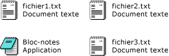

# Comment : activer l'affichage en mosaïque dans un contrôle ListView Windows Forms à l'aide du concepteurHow to: Enable Tile View in a Windows Forms ListView Control Using the Designer
La fonctionnalité d’affichage en mosaïque de le <xref:System.Windows.Forms.ListView> contrôle vous permet de fournir un équilibre visuel entre les informations graphiques et textuelles.The tile view feature of the <xref:System.Windows.Forms.ListView> control enables you to provide a visual balance between graphical and textual information. Les informations textuelles affichées pour un élément dans l'affichage en mosaïque sont identiques aux informations de colonne définies pour le mode Détails.The textual information displayed for an item in tile view is the same as the column information defined for details view. Affichage en mosaïque fonctionne en association avec le regroupement ou d’insertion marque des fonctionnalités dans le <xref:System.Windows.Forms.ListView> contrôle.Tile view functions in combination with either the grouping or insertion mark features in the <xref:System.Windows.Forms.ListView> control.  
  
 L’affichage en mosaïque utilise une icône 32 x 32 et plusieurs lignes de texte, comme illustré dans l’image suivante.The tile view uses a 32 x 32 icon and several lines of text, as shown in the following image.  
  
   
  
 Affichage en mosaïque propriétés et méthodes vous permettent de spécifier les champs de colonne à afficher pour chaque élément et contrôler collectivement la taille et l’apparence de tous les éléments dans une fenêtre d’affichage en mosaïque.Tile view properties and methods enable you to specify which column fields to display for each item, and to collectively control the size and appearance of all items within a tile view window. Pour plus de clarté, la première ligne de texte dans une mosaïque est toujours le nom de l’élément ; Il ne peut pas être modifié.For clarity, the first line of text in a tile is always the item's name; it cannot be changed.  
  
 La procédure suivante requiert un **Application Windows** projet avec un formulaire contenant un <xref:System.Windows.Forms.ListView> contrôle.The following procedure requires a **Windows Application** project with a form containing a <xref:System.Windows.Forms.ListView> control. Pour plus d’informations sur la configuration d’un tel projet, consultez [Comment : créer un projet d’Application Windows](http://msdn.microsoft.com/library/b2f93fed-c635-4705-8d0e-cf079a264efa) et [Comment : ajouter des contrôles aux Windows Forms](../../../../docs/framework/winforms/controls/how-to-add-controls-to-windows-forms.md).For information about setting up such a project, see [How to: Create a Windows Application Project](http://msdn.microsoft.com/library/b2f93fed-c635-4705-8d0e-cf079a264efa) and [How to: Add Controls to Windows Forms](../../../../docs/framework/winforms/controls/how-to-add-controls-to-windows-forms.md).  
  
> [!NOTE]
>  L'affichage en mosaïque est disponible uniquement sur [!INCLUDE[WinXpFamily](../../../../includes/winxpfamily-md.md)] quand votre application appelle la méthode <xref:System.Windows.Forms.Application.EnableVisualStyles%2A?displayProperty=nameWithType>.The tile view is available only on [!INCLUDE[WinXpFamily](../../../../includes/winxpfamily-md.md)] when your application calls the <xref:System.Windows.Forms.Application.EnableVisualStyles%2A?displayProperty=nameWithType> method. Sur les systèmes d'exploitation antérieurs, tout code lié à l'affichage en mosaïque n'a aucun effet et le contrôle <xref:System.Windows.Forms.ListView> s'affiche en mode Grandes icônes.On earlier operating systems, any code related to the tile view has no effect, and the <xref:System.Windows.Forms.ListView> control displays in the large icon view. Pour plus d'informations, consultez <xref:System.Windows.Forms.ListView.View%2A?displayProperty=nameWithType>.For more information, see <xref:System.Windows.Forms.ListView.View%2A?displayProperty=nameWithType>.  
>   
>  Les boîtes de dialogue et les commandes de menu qui s'affichent peuvent être différentes de celles qui sont décrites dans l'aide, en fonction de vos paramètres actifs ou de l'édition utilisée.The dialog boxes and menu commands you see might differ from those described in Help depending on your active settings or edition. Pour modifier vos paramètres, choisissez **Importation et exportation de paramètres** dans le menu **Outils** .To change your settings, choose **Import and Export Settings** on the **Tools** menu. Pour plus d’informations, consultez [Personnalisation des paramètres de développement dans Visual Studio](http://msdn.microsoft.com/library/22c4debb-4e31-47a8-8f19-16f328d7dcd3).For more information, see [Customizing Development Settings in Visual Studio](http://msdn.microsoft.com/library/22c4debb-4e31-47a8-8f19-16f328d7dcd3).  
  
### Pour définir l’affichage en mosaïque dans le ConcepteurTo set tile view in the designer  
  
1.  Sélectionnez le <xref:System.Windows.Forms.ListView> contrôle de votre formulaire.Select the <xref:System.Windows.Forms.ListView> control on your form.  
  
2.  Dans le **propriétés** fenêtre, sélectionnez le <xref:System.Windows.Forms.ListView.View%2A> propriété et choisissez **vignette**.In the **Properties** window, select the <xref:System.Windows.Forms.ListView.View%2A> property and choose **Tile**.  
  
## Voir aussiSee Also  
 <xref:System.Windows.Forms.ListView.TileSize%2A>  
 [Fonctionnalités de Windows XP et contrôles Windows FormsWindows XP Features and Windows Forms Controls](http://msdn.microsoft.com/library/bc7fab94-fce9-4bf1-a8ad-a5837c91c3c0)  
 [Vue d’ensemble du contrôle ListViewListView Control Overview](../../../../docs/framework/winforms/controls/listview-control-overview-windows-forms.md)
