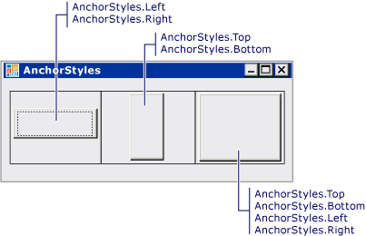

# Comment : ancrer et arrimer des contrôles enfants dans un contrôle TableLayoutPanel
Le contrôle <xref:System.Windows.Forms.TableLayoutPanel> prend en charge les propriétés <xref:System.Windows.Forms.Control.Anchor%2A> et <xref:System.Windows.Forms.Control.Dock%2A> dans ses contrôles enfants.  
  
### Pour aligner un contrôle enfant dans une cellule TableLayoutPanel  
  
1.  Créez un contrôle <xref:System.Windows.Forms.TableLayoutPanel> sur votre formulaire.  
  
2.  Définir la valeur de la <xref:System.Windows.Forms.TableLayoutPanel> du contrôle <xref:System.Windows.Forms.TableLayoutPanel.ColumnCount%2A> et <xref:System.Windows.Forms.TableLayoutPanel.RowCount%2A> propriétés **1**.  
  
3.  Créez un contrôle <xref:System.Windows.Forms.Button> dans le contrôle <xref:System.Windows.Forms.TableLayoutPanel>. Le <xref:System.Windows.Forms.Button> occupe le coin supérieur gauche de la cellule.  
  
4.  Affectez la valeur `Left` à la propriété <xref:System.Windows.Forms.Control.Anchor%2A> du contrôle <xref:System.Windows.Forms.Button>. Le contrôle <xref:System.Windows.Forms.Button> se déplace pour s'aligner avec la bordure gauche de la cellule.  
  
    > [!NOTE]
    >  Ce comportement diffère du comportement des autres contrôles conteneurs. Dans d'autres contrôles conteneurs, le contrôle enfant ne bouge pas quand la propriété <xref:System.Windows.Forms.Control.Anchor%2A> est définie et la distance entre le contrôle ancré et la limite du parent conteneur est fixée au moment où la propriété <xref:System.Windows.Forms.Control.Anchor%2A> est définie.  
  
5.  Affectez la valeur `Top, Left` à la propriété <xref:System.Windows.Forms.Control.Anchor%2A> du contrôle <xref:System.Windows.Forms.Button>. Le contrôle <xref:System.Windows.Forms.Button> se déplace pour occuper l'angle supérieur gauche de la cellule.  
  
6.  Répétez l’étape 5 avec une valeur de `Top, Right` pour déplacer le <xref:System.Windows.Forms.Button> contrôle à l’angle supérieur droit de la cellule. Répétez l’opération avec les valeurs `Bottom, Left` et `Bottom, Right`.  
  
### Pour étendre un contrôle enfant dans une cellule TableLayoutPanel  
  
1.  Affectez la valeur `Left, Right` à la propriété <xref:System.Windows.Forms.Control.Anchor%2A> du contrôle <xref:System.Windows.Forms.Button>. Le contrôle <xref:System.Windows.Forms.Button> est redimensionné pour s'étendre sur toute la cellule.  
  
    > [!NOTE]
    >  Ce comportement diffère du comportement des autres contrôles conteneurs. Dans d’autres contrôles conteneurs, le contrôle enfant n’est pas redimensionné quand la <xref:System.Windows.Forms.Control.Anchor%2A> est définie sur `Left, Right` ou `Top, Bottom`.  
  
2.  Affectez la valeur `Top, Bottom` à la propriété <xref:System.Windows.Forms.Control.Anchor%2A> du contrôle <xref:System.Windows.Forms.Button>. Le contrôle <xref:System.Windows.Forms.Button> est redimensionné pour s'étendre du haut en bas de la cellule.  
  
3.  Affectez la valeur `Top, Bottom, Left, Right` à la propriété <xref:System.Windows.Forms.Control.Anchor%2A> du contrôle <xref:System.Windows.Forms.Button>. Le contrôle <xref:System.Windows.Forms.Button> est redimensionné pour remplir la cellule.  
  
4.  Affectez la valeur `None` à la propriété <xref:System.Windows.Forms.Control.Anchor%2A> du contrôle <xref:System.Windows.Forms.Button>. Le contrôle <xref:System.Windows.Forms.Button> est redimensionné et centré dans la cellule.  
  
5.  Affectez la valeur <xref:System.Windows.Forms.DockStyle.Left> à la propriété <xref:System.Windows.Forms.Control.Dock%2A> du contrôle <xref:System.Windows.Forms.Button>. Le contrôle <xref:System.Windows.Forms.Button> se déplace pour s'aligner avec la bordure gauche de la cellule. Le contrôle <xref:System.Windows.Forms.Button> conserve sa largeur, mais sa hauteur est redimensionnée pour remplir la cellule verticalement.  
  
    > [!NOTE]
    >  Il s'agit du même comportement que celui des autres contrôles conteneurs.  
  
6.  Affectez la valeur <xref:System.Windows.Forms.DockStyle.Fill> à la propriété <xref:System.Windows.Forms.Control.Dock%2A> du contrôle <xref:System.Windows.Forms.Button>. Le contrôle <xref:System.Windows.Forms.Button> est redimensionné pour remplir la cellule.  
  
## Exemple  
 L'illustration suivante montre cinq boutons ancrés dans cinq cellules <xref:System.Windows.Forms.TableLayoutPanel> distinctes.  
  
   
  
 L'illustration suivante montre quatre boutons ancrés dans les coins de quatre cellules <xref:System.Windows.Forms.TableLayoutPanel> distinctes.  
  
   
  
 L'illustration suivante montre trois boutons étirés par ancrage dans trois cellules <xref:System.Windows.Forms.TableLayoutPanel> distinctes.  
  
   
  
 L'exemple de code suivant montre toutes les combinaisons de valeurs de propriété <xref:System.Windows.Forms.Control.Anchor%2A> pour un contrôle <xref:System.Windows.Forms.Button> dans un contrôle <xref:System.Windows.Forms.TableLayoutPanel>.  
  
 [!code-csharp[System.Windows.Forms.TableLayoutPanel.AnchorExampleForm#1](../../../../samples/snippets/csharp/VS_Snippets_Winforms/System.Windows.Forms.TableLayoutPanel.AnchorExampleForm/CS/TlpAnchorExampleForm.cs#1)]
 [!code-vb[System.Windows.Forms.TableLayoutPanel.AnchorExampleForm#1](../../../../samples/snippets/visualbasic/VS_Snippets_Winforms/System.Windows.Forms.TableLayoutPanel.AnchorExampleForm/VB/TlpAnchorExampleForm.vb#1)]  
  
## Compilation du code  
 Cet exemple nécessite :  
  
-   Références aux assemblys System, System.Data, System.Drawing et System.Windows.Forms.  
  
 Pour plus d’informations sur la création de cet exemple à partir de la ligne de commande pour [!INCLUDE[vbprvb](../../../../includes/vbprvb-md.md)] ou [!INCLUDE[csprcs](../../../../includes/csprcs-md.md)], consultez [Génération à partir de la ligne de commande](~/docs/visual-basic/reference/command-line-compiler/building-from-the-command-line.md) ou [Génération à partir de la ligne de commande avec csc.exe](~/docs/csharp/language-reference/compiler-options/command-line-building-with-csc-exe.md). Vous pouvez également générer cet exemple dans [!INCLUDE[vsprvs](../../../../includes/vsprvs-md.md)] en collant le code dans un nouveau projet.  Consultez également [Guide pratique pour compiler et exécuter un exemple complet de code Windows Forms à l’aide de Visual Studio](http://msdn.microsoft.com/library/Bb129228\(v=vs.110\)).  
  
## Voir aussi  
 <xref:System.Windows.Forms.TableLayoutPanel>  
 [TableLayoutPanel, contrôle](../../../../docs/framework/winforms/controls/tablelayoutpanel-control-windows-forms.md)
