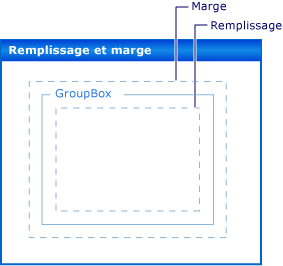

# Procédure pas à pas : disposition des contrôles Windows Forms avec les propriétés Padding, Margins et AutoSizeWalkthrough: Laying Out Windows Forms Controls with Padding, Margins, and the AutoSize Property
Le positionnement précis des contrôles sur votre formulaire constitue une haute priorité pour de nombreuses applications.Precise placement of controls on your form is a high priority for many applications. Le **Concepteur Windows Forms** vous offre de nombreux outils de disposition pour y parvenir.The **Windows Forms Designer** gives you many layout tools to accomplish this. Trois des plus importants sont les <xref:System.Windows.Forms.Control.Margin%2A>, <xref:System.Windows.Forms.Control.Padding%2A>, et <xref:System.Windows.Forms.Control.AutoSize%2A> propriétés, qui sont présentes sur tous les contrôles Windows Forms.Three of the most important are the <xref:System.Windows.Forms.Control.Margin%2A>, <xref:System.Windows.Forms.Control.Padding%2A>, and <xref:System.Windows.Forms.Control.AutoSize%2A> properties, which are present on all Windows Forms controls.  
  
 La propriété <xref:System.Windows.Forms.Control.Margin%2A> définit l'espace autour du contrôle qui maintient les autres contrôles à une distance spécifiée des bordures du contrôle.The <xref:System.Windows.Forms.Control.Margin%2A> property defines the space around the control that keeps other controls a specified distance from the control's borders.  
  
 La propriété <xref:System.Windows.Forms.Control.Padding%2A> définit l'espace à l'intérieur d'un contrôle qui maintient le contenu du contrôle (par exemple la valeur de sa propriété <xref:System.Windows.Forms.Control.Text%2A>) à une distance spécifiée des bordures du contrôle.The <xref:System.Windows.Forms.Control.Padding%2A> property defines the space in the interior of a control that keeps the control's content (for example, the value of its <xref:System.Windows.Forms.Control.Text%2A> property) a specified distance from the control's borders.  
  
 L'illustration suivante montre les propriétés <xref:System.Windows.Forms.Control.Padding%2A> et <xref:System.Windows.Forms.Control.Margin%2A> d'un contrôle.The following illustration shows the <xref:System.Windows.Forms.Control.Padding%2A> and <xref:System.Windows.Forms.Control.Margin%2A> properties on a control.  
  
   
  
 Le <xref:System.Windows.Forms.Control.AutoSize%2A> propriété indique à un contrôle se redimensionne automatiquement à son contenu.The <xref:System.Windows.Forms.Control.AutoSize%2A> property tells a control to automatically size itself to its contents. Il n’est pas redimensionné automatiquement pour être plus petite que la valeur de son état d’origine <xref:System.Windows.Forms.Control.Size%2A> propriété et il représentera la valeur de son <xref:System.Windows.Forms.Control.Padding%2A> propriété.It will not resize itself to be smaller than the value of its original <xref:System.Windows.Forms.Control.Size%2A> property, and it will account for the value of its <xref:System.Windows.Forms.Control.Padding%2A> property.  
  
 Cette procédure pas à pas décrit notamment les tâches suivantes :Tasks illustrated in this walkthrough include:  
  
-   Création d’un projet Windows FormsCreating a Windows Forms project  
  
-   Définition des marges de vos contrôlesSetting Margins for Your Controls  
  
-   Définition du remplissage de vos contrôlesSetting Padding for Your Controls  
  
-   Dimensionnement automatique de vos contrôlesAutomatically Sizing Your Controls  
  
 À l’issue de cette procédure, vous comprendrez le rôle joué par ces fonctionnalités de disposition importantes.When you are finished, you will have an understanding of the role played by these important layout features.  
  
> [!NOTE]
>  Les boîtes de dialogue et les commandes de menu qui s'affichent peuvent être différentes de celles qui sont décrites dans l'aide, en fonction de vos paramètres actifs ou de l'édition utilisée.The dialog boxes and menu commands you see might differ from those described in Help depending on your active settings or edition. Pour modifier vos paramètres, choisissez **Importation et exportation de paramètres** dans le menu **Outils** .To change your settings, choose **Import and Export Settings** on the **Tools** menu. Pour plus d’informations, consultez [Personnalisation des paramètres de développement dans Visual Studio](http://msdn.microsoft.com/en-us/22c4debb-4e31-47a8-8f19-16f328d7dcd3).For more information, see [Customizing Development Settings in Visual Studio](http://msdn.microsoft.com/en-us/22c4debb-4e31-47a8-8f19-16f328d7dcd3).  
  
## Conditions préalablesPrerequisites  
 Pour exécuter cette procédure pas à pas, vous avez besoin des éléments suivants :In order to complete this walkthrough, you will need:  
  
-   Autorisations suffisantes pour pouvoir créer et exécuter des projets d’application Windows Forms sur l’ordinateur où Visual Studio est installé.Sufficient permissions to be able to create and run Windows Forms application projects on the computer where Visual Studio is installed.  
  
## Création du projetCreating the Project  
 La première étape consiste à créer le projet et à configurer le formulaire.The first step is to create the project and set up the form.  
  
#### Pour créer le projetTo create the project  
  
1.  Créer un **Application Windows** projet appelé `LayoutExample`.Create a **Windows Application** project called `LayoutExample`. Pour plus d’informations, consultez [Comment : créer un projet d’Application Windows](http://msdn.microsoft.com/en-us/b2f93fed-c635-4705-8d0e-cf079a264efa) .For more information, see [How to: Create a Windows Application Project](http://msdn.microsoft.com/en-us/b2f93fed-c635-4705-8d0e-cf079a264efa) .  
  
2.  Sélectionnez le formulaire dans le **Concepteur Windows Forms**.Select the form in the **Windows Forms Designer**.  
  
## Définition des marges de vos contrôlesSetting Margins for Your Controls  
 Vous pouvez définir la distance par défaut entre vos contrôles à l’aide de la <xref:System.Windows.Forms.Control.Margin%2A> propriété.You can set the default distance between your controls using the <xref:System.Windows.Forms.Control.Margin%2A> property. Lorsque vous déplacez un contrôle suffisamment proches d’un autre contrôle, vous verrez une ligne d’alignement qui affiche les marges pour les deux contrôles.When you move a control close enough to another control, you will see a snapline that shows the margins for the two controls. Le contrôle que vous déplacez s’alignera également à la distance définie par les marges.The control you are moving will also snap to the distance defined by the margins.  
  
#### Pour réorganiser des contrôles sur votre formulaire à l’aide de la propriété MarginTo arrange controls on your form using the Margin property  
  
1.  Faites glisser deux <xref:System.Windows.Forms.Button> des contrôles de la **boîte à outils** vers votre formulaire.Drag two <xref:System.Windows.Forms.Button> controls from the **Toolbox** onto your form.  
  
2.  Sélectionnez une de le <xref:System.Windows.Forms.Button> contrôle et déplacez-le proche de l’autre, jusqu'à ce qu’ils se touchent presque.Select one of the <xref:System.Windows.Forms.Button> controls and move it close to the other, until they are almost touching.  
  
     Observez la ligne d’alignement qui apparaît entre eux.Observe the snapline that appears between them. Cette distance est la somme des deux contrôles <xref:System.Windows.Forms.Control.Margin%2A> valeurs.This distance is the sum of the two controls' <xref:System.Windows.Forms.Control.Margin%2A> values. Le contrôle que vous déplacez s’aligne sur cette distance.The control you are moving snaps to this distance. Pour plus d’informations, consultez [procédure pas à pas : organisation des contrôles dans les Windows Forms à l’aide des lignes d’alignement](../../../../docs/framework/winforms/controls/walkthrough-arranging-controls-on-windows-forms-using-snaplines.md).For details, see [Walkthrough: Arranging Controls on Windows Forms Using Snaplines](../../../../docs/framework/winforms/controls/walkthrough-arranging-controls-on-windows-forms-using-snaplines.md).  
  
3.  Modifier la <xref:System.Windows.Forms.Control.Margin%2A> propriété de l’un des contrôles en développant le <xref:System.Windows.Forms.Control.Margin%2A> entrée dans le **propriétés** fenêtre et en attribuant le <xref:System.Windows.Forms.Padding.All%2A> propriété à 20.Change the <xref:System.Windows.Forms.Control.Margin%2A> property of one of the controls by expanding the <xref:System.Windows.Forms.Control.Margin%2A> entry in the **Properties** window and setting the <xref:System.Windows.Forms.Padding.All%2A> property to 20.  
  
4.  Sélectionnez une de le <xref:System.Windows.Forms.Button> contrôle et déplacez-le proche de l’autre.Select one of the <xref:System.Windows.Forms.Button> controls and move it close to the other.  
  
     La ligne d’alignement définit la somme des valeurs de marge est plus longue et que le contrôle s’aligne à une distance supérieure à partir de l’autre contrôlent.The snapline defining the sum of the margin values is longer and that the control snaps to a greater distance from the other control.  
  
5.  Modifier la <xref:System.Windows.Forms.Control.Margin%2A> propriété du contrôle sélectionné en développant le <xref:System.Windows.Forms.Control.Margin%2A> entrée dans le **propriétés** fenêtre et en attribuant le <xref:System.Windows.Forms.Padding.Top%2A> propriété à 5.Change the <xref:System.Windows.Forms.Control.Margin%2A> property of the selected control by expanding the <xref:System.Windows.Forms.Control.Margin%2A> entry in the **Properties** window and setting the <xref:System.Windows.Forms.Padding.Top%2A> property to 5.  
  
6.  Déplace le contrôle sélectionné sous l’autre contrôle et notez que la ligne d’alignement est plus court.Move the selected control below the other control and observe that the snapline is shorter. Déplacer le contrôle sélectionné à gauche de l’autre contrôle et observez que la ligne d’alignement conserve la valeur observée à l’étape 4.Move the selected control to the left of the other control and observe that the snapline retains the value observed in step 4.  
  
7.  Vous pouvez définir chacun des aspects de la <xref:System.Windows.Forms.Control.Margin%2A> propriété, <xref:System.Windows.Forms.Padding.Left%2A>, <xref:System.Windows.Forms.Padding.Top%2A>, <xref:System.Windows.Forms.Padding.Right%2A>, <xref:System.Windows.Forms.Padding.Bottom%2A>, pour des valeurs différentes, ou vous peut affecter tous la même valeur avec le <xref:System.Windows.Forms.Padding.All%2A> propriété.You can set each of the aspects of the <xref:System.Windows.Forms.Control.Margin%2A> property, <xref:System.Windows.Forms.Padding.Left%2A>, <xref:System.Windows.Forms.Padding.Top%2A>, <xref:System.Windows.Forms.Padding.Right%2A>, <xref:System.Windows.Forms.Padding.Bottom%2A>, to different values, or you can set them all to the same value with the <xref:System.Windows.Forms.Padding.All%2A> property.  
  
## Définition du remplissage de vos contrôlesSetting Padding for Your Controls  
 Pour obtenir la disposition précise requise pour votre application, vos contrôles contient souvent des contrôles enfants.To achieve the precise layout required for your application, your controls will often contain child controls. Lorsque vous souhaitez spécifier la proximité de bordure du contrôle de l’enfant à la bordure du contrôle de parent, utilisez du contrôle parent <xref:System.Windows.Forms.Control.Padding%2A> propriété conjointement avec le contrôle d’enfant <xref:System.Windows.Forms.Control.Margin%2A> propriété.When you want to specify the proximity of the child control's border to the parent control's border, use the parent control's <xref:System.Windows.Forms.Control.Padding%2A> property in conjunction with the child control's <xref:System.Windows.Forms.Control.Margin%2A> property. Le <xref:System.Windows.Forms.Control.Padding%2A> propriété est également utilisée pour contrôler la proximité du contenu d’un contrôle (par exemple, un <xref:System.Windows.Forms.Button> du contrôle <xref:System.Windows.Forms.Control.Text%2A> propriété) à ses bordures.The <xref:System.Windows.Forms.Control.Padding%2A> property is also used to control the proximity of a control's content (for example, a <xref:System.Windows.Forms.Button> control's <xref:System.Windows.Forms.Control.Text%2A> property) to its borders.  
  
#### Pour réorganiser des contrôles sur votre formulaire à l’aide du remplissageTo arrange controls on your form using padding  
  
1.  Faites glisser un <xref:System.Windows.Forms.Button> contrôle depuis la **boîte à outils** vers votre formulaire.Drag a <xref:System.Windows.Forms.Button> control from the **Toolbox** onto your form.  
  
2.  Affectez la valeur `true` à la propriété <xref:System.Windows.Forms.Control.AutoSize%2A> du contrôle <xref:System.Windows.Forms.Button>.Change the value of the <xref:System.Windows.Forms.Button> control's <xref:System.Windows.Forms.Control.AutoSize%2A> property to `true`.  
  
3.  Modifier la <xref:System.Windows.Forms.Control.Padding%2A> propriété en développant le <xref:System.Windows.Forms.Control.Padding%2A> entrée dans le **propriétés** fenêtre et en attribuant le <xref:System.Windows.Forms.Padding.All%2A> propriété à 5.Change the <xref:System.Windows.Forms.Control.Padding%2A> property by expanding the <xref:System.Windows.Forms.Control.Padding%2A> entry in the **Properties** window and setting the <xref:System.Windows.Forms.Padding.All%2A> property to 5.  
  
     Le contrôle se développe pour fournir l’espace pour le nouveau remplissage.The control expands to provide room for the new padding.  
  
4.  Faites glisser un <xref:System.Windows.Forms.GroupBox> contrôle depuis la **boîte à outils** vers votre formulaire.Drag a <xref:System.Windows.Forms.GroupBox> control from the **Toolbox** onto your form. Faites glisser un <xref:System.Windows.Forms.Button> contrôle depuis la **boîte à outils** dans le <xref:System.Windows.Forms.GroupBox> contrôle.Drag a <xref:System.Windows.Forms.Button> control from the **Toolbox** into the <xref:System.Windows.Forms.GroupBox> control. Position du <xref:System.Windows.Forms.Button> contrôler par conséquent, il est aligné sur le coin inférieur droit de la <xref:System.Windows.Forms.GroupBox> contrôle.Position the <xref:System.Windows.Forms.Button> control so it is flush with the lower-right corner of the <xref:System.Windows.Forms.GroupBox> control.  
  
     Observez les lignes d’alignement apparaissent en tant que le <xref:System.Windows.Forms.Button> contrôle s’approche des bordures inférieure et droite de la <xref:System.Windows.Forms.GroupBox> contrôle.Observe the snaplines that appear as the <xref:System.Windows.Forms.Button> control approaches the bottom and right borders of the <xref:System.Windows.Forms.GroupBox> control. Ces lignes d’alignement correspondent à la <xref:System.Windows.Forms.Control.Margin%2A> propriété de la <xref:System.Windows.Forms.Button>.These snaplines correspond to the <xref:System.Windows.Forms.Control.Margin%2A> property of the <xref:System.Windows.Forms.Button>.  
  
5.  Modifier la <xref:System.Windows.Forms.GroupBox> du contrôle <xref:System.Windows.Forms.Control.Padding%2A> propriété en développant le <xref:System.Windows.Forms.Control.Padding%2A> entrée dans le **propriétés** fenêtre et en attribuant le <xref:System.Windows.Forms.Padding.All%2A> propriété à 20.Change the <xref:System.Windows.Forms.GroupBox> control's <xref:System.Windows.Forms.Control.Padding%2A> property by expanding the <xref:System.Windows.Forms.Control.Padding%2A> entry in the **Properties** window and setting the <xref:System.Windows.Forms.Padding.All%2A> property to 20.  
  
6.  Sélectionnez le <xref:System.Windows.Forms.Button> contrôler dans le <xref:System.Windows.Forms.GroupBox> de contrôle et déplacez-le vers le centre de la <xref:System.Windows.Forms.GroupBox>.Select the <xref:System.Windows.Forms.Button> control within the <xref:System.Windows.Forms.GroupBox> control and move it toward the center of the <xref:System.Windows.Forms.GroupBox>.  
  
     Les lignes d’alignement apparaissent à une distance supérieure des bordures de la <xref:System.Windows.Forms.GroupBox> contrôle.The snaplines appear at a greater distance from the borders of the <xref:System.Windows.Forms.GroupBox> control. Cette distance est la somme de la <xref:System.Windows.Forms.Button> du contrôle <xref:System.Windows.Forms.Control.Margin%2A> propriété et la <xref:System.Windows.Forms.GroupBox> du contrôle <xref:System.Windows.Forms.Control.Padding%2A> propriété.This distance is the sum of the <xref:System.Windows.Forms.Button> control's <xref:System.Windows.Forms.Control.Margin%2A> property and the <xref:System.Windows.Forms.GroupBox> control's <xref:System.Windows.Forms.Control.Padding%2A> property.  
  
## Dimensionnement automatique de vos contrôlesAutomatically Sizing Your Controls  
 Dans certaines applications, la taille d’un contrôle non sera le même en cours d’exécution tel qu’il était au moment du design.In some applications, the size of a control will not be the same at run time as it was at design time. Le texte d’un <xref:System.Windows.Forms.Button> (contrôle), par exemple, peut-être être pris à partir d’une base de données, et sa longueur n’est pas connue à l’avance.The text of a <xref:System.Windows.Forms.Button> control, for example, may be taken from a database, and its length will not be known in advance.  
  
 Lorsque le <xref:System.Windows.Forms.Control.AutoSize%2A> est définie sur `true`, le contrôle ajuste sa taille à son contenu.When the <xref:System.Windows.Forms.Control.AutoSize%2A> property is set to `true`, the control will size itself to its content. Pour plus d’informations, consultez [vue d’ensemble de la propriété AutoSize](../../../../docs/framework/winforms/controls/autosize-property-overview.md).For more information, see [AutoSize Property Overview](../../../../docs/framework/winforms/controls/autosize-property-overview.md).  
  
#### Pour réorganiser des contrôles sur votre formulaire à l’aide de la propriété AutoSizeTo arrange controls on your form using the AutoSize property  
  
1.  Faites glisser un <xref:System.Windows.Forms.Button> contrôle depuis la **boîte à outils** vers votre formulaire.Drag a <xref:System.Windows.Forms.Button> control from the **Toolbox** onto your form.  
  
2.  Affectez la valeur `true` à la propriété <xref:System.Windows.Forms.Control.AutoSize%2A> du contrôle <xref:System.Windows.Forms.Button>.Change the value of the <xref:System.Windows.Forms.Button> control's <xref:System.Windows.Forms.Control.AutoSize%2A> property to `true`.  
  
3.  Modifier la <xref:System.Windows.Forms.Button> du contrôle <xref:System.Windows.Forms.Control.Text%2A> propriété »**ce bouton a une longue chaîne pour sa propriété Text**. »Change the <xref:System.Windows.Forms.Button> control's <xref:System.Windows.Forms.Control.Text%2A> property to "**This button has a long string for its Text property**."  
  
     Lorsque vous validez la modification, la <xref:System.Windows.Forms.Button> contrôle se redimensionne pour contenir le nouveau texte.When you commit the change, the <xref:System.Windows.Forms.Button> control resizes itself to fit the new text.  
  
4.  Faites glisser une autre <xref:System.Windows.Forms.Button> contrôle depuis la **boîte à outils** vers votre formulaire.Drag another <xref:System.Windows.Forms.Button> control from the **Toolbox** onto your form.  
  
5.  Modifier la <xref:System.Windows.Forms.Button> du contrôle <xref:System.Windows.Forms.Control.Text%2A> propriété »**ce bouton a une longue chaîne pour sa propriété Text.**»Change the <xref:System.Windows.Forms.Button> control's <xref:System.Windows.Forms.Control.Text%2A> property to "**This button has a long string for its Text property.**"  
  
     Lorsque vous validez la modification, la <xref:System.Windows.Forms.Button> contrôle ne se redimensionne pas, et le texte est tronqué par le bord droit du contrôle.When you commit the change, the <xref:System.Windows.Forms.Button> control does not resize itself, and the text is clipped by the right edge of the control.  
  
6.  Modifier la <xref:System.Windows.Forms.Control.Padding%2A> propriété en développant le <xref:System.Windows.Forms.Control.Padding%2A> entrée dans le **propriétés** fenêtre et en attribuant le <xref:System.Windows.Forms.Padding.All%2A> propriété à 5.Change the <xref:System.Windows.Forms.Control.Padding%2A> property by expanding the <xref:System.Windows.Forms.Control.Padding%2A> entry in the **Properties** window and setting the <xref:System.Windows.Forms.Padding.All%2A> property to 5.  
  
     Le texte de l’intérieur du contrôle est découpé sur les quatre côtés.The text in the control's interior is clipped on all four sides.  
  
7.  Modifier la <xref:System.Windows.Forms.Button> du contrôle <xref:System.Windows.Forms.Control.AutoSize%2A> propriété `true`.Change the <xref:System.Windows.Forms.Button> control's <xref:System.Windows.Forms.Control.AutoSize%2A> property to `true`.  
  
     Le <xref:System.Windows.Forms.Button> contrôle se redimensionne pour contenir la chaîne entière.The <xref:System.Windows.Forms.Button> control resizes itself to encompass the entire string. En outre, le remplissage a été ajouté autour du texte, à l’origine de la <xref:System.Windows.Forms.Button> contrôle à développer dans les quatre directions.Also, padding has been added around the text, causing the <xref:System.Windows.Forms.Button> control to expand in all four directions.  
  
8.  Faites glisser un <xref:System.Windows.Forms.Button> contrôle depuis la **boîte à outils** vers votre formulaire.Drag a <xref:System.Windows.Forms.Button> control from the **Toolbox** onto your form. Placez-le près de l’angle inférieur droit du formulaire.Position it near the lower-right corner of the form.  
  
9. Affectez la valeur `true` à la propriété <xref:System.Windows.Forms.Control.AutoSize%2A> du contrôle <xref:System.Windows.Forms.Button>.Change the value of the <xref:System.Windows.Forms.Button> control's <xref:System.Windows.Forms.Control.AutoSize%2A> property to `true`.  
  
10. Définir le <xref:System.Windows.Forms.Button> du contrôle <xref:System.Windows.Forms.Control.Anchor%2A> propriété <xref:System.Windows.Forms.AnchorStyles.Right>, <xref:System.Windows.Forms.AnchorStyles.Bottom>.Set the <xref:System.Windows.Forms.Button> control's <xref:System.Windows.Forms.Control.Anchor%2A> property to <xref:System.Windows.Forms.AnchorStyles.Right>, <xref:System.Windows.Forms.AnchorStyles.Bottom>.  
  
11. Modifier la <xref:System.Windows.Forms.Button> du contrôle <xref:System.Windows.Forms.Control.Text%2A> propriété »**ce bouton a une longue chaîne pour sa propriété Text.**»Change the <xref:System.Windows.Forms.Button> control's <xref:System.Windows.Forms.Control.Text%2A> property to "**This button has a long string for its Text property.**"  
  
     Lorsque vous validez la modification, la <xref:System.Windows.Forms.Button> contrôle redimensionne vers la gauche.When you commit the change, the <xref:System.Windows.Forms.Button> control resizes itself toward the left. En général, le dimensionnement automatique augmente la taille d’un contrôle dans le sens opposé son <xref:System.Windows.Forms.Control.Anchor%2A> paramètre de propriété.In general, automatic sizing will increase the size of a control in the direction opposite its <xref:System.Windows.Forms.Control.Anchor%2A> property setting.  
  
## Propriétés AutoSize et AutoSizeModeAutoSize and AutoSizeMode Properties  
 Certains contrôles prennent en charge le `AutoSizeMode` propriété, ce qui vous donne un contrôle plus précis sur le comportement de dimensionnement automatique d’un contrôle.Some controls support the `AutoSizeMode` property, which gives you more fine-grained control over the automatic sizing behavior of a control.  
  
#### Pour utiliser la propriété AutoSizeModeTo use the AutoSizeMode property  
  
1.  Faites glisser un <xref:System.Windows.Forms.Panel> contrôle depuis la **boîte à outils** vers votre formulaire.Drag a <xref:System.Windows.Forms.Panel> control from the **Toolbox** onto your form.  
  
2.  Définir la valeur de la <xref:System.Windows.Forms.Panel> du contrôle <xref:System.Windows.Forms.Control.AutoSize%2A> propriété `true`.Set the value of the <xref:System.Windows.Forms.Panel> control's <xref:System.Windows.Forms.Control.AutoSize%2A> property to `true`.  
  
3.  Faites glisser un <xref:System.Windows.Forms.Button> contrôle depuis la **boîte à outils** dans le <xref:System.Windows.Forms.Panel> contrôle.Drag a <xref:System.Windows.Forms.Button> control from the **Toolbox** into the <xref:System.Windows.Forms.Panel> control.  
  
4.  Place le <xref:System.Windows.Forms.Button> contrôle dans l’angle inférieur droit de la <xref:System.Windows.Forms.Panel> contrôle.Place the <xref:System.Windows.Forms.Button> control near the lower-right corner of the <xref:System.Windows.Forms.Panel> control.  
  
5.  Sélectionnez le <xref:System.Windows.Forms.Panel> contrôler et saisissez la poignée de redimensionnement inférieure droite.Select the <xref:System.Windows.Forms.Panel> control and grab the lower-right sizing handle. Redimensionner le <xref:System.Windows.Forms.Panel> contrôle soit supérieure et inférieure.Resize the <xref:System.Windows.Forms.Panel> control to be larger and smaller.  
  
    > [!NOTE]
    >  Vous pouvez redimensionner librement le <xref:System.Windows.Forms.Panel> contrôle, mais vous ne pouvez pas rendre plus petit que la position de la <xref:System.Windows.Forms.Button> bas à droite du contrôle.You can freely resize the <xref:System.Windows.Forms.Panel> control, but you cannot size it smaller than the position of the <xref:System.Windows.Forms.Button> control's lower-right corner. Ce comportement est spécifié par la valeur par défaut de la `AutoSizeMode` propriété, qui est <xref:System.Windows.Forms.AutoSizeMode.GrowOnly>.This behavior is specified by the default value of the `AutoSizeMode` property, which is <xref:System.Windows.Forms.AutoSizeMode.GrowOnly>.  
  
6.  Définir la valeur de la <xref:System.Windows.Forms.Panel> du contrôle `AutoSizeMode` propriété <xref:System.Windows.Forms.AutoSizeMode.GrowAndShrink>.Set the value of the <xref:System.Windows.Forms.Panel> control's `AutoSizeMode` property to <xref:System.Windows.Forms.AutoSizeMode.GrowAndShrink>.  
  
     Le <xref:System.Windows.Forms.Panel> contrôle se redimensionne autour du <xref:System.Windows.Forms.Button> contrôle.The <xref:System.Windows.Forms.Panel> control sizes itself to surround the <xref:System.Windows.Forms.Button> control. Vous ne pouvez pas redimensionner la <xref:System.Windows.Forms.Panel> contrôle.You cannot resize the <xref:System.Windows.Forms.Panel> control.  
  
7.  Faites glisser le <xref:System.Windows.Forms.Button> contrôle vers le coin supérieur gauche de la <xref:System.Windows.Forms.Panel> contrôle.Drag the <xref:System.Windows.Forms.Button> control toward the upper-left corner of the <xref:System.Windows.Forms.Panel> control.  
  
     Le <xref:System.Windows.Forms.Panel> contrôle est redimensionné à la <xref:System.Windows.Forms.Button> nouvelle position du contrôle.The <xref:System.Windows.Forms.Panel> control resizes to the <xref:System.Windows.Forms.Button> control's new position.  
  
## Étapes suivantesNext Steps  
 Il existe de nombreuses autres fonctionnalités de disposition pour organiser les contrôles dans vos applications Windows Forms.There are many other layout features for arranging controls in your Windows Forms applications. Voici certaines combinaisons que vous pouvez essayer :Here are some combinations you might try:  
  
-   Créez un formulaire avec un <xref:System.Windows.Forms.TableLayoutPanel> contrôle.Build a form using a <xref:System.Windows.Forms.TableLayoutPanel> control. Pour plus d’informations, consultez [procédure pas à pas : organisation des contrôles dans les formulaires Windows à l’aide d’un TableLayoutPanel](../../../../docs/framework/winforms/controls/walkthrough-arranging-controls-on-windows-forms-using-a-tablelayoutpanel.md).For details, see [Walkthrough: Arranging Controls on Windows Forms Using a TableLayoutPanel](../../../../docs/framework/winforms/controls/walkthrough-arranging-controls-on-windows-forms-using-a-tablelayoutpanel.md). Essayez de modifier les valeurs de la <xref:System.Windows.Forms.TableLayoutPanel> du contrôle <xref:System.Windows.Forms.Control.Padding%2A> propriété, ainsi que le <xref:System.Windows.Forms.Control.Margin%2A> propriété sur ses contrôles enfants.Try changing the values of the <xref:System.Windows.Forms.TableLayoutPanel> control's <xref:System.Windows.Forms.Control.Padding%2A> property, as well as the <xref:System.Windows.Forms.Control.Margin%2A> property on its child controls.  
  
-   Utilisez la même expérience un <xref:System.Windows.Forms.FlowLayoutPanel> contrôle.Try the same experiment using a <xref:System.Windows.Forms.FlowLayoutPanel> control. Pour plus d’informations, consultez [procédure pas à pas : organisation des contrôles dans les Windows Forms à l’aide un FlowLayoutPanel](../../../../docs/framework/winforms/controls/walkthrough-arranging-controls-on-windows-forms-using-a-flowlayoutpanel.md).For details, see [Walkthrough: Arranging Controls on Windows Forms Using a FlowLayoutPanel](../../../../docs/framework/winforms/controls/walkthrough-arranging-controls-on-windows-forms-using-a-flowlayoutpanel.md).  
  
-   Essayez d’ancrer des contrôles enfants dans un <xref:System.Windows.Forms.Panel> contrôle.Experiment with docking child controls in a <xref:System.Windows.Forms.Panel> control. Le <xref:System.Windows.Forms.Control.Padding%2A> propriété est une réalisation plus générale de la <xref:System.Windows.Forms.ScrollableControl.DockPadding%2A> propriété et que vous pouvez répondre aux vous-même que c’est le cas en mettant un contrôle enfant dans un <xref:System.Windows.Forms.Panel> contrôle et la définition du contrôle enfant <xref:System.Windows.Forms.Control.Dock%2A> propriété <xref:System.Windows.Forms.DockStyle.Fill>.The <xref:System.Windows.Forms.Control.Padding%2A> property is a more general realization of the <xref:System.Windows.Forms.ScrollableControl.DockPadding%2A> property, and you can satisfy yourself that this is the case by putting a child control in a <xref:System.Windows.Forms.Panel> control and setting the child control's <xref:System.Windows.Forms.Control.Dock%2A> property to <xref:System.Windows.Forms.DockStyle.Fill>. Définir le <xref:System.Windows.Forms.Panel> du contrôle <xref:System.Windows.Forms.Control.Padding%2A> propriété différentes valeurs et notez l’effet.Set the <xref:System.Windows.Forms.Panel> control's <xref:System.Windows.Forms.Control.Padding%2A> property to various values and note the effect.  
  
## Voir aussiSee Also  
 <xref:System.Windows.Forms.Control.AutoSize%2A>  
 <xref:System.Windows.Forms.ScrollableControl.DockPadding%2A>  
 <xref:System.Windows.Forms.Control.Margin%2A>  
 <xref:System.Windows.Forms.Control.Padding%2A>  
 [Vue d’ensemble de la propriété AutoSizeAutoSize Property Overview](../../../../docs/framework/winforms/controls/autosize-property-overview.md)  
 [Procédure pas à pas : organisation des contrôles dans les Windows Forms à l’aide d’un TableLayoutPanelWalkthrough: Arranging Controls on Windows Forms Using a TableLayoutPanel](../../../../docs/framework/winforms/controls/walkthrough-arranging-controls-on-windows-forms-using-a-tablelayoutpanel.md)  
 [Procédure pas à pas : organisation des contrôles dans les Windows Forms à l’aide d’un FlowLayoutPanelWalkthrough: Arranging Controls on Windows Forms Using a FlowLayoutPanel](../../../../docs/framework/winforms/controls/walkthrough-arranging-controls-on-windows-forms-using-a-flowlayoutpanel.md)  
 [Procédure pas à pas : organisation des contrôles dans les Windows Forms à l’aide des lignes d’alignementWalkthrough: Arranging Controls on Windows Forms Using Snaplines](../../../../docs/framework/winforms/controls/walkthrough-arranging-controls-on-windows-forms-using-snaplines.md)
