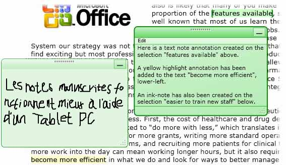
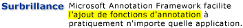
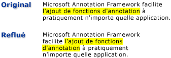

# Vue d'ensemble des annotations
Écrire des notes ou des commentaires sur des documents papier est une activité si banale que nous pensons qu’elle va de soi. Ces notes ou commentaires sont des « annotations » que nous ajoutons à un document pour marquer des informations ou mettre en évidence des éléments présentant un intérêt particulier afin de nous y référer plus tard. Bien que la rédaction de notes sur des documents imprimés soit une tâche simple et banale, la possibilité d’ajouter des commentaires personnels à des documents électroniques, quand cette fonctionnalité est disponible, est généralement très limitée.  
  
 Cette rubrique passe en revue plusieurs types d’annotation courants, en particulier les pense-bêtes et les mises en surbrillance. Elle explique en quoi [!INCLUDE[TLA#tla_caf](../../../../includes/tlasharptla-caf-md.md)] simplifie ces types d’annotation dans les applications via les contrôles d’affichage de document [!INCLUDE[TLA#tla_wpf](../../../../includes/tlasharptla-wpf-md.md)].  [!INCLUDE[TLA2#tla_wpf](../../../../includes/tla2sharptla-wpf-md.md)]incluent des contrôles d’affichage de document qui prennent en charge les annotations <xref:System.Windows.Controls.FlowDocumentReader> et <xref:System.Windows.Controls.FlowDocumentScrollViewer>, ainsi que les contrôles dérivés de <xref:System.Windows.Controls.Primitives.DocumentViewerBase> comme <xref:System.Windows.Controls.DocumentViewer> et <xref:System.Windows.Controls.FlowDocumentPageViewer>.  
  
  
   
## Pense-bêtes  
 Un pense-bête classique contient des informations écrites sur un petit bout de papier de couleur, « collé » ensuite sur un document. Les pense-bêtes numériques fournissent des fonctionnalités similaires dans les documents électroniques, tout en permettant d’inclure de nombreux autres types de contenu comme du texte tapé au clavier, des notes manuscrites (par exemple des traits « d’encre » [!INCLUDE[TLA#tla_tpc](../../../../includes/tlasharptla-tpc-md.md)]) ou des liens web.  
  
 L’illustration suivante montre quelques exemples d’annotations sous forme de mises en surbrillance, de pense-bêtes ou de notes manuscrites.  
  
   
  
 L’exemple suivant illustre la méthode que vous pouvez utiliser pour activer la prise en charge des annotations dans votre application.  
  
 [!code-csharp[DocViewerAnnotationsXml#DocViewXmlStartAnnotations](../../../../samples/snippets/csharp/VS_Snippets_Wpf/DocViewerAnnotationsXml/CSharp/Window1.xaml.cs#docviewxmlstartannotations)]
 [!code-vb[DocViewerAnnotationsXml#DocViewXmlStartAnnotations](../../../../samples/snippets/visualbasic/VS_Snippets_Wpf/DocViewerAnnotationsXml/visualbasic/window1.xaml.vb#docviewxmlstartannotations)]  
  
   
## Mises en surbrillance  
 Nous utilisons diverses méthodes créatives pour attirer l’attention sur des éléments présentant un intérêt particulier sur un document papier, par exemple en soulignant, en surlignant ou en encerclant des mots dans une phrase, ou en mettant des marques ou des annotations dans la marge.  Les annotations en surbrillance de [!INCLUDE[TLA#tla_caf](../../../../includes/tlasharptla-caf-md.md)] fournissent une fonctionnalité similaire pour marquer les informations affichées dans les contrôles d’affichage de document [!INCLUDE[TLA2#tla_wpf](../../../../includes/tla2sharptla-wpf-md.md)].  
  
 L’illustration suivante montre un exemple d’annotation en surbrillance.  
  
   
  
 Les utilisateurs créent généralement des annotations en sélectionnant du texte ou un élément d’intérêt, puis en cliquant pour afficher un <xref:System.Windows.Controls.ContextMenu> des options d’annotation.  L’exemple suivant illustre la [!INCLUDE[TLA#tla_xaml](../../../../includes/tlasharptla-xaml-md.md)] que vous pouvez utiliser pour déclarer un <xref:System.Windows.Controls.ContextMenu> avec les commandes routées auxquelles les utilisateurs peuvent accéder pour créer et gérer des annotations.  
  
 [!code-xaml[DocViewerAnnotationsXps#CreateDeleteAnnotations](../../../../samples/snippets/csharp/VS_Snippets_Wpf/DocViewerAnnotationsXps/CSharp/Window1.xaml#createdeleteannotations)]  
  
   
## Ancrage des données  
 [!INCLUDE[TLA2#tla_caf](../../../../includes/tla2sharptla-caf-md.md)] lie les annotations aux données que l’utilisateur sélectionne, pas seulement à une position dans l’affichage. Ainsi, en cas de changement de l’affichage du document, par exemple si l’utilisateur fait défiler ou redimensionne la fenêtre d’affichage, l’annotation suit la sélection de données à laquelle elle est liée. Le graphique suivant illustre une annotation que l’utilisateur a faite sur une sélection de texte. En cas de changement de l’affichage du document (défilements, redimensionnements, mises à l’échelle ou tout autre type de déplacement), l’annotation en surbrillance se déplace avec la sélection de données d’origine.  
  
   
  
   
## Mise en correspondance des annotations avec les objets annotés  
 Vous pouvez faire correspondre des annotations aux objets annotés associés. Par exemple, imaginez une simple application de lecture de document comportant un volet de commentaires. Le volet de commentaires peut être une zone de liste qui affiche le texte à partir d’une liste d’annotations ancrées à un document. Si l’utilisateur sélectionne un élément dans la zone de liste, l’application affiche le paragraphe du document auquel l’objet d’annotation correspondant est ancré.  
  
 L’exemple ci-dessous montre comment implémenter le gestionnaire d’événements de ce type de zone de liste pour servir de volet de commentaires.  
  
 [!code-csharp[FlowDocumentAnnotatedViewer#Handler](../../../../samples/snippets/csharp/VS_Snippets_Wpf/FlowDocumentAnnotatedViewer/CSharp/Window1.xaml.cs#handler)]
 [!code-vb[FlowDocumentAnnotatedViewer#Handler](../../../../samples/snippets/visualbasic/VS_Snippets_Wpf/FlowDocumentAnnotatedViewer/visualbasic/window1.xaml.vb#handler)]  
  
 Dans un autre exemple de scénario, des applications activent l’échange d’annotations et de pense-bêtes entre des lecteurs de documents par e-mail. Grâce à cette fonctionnalité, les applications peuvent amener le lecteur à la page qui contient l’annotation échangée.  
  
## Voir aussi  
 <xref:System.Windows.Controls.Primitives.DocumentViewerBase>  
 <xref:System.Windows.Controls.DocumentViewer>  
 <xref:System.Windows.Controls.FlowDocumentPageViewer>  
 <xref:System.Windows.Controls.FlowDocumentScrollViewer>  
 <xref:System.Windows.Controls.FlowDocumentReader>  
 <xref:System.Windows.Annotations.IAnchorInfo>  
 [Schéma d'annotations](../../../../docs/framework/wpf/advanced/annotations-schema.md)  
 [Vue d’ensemble de ContextMenu](../../../../docs/framework/wpf/controls/contextmenu-overview.md)  
 [Vue d’ensemble des commandes](../../../../docs/framework/wpf/advanced/commanding-overview.md)  
 [Vue d’ensemble des documents dynamiques](../../../../docs/framework/wpf/advanced/flow-document-overview.md)  
 [Guide pratique pour ajouter une commande à un MenuItem](http://msdn.microsoft.com/en-us/013d68a0-5373-4a68-bd91-5de574307370)
