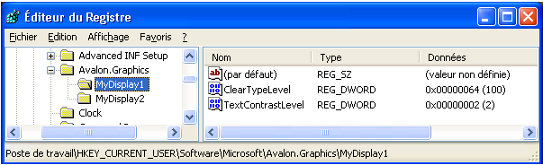
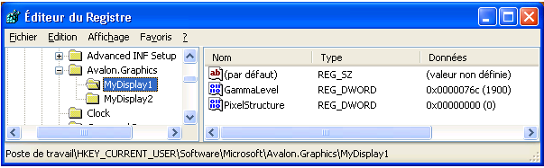

# Param&#232;tres du Registre ClearType
Cette rubrique présente une vue d'ensemble des paramètres du Registre [!INCLUDE[TLA2#tla_winclient](../../../../includes/tla2sharptla-winclient-md.md)] [!INCLUDE[TLA#tla_ct](../../../../includes/tlasharptla-ct-md.md)] qui sont utilisés par les applications [!INCLUDE[TLA2#tla_winclient](../../../../includes/tla2sharptla-winclient-md.md)].  
  
   
  
   
## Vue d'ensemble de la technologie  
 Les applications [!INCLUDE[TLA2#tla_winclient](../../../../includes/tla2sharptla-winclient-md.md)] qui restituent le texte sur un périphérique d'affichage utilisent les fonctionnalités [!INCLUDE[TLA2#tla_ct](../../../../includes/tla2sharptla-ct-md.md)] pour fournir une expérience de lecture améliorée.  [!INCLUDE[TLA2#tla_ct](../../../../includes/tla2sharptla-ct-md.md)] est une technologie logicielle développée par [!INCLUDE[TLA#tla_ms](../../../../includes/tlasharptla-ms-md.md)] qui améliore la lisibilité de texte sur les écrans LCD existants, tels que les écrans d'ordinateurs portables, les écrans de Pocket PC et les écrans plats.  [!INCLUDE[TLA2#tla_ct](../../../../includes/tla2sharptla-ct-md.md)] fonctionne en accédant aux éléments individuels de la bande de couleur verticale dans chaque pixel d'un écran LCD.  Pour plus d'informations sur [!INCLUDE[TLA2#tla_ct](../../../../includes/tla2sharptla-ct-md.md)], consultez [Vue d'ensemble de ClearType](../../../../docs/framework/wpf/advanced/cleartype-overview.md).  
  
 Le texte restitué avec [!INCLUDE[TLA2#tla_ct](../../../../includes/tla2sharptla-ct-md.md)] peut apparaître considérablement différent lorsqu'il est affiché sur différents périphériques d'affichage.  Par exemple, un petit nombre de moniteurs implémentent les éléments de la bande de couleur dans l'ordre bleu, vert, rouge et non dans l'ordre courant rouge, vert, bleu \([!INCLUDE[TLA#tla_rgb](../../../../includes/tlasharptla-rgb-md.md)]\).  
  
 Le texte restitué avec [!INCLUDE[TLA2#tla_ct](../../../../includes/tla2sharptla-ct-md.md)] peut également apparaître considérablement différent lorsqu'il est affiché par les individus dans des niveaux de sensibilité chromatique variables.  Certains individus peuvent détecter mieux que d'autres les variations chromatiques légères.  
  
 Dans chacun de ces cas, les fonctions [!INCLUDE[TLA2#tla_ct](../../../../includes/tla2sharptla-ct-md.md)] doivent être modifiées afin d'offrir à chaque individu la meilleure expérience de lecture possible.  
  
   
## Paramètres du Registre  
 [!INCLUDE[TLA2#tla_winclient](../../../../includes/tla2sharptla-winclient-md.md)] spécifie quatre paramètres du Registre pour contrôler les fonctions [!INCLUDE[TLA2#tla_ct](../../../../includes/tla2sharptla-ct-md.md)] :  
  
|Paramètre|Description|  
|---------------|-----------------|  
|Niveau [!INCLUDE[TLA2#tla_ct](../../../../includes/tla2sharptla-ct-md.md)]|Décrit le niveau de clarté des couleurs [!INCLUDE[TLA2#tla_ct](../../../../includes/tla2sharptla-ct-md.md)].|  
|Niveau gamma|Décrit le niveau du composant de couleur des pixels d'un périphérique d'affichage.|  
|Structure des pixels|Décrit la disposition des pixels d'un périphérique d'affichage.|  
|Niveau de contraste du texte|Décrit le niveau de contraste du texte affiché.|  
  
 Ces paramètres sont accessibles à tout utilitaire de configuration externe capable de référencer les paramètres du Registre [!INCLUDE[TLA2#tla_winclient](../../../../includes/tla2sharptla-winclient-md.md)] [!INCLUDE[TLA2#tla_ct](../../../../includes/tla2sharptla-ct-md.md)] identifiés.  Ils peuvent également être créés ou modifiés en accédant directement aux valeurs à l'aide de l'Éditeur du Registre [!INCLUDE[TLA#tla_mswin](../../../../includes/tlasharptla-mswin-md.md)].  
  
 Si les paramètres du Registre [!INCLUDE[TLA2#tla_winclient](../../../../includes/tla2sharptla-winclient-md.md)] [!INCLUDE[TLA2#tla_ct](../../../../includes/tla2sharptla-ct-md.md)] ne sont pas définis \(état par défaut\), l'application [!INCLUDE[TLA2#tla_winclient](../../../../includes/tla2sharptla-winclient-md.md)] demande les informations des paramètres système [!INCLUDE[TLA#tla_mswin](../../../../includes/tlasharptla-mswin-md.md)] pour les paramètres de lissage des polices.  
  
> [!NOTE]
>  Pour plus d'informations sur l'énumération des noms de périphériques d'affichage, consultez la fonction [!INCLUDE[TLA2#tla_win32](../../../../includes/tla2sharptla-win32-md.md)] `SystemParametersInfo`.  
  
   
## Niveau ClearType  
 Le niveau [!INCLUDE[TLA2#tla_ct](../../../../includes/tla2sharptla-ct-md.md)] vous permet d'ajuster le rendu de texte en fonction du niveau de sensibilité chromatique et de la perception d'un individu. Pour certaines personnes, le rendu du texte qui utilise [!INCLUDE[TLA2#tla_ct](../../../../includes/tla2sharptla-ct-md.md)] à son niveau plus élevé ne génère pas la meilleure expérience de lecture.  
  
 Le niveau [!INCLUDE[TLA2#tla_ct](../../../../includes/tla2sharptla-ct-md.md)] est une valeur entière comprise entre 0 et 100.  Le niveau par défaut est 100, qui signifie que [!INCLUDE[TLA2#tla_ct](../../../../includes/tla2sharptla-ct-md.md)] utilise la capacité maximale des éléments de bande de couleur du périphérique d'affichage.  Toutefois, le niveau [!INCLUDE[TLA2#tla_ct](../../../../includes/tla2sharptla-ct-md.md)] 0 restitue le texte comme une échelle de gris.  En réglant le niveau de [!INCLUDE[TLA2#tla_ct](../../../../includes/tla2sharptla-ct-md.md)] sur une valeur comprise entre 0 et 100, vous pouvez créer un niveau intermédiaire qui convient à la sensibilité chromatique d'un individu.  
  
### Paramètre du Registre  
 Le paramètre du Registre du niveau [!INCLUDE[TLA2#tla_ct](../../../../includes/tla2sharptla-ct-md.md)] se trouve dans un paramètre utilisateur individuel correspondant à un nom de périphérique d'affichage spécifique :  
  
 `HKEY_CURRENT_USER\SOFTWARE\Microsoft\Avalon.Graphics\<displayName>`  
  
 Pour chaque nom de périphérique d'affichage d'un utilisateur, une valeur DWORD `ClearTypeLevel` est définie.  L'écran suivant indique le paramètre du niveau [!INCLUDE[TLA2#tla_ct](../../../../includes/tla2sharptla-ct-md.md)] dans l'Éditeur du Registre.  
  
   
  
> [!NOTE]
>  Les applications [!INCLUDE[TLA2#tla_winclient](../../../../includes/tla2sharptla-winclient-md.md)] restituent le texte dans l'un des deux modes disponibles : avec ou sans [!INCLUDE[TLA2#tla_ct](../../../../includes/tla2sharptla-ct-md.md)].  Lorsque le texte est restitué sans [!INCLUDE[TLA2#tla_ct](../../../../includes/tla2sharptla-ct-md.md)], ce rendu est appelé "rendu en échelle de gris".  
  
   
## Niveau gamma  
 Le niveau gamma fait référence à la relation non linéaire entre une valeur de pixel et la luminance.  Ce paramètre doit correspondre aux caractéristiques physiques du périphérique d'affichage ; sinon, il pourra en résulter des distorsions dans le rendu.  Par exemple, un test peut apparaître trop large ou trop étroit, ou encore des franges de couleurs peuvent apparaître sur les bords des traits verticaux des glyphes.  
  
 Le niveau de correction gamma est une valeur entière comprise entre 1 000 et 2 200.  Le niveau par défaut est 1900.  
  
### Paramètre du Registre  
 Le paramètre du Registre du niveau gamma se trouve dans un paramètre d'ordinateur local correspondant à un nom de périphérique d'affichage spécifique :  
  
 `HKEY_LOCAL_MACHINE\SOFTWARE\Microsoft\Avalon.Graphics\<displayName>`  
  
 Pour chaque nom de périphérique d'affichage d'un utilisateur, une valeur DWORD `GammaLevel` est définie.  L'écran suivant indique le paramètre du niveau gamma dans l'Éditeur du Registre.  
  
   
  
   
## Structure des pixels  
 La structure des pixels décrit le type des pixels composant un périphérique d'affichage.  Cette structure peut être de trois types :  
  
|Type|Valeur|Description|  
|----------|------------|-----------------|  
|Plat|0|Le périphérique d'affichage n'a aucune structure de pixels.  Cela signifie que les sources de lumière de chaque couleur sont étalées de manière uniforme sur la zone de pixel – ce rendu est appelé "rendu en échelle de gris".  C'est ainsi que fonctionne un périphérique d'affichage standard.  [!INCLUDE[TLA2#tla_ct](../../../../includes/tla2sharptla-ct-md.md)] n'est jamais appliqué au texte rendu.|  
|RGB|1|Le périphérique d'affichage comporte des pixels constitués de trois bandes dans l'ordre suivant : rouge, vert et bleu.  [!INCLUDE[TLA2#tla_ct](../../../../includes/tla2sharptla-ct-md.md)] est appliqué au texte rendu.|  
|BGR|2|Le périphérique d'affichage comporte des pixels constitués de trois bandes dans l'ordre suivant : bleu, vert et rouge.  [!INCLUDE[TLA2#tla_ct](../../../../includes/tla2sharptla-ct-md.md)] est appliqué au texte rendu.  Notez que l'ordre est inversé par rapport au type RGB.|  
  
 La structure du pixel correspond à une valeur entière comprise entre 0 et 2.  Le niveau par défaut est 0, qui représente une structure de pixel plate.  
  
> [!NOTE]
>  Pour plus d'informations sur l'énumération des noms de périphériques d'affichage, consultez la fonction [!INCLUDE[TLA2#tla_win32](../../../../includes/tla2sharptla-win32-md.md)] `EnumDisplayDevices`.  
  
### Paramètre du Registre  
 Le paramètre du Registre de la structure des pixels se trouve dans un paramètre d'ordinateur local correspondant à un nom de périphérique d'affichage spécifique :  
  
 `HKEY_LOCAL_MACHINE\SOFTWARE\Microsoft\Avalon.Graphics\<displayName>`  
  
 Pour chaque nom de périphérique d'affichage d'un utilisateur, une valeur DWORD `PixelStructure` est définie.  L'écran suivant indique le paramètre de la structure des pixels dans l'Éditeur du Registre.  
  
   
  
   
## Niveau de contraste du texte  
 Le niveau de contraste du texte vous permet d'ajuster le rendu du texte en fonction de la largeur de trait des glyphes.  Le niveau de contraste du texte est une valeur entière comprise entre 0 et 6 – plus cette valeur est élevée, plus le trait est épais.  Le niveau par défaut est 1.  
  
### Paramètre du Registre  
 Le paramètre du Registre du niveau de contraste du texte se trouve dans un paramètre utilisateur individuel correspondant à un nom de périphérique d'affichage spécifique :  
  
 `HKEY_CURRENT_USER\Software\Microsoft\Avalon.Graphics\<displayName>`  
  
 Pour chaque nom de périphérique d'affichage d'un utilisateur, une valeur DWORD `TextContrastLevel` est définie.  L'écran suivant indique le paramètre du niveau de contraste du texte dans l'Éditeur du Registre.  
  
   
  
## Voir aussi  
 [Vue d'ensemble de ClearType](../../../../docs/framework/wpf/advanced/cleartype-overview.md)   
 [Anticrénelage ClearType](_win32_ClearType_Antialiasing)