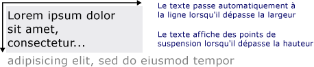

# Dessin du texte mis en formeDrawing Formatted Text
Cette rubrique fournit une vue d’ensemble des fonctionnalités de la <xref:System.Windows.Media.FormattedText> objet.This topic provides an overview of the features of the <xref:System.Windows.Media.FormattedText> object. Cet objet offre un contrôle de bas niveau pour le dessin de texte dans des applications [!INCLUDE[TLA#tla_winclient](../../../../includes/tlasharptla-winclient-md.md)].This object provides low-level control for drawing text in [!INCLUDE[TLA#tla_winclient](../../../../includes/tlasharptla-winclient-md.md)] applications.  
  
  
## Vue d’ensemble de la technologieTechnology Overview  
 Le <xref:System.Windows.Media.FormattedText> objet vous permet de dessiner du texte multiligne, dans lequel chaque caractère dans le texte peut être mis en forme individuellement.The <xref:System.Windows.Media.FormattedText> object allows you to draw multi-line text, in which each character in the text can be individually formatted. L’exemple suivant montre un texte auquel plusieurs formats sont appliqués.The following example shows text that has several formats applied to it.  
  
   
Texte affiché à l’aide de la méthode FormattedTextDisplayed text using FormattedText method  
  
> [!NOTE]
>  Pour les développeurs qui migrent depuis l’API [!INCLUDE[TLA#tla_win32](../../../../includes/tlasharptla-win32-md.md)], le tableau présenté dans la section [Migration depuis Win32](#win32_migration) répertorie les indicateurs DrawText de [!INCLUDE[TLA#tla_win32](../../../../includes/tlasharptla-win32-md.md)] et leur équivalent approximatif dans [!INCLUDE[TLA#tla_winclient](../../../../includes/tlasharptla-winclient-md.md)].For those developers migrating from the [!INCLUDE[TLA#tla_win32](../../../../includes/tlasharptla-win32-md.md)] API, the table in the [Win32 Migration](#win32_migration) section lists the [!INCLUDE[TLA#tla_win32](../../../../includes/tlasharptla-win32-md.md)] DrawText flags and the approximate equivalent in [!INCLUDE[TLA#tla_winclient](../../../../includes/tlasharptla-winclient-md.md)].  
  
### Raisons d’utiliser du texte mis en formeReasons for Using Formatted Text  
 [!INCLUDE[TLA2#tla_winclient](../../../../includes/tla2sharptla-winclient-md.md)] inclut plusieurs contrôles pour dessiner le texte à l’écran. includes multiple controls for drawing text to the screen. Chaque contrôle cible un scénario différent et dispose de sa propre liste de fonctionnalités et limitations.Each control is targeted to a different scenario and has its own list of features and limitations. En général, les <xref:System.Windows.Controls.TextBlock> élément doit être utilisé lors de la prise en charge limitée de texte est requis, par exemple, une brève phrase dans un [!INCLUDE[TLA#tla_ui](../../../../includes/tlasharptla-ui-md.md)].In general, the <xref:System.Windows.Controls.TextBlock> element should be used when limited text support is required, such as a brief sentence in a [!INCLUDE[TLA#tla_ui](../../../../includes/tlasharptla-ui-md.md)]. <xref:System.Windows.Controls.Label>peut être utilisé lors de la prise en charge de texte minimale est requise.<xref:System.Windows.Controls.Label> can be used when minimal text support is required. Pour plus d’informations, consultez [Documents dans WPF](../../../../docs/framework/wpf/advanced/documents-in-wpf.md).For more information, see [Documents in WPF](../../../../docs/framework/wpf/advanced/documents-in-wpf.md).  
  
 Le <xref:System.Windows.Media.FormattedText> objet fournit des fonctionnalités que la mise en forme de texte supérieur [!INCLUDE[TLA#tla_winclient](../../../../includes/tlasharptla-winclient-md.md)] contrôles de texte et peut être utile dans les cas où vous souhaitez utiliser le texte comme élément décoratif.The <xref:System.Windows.Media.FormattedText> object provides greater text formatting features than [!INCLUDE[TLA#tla_winclient](../../../../includes/tlasharptla-winclient-md.md)] text controls, and can be useful in cases where you want to use text as a decorative element. Pour plus d’informations, consultez la section suivante, [Conversion du texte mis en forme en géométrie](#converting_formatted_text).For more information, see the following section [Converting Formatted Text to a Geometry](#converting_formatted_text).  
  
 En outre, le <xref:System.Windows.Media.FormattedText> objet est utile pour créer orienté texte <xref:System.Windows.Media.DrawingVisual>-objets dérivés.In addition, the <xref:System.Windows.Media.FormattedText> object is useful for creating text-oriented <xref:System.Windows.Media.DrawingVisual>-derived objects. <xref:System.Windows.Media.DrawingVisual>est une classe de dessin légère qui permet de restituer des formes, des images ou texte.<xref:System.Windows.Media.DrawingVisual> is a lightweight drawing class that is used to render shapes, images, or text. Pour plus d’informations, consultez [Test de positionnement à l’aide de DrawingVisuals, exemple](http://go.microsoft.com/fwlink/?LinkID=159994).For more information, see [Hit Test Using DrawingVisuals Sample](http://go.microsoft.com/fwlink/?LinkID=159994).  
  
## Utilisation de l’objet FormattedTextUsing the FormattedText Object  
 Pour créer le texte mis en forme, appelez le <xref:System.Windows.Media.FormattedText.%23ctor%2A> constructeur pour créer un <xref:System.Windows.Media.FormattedText> objet.To create formatted text, call the <xref:System.Windows.Media.FormattedText.%23ctor%2A> constructor to create a <xref:System.Windows.Media.FormattedText> object. Une fois que vous avez créé la chaîne initiale de texte mis en forme, vous pouvez appliquer différents styles de mise en forme.Once you have created the initial formatted text string, you can apply a range of formatting styles.  
  
 Utilisez le <xref:System.Windows.Media.FormattedText.MaxTextWidth%2A> propriété pour limiter le texte à une largeur spécifique.Use the <xref:System.Windows.Media.FormattedText.MaxTextWidth%2A> property to constrain the text to a specific width. Le texte est alors automatiquement renvoyé à la ligne pour éviter de dépasser la largeur spécifiée.The text will automatically wrap to avoid exceeding the specified width. Utilisez le <xref:System.Windows.Media.FormattedText.MaxTextHeight%2A> propriété pour limiter le texte à une hauteur spécifique.Use the <xref:System.Windows.Media.FormattedText.MaxTextHeight%2A> property to constrain the text to a specific height. Le texte affiche des points de suspension (...) en lieu et place du texte qui dépasse la hauteur spécifiée.The text will display an ellipsis, "…" for the text that exceeds the specified height.  
  
   
Texte affiché présentant des retours à la ligne et des points de suspensionDisplayed text showing wordwrapping and ellipsis  
  
 Vous pouvez appliquer plusieurs styles de mise en forme à un ou plusieurs caractères.You can apply multiple formatting styles to one or more characters. Par exemple, vous pouvez appeler à la fois le <xref:System.Windows.Media.FormattedText.SetFontSize%2A> et <xref:System.Windows.Media.FormattedText.SetForegroundBrush%2A> méthodes pour modifier la mise en forme des cinq premiers caractères dans le texte.For example, you could call both the <xref:System.Windows.Media.FormattedText.SetFontSize%2A> and <xref:System.Windows.Media.FormattedText.SetForegroundBrush%2A> methods to change the formatting of the first five characters in the text.  
  
 L’exemple de code suivant crée un <xref:System.Windows.Media.FormattedText> de l’objet et applique ensuite plusieurs styles de mise en forme du texte.The following code example creates a <xref:System.Windows.Media.FormattedText> object and then applies several formatting styles to the text.  
  
 [!code-csharp[FormattedTextSnippets#FormattedTextSnippets1](../../../../samples/snippets/csharp/VS_Snippets_Wpf/FormattedTextSnippets/CSharp/Window1.xaml.cs#formattedtextsnippets1)]
 [!code-vb[FormattedTextSnippets#FormattedTextSnippets1](../../../../samples/snippets/visualbasic/VS_Snippets_Wpf/FormattedTextSnippets/visualbasic/window1.xaml.vb#formattedtextsnippets1)]  
  
### Unité de mesure de la taille de policeFont Size Unit of Measure  
 Comme avec d’autres objets de texte dans [!INCLUDE[TLA#tla_winclient](../../../../includes/tlasharptla-winclient-md.md)] applications, le <xref:System.Windows.Media.FormattedText> objet utilise des pixels indépendants du périphérique comme unité de mesure.As with other text objects in [!INCLUDE[TLA#tla_winclient](../../../../includes/tlasharptla-winclient-md.md)] applications, the <xref:System.Windows.Media.FormattedText> object uses device-independent pixels as the unit of measure. Toutefois, la plupart des applications [!INCLUDE[TLA#tla_win32](../../../../includes/tlasharptla-win32-md.md)] utilisent des points comme unité de mesure.However, most [!INCLUDE[TLA#tla_win32](../../../../includes/tlasharptla-win32-md.md)] applications use points as the unit of measure. Si vous souhaitez afficher le texte en unités de points dans les applications [!INCLUDE[TLA#tla_winclient](../../../../includes/tlasharptla-winclient-md.md)], vous devez convertir [!INCLUDE[TLA#tla_dipixel#plural](../../../../includes/tlasharptla-dipixelsharpplural-md.md)] en points.If you want to use display text in units of points in [!INCLUDE[TLA#tla_winclient](../../../../includes/tlasharptla-winclient-md.md)] applications, you need to convert [!INCLUDE[TLA#tla_dipixel#plural](../../../../includes/tlasharptla-dipixelsharpplural-md.md)] to points. L’exemple de code suivant montre comment effectuer cette conversion.The following code example shows how to perform this conversion.  
  
 [!code-csharp[FormattedTextSnippets#FormattedTextSnippets2](../../../../samples/snippets/csharp/VS_Snippets_Wpf/FormattedTextSnippets/CSharp/Window1.xaml.cs#formattedtextsnippets2)]
 [!code-vb[FormattedTextSnippets#FormattedTextSnippets2](../../../../samples/snippets/visualbasic/VS_Snippets_Wpf/FormattedTextSnippets/visualbasic/window1.xaml.vb#formattedtextsnippets2)]  
  
   
### Conversion du texte mis en forme en géométrieConverting Formatted Text to a Geometry  
 Vous pouvez convertir le texte mis en forme dans <xref:System.Windows.Media.Geometry> objets, ce qui vous permet de créer d’autres types de texte visuellement intéressant.You can convert formatted text into <xref:System.Windows.Media.Geometry> objects, allowing you to create other types of visually interesting text. Par exemple, vous pouvez créer un <xref:System.Windows.Media.Geometry> objet basé sur le contour d’une chaîne de texte.For example, you could create a <xref:System.Windows.Media.Geometry> object based on the outline of a text string.  
  
   
Contour du texte utilisant un pinceau de dégradé linéaireText outline using a linear gradient brush  
  
 Les exemples suivants illustrent plusieurs façons de créer des effets visuels intéressants en modifiant le trait, le remplissage et la surbrillance du texte converti.The following examples illustrate several ways of creating interesting visual effects by modifying the stroke, fill, and highlight of converted text.  
  
   
Exemple de définition du trait et du remplissage de différentes couleursExample of setting stroke and fill to different colors  
  
   
Exemple de pinceau image appliqué au traitExample of an image brush applied to the stroke  
  
   
Exemple de pinceau image appliqué au trait et surbrillanceExample of an image brush applied to the stroke and highlight  
  
 Lorsque le texte est converti en un <xref:System.Windows.Media.Geometry> de l’objet, il n’est plus une collection de caractères, vous ne pouvez pas modifier les caractères dans la chaîne de texte.When text is converted to a <xref:System.Windows.Media.Geometry> object, it is no longer a collection of characters—you cannot modify the characters in the text string. Vous pouvez néanmoins modifier l’apparence du texte converti en changeant ses propriétés de trait et de remplissage.However, you can affect the appearance of the converted text by modifying its stroke and fill properties. Le trait fait référence au contour du texte converti et le remplissage à la zone située à l’intérieur du contour du texte converti.The stroke refers to the outline of the converted text; the fill refers to the area inside the outline of the converted text. Pour plus d’informations, consultez [Créer du texte avec contour](../../../../docs/framework/wpf/advanced/how-to-create-outlined-text.md).For more information, see [Create Outlined Text](../../../../docs/framework/wpf/advanced/how-to-create-outlined-text.md).  
  
 Vous pouvez également convertir le texte mis en forme à un <xref:System.Windows.Media.PathGeometry> de l’objet et utiliser l’objet pour mettre en surbrillance le texte.You can also convert formatted text to a <xref:System.Windows.Media.PathGeometry> object, and use the object for highlighting the text. Par exemple, vous pouvez appliquer une animation à le <xref:System.Windows.Media.PathGeometry> afin qu’elle suive le plan du texte mis en forme de l’objet.For example, you could apply an animation to the <xref:System.Windows.Media.PathGeometry> object so that the animation follows the outline of the formatted text.  
  
 L’exemple suivant montre le texte mis en forme qui a été convertie en un <xref:System.Windows.Media.PathGeometry> objet.The following example shows formatted text that has been converted to a <xref:System.Windows.Media.PathGeometry> object. Une ellipse animée suit le tracé des traits du texte rendu.An animated ellipse follows the path of the strokes of the rendered text.  
  
   
Sphère suivant la géométrie de tracé du texteSphere following the path geometry of text  
  
 Pour plus d’informations, consultez [Guide pratique pour créer une animation PathGeometry pour du texte](http://msdn.microsoft.com/library/29f8051e-798a-463f-a926-a099a99e9c67).For more information, see [How to: Create a PathGeometry Animation for Text](http://msdn.microsoft.com/library/29f8051e-798a-463f-a926-a099a99e9c67).  
  
 Vous pouvez créer les autres utilisations intéressantes pour le texte mis en forme une fois qu’il a été converti en un <xref:System.Windows.Media.PathGeometry> objet.You can create other interesting uses for formatted text once it has been converted to a <xref:System.Windows.Media.PathGeometry> object. Par exemple, vous pouvez y insérer une vidéo.For example, you can clip video to display inside it.  
  
   
Vidéo s’affichant dans la géométrie de tracé du texteVideo displaying in the path geometry of text  
  
   
## Migration depuis Win32Win32 Migration  
 Les fonctionnalités de <xref:System.Windows.Media.FormattedText> pour dessiner le texte sont semblables aux fonctionnalités de la [!INCLUDE[TLA#tla_win32](../../../../includes/tlasharptla-win32-md.md)] fonction DrawText.The features of <xref:System.Windows.Media.FormattedText> for drawing text are similar to the features of the [!INCLUDE[TLA#tla_win32](../../../../includes/tlasharptla-win32-md.md)] DrawText function. Pour les développeurs qui migrent depuis l’API [!INCLUDE[TLA#tla_win32](../../../../includes/tlasharptla-win32-md.md)], le tableau suivant répertorie les indicateurs DrawText de [!INCLUDE[TLA#tla_win32](../../../../includes/tlasharptla-win32-md.md)] et leur équivalent approximatif dans [!INCLUDE[TLA#tla_winclient](../../../../includes/tlasharptla-winclient-md.md)].For those developers migrating from the [!INCLUDE[TLA#tla_win32](../../../../includes/tlasharptla-win32-md.md)] API, the following table lists the [!INCLUDE[TLA#tla_win32](../../../../includes/tlasharptla-win32-md.md)] DrawText flags and the approximate equivalent in [!INCLUDE[TLA#tla_winclient](../../../../includes/tlasharptla-winclient-md.md)].  
  
|Indicateur DrawTextDrawText flag|Équivalent WPFWPF equivalent|NotesNotes|  
|-------------------|--------------------|-----------|  
|DT_BOTTOMDT_BOTTOM|<xref:System.Windows.Media.FormattedText.Height%2A>|Utilisez le <xref:System.Windows.Media.FormattedText.Height%2A> pour calculer une propriété [!INCLUDE[TLA#tla_win32](../../../../includes/tlasharptla-win32-md.md)] DrawText 'y' position.Use the <xref:System.Windows.Media.FormattedText.Height%2A> property to compute an appropriate [!INCLUDE[TLA#tla_win32](../../../../includes/tlasharptla-win32-md.md)] DrawText 'y' position.|  
|DT_CALCRECTDT_CALCRECT|<xref:System.Windows.Media.FormattedText.Height%2A>, <xref:System.Windows.Media.FormattedText.Width%2A><xref:System.Windows.Media.FormattedText.Height%2A>, <xref:System.Windows.Media.FormattedText.Width%2A>|Utilisez le <xref:System.Windows.Media.FormattedText.Height%2A> et <xref:System.Windows.Media.FormattedText.Width%2A> propriétés pour calculer le rectangle de sortie.Use the <xref:System.Windows.Media.FormattedText.Height%2A> and <xref:System.Windows.Media.FormattedText.Width%2A> properties to calculate the output rectangle.|  
|DT_CENTERDT_CENTER|<xref:System.Windows.Media.FormattedText.TextAlignment%2A>|Utilisez le <xref:System.Windows.Media.FormattedText.TextAlignment%2A> propriété avec la valeur est définie sur <xref:System.Windows.TextAlignment.Center>.Use the <xref:System.Windows.Media.FormattedText.TextAlignment%2A> property with the value set to <xref:System.Windows.TextAlignment.Center>.|  
|DT_EDITCONTROLDT_EDITCONTROL|Aucun.None|Non requisNot required. La largeur de l’espace et le rendu de la dernière ligne sont les mêmes que dans le contrôle d’édition du framework.Space width and last line rendering are the same as in the framework edit control.|  
|DT_END_ELLIPSISDT_END_ELLIPSIS|<xref:System.Windows.Media.FormattedText.Trimming%2A>|Utilisez le <xref:System.Windows.Media.FormattedText.Trimming%2A> propriété avec la valeur <xref:System.Windows.TextTrimming.CharacterEllipsis>.Use the <xref:System.Windows.Media.FormattedText.Trimming%2A> property with the value <xref:System.Windows.TextTrimming.CharacterEllipsis>.   Utilisez <xref:System.Windows.TextTrimming.WordEllipsis> pour obtenir [!INCLUDE[TLA#tla_win32](../../../../includes/tlasharptla-win32-md.md)] DT_END_ELLIPSIS avec DT_WORD_ELIPSIS fin : dans ce cas, les points de suspension caractère se produit uniquement sur les mots qui ne tiennent pas sur une seule ligne.Use <xref:System.Windows.TextTrimming.WordEllipsis> to get [!INCLUDE[TLA#tla_win32](../../../../includes/tlasharptla-win32-md.md)] DT_END_ELLIPSIS with DT_WORD_ELIPSIS end ellipsis—in this case, character ellipsis only occurs on words that do not fit on a single line.|  
|DT_EXPAND_TABSDT_EXPAND_TABS|Aucun.None|Non requisNot required. Des tabulations sont créées automatiquement avec des taquets tous les 4 cadratins, ce qui correspond plus ou moins à la largeur de 8 caractères indépendants du langage.Tabs are automatically expanded to stops every 4 ems, which is approximately the width of 8 language-independent characters.|  
|DT_EXTERNALLEADINGDT_EXTERNALLEADING|Aucun.None|Non requisNot required. L’espacement externe est toujours inclus dans l’interligne.External leading is always included in line spacing. Utilisez le <xref:System.Windows.Media.FormattedText.LineHeight%2A> propriété à créer l’interligne défini par l’utilisateur.Use the <xref:System.Windows.Media.FormattedText.LineHeight%2A> property to create user-defined line spacing.|  
|DT_HIDEPREFIXDT_HIDEPREFIX|Aucun.None|Non pris en charge.Not supported. Supprimez le '&' à partir de la chaîne avant de construire le <xref:System.Windows.Media.FormattedText> objet.Remove the '&' from the string before constructing the <xref:System.Windows.Media.FormattedText> object.|  
|DT_LEFTDT_LEFT|<xref:System.Windows.Media.FormattedText.TextAlignment%2A>|Il s’agit de l’alignement de texte par défaut.This is the default text alignment. Utilisez le <xref:System.Windows.Media.FormattedText.TextAlignment%2A> propriété avec la valeur est définie sur <xref:System.Windows.TextAlignment.Left>.Use the <xref:System.Windows.Media.FormattedText.TextAlignment%2A> property with the value set to <xref:System.Windows.TextAlignment.Left>. (WPF uniquement)(WPF only)|  
|DT_MODIFYSTRINGDT_MODIFYSTRING|Aucun.None|Non pris en charge.Not supported.|  
|DT_NOCLIPDT_NOCLIP|<xref:System.Windows.Media.Visual.VisualClip%2A>|Le découpage n’est pas effectué automatiquement.Clipping does not happen automatically. Si vous souhaitez découper le texte, utilisez le <xref:System.Windows.Media.Visual.VisualClip%2A> propriété.If you want to clip text, use the <xref:System.Windows.Media.Visual.VisualClip%2A> property.|  
|DT_NOFULLWIDTHCHARBREAKDT_NOFULLWIDTHCHARBREAK|Aucun.None|Non pris en charge.Not supported.|  
|DT_NOPREFIXDT_NOPREFIX|Aucun.None|Non requisNot required. Le caractère '&' présent dans les chaînes est toujours traité comme un caractère normal.The '&' character in strings is always treated as a normal character.|  
|DT_PATHELLIPSISDT_PATHELLIPSIS|Aucun.None|Utilisez le <xref:System.Windows.Media.FormattedText.Trimming%2A> propriété avec la valeur <xref:System.Windows.TextTrimming.WordEllipsis>.Use the <xref:System.Windows.Media.FormattedText.Trimming%2A> property with the value <xref:System.Windows.TextTrimming.WordEllipsis>.|  
|DT_PREFIXDT_PREFIX|Aucun.None|Non pris en charge.Not supported. Si vous souhaitez utiliser des traits de soulignement pour le texte, tels qu’une touche d’accès ou un lien, utilisez la <xref:System.Windows.Media.FormattedText.SetTextDecorations%2A> (méthode).If you want to use underscores for text, such as an accelerator key or link, use the <xref:System.Windows.Media.FormattedText.SetTextDecorations%2A> method.|  
|DT_PREFIXONLYDT_PREFIXONLY|Aucun.None|Non pris en charge.Not supported.|  
|DT_RIGHTDT_RIGHT|<xref:System.Windows.Media.FormattedText.TextAlignment%2A>|Utilisez le <xref:System.Windows.Media.FormattedText.TextAlignment%2A> propriété avec la valeur est définie sur <xref:System.Windows.TextAlignment.Right>.Use the <xref:System.Windows.Media.FormattedText.TextAlignment%2A> property with the value set to <xref:System.Windows.TextAlignment.Right>. (WPF uniquement)(WPF only)|  
|DT_RTLREADINGDT_RTLREADING|<xref:System.Windows.Media.FormattedText.FlowDirection%2A>|Affectez à la propriété <xref:System.Windows.Media.FormattedText.FlowDirection%2A> la valeur <xref:System.Windows.FlowDirection.RightToLeft>.Set the <xref:System.Windows.Media.FormattedText.FlowDirection%2A> property to <xref:System.Windows.FlowDirection.RightToLeft>.|  
|DT_SINGLELINEDT_SINGLELINE|Aucun.None|Non requisNot required. <xref:System.Windows.Media.FormattedText>les objets se comportent comme un contrôle à ligne unique, à moins que soit le <xref:System.Windows.Media.FormattedText.MaxTextWidth%2A> propriété est définie ou le texte contient un chariot / saut de ligne (CR/LF).<xref:System.Windows.Media.FormattedText> objects behave as a single line control, unless either the <xref:System.Windows.Media.FormattedText.MaxTextWidth%2A> property is set or the text contains a carriage return/line feed (CR/LF).|  
|DT_TABSTOPDT_TABSTOP|Aucun.None|Les positions des taquets de tabulation définies par l’utilisateur ne sont pas prises en charge.No support for user-defined tab stop positions.|  
|DT_TOPDT_TOP|<xref:System.Windows.Media.FormattedText.Height%2A>|Non requisNot required. La justification en haut est la valeur par défaut.Top justification is the default. Autres valeurs de positionnement vertical peuvent être définies à l’aide de la <xref:System.Windows.Media.FormattedText.Height%2A> pour calculer une propriété [!INCLUDE[TLA#tla_win32](../../../../includes/tlasharptla-win32-md.md)] DrawText 'y' position.Other vertical positioning values can be defined by using the <xref:System.Windows.Media.FormattedText.Height%2A> property to compute an appropriate [!INCLUDE[TLA#tla_win32](../../../../includes/tlasharptla-win32-md.md)] DrawText 'y' position.|  
|DT_VCENTERDT_VCENTER|<xref:System.Windows.Media.FormattedText.Height%2A>|Utilisez le <xref:System.Windows.Media.FormattedText.Height%2A> pour calculer une propriété [!INCLUDE[TLA#tla_win32](../../../../includes/tlasharptla-win32-md.md)] DrawText 'y' position.Use the <xref:System.Windows.Media.FormattedText.Height%2A> property to compute an appropriate [!INCLUDE[TLA#tla_win32](../../../../includes/tlasharptla-win32-md.md)] DrawText 'y' position.|  
|DT_WORDBREAKDT_WORDBREAK|Aucun.None|Non requisNot required. Analyse lexicale s’effectue automatiquement avec <xref:System.Windows.Media.FormattedText> objets.Word breaking happens automatically with <xref:System.Windows.Media.FormattedText> objects. Vous ne pouvez pas la désactiver.You cannot disable it.|  
|DT_WORD_ELLIPSISDT_WORD_ELLIPSIS|<xref:System.Windows.Media.FormattedText.Trimming%2A>|Utilisez le <xref:System.Windows.Media.FormattedText.Trimming%2A> propriété avec la valeur <xref:System.Windows.TextTrimming.WordEllipsis>.Use the <xref:System.Windows.Media.FormattedText.Trimming%2A> property with the value <xref:System.Windows.TextTrimming.WordEllipsis>.|  
  
## Voir aussiSee Also  
 <xref:System.Windows.Media.FormattedText>  
 [Documents dans WPFDocuments in WPF](../../../../docs/framework/wpf/advanced/documents-in-wpf.md)  
 [Typographie dans WPFTypography in WPF](../../../../docs/framework/wpf/advanced/typography-in-wpf.md)  
 [Créer du texte avec contourCreate Outlined Text](../../../../docs/framework/wpf/advanced/how-to-create-outlined-text.md)  
 [Guide pratique pour créer une animation PathGeometry pour du texteHow to: Create a PathGeometry Animation for Text](http://msdn.microsoft.com/library/29f8051e-798a-463f-a926-a099a99e9c67)
