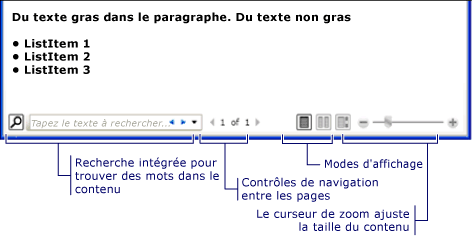
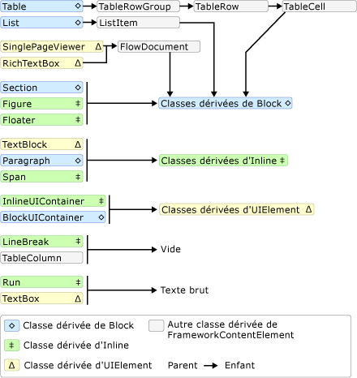
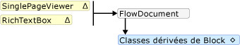
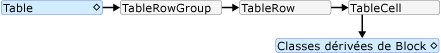
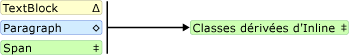
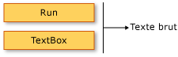

# Vue d'ensemble des documents dynamiquesFlow Document Overview
Les documents dynamiques sont conçus pour optimiser l’affichage et la lisibilité.Flow documents are designed to optimize viewing and readability. Au lieu d’avoir une disposition prédéfinie, ces documents dynamiques ajustent et refluent dynamiquement leur contenu en fonction des variables d’exécution telles que la taille de la fenêtre, la résolution de l’appareil et les préférences facultatives de l’utilisateur.Rather than being set to one predefined layout, flow documents dynamically adjust and reflow their content based on run-time variables such as window size, device resolution, and optional user preferences. En outre, les documents dynamiques offrent des fonctionnalités de document avancées, telles que la pagination et les colonnes.In addition, flow documents offer advanced document features, such as pagination and columns. Cette rubrique fournit une vue d’ensemble des documents dynamiques et explique comment les créer.This topic provides an overview of flow documents and how to create them.  
  

  
   
## Description d’un document dynamiqueWhat is a Flow Document  
 Un document dynamique est conçu pour « redisposer le contenu » en fonction de la taille de la fenêtre, de la résolution de l’appareil et d’autres variables d’environnement.A flow document is designed to "reflow content" depending on window size, device resolution, and other environment variables. En outre, les documents dynamiques possèdent plusieurs fonctionnalités intégrées, notamment la recherche, les modes d’affichage qui optimisent la lisibilité et la possibilité de changer la taille et l’apparence des polices.In addition, flow documents have a number of built in features including search, viewing modes that optimize readability, and the ability to change the size and appearance of fonts. Les documents dynamiques sont utilisés surtout quand la facilité de lecture est le scénario principal de consommation des documents.Flow Documents are best utilized when ease of reading is the primary document consumption scenario. À l’inverse, les documents fixes sont conçus pour avoir une présentation statique.In contrast, Fixed Documents are designed to have a static presentation. Ces documents sont utiles quand le contenu source doit être fidèlement respecté.Fixed Documents are useful when fidelity of the source content is essential. Consultez [Documents dans WPF](../../../../docs/framework/wpf/advanced/documents-in-wpf.md) pour plus d’informations sur les différents types de documents.See [Documents in WPF](../../../../docs/framework/wpf/advanced/documents-in-wpf.md) for more information on different types of documents.  
  
 L’illustration suivante montre un exemple de document dynamique affiché dans des fenêtres de différentes tailles.The following illustration shows a sample flow document viewed in several windows of different sizes. Chaque fois que la zone d’affichage change, le contenu est redisposé pour utiliser de façon optimale l’espace disponible.As the display area changes, the content reflows to make the best use of the available space.  
  
   
  
 Comme illustré dans l’image ci-dessus, le contenu dynamique peut comprendre plusieurs composants, notamment des paragraphes, des listes, des images et bien plus encore.As seen in the image above, flow content can include many components including paragraphs, lists, images, and more. Ces composants correspondent à des éléments dans le balisage et à des objets dans le code procédural.These components correspond to elements in markup and objects in procedural code. Nous allons ces classes en détail ultérieurement dans le [flux des Classes connexes](#flow_related_classes) section de cette vue d’ensemble.We will go over these classes in detail later in the [Flow Related Classes](#flow_related_classes) section of this overview. Pour l’instant, Voici un exemple de code simple qui crée un document de flux composé d’un paragraphe avec du texte en gras et une liste.For now, here is a simple code example that creates a flow document consisting of a paragraph with some bold text and a list.
  
 [!code-xaml[FlowOvwSnippets_snip#SimpleFlowExampleWholePage](../../../../samples/snippets/csharp/VS_Snippets_Wpf/FlowOvwSnippets_snip/CS/SimpleFlowExample.xaml#simpleflowexamplewholepage)]  
  
 [!code-csharp[FlowOvwSnippets_procedural_snip#SimpleFlowCodeOnlyExampleWholePage](../../../../samples/snippets/csharp/VS_Snippets_Wpf/FlowOvwSnippets_procedural_snip/CSharp/SimpleFlowExample.cs#simpleflowcodeonlyexamplewholepage)]
 [!code-vb[FlowOvwSnippets_procedural_snip#SimpleFlowCodeOnlyExampleWholePage](../../../../samples/snippets/visualbasic/VS_Snippets_Wpf/FlowOvwSnippets_procedural_snip/VisualBasic/SimpleFlowExample.vb#simpleflowcodeonlyexamplewholepage)]  
  
 Cet extrait de code est illustré ci-dessous.The illustration below shows what this code snippet looks like.  
  
   
  
 Dans cet exemple, le <xref:System.Windows.Controls.FlowDocumentReader> contrôle est utilisé pour héberger le contenu de flux.In this example, the <xref:System.Windows.Controls.FlowDocumentReader> control is used to host the flow content. Consultez [les Types de Document de flux](#flow_document_types) pour plus d’informations sur l’hébergement de contrôles de contenu de flux.See [Flow Document Types](#flow_document_types) for more information on flow content hosting controls. <xref:System.Windows.Documents.Paragraph>, <xref:System.Windows.Documents.List>, <xref:System.Windows.Documents.ListItem>, et <xref:System.Windows.Documents.Bold> éléments sont utilisés pour contrôler la mise en forme du contenu, selon leur ordre dans le balisage.<xref:System.Windows.Documents.Paragraph>, <xref:System.Windows.Documents.List>, <xref:System.Windows.Documents.ListItem>, and <xref:System.Windows.Documents.Bold> elements are used to control content formatting, based on their order in markup. Par exemple, le <xref:System.Windows.Documents.Bold> élément s’étend uniquement sur une partie du texte dans le paragraphe ; par conséquent, seule la partie du texte en gras.For example, the <xref:System.Windows.Documents.Bold> element spans across only part of the text in the paragraph; as a result, only that part of the text is bold. Si vous avez déjà utilisé le langage HTML, cela doit vous sembler familier.If you have used HTML, this will be familiar to you.  
  
 Mise en évidence dans l’illustration ci-dessus, il existe plusieurs fonctionnalités intégrées dans les Documents de flux :As highlighted in the illustration above, there are several features built into Flow Documents:
  
-   Recherche : permet à l’utilisateur d’effectuer une recherche en texte intégral sur l’ensemble d’un document.Search: Allows the user to perform a full text search of an entire document.  
  
-   Mode d’affichage : l’utilisateur peut sélectionner son mode d’affichage préféré parmi le mode d’affichage page unique (page par page), deux pages à la fois (format livre ouvert) ou défilement continu (sans marge inférieure).Viewing Mode: The user can select their preferred viewing mode including a single-page (page-at-a-time) viewing mode, a two-page-at-a-time (book reading format) viewing mode, and a continuous scrolling (bottomless) viewing mode.  Pour plus d’informations sur les modes d’affichage, consultez <xref:System.Windows.Controls.FlowDocumentReaderViewingMode>.For more information about these viewing modes, see <xref:System.Windows.Controls.FlowDocumentReaderViewingMode>.  
  
-   Contrôles de navigation des pages : si le mode d’affichage du document utilise des pages, les contrôles de navigation des pages incluent un bouton pour accéder à la page suivante (flèche Bas) ou à la page précédente (flèche Haut), ainsi qu’une indication du numéro de la page active et du nombre total de pages.Page Navigation Controls: If the viewing mode of the document uses pages, the page navigation controls include a button to jump to the next page (the down arrow) or previous page (the up arrow), as well as indicators for the current page number and total number of pages. Vous pouvez aussi faire défiler les pages à l’aide des touches de direction du clavier.Flipping through pages can also be accomplished using the keyboard arrow keys.  
  
-   Zoom : les contrôles de zoom permettent à l’utilisateur d’augmenter ou de diminuer le niveau de zoom en cliquant sur les boutons plus ou moins, respectivement.Zoom: The zoom controls enable the user to increase or decrease the zoom level by clicking the plus or minus buttons, respectively. Les contrôles de zoom incluent également un curseur pour ajuster le niveau de zoom.The zoom controls also include a slider for adjusting the zoom level. Pour plus d'informations, consultez <xref:System.Windows.Controls.FlowDocumentReader.Zoom%2A>.For more information, see <xref:System.Windows.Controls.FlowDocumentReader.Zoom%2A>.  
  
 Ces fonctionnalités peuvent être modifiées selon le contrôle utilisé pour héberger le contenu dynamique.These features can be modified based upon the control used to host the flow content. La section suivante décrit les différents contrôles.The next section describes the different controls.  
  
   
## Types de documents dynamiquesFlow Document Types  
 L’affichage et l’apparence du contenu des documents dynamiques dépendent de l’objet utilisé pour héberger le contenu dynamique.Display of flow document content and how it appears is dependent upon what object is used to host the flow content. Il existe quatre contrôles qui prennent en charge l’affichage de contenu de flux : <xref:System.Windows.Controls.FlowDocumentReader>, <xref:System.Windows.Controls.FlowDocumentPageViewer>, <xref:System.Windows.Controls.RichTextBox>, et <xref:System.Windows.Controls.FlowDocumentScrollViewer>.There are four controls that support viewing of flow content: <xref:System.Windows.Controls.FlowDocumentReader>, <xref:System.Windows.Controls.FlowDocumentPageViewer>, <xref:System.Windows.Controls.RichTextBox>, and <xref:System.Windows.Controls.FlowDocumentScrollViewer>. Ces contrôles sont brièvement décrits ci-dessous.These controls are briefly described below.  
  
 **Remarque :** <xref:System.Windows.Documents.FlowDocument> est nécessaire pour directement le contenu de flux hôte, par conséquent, tous ces contrôles d’affichage consomment un <xref:System.Windows.Documents.FlowDocument> pour activer l’hébergement du contenu dynamique.**Note:**  <xref:System.Windows.Documents.FlowDocument> is required to directly host flow content, so all of these viewing controls consume a <xref:System.Windows.Documents.FlowDocument> to enable flow content hosting.
  
### FlowDocumentReaderFlowDocumentReader  
 <xref:System.Windows.Controls.FlowDocumentReader>inclut des fonctionnalités qui permettent aux utilisateurs de choisir dynamiquement entre plusieurs modes d’affichage, y compris un mode d’affichage de page unique (page-à-un-time), deux page-à-un à la fois (format livre) un mode de défilement continu (sans marge inférieure) et du mode d’affichage.<xref:System.Windows.Controls.FlowDocumentReader> includes features that enable the user to dynamically choose between various viewing modes, including a single-page (page-at-a-time) viewing mode, a two-page-at-a-time (book reading format) viewing mode, and a continuous scrolling (bottomless) viewing mode. Pour plus d’informations sur les modes d’affichage, consultez <xref:System.Windows.Controls.FlowDocumentReaderViewingMode>.For more information about these viewing modes, see <xref:System.Windows.Controls.FlowDocumentReaderViewingMode>. Si vous n’avez pas besoin de la possibilité de basculer dynamiquement entre les différents modes d’affichage, <xref:System.Windows.Controls.FlowDocumentPageViewer> et <xref:System.Windows.Controls.FlowDocumentScrollViewer> fournissent les flux légère afficheurs de contenu qui sont résolus dans un mode d’affichage particulier.If you do not need the ability to dynamically switch between different viewing modes, <xref:System.Windows.Controls.FlowDocumentPageViewer> and <xref:System.Windows.Controls.FlowDocumentScrollViewer> provide lighter-weight flow content viewers that are fixed in a particular viewing mode.  
  
### FlowDocumentPageViewer et FlowDocumentScrollViewerFlowDocumentPageViewer and FlowDocumentScrollViewer  
 <xref:System.Windows.Controls.FlowDocumentPageViewer>Affiche le contenu dans la page au moment mode d’affichage, tandis que <xref:System.Windows.Controls.FlowDocumentScrollViewer> affiche le contenu en mode de défilement continu.<xref:System.Windows.Controls.FlowDocumentPageViewer> shows content in page-at-a-time viewing mode, while <xref:System.Windows.Controls.FlowDocumentScrollViewer> shows content in continuous scrolling mode. Les deux <xref:System.Windows.Controls.FlowDocumentPageViewer> et <xref:System.Windows.Controls.FlowDocumentScrollViewer> sont fixés pour un mode d’affichage particulier.Both <xref:System.Windows.Controls.FlowDocumentPageViewer> and <xref:System.Windows.Controls.FlowDocumentScrollViewer> are fixed to a particular viewing mode. Comparer à <xref:System.Windows.Controls.FlowDocumentReader>, qui inclut des fonctionnalités qui permettent aux utilisateurs de choisir dynamiquement entre plusieurs modes d’affichage (tel que fourni par le <xref:System.Windows.Controls.FlowDocumentReaderViewingMode> énumération), au détriment de la plus performante que celle de ressources <xref:System.Windows.Controls.FlowDocumentPageViewer> ou <xref:System.Windows.Controls.FlowDocumentScrollViewer>.Compare to <xref:System.Windows.Controls.FlowDocumentReader>, which includes features that enable the user to dynamically choose between various viewing modes (as provided by the <xref:System.Windows.Controls.FlowDocumentReaderViewingMode> enumeration), at the cost of being more resource intensive than <xref:System.Windows.Controls.FlowDocumentPageViewer> or <xref:System.Windows.Controls.FlowDocumentScrollViewer>.  
  
 Par défaut, une barre de défilement verticale est toujours affichée et une barre de défilement horizontale apparaît si nécessaire.By default, a vertical scrollbar is always shown, and a horizontal scrollbar becomes visible if needed. La valeur par défaut l’interface utilisateur pour <xref:System.Windows.Controls.FlowDocumentScrollViewer> n’inclut pas d’une barre d’outils ; Toutefois, le <xref:System.Windows.Controls.FlowDocumentScrollViewer.IsToolBarVisible%2A> propriété peut être utilisée pour activer une barre d’outils.The default UI for <xref:System.Windows.Controls.FlowDocumentScrollViewer> does not include a toolbar; however, the <xref:System.Windows.Controls.FlowDocumentScrollViewer.IsToolBarVisible%2A> property can be used to enable a built-in toolbar.  
  
### RichTextBoxRichTextBox  
 Vous utilisez un <xref:System.Windows.Controls.RichTextBox> lorsque vous souhaitez autoriser l’utilisateur à modifier le contenu de flux.You use a <xref:System.Windows.Controls.RichTextBox> when you want to allow the user to edit flow content. Par exemple, si vous souhaitez créer un éditeur qui autorise l’utilisateur à manipuler des choses comme les tables, italique et en gras de la mise en forme, etc., vous devez utiliser un <xref:System.Windows.Controls.RichTextBox>.For example, if you wanted to create an editor that allowed a user to manipulate things like tables, italic and bold formatting, etc, you would use a <xref:System.Windows.Controls.RichTextBox>. Consultez [vue d’ensemble de RichTextBox](../../../../docs/framework/wpf/controls/richtextbox-overview.md) pour plus d’informations.See [RichTextBox Overview](../../../../docs/framework/wpf/controls/richtextbox-overview.md) for more information.  
  
 **Remarque :** du contenu à l’intérieur d’un <xref:System.Windows.Controls.RichTextBox> ne se comporte pas exactement comme le contenu de flux contenu dans d’autres contrôles.**Note:** Flow content inside a <xref:System.Windows.Controls.RichTextBox> does not behave exactly like flow content contained in other controls. Par exemple, il n’existe aucune colonne dans un <xref:System.Windows.Controls.RichTextBox> et donc pas de redimensionnement automatique.For example, there are no columns in a <xref:System.Windows.Controls.RichTextBox> and hence no automatic resizing behavior. En outre, les fonctionnalités généralement intégrées de contenu de flux comme la recherche, affichage du mode de navigation entre les pages et zoom ne sont pas disponibles dans un <xref:System.Windows.Controls.RichTextBox>.Also, the typically built in features of flow content like search, viewing mode, page navigation, and zoom are not available within a <xref:System.Windows.Controls.RichTextBox>.  
  
   
## Création de contenu dynamiqueCreating Flow Content  
 Le contenu de flux peut être complexe, consistant de différents éléments, y compris le texte, des images, des tables et même <xref:System.Windows.UIElement> dérivées des classes telles que des contrôles.Flow content can be complex, consisting of various elements including text, images, tables, and even <xref:System.Windows.UIElement> derived classes like controls. Pour comprendre comment créer du contenu dynamique complexe, les points suivants sont essentiels :To understand how to create complex flow content, the following points are critical:  
  
-   **Classes liées au contenu dynamique** : chaque classe utilisée dans le contenu dynamique a un rôle spécifique.**Flow-related Classes**: Each class used in flow content has a specific purpose. En outre, la relation hiérarchique entre les classes vous permet de comprendre comment elles sont utilisées.In addition, the hierarchical relation between flow classes helps you understand how they are used. Par exemple, les classes dérivées de la <xref:System.Windows.Documents.Block> classe sont utilisés pour contenir d’autres objets alors que les classes dérivées de <xref:System.Windows.Documents.Inline> contiennent les objets sont affichés.For example, classes derived from the <xref:System.Windows.Documents.Block> class are used to contain other objects while classes derived from <xref:System.Windows.Documents.Inline> contain objects that are displayed.  
  
-   **Schéma du contenu** : un document dynamique peut nécessiter un nombre important d’éléments imbriqués.**Content Schema**: A flow document can require a substantial number of nested elements. Le schéma du contenu indique les relations parent/enfant possibles entre les éléments.The content schema specifies possible parent/child relationships between elements.  
  
 Les sections suivantes décrivent en détail chacun des points ci-dessus.The following sections will go over each of these areas in more detail.  
  
   
## Classes liées au contenu dynamiqueFlow Related Classes  
 Le diagramme ci-dessous contient les objets les plus souvent utilisés avec du contenu dynamique :The diagram below shows the objects most typically used with flow content:  
  
   
  
 Pour faciliter la gestion du contenu dynamique, il existe deux catégories principales :For the purposes of flow content, there are two important categories:  
  
1.  **Classes dérivées de Block** : elles sont également appelées « éléments de contenu Block » ou simplement « éléments Block ».**Block-derived classes**: Also called "Block content elements" or just "Block Elements". Les éléments qui héritent de <xref:System.Windows.Documents.Block> peut être utilisé pour grouper des éléments sous un parent commun ou appliquer des attributs communs à un groupe.Elements that inherit from <xref:System.Windows.Documents.Block> can be used to group elements under a common parent or to apply common attributes to a group.  
  
2.  **Classes dérivées d’Inline** : elles sont également appelées « éléments de contenu Inline » ou simplement « éléments Inline ».**Inline-derived classes**: Also called "Inline content elements" or just "Inline Elements". Les éléments qui héritent de <xref:System.Windows.Documents.Inline> soit contenus dans un élément de bloc ou d’un autre Inline élément.Elements that inherit from <xref:System.Windows.Documents.Inline> are either contained within a Block Element or another Inline Element. Les éléments Inline sont souvent utilisés comme conteneur direct du contenu restitué à l’écran.Inline Elements are often used as the direct container of content that is rendered to the screen. Par exemple, un <xref:System.Windows.Documents.Paragraph> (élément Block) peut contenir un <xref:System.Windows.Documents.Run> (Inline élément), mais le <xref:System.Windows.Documents.Run> réellement contient le texte est restitué à l’écran.For example, a <xref:System.Windows.Documents.Paragraph> (Block Element) can contain a <xref:System.Windows.Documents.Run> (Inline Element) but the <xref:System.Windows.Documents.Run> actually contains the text that is rendered on the screen.  
  
 Chaque classe de ces deux catégories est brièvement décrite ci-dessous.Each class in these two categories is briefly described below.  
  
### Classes dérivées de BlockBlock-derived Classes  
 **Paragraph****Paragraph**  
  
 <xref:System.Windows.Documents.Paragraph>est généralement utilisé pour grouper le contenu dans un paragraphe.<xref:System.Windows.Documents.Paragraph> is typically used to group content into a paragraph. L’utilisation la plus courante et la plus simple de Paragraph consiste à créer un paragraphe de texte.The simplest and most common use of Paragraph is to create a paragraph of text.  
  
 [!code-xaml[FlowOvwSnippets_snip#ParagraphExampleWholePage](../../../../samples/snippets/csharp/VS_Snippets_Wpf/FlowOvwSnippets_snip/CS/ParagraphExample.xaml#paragraphexamplewholepage)]  
  
 [!code-csharp[FlowOvwSnippets_procedural_snip#ParagraphCodeOnlyExampleWholePage](../../../../samples/snippets/csharp/VS_Snippets_Wpf/FlowOvwSnippets_procedural_snip/CSharp/ParagraphExample.cs#paragraphcodeonlyexamplewholepage)]
 [!code-vb[FlowOvwSnippets_procedural_snip#ParagraphCodeOnlyExampleWholePage](../../../../samples/snippets/visualbasic/VS_Snippets_Wpf/FlowOvwSnippets_procedural_snip/VisualBasic/ParagraphExample.vb#paragraphcodeonlyexamplewholepage)]  
  
 Toutefois, vous pouvez également inclure des autres éléments dérivés d’inline comme vous le verrez ci-dessous.However, you can also contain other inline-derived elements as you will see below. 
  
 **Section****Section**  
  
 <xref:System.Windows.Documents.Section>est utilisé uniquement pour contenir d’autres <xref:System.Windows.Documents.Block>-éléments dérivés.<xref:System.Windows.Documents.Section> is used only to contain other <xref:System.Windows.Documents.Block>-derived elements. Il n’applique aucune mise en forme par défaut aux éléments qu’il contient.It does not apply any default formatting to the elements it contains. Toutefois, les valeurs de propriété set sur un <xref:System.Windows.Documents.Section> s’applique à ses éléments enfants.However, any property values set on a <xref:System.Windows.Documents.Section> applies to its child elements. Une section vous permet également d’itérer par programmation dans sa collection enfant.A section also enables you to programmatically iterate through its child collection. <xref:System.Windows.Documents.Section>est utilisé d’une manière similaire à la \
 balise HTML.<xref:System.Windows.Documents.Section> is used in a similar manner to the \
 tag in HTML.  
  
 Dans l’exemple ci-dessous, trois paragraphes sont définis sous un <xref:System.Windows.Documents.Section>.In the example below, three paragraphs are defined under one <xref:System.Windows.Documents.Section>. La section comporte un <xref:System.Windows.Documents.TextElement.Background%2A> valeur de propriété de rouge, par conséquent, la couleur d’arrière-plan des paragraphes est également rouge.The section has a <xref:System.Windows.Documents.TextElement.Background%2A> property value of Red, therefore the background color of the paragraphs is also red.  
  
 [!code-xaml[FlowOvwSnippets_snip#SectionExampleWholePage](../../../../samples/snippets/csharp/VS_Snippets_Wpf/FlowOvwSnippets_snip/CS/SectionExample.xaml#sectionexamplewholepage)]  
  
 [!code-csharp[FlowOvwSnippets_procedural_snip#SectionCodeOnlyExampleWholePage](../../../../samples/snippets/csharp/VS_Snippets_Wpf/FlowOvwSnippets_procedural_snip/CSharp/SectionExample.cs#sectioncodeonlyexamplewholepage)]
 [!code-vb[FlowOvwSnippets_procedural_snip#SectionCodeOnlyExampleWholePage](../../../../samples/snippets/visualbasic/VS_Snippets_Wpf/FlowOvwSnippets_procedural_snip/VisualBasic/SectionExample.vb#sectioncodeonlyexamplewholepage)]  
  
 **BlockUIContainer****BlockUIContainer**  
  
 <xref:System.Windows.Documents.BlockUIContainer>permet de <xref:System.Windows.UIElement> éléments (c'est-à-dire un <xref:System.Windows.Controls.Button>) à incorporer dans le contenu de flux dérivé d’un bloc.<xref:System.Windows.Documents.BlockUIContainer> enables <xref:System.Windows.UIElement> elements (i.e. a <xref:System.Windows.Controls.Button>) to be embedded  in block-derived flow content. <xref:System.Windows.Documents.InlineUIContainer>(voir ci-dessous) est utilisé pour incorporer <xref:System.Windows.UIElement> éléments de contenu de flux inline.<xref:System.Windows.Documents.InlineUIContainer> (see below) is used to embed <xref:System.Windows.UIElement> elements in inline-derived flow content. <xref:System.Windows.Documents.BlockUIContainer>et <xref:System.Windows.Documents.InlineUIContainer> sont importantes, car il est impossible d’utiliser un <xref:System.Windows.UIElement> dans le flux de contenu, sauf si elle est contenue dans une de ces deux éléments.<xref:System.Windows.Documents.BlockUIContainer> and <xref:System.Windows.Documents.InlineUIContainer> are important because there is no other way to use a <xref:System.Windows.UIElement> in flow content unless it is contained within one of these two elements.  
  
 L’exemple suivant montre comment utiliser le <xref:System.Windows.Documents.BlockUIContainer> élément hôte <xref:System.Windows.UIElement> objets dans le contenu de flux.The following example shows how to use the <xref:System.Windows.Documents.BlockUIContainer> element to host <xref:System.Windows.UIElement> objects within flow content.  
  
 [!code-xaml[SpanSnippets#_BlockUIXAML](../../../../samples/snippets/csharp/VS_Snippets_Wpf/SpanSnippets/CSharp/Window1.xaml#_blockuixaml)]  
  
 La figure suivante montre le rendu de cet exemple.The following figure shows how this example renders.  
  
   
  
 **List****List**  
  
 <xref:System.Windows.Documents.List>est utilisé pour créer une liste à puces ou numérique.<xref:System.Windows.Documents.List> is used to create a bulleted or numeric list. Définir le <xref:System.Windows.Documents.List.MarkerStyle%2A> propriété un <xref:System.Windows.TextMarkerStyle> valeur d’énumération pour déterminer le style de la liste.Set the <xref:System.Windows.Documents.List.MarkerStyle%2A> property to a <xref:System.Windows.TextMarkerStyle> enumeration value to determine the style of the list. L’exemple ci-dessous montre comment créer une liste simple.The example below shows how to create a simple list.  
  
 [!code-xaml[FlowOvwSnippets_snip#ListExampleWholePage](../../../../samples/snippets/csharp/VS_Snippets_Wpf/FlowOvwSnippets_snip/CS/ListExample.xaml#listexamplewholepage)]  
  
 [!code-csharp[FlowOvwSnippets_procedural_snip#ListCodeOnlyExampleWholePage](../../../../samples/snippets/csharp/VS_Snippets_Wpf/FlowOvwSnippets_procedural_snip/CSharp/ListExample.cs#listcodeonlyexamplewholepage)]
 [!code-vb[FlowOvwSnippets_procedural_snip#ListCodeOnlyExampleWholePage](../../../../samples/snippets/visualbasic/VS_Snippets_Wpf/FlowOvwSnippets_procedural_snip/VisualBasic/ListExample.vb#listcodeonlyexamplewholepage)]  
  
 **Remarque :** <xref:System.Windows.Documents.List> est le seul élément de flux qui utilise le <xref:System.Windows.Documents.ListItemCollection> pour gérer les éléments enfants.**Note:** <xref:System.Windows.Documents.List> is the only flow element that uses the <xref:System.Windows.Documents.ListItemCollection> to manage child elements.  
  
 **Table****Table**  
  
 <xref:System.Windows.Documents.Table>est utilisé pour créer une table.<xref:System.Windows.Documents.Table> is used to create a table. <xref:System.Windows.Documents.Table>est similaire à la <xref:System.Windows.Controls.Grid> élément mais il présente davantage de fonctions et, par conséquent, requiert une charge importante de ressources.<xref:System.Windows.Documents.Table> is similar to the <xref:System.Windows.Controls.Grid> element but it has more capabilities and, therefore, requires greater resource overhead. Étant donné que <xref:System.Windows.Controls.Grid> est un <xref:System.Windows.UIElement>, il ne peut pas être utilisé dans le contenu de flux, sauf si elle est contenue dans un <xref:System.Windows.Documents.BlockUIContainer> ou <xref:System.Windows.Documents.InlineUIContainer>.Because <xref:System.Windows.Controls.Grid> is a <xref:System.Windows.UIElement>, it cannot be used in flow content unless it is contained in a <xref:System.Windows.Documents.BlockUIContainer> or <xref:System.Windows.Documents.InlineUIContainer>. Pour plus d’informations sur <xref:System.Windows.Documents.Table>, consultez [vue d’ensemble de la Table](../../../../docs/framework/wpf/advanced/table-overview.md).For more information on <xref:System.Windows.Documents.Table>, see [Table Overview](../../../../docs/framework/wpf/advanced/table-overview.md).  
  
### Classes dérivées d’InlineInline-derived Classes  
 **Exécuter****Run**  
  
 <xref:System.Windows.Documents.Run>est utilisé pour contenir du texte sans mise en forme.<xref:System.Windows.Documents.Run> is used to contain unformatted text. Vous pouvez vous attendre <xref:System.Windows.Documents.Run> objets à être largement utilisé dans le contenu de flux.You might expect <xref:System.Windows.Documents.Run> objects to be used extensively in flow content. Toutefois, dans le balisage, <xref:System.Windows.Documents.Run> éléments ne doivent pas être utilisés de manière explicite.However, in markup, <xref:System.Windows.Documents.Run> elements are not required to be used explicitly. <xref:System.Windows.Documents.Run>est requis pour être utilisé lorsque vous créez ou manipulez des documents dynamiques à l’aide de code.<xref:System.Windows.Documents.Run> is required to be used when creating or manipulating flow documents by using code. Par exemple, dans le balisage ci-dessous, le premier <xref:System.Windows.Documents.Paragraph> Spécifie le <xref:System.Windows.Documents.Run> n’est pas le cas de l’élément explicitement lors de la seconde.For example, in the markup below, the first <xref:System.Windows.Documents.Paragraph> specifies the <xref:System.Windows.Documents.Run> element explicitly while the second does not. Les deux paragraphes génèrent le même résultat.Both paragraphs generate identical output.  
  
 [!code-xaml[FlowOvwSnippets_snip#RunExample1](../../../../samples/snippets/csharp/VS_Snippets_Wpf/FlowOvwSnippets_snip/CS/RunSnippetsExample.xaml#runexample1)]  
  
 **Remarque :** à partir de la [!INCLUDE[net_v40_short](../../../../includes/net-v40-short-md.md)], le <xref:System.Windows.Documents.Run.Text%2A> propriété de la <xref:System.Windows.Documents.Run> objet est une propriété de dépendance.**Note:**  Starting in the [!INCLUDE[net_v40_short](../../../../includes/net-v40-short-md.md)], the <xref:System.Windows.Documents.Run.Text%2A> property of the <xref:System.Windows.Documents.Run> object is a dependency property. Vous pouvez lier le <xref:System.Windows.Documents.Run.Text%2A> source de propriété à des données, par exemple un <xref:System.Windows.Controls.TextBlock>.You can bind the <xref:System.Windows.Documents.Run.Text%2A> property to a data source, such as a <xref:System.Windows.Controls.TextBlock>. Le <xref:System.Windows.Documents.Run.Text%2A> propriété prend entièrement en charge la liaison unidirectionnelle.The <xref:System.Windows.Documents.Run.Text%2A> property fully supports one-way binding. Le <xref:System.Windows.Documents.Run.Text%2A> propriété prend également en charge la liaison bidirectionnelle, à l’exception de <xref:System.Windows.Controls.RichTextBox>.The <xref:System.Windows.Documents.Run.Text%2A> property also supports two-way binding, except for <xref:System.Windows.Controls.RichTextBox>. Pour obtenir un exemple, consultez <xref:System.Windows.Documents.Run.Text%2A?displayProperty=nameWithType>.For an example, see <xref:System.Windows.Documents.Run.Text%2A?displayProperty=nameWithType>.  
  
 **Span****Span**  
  
 <xref:System.Windows.Documents.Span>regroupe les autres éléments de contenu inline.<xref:System.Windows.Documents.Span> groups other inline content elements together. Aucun rendu inhérent n’est appliqué au contenu dans un <xref:System.Windows.Documents.Span> élément.No inherent rendering is applied to content within a <xref:System.Windows.Documents.Span> element. Toutefois, les éléments hérités de <xref:System.Windows.Documents.Span> notamment <xref:System.Windows.Documents.Hyperlink>, <xref:System.Windows.Documents.Bold>, <xref:System.Windows.Documents.Italic> et <xref:System.Windows.Documents.Underline> s’appliquent à la mise en forme de texte.However, elements that inherit from <xref:System.Windows.Documents.Span> including <xref:System.Windows.Documents.Hyperlink>, <xref:System.Windows.Documents.Bold>, <xref:System.Windows.Documents.Italic> and <xref:System.Windows.Documents.Underline> do apply formatting to text.  
  
 Voici un exemple d’un <xref:System.Windows.Documents.Span> est utilisé pour contenir du contenu inline comprenant du texte, un <xref:System.Windows.Documents.Bold> élément et un <xref:System.Windows.Controls.Button>.Below is an example of a <xref:System.Windows.Documents.Span> being used to contain inline content including text, a <xref:System.Windows.Documents.Bold> element, and a <xref:System.Windows.Controls.Button>.  
  
 [!code-xaml[FlowOvwSnippets_snip#SpanExampleWholePage](../../../../samples/snippets/csharp/VS_Snippets_Wpf/FlowOvwSnippets_snip/CS/SpanExample.xaml#spanexamplewholepage)]  
  
 La capture d’écran suivante montre le rendu de cet exemple.The following screenshot shows how this example renders.  
  
   
  
 **InlineUIContainer****InlineUIContainer**  
  
 <xref:System.Windows.Documents.InlineUIContainer>permet de <xref:System.Windows.UIElement> éléments (par exemple, un contrôle tel que <xref:System.Windows.Controls.Button>) à incorporer dans un <xref:System.Windows.Documents.Inline> élément de contenu.<xref:System.Windows.Documents.InlineUIContainer> enables <xref:System.Windows.UIElement> elements (i.e. a control like <xref:System.Windows.Controls.Button>) to be embedded in an <xref:System.Windows.Documents.Inline> content element. Cet élément est l’équivalent inline <xref:System.Windows.Documents.BlockUIContainer> décrit ci-dessus.This element is the inline equivalent to <xref:System.Windows.Documents.BlockUIContainer> described above. Voici un exemple qui utilise <xref:System.Windows.Documents.InlineUIContainer> pour insérer un <xref:System.Windows.Controls.Button> inline dans un <xref:System.Windows.Documents.Paragraph>.Below is an example that uses <xref:System.Windows.Documents.InlineUIContainer> to insert a <xref:System.Windows.Controls.Button> inline in a <xref:System.Windows.Documents.Paragraph>.  
  
 [!code-xaml[FlowOvwSnippets_snip#InlineUIContainerExampleWholePage](../../../../samples/snippets/csharp/VS_Snippets_Wpf/FlowOvwSnippets_snip/CS/InlineUIContainerExample.xaml#inlineuicontainerexamplewholepage)]  
  
 [!code-csharp[FlowOvwSnippets_procedural_snip#InlineUIContainerCodeOnlyExampleWholePage](../../../../samples/snippets/csharp/VS_Snippets_Wpf/FlowOvwSnippets_procedural_snip/CSharp/InlineUIContainerExample.cs#inlineuicontainercodeonlyexamplewholepage)]
 [!code-vb[FlowOvwSnippets_procedural_snip#InlineUIContainerCodeOnlyExampleWholePage](../../../../samples/snippets/visualbasic/VS_Snippets_Wpf/FlowOvwSnippets_procedural_snip/VisualBasic/InlineUIContainerExample.vb#inlineuicontainercodeonlyexamplewholepage)]  
  
 **Remarque :** <xref:System.Windows.Documents.InlineUIContainer> ne doivent pas être utilisés de manière explicite dans le balisage.**Note:** <xref:System.Windows.Documents.InlineUIContainer> does not need to be used explicitly in markup. Si vous l’omettez, un <xref:System.Windows.Documents.InlineUIContainer> est créé quand même lorsque le code est compilé.If you omit it, an <xref:System.Windows.Documents.InlineUIContainer> will be created anyway when the code is compiled.  
  
 **Figure et Floater****Figure and Floater**  
  
 <xref:System.Windows.Documents.Figure>et <xref:System.Windows.Documents.Floater> sont utilisés pour incorporer le contenu dans les Documents dynamiques avec les propriétés de positionnement qui peuvent être personnalisées indépendamment du flux de contenu principal.<xref:System.Windows.Documents.Figure> and <xref:System.Windows.Documents.Floater> are used to embed content in Flow Documents with placement properties that can be customized independent of the primary content flow. <xref:System.Windows.Documents.Figure>ou <xref:System.Windows.Documents.Floater> éléments sont souvent utilisés pour mettre en surbrillance ou accentuer des parties de contenu, héberger des images ou autres contenus dans le flux de contenu principal ou injecter du contenu tels que des publications lié.<xref:System.Windows.Documents.Figure> or <xref:System.Windows.Documents.Floater> elements are often used to highlight or accentuate portions of content, to host supporting images or other content within the main content flow, or to inject loosely related content such as advertisements.  
  
 L’exemple suivant montre comment incorporer un <xref:System.Windows.Documents.Figure> dans un paragraphe de texte.The following example shows how to embed a <xref:System.Windows.Documents.Figure> into a paragraph of text.  
  
 [!code-xaml[FlowOvwSnippets_snip#FigureExampleWholePage](../../../../samples/snippets/csharp/VS_Snippets_Wpf/FlowOvwSnippets_snip/CS/FigureExample.xaml#figureexamplewholepage)]  
  
 [!code-csharp[FlowOvwSnippets_procedural_snip#FigureCodeOnlyExampleWholePage](../../../../samples/snippets/csharp/VS_Snippets_Wpf/FlowOvwSnippets_procedural_snip/CSharp/FigureExample.cs#figurecodeonlyexamplewholepage)]
 [!code-vb[FlowOvwSnippets_procedural_snip#FigureCodeOnlyExampleWholePage](../../../../samples/snippets/visualbasic/VS_Snippets_Wpf/FlowOvwSnippets_procedural_snip/VisualBasic/FigureExample.vb#figurecodeonlyexamplewholepage)]  
  
 L’illustration suivante montre le rendu de cet exemple.The following illustration shows how this example renders.  
  
   
  
 <xref:System.Windows.Documents.Figure>et <xref:System.Windows.Documents.Floater> différentes et sont utilisés pour différents scénarios.<xref:System.Windows.Documents.Figure> and <xref:System.Windows.Documents.Floater> differ in several ways and are used for different scenarios.  
  
 **Figure :****Figure:**  
  
-   Positionnable : vous pouvez placer ses ancres horizontale et verticale de façon à l’ancrer par rapport à la page, au contenu, à la colonne ou au paragraphe.Can be positioned: You can set its horizontal and vertical anchors to dock it relative to the page, content, column or paragraph. Vous pouvez également utiliser ses <xref:System.Windows.Documents.Figure.HorizontalOffset%2A> et <xref:System.Windows.Documents.Figure.VerticalOffset%2A> des propriétés pour spécifier des offsets arbitraires.You can also use its <xref:System.Windows.Documents.Figure.HorizontalOffset%2A> and <xref:System.Windows.Documents.Figure.VerticalOffset%2A> properties to specify arbitrary offsets.  
  
-   Dimensionnable sur plusieurs colonnes : vous pouvez définir <xref:System.Windows.Documents.Figure> hauteur et la largeur à des multiples de page ou la largeur, hauteur de contenu ou de colonne.Is sizable to more than one column: You can set <xref:System.Windows.Documents.Figure> height and width to multiples of page, content or column height or width. Notez que, dans les deux premiers cas, les multiples supérieurs à 1 ne sont pas autorisés.Note that in the case of page and content, multiples greater than 1 are not allowed. Par exemple, vous pouvez définir la largeur d’un <xref:System.Windows.Documents.Figure> pour être « page 0.5 » ou « contenu 0.25 » ou « colonne 2 ».For example, you can set the width of a <xref:System.Windows.Documents.Figure> to be "0.5 page" or "0.25 content" or "2 Column". Vous pouvez également définir des valeurs en pixels absolues pour la hauteur et la largeur.You can also set height and width to absolute pixel values.  
  
-   Non paginable : si le contenu à l’intérieur d’un <xref:System.Windows.Documents.Figure> ne tient pas dans le <xref:System.Windows.Documents.Figure>, il doit rendre le contenu ne tient pas et le reste du contenu est perduDoes not paginate: If the content inside a <xref:System.Windows.Documents.Figure> does not fit inside the <xref:System.Windows.Documents.Figure>, it will render whatever content does fit and the remaining content is lost  
  
 **Floater :****Floater:**  
  
-   Non positionnable : cet élément s’affiche dans l’espace disponible, quel qu’il soit.Cannot be positioned and will render wherever space can be made available for it. Vous ne pouvez pas définir l’offset ou ancrer un <xref:System.Windows.Documents.Floater>.You cannot set the offset or anchor a <xref:System.Windows.Documents.Floater>.  
  
-   Ne peut pas être redimensionnée à plusieurs colonnes : par défaut, <xref:System.Windows.Documents.Floater> tailles sur une colonne.Cannot be sized to more than one column: By default, <xref:System.Windows.Documents.Floater> sizes at one column. Il a un <xref:System.Windows.Documents.Floater.Width%2A> propriété qui peut être définie sur une valeur absolue en pixels, mais si cette valeur est supérieure à une largeur de colonne qu’il est ignoré et la palette est dimensionnée à une colonne.It has a <xref:System.Windows.Documents.Floater.Width%2A> property that can be set to an absolute pixel value, but if this value is greater than one column width it is ignored and the floater is sized at one column. Vous pouvez la redimensionner à moins d’une colonne en définissant la largeur en pixels correcte, mais le dimensionnement n’est pas relatif à la colonne, donc « 0.5Column » n’est pas une expression valide pour <xref:System.Windows.Documents.Floater> largeur.You can size it to less than one column by setting the correct pixel width, but sizing is not column-relative, so "0.5Column" is not a valid expression for <xref:System.Windows.Documents.Floater> width. <xref:System.Windows.Documents.Floater>n’a aucune propriété de hauteur et elle est la hauteur ne peut pas être définie, sa hauteur dépend du contenu<xref:System.Windows.Documents.Floater> has no height property and it's height cannot be set, it’s height depends on the content  
  
-   <xref:System.Windows.Documents.Floater>pagine : si son contenu à la largeur spécifiée s’étend à la hauteur de colonne supérieure à 1, la palette s’arrête et pagine à la colonne suivante, de la page suivante, etc.<xref:System.Windows.Documents.Floater> paginates: If its content at its specified width extends to more than 1 column height, floater breaks and paginates to the next column, the next page, etc.  
  
 <xref:System.Windows.Documents.Figure>est un bon emplacement pour placer le contenu autonome où vous souhaitez contrôler la taille et de positionnement et êtes certain que le contenu ne puisse être à la taille spécifiée.<xref:System.Windows.Documents.Figure> is a good place to put standalone content where you want to control the size and positioning, and are confident that the content will fit in the specified size. <xref:System.Windows.Documents.Floater>est un bon emplacement de contenu plus libre semblable au contenu de la page principale, mais est séparé à partir de celui-ci.<xref:System.Windows.Documents.Floater> is a good place to put more free-flowing content that flows similar to the main page content, but is separated from it.  
  
 **LineBreak****LineBreak**  
  
 <xref:System.Windows.Documents.LineBreak>provoque un saut de ligne dans le contenu de flux.<xref:System.Windows.Documents.LineBreak> causes a line break to occur in flow content. L'exemple suivant montre l'utilisation de <xref:System.Windows.Documents.LineBreak>.The following example demonstrates the use of <xref:System.Windows.Documents.LineBreak>.  
  
 [!code-xaml[FlowOvwSnippets_snip#LineBreakExampleWholePage](../../../../samples/snippets/csharp/VS_Snippets_Wpf/FlowOvwSnippets_snip/CS/LineBreakExample.xaml#linebreakexamplewholepage)]  
  
 La capture d’écran suivante montre le rendu de cet exemple.The following screenshot shows how this example renders.  
  
   
  
### Éléments de collection de fluxFlow Collection Elements  
 Dans la plupart des exemples ci-dessus, le <xref:System.Windows.Documents.BlockCollection> et <xref:System.Windows.Documents.InlineCollection> sont utilisés pour construire le contenu de flux par programme.In many of the examples above, the <xref:System.Windows.Documents.BlockCollection> and <xref:System.Windows.Documents.InlineCollection> are used to construct flow content programmatically. Par exemple, pour ajouter des éléments à un <xref:System.Windows.Documents.Paragraph>, vous pouvez utiliser la syntaxe :For example, to add elements to a <xref:System.Windows.Documents.Paragraph>, you can use the syntax:  
  
 `…`  
  
 `myParagraph.Inlines.Add(new Run("Some text"));`  
  
 `…`  
  
 Cette opération ajoute une <xref:System.Windows.Documents.Run> à la <xref:System.Windows.Documents.InlineCollection> de la <xref:System.Windows.Documents.Paragraph>.This adds a <xref:System.Windows.Documents.Run> to the <xref:System.Windows.Documents.InlineCollection> of the <xref:System.Windows.Documents.Paragraph>.  Il est identique à implicite <xref:System.Windows.Documents.Run> trouvé à l’intérieur d’un <xref:System.Windows.Documents.Paragraph> dans le balisage :This is the same as the implicit <xref:System.Windows.Documents.Run> found inside a <xref:System.Windows.Documents.Paragraph> in markup:  
  
 `…`  
  
 `<Paragraph>`  
  
 `Some Text`  
  
 `</Paragraph>`  
  
 `…`  
  
 Comme un exemple d’utilisation de la <xref:System.Windows.Documents.BlockCollection>, l’exemple suivant crée un nouveau <xref:System.Windows.Documents.Section> , puis utilise le **ajouter** méthode pour ajouter un nouveau <xref:System.Windows.Documents.Paragraph> à la <xref:System.Windows.Documents.Section> contenu.As an example of using the <xref:System.Windows.Documents.BlockCollection>, the following example creates a new <xref:System.Windows.Documents.Section> and then uses the **Add** method to add a new <xref:System.Windows.Documents.Paragraph> to the <xref:System.Windows.Documents.Section> contents.  
  
 [!code-csharp[FlowDocumentSnippets#_SectionBlocksAdd](../../../../samples/snippets/csharp/VS_Snippets_Wpf/FlowDocumentSnippets/CSharp/Window1.xaml.cs#_sectionblocksadd)]
 [!code-vb[FlowDocumentSnippets#_SectionBlocksAdd](../../../../samples/snippets/visualbasic/VS_Snippets_Wpf/FlowDocumentSnippets/visualbasic/window1.xaml.vb#_sectionblocksadd)]  
  
 En plus d’ajouter des éléments à une collection de flux, vous pouvez aussi en supprimer.In addition to adding items to a flow collection, you can remove items as well.  L’exemple suivant supprime le dernier <xref:System.Windows.Documents.Inline> élément dans le <xref:System.Windows.Documents.Span>.The following example deletes the last <xref:System.Windows.Documents.Inline> element in the <xref:System.Windows.Documents.Span>.  
  
 [!code-csharp[SpanSnippets#_SpanInlinesRemoveLast](../../../../samples/snippets/csharp/VS_Snippets_Wpf/SpanSnippets/CSharp/Window1.xaml.cs#_spaninlinesremovelast)]
 [!code-vb[SpanSnippets#_SpanInlinesRemoveLast](../../../../samples/snippets/visualbasic/VS_Snippets_Wpf/SpanSnippets/visualbasic/window1.xaml.vb#_spaninlinesremovelast)]  
  
 L’exemple suivant efface tout le contenu (<xref:System.Windows.Documents.Inline> éléments) à partir de la <xref:System.Windows.Documents.Span>.The following example clears all of the contents (<xref:System.Windows.Documents.Inline> elements) from the <xref:System.Windows.Documents.Span>.  
  
 [!code-csharp[SpanSnippets#_SpanInlinesClear](../../../../samples/snippets/csharp/VS_Snippets_Wpf/SpanSnippets/CSharp/Window1.xaml.cs#_spaninlinesclear)]
 [!code-vb[SpanSnippets#_SpanInlinesClear](../../../../samples/snippets/visualbasic/VS_Snippets_Wpf/SpanSnippets/visualbasic/window1.xaml.vb#_spaninlinesclear)]  
  
 Quand vous utilisez du contenu dynamique par programmation, vous employez certainement très souvent ces collections.When working with flow content programmatically, you will likely make extensive use of these collections.  
  
 Indique si un élément de flux utilise un <xref:System.Windows.Documents.InlineCollection> (incorporations) ou <xref:System.Windows.Documents.BlockCollection> (blocs) pour contenir ses enfants éléments dépend du type d’éléments enfants (<xref:System.Windows.Documents.Block> ou <xref:System.Windows.Documents.Inline>) peut être contenu par le parent.Whether a flow element uses an <xref:System.Windows.Documents.InlineCollection> (Inlines) or <xref:System.Windows.Documents.BlockCollection> (Blocks) to contain its child elements depends on what type of child elements (<xref:System.Windows.Documents.Block> or <xref:System.Windows.Documents.Inline>) can be contained by the parent. Les règles relatives à la relation contenant-contenu pour les éléments de contenu dynamique sont résumées dans le schéma du contenu présenté à la section suivante.Containment rules for flow content elements are summarized in the content schema in the next section.  
  
 **Remarque :** il existe un troisième type de collection utilisée avec le contenu de flux, le <xref:System.Windows.Documents.ListItemCollection>, mais cette collection est utilisée uniquement avec un <xref:System.Windows.Documents.List>.**Note:** There is a third type of collection used with flow content, the <xref:System.Windows.Documents.ListItemCollection>, but this collection is only used with a <xref:System.Windows.Documents.List>. En outre, il existe plusieurs collections utilisées avec <xref:System.Windows.Documents.Table>.In addition, there are several collections used with <xref:System.Windows.Documents.Table>. Consultez [vue d’ensemble de la Table](../../../../docs/framework/wpf/advanced/table-overview.md) pour plus d’informations.See [Table Overview](../../../../docs/framework/wpf/advanced/table-overview.md) for more information.  
  
   
## Schéma du contenuContent Schema  
 Étant donné le nombre d’éléments de contenu dynamique, il est parfois difficile de savoir quel type d’éléments enfants peut être contenu dans un élément.Given the number of different flow content elements, it can be overwhelming to keep track of what type of child elements an element can contain. Le diagramme suivant récapitule les règles relatives à la relation contenant-contenu pour les éléments de contenu dynamique.The diagram below summarizes the containment rules for flow elements. Les flèches représentent les relations parent/enfant possibles.The arrows represent the possible parent/child relationships.  
  
   
  
 Comme le montre le diagramme ci-dessus, les enfants autorisés pour un élément ne sont pas nécessairement déterminés par le fait qu’il est un <xref:System.Windows.Documents.Block> élément ou un <xref:System.Windows.Documents.Inline> élément.As can be seen from the diagram above, the children allowed for an element are not necessarily determined by whether it is a <xref:System.Windows.Documents.Block> element or an <xref:System.Windows.Documents.Inline> element. Par exemple, un <xref:System.Windows.Documents.Span> (une <xref:System.Windows.Documents.Inline> élément) ne peut avoir <xref:System.Windows.Documents.Inline> des éléments enfants lors de l’un <xref:System.Windows.Documents.Figure> (également une <xref:System.Windows.Documents.Inline> élément) ne peut avoir <xref:System.Windows.Documents.Block> des éléments enfants.For example, a <xref:System.Windows.Documents.Span> (an <xref:System.Windows.Documents.Inline> element) can only have <xref:System.Windows.Documents.Inline> child elements while a <xref:System.Windows.Documents.Figure> (also an <xref:System.Windows.Documents.Inline> element) can only have <xref:System.Windows.Documents.Block> child elements. Un diagramme est donc utile pour déterminer rapidement quel élément peut être contenu dans un autre.Therefore, a diagram is useful for quickly determining what element can be contained in another. Par exemple, utilisons le schéma pour déterminer comment construire le contenu dynamique d’un <xref:System.Windows.Controls.RichTextBox>.As an example, let's use the diagram to determine how to construct the flow content of a <xref:System.Windows.Controls.RichTextBox>.  
  
 **1.** A <xref:System.Windows.Controls.RichTextBox> doit contenir un <xref:System.Windows.Documents.FlowDocument> qui doit contenir un <xref:System.Windows.Documents.Block>-objet dérivé.**1.** A <xref:System.Windows.Controls.RichTextBox> must contain a <xref:System.Windows.Documents.FlowDocument> which in turn must contain a <xref:System.Windows.Documents.Block>-derived object. Voici le segment correspondant extrait du diagramme ci-dessus.Below is the corresponding segment from the diagram above.  
  
   
  
 À ce stade, le balisage peut ressembler à ceci.Thus far, this is what the markup might look like.  
  
 [!code-xaml[FlowOvwSnippets_snip#SchemaWalkThrough1](../../../../samples/snippets/csharp/VS_Snippets_Wpf/FlowOvwSnippets_snip/CS/MiscSnippets.xaml#schemawalkthrough1)]  
  
 **2.** Selon le schéma, il y en a plusieurs <xref:System.Windows.Documents.Block> éléments, notamment <xref:System.Windows.Documents.Paragraph>, <xref:System.Windows.Documents.Section>, <xref:System.Windows.Documents.Table>, <xref:System.Windows.Documents.List>, et <xref:System.Windows.Documents.BlockUIContainer> (voir les classes dérivées de Block ci-dessus).**2.** According to the diagram, there are several <xref:System.Windows.Documents.Block> elements to choose from including <xref:System.Windows.Documents.Paragraph>, <xref:System.Windows.Documents.Section>, <xref:System.Windows.Documents.Table>, <xref:System.Windows.Documents.List>, and <xref:System.Windows.Documents.BlockUIContainer> (see Block-derived classes above). Supposons que nous souhaitons un <xref:System.Windows.Documents.Table>.Let's say we want a <xref:System.Windows.Documents.Table>. Le schéma ci-dessus, un <xref:System.Windows.Documents.Table> contient un <xref:System.Windows.Documents.TableRowGroup> contenant <xref:System.Windows.Documents.TableRow> éléments qui contiennent des <xref:System.Windows.Documents.TableCell> les éléments qui contiennent un <xref:System.Windows.Documents.Block>-objet dérivé.According to the diagram above, a <xref:System.Windows.Documents.Table> contains a <xref:System.Windows.Documents.TableRowGroup> containing <xref:System.Windows.Documents.TableRow> elements, which contain <xref:System.Windows.Documents.TableCell> elements which contain a <xref:System.Windows.Documents.Block>-derived object. Voici le segment correspondant pour <xref:System.Windows.Documents.Table> extrait du schéma ci-dessus.Below is the corresponding segment for <xref:System.Windows.Documents.Table> taken from the diagram above.  
  
   
  
 Le balisage correspondant est indiqué ci-dessous.Below is the corresponding markup.  
  
 [!code-xaml[FlowOvwSnippets_snip#SchemaWalkThrough2](../../../../samples/snippets/csharp/VS_Snippets_Wpf/FlowOvwSnippets_snip/CS/MiscSnippets.xaml#schemawalkthrough2)]  
  
 **3.** Là encore, un ou plusieurs <xref:System.Windows.Documents.Block> éléments sont requis sous un <xref:System.Windows.Documents.TableCell>.**3.** Again, one or more <xref:System.Windows.Documents.Block> elements are required underneath a <xref:System.Windows.Documents.TableCell>. Pour simplifier, insérons du texte dans la cellule.To make it simple, let's place some text inside the cell. Nous pouvons faire cela à l’aide un <xref:System.Windows.Documents.Paragraph> avec un <xref:System.Windows.Documents.Run> élément.We can do this using a <xref:System.Windows.Documents.Paragraph> with a <xref:System.Windows.Documents.Run> element. Voici les segments correspondants à partir du diagramme montrant qu’un <xref:System.Windows.Documents.Paragraph> peut prendre une <xref:System.Windows.Documents.Inline> élément et qu’un <xref:System.Windows.Documents.Run> (un <xref:System.Windows.Documents.Inline> élément) peut prendre uniquement en texte brut.Below is the corresponding segments from the diagram showing that a <xref:System.Windows.Documents.Paragraph> can take an <xref:System.Windows.Documents.Inline> element and that a <xref:System.Windows.Documents.Run> (an <xref:System.Windows.Documents.Inline> element) can only take plain text.  
  
   
  
   
  
 Le balisage de l’exemple complet est indiqué ci-dessous.Below is the entire example in markup.  
  
 [!code-xaml[FlowOvwSnippets_snip#SchemaExampleWholePage](../../../../samples/snippets/csharp/VS_Snippets_Wpf/FlowOvwSnippets_snip/CS/SchemaExample.xaml#schemaexamplewholepage)]  
  
   
## Personnalisation du texteCustomizing Text  
 Généralement, le texte est le type de contenu le plus fréquent dans un document dynamique.Usually text is the most prevalent type of content in a flow document. Même si les objets décrits ci-dessus permettent de contrôler la plupart des aspects concernant la restitution du texte, il existe d’autres méthodes, décrites dans cette section, destinées à personnaliser le texte.Although the objects introduced above can be used to control most aspects of how text is rendered, there are some other methods for customizing text that is covered in this section.  
  
### Ornements de texteText Decorations  
 Les ornements de texte vous permettent d’appliquer au texte les effets suivants : souligné, ligne au-dessus, ligne de base et barré (consultez les images ci-dessous).Text decorations allow you to apply the underline, overline, baseline, and strikethrough effects to text (see pictures below). Ces ornements sont ajoutés à l’aide de la <xref:System.Windows.Documents.Inline.TextDecorations%2A> propriété qui est exposée par un nombre d’objets, y compris <xref:System.Windows.Documents.Inline>, <xref:System.Windows.Documents.Paragraph>, <xref:System.Windows.Controls.TextBlock>, et <xref:System.Windows.Controls.TextBox>.These decorations are added using the <xref:System.Windows.Documents.Inline.TextDecorations%2A> property that is exposed by a number of objects including <xref:System.Windows.Documents.Inline>, <xref:System.Windows.Documents.Paragraph>, <xref:System.Windows.Controls.TextBlock>, and <xref:System.Windows.Controls.TextBox>.  
  
 L'exemple suivant montre comment définir la propriété <xref:System.Windows.Documents.Paragraph.TextDecorations%2A> d'un <xref:System.Windows.Documents.Paragraph>.The following example shows how to set the <xref:System.Windows.Documents.Paragraph.TextDecorations%2A> property of a <xref:System.Windows.Documents.Paragraph>.  
  
 [!code-xaml[InlineSnippets#_Paragraph_TextDecXAML](../../../../samples/snippets/csharp/VS_Snippets_Wpf/InlineSnippets/CSharp/Window1.xaml#_paragraph_textdecxaml)]  
  
 [!code-csharp[InlineSnippets#_Paragraph_TextDec](../../../../samples/snippets/csharp/VS_Snippets_Wpf/InlineSnippets/CSharp/Window1.xaml.cs#_paragraph_textdec)]
 [!code-vb[InlineSnippets#_Paragraph_TextDec](../../../../samples/snippets/visualbasic/VS_Snippets_Wpf/InlineSnippets/visualbasic/window1.xaml.vb#_paragraph_textdec)]  
  
 La figure suivante montre le rendu de cet exemple.The following figure shows how this example renders.  
  
   
  
 Les illustrations suivantes montrent comment les **surligné**, **base**, et **Underline** des ornements.The following figures show how the **Overline**, **Baseline**, and **Underline** decorations render, respectively.  
  
   
  
   
  
   
  
### TypographieTypography  
 Le <xref:System.Windows.Documents.TextElement.Typography%2A> est exposée par la plupart des liés au flux de contenu, y compris <xref:System.Windows.Documents.TextElement>, <xref:System.Windows.Documents.FlowDocument>, <xref:System.Windows.Controls.TextBlock>, et <xref:System.Windows.Controls.TextBox>.The <xref:System.Windows.Documents.TextElement.Typography%2A> property is exposed by most flow-related content including <xref:System.Windows.Documents.TextElement>, <xref:System.Windows.Documents.FlowDocument>, <xref:System.Windows.Controls.TextBlock>, and <xref:System.Windows.Controls.TextBox>. Cette propriété est utilisée pour contrôler les caractéristiques/variations typographiques de texte (en d’autres termes, petites ou grandes majuscules, exposants et indices, etc).This property is used to control typographical characteristics/variations of text (i.e. small or large caps, making superscripts and subscripts, etc).  
  
 L’exemple suivant montre comment définir la <xref:System.Windows.Documents.TextElement.Typography%2A> d’attribut, à l’aide de <xref:System.Windows.Documents.Paragraph> en tant que l’élément de l’exemple.The following example shows how to set the <xref:System.Windows.Documents.TextElement.Typography%2A> attribute, using <xref:System.Windows.Documents.Paragraph> as the example element.  
  
 [!code-xaml[TextElementSnippets#_TextElement_TypogXAML](../../../../samples/snippets/csharp/VS_Snippets_Wpf/TextElementSnippets/CSharp/Window1.xaml#_textelement_typogxaml)]  
  
 La figure suivante montre le rendu de cet exemple.The following figure shows how this example renders.  
  
   
  
 Par contraste, l’illustration suivante montre comment s’affiche un exemple similaire avec des propriétés typographiques par défaut.In contrast, the following figure shows how a similar example with default typographic properties renders.  
  
   
  
 L’exemple suivant montre comment définir le <xref:System.Windows.Controls.TextBox.Typography%2A> propriété par programmation.The following example shows how to set the <xref:System.Windows.Controls.TextBox.Typography%2A> property programmatically.  
  
 [!code-csharp[TextElementSnippets#_TextElement_Typog](../../../../samples/snippets/csharp/VS_Snippets_Wpf/TextElementSnippets/CSharp/Window1.xaml.cs#_textelement_typog)]
 [!code-vb[TextElementSnippets#_TextElement_Typog](../../../../samples/snippets/visualbasic/VS_Snippets_Wpf/TextElementSnippets/visualbasic/window1.xaml.vb#_textelement_typog)]  
  
 Consultez [typographie dans WPF](../../../../docs/framework/wpf/advanced/typography-in-wpf.md) pour plus d’informations sur la typographie.See [Typography in WPF](../../../../docs/framework/wpf/advanced/typography-in-wpf.md) for more information on typography.  
  
## Voir aussiSee Also  
 [TextText](../../../../docs/framework/wpf/advanced/optimizing-performance-text.md)  
 [Typographie dans WPFTypography in WPF](../../../../docs/framework/wpf/advanced/typography-in-wpf.md)  
 [Rubriques de guide pratiqueHow-to Topics](../../../../docs/framework/wpf/advanced/flow-content-elements-how-to-topics.md)  
 [Vue d'ensemble du modèle de contenu de TextElementTextElement Content Model Overview](../../../../docs/framework/wpf/advanced/textelement-content-model-overview.md)  
 [Vue d’ensemble de RichTextBoxRichTextBox Overview](../../../../docs/framework/wpf/controls/richtextbox-overview.md)  
 [Documents dans WPFDocuments in WPF](../../../../docs/framework/wpf/advanced/documents-in-wpf.md)  
 [Vue d’ensemble de TableTable Overview](../../../../docs/framework/wpf/advanced/table-overview.md)  
 [Vue d’ensemble des annotationsAnnotations Overview](../../../../docs/framework/wpf/advanced/annotations-overview.md)
