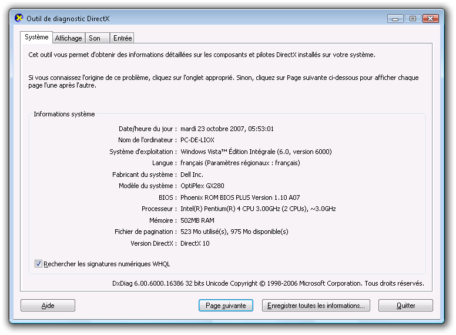

# Couches de rendu graphiquesGraphics Rendering Tiers
Une couche de rendu définit un niveau des capacités et des performances du matériel graphique pour un appareil qui exécute une application [!INCLUDE[TLA2#tla_winclient](../../../../includes/tla2sharptla-winclient-md.md)].A rendering tier defines a level of graphics hardware capability and performance for a device that runs a [!INCLUDE[TLA2#tla_winclient](../../../../includes/tla2sharptla-winclient-md.md)] application.  
  

  
   
## Matériel graphiqueGraphics Hardware  
 Les fonctionnalités du matériel graphique qui ont le plus d’impact sur les niveaux de la couche de rendu sont les suivantes :The features of the graphics hardware that most impact the rendering tier levels are:  
  
-   **RAM vidéo** La quantité de mémoire vidéo sur le matériel graphique détermine la taille et le nombre de mémoires tampon qui peuvent être utilisées pour la composition de graphiques.**Video RAM** The amount of video memory on the graphics hardware determines the size and number of buffers that can be used for compositing graphics.  
  
-   **Nuanceur de pixels** Un nuanceur de pixels est une fonction de traitement des graphiques qui calcule les effets pixel par pixel.**Pixel Shader** A pixel shader is a graphics processing function that calculates effects on a per-pixel basis. En fonction de la résolution des graphiques affichés, il peut y avoir plusieurs millions de pixels à traiter pour chaque image de l’affichage.Depending on the resolution of the displayed graphics, there could be several million pixels that need to be processed for each display frame.  
  
-   **Nuanceur de sommets** Un nuanceur de sommets est une fonction de traitement des graphiques qui effectue des opérations mathématiques sur les données de sommet de l’objet.**Vertex Shader** A vertex shader is a graphics processing function that performs mathematical operations on the vertex data of the object.  
  
-   **Prise en charge de la multitexture** La prise en charge de la multitexture fait référence à la possibilité d’appliquer au moins deux textures distinctes pendant une opération de mélange sur un objet graphique 3D.**Multitexture Support** Multitexture support refers to the ability to apply two or more distinct textures during a blending operation on a 3D graphics object. Le degré de prise en charge de la multitexture est déterminé par le nombre d’unités de multitexture sur le matériel graphique.The degree of multitexture support is determined by the number of multitexture units on the graphics hardware.  
  
   
## Définitions des couches de renduRendering Tier Definitions  
 Les fonctionnalités du matériel graphique déterminent la fonction de rendu d’une application [!INCLUDE[TLA2#tla_winclient](../../../../includes/tla2sharptla-winclient-md.md)].The features of the graphics hardware determine the rendering capability of a [!INCLUDE[TLA2#tla_winclient](../../../../includes/tla2sharptla-winclient-md.md)] application. Le système [!INCLUDE[TLA2#tla_winclient](../../../../includes/tla2sharptla-winclient-md.md)] définit trois couches de rendu :The [!INCLUDE[TLA2#tla_winclient](../../../../includes/tla2sharptla-winclient-md.md)] system defines three rendering tiers:  
  
-   **Couche de rendu 0** Aucune accélération matérielle graphique.**Rendering Tier 0** No graphics hardware acceleration. Toutes les fonctionnalités graphiques utilisent l’accélération logicielle.All graphics features use software acceleration. Le niveau de version [!INCLUDE[TLA2#tla_dx](../../../../includes/tla2sharptla-dx-md.md)] est inférieur à la version 9.0.The [!INCLUDE[TLA2#tla_dx](../../../../includes/tla2sharptla-dx-md.md)] version level is less than version 9.0.  
  
-   **Couche de rendu 1** Certaines fonctionnalités graphiques utilisent l’accélération matérielle graphique.**Rendering Tier 1** Some graphics features use graphics hardware acceleration. Le niveau de version [!INCLUDE[TLA2#tla_dx](../../../../includes/tla2sharptla-dx-md.md)] est supérieur ou égal à la version 9.0.The [!INCLUDE[TLA2#tla_dx](../../../../includes/tla2sharptla-dx-md.md)] version level is greater than or equal to version 9.0.  
  
-   **Couche de rendu 2** La plupart des fonctionnalités graphiques utilisent l’accélération matérielle graphique.**Rendering Tier 2** Most graphics features use graphics hardware acceleration. Le niveau de version [!INCLUDE[TLA2#tla_dx](../../../../includes/tla2sharptla-dx-md.md)] est supérieur ou égal à la version 9.0.The [!INCLUDE[TLA2#tla_dx](../../../../includes/tla2sharptla-dx-md.md)] version level is greater than or equal to version 9.0.  
  
 Le <xref:System.Windows.Media.RenderCapability.Tier%2A?displayProperty=nameWithType> propriété vous permet de récupérer la couche de rendu au moment de l’exécution de l’application.The <xref:System.Windows.Media.RenderCapability.Tier%2A?displayProperty=nameWithType> property allows you to retrieve the rendering tier at application run time. La couche de rendu permet de déterminer si l’appareil prend en charge certaines fonctionnalités graphiques à accélération matérielle.You use the rendering tier to determine whether the device supports certain hardware-accelerated graphics features. Votre application peut alors prendre des chemins de code différents au moment de l’exécution selon la couche de rendu prise en charge par l’appareil.Your application can then take different code paths at run time depending on the rendering tier supported by the device.  
  
### Couche de rendu 0Rendering Tier 0  
 La valeur de couche de rendu 0 signifie qu’aucune accélération matérielle graphique n’est disponible pour l’application sur l’appareil.A rendering tier value of 0 means that there is no graphics hardware acceleration available for the application on the device. À ce niveau de la couche, vous devez supposer que tous les graphiques seront restitués par le logiciel sans accélération matérielle.At this tier level, you should assume that all graphics will be rendered by software with no hardware acceleration. Les fonctionnalités de cette couche correspondent à une version [!INCLUDE[TLA2#tla_dx](../../../../includes/tla2sharptla-dx-md.md)] qui est inférieure à la version 9.0.This tier's functionality corresponds to a [!INCLUDE[TLA2#tla_dx](../../../../includes/tla2sharptla-dx-md.md)] version that is less than 9.0.  
  
### Couche de rendu 1 et couche de rendu 2Rendering Tier 1 and Rendering Tier 2  
  
> [!NOTE]
>  À partir de .NET Framework 4, la couche de rendu 1 a été redéfinie pour n’inclure que le matériel graphique prenant en charge [!INCLUDE[TLA2#tla_dx](../../../../includes/tla2sharptla-dx-md.md)] 9.0 ou version ultérieure.Starting in the .NET Framework 4, rendering tier 1 has been redefined to only include graphics hardware that supports [!INCLUDE[TLA2#tla_dx](../../../../includes/tla2sharptla-dx-md.md)] 9.0 or greater. Le matériel graphique prenant en charge [!INCLUDE[TLA2#tla_dx](../../../../includes/tla2sharptla-dx-md.md)] 7 ou 8 est désormais défini comme la couche de rendu 0.Graphics hardware that supports [!INCLUDE[TLA2#tla_dx](../../../../includes/tla2sharptla-dx-md.md)] 7 or 8 is now defined as rendering tier 0.  
  
 La valeur de couche de rendu 1 ou 2 signifie que la plupart des fonctionnalités graphiques de [!INCLUDE[TLA2#tla_winclient](../../../../includes/tla2sharptla-winclient-md.md)] utiliseront l’accélération matérielle si les ressources système nécessaires sont disponibles et n’ont pas été épuisées.A rendering tier value of 1 or 2 means that most of the graphics features of [!INCLUDE[TLA2#tla_winclient](../../../../includes/tla2sharptla-winclient-md.md)] will use hardware acceleration if the necessary system resources are available and have not been exhausted. Cela correspond à une version [!INCLUDE[TLA2#tla_dx](../../../../includes/tla2sharptla-dx-md.md)] qui est supérieure ou égale à la version 9.0.This corresponds to a [!INCLUDE[TLA2#tla_dx](../../../../includes/tla2sharptla-dx-md.md)] version that is greater than or equal to 9.0.  
  
 Le tableau suivant indique les différences entre la couche de rendu 1 et la couche de rendu 2 au niveau des spécifications de matériel graphique :The following table shows the differences in graphics hardware requirements for rendering tier 1 and rendering tier 2:  
  
|FonctionnalitéFeature|Couche 1Tier 1|Couche 2Tier 2|  
|-------------|------------|------------|  
|Version de [!INCLUDE[TLA2#tla_dx](../../../../includes/tla2sharptla-dx-md.md)][!INCLUDE[TLA2#tla_dx](../../../../includes/tla2sharptla-dx-md.md)] version|Doit être supérieure ou égale à 9.0.Must be greater than or equal to 9.0.|Doit être supérieure ou égale à 9.0.Must be greater than or equal to 9.0.|  
|RAM vidéoVideo RAM|Doit être supérieure ou égale à 60 Mo.Must be greater than or equal to 60MB.|Doit être supérieure ou égale à 120 Mo.Must be greater than or equal to 120MB.|  
|Nuanceur de pixelsPixel shader|Le niveau de version doit être supérieur ou égal à 2.0.Version level must greater than or equal to 2.0.|Le niveau de version doit être supérieur ou égal à 2.0.Version level must greater than or equal to 2.0.|  
|Nuanceur de sommetsVertex shader|Aucune spécification.No requirement.|Le niveau de version doit être supérieur ou égal à 2.0.Version level must greater than or equal to 2.0.|  
|Unités de multitextureMultitexture units|Aucune spécification.No requirement.|Le nombre d’unités doit être supérieur ou égal à 4.Number of units must greater than or equal to 4.|  
  
 Les fonctionnalités et fonctions suivantes sont à accélération matérielle pour les couches de rendu 1 et 2 :The following features and capabilities are hardware accelerated for rendering tier 1 and rendering tier 2:  
  
|FonctionnalitéFeature|NotesNotes|  
|-------------|-----------|  
|Rendu 2D2D rendering|La plupart des types de rendu 2D sont pris en charge.Most 2D rendering is supported.|  
|Rastérisation 3D3D rasterization|La plupart des types de rastérisation 3D sont pris en charge.Most 3D rasterization is supported.|  
|Filtrage anisotropique 3D3D anisotropic filtering|[!INCLUDE[TLA2#tla_winclient](../../../../includes/tla2sharptla-winclient-md.md)] tente d’utiliser le filtrage anisotropique lors de l’affichage du contenu 3D. attempts to use anisotropic filtering when rendering 3D content. Le filtrage anisotropique correspond à l’amélioration de la qualité d’image des textures des surfaces éloignées et en biais par rapport à l’appareil photo.Anisotropic filtering refers to enhancing the image quality of textures on surfaces that are far away and steeply angled with respect to the camera.|  
|Mappage MIP 3D3D MIP mapping|[!INCLUDE[TLA2#tla_winclient](../../../../includes/tla2sharptla-winclient-md.md)] tente d’utiliser le mappage MIP lors de l’affichage du contenu 3D. attempts to use MIP mapping when rendering 3D content. Mappage MIP améliore la qualité de rendu de la texture lorsque celle-ci occupe un champ plus petites de la vue dans un <xref:System.Windows.Controls.Viewport3D>.MIP mapping improves the quality of texture rendering when a texture occupies a smaller field of view in a <xref:System.Windows.Controls.Viewport3D>.|  
|Dégradés radiauxRadial gradients|Lors de la prise en charge, évitez d’utiliser <xref:System.Windows.Media.RadialGradientBrush> sur des objets volumineux.While supported, avoid the use of <xref:System.Windows.Media.RadialGradientBrush> on large objects.|  
|Calculs d’éclairage 3D3D lighting calculations|[!INCLUDE[TLA2#tla_winclient](../../../../includes/tla2sharptla-winclient-md.md)] exécute l’éclairage par sommet, ce qui signifie qu’une intensité légère doit être calculée à chaque sommet pour chaque matériel appliqué à un maillage. performs per-vertex lighting, which means that a light intensity must be calculated at each vertex for each material applied to a mesh.|  
|Rendu de texteText rendering|Le rendu de police de sous-pixel utilise les nuanceurs de pixels disponibles sur le matériel graphique.Sub-pixel font rendering uses available pixel shaders on the graphics hardware.|  
  
 Les fonctionnalités et fonctions suivantes sont à accélération matérielle uniquement pour la couche de rendu 2 :The following features and capabilities are hardware accelerated only for rendering tier 2:  
  
|FonctionnalitéFeature|NotesNotes|  
|-------------|-----------|  
|Anticrénelage 3D3D anti-aliasing|L’anticrénelage 3D est pris en charge uniquement sur les systèmes d’exploitation qui prennent en charge WDDM (Windows Display Driver Model), tels que [!INCLUDE[TLA2#tla_winvista](../../../../includes/tla2sharptla-winvista-md.md)] et [!INCLUDE[win7](../../../../includes/win7-md.md)].3D anti-aliasing is supported only on operating systems that support Windows Display Driver Model (WDDM), such as [!INCLUDE[TLA2#tla_winvista](../../../../includes/tla2sharptla-winvista-md.md)] and [!INCLUDE[win7](../../../../includes/win7-md.md)].|  
  
 Les fonctionnalités et fonctions suivantes ne sont **pas** à accélération matérielle :The following features and capabilities are **not** hardware accelerated:  
  
|FonctionnalitéFeature|NotesNotes|  
|-------------|-----------|  
|Contenu impriméPrinted content|Tout le contenu imprimé est restitué à l’aide du pipeline logiciel [!INCLUDE[TLA2#tla_winclient](../../../../includes/tla2sharptla-winclient-md.md)].All printed content is rendered using the [!INCLUDE[TLA2#tla_winclient](../../../../includes/tla2sharptla-winclient-md.md)] software pipeline.|  
|Contenu rastérisé qui utilise<xref:System.Windows.Media.Imaging.RenderTargetBitmap>Rasterized content that uses <xref:System.Windows.Media.Imaging.RenderTargetBitmap>|Tout le contenu restitué à l’aide de la <xref:System.Windows.Media.Imaging.RenderTargetBitmap.Render%2A> méthode <xref:System.Windows.Media.Imaging.RenderTargetBitmap>.Any content rendered by using the <xref:System.Windows.Media.Imaging.RenderTargetBitmap.Render%2A> method of <xref:System.Windows.Media.Imaging.RenderTargetBitmap>.|  
|Contenu en mosaïque qui utilise<xref:System.Windows.Media.TileBrush>Tiled content that uses <xref:System.Windows.Media.TileBrush>|Tout en mosaïque contenu dans lequel le <xref:System.Windows.Media.TileBrush.TileMode%2A> propriété de la <xref:System.Windows.Media.TileBrush> a la valeur <xref:System.Windows.Media.TileMode.Tile>.Any tiled content in which the <xref:System.Windows.Media.TileBrush.TileMode%2A> property of the <xref:System.Windows.Media.TileBrush> is set to <xref:System.Windows.Media.TileMode.Tile>.|  
|Surfaces qui dépassent la taille de texture maximale du matériel graphiqueSurfaces that exceed the maximum texture size of the graphics hardware|Pour la plupart des matériels graphiques, les grandes surfaces ont une taille de 2048 x 2048 ou 4096 x 4096 pixels.For most graphics hardware, large surfaces are 2048x2048 or 4096x4096 pixels in size.|  
|Toute opération dont la spécification de RAM vidéo dépasse la mémoire du matériel graphiqueAny operation whose video RAM requirement exceeds the memory of the graphics hardware|Vous pouvez surveiller l’utilisation de la RAM vidéo par l’application à l’aide de l’outil Perforator compris dans la suite [WPF Performance Suite](http://msdn.microsoft.com/library/67cafaad-57ad-4ecb-9c08-57fac144393e) du SDK Windows.You can monitor application video RAM usage by using the Perforator tool that is included in the [WPF Performance Suite](http://msdn.microsoft.com/library/67cafaad-57ad-4ecb-9c08-57fac144393e) in the Windows SDK.|  
|Fenêtres superposéesLayered windows|Les fenêtres superposées permettent aux applications [!INCLUDE[TLA2#tla_winclient](../../../../includes/tla2sharptla-winclient-md.md)] de restituer le contenu à l’écran dans une fenêtre non rectangulaire.Layered windows allow [!INCLUDE[TLA2#tla_winclient](../../../../includes/tla2sharptla-winclient-md.md)] applications to render content to the screen in a non-rectangular window. Sur les systèmes d’exploitation qui prennent en charge WDDM (Windows Display Driver Model), tels que [!INCLUDE[TLA2#tla_winvista](../../../../includes/tla2sharptla-winvista-md.md)] et [!INCLUDE[win7](../../../../includes/win7-md.md)], les fenêtres superposées sont à accélération matérielle.On operating systems that support Windows Display Driver Model (WDDM), such as [!INCLUDE[TLA2#tla_winvista](../../../../includes/tla2sharptla-winvista-md.md)] and [!INCLUDE[win7](../../../../includes/win7-md.md)], layered windows are hardware accelerated. Sur d’autres systèmes, tels que [!INCLUDE[winxp](../../../../includes/winxp-md.md)], les fenêtres superposées sont restituées par logiciel sans accélération matérielle.On other systems, such as [!INCLUDE[winxp](../../../../includes/winxp-md.md)], layered windows are rendered by software with no hardware acceleration.   Vous pouvez activer des fenêtres superposées dans [!INCLUDE[TLA2#tla_winclient](../../../../includes/tla2sharptla-winclient-md.md)] en définissant les éléments suivants <xref:System.Windows.Window> propriétés :You can enable layered windows in [!INCLUDE[TLA2#tla_winclient](../../../../includes/tla2sharptla-winclient-md.md)] by setting the following <xref:System.Windows.Window> properties:   -   <xref:System.Windows.Window.WindowStyle%2A> = <xref:System.Windows.WindowStyle.None> -   <xref:System.Windows.Window.AllowsTransparency%2A> = `true` -   <xref:System.Windows.Controls.Control.Background%2A> = <xref:System.Windows.Media.Brushes.Transparent%2A>|  
  
   
## Autres ressourcesOther Resources  
 Les ressources suivantes peuvent vous aider à analyser les caractéristiques des performances de votre application [!INCLUDE[TLA2#tla_winclient](../../../../includes/tla2sharptla-winclient-md.md)].The following resources can help you analyze the performance characteristics of your [!INCLUDE[TLA2#tla_winclient](../../../../includes/tla2sharptla-winclient-md.md)] application.  
  
### Paramètres du Registre pour le rendu des graphiquesGraphics Rendering Registry Settings  
 [!INCLUDE[TLA2#tla_winclient](../../../../includes/tla2sharptla-winclient-md.md)] fournit quatre paramètres du Registre pour le contrôle du rendu [!INCLUDE[TLA2#tla_winclient](../../../../includes/tla2sharptla-winclient-md.md)] : provides four registry settings for controlling [!INCLUDE[TLA2#tla_winclient](../../../../includes/tla2sharptla-winclient-md.md)] rendering:  
  
|ParamètreSetting|DescriptionDescription|  
|-------------|-----------------|  
|**Option Désactiver l’accélération matérielle****Disable Hardware Acceleration Option**|Spécifie si l’accélération matérielle doit être activée.Specifies whether hardware acceleration should be enabled.|  
|**Valeur d’échantillonnage multiple maximale****Maximum Multisample Value**|Spécifie le degré d’échantillonnage multiple pour l’anticrénelage de contenu [!INCLUDE[TLA2#tla_3d](../../../../includes/tla2sharptla-3d-md.md)].Specifies the degree of multisampling for antialiasing [!INCLUDE[TLA2#tla_3d](../../../../includes/tla2sharptla-3d-md.md)] content.|  
|**Paramètre Date de pilote vidéo requise****Required Video Driver Date Setting**|Spécifie si le système désactive l’accélération matérielle pour les pilotes commercialisés avant novembre 2004.Specifies whether the system disables hardware acceleration for drivers released before November 2004.|  
|**Option Utiliser le rastériseur de référence****Use Reference Rasterizer Option**|Spécifie si [!INCLUDE[TLA2#tla_winclient](../../../../includes/tla2sharptla-winclient-md.md)] doit utiliser le rastériseur de référence.Specifies whether [!INCLUDE[TLA2#tla_winclient](../../../../includes/tla2sharptla-winclient-md.md)] should use the reference rasterizer.|  
  
 Ces paramètres sont accessibles à tout utilitaire de configuration externe capable de référencer les paramètres du Registre [!INCLUDE[TLA2#tla_winclient](../../../../includes/tla2sharptla-winclient-md.md)].These settings can be accessed by any external configuration utility that knows how to reference the [!INCLUDE[TLA2#tla_winclient](../../../../includes/tla2sharptla-winclient-md.md)] registry settings. Ces paramètres peuvent également être créés ou modifiés en accédant directement aux valeurs à l’aide de l’Éditeur du Registre [!INCLUDE[TLA#tla_mswin](../../../../includes/tlasharptla-mswin-md.md)].These settings can also be created or modified by accessing the values directly by using the [!INCLUDE[TLA#tla_mswin](../../../../includes/tlasharptla-mswin-md.md)] Registry Editor. Pour plus d’informations, consultez [Paramètres du Registre pour le rendu des graphiques](../../../../docs/framework/wpf/graphics-multimedia/graphics-rendering-registry-settings.md).For more information, see [Graphics Rendering Registry Settings](../../../../docs/framework/wpf/graphics-multimedia/graphics-rendering-registry-settings.md).  
  
### Outils de profilage des performances WPFWPF Performance Profiling Tools  
 [!INCLUDE[TLA2#tla_winclient](../../../../includes/tla2sharptla-winclient-md.md)] fournit une suite d’outils de profilage des performances qui vous permettent d’analyser le comportement au moment de l’exécution de votre application et de déterminer les types d’optimisations des performances que vous pouvez appliquer. provides a suite of performance profiling tools that allow you to analyze the run-time behavior of your application and determine the types of performance optimizations you can apply. Le tableau suivant répertorie les outils de profilage des performances qui sont inclus dans l’outil [!INCLUDE[TLA2#tla_lhsdk](../../../../includes/tla2sharptla-lhsdk-md.md)], WPF Performance Suite :The following table lists the performance profiling tools that are included in the [!INCLUDE[TLA2#tla_lhsdk](../../../../includes/tla2sharptla-lhsdk-md.md)] tool, WPF Performance Suite:  
  
|OutilTool|DescriptionDescription|  
|----------|-----------------|  
|PerforatorPerforator|À utiliser pour analyser le comportement de rendu.Use for analyzing rendering behavior.|  
|Visual ProfilerVisual Profiler|À utiliser pour le profilage de l’utilisation des services [!INCLUDE[TLA2#tla_winclient](../../../../includes/tla2sharptla-winclient-md.md)], tels que la disposition et la gestion des événements, pour chaque élément de l’arborescence d’éléments visuels.Use for profiling the use of [!INCLUDE[TLA2#tla_winclient](../../../../includes/tla2sharptla-winclient-md.md)] services, such as layout and event handling, by elements in the visual tree.|  
  
 L’outil WPF Performance Suite fournit une vue graphique détaillée des données de performances.The WPF Performance Suite provides a rich, graphical view of performance data. Pour plus d’informations sur les outils de performances WPF, consultez [WPF Performance Suite](http://msdn.microsoft.com/library/67cafaad-57ad-4ecb-9c08-57fac144393e).For more information about WPF performance tools, see [WPF Performance Suite](http://msdn.microsoft.com/library/67cafaad-57ad-4ecb-9c08-57fac144393e).  
  
### Outil de diagnostic DirectXDirectX Diagnostic Tool  
 L’outil de diagnostic [!INCLUDE[TLA2#tla_dx](../../../../includes/tla2sharptla-dx-md.md)], Dxdiag.exe, est conçu pour vous aider à résoudre les problèmes liés à [!INCLUDE[TLA2#tla_dx](../../../../includes/tla2sharptla-dx-md.md)].The [!INCLUDE[TLA2#tla_dx](../../../../includes/tla2sharptla-dx-md.md)] Diagnostic Tool, Dxdiag.exe, is designed to help you troubleshoot [!INCLUDE[TLA2#tla_dx](../../../../includes/tla2sharptla-dx-md.md)]-related issues. Le dossier d’installation par défaut de l’outil de diagnostic [!INCLUDE[TLA2#tla_dx](../../../../includes/tla2sharptla-dx-md.md)] est :The default installation folder for the [!INCLUDE[TLA2#tla_dx](../../../../includes/tla2sharptla-dx-md.md)] Diagnostic Tool is:  
  
 `~\Windows\System32`  
  
 Quand vous exécutez l’outil de diagnostic [!INCLUDE[TLA2#tla_dx](../../../../includes/tla2sharptla-dx-md.md)], la fenêtre principale contient un jeu d’onglets qui vous permettent d’afficher et de diagnostiquer les problèmes liés à [!INCLUDE[TLA2#tla_dx](../../../../includes/tla2sharptla-dx-md.md)].When you run the [!INCLUDE[TLA2#tla_dx](../../../../includes/tla2sharptla-dx-md.md)] Diagnostic Tool, the main window contains a set of tabs that allow you to display and diagnose [!INCLUDE[TLA2#tla_dx](../../../../includes/tla2sharptla-dx-md.md)]-related information. Par exemple, l’onglet **Système** fournit des informations système à propos de votre ordinateur et spécifie la version de [!INCLUDE[TLA2#tla_dx](../../../../includes/tla2sharptla-dx-md.md)] installée sur votre ordinateur.For example, the **System** tab provides system information about your computer and specifies the version of [!INCLUDE[TLA2#tla_dx](../../../../includes/tla2sharptla-dx-md.md)] that is installed on your computer.  
  
   
Fenêtre principale de l’outil de diagnostic DirectXDirectX Diagnostic Tool main window  
  
## Voir aussiSee Also  
 <xref:System.Windows.Media.RenderCapability>  
 <xref:System.Windows.Media.RenderOptions>  
 [Optimisation des performances des applications WPFOptimizing WPF Application Performance](../../../../docs/framework/wpf/advanced/optimizing-wpf-application-performance.md)  
 [WPF Performance SuiteWPF Performance Suite](http://msdn.microsoft.com/library/67cafaad-57ad-4ecb-9c08-57fac144393e)  
 [Paramètres du Registre pour le rendu des graphiquesGraphics Rendering Registry Settings](../../../../docs/framework/wpf/graphics-multimedia/graphics-rendering-registry-settings.md)  
 [Conseils et astuces sur les animationsAnimation Tips and Tricks](../../../../docs/framework/wpf/graphics-multimedia/animation-tips-and-tricks.md)
