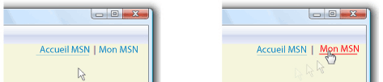

# Comment&#160;: sp&#233;cifier si un lien hypertexte est soulign&#233; ou non
L'objet <xref:System.Windows.Documents.Hyperlink> est un élément inclus de contenu de flux qui vous permet d'héberger des liens hypertexte au sein du contenu du flux.  Par défaut, <xref:System.Windows.Documents.Hyperlink> utilise un objet <xref:System.Windows.TextDecoration> pour afficher un souligné.  Les objets <xref:System.Windows.TextDecoration> peuvent être exigeants en termes de performance à instancier, en particulier si vous avez de nombreux objets <xref:System.Windows.Documents.Hyperlink>.  Si vous utilisez beaucoup d'éléments <xref:System.Windows.Documents.Hyperlink>, envisagez d'afficher un soulignement uniquement lors du déclenchement d'un événement, tel que <xref:System.Windows.ContentElement.MouseEnter>.  
  
 Dans l'exemple suivant, le soulignement du lien "My MSN" est dynamique : il s'affiche uniquement lorsque l'événement <xref:System.Windows.ContentElement.MouseEnter> est déclenché.  
  
   
Hyperliens définis à l'aide de décorations de texte  
  
## Exemple  
 L'exemple de balise suivant affiche un <xref:System.Windows.Documents.Hyperlink> défini avec et sans soulignement :  
  
 [!code-xml[Performance#PerformanceSnippet11](../../../../samples/snippets/csharp/VS_Snippets_Wpf/Performance/CSharp/Hyperlink.xaml#performancesnippet11)]  
  
 L'exemple de code suivant montre comment créer un soulignement pour le <xref:System.Windows.Documents.Hyperlink> sur l'événement <xref:System.Windows.ContentElement.MouseEnter> et le supprimer sur l'événement <xref:System.Windows.ContentElement.MouseLeave>.  
  
 [!code-csharp[Performance#PerformanceSnippet15](../../../../samples/snippets/csharp/VS_Snippets_Wpf/Performance/CSharp/Hyperlink.xaml.cs#performancesnippet15)]
 [!code-vb[Performance#PerformanceSnippet15](../../../../samples/snippets/visualbasic/VS_Snippets_Wpf/Performance/visualbasic/hyperlink.xaml.vb#performancesnippet15)]  
  
## Voir aussi  
 <xref:System.Windows.TextDecoration>   
 <xref:System.Windows.Documents.Hyperlink>   
 [Optimisation des performances des applications WPF](../../../../docs/framework/wpf/advanced/optimizing-wpf-application-performance.md)   
 [Créer une décoration de texte](../../../../docs/framework/wpf/advanced/how-to-create-a-text-decoration.md)