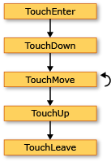
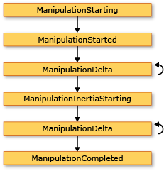

# Vue d'ensemble des entréesInput Overview
 Le sous-système [!INCLUDE[TLA#tla_winclient](../../../../includes/tlasharptla-winclient-md.md)] fournit une puissante [!INCLUDE[TLA#tla_api](../../../../includes/tlasharptla-api-md.md)] pour obtenir une entrée à partir de différents périphériques, notamment la souris, le clavier, le stylet et l’entrée tactile.The[!INCLUDE[TLA#tla_winclient](../../../../includes/tlasharptla-winclient-md.md)] subsystem provides a powerful [!INCLUDE[TLA#tla_api](../../../../includes/tlasharptla-api-md.md)] for obtaining input from a variety of devices, including the mouse, keyboard, touch, and stylus. Cette rubrique décrit les services fournis par [!INCLUDE[TLA2#tla_winclient](../../../../includes/tla2sharptla-winclient-md.md)] et explique l’architecture des systèmes d’entrée.This topic describes the services provided by [!INCLUDE[TLA2#tla_winclient](../../../../includes/tla2sharptla-winclient-md.md)] and explains the architecture of the input systems.  
  
  
   
## API d’entréeInput API  
 L’entrée principale [!INCLUDE[TLA2#tla_api](../../../../includes/tla2sharptla-api-md.md)] exposition se trouve sur les classes d’élément de base : <xref:System.Windows.UIElement>, <xref:System.Windows.ContentElement>, <xref:System.Windows.FrameworkElement>, et <xref:System.Windows.FrameworkContentElement>.The primary input [!INCLUDE[TLA2#tla_api](../../../../includes/tla2sharptla-api-md.md)] exposure is found on the base element classes: <xref:System.Windows.UIElement>, <xref:System.Windows.ContentElement>, <xref:System.Windows.FrameworkElement>, and <xref:System.Windows.FrameworkContentElement>.  Pour plus d’informations sur les éléments de base, consultez [Vue d’ensemble des éléments de base](../../../../docs/framework/wpf/advanced/base-elements-overview.md).For more information about the base elements, see [Base Elements Overview](../../../../docs/framework/wpf/advanced/base-elements-overview.md).  Ces classes fournissent la fonctionnalité pour les événements d’entrée associés aux appuis sur les boutons, aux boutons de la souris, à la roulette de la souris, au déplacement de la souris, à la gestion du focus et à la capture de la souris, entre autres.These classes provide functionality for input events related to key presses, mouse buttons, mouse wheel, mouse movement, focus management, and mouse capture, to name a few. En plaçant l’[!INCLUDE[TLA2#tla_api](../../../../includes/tla2sharptla-api-md.md)] d’entrée sur les éléments de base, plutôt qu’en traitant tous les événements d’entrée en tant que service, l’architecture d’entrée permet aux événements d’entrée d’avoir comme source un objet particulier dans l’interface utilisateur, et de prendre en charge un schéma de routage d’événements dans lequel plusieurs éléments peuvent gérer un événement d’entrée.By placing the input [!INCLUDE[TLA2#tla_api](../../../../includes/tla2sharptla-api-md.md)] on the base elements, rather than treating all input events as a service, the input architecture enables the input events to be sourced by a particular object in the UI, and to support an event routing scheme whereby more than one element has an opportunity to handle an input event. De nombreux événements d’entrée sont associés à une paire d’événements.Many input events have a pair of events associated with them.  Par exemple, la clé à l’événement d’arrêt est associée le <xref:System.Windows.Input.Keyboard.KeyDown> et <xref:System.Windows.Input.Keyboard.PreviewKeyDown> les événements.For example, the key down event is associated with the <xref:System.Windows.Input.Keyboard.KeyDown> and <xref:System.Windows.Input.Keyboard.PreviewKeyDown> events.  La différence entre ces événements réside dans la façon dont ils sont acheminés vers l’élément cible.The difference in these events is in how they are routed to the target element.  Les événements Preview parcourent l’arborescence d’éléments de l’élément racine vers l’élément cible.Preview events tunnel down the element tree from the root element to the target element.  Les événements de propagation se propagent de l’élément cible vers l’élément racine.Bubbling events bubble up from the target element to the root element.  Le routage d’événements dans [!INCLUDE[TLA2#tla_winclient](../../../../includes/tla2sharptla-winclient-md.md)] est discuté plus en détail plus loin dans cet article et dans la rubrique [Vue d’ensemble des événements routés](../../../../docs/framework/wpf/advanced/routed-events-overview.md).Event routing in [!INCLUDE[TLA2#tla_winclient](../../../../includes/tla2sharptla-winclient-md.md)] is discussed in more detail later in this overview and in the [Routed Events Overview](../../../../docs/framework/wpf/advanced/routed-events-overview.md).  
  
### Classes de souris et de clavierKeyboard and Mouse Classes  
 En plus de l’entrée [!INCLUDE[TLA2#tla_api](../../../../includes/tla2sharptla-api-md.md)] sur les classes d’élément de base, le <xref:System.Windows.Input.Keyboard> classe et <xref:System.Windows.Input.Mouse> fournissent des classes supplémentaires [!INCLUDE[TLA2#tla_api](../../../../includes/tla2sharptla-api-md.md)] pour travailler avec l’entrée clavier et souris.In addition to the input [!INCLUDE[TLA2#tla_api](../../../../includes/tla2sharptla-api-md.md)] on the base element classes, the <xref:System.Windows.Input.Keyboard> class and <xref:System.Windows.Input.Mouse> classes provide additional [!INCLUDE[TLA2#tla_api](../../../../includes/tla2sharptla-api-md.md)] for working with keyboard and mouse input.  
  
 Exemples d’entrée [!INCLUDE[TLA2#tla_api](../../../../includes/tla2sharptla-api-md.md)] sur la <xref:System.Windows.Input.Keyboard> classe sont le <xref:System.Windows.Input.Keyboard.Modifiers%2A> propriété, qui retourne le <xref:System.Windows.Input.ModifierKeys> actuellement enfoncé et le <xref:System.Windows.Input.Keyboard.IsKeyDown%2A> (méthode), qui détermine si une clé spécifiée est utilisée.Examples of input [!INCLUDE[TLA2#tla_api](../../../../includes/tla2sharptla-api-md.md)] on the <xref:System.Windows.Input.Keyboard> class are the <xref:System.Windows.Input.Keyboard.Modifiers%2A> property, which returns the <xref:System.Windows.Input.ModifierKeys> currently pressed, and the <xref:System.Windows.Input.Keyboard.IsKeyDown%2A> method, which determines whether a specified key is pressed.  
  
 L’exemple suivant utilise le <xref:System.Windows.Input.Keyboard.GetKeyStates%2A> pour déterminer si un <xref:System.Windows.Input.Key> est enfoncé.The following example uses the <xref:System.Windows.Input.Keyboard.GetKeyStates%2A> method to determine if a <xref:System.Windows.Input.Key> is in the down state.  
  
 [!code-csharp[keyargssnippetsample#KeyEventArgsKeyBoardGetKeyStates](../../../../samples/snippets/csharp/VS_Snippets_Wpf/KeyArgsSnippetSample/CSharp/Window1.xaml.cs#keyeventargskeyboardgetkeystates)]
 [!code-vb[keyargssnippetsample#KeyEventArgsKeyBoardGetKeyStates](../../../../samples/snippets/visualbasic/VS_Snippets_Wpf/KeyArgsSnippetSample/visualbasic/window1.xaml.vb#keyeventargskeyboardgetkeystates)]  
  
 Exemples d’entrée [!INCLUDE[TLA2#tla_api](../../../../includes/tla2sharptla-api-md.md)] sur la <xref:System.Windows.Input.Mouse> classe sont <xref:System.Windows.Input.Mouse.MiddleButton%2A>, qui obtient l’état du bouton central de la souris, et <xref:System.Windows.Input.Mouse.DirectlyOver%2A>, qui obtient l’élément, le pointeur de la souris se trouve.Examples of input [!INCLUDE[TLA2#tla_api](../../../../includes/tla2sharptla-api-md.md)] on the <xref:System.Windows.Input.Mouse> class are <xref:System.Windows.Input.Mouse.MiddleButton%2A>, which obtains the state of the middle mouse button, and <xref:System.Windows.Input.Mouse.DirectlyOver%2A>, which gets the element the mouse pointer is currently over.  
  
 L’exemple suivant détermine si le <xref:System.Windows.Input.Mouse.LeftButton%2A> sur la souris se trouve dans le <xref:System.Windows.Input.MouseButtonState.Pressed> état.The following example determines whether the <xref:System.Windows.Input.Mouse.LeftButton%2A> on the mouse is in the <xref:System.Windows.Input.MouseButtonState.Pressed> state.  
  
 [!code-csharp[mouserelatedsnippets#MouseRelatedSnippetsGetLeftButtonMouse](../../../../samples/snippets/csharp/VS_Snippets_Wpf/MouseRelatedSnippets/CSharp/Window1.xaml.cs#mouserelatedsnippetsgetleftbuttonmouse)]
 [!code-vb[mouserelatedsnippets#MouseRelatedSnippetsGetLeftButtonMouse](../../../../samples/snippets/visualbasic/VS_Snippets_Wpf/MouseRelatedSnippets/visualbasic/window1.xaml.vb#mouserelatedsnippetsgetleftbuttonmouse)]  
  
 Le <xref:System.Windows.Input.Mouse> et <xref:System.Windows.Input.Keyboard> classes sont traités plus en détail tout au long de cette vue d’ensemble.The <xref:System.Windows.Input.Mouse> and <xref:System.Windows.Input.Keyboard> classes are covered in more detail throughout this overview.  
  
### Entrée du styletStylus Input  
 [!INCLUDE[TLA2#tla_winclient](../../../../includes/tla2sharptla-winclient-md.md)]prend en charge la <xref:System.Windows.Input.Stylus>. has integrated support for the <xref:System.Windows.Input.Stylus>.  Le <xref:System.Windows.Input.Stylus> est une entrée de stylet rendue populaire par le [!INCLUDE[TLA#tla_tpc](../../../../includes/tlasharptla-tpc-md.md)].The <xref:System.Windows.Input.Stylus> is a pen input made popular by the [!INCLUDE[TLA#tla_tpc](../../../../includes/tlasharptla-tpc-md.md)].  Les applications [!INCLUDE[TLA2#tla_winclient](../../../../includes/tla2sharptla-winclient-md.md)] peuvent traiter le stylet comme une souris à l’aide de l’[!INCLUDE[TLA2#tla_api](../../../../includes/tla2sharptla-api-md.md)] de souris, mais [!INCLUDE[TLA2#tla_winclient](../../../../includes/tla2sharptla-winclient-md.md)] expose également une abstraction du stylet qui utilise un modèle semblable au clavier et à la souris.[!INCLUDE[TLA2#tla_winclient](../../../../includes/tla2sharptla-winclient-md.md)] applications can treat the stylus as a mouse by using the mouse [!INCLUDE[TLA2#tla_api](../../../../includes/tla2sharptla-api-md.md)], but [!INCLUDE[TLA2#tla_winclient](../../../../includes/tla2sharptla-winclient-md.md)] also exposes a stylus device abstraction that use a model similar to the keyboard and mouse.  Toutes les [!INCLUDE[TLA2#tla_api#plural](../../../../includes/tla2sharptla-apisharpplural-md.md)] liées au stylet contiennent le mot « Stylus ».All stylus-related [!INCLUDE[TLA2#tla_api#plural](../../../../includes/tla2sharptla-apisharpplural-md.md)] contain the word "Stylus".  
  
 Étant donné que le stylet peut agir comme une souris, les applications qui prennent uniquement en charge l’entrée de la souris peuvent quand même bénéficier automatiquement d’un certain niveau de prise en charge du stylet.Because the stylus can act as a mouse, applications that support only mouse input can still obtain some level of stylus support automatically. Quand le stylet est utilisé de cette manière, l’application a la possibilité de gérer l’événement de stylet approprié, et elle gère ensuite l’événement de souris correspondant.When the stylus is used in such a manner, the application is given the opportunity to handle the appropriate stylus event and then handles the corresponding mouse event. En outre, les services de niveau supérieur tels que l’entrée d’encre sont également disponibles grâce à l’abstraction du stylet.In addition, higher-level services such as ink input are also available through the stylus device abstraction.  Pour plus d’informations sur l’encre comme entrée, consultez [Débuter avec l’encre](../../../../docs/framework/wpf/advanced/getting-started-with-ink.md).For more information about ink as input, see [Getting Started with Ink](../../../../docs/framework/wpf/advanced/getting-started-with-ink.md).  
  
   
## Routage d’événementsEvent Routing  
 Un <xref:System.Windows.FrameworkElement> peut contenir d’autres éléments en tant qu’éléments enfants dans son modèle de contenu, formant ainsi une arborescence d’éléments.A <xref:System.Windows.FrameworkElement> can contain other elements as child elements in its content model, forming a tree of elements.  Dans [!INCLUDE[TLA2#tla_winclient](../../../../includes/tla2sharptla-winclient-md.md)], l’élément parent peut participer à l’entrée dirigée vers ses éléments enfants ou à d’autres descendants en gérant les événements.In [!INCLUDE[TLA2#tla_winclient](../../../../includes/tla2sharptla-winclient-md.md)], the parent element can participate in input directed to its child elements or other descendants by handing events. Ceci est particulièrement utile pour la création de contrôles à partir de contrôles plus petits, un processus appelé « composition de contrôle » ou simplement « composition ».This is especially useful for building controls out of smaller controls, a process known as "control composition" or "compositing." Pour plus d’informations sur les arborescences d’éléments et sur les relations entre les arborescences d’éléments et les itinéraires des événements, consultez [Arborescences dans WPF](../../../../docs/framework/wpf/advanced/trees-in-wpf.md).For more information about element trees and how element trees relate to event routes, see [Trees in WPF](../../../../docs/framework/wpf/advanced/trees-in-wpf.md).  
  
 Le routage d’événements est le processus qui consiste à transférer des événements à plusieurs éléments, afin qu’un objet ou un élément sur l’itinéraire puisse choisir de fournir une réponse significative (par l’intermédiaire de la gestion) à un événement ayant pu avoir comme source un autre élément.Event routing is the process of forwarding events to multiple elements, so that a particular object or element along the route can choose to offer a significant response (through handling) to an event that might have been sourced by a different element.  Les événements routés utilisent l’un des trois mécanismes de routage suivants : direct, par propagation et par tunneling.Routed events use one of three routing mechanisms: direct, bubbling, and tunneling.  Avec le routage direct, l’élément source est le seul élément notifié, et l’événement n’est pas acheminé vers d’autres éléments.In direct routing, the source element is the only element notified, and the event is not routed to any other elements. Toutefois, l’événement routé directement offre des fonctions supplémentaires qui sont uniquement présentes pour les événements routés, par opposition aux événements [!INCLUDE[TLA2#tla_clr](../../../../includes/tla2sharptla-clr-md.md)] standard.However, the direct routed event still offers some additional capabilities that are only present for routed events as opposed to standard [!INCLUDE[TLA2#tla_clr](../../../../includes/tla2sharptla-clr-md.md)] events. La propagation remonte l’arborescence d’éléments en notifiant d’abord l’élément à l’origine de l’événement, puis l’élément parent, et ainsi de suite.Bubbling works up the element tree by first notifying the element that sourced the event, then the parent element, and so on.  Le tunneling commence à la racine de l’arborescence d’éléments puis descend, en finissant à l’élément source d’origine.Tunneling starts at the root of the element tree and works down, ending with the original source element.  Pour plus d’informations sur les événements routés, consultez [Vue d’ensemble des événements routés](../../../../docs/framework/wpf/advanced/routed-events-overview.md).For more information about routed events, see [Routed Events Overview](../../../../docs/framework/wpf/advanced/routed-events-overview.md).  
  
 Les événements d’entrée [!INCLUDE[TLA2#tla_winclient](../../../../includes/tla2sharptla-winclient-md.md)] existent généralement par paires, constituées d’un événement de tunneling et d’un événement de propagation.[!INCLUDE[TLA2#tla_winclient](../../../../includes/tla2sharptla-winclient-md.md)] input events generally come in pairs that consists of a tunneling event and a bubbling event.  Les événements de tunneling se distinguent des événements de propagation par le préfixe « Preview ».Tunneling events are distinguished from bubbling events with the "Preview" prefix.  Par exemple, <xref:System.Windows.Input.Mouse.PreviewMouseMove> est la version de tunneling d’un événement de déplacement de la souris et <xref:System.Windows.Input.Mouse.MouseMove> est la version de propagation de cet événement.For instance, <xref:System.Windows.Input.Mouse.PreviewMouseMove> is the tunneling version of a mouse move event and <xref:System.Windows.Input.Mouse.MouseMove> is the bubbling version of this event. Cet appariement d’événements est une convention implémentée au niveau de l’élément. Ce n’est pas une fonctionnalité inhérente au système d’événements [!INCLUDE[TLA2#tla_winclient](../../../../includes/tla2sharptla-winclient-md.md)].This event pairing is a convention that is implemented at the element level and is not an inherent capability of the [!INCLUDE[TLA2#tla_winclient](../../../../includes/tla2sharptla-winclient-md.md)] event system. Pour plus d’informations, consultez la section Événements d’entrée WPF dans [Vue d’ensemble des événements routés](../../../../docs/framework/wpf/advanced/routed-events-overview.md).For details, see the WPF Input Events section in [Routed Events Overview](../../../../docs/framework/wpf/advanced/routed-events-overview.md).  
  
   
## Gestion des événements d’entréeHandling Input Events  
 Pour recevoir une entrée sur un élément, un gestionnaire d’événements doit être associé à cet événement particulier.To receive input on an element, an event handler must be associated with that particular event.  Dans [!INCLUDE[TLA2#tla_xaml](../../../../includes/tla2sharptla-xaml-md.md)], c’est simple : vous référencez le nom de l’événement en tant qu’attribut de l’élément qui écoute cet événement.In [!INCLUDE[TLA2#tla_xaml](../../../../includes/tla2sharptla-xaml-md.md)] this is straightforward: you reference the name of the event as an attribute of the element that will be listening for this event.  Ensuite, vous affectez comme valeur de l’attribut le nom du gestionnaire d’événements que vous définissez, en fonction d’un délégué.Then, you set the value of the attribute to the name of the event handler that you define, based on a delegate.  Le gestionnaire d’événements doit être écrit en code (par exemple [!INCLUDE[TLA#tla_cshrp](../../../../includes/tlasharptla-cshrp-md.md)]) et peut être inclus dans un fichier code-behind.The event handler must be written in code such as [!INCLUDE[TLA#tla_cshrp](../../../../includes/tlasharptla-cshrp-md.md)] and can be included in a code-behind file.  
  
 Les événements de clavier se produisent quand le système d’exploitation signale des actions de touches qui ont lieu pendant que le focus clavier se trouve sur un élément.Keyboard events occur when the operating system reports key actions that occur while keyboard focus is on an element. Les événements de souris et de stylet appartiennent chacun à deux catégories : les événements qui signalent des changements de la position du pointeur par rapport à l’élément, et les événements qui signalent des changements d’état des boutons du périphérique.Mouse and stylus events each fall into two categories: events that report changes in pointer position relative to the element, and events that report changes in the state of device buttons.  
  
### Exemple d’événement d’entrée de clavierKeyboard Input Event Example  
 L’exemple suivant détecte un appui sur la touche de direction gauche.The following example listens for a left arrow key press.  A <xref:System.Windows.Controls.StackPanel> est créé qui a un <xref:System.Windows.Controls.Button>.A <xref:System.Windows.Controls.StackPanel> is created that has a <xref:System.Windows.Controls.Button>.  Un gestionnaire d’événements pour écouter les pression sur la touche flèche gauche est attachée à la <xref:System.Windows.Controls.Button> instance.An event handler to listen for the left arrow key press is attached to the <xref:System.Windows.Controls.Button> instance.  
  
 La première section de l’exemple crée le <xref:System.Windows.Controls.StackPanel> et <xref:System.Windows.Controls.Button> et joint le Gestionnaire d’événements pour le <xref:System.Windows.UIElement.KeyDown>.The first section of the example creates the <xref:System.Windows.Controls.StackPanel> and the <xref:System.Windows.Controls.Button> and attaches the event handler for the <xref:System.Windows.UIElement.KeyDown>.  
  
 [!code-xaml[InputOvw#Input_OvwKeyboardExampleXAML](../../../../samples/snippets/csharp/VS_Snippets_Wpf/InputOvw/CSharp/Page1.xaml#input_ovwkeyboardexamplexaml)]  
  
 [!code-csharp[InputOvw#Input_OvwKeyboardExampleUICodeBehind](../../../../samples/snippets/csharp/VS_Snippets_Wpf/InputOvw/CSharp/Page1.xaml.cs#input_ovwkeyboardexampleuicodebehind)]
 [!code-vb[InputOvw#Input_OvwKeyboardExampleUICodeBehind](../../../../samples/snippets/visualbasic/VS_Snippets_Wpf/InputOvw/VisualBasic/Page1.xaml.vb#input_ovwkeyboardexampleuicodebehind)]  
  
 La deuxième section est écrite en code et définit le gestionnaire d’événements.The second section is written in code and defines the event handler.  Lorsque la touche de direction gauche est activée et le <xref:System.Windows.Controls.Button> a le focus clavier, le gestionnaire s’exécute et le <xref:System.Windows.Controls.Control.Background%2A> couleur de la <xref:System.Windows.Controls.Button> est modifiée.When the left arrow key is pressed and the <xref:System.Windows.Controls.Button> has keyboard focus, the handler runs and the <xref:System.Windows.Controls.Control.Background%2A> color of the <xref:System.Windows.Controls.Button> is changed.  Si la touche est enfoncée, mais il n’est pas la clé de la flèche vers la gauche, le <xref:System.Windows.Controls.Control.Background%2A> couleur de la <xref:System.Windows.Controls.Button> revient à la couleur de début.If the key is pressed, but it is not the left arrow key, the <xref:System.Windows.Controls.Control.Background%2A> color of the <xref:System.Windows.Controls.Button> is changed back to its starting color.  
  
 [!code-csharp[InputOvw#Input_OvwKeyboardExampleHandlerCodeBehind](../../../../samples/snippets/csharp/VS_Snippets_Wpf/InputOvw/CSharp/Page1.xaml.cs#input_ovwkeyboardexamplehandlercodebehind)]
 [!code-vb[InputOvw#Input_OvwKeyboardExampleHandlerCodeBehind](../../../../samples/snippets/visualbasic/VS_Snippets_Wpf/InputOvw/VisualBasic/Page1.xaml.vb#input_ovwkeyboardexamplehandlercodebehind)]  
  
### Exemple d’événement d’entrée de sourisMouse Input Event Example  
 Dans l’exemple suivant, la <xref:System.Windows.Controls.Control.Background%2A> couleur d’un <xref:System.Windows.Controls.Button> est modifiée lorsque le pointeur de la souris entre dans le <xref:System.Windows.Controls.Button>.In the following example, the <xref:System.Windows.Controls.Control.Background%2A> color of a <xref:System.Windows.Controls.Button> is changed when the mouse pointer enters the <xref:System.Windows.Controls.Button>.  Le <xref:System.Windows.Controls.Control.Background%2A> couleur est restaurée lorsque la souris quitte le <xref:System.Windows.Controls.Button>.The <xref:System.Windows.Controls.Control.Background%2A> color is restored when the mouse leaves the <xref:System.Windows.Controls.Button>.  
  
 La première section de l’exemple crée le <xref:System.Windows.Controls.StackPanel> et <xref:System.Windows.Controls.Button> contrôler et attache les gestionnaires d’événements pour le <xref:System.Windows.UIElement.MouseEnter> et <xref:System.Windows.UIElement.MouseLeave> événements à la <xref:System.Windows.Controls.Button>.The first section of the example creates the <xref:System.Windows.Controls.StackPanel> and the <xref:System.Windows.Controls.Button> control and attaches the event handlers for the <xref:System.Windows.UIElement.MouseEnter> and <xref:System.Windows.UIElement.MouseLeave> events to the <xref:System.Windows.Controls.Button>.  
  
 [!code-xaml[InputOvw#Input_OvwMouseExampleXAML](../../../../samples/snippets/csharp/VS_Snippets_Wpf/InputOvw/CSharp/Page1.xaml#input_ovwmouseexamplexaml)]  
  
 [!code-csharp[InputOvw#Input_OvwMouseExampleUICodeBehind](../../../../samples/snippets/csharp/VS_Snippets_Wpf/InputOvw/CSharp/Page1.xaml.cs#input_ovwmouseexampleuicodebehind)]
 [!code-vb[InputOvw#Input_OvwMouseExampleUICodeBehind](../../../../samples/snippets/visualbasic/VS_Snippets_Wpf/InputOvw/VisualBasic/Page1.xaml.vb#input_ovwmouseexampleuicodebehind)]  
  
 La deuxième section est écrite en code et définit le gestionnaire d’événements.The second section of the example is written in code and defines the event handlers.  Lorsque la souris entre dans le <xref:System.Windows.Controls.Button>, le <xref:System.Windows.Controls.Control.Background%2A> couleur de la <xref:System.Windows.Controls.Button> est remplacée par <xref:System.Windows.Media.Brushes.SlateGray%2A>.When the mouse enters the <xref:System.Windows.Controls.Button>, the <xref:System.Windows.Controls.Control.Background%2A> color of the <xref:System.Windows.Controls.Button> is changed to <xref:System.Windows.Media.Brushes.SlateGray%2A>.  Lorsque la souris quitte le <xref:System.Windows.Controls.Button>, le <xref:System.Windows.Controls.Control.Background%2A> couleur de la <xref:System.Windows.Controls.Button> revient à <xref:System.Windows.Media.Brushes.AliceBlue%2A>.When the mouse leaves the <xref:System.Windows.Controls.Button>, the <xref:System.Windows.Controls.Control.Background%2A> color of the <xref:System.Windows.Controls.Button> is changed back to <xref:System.Windows.Media.Brushes.AliceBlue%2A>.  
  
 [!code-csharp[InputOvw#Input_OvwMouseExampleEneterHandler](../../../../samples/snippets/csharp/VS_Snippets_Wpf/InputOvw/CSharp/Page1.xaml.cs#input_ovwmouseexampleeneterhandler)]
 [!code-vb[InputOvw#Input_OvwMouseExampleEneterHandler](../../../../samples/snippets/visualbasic/VS_Snippets_Wpf/InputOvw/VisualBasic/Page1.xaml.vb#input_ovwmouseexampleeneterhandler)]  
  
 [!code-csharp[InputOvw#Input_OvwMouseExampleLeaveHandler](../../../../samples/snippets/csharp/VS_Snippets_Wpf/InputOvw/CSharp/Page1.xaml.cs#input_ovwmouseexampleleavehandler)]
 [!code-vb[InputOvw#Input_OvwMouseExampleLeaveHandler](../../../../samples/snippets/visualbasic/VS_Snippets_Wpf/InputOvw/VisualBasic/Page1.xaml.vb#input_ovwmouseexampleleavehandler)]  
  
   
## Entrée de texteText Input  
 Le <xref:System.Windows.ContentElement.TextInput> événement vous permet d’écouter pour l’entrée de texte d’une manière indépendante du périphérique.The <xref:System.Windows.ContentElement.TextInput> event enables you to listen for text input in a device-independent manner. Le clavier est le principal moyen d’entrer du texte, mais la voix, l’écriture manuscrite et d’autres périphériques d’entrée peuvent aussi générer du texte.The keyboard is the primary means of text input, but speech, handwriting, and other input devices can generate text input also.  
  
 Pour l’entrée au clavier, [!INCLUDE[TLA2#tla_winclient](../../../../includes/tla2sharptla-winclient-md.md)] envoie d’abord approprié <xref:System.Windows.ContentElement.KeyDown> / <xref:System.Windows.ContentElement.KeyUp> événements.For keyboard input, [!INCLUDE[TLA2#tla_winclient](../../../../includes/tla2sharptla-winclient-md.md)] first sends the appropriate <xref:System.Windows.ContentElement.KeyDown>/<xref:System.Windows.ContentElement.KeyUp> events. Si ces événements ne sont pas gérés et la clé est textuelle plutôt que (une clé de contrôle telles que les flèches de direction) ou les touches de fonction, un <xref:System.Windows.ContentElement.TextInput> événement est déclenché.If those events are not handled and the key is textual (rather than a control key such as directional arrows or function keys), then a <xref:System.Windows.ContentElement.TextInput> event is raised.  Il n’est pas toujours un mappage simple entre <xref:System.Windows.ContentElement.KeyDown> / <xref:System.Windows.ContentElement.KeyUp> et <xref:System.Windows.ContentElement.TextInput> événements, car plusieurs séquences de touches peuvent générer un caractère unique de l’entrée de texte et de séquences de touches uniques peuvent générer plusieurs caractères chaînes.There is not always a simple one-to-one mapping between <xref:System.Windows.ContentElement.KeyDown>/<xref:System.Windows.ContentElement.KeyUp> and <xref:System.Windows.ContentElement.TextInput> events because multiple keystrokes can generate a single character of text input and single keystrokes can generate multi-character strings.  Ceci est particulièrement valable pour des langues telles que le chinois, le japonais et le coréen, qui utilisent des [!INCLUDE[TLA#tla_ime#plural](../../../../includes/tlasharptla-imesharpplural-md.md)] pour générer les milliers de caractères possibles dans leurs alphabets correspondants.This is especially true for languages such as Chinese, Japanese, and Korean which use [!INCLUDE[TLA#tla_ime#plural](../../../../includes/tlasharptla-imesharpplural-md.md)] to generate the thousands of possible characters in their corresponding alphabets.  
  
 Lorsque [!INCLUDE[TLA2#tla_winclient](../../../../includes/tla2sharptla-winclient-md.md)] envoie un <xref:System.Windows.ContentElement.KeyUp> / <xref:System.Windows.ContentElement.KeyDown> événement, <xref:System.Windows.Input.KeyEventArgs.Key%2A> a la valeur <xref:System.Windows.Input.Key.System?displayProperty=nameWithType> si les séquences de touches peuvent faire partie d’un <xref:System.Windows.ContentElement.TextInput> événement (si ALT + S est utilisé, par exemple).When [!INCLUDE[TLA2#tla_winclient](../../../../includes/tla2sharptla-winclient-md.md)] sends a <xref:System.Windows.ContentElement.KeyUp>/<xref:System.Windows.ContentElement.KeyDown> event, <xref:System.Windows.Input.KeyEventArgs.Key%2A> is set to <xref:System.Windows.Input.Key.System?displayProperty=nameWithType> if the keystrokes could become part of a <xref:System.Windows.ContentElement.TextInput> event (if ALT+S is pressed, for example). Cela permet au code dans un <xref:System.Windows.ContentElement.KeyDown> Gestionnaire d’événements pour rechercher les <xref:System.Windows.Input.Key.System?displayProperty=nameWithType> et, s’il trouve, quitter le traitement du Gestionnaire de relief par la suite <xref:System.Windows.ContentElement.TextInput> événement.This allows code in a <xref:System.Windows.ContentElement.KeyDown> event handler to check for <xref:System.Windows.Input.Key.System?displayProperty=nameWithType> and, if found, leave processing for the handler of the subsequently raised <xref:System.Windows.ContentElement.TextInput> event. Dans ce cas, les différentes propriétés de la <xref:System.Windows.Input.TextCompositionEventArgs> argument peut être utilisé pour déterminer les séquences de touches d’origine.In these cases, the various properties of the <xref:System.Windows.Input.TextCompositionEventArgs> argument can be used to determine the original keystrokes. De même, si un [!INCLUDE[TLA2#tla_ime](../../../../includes/tla2sharptla-ime-md.md)] est actif, <xref:System.Windows.Input.Key> a la valeur <xref:System.Windows.Input.Key.ImeProcessed?displayProperty=nameWithType>, et <xref:System.Windows.Input.KeyEventArgs.ImeProcessedKey%2A> donne la séquence ou les séquences de touches d’origine.Similarly, if an [!INCLUDE[TLA2#tla_ime](../../../../includes/tla2sharptla-ime-md.md)] is active, <xref:System.Windows.Input.Key> has the value of <xref:System.Windows.Input.Key.ImeProcessed?displayProperty=nameWithType>, and <xref:System.Windows.Input.KeyEventArgs.ImeProcessedKey%2A> gives the original keystroke or keystrokes.  
  
 L’exemple suivant définit un gestionnaire pour le <xref:System.Windows.Controls.Primitives.ButtonBase.Click> événement et un gestionnaire pour le <xref:System.Windows.UIElement.KeyDown> événement.The following example defines a handler for the <xref:System.Windows.Controls.Primitives.ButtonBase.Click> event and a handler for the <xref:System.Windows.UIElement.KeyDown> event.  
  
 Le premier segment de code ou de balisage crée l’interface utilisateur.The first segment of code or markup creates the user interface.  
  
 [!code-xaml[InputOvw#Input_OvwTextInputXAML](../../../../samples/snippets/csharp/VS_Snippets_Wpf/InputOvw/CSharp/Page1.xaml#input_ovwtextinputxaml)]  
  
 [!code-csharp[InputOvw#Input_OvwTextInputUICodeBehind](../../../../samples/snippets/csharp/VS_Snippets_Wpf/InputOvw/CSharp/Page1.xaml.cs#input_ovwtextinputuicodebehind)]
 [!code-vb[InputOvw#Input_OvwTextInputUICodeBehind](../../../../samples/snippets/visualbasic/VS_Snippets_Wpf/InputOvw/VisualBasic/Page1.xaml.vb#input_ovwtextinputuicodebehind)]  
  
 Le deuxième segment de code contient les gestionnaires d’événements.The second segment of code contains the event handlers.  
  
 [!code-csharp[InputOvw#Input_OvwTextInputHandlersCodeBehind](../../../../samples/snippets/csharp/VS_Snippets_Wpf/InputOvw/CSharp/Page1.xaml.cs#input_ovwtextinputhandlerscodebehind)]
 [!code-vb[InputOvw#Input_OvwTextInputHandlersCodeBehind](../../../../samples/snippets/visualbasic/VS_Snippets_Wpf/InputOvw/VisualBasic/Page1.xaml.vb#input_ovwtextinputhandlerscodebehind)]  
  
 Étant donné que les événements d’entrée propagent l’itinéraire d’événement, le <xref:System.Windows.Controls.StackPanel> reçoit l’entrée, quelle que soit l’élément qui a le focus clavier.Because input events bubble up the event route, the <xref:System.Windows.Controls.StackPanel> receives the input regardless of which element has keyboard focus. Le <xref:System.Windows.Controls.TextBox> contrôle est notifié en premier et le `OnTextInputKeyDown` gestionnaire est appelé uniquement si le <xref:System.Windows.Controls.TextBox> n’a pas géré l’entrée.The <xref:System.Windows.Controls.TextBox> control is notified first and the `OnTextInputKeyDown` handler is called only if the <xref:System.Windows.Controls.TextBox> did not handle the input. Si le <xref:System.Windows.UIElement.PreviewKeyDown> événement est utilisé à la place de la <xref:System.Windows.UIElement.KeyDown> événement, le `OnTextInputKeyDown` gestionnaire est appelé en premier.If the <xref:System.Windows.UIElement.PreviewKeyDown> event is used instead of the <xref:System.Windows.UIElement.KeyDown> event, the `OnTextInputKeyDown` handler is called first.  
  
 Dans cet exemple, la logique de gestion est écrite deux fois : une fois pour Ctrl+O et une autre fois pour l’événement de clic du bouton.In this example, the handling logic is written two times—one time for CTRL+O, and again for button's click event. Vous pouvez simplifier cela en utilisant des commandes, au lieu de traiter les événements d’entrée directement.This can be simplified by using commands, instead of handling the input events directly.  Les commandes sont traitées dans cet article et dans [Vue d’ensemble des commandes](../../../../docs/framework/wpf/advanced/commanding-overview.md).Commands are discussed in this overview and in [Commanding Overview](../../../../docs/framework/wpf/advanced/commanding-overview.md).  
  
   
## Entrée tactile et manipulationTouch and Manipulation  
 Du nouveau matériel et une nouvelle API dans le système d’exploitation Windows 7 permettent aux applications de recevoir une entrée à partir de plusieurs entrées tactiles simultanément.New hardware and API in the Windows 7 operating system provide applications the ability to receive input from multiple touches simultaneously. [!INCLUDE[TLA2#tla_winclient](../../../../includes/tla2sharptla-winclient-md.md)] permet aux applications de détecter et de répondre aux entrées tactiles d’une manière similaire à d’autres types d’entrée, tels que la souris ou le clavier, en déclenchant des événements quand les entrées tactiles se produisent. enables applications to detect and respond to touch in a manner similar to responding to other input, such as the mouse or keyboard, by raising events when touch occurs.  
  
 [!INCLUDE[TLA2#tla_winclient](../../../../includes/tla2sharptla-winclient-md.md)] expose deux types d’événements quand des entrées tactiles se produisent : les événements tactiles et les événements de manipulation. exposes two types of events when touch occurs: touch events and manipulation events. Les événements tactiles fournissent des données brutes relatives à chaque doigt sur un écran tactile et à leur déplacement.Touch events provide raw data about each finger on a touchscreen and its movement. Les événements de manipulation interprètent l’entrée comme des actions spécifiques.Manipulation events interpret the input as certain actions. Les deux types d’événements sont présentés dans cette section.Both types of events are discussed in this section.  
  
### PrérequisPrerequisites  
 Vous devez disposer des composants suivants pour développer une application qui répond aux entrées tactiles.You need the following components to develop an application that responds to touch.  
  
-   [!INCLUDE[vs_dev10_ext](../../../../includes/vs-dev10-ext-md.md)]..  
  
-   Windows 7.Windows 7.  
  
-   Un appareil, tel qu’un écran tactile, qui prend en charge l’interface tactile Windows.A device, such as a touchscreen, that supports Windows Touch.  
  
### TerminologieTerminology  
 Les termes suivants sont utilisés quand l’entrée tactile est abordée.The following terms are used when touch is discussed.  
  
-   L’**entrée tactile** est un type d’entrée d’utilisateur reconnu par Windows 7.**Touch** is a type of user input that is recognized by Windows 7. En règle générale, l’entrée tactile est démarrée en plaçant des doigts sur un écran tactile.Usually, touch is initiated by putting fingers on a touch-sensitive screen. Notez que les appareils tels que les pavés tactiles qui sont courants sur les ordinateurs portables ne gèrent pas l’entrée tactile si l’appareil ne fait que convertir la position et le déplacement du doigt en tant qu’entrée de la souris.Note that devices such as a touchpad that is common on laptop computers do not support touch if the device merely converts the finger's position and movement as mouse input.  
  
-   L’**interaction tactile multipoint** est une entrée tactile qui se produit simultanément à partir de plusieurs points.**Multitouch** is touch that occurs from more than one point simultaneously. Windows 7 et [!INCLUDE[TLA2#tla_winclient](../../../../includes/tla2sharptla-winclient-md.md)] prennent en charge l’interaction tactile multipoint.Windows 7 and [!INCLUDE[TLA2#tla_winclient](../../../../includes/tla2sharptla-winclient-md.md)] supports multitouch. Chaque fois que l’entrée tactile est abordée dans la documentation [!INCLUDE[TLA2#tla_winclient](../../../../includes/tla2sharptla-winclient-md.md)], les concepts s’appliquent à l’interaction tactile multipoint.Whenever touch is discussed in the documentation for [!INCLUDE[TLA2#tla_winclient](../../../../includes/tla2sharptla-winclient-md.md)], the concepts apply to multitouch.  
  
-   Une **manipulation** se produit quand l’entrée tactile est interprétée comme une action physique appliquée à un objet.A **manipulation** occurs when touch is interpreted as a physical action that is applied to an object. Dans [!INCLUDE[TLA2#tla_winclient](../../../../includes/tla2sharptla-winclient-md.md)], les événements de manipulation interprètent l’entrée comme une manipulation de translation, d’expansion ou de rotation.In [!INCLUDE[TLA2#tla_winclient](../../../../includes/tla2sharptla-winclient-md.md)], manipulation events interpret input as a translation, expansion, or rotation manipulation.  
  
-   Un `touch device` représente un périphérique qui génère une entrée tactile, par exemple un seul doigt sur un écran tactile.A `touch device` represents a device that produces touch input, such as a single finger on a touchscreen.  
  
### Contrôles qui répondent aux entrées tactilesControls that Respond to Touch  
 Les contrôles suivants peuvent être parcourus en faisant glisser un doigt sur le contrôle, s’il a du contenu qui défile hors de l’affichage.The following controls can be scrolled by dragging a finger across the control if it has content that is scrolled out of view.  
  
-   <xref:System.Windows.Controls.ComboBox>  
  
-   <xref:System.Windows.Controls.ContextMenu>  
  
-   <xref:System.Windows.Controls.DataGrid>  
  
-   <xref:System.Windows.Controls.ListBox>  
  
-   <xref:System.Windows.Controls.ListView>  
  
-   <xref:System.Windows.Controls.MenuItem>  
  
-   <xref:System.Windows.Controls.TextBox>  
  
-   <xref:System.Windows.Controls.ToolBar>  
  
-   <xref:System.Windows.Controls.TreeView>  
  
 Le <xref:System.Windows.Controls.ScrollViewer> définit la <xref:System.Windows.Controls.ScrollViewer.PanningMode%2A?displayProperty=nameWithType> jointe de propriété qui vous permet de spécifier si le mouvement panoramique tactile est activé horizontalement, verticalement ou aucun.The <xref:System.Windows.Controls.ScrollViewer> defines the <xref:System.Windows.Controls.ScrollViewer.PanningMode%2A?displayProperty=nameWithType> attached property that enables you to specify whether touch panning is enabled horizontally, vertically, both, or neither. Le <xref:System.Windows.Controls.ScrollViewer.PanningDeceleration%2A?displayProperty=nameWithType> propriété spécifie la rapidité avec laquelle le défilement ralentit lorsque l’utilisateur lève le doigt de l’écran tactile.The <xref:System.Windows.Controls.ScrollViewer.PanningDeceleration%2A?displayProperty=nameWithType> property specifies how quickly the scrolling slows down when the user lifts the finger from the touchscreen. Le <xref:System.Windows.Controls.ScrollViewer.PanningRatio%2A?displayProperty=nameWithType> propriété attachée Spécifie le ratio de décalage pour traduire le décalage de manipulation de défilement.The <xref:System.Windows.Controls.ScrollViewer.PanningRatio%2A?displayProperty=nameWithType> attached property specifies the ratio of scrolling offset to translate manipulation offset.  
  
### Événements tactilesTouch Events  
 Les classes de base, <xref:System.Windows.UIElement>, <xref:System.Windows.UIElement3D>, et <xref:System.Windows.ContentElement>, définissent les événements auxquels vous pouvez vous abonner pour que votre application réponde aux entrées tactiles.The base classes, <xref:System.Windows.UIElement>, <xref:System.Windows.UIElement3D>, and <xref:System.Windows.ContentElement>, define events that you can subscribe to so your application will respond to touch. Les événements tactiles sont utiles quand votre application interprète l’entrée tactile comme autre chose que la manipulation d’un objet.Touch events are useful when your application interprets touch as something other than manipulating an object. Par exemple, une application qui permet à un utilisateur de dessiner avec un ou plusieurs doigts doit s’abonner aux événements tactiles.For example, an application that enables a user to draw with one or more fingers would subscribe to touch events.  
  
 Les trois classes définissent les événements suivants, qui se comportent de la même manière quelle que soit la classe de définition.All three classes define the following events, which behave similarly, regardless of the defining class.  
  
-   <xref:System.Windows.UIElement.TouchDown>  
  
-   <xref:System.Windows.UIElement.TouchMove>  
  
-   <xref:System.Windows.UIElement.TouchUp>  
  
-   <xref:System.Windows.UIElement.TouchEnter>  
  
-   <xref:System.Windows.UIElement.TouchLeave>  
  
-   <xref:System.Windows.UIElement.PreviewTouchDown>  
  
-   <xref:System.Windows.UIElement.PreviewTouchMove>  
  
-   <xref:System.Windows.UIElement.PreviewTouchUp>  
  
-   <xref:System.Windows.UIElement.GotTouchCapture>  
  
-   <xref:System.Windows.UIElement.LostTouchCapture>  
  
 Comme les événements de clavier et de souris, les événements tactiles sont des événements routés.Like keyboard and mouse events, the touch events are routed events. Les événements qui commencent par `Preview` sont des événements de tunneling et les événements qui commencent par `Touch` sont des événements de propagation.The events that begin with `Preview` are tunneling events and the events that begin with `Touch` are bubbling events. Pour plus d’informations sur les événements routés, consultez [Vue d’ensemble des événements routés](../../../../docs/framework/wpf/advanced/routed-events-overview.md).For more information about routed events, see [Routed Events Overview](../../../../docs/framework/wpf/advanced/routed-events-overview.md). Lorsque vous gérez ces événements, vous pouvez obtenir la position de l’entrée, par rapport à n’importe quel élément, en appelant le <xref:System.Windows.Input.TouchEventArgs.GetTouchPoint%2A> ou <xref:System.Windows.Input.TouchEventArgs.GetIntermediateTouchPoints%2A> (méthode).When you handle these events, you can get the position of the input, relative to any element, by calling the <xref:System.Windows.Input.TouchEventArgs.GetTouchPoint%2A> or <xref:System.Windows.Input.TouchEventArgs.GetIntermediateTouchPoints%2A> method.  
  
 Pour comprendre l’interaction entre les événements tactiles, considérez le scénario où un utilisateur place un doigt sur un élément, déplace son doigt dans l’élément, puis retire son doigt de l’élément.To understand the interaction among the touch events, consider the scenario where a user puts one finger on an element, moves the finger in the element, and then lifts the finger from the element. L’illustration suivante montre l’exécution des événements de propagation (les événements de tunneling sont omis par souci de simplicité).The following illustration shows the execution of the bubbling events (the tunneling events are omitted for simplicity).  
  
 ![La séquence des événements tactiles. ] (../../../../docs/framework/wpf/advanced/media/ndp-touchevents.png "NDP_TouchEvents")  
Événements tactilesTouch events  
  
 La liste suivante décrit la séquence des événements dans l’illustration précédente.The following list describes the sequence of the events in the preceding illustration.  
  
1.  Le <xref:System.Windows.UIElement.TouchEnter> événement se produit une fois lorsque l’utilisateur place un doigt sur l’élément.The <xref:System.Windows.UIElement.TouchEnter> event occurs one time when the user puts a finger on the element.  
  
2.  Le <xref:System.Windows.UIElement.TouchDown> événement se produit une seule fois.The <xref:System.Windows.UIElement.TouchDown> event occurs one time.  
  
3.  Le <xref:System.Windows.UIElement.TouchMove> événement se produit plusieurs fois lorsque l’utilisateur déplace le doigt dans l’élément.The <xref:System.Windows.UIElement.TouchMove> event occurs multiple times as the user moves the finger within the element.  
  
4.  Le <xref:System.Windows.UIElement.TouchUp> événement se produit une fois lorsque l’utilisateur lève le doigt de l’élément.The <xref:System.Windows.UIElement.TouchUp> event occurs one time when the user lifts the finger from the element.  
  
5.  Le <xref:System.Windows.UIElement.TouchLeave> événement se produit une seule fois.The <xref:System.Windows.UIElement.TouchLeave> event occurs one time.  
  
 Quand plusieurs doigts sont utilisés, les événements se produisent pour chaque doigt.When more than two fingers are used, the events occur for each finger.  
  
### Événements de manipulationManipulation Events  
 Pour les cas où une application permet à un utilisateur de manipuler un objet, la <xref:System.Windows.UIElement> classe définit les événements de manipulation.For cases where an application enables a user to manipulate an object, the <xref:System.Windows.UIElement> class defines manipulation events. Contrairement aux événements tactiles qui signalent simplement la position de l’entrée tactile, les événements de manipulation signalent comment l’entrée peut être interprétée.Unlike the touch events that simply report the position of touch, the manipulation events report how the input can be interpreted. Il existe trois types de manipulations : translation, expansion et rotation.There are three types of manipulations, translation, expansion, and rotation. La liste suivante décrit comment appeler les trois types de manipulations.The following list describes how to invoke the three types of manipulations.  
  
-   Placez un doigt sur un objet et déplacez le doigt sur l’écran tactile pour appeler une manipulation de translation.Put a finger on an object and move the finger across the touchscreen to invoke a translation manipulation. Cela déplace habituellement l’objet.This usually moves the object.  
  
-   Placez deux doigts sur un objet et rapprochez ou éloignez les doigts pour appeler une manipulation d’expansion.Put two fingers on an object and move the fingers closer together or farther apart from one another to invoke an expansion manipulation. Cela redimensionne habituellement l’objet.This usually resizes the object.  
  
-   Placez deux doigts sur un objet et faites pivoter les doigts pour appeler une manipulation de rotation.Put two fingers on an object and rotate the fingers around each other to invoke a rotation manipulation. Cela fait pivoter habituellement l’objet.This usually rotates the object.  
  
 Plusieurs types de manipulations peuvent se produire simultanément.More than one type of manipulation can occur simultaneously.  
  
 Quand vous faites en sorte que des objets répondent à des manipulations, vous pouvez donner à l’objet une apparence d’inertie.When you cause objects to respond to manipulations, you can have the object appear to have inertia. Ainsi, vos objets peuvent simuler le monde physique.This can make your objects simulate the physical world. Par exemple, quand vous poussez un livre sur une table, si vous le poussez assez fort il continuera à se déplacer une fois que vous l’aurez relâché.For example, when you push a book across a table, if you push hard enough the book will continue to move after you release it. [!INCLUDE[TLA2#tla_winclient](../../../../includes/tla2sharptla-winclient-md.md)] vous permet de simuler ce comportement en déclenchant des événements de manipulation après que les doigts de l’utilisateur ont relâché l’objet. enables you to simulate this behavior by raising manipulation events after the user's fingers releases the object.  
  
 Pour plus d’informations sur la façon de créer une application qui permet à l’utilisateur de déplacer, de redimensionner et de faire pivoter un objet, consultez [Procédure pas à pas : création de votre première application Touch](../../../../docs/framework/wpf/advanced/walkthrough-creating-your-first-touch-application.md).For information about how to create an application that enables the user to move, resize, and rotate an object, see [Walkthrough: Creating Your First Touch Application](../../../../docs/framework/wpf/advanced/walkthrough-creating-your-first-touch-application.md).  
  
 Le <xref:System.Windows.UIElement> définit les événements de manipulation suivants.The <xref:System.Windows.UIElement> defines the following manipulation events.  
  
-   <xref:System.Windows.UIElement.ManipulationStarting>  
  
-   <xref:System.Windows.UIElement.ManipulationStarted>  
  
-   <xref:System.Windows.UIElement.ManipulationDelta>  
  
-   <xref:System.Windows.UIElement.ManipulationInertiaStarting>  
  
-   <xref:System.Windows.UIElement.ManipulationCompleted>  
  
-   <xref:System.Windows.UIElement.ManipulationBoundaryFeedback>  
  
 Par défaut, un <xref:System.Windows.UIElement> ne reçoit pas ces événements de manipulation.By default, a <xref:System.Windows.UIElement> does not receive these manipulation events. Pour recevoir des événements de manipulation sur un <xref:System.Windows.UIElement>, définissez <xref:System.Windows.UIElement.IsManipulationEnabled%2A?displayProperty=nameWithType> à `true`.To receive manipulation events on a <xref:System.Windows.UIElement>, set <xref:System.Windows.UIElement.IsManipulationEnabled%2A?displayProperty=nameWithType> to `true`.  
  
#### Chemin d’exécution des événements de manipulationThe Execution Path of Manipulation Events  
 Imaginez un scénario où un utilisateur « jette » un objet.Consider a scenario where a user "throws" an object. L’utilisateur place un doigt sur l’objet, déplace son doigt sur l’écran tactile sur une courte distance, puis retire son doigt pendant qu’il le déplace.The user puts a finger on the object, moves the finger across the touchscreen for a short distance, and then lifts the finger while it is moving. La conséquence est que l’objet se déplace sous le doigt de l’utilisateur et continue à se déplacer après que l’utilisateur a retiré son doigt.The result of this is that the object will move under the user's finger and continue to move after the user lifts the finger.  
  
 L’illustration suivante montre le chemin d’exécution des événements de manipulation et des informations importantes sur chaque événement.The following illustration shows the execution path of manipulation events and important information about each event.  
  
 ![La séquence d’événements de manipulation. ] (../../../../docs/framework/wpf/advanced/media/ndp-manipulationevents.png "NDP_ManipulationEvents")  
Événements de manipulationManipulation events  
  
 La liste suivante décrit la séquence des événements dans l’illustration précédente.The following list describes the sequence of the events in the preceding illustration.  
  
1.  Le <xref:System.Windows.UIElement.ManipulationStarting> événement se produit lorsque l’utilisateur place un doigt sur l’objet.The <xref:System.Windows.UIElement.ManipulationStarting> event occurs when the user places a finger on the object. Entre autres choses, cet événement vous permet de définir le <xref:System.Windows.Input.ManipulationStartingEventArgs.ManipulationContainer%2A> propriété.Among other things, this event allows you to set the <xref:System.Windows.Input.ManipulationStartingEventArgs.ManipulationContainer%2A> property. Dans les événements suivants, la position de la manipulation sera relative à la <xref:System.Windows.Input.ManipulationStartingEventArgs.ManipulationContainer%2A>.In the subsequent events, the position of the manipulation will be relative to the <xref:System.Windows.Input.ManipulationStartingEventArgs.ManipulationContainer%2A>. Dans les événements autres que <xref:System.Windows.UIElement.ManipulationStarting>, cette propriété est en lecture seule, donc la <xref:System.Windows.UIElement.ManipulationStarting> événement est la seule fois où vous pouvez définir cette propriété.In events other than <xref:System.Windows.UIElement.ManipulationStarting>, this property is read-only, so the <xref:System.Windows.UIElement.ManipulationStarting> event is the only time that you can set this property.  
  
2.  Le <xref:System.Windows.UIElement.ManipulationStarted> événement se produit ensuite.The <xref:System.Windows.UIElement.ManipulationStarted> event occurs next. Cet événement signale l’origine de la manipulation.This event reports the origin of the manipulation.  
  
3.  Le <xref:System.Windows.UIElement.ManipulationDelta> événement se produit plusieurs fois au déplacement des doigts d’un utilisateur sur un écran tactile.The <xref:System.Windows.UIElement.ManipulationDelta> event occurs multiple times as a user's fingers move on a touchscreen. Le <xref:System.Windows.Input.ManipulationDeltaEventArgs.DeltaManipulation%2A> propriété de la <xref:System.Windows.Input.ManipulationDeltaEventArgs> classe signale si la manipulation est interprétée en tant que le déplacement, l’expansion ou de translation.The <xref:System.Windows.Input.ManipulationDeltaEventArgs.DeltaManipulation%2A> property of the <xref:System.Windows.Input.ManipulationDeltaEventArgs> class reports whether the manipulation is interpreted as movement, expansion, or translation. C’est là que vous effectuez la plupart du travail de manipulation d’un objet.This is where you perform most of the work of manipulating an object.  
  
4.  Le <xref:System.Windows.UIElement.ManipulationInertiaStarting> événement se produit lorsque les doigts de l’utilisateur perdent le contact avec l’objet.The <xref:System.Windows.UIElement.ManipulationInertiaStarting> event occurs when the user's fingers lose contact with the object. Cet événement vous permet de spécifier la décélération des manipulations pendant l’inertie,This event enables you to specify the deceleration of the manipulations during inertia. ceci afin que votre objet puisse émuler différents attributs ou espaces physiques si vous le souhaitez.This is so your object can emulate different physical spaces or attributes if you choose. Par exemple, supposez que votre application a deux objets qui représentent des éléments dans le monde physique, et que l’un d’eux a un poids supérieur à l’autre.For example, suppose your application has two objects that represent items in the physical world, and one is heavier than the other. Vous pouvez faire en sorte que l’objet le plus lourd décélère plus rapidement que l’objet plus léger.You can make the heavier object decelerate faster than the lighter object.  
  
5.  Le <xref:System.Windows.UIElement.ManipulationDelta> événement se produit plusieurs fois comme l’inertie se produit.The <xref:System.Windows.UIElement.ManipulationDelta> event occurs multiple times as inertia occurs. Notez que cet événement se produit quand les doigts de l’utilisateur se déplacent sur l’écran tactile et quand [!INCLUDE[TLA2#tla_winclient](../../../../includes/tla2sharptla-winclient-md.md)] simule l’inertie.Note that this event occurs when the user's fingers move across the touchscreen and when [!INCLUDE[TLA2#tla_winclient](../../../../includes/tla2sharptla-winclient-md.md)] simulates inertia. En d’autres termes, <xref:System.Windows.UIElement.ManipulationDelta> se produit avant et après le <xref:System.Windows.UIElement.ManipulationInertiaStarting> événement.In other words, <xref:System.Windows.UIElement.ManipulationDelta> occurs before and after the <xref:System.Windows.UIElement.ManipulationInertiaStarting> event. Le <xref:System.Windows.Input.ManipulationDeltaEventArgs.IsInertial%2A?displayProperty=nameWithType> propriété rapports si le <xref:System.Windows.UIElement.ManipulationDelta> événement se produit pendant l’inertie, afin de pouvoir vérifier cette propriété et exécuter des actions différentes, en fonction de sa valeur.The <xref:System.Windows.Input.ManipulationDeltaEventArgs.IsInertial%2A?displayProperty=nameWithType> property reports whether the <xref:System.Windows.UIElement.ManipulationDelta> event occurs during inertia, so you can check that property and perform different actions, depending on its value.  
  
6.  Le <xref:System.Windows.UIElement.ManipulationCompleted> événement se produit lorsque la manipulation et une inertie quelconque se termine.The <xref:System.Windows.UIElement.ManipulationCompleted> event occurs when the manipulation and any inertia ends. Autrement dit, après que tous les <xref:System.Windows.UIElement.ManipulationDelta> événements se produisent, le <xref:System.Windows.UIElement.ManipulationCompleted> événement se produit pour signaler que la manipulation est terminée.That is, after all the <xref:System.Windows.UIElement.ManipulationDelta> events occur, the <xref:System.Windows.UIElement.ManipulationCompleted> event occurs to signal that the manipulation is complete.  
  
 Le <xref:System.Windows.UIElement> définit également la <xref:System.Windows.UIElement.ManipulationBoundaryFeedback> événement.The <xref:System.Windows.UIElement> also defines the <xref:System.Windows.UIElement.ManipulationBoundaryFeedback> event. Cet événement se produit lorsque le <xref:System.Windows.Input.ManipulationDeltaEventArgs.ReportBoundaryFeedback%2A> méthode est appelée le <xref:System.Windows.UIElement.ManipulationDelta> événement.This event occurs when the <xref:System.Windows.Input.ManipulationDeltaEventArgs.ReportBoundaryFeedback%2A> method is called in the <xref:System.Windows.UIElement.ManipulationDelta> event. Le <xref:System.Windows.UIElement.ManipulationBoundaryFeedback> événement permet aux applications ou aux composants de fournir une rétroaction visuelle lorsqu’un objet atteint une limite.The <xref:System.Windows.UIElement.ManipulationBoundaryFeedback> event enables applications or components to provide visual feedback when an object hits a boundary. Par exemple, le <xref:System.Windows.Window> classe gère le <xref:System.Windows.UIElement.ManipulationBoundaryFeedback> événement à la fenêtre légèrement déplacer lors de son bord.For example, the <xref:System.Windows.Window> class handles the <xref:System.Windows.UIElement.ManipulationBoundaryFeedback> event to cause the window to slightly move when its edge is encountered.  
  
 Vous pouvez annuler la manipulation en appelant le <xref:System.Windows.Input.ManipulationStartingEventArgs.Cancel%2A> méthode sur les arguments d’événement dans tout événement de manipulation à l’exception <xref:System.Windows.UIElement.ManipulationBoundaryFeedback> événement.You can cancel the manipulation by calling the <xref:System.Windows.Input.ManipulationStartingEventArgs.Cancel%2A> method on the event arguments in any manipulation event except <xref:System.Windows.UIElement.ManipulationBoundaryFeedback> event. Lorsque vous appelez <xref:System.Windows.Input.ManipulationStartingEventArgs.Cancel%2A>, les événements de manipulation ne sont plus déclenchés et les événements de souris se produisent pour les fonctions tactiles.When you call <xref:System.Windows.Input.ManipulationStartingEventArgs.Cancel%2A>, the manipulation events are no longer raised and mouse events occur for touch. Le tableau suivant décrit la relation entre le moment où la manipulation est annulée et les événements de souris qui se produisent.The following table describes the relationship between the time the manipulation is canceled and the mouse events that occur.  
  
|Événement pendant lequel Cancel est appeléThe event that Cancel is called in|Événements de souris qui se produisent pour une entrée qui a déjà eu lieuThe mouse events that occur for input that already occurred|  
|----------------------------------------|-----------------------------------------------------------------|  
|<xref:System.Windows.UIElement.ManipulationStarting> et <xref:System.Windows.UIElement.ManipulationStarted><xref:System.Windows.UIElement.ManipulationStarting> and <xref:System.Windows.UIElement.ManipulationStarted>|Événements mouse down.Mouse down events.|  
|<xref:System.Windows.UIElement.ManipulationDelta>|Événements mouse down et mouse move.Mouse down and mouse move events.|  
|<xref:System.Windows.UIElement.ManipulationInertiaStarting> et <xref:System.Windows.UIElement.ManipulationCompleted><xref:System.Windows.UIElement.ManipulationInertiaStarting> and <xref:System.Windows.UIElement.ManipulationCompleted>|Événements mouse down, mouse move et mouse up.Mouse down, mouse move, and mouse up events.|  
  
 Notez que si vous appelez <xref:System.Windows.Input.ManipulationStartingEventArgs.Cancel%2A> lorsque la manipulation est en inertie, la méthode retourne `false` et l’entrée ne déclenche pas d’événements de souris.Note that if you call <xref:System.Windows.Input.ManipulationStartingEventArgs.Cancel%2A> when the manipulation is in inertia, the method returns `false` and the input does not raise mouse events.  
  
### Relation entre les événements tactiles et les événements de manipulationThe Relationship Between Touch and Manipulation Events  
 Un <xref:System.Windows.UIElement> peut toujours recevoir des événements tactiles.A <xref:System.Windows.UIElement> can always receive touch events. Lorsque le <xref:System.Windows.UIElement.IsManipulationEnabled%2A> est définie sur `true`, un <xref:System.Windows.UIElement> peut recevoir des événements tactiles et de manipulation.When the <xref:System.Windows.UIElement.IsManipulationEnabled%2A> property is set to `true`, a <xref:System.Windows.UIElement> can receive both touch and manipulation events.  Si le <xref:System.Windows.UIElement.TouchDown> événement n’est pas géré (autrement dit, le <xref:System.Windows.RoutedEventArgs.Handled%2A> propriété est `false`), la logique de manipulation capture l’entrée tactile à l’élément et génère les événements de manipulation.If the <xref:System.Windows.UIElement.TouchDown> event is not handled (that is, the <xref:System.Windows.RoutedEventArgs.Handled%2A> property is `false`), the manipulation logic captures the touch to the element and generates the manipulation events. Si le <xref:System.Windows.RoutedEventArgs.Handled%2A> est définie sur `true` dans le <xref:System.Windows.UIElement.TouchDown> événement, la logique de manipulation ne génère pas d’événements de manipulation.If the <xref:System.Windows.RoutedEventArgs.Handled%2A> property is set to `true` in the <xref:System.Windows.UIElement.TouchDown> event, the manipulation logic does not generate manipulation events. L’illustration suivante montre la relation entre les événements tactiles et les événements de manipulation.The following illustration shows the relationship between touch events and manipulation events.  
  
   
Événements tactiles et de manipulationTouch and manipulation events  
  
 La liste suivante décrit la relation entre les événements tactiles et les événements de manipulation indiquée dans l’illustration précédente.The following list describes the relationship between the touch and manipulation events that is shown in the preceding illustration.  
  
-   Lorsque le premier périphérique tactile génère un <xref:System.Windows.UIElement.TouchDown> événement sur un <xref:System.Windows.UIElement>, la logique de manipulation appelle la <xref:System.Windows.UIElement.CaptureTouch%2A> (méthode), ce qui génère le <xref:System.Windows.UIElement.GotTouchCapture> événement.When the first touch device generates a <xref:System.Windows.UIElement.TouchDown> event on a <xref:System.Windows.UIElement>, the manipulation logic calls the <xref:System.Windows.UIElement.CaptureTouch%2A> method, which generates the <xref:System.Windows.UIElement.GotTouchCapture> event.  
  
-   Lorsque le <xref:System.Windows.UIElement.GotTouchCapture> se produit, la logique de manipulation appelle la <xref:System.Windows.Input.Manipulation.AddManipulator%2A?displayProperty=nameWithType> (méthode), ce qui génère le <xref:System.Windows.UIElement.ManipulationStarting> événement.When the <xref:System.Windows.UIElement.GotTouchCapture> occurs, the manipulation logic calls the <xref:System.Windows.Input.Manipulation.AddManipulator%2A?displayProperty=nameWithType> method, which generates the <xref:System.Windows.UIElement.ManipulationStarting> event.  
  
-   Lorsque le <xref:System.Windows.UIElement.TouchMove> les événements se produisent, la logique de manipulation génère le <xref:System.Windows.UIElement.ManipulationDelta> événements qui se produisent avant la <xref:System.Windows.UIElement.ManipulationInertiaStarting> événement.When the <xref:System.Windows.UIElement.TouchMove> events occur, the manipulation logic generates the <xref:System.Windows.UIElement.ManipulationDelta> events that occur before the <xref:System.Windows.UIElement.ManipulationInertiaStarting> event.  
  
-   Lorsque le dernier périphérique tactile appliqué à l’élément déclenche le <xref:System.Windows.UIElement.TouchUp> événement, la logique de manipulation génère le <xref:System.Windows.UIElement.ManipulationInertiaStarting> événement.When the last touch device on the element raises the <xref:System.Windows.UIElement.TouchUp> event, the manipulation logic generates the <xref:System.Windows.UIElement.ManipulationInertiaStarting> event.  
  
   
## FocusFocus  
 Il existe deux concepts principaux associés au focus dans [!INCLUDE[TLA2#tla_winclient](../../../../includes/tla2sharptla-winclient-md.md)] : le focus clavier et le focus logique.There are two main concepts that pertain to focus in [!INCLUDE[TLA2#tla_winclient](../../../../includes/tla2sharptla-winclient-md.md)]: keyboard focus and logical focus.  
  
### Focus clavierKeyboard Focus  
 Le focus clavier fait référence à l’élément qui reçoit actuellement l’entrée au clavier.Keyboard focus refers to the element that is receiving keyboard input.  Un seul élément de l’ordinateur peut avoir le focus clavier.There can be only one element on the whole desktop that has keyboard focus.  Dans [!INCLUDE[TLA2#tla_winclient](../../../../includes/tla2sharptla-winclient-md.md)], l’élément qui a le focus clavier possède <xref:System.Windows.IInputElement.IsKeyboardFocused%2A> la valeur `true`.In [!INCLUDE[TLA2#tla_winclient](../../../../includes/tla2sharptla-winclient-md.md)], the element that has keyboard focus will have <xref:System.Windows.IInputElement.IsKeyboardFocused%2A> set to `true`.  La méthode statique <xref:System.Windows.Input.Keyboard> méthode <xref:System.Windows.Input.Keyboard.FocusedElement%2A> retourne l’élément qui a le focus clavier.The static <xref:System.Windows.Input.Keyboard> method <xref:System.Windows.Input.Keyboard.FocusedElement%2A> returns the element that currently has keyboard focus.  
  
 Le focus clavier peut être obtenu par tabulation à un élément ou en cliquant sur la souris sur certains éléments, comme un <xref:System.Windows.Controls.TextBox>.Keyboard focus can be obtained by tabbing to an element or by clicking the mouse on certain elements, such as a <xref:System.Windows.Controls.TextBox>.  Le focus clavier peuvent également être obtenu par programmation à l’aide de la <xref:System.Windows.Input.Keyboard.Focus%2A> méthode sur la <xref:System.Windows.Input.Keyboard> classe.Keyboard focus can also be obtained programmatically by using the <xref:System.Windows.Input.Keyboard.Focus%2A> method on the <xref:System.Windows.Input.Keyboard> class.  <xref:System.Windows.Input.Keyboard.Focus%2A>tente de donner le focus clavier de l’élément spécifié.<xref:System.Windows.Input.Keyboard.Focus%2A> attempts to give the specified element keyboard focus.  L’élément retourné par <xref:System.Windows.Input.Keyboard.Focus%2A> est l’élément qui a le focus clavier.The element returned by <xref:System.Windows.Input.Keyboard.Focus%2A> is the element that currently has keyboard focus.  
  
 Dans l’ordre d’un élément obtenir le focus clavier le <xref:System.Windows.UIElement.Focusable%2A> propriété et la <xref:System.Windows.UIElement.IsVisible%2A> propriétés doivent être définies sur **true**.In order for an element to obtain keyboard focus the <xref:System.Windows.UIElement.Focusable%2A> property and the <xref:System.Windows.UIElement.IsVisible%2A> properties must be set to **true**.  Certaines classes, telles que <xref:System.Windows.Controls.Panel>, ont <xref:System.Windows.UIElement.Focusable%2A> la valeur `false` par défaut ; par conséquent, vous devrez peut-être définir cette propriété sur `true` si vous souhaitez que cet élément puisse obtenir le focus.Some classes, such as <xref:System.Windows.Controls.Panel>, have <xref:System.Windows.UIElement.Focusable%2A> set to `false` by default; therefore, you may have to set this property to `true` if you want that element to be able to obtain focus.  
  
 L’exemple suivant utilise <xref:System.Windows.Input.Keyboard.Focus%2A> pour définir le focus clavier sur un <xref:System.Windows.Controls.Button>.The following example uses <xref:System.Windows.Input.Keyboard.Focus%2A> to set keyboard focus on a <xref:System.Windows.Controls.Button>.  Est recommandé de définir le focus initial dans une application dans le <xref:System.Windows.FrameworkElement.Loaded> Gestionnaire d’événements.The recommended place to set initial focus in an application is in the <xref:System.Windows.FrameworkElement.Loaded> event handler.  
  
 [!code-csharp[focussample#FocusSampleSetFocus](../../../../samples/snippets/csharp/VS_Snippets_Wpf/FocusSample/CSharp/Window1.xaml.cs#focussamplesetfocus)]
 [!code-vb[focussample#FocusSampleSetFocus](../../../../samples/snippets/visualbasic/VS_Snippets_Wpf/FocusSample/visualbasic/window1.xaml.vb#focussamplesetfocus)]  
  
 Pour plus d’informations sur le focus clavier, consultez [Vue d’ensemble du focus](../../../../docs/framework/wpf/advanced/focus-overview.md).For more information about keyboard focus, see [Focus Overview](../../../../docs/framework/wpf/advanced/focus-overview.md).  
  
### Focus logiqueLogical Focus  
 Le focus logique fait référence à la <xref:System.Windows.Input.FocusManager.FocusedElement%2A?displayProperty=nameWithType> dans une portée de focus.Logical focus refers to the <xref:System.Windows.Input.FocusManager.FocusedElement%2A?displayProperty=nameWithType> in a focus scope.  Plusieurs éléments d’une application peuvent avoir le focus logique, mais un seul élément peut avoir le focus logique dans une portée de focus donnée.There can be multiple elements that have logical focus in an application, but there may only be one element that has logical focus in a particular focus scope.  
  
 Une portée de focus est un élément conteneur qui effectue le suivi de le <xref:System.Windows.Input.FocusManager.FocusedElement%2A> dans son étendue.A focus scope is a container element that keeps track of the <xref:System.Windows.Input.FocusManager.FocusedElement%2A> within its scope.  Quand le focus quitte une portée de focus, l’élément ayant le focus perd le focus clavier, mais conserve le focus logique.When focus leaves a focus scope, the focused element will lose keyboard focus but will retain logical focus.  Quand le focus revient dans la portée de focus, l’élément ayant le focus obtient le focus clavier.When focus returns to the focus scope, the focused element will obtain keyboard focus.  Cela permet au focus clavier de changer entre des portées de focus, et de s’assurer que l’élément ayant le focus dans la portée de focus demeure l’élément ayant le focus quand le focus revient.This allows for keyboard focus to be changed between multiple focus scopes but insures that the focused element within the focus scope remains the focused element when focus returns.  
  
 Un élément peut être transformé en une portée de focus dans [!INCLUDE[TLA#tla_xaml](../../../../includes/tlasharptla-xaml-md.md)] en définissant le <xref:System.Windows.Input.FocusManager> propriété attachée <xref:System.Windows.Input.FocusManager.IsFocusScope%2A> à `true`, ou dans le code en définissant la propriété jointe à l’aide de la <xref:System.Windows.Input.FocusManager.SetIsFocusScope%2A> (méthode).An element can be turned into a focus scope in [!INCLUDE[TLA#tla_xaml](../../../../includes/tlasharptla-xaml-md.md)] by setting the <xref:System.Windows.Input.FocusManager> attached property <xref:System.Windows.Input.FocusManager.IsFocusScope%2A> to `true`, or in code by setting the attached property by using the <xref:System.Windows.Input.FocusManager.SetIsFocusScope%2A> method.  
  
 L’exemple suivant effectue une <xref:System.Windows.Controls.StackPanel> dans une portée de focus en définissant le <xref:System.Windows.Input.FocusManager.IsFocusScope%2A> propriété jointe.The following example makes a <xref:System.Windows.Controls.StackPanel> into a focus scope by setting the <xref:System.Windows.Input.FocusManager.IsFocusScope%2A> attached property.  
  
 [!code-xaml[MarkupSnippets#MarkupIsFocusScopeXAML](../../../../samples/snippets/csharp/VS_Snippets_Wpf/MarkupSnippets/CSharp/Window1.xaml#markupisfocusscopexaml)]  
  
 [!code-csharp[FocusSnippets#FocusSetIsFocusScope](../../../../samples/snippets/csharp/VS_Snippets_Wpf/FocusSnippets/CSharp/Window1.xaml.cs#focussetisfocusscope)]
 [!code-vb[FocusSnippets#FocusSetIsFocusScope](../../../../samples/snippets/visualbasic/VS_Snippets_Wpf/FocusSnippets/visualbasic/window1.xaml.vb#focussetisfocusscope)]  
  
 Classes de [!INCLUDE[TLA2#tla_winclient](../../../../includes/tla2sharptla-winclient-md.md)] ayant des portées de focus par défaut sont <xref:System.Windows.Window>, <xref:System.Windows.Controls.Menu>, <xref:System.Windows.Controls.ToolBar>, et <xref:System.Windows.Controls.ContextMenu>.Classes in [!INCLUDE[TLA2#tla_winclient](../../../../includes/tla2sharptla-winclient-md.md)] which are focus scopes by default are <xref:System.Windows.Window>, <xref:System.Windows.Controls.Menu>, <xref:System.Windows.Controls.ToolBar>, and <xref:System.Windows.Controls.ContextMenu>.  
  
 Un élément qui a le focus clavier a également le focus logique pour la portée de focus que laquelle il appartient. Par conséquent, si le focus sur un élément avec la <xref:System.Windows.Input.Keyboard.Focus%2A> méthode sur la <xref:System.Windows.Input.Keyboard> classe ou les classes d’élément de base tente de donner le focus clavier et le focus logique.An element that has keyboard focus will also have logical focus for the focus scope it belongs to; therefore, setting focus on an element with the <xref:System.Windows.Input.Keyboard.Focus%2A> method on the <xref:System.Windows.Input.Keyboard> class or the base element classes will attempt to give the element keyboard focus and logical focus.  
  
 Pour déterminer l’élément ayant le focus dans une portée de focus, utilisez <xref:System.Windows.Input.FocusManager.GetFocusedElement%2A>.To determine the focused element in a focus scope, use <xref:System.Windows.Input.FocusManager.GetFocusedElement%2A>. Pour modifier l’élément ayant le focus d’une portée de focus, utilisez <xref:System.Windows.Input.FocusManager.SetFocusedElement%2A>.To change the focused element for a focus scope, use <xref:System.Windows.Input.FocusManager.SetFocusedElement%2A>.  
  
 Pour plus d’informations sur le focus logique, consultez [Vue d’ensemble du focus](../../../../docs/framework/wpf/advanced/focus-overview.md).For more information about logical focus, see [Focus Overview](../../../../docs/framework/wpf/advanced/focus-overview.md).  
  
   
## Position de la sourisMouse Position  
 L’[!INCLUDE[TLA2#tla_api](../../../../includes/tla2sharptla-api-md.md)] d’entrée [!INCLUDE[TLA2#tla_winclient](../../../../includes/tla2sharptla-winclient-md.md)] fournit des informations utiles sur les espaces de coordonnées.The [!INCLUDE[TLA2#tla_winclient](../../../../includes/tla2sharptla-winclient-md.md)] input [!INCLUDE[TLA2#tla_api](../../../../includes/tla2sharptla-api-md.md)] provides helpful information with regard to coordinate spaces.  Par exemple, la coordonnée `(0,0)` est la coordonnée de l’angle supérieur gauche, mais de quel élément dans l’arborescence ?For example, coordinate `(0,0)` is the upper-left coordinate, but the upper-left of which element in the tree? L’élément qui est la cible d’entrée ?The element that is the input target? L’élément auquel vous avez attaché votre gestionnaire d’événements ?The element you attached your event handler to? Ou un autre élément ?Or something else? Pour éviter toute confusion, l’[!INCLUDE[TLA2#tla_api](../../../../includes/tla2sharptla-api-md.md)] d’entrée [!INCLUDE[TLA2#tla_winclient](../../../../includes/tla2sharptla-winclient-md.md)] vous impose de spécifier votre cadre de référence quand vous travaillez avec des coordonnées obtenues par l’intermédiaire de la souris.To avoid confusion, the [!INCLUDE[TLA2#tla_winclient](../../../../includes/tla2sharptla-winclient-md.md)] input [!INCLUDE[TLA2#tla_api](../../../../includes/tla2sharptla-api-md.md)] requires that you specify your frame of reference when you work with coordinates obtained through the mouse. Le <xref:System.Windows.Input.Mouse.GetPosition%2A> méthode retourne les coordonnées du pointeur de la souris par rapport à l’élément spécifié.The <xref:System.Windows.Input.Mouse.GetPosition%2A> method returns the coordinate of the mouse pointer relative to the specified element.  
  
   
## Capture de la sourisMouse Capture  
 Les souris ont une caractéristique modale spécifique appelée capture de la souris.Mouse devices specifically hold a modal characteristic known as mouse capture. La capture de la souris sert à tenir à jour un état d’entrée transitionnel quand une opération de glisser-déplacer commence, afin que les autres opérations impliquant la position nominale à l’écran du pointeur de la souris ne se produisent pas nécessairement.Mouse capture is used to maintain a transitional input state when a drag-and-drop operation is started, so that other operations involving the nominal on-screen position of the mouse pointer do not necessarily occur. Pendant l’opération glisser, l’utilisateur ne peut pas cliquer sans annuler le glisser-déplacer, ce qui rend la plupart des indices de survol de souris inappropriés pendant que la capture de la souris est détenue par l’origine de l’opération glisser.During the drag, the user cannot click without aborting the drag-and-drop, which makes most mouseover cues inappropriate while the mouse capture is held by the drag origin. Le système d’entrée expose des [!INCLUDE[TLA2#tla_api#plural](../../../../includes/tla2sharptla-apisharpplural-md.md)] qui peuvent déterminer l’état de capture de la souris, ainsi que des [!INCLUDE[TLA2#tla_api#plural](../../../../includes/tla2sharptla-apisharpplural-md.md)] qui peuvent forcer la capture de la souris à un élément spécifique, ou effacer l’état de capture de la souris.The input system exposes [!INCLUDE[TLA2#tla_api#plural](../../../../includes/tla2sharptla-apisharpplural-md.md)] that can determine mouse capture state, as well as [!INCLUDE[TLA2#tla_api#plural](../../../../includes/tla2sharptla-apisharpplural-md.md)] that can force mouse capture to a specific element, or clear mouse capture state. Pour plus d’informations sur les opérations de glisser-déplacer, consultez [Vue d’ensemble du glisser-déplacer](../../../../docs/framework/wpf/advanced/drag-and-drop-overview.md).For more information on drag-and-drop operations, see [Drag and Drop Overview](../../../../docs/framework/wpf/advanced/drag-and-drop-overview.md).  
  
   
## CommandesCommands  
 Les commandes permettent de gérer les entrées à un niveau plus sémantique que l’entrée de périphérique.Commands enable input handling at a more semantic level than device input.  Les commandes sont des directives simples, telles que `Cut`, `Copy`, `Paste` ou `Open`.Commands are simple directives, such as `Cut`, `Copy`, `Paste`, or `Open`.  Elles sont utiles pour centraliser la logique de commande.Commands are useful for centralizing your command logic.  La même commande peut être accessible depuis un <xref:System.Windows.Controls.Menu>, dans un <xref:System.Windows.Controls.ToolBar>, ou via un raccourci clavier.The same command might be accessed from a <xref:System.Windows.Controls.Menu>, on a <xref:System.Windows.Controls.ToolBar>, or through a keyboard shortcut. Les commandes fournissent également un mécanisme permettant de désactiver des contrôles quand la commande devient indisponible.Commands also provide a mechanism for disabling controls when the command becomes unavailable.  
  
 <xref:System.Windows.Input.RoutedCommand>est la [!INCLUDE[TLA2#tla_winclient](../../../../includes/tla2sharptla-winclient-md.md)] implémentation de <xref:System.Windows.Input.ICommand>.<xref:System.Windows.Input.RoutedCommand> is the [!INCLUDE[TLA2#tla_winclient](../../../../includes/tla2sharptla-winclient-md.md)] implementation of <xref:System.Windows.Input.ICommand>.  Lorsqu’un <xref:System.Windows.Input.RoutedCommand> est exécutée, un <xref:System.Windows.Input.CommandManager.PreviewExecuted> et un <xref:System.Windows.Input.CommandManager.Executed> déclenché sur la cible de commande, le tunnel et le se propagent dans l’arborescence d’éléments comme tout autre entrée.When a <xref:System.Windows.Input.RoutedCommand> is executed, a <xref:System.Windows.Input.CommandManager.PreviewExecuted> and an <xref:System.Windows.Input.CommandManager.Executed> event are raised on the command target, which tunnel and bubble through the element tree like other input.  Si une cible de commande n’est pas définie, l’élément qui a le focus clavier est la cible de commande.If a command target is not set, the element with keyboard focus will be the command target.  La logique qui exécute la commande est attachée à un <xref:System.Windows.Input.CommandBinding>.The logic that performs the command is attached to a <xref:System.Windows.Input.CommandBinding>.  Quand une <xref:System.Windows.Input.CommandManager.Executed> événement atteint un <xref:System.Windows.Input.CommandBinding> pour une commande spécifique, le <xref:System.Windows.Input.ExecutedRoutedEventHandler> sur le <xref:System.Windows.Input.CommandBinding> est appelée.When an <xref:System.Windows.Input.CommandManager.Executed> event reaches a <xref:System.Windows.Input.CommandBinding> for that specific command, the <xref:System.Windows.Input.ExecutedRoutedEventHandler> on the <xref:System.Windows.Input.CommandBinding> is called.  Ce gestionnaire exécute l’action de la commande.This handler performs the action of the command.  
  
 Pour plus d’informations sur l’exécution des commandes, consultez [Vue d’ensemble des commandes](../../../../docs/framework/wpf/advanced/commanding-overview.md).For more information on commanding, see [Commanding Overview](../../../../docs/framework/wpf/advanced/commanding-overview.md).  
  
 [!INCLUDE[TLA2#tla_winclient](../../../../includes/tla2sharptla-winclient-md.md)]Fournit une bibliothèque de commandes communes qui se compose de <xref:System.Windows.Input.ApplicationCommands>, <xref:System.Windows.Input.MediaCommands>, <xref:System.Windows.Input.ComponentCommands>, <xref:System.Windows.Input.NavigationCommands>, et <xref:System.Windows.Documents.EditingCommands>, ou vous pouvez définir les vôtres. provides a library of common commands which consists of <xref:System.Windows.Input.ApplicationCommands>, <xref:System.Windows.Input.MediaCommands>, <xref:System.Windows.Input.ComponentCommands>, <xref:System.Windows.Input.NavigationCommands>, and <xref:System.Windows.Documents.EditingCommands>, or you can define your own.  
  
 L’exemple suivant montre comment configurer un <xref:System.Windows.Controls.MenuItem> afin que lorsque l’utilisateur clique dessus, il appelle la <xref:System.Windows.Input.ApplicationCommands.Paste%2A> commande sur le <xref:System.Windows.Controls.TextBox>, en supposant que le <xref:System.Windows.Controls.TextBox> a le focus clavier.The following example shows how to set up a <xref:System.Windows.Controls.MenuItem> so that when it is clicked it will invoke the <xref:System.Windows.Input.ApplicationCommands.Paste%2A> command on the <xref:System.Windows.Controls.TextBox>, assuming the <xref:System.Windows.Controls.TextBox> has keyboard focus.  
  
 [!code-xaml[CommandingOverviewSnippets#CommandingOverviewSimpleCommand](../../../../samples/snippets/csharp/VS_Snippets_Wpf/CommandingOverviewSnippets/CSharp/Window1.xaml#commandingoverviewsimplecommand)]  
  
 [!code-csharp[CommandingOverviewSnippets#CommandingOverviewCommandTargetCodeBehind](../../../../samples/snippets/csharp/VS_Snippets_Wpf/CommandingOverviewSnippets/CSharp/Window1.xaml.cs#commandingoverviewcommandtargetcodebehind)]
 [!code-vb[CommandingOverviewSnippets#CommandingOverviewCommandTargetCodeBehind](../../../../samples/snippets/visualbasic/VS_Snippets_Wpf/CommandingOverviewSnippets/visualbasic/window1.xaml.vb#commandingoverviewcommandtargetcodebehind)]  
  
 Pour plus d’informations sur les commandes dans [!INCLUDE[TLA2#tla_winclient](../../../../includes/tla2sharptla-winclient-md.md)], consultez [Vue d’ensemble des commandes](../../../../docs/framework/wpf/advanced/commanding-overview.md).For more information about commands in [!INCLUDE[TLA2#tla_winclient](../../../../includes/tla2sharptla-winclient-md.md)], see [Commanding Overview](../../../../docs/framework/wpf/advanced/commanding-overview.md).  
  
   
## Le système d’entrée et les éléments de baseThe Input System and Base Elements  
 Entrée d’événements tels que les événements attachés définis par le <xref:System.Windows.Input.Mouse>, <xref:System.Windows.Input.Keyboard>, et <xref:System.Windows.Input.Stylus> classes sont déclenchés par le système d’entrée et injectés dans une position spécifique dans le modèle objet en fonction de l’arborescence visuelle au moment de l’exécution du test d’atteinte.Input events such as the attached events defined by the <xref:System.Windows.Input.Mouse>, <xref:System.Windows.Input.Keyboard>, and <xref:System.Windows.Input.Stylus> classes are raised by the input system and injected into a particular position in the object model based on hit testing the visual tree at run time.  
  
 Chacun des événements qui <xref:System.Windows.Input.Mouse>, <xref:System.Windows.Input.Keyboard>, et <xref:System.Windows.Input.Stylus> définir comme un événement attaché est a également été ré-exposé par les classes d’élément de base <xref:System.Windows.UIElement> et <xref:System.Windows.ContentElement> comme un événement routé.Each of the events that <xref:System.Windows.Input.Mouse>, <xref:System.Windows.Input.Keyboard>, and <xref:System.Windows.Input.Stylus> define as an attached event is also re-exposed by the base element classes <xref:System.Windows.UIElement> and <xref:System.Windows.ContentElement> as a new routed event. Les événements routés d’éléments de base sont générés par des classes gérant l’événement attaché d’origine et réutilisant les données d’événements.The base element routed events are generated by classes handling the original attached event and reusing the event data.  
  
 Quand l’événement d’entrée est associé à un élément source particulier par l’intermédiaire de son implémentation d’événement d’entrée d’élément de base, il peut être routé le long du reste d’un itinéraire d’événement qui est basé sur une combinaison d’objets des arborescences visuelle et logique, et être géré par le code de l’application.When the input event becomes associated with a particular source element through its base element input event implementation, it can be routed through the remainder of an event route that is based on a combination of logical and visual tree objects, and be handled by application code.  En règle générale, il est plus pratique de gérer ces événements d’entrée associés au périphérique à l’aide des événements routés sur <xref:System.Windows.UIElement> et <xref:System.Windows.ContentElement>, car vous pouvez utiliser la syntaxe événements plus intuitive gestionnaire à la fois dans [!INCLUDE[TLA2#tla_xaml](../../../../includes/tla2sharptla-xaml-md.md)] et dans le code.Generally, it is more convenient to handle these device-related input events using the routed events on <xref:System.Windows.UIElement> and <xref:System.Windows.ContentElement>, because you can use more intuitive event handler syntax both in [!INCLUDE[TLA2#tla_xaml](../../../../includes/tla2sharptla-xaml-md.md)] and in code. Vous pouvez choisir à la place de gérer l’événement attaché qui a démarré le processus, mais vous serez alors confronté à plusieurs problèmes : l’événement attaché pourra être marqué comme géré par la gestion de classe d’élément de base, et vous devrez utiliser des méthodes d’accesseur plutôt qu’une réelle syntaxe d’événement pour attacher des gestionnaires pour les événements attachés.You could choose to handle the attached event that initiated the process instead, but you would face several issues: the attached event may be marked handled by the base element class handling, and you need to use accessor methods rather than true event syntax in order to attach handlers for attached events.  
  
   
## Étapes suivantesWhat's Next  
 Vous connaissez maintenant plusieurs techniques pour gérer les entrées dans [!INCLUDE[TLA2#tla_winclient](../../../../includes/tla2sharptla-winclient-md.md)].You now have several techniques to handle input in [!INCLUDE[TLA2#tla_winclient](../../../../includes/tla2sharptla-winclient-md.md)].  Vous devriez également mieux comprendre les différents types d’événements d’entrée et les mécanismes d’événements routés utilisés par [!INCLUDE[TLA2#tla_winclient](../../../../includes/tla2sharptla-winclient-md.md)].You should also have an improved understanding of the various types of input events and the routed event mechanisms used by [!INCLUDE[TLA2#tla_winclient](../../../../includes/tla2sharptla-winclient-md.md)].  
  
 Si vous souhaitez en savoir plus, il existe des ressources supplémentaires qui expliquent les éléments de framework [!INCLUDE[TLA2#tla_winclient](../../../../includes/tla2sharptla-winclient-md.md)] et le routage d’événement plus en détail.Additional resources are available that explain [!INCLUDE[TLA2#tla_winclient](../../../../includes/tla2sharptla-winclient-md.md)] framework elements and event routing in more detail. Pour plus d’informations, consultez les vues d’ensemble suivantes : [Vue d’ensemble des commandes](../../../../docs/framework/wpf/advanced/commanding-overview.md), [Vue d’ensemble du focus](../../../../docs/framework/wpf/advanced/focus-overview.md), [Vue d’ensemble des éléments de base](../../../../docs/framework/wpf/advanced/base-elements-overview.md), [Arborescences dans WPF](../../../../docs/framework/wpf/advanced/trees-in-wpf.md) et [Vue d’ensemble des événements routés](../../../../docs/framework/wpf/advanced/routed-events-overview.md).See the following overviews for more information, [Commanding Overview](../../../../docs/framework/wpf/advanced/commanding-overview.md), [Focus Overview](../../../../docs/framework/wpf/advanced/focus-overview.md), [Base Elements Overview](../../../../docs/framework/wpf/advanced/base-elements-overview.md), [Trees in WPF](../../../../docs/framework/wpf/advanced/trees-in-wpf.md), and [Routed Events Overview](../../../../docs/framework/wpf/advanced/routed-events-overview.md).  
  
## Voir aussiSee Also  
 [Vue d’ensemble du focusFocus Overview](../../../../docs/framework/wpf/advanced/focus-overview.md)  
 [Vue d’ensemble des commandesCommanding Overview](../../../../docs/framework/wpf/advanced/commanding-overview.md)  
 [Vue d’ensemble des événements routésRouted Events Overview](../../../../docs/framework/wpf/advanced/routed-events-overview.md)  
 [Vue d’ensemble des éléments de baseBase Elements Overview](../../../../docs/framework/wpf/advanced/base-elements-overview.md)  
 [PropriétésProperties](../../../../docs/framework/wpf/advanced/properties-wpf.md)
