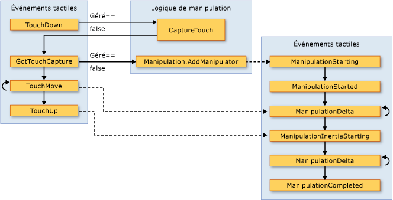

# Vue d'ensemble des entrées
 Le sous-système [!INCLUDE[TLA#tla_winclient](../../../../includes/tlasharptla-winclient-md.md)] fournit une puissante [!INCLUDE[TLA#tla_api](../../../../includes/tlasharptla-api-md.md)] pour obtenir une entrée à partir de différents périphériques, notamment la souris, le clavier, le stylet et l’entrée tactile. Cette rubrique décrit les services fournis par [!INCLUDE[TLA2#tla_winclient](../../../../includes/tla2sharptla-winclient-md.md)] et explique l’architecture des systèmes d’entrée.  
  
  
   
## API d’entrée  
 L’entrée principale [!INCLUDE[TLA2#tla_api](../../../../includes/tla2sharptla-api-md.md)] exposition se trouve sur les classes d’élément de base : <xref:System.Windows.UIElement>, <xref:System.Windows.ContentElement>, <xref:System.Windows.FrameworkElement>, et <xref:System.Windows.FrameworkContentElement>.  Pour plus d’informations sur les éléments de base, consultez [Vue d’ensemble des éléments de base](../../../../docs/framework/wpf/advanced/base-elements-overview.md).  Ces classes fournissent la fonctionnalité pour les événements d’entrée associés aux appuis sur les boutons, aux boutons de la souris, à la roulette de la souris, au déplacement de la souris, à la gestion du focus et à la capture de la souris, entre autres. En plaçant l’[!INCLUDE[TLA2#tla_api](../../../../includes/tla2sharptla-api-md.md)] d’entrée sur les éléments de base, plutôt qu’en traitant tous les événements d’entrée en tant que service, l’architecture d’entrée permet aux événements d’entrée d’avoir comme source un objet particulier dans l’interface utilisateur, et de prendre en charge un schéma de routage d’événements dans lequel plusieurs éléments peuvent gérer un événement d’entrée. De nombreux événements d’entrée sont associés à une paire d’événements.  Par exemple, la clé à l’événement d’arrêt est associée le <xref:System.Windows.Input.Keyboard.KeyDown> et <xref:System.Windows.Input.Keyboard.PreviewKeyDown> les événements.  La différence entre ces événements réside dans la façon dont ils sont acheminés vers l’élément cible.  Les événements Preview parcourent l’arborescence d’éléments de l’élément racine vers l’élément cible.  Les événements de propagation se propagent de l’élément cible vers l’élément racine.  Le routage d’événements dans [!INCLUDE[TLA2#tla_winclient](../../../../includes/tla2sharptla-winclient-md.md)] est discuté plus en détail plus loin dans cet article et dans la rubrique [Vue d’ensemble des événements routés](../../../../docs/framework/wpf/advanced/routed-events-overview.md).  
  
### Classes de souris et de clavier  
 En plus de l’entrée [!INCLUDE[TLA2#tla_api](../../../../includes/tla2sharptla-api-md.md)] sur les classes d’élément de base, le <xref:System.Windows.Input.Keyboard> classe et <xref:System.Windows.Input.Mouse> fournissent des classes supplémentaires [!INCLUDE[TLA2#tla_api](../../../../includes/tla2sharptla-api-md.md)] pour travailler avec l’entrée clavier et souris.  
  
 Exemples d’entrée [!INCLUDE[TLA2#tla_api](../../../../includes/tla2sharptla-api-md.md)] sur la <xref:System.Windows.Input.Keyboard> classe sont le <xref:System.Windows.Input.Keyboard.Modifiers%2A> propriété, qui retourne le <xref:System.Windows.Input.ModifierKeys> actuellement enfoncé et le <xref:System.Windows.Input.Keyboard.IsKeyDown%2A> (méthode), qui détermine si une clé spécifiée est utilisée.  
  
 L’exemple suivant utilise le <xref:System.Windows.Input.Keyboard.GetKeyStates%2A> pour déterminer si un <xref:System.Windows.Input.Key> est enfoncé.  
  
 [!code-csharp[keyargssnippetsample#KeyEventArgsKeyBoardGetKeyStates](../../../../samples/snippets/csharp/VS_Snippets_Wpf/KeyArgsSnippetSample/CSharp/Window1.xaml.cs#keyeventargskeyboardgetkeystates)]
 [!code-vb[keyargssnippetsample#KeyEventArgsKeyBoardGetKeyStates](../../../../samples/snippets/visualbasic/VS_Snippets_Wpf/KeyArgsSnippetSample/visualbasic/window1.xaml.vb#keyeventargskeyboardgetkeystates)]  
  
 Exemples d’entrée [!INCLUDE[TLA2#tla_api](../../../../includes/tla2sharptla-api-md.md)] sur la <xref:System.Windows.Input.Mouse> classe sont <xref:System.Windows.Input.Mouse.MiddleButton%2A>, qui obtient l’état du bouton central de la souris, et <xref:System.Windows.Input.Mouse.DirectlyOver%2A>, qui obtient l’élément, le pointeur de la souris se trouve.  
  
 L’exemple suivant détermine si le <xref:System.Windows.Input.Mouse.LeftButton%2A> sur la souris se trouve dans le <xref:System.Windows.Input.MouseButtonState.Pressed> état.  
  
 [!code-csharp[mouserelatedsnippets#MouseRelatedSnippetsGetLeftButtonMouse](../../../../samples/snippets/csharp/VS_Snippets_Wpf/MouseRelatedSnippets/CSharp/Window1.xaml.cs#mouserelatedsnippetsgetleftbuttonmouse)]
 [!code-vb[mouserelatedsnippets#MouseRelatedSnippetsGetLeftButtonMouse](../../../../samples/snippets/visualbasic/VS_Snippets_Wpf/MouseRelatedSnippets/visualbasic/window1.xaml.vb#mouserelatedsnippetsgetleftbuttonmouse)]  
  
 Le <xref:System.Windows.Input.Mouse> et <xref:System.Windows.Input.Keyboard> classes sont traités plus en détail tout au long de cette vue d’ensemble.  
  
### Entrée du stylet  
 [!INCLUDE[TLA2#tla_winclient](../../../../includes/tla2sharptla-winclient-md.md)]prend en charge la <xref:System.Windows.Input.Stylus>.  Le <xref:System.Windows.Input.Stylus> est une entrée de stylet rendue populaire par le [!INCLUDE[TLA#tla_tpc](../../../../includes/tlasharptla-tpc-md.md)].  Les applications [!INCLUDE[TLA2#tla_winclient](../../../../includes/tla2sharptla-winclient-md.md)] peuvent traiter le stylet comme une souris à l’aide de l’[!INCLUDE[TLA2#tla_api](../../../../includes/tla2sharptla-api-md.md)] de souris, mais [!INCLUDE[TLA2#tla_winclient](../../../../includes/tla2sharptla-winclient-md.md)] expose également une abstraction du stylet qui utilise un modèle semblable au clavier et à la souris.  Toutes les [!INCLUDE[TLA2#tla_api#plural](../../../../includes/tla2sharptla-apisharpplural-md.md)] liées au stylet contiennent le mot « Stylus ».  
  
 Étant donné que le stylet peut agir comme une souris, les applications qui prennent uniquement en charge l’entrée de la souris peuvent quand même bénéficier automatiquement d’un certain niveau de prise en charge du stylet. Quand le stylet est utilisé de cette manière, l’application a la possibilité de gérer l’événement de stylet approprié, et elle gère ensuite l’événement de souris correspondant. En outre, les services de niveau supérieur tels que l’entrée d’encre sont également disponibles grâce à l’abstraction du stylet.  Pour plus d’informations sur l’encre comme entrée, consultez [Débuter avec l’encre](../../../../docs/framework/wpf/advanced/getting-started-with-ink.md).  
  
   
## Routage d’événements  
 Un <xref:System.Windows.FrameworkElement> peut contenir d’autres éléments en tant qu’éléments enfants dans son modèle de contenu, formant ainsi une arborescence d’éléments.  Dans [!INCLUDE[TLA2#tla_winclient](../../../../includes/tla2sharptla-winclient-md.md)], l’élément parent peut participer à l’entrée dirigée vers ses éléments enfants ou à d’autres descendants en gérant les événements. Ceci est particulièrement utile pour la création de contrôles à partir de contrôles plus petits, un processus appelé « composition de contrôle » ou simplement « composition ». Pour plus d’informations sur les arborescences d’éléments et sur les relations entre les arborescences d’éléments et les itinéraires des événements, consultez [Arborescences dans WPF](../../../../docs/framework/wpf/advanced/trees-in-wpf.md).  
  
 Le routage d’événements est le processus qui consiste à transférer des événements à plusieurs éléments, afin qu’un objet ou un élément sur l’itinéraire puisse choisir de fournir une réponse significative (par l’intermédiaire de la gestion) à un événement ayant pu avoir comme source un autre élément.  Les événements routés utilisent l’un des trois mécanismes de routage suivants : direct, par propagation et par tunneling.  Avec le routage direct, l’élément source est le seul élément notifié, et l’événement n’est pas acheminé vers d’autres éléments. Toutefois, l’événement routé directement offre des fonctions supplémentaires qui sont uniquement présentes pour les événements routés, par opposition aux événements [!INCLUDE[TLA2#tla_clr](../../../../includes/tla2sharptla-clr-md.md)] standard. La propagation remonte l’arborescence d’éléments en notifiant d’abord l’élément à l’origine de l’événement, puis l’élément parent, et ainsi de suite.  Le tunneling commence à la racine de l’arborescence d’éléments puis descend, en finissant à l’élément source d’origine.  Pour plus d’informations sur les événements routés, consultez [Vue d’ensemble des événements routés](../../../../docs/framework/wpf/advanced/routed-events-overview.md).  
  
 Les événements d’entrée [!INCLUDE[TLA2#tla_winclient](../../../../includes/tla2sharptla-winclient-md.md)] existent généralement par paires, constituées d’un événement de tunneling et d’un événement de propagation.  Les événements de tunneling se distinguent des événements de propagation par le préfixe « Preview ».  Par exemple, <xref:System.Windows.Input.Mouse.PreviewMouseMove> est la version de tunneling d’un événement de déplacement de la souris et <xref:System.Windows.Input.Mouse.MouseMove> est la version de propagation de cet événement. Cet appariement d’événements est une convention implémentée au niveau de l’élément. Ce n’est pas une fonctionnalité inhérente au système d’événements [!INCLUDE[TLA2#tla_winclient](../../../../includes/tla2sharptla-winclient-md.md)]. Pour plus d’informations, consultez la section Événements d’entrée WPF dans [Vue d’ensemble des événements routés](../../../../docs/framework/wpf/advanced/routed-events-overview.md).  
  
   
## Gestion des événements d’entrée  
 Pour recevoir une entrée sur un élément, un gestionnaire d’événements doit être associé à cet événement particulier.  Dans [!INCLUDE[TLA2#tla_xaml](../../../../includes/tla2sharptla-xaml-md.md)], c’est simple : vous référencez le nom de l’événement en tant qu’attribut de l’élément qui écoute cet événement.  Ensuite, vous affectez comme valeur de l’attribut le nom du gestionnaire d’événements que vous définissez, en fonction d’un délégué.  Le gestionnaire d’événements doit être écrit en code (par exemple [!INCLUDE[TLA#tla_cshrp](../../../../includes/tlasharptla-cshrp-md.md)]) et peut être inclus dans un fichier code-behind.  
  
 Les événements de clavier se produisent quand le système d’exploitation signale des actions de touches qui ont lieu pendant que le focus clavier se trouve sur un élément. Les événements de souris et de stylet appartiennent chacun à deux catégories : les événements qui signalent des changements de la position du pointeur par rapport à l’élément, et les événements qui signalent des changements d’état des boutons du périphérique.  
  
### Exemple d’événement d’entrée de clavier  
 L’exemple suivant détecte un appui sur la touche de direction gauche.  A <xref:System.Windows.Controls.StackPanel> est créé qui a un <xref:System.Windows.Controls.Button>.  Un gestionnaire d’événements pour écouter les pression sur la touche flèche gauche est attachée à la <xref:System.Windows.Controls.Button> instance.  
  
 La première section de l’exemple crée le <xref:System.Windows.Controls.StackPanel> et <xref:System.Windows.Controls.Button> et joint le Gestionnaire d’événements pour le <xref:System.Windows.UIElement.KeyDown>.  
  
 [!code-xaml[InputOvw#Input_OvwKeyboardExampleXAML](../../../../samples/snippets/csharp/VS_Snippets_Wpf/InputOvw/CSharp/Page1.xaml#input_ovwkeyboardexamplexaml)]  
  
 [!code-csharp[InputOvw#Input_OvwKeyboardExampleUICodeBehind](../../../../samples/snippets/csharp/VS_Snippets_Wpf/InputOvw/CSharp/Page1.xaml.cs#input_ovwkeyboardexampleuicodebehind)]
 [!code-vb[InputOvw#Input_OvwKeyboardExampleUICodeBehind](../../../../samples/snippets/visualbasic/VS_Snippets_Wpf/InputOvw/VisualBasic/Page1.xaml.vb#input_ovwkeyboardexampleuicodebehind)]  
  
 La deuxième section est écrite en code et définit le gestionnaire d’événements.  Lorsque la touche de direction gauche est activée et le <xref:System.Windows.Controls.Button> a le focus clavier, le gestionnaire s’exécute et le <xref:System.Windows.Controls.Control.Background%2A> couleur de la <xref:System.Windows.Controls.Button> est modifiée.  Si la touche est enfoncée, mais il n’est pas la clé de la flèche vers la gauche, le <xref:System.Windows.Controls.Control.Background%2A> couleur de la <xref:System.Windows.Controls.Button> revient à la couleur de début.  
  
 [!code-csharp[InputOvw#Input_OvwKeyboardExampleHandlerCodeBehind](../../../../samples/snippets/csharp/VS_Snippets_Wpf/InputOvw/CSharp/Page1.xaml.cs#input_ovwkeyboardexamplehandlercodebehind)]
 [!code-vb[InputOvw#Input_OvwKeyboardExampleHandlerCodeBehind](../../../../samples/snippets/visualbasic/VS_Snippets_Wpf/InputOvw/VisualBasic/Page1.xaml.vb#input_ovwkeyboardexamplehandlercodebehind)]  
  
### Exemple d’événement d’entrée de souris  
 Dans l’exemple suivant, la <xref:System.Windows.Controls.Control.Background%2A> couleur d’un <xref:System.Windows.Controls.Button> est modifiée lorsque le pointeur de la souris entre dans le <xref:System.Windows.Controls.Button>.  Le <xref:System.Windows.Controls.Control.Background%2A> couleur est restaurée lorsque la souris quitte le <xref:System.Windows.Controls.Button>.  
  
 La première section de l’exemple crée le <xref:System.Windows.Controls.StackPanel> et <xref:System.Windows.Controls.Button> contrôler et attache les gestionnaires d’événements pour le <xref:System.Windows.UIElement.MouseEnter> et <xref:System.Windows.UIElement.MouseLeave> événements à la <xref:System.Windows.Controls.Button>.  
  
 [!code-xaml[InputOvw#Input_OvwMouseExampleXAML](../../../../samples/snippets/csharp/VS_Snippets_Wpf/InputOvw/CSharp/Page1.xaml#input_ovwmouseexamplexaml)]  
  
 [!code-csharp[InputOvw#Input_OvwMouseExampleUICodeBehind](../../../../samples/snippets/csharp/VS_Snippets_Wpf/InputOvw/CSharp/Page1.xaml.cs#input_ovwmouseexampleuicodebehind)]
 [!code-vb[InputOvw#Input_OvwMouseExampleUICodeBehind](../../../../samples/snippets/visualbasic/VS_Snippets_Wpf/InputOvw/VisualBasic/Page1.xaml.vb#input_ovwmouseexampleuicodebehind)]  
  
 La deuxième section est écrite en code et définit le gestionnaire d’événements.  Lorsque la souris entre dans le <xref:System.Windows.Controls.Button>, le <xref:System.Windows.Controls.Control.Background%2A> couleur de la <xref:System.Windows.Controls.Button> est remplacée par <xref:System.Windows.Media.Brushes.SlateGray%2A>.  Lorsque la souris quitte le <xref:System.Windows.Controls.Button>, le <xref:System.Windows.Controls.Control.Background%2A> couleur de la <xref:System.Windows.Controls.Button> revient à <xref:System.Windows.Media.Brushes.AliceBlue%2A>.  
  
 [!code-csharp[InputOvw#Input_OvwMouseExampleEneterHandler](../../../../samples/snippets/csharp/VS_Snippets_Wpf/InputOvw/CSharp/Page1.xaml.cs#input_ovwmouseexampleeneterhandler)]
 [!code-vb[InputOvw#Input_OvwMouseExampleEneterHandler](../../../../samples/snippets/visualbasic/VS_Snippets_Wpf/InputOvw/VisualBasic/Page1.xaml.vb#input_ovwmouseexampleeneterhandler)]  
  
 [!code-csharp[InputOvw#Input_OvwMouseExampleLeaveHandler](../../../../samples/snippets/csharp/VS_Snippets_Wpf/InputOvw/CSharp/Page1.xaml.cs#input_ovwmouseexampleleavehandler)]
 [!code-vb[InputOvw#Input_OvwMouseExampleLeaveHandler](../../../../samples/snippets/visualbasic/VS_Snippets_Wpf/InputOvw/VisualBasic/Page1.xaml.vb#input_ovwmouseexampleleavehandler)]  
  
   
## Entrée de texte  
 Le <xref:System.Windows.ContentElement.TextInput> événement vous permet d’écouter pour l’entrée de texte d’une manière indépendante du périphérique. Le clavier est le principal moyen d’entrer du texte, mais la voix, l’écriture manuscrite et d’autres périphériques d’entrée peuvent aussi générer du texte.  
  
 Pour l’entrée au clavier, [!INCLUDE[TLA2#tla_winclient](../../../../includes/tla2sharptla-winclient-md.md)] envoie d’abord approprié <xref:System.Windows.ContentElement.KeyDown> / <xref:System.Windows.ContentElement.KeyUp> événements. Si ces événements ne sont pas gérés et la clé est textuelle plutôt que (une clé de contrôle telles que les flèches de direction) ou les touches de fonction, un <xref:System.Windows.ContentElement.TextInput> événement est déclenché.  Il n’est pas toujours un mappage simple entre <xref:System.Windows.ContentElement.KeyDown> / <xref:System.Windows.ContentElement.KeyUp> et <xref:System.Windows.ContentElement.TextInput> événements, car plusieurs séquences de touches peuvent générer un caractère unique de l’entrée de texte et de séquences de touches uniques peuvent générer plusieurs caractères chaînes.  Ceci est particulièrement valable pour des langues telles que le chinois, le japonais et le coréen, qui utilisent des [!INCLUDE[TLA#tla_ime#plural](../../../../includes/tlasharptla-imesharpplural-md.md)] pour générer les milliers de caractères possibles dans leurs alphabets correspondants.  
  
 Lorsque [!INCLUDE[TLA2#tla_winclient](../../../../includes/tla2sharptla-winclient-md.md)] envoie un <xref:System.Windows.ContentElement.KeyUp> / <xref:System.Windows.ContentElement.KeyDown> événement, <xref:System.Windows.Input.KeyEventArgs.Key%2A> a la valeur <xref:System.Windows.Input.Key.System?displayProperty=nameWithType> si les séquences de touches peuvent faire partie d’un <xref:System.Windows.ContentElement.TextInput> événement (si ALT + S est utilisé, par exemple). Cela permet au code dans un <xref:System.Windows.ContentElement.KeyDown> Gestionnaire d’événements pour rechercher les <xref:System.Windows.Input.Key.System?displayProperty=nameWithType> et, s’il trouve, quitter le traitement du Gestionnaire de relief par la suite <xref:System.Windows.ContentElement.TextInput> événement. Dans ce cas, les différentes propriétés de la <xref:System.Windows.Input.TextCompositionEventArgs> argument peut être utilisé pour déterminer les séquences de touches d’origine. De même, si un [!INCLUDE[TLA2#tla_ime](../../../../includes/tla2sharptla-ime-md.md)] est actif, <xref:System.Windows.Input.Key> a la valeur <xref:System.Windows.Input.Key.ImeProcessed?displayProperty=nameWithType>, et <xref:System.Windows.Input.KeyEventArgs.ImeProcessedKey%2A> donne la séquence ou les séquences de touches d’origine.  
  
 L’exemple suivant définit un gestionnaire pour le <xref:System.Windows.Controls.Primitives.ButtonBase.Click> événement et un gestionnaire pour le <xref:System.Windows.UIElement.KeyDown> événement.  
  
 Le premier segment de code ou de balisage crée l’interface utilisateur.  
  
 [!code-xaml[InputOvw#Input_OvwTextInputXAML](../../../../samples/snippets/csharp/VS_Snippets_Wpf/InputOvw/CSharp/Page1.xaml#input_ovwtextinputxaml)]  
  
 [!code-csharp[InputOvw#Input_OvwTextInputUICodeBehind](../../../../samples/snippets/csharp/VS_Snippets_Wpf/InputOvw/CSharp/Page1.xaml.cs#input_ovwtextinputuicodebehind)]
 [!code-vb[InputOvw#Input_OvwTextInputUICodeBehind](../../../../samples/snippets/visualbasic/VS_Snippets_Wpf/InputOvw/VisualBasic/Page1.xaml.vb#input_ovwtextinputuicodebehind)]  
  
 Le deuxième segment de code contient les gestionnaires d’événements.  
  
 [!code-csharp[InputOvw#Input_OvwTextInputHandlersCodeBehind](../../../../samples/snippets/csharp/VS_Snippets_Wpf/InputOvw/CSharp/Page1.xaml.cs#input_ovwtextinputhandlerscodebehind)]
 [!code-vb[InputOvw#Input_OvwTextInputHandlersCodeBehind](../../../../samples/snippets/visualbasic/VS_Snippets_Wpf/InputOvw/VisualBasic/Page1.xaml.vb#input_ovwtextinputhandlerscodebehind)]  
  
 Étant donné que les événements d’entrée propagent l’itinéraire d’événement, le <xref:System.Windows.Controls.StackPanel> reçoit l’entrée, quelle que soit l’élément qui a le focus clavier. Le <xref:System.Windows.Controls.TextBox> contrôle est notifié en premier et le `OnTextInputKeyDown` gestionnaire est appelé uniquement si le <xref:System.Windows.Controls.TextBox> n’a pas géré l’entrée. Si le <xref:System.Windows.UIElement.PreviewKeyDown> événement est utilisé à la place de la <xref:System.Windows.UIElement.KeyDown> événement, le `OnTextInputKeyDown` gestionnaire est appelé en premier.  
  
 Dans cet exemple, la logique de gestion est écrite deux fois : une fois pour Ctrl+O et une autre fois pour l’événement de clic du bouton. Vous pouvez simplifier cela en utilisant des commandes, au lieu de traiter les événements d’entrée directement.  Les commandes sont traitées dans cet article et dans [Vue d’ensemble des commandes](../../../../docs/framework/wpf/advanced/commanding-overview.md).  
  
   
## Entrée tactile et manipulation  
 Du nouveau matériel et une nouvelle API dans le système d’exploitation Windows 7 permettent aux applications de recevoir une entrée à partir de plusieurs entrées tactiles simultanément. [!INCLUDE[TLA2#tla_winclient](../../../../includes/tla2sharptla-winclient-md.md)] permet aux applications de détecter et de répondre aux entrées tactiles d’une manière similaire à d’autres types d’entrée, tels que la souris ou le clavier, en déclenchant des événements quand les entrées tactiles se produisent.  
  
 [!INCLUDE[TLA2#tla_winclient](../../../../includes/tla2sharptla-winclient-md.md)] expose deux types d’événements quand des entrées tactiles se produisent : les événements tactiles et les événements de manipulation. Les événements tactiles fournissent des données brutes relatives à chaque doigt sur un écran tactile et à leur déplacement. Les événements de manipulation interprètent l’entrée comme des actions spécifiques. Les deux types d’événements sont présentés dans cette section.  
  
### Prérequis  
 Vous devez disposer des composants suivants pour développer une application qui répond aux entrées tactiles.  
  
-   [!INCLUDE[vs_dev10_ext](../../../../includes/vs-dev10-ext-md.md)].  
  
-   Windows 7.  
  
-   Un appareil, tel qu’un écran tactile, qui prend en charge l’interface tactile Windows.  
  
### Terminologie  
 Les termes suivants sont utilisés quand l’entrée tactile est abordée.  
  
-   L’**entrée tactile** est un type d’entrée d’utilisateur reconnu par Windows 7. En règle générale, l’entrée tactile est démarrée en plaçant des doigts sur un écran tactile. Notez que les appareils tels que les pavés tactiles qui sont courants sur les ordinateurs portables ne gèrent pas l’entrée tactile si l’appareil ne fait que convertir la position et le déplacement du doigt en tant qu’entrée de la souris.  
  
-   L’**interaction tactile multipoint** est une entrée tactile qui se produit simultanément à partir de plusieurs points. Windows 7 et [!INCLUDE[TLA2#tla_winclient](../../../../includes/tla2sharptla-winclient-md.md)] prennent en charge l’interaction tactile multipoint. Chaque fois que l’entrée tactile est abordée dans la documentation [!INCLUDE[TLA2#tla_winclient](../../../../includes/tla2sharptla-winclient-md.md)], les concepts s’appliquent à l’interaction tactile multipoint.  
  
-   Une **manipulation** se produit quand l’entrée tactile est interprétée comme une action physique appliquée à un objet. Dans [!INCLUDE[TLA2#tla_winclient](../../../../includes/tla2sharptla-winclient-md.md)], les événements de manipulation interprètent l’entrée comme une manipulation de translation, d’expansion ou de rotation.  
  
-   Un `touch device` représente un périphérique qui génère une entrée tactile, par exemple un seul doigt sur un écran tactile.  
  
### Contrôles qui répondent aux entrées tactiles  
 Les contrôles suivants peuvent être parcourus en faisant glisser un doigt sur le contrôle, s’il a du contenu qui défile hors de l’affichage.  
  
-   <xref:System.Windows.Controls.ComboBox>  
  
-   <xref:System.Windows.Controls.ContextMenu>  
  
-   <xref:System.Windows.Controls.DataGrid>  
  
-   <xref:System.Windows.Controls.ListBox>  
  
-   <xref:System.Windows.Controls.ListView>  
  
-   <xref:System.Windows.Controls.MenuItem>  
  
-   <xref:System.Windows.Controls.TextBox>  
  
-   <xref:System.Windows.Controls.ToolBar>  
  
-   <xref:System.Windows.Controls.TreeView>  
  
 Le <xref:System.Windows.Controls.ScrollViewer> définit la <xref:System.Windows.Controls.ScrollViewer.PanningMode%2A?displayProperty=nameWithType> jointe de propriété qui vous permet de spécifier si le mouvement panoramique tactile est activé horizontalement, verticalement ou aucun. Le <xref:System.Windows.Controls.ScrollViewer.PanningDeceleration%2A?displayProperty=nameWithType> propriété spécifie la rapidité avec laquelle le défilement ralentit lorsque l’utilisateur lève le doigt de l’écran tactile. Le <xref:System.Windows.Controls.ScrollViewer.PanningRatio%2A?displayProperty=nameWithType> propriété attachée Spécifie le ratio de décalage pour traduire le décalage de manipulation de défilement.  
  
### Événements tactiles  
 Les classes de base, <xref:System.Windows.UIElement>, <xref:System.Windows.UIElement3D>, et <xref:System.Windows.ContentElement>, définissent les événements auxquels vous pouvez vous abonner pour que votre application réponde aux entrées tactiles. Les événements tactiles sont utiles quand votre application interprète l’entrée tactile comme autre chose que la manipulation d’un objet. Par exemple, une application qui permet à un utilisateur de dessiner avec un ou plusieurs doigts doit s’abonner aux événements tactiles.  
  
 Les trois classes définissent les événements suivants, qui se comportent de la même manière quelle que soit la classe de définition.  
  
-   <xref:System.Windows.UIElement.TouchDown>  
  
-   <xref:System.Windows.UIElement.TouchMove>  
  
-   <xref:System.Windows.UIElement.TouchUp>  
  
-   <xref:System.Windows.UIElement.TouchEnter>  
  
-   <xref:System.Windows.UIElement.TouchLeave>  
  
-   <xref:System.Windows.UIElement.PreviewTouchDown>  
  
-   <xref:System.Windows.UIElement.PreviewTouchMove>  
  
-   <xref:System.Windows.UIElement.PreviewTouchUp>  
  
-   <xref:System.Windows.UIElement.GotTouchCapture>  
  
-   <xref:System.Windows.UIElement.LostTouchCapture>  
  
 Comme les événements de clavier et de souris, les événements tactiles sont des événements routés. Les événements qui commencent par `Preview` sont des événements de tunneling et les événements qui commencent par `Touch` sont des événements de propagation. Pour plus d’informations sur les événements routés, consultez [Vue d’ensemble des événements routés](../../../../docs/framework/wpf/advanced/routed-events-overview.md). Lorsque vous gérez ces événements, vous pouvez obtenir la position de l’entrée, par rapport à n’importe quel élément, en appelant le <xref:System.Windows.Input.TouchEventArgs.GetTouchPoint%2A> ou <xref:System.Windows.Input.TouchEventArgs.GetIntermediateTouchPoints%2A> (méthode).  
  
 Pour comprendre l’interaction entre les événements tactiles, considérez le scénario où un utilisateur place un doigt sur un élément, déplace son doigt dans l’élément, puis retire son doigt de l’élément. L’illustration suivante montre l’exécution des événements de propagation (les événements de tunneling sont omis par souci de simplicité).  
  
 ![La séquence des événements tactiles. ] (../../../../docs/framework/wpf/advanced/media/ndp-touchevents.png "NDP_TouchEvents")  
Événements tactiles  
  
 La liste suivante décrit la séquence des événements dans l’illustration précédente.  
  
1.  Le <xref:System.Windows.UIElement.TouchEnter> événement se produit une fois lorsque l’utilisateur place un doigt sur l’élément.  
  
2.  Le <xref:System.Windows.UIElement.TouchDown> événement se produit une seule fois.  
  
3.  Le <xref:System.Windows.UIElement.TouchMove> événement se produit plusieurs fois lorsque l’utilisateur déplace le doigt dans l’élément.  
  
4.  Le <xref:System.Windows.UIElement.TouchUp> événement se produit une fois lorsque l’utilisateur lève le doigt de l’élément.  
  
5.  Le <xref:System.Windows.UIElement.TouchLeave> événement se produit une seule fois.  
  
 Quand plusieurs doigts sont utilisés, les événements se produisent pour chaque doigt.  
  
### Événements de manipulation  
 Pour les cas où une application permet à un utilisateur de manipuler un objet, la <xref:System.Windows.UIElement> classe définit les événements de manipulation. Contrairement aux événements tactiles qui signalent simplement la position de l’entrée tactile, les événements de manipulation signalent comment l’entrée peut être interprétée. Il existe trois types de manipulations : translation, expansion et rotation. La liste suivante décrit comment appeler les trois types de manipulations.  
  
-   Placez un doigt sur un objet et déplacez le doigt sur l’écran tactile pour appeler une manipulation de translation. Cela déplace habituellement l’objet.  
  
-   Placez deux doigts sur un objet et rapprochez ou éloignez les doigts pour appeler une manipulation d’expansion. Cela redimensionne habituellement l’objet.  
  
-   Placez deux doigts sur un objet et faites pivoter les doigts pour appeler une manipulation de rotation. Cela fait pivoter habituellement l’objet.  
  
 Plusieurs types de manipulations peuvent se produire simultanément.  
  
 Quand vous faites en sorte que des objets répondent à des manipulations, vous pouvez donner à l’objet une apparence d’inertie. Ainsi, vos objets peuvent simuler le monde physique. Par exemple, quand vous poussez un livre sur une table, si vous le poussez assez fort il continuera à se déplacer une fois que vous l’aurez relâché. [!INCLUDE[TLA2#tla_winclient](../../../../includes/tla2sharptla-winclient-md.md)] vous permet de simuler ce comportement en déclenchant des événements de manipulation après que les doigts de l’utilisateur ont relâché l’objet.  
  
 Pour plus d’informations sur la façon de créer une application qui permet à l’utilisateur de déplacer, de redimensionner et de faire pivoter un objet, consultez [Procédure pas à pas : création de votre première application Touch](../../../../docs/framework/wpf/advanced/walkthrough-creating-your-first-touch-application.md).  
  
 Le <xref:System.Windows.UIElement> définit les événements de manipulation suivants.  
  
-   <xref:System.Windows.UIElement.ManipulationStarting>  
  
-   <xref:System.Windows.UIElement.ManipulationStarted>  
  
-   <xref:System.Windows.UIElement.ManipulationDelta>  
  
-   <xref:System.Windows.UIElement.ManipulationInertiaStarting>  
  
-   <xref:System.Windows.UIElement.ManipulationCompleted>  
  
-   <xref:System.Windows.UIElement.ManipulationBoundaryFeedback>  
  
 Par défaut, un <xref:System.Windows.UIElement> ne reçoit pas ces événements de manipulation. Pour recevoir des événements de manipulation sur un <xref:System.Windows.UIElement>, définissez <xref:System.Windows.UIElement.IsManipulationEnabled%2A?displayProperty=nameWithType> à `true`.  
  
#### Chemin d’exécution des événements de manipulation  
 Imaginez un scénario où un utilisateur « jette » un objet. L’utilisateur place un doigt sur l’objet, déplace son doigt sur l’écran tactile sur une courte distance, puis retire son doigt pendant qu’il le déplace. La conséquence est que l’objet se déplace sous le doigt de l’utilisateur et continue à se déplacer après que l’utilisateur a retiré son doigt.  
  
 L’illustration suivante montre le chemin d’exécution des événements de manipulation et des informations importantes sur chaque événement.  
  
 ![La séquence d’événements de manipulation. ] (../../../../docs/framework/wpf/advanced/media/ndp-manipulationevents.png "NDP_ManipulationEvents")  
Événements de manipulation  
  
 La liste suivante décrit la séquence des événements dans l’illustration précédente.  
  
1.  Le <xref:System.Windows.UIElement.ManipulationStarting> événement se produit lorsque l’utilisateur place un doigt sur l’objet. Entre autres choses, cet événement vous permet de définir le <xref:System.Windows.Input.ManipulationStartingEventArgs.ManipulationContainer%2A> propriété. Dans les événements suivants, la position de la manipulation sera relative à la <xref:System.Windows.Input.ManipulationStartingEventArgs.ManipulationContainer%2A>. Dans les événements autres que <xref:System.Windows.UIElement.ManipulationStarting>, cette propriété est en lecture seule, donc la <xref:System.Windows.UIElement.ManipulationStarting> événement est la seule fois où vous pouvez définir cette propriété.  
  
2.  Le <xref:System.Windows.UIElement.ManipulationStarted> événement se produit ensuite. Cet événement signale l’origine de la manipulation.  
  
3.  Le <xref:System.Windows.UIElement.ManipulationDelta> événement se produit plusieurs fois au déplacement des doigts d’un utilisateur sur un écran tactile. Le <xref:System.Windows.Input.ManipulationDeltaEventArgs.DeltaManipulation%2A> propriété de la <xref:System.Windows.Input.ManipulationDeltaEventArgs> classe signale si la manipulation est interprétée en tant que le déplacement, l’expansion ou de translation. C’est là que vous effectuez la plupart du travail de manipulation d’un objet.  
  
4.  Le <xref:System.Windows.UIElement.ManipulationInertiaStarting> événement se produit lorsque les doigts de l’utilisateur perdent le contact avec l’objet. Cet événement vous permet de spécifier la décélération des manipulations pendant l’inertie, ceci afin que votre objet puisse émuler différents attributs ou espaces physiques si vous le souhaitez. Par exemple, supposez que votre application a deux objets qui représentent des éléments dans le monde physique, et que l’un d’eux a un poids supérieur à l’autre. Vous pouvez faire en sorte que l’objet le plus lourd décélère plus rapidement que l’objet plus léger.  
  
5.  Le <xref:System.Windows.UIElement.ManipulationDelta> événement se produit plusieurs fois comme l’inertie se produit. Notez que cet événement se produit quand les doigts de l’utilisateur se déplacent sur l’écran tactile et quand [!INCLUDE[TLA2#tla_winclient](../../../../includes/tla2sharptla-winclient-md.md)] simule l’inertie. En d’autres termes, <xref:System.Windows.UIElement.ManipulationDelta> se produit avant et après le <xref:System.Windows.UIElement.ManipulationInertiaStarting> événement. Le <xref:System.Windows.Input.ManipulationDeltaEventArgs.IsInertial%2A?displayProperty=nameWithType> propriété rapports si le <xref:System.Windows.UIElement.ManipulationDelta> événement se produit pendant l’inertie, afin de pouvoir vérifier cette propriété et exécuter des actions différentes, en fonction de sa valeur.  
  
6.  Le <xref:System.Windows.UIElement.ManipulationCompleted> événement se produit lorsque la manipulation et une inertie quelconque se termine. Autrement dit, après que tous les <xref:System.Windows.UIElement.ManipulationDelta> événements se produisent, le <xref:System.Windows.UIElement.ManipulationCompleted> événement se produit pour signaler que la manipulation est terminée.  
  
 Le <xref:System.Windows.UIElement> définit également la <xref:System.Windows.UIElement.ManipulationBoundaryFeedback> événement. Cet événement se produit lorsque le <xref:System.Windows.Input.ManipulationDeltaEventArgs.ReportBoundaryFeedback%2A> méthode est appelée le <xref:System.Windows.UIElement.ManipulationDelta> événement. Le <xref:System.Windows.UIElement.ManipulationBoundaryFeedback> événement permet aux applications ou aux composants de fournir une rétroaction visuelle lorsqu’un objet atteint une limite. Par exemple, le <xref:System.Windows.Window> classe gère le <xref:System.Windows.UIElement.ManipulationBoundaryFeedback> événement à la fenêtre légèrement déplacer lors de son bord.  
  
 Vous pouvez annuler la manipulation en appelant le <xref:System.Windows.Input.ManipulationStartingEventArgs.Cancel%2A> méthode sur les arguments d’événement dans tout événement de manipulation à l’exception <xref:System.Windows.UIElement.ManipulationBoundaryFeedback> événement. Lorsque vous appelez <xref:System.Windows.Input.ManipulationStartingEventArgs.Cancel%2A>, les événements de manipulation ne sont plus déclenchés et les événements de souris se produisent pour les fonctions tactiles. Le tableau suivant décrit la relation entre le moment où la manipulation est annulée et les événements de souris qui se produisent.  
  
|Événement pendant lequel Cancel est appelé|Événements de souris qui se produisent pour une entrée qui a déjà eu lieu|  
|----------------------------------------|-----------------------------------------------------------------|  
|<xref:System.Windows.UIElement.ManipulationStarting> et <xref:System.Windows.UIElement.ManipulationStarted>|Événements mouse down.|  
|<xref:System.Windows.UIElement.ManipulationDelta>|Événements mouse down et mouse move.|  
|<xref:System.Windows.UIElement.ManipulationInertiaStarting> et <xref:System.Windows.UIElement.ManipulationCompleted>|Événements mouse down, mouse move et mouse up.|  
  
 Notez que si vous appelez <xref:System.Windows.Input.ManipulationStartingEventArgs.Cancel%2A> lorsque la manipulation est en inertie, la méthode retourne `false` et l’entrée ne déclenche pas d’événements de souris.  
  
### Relation entre les événements tactiles et les événements de manipulation  
 Un <xref:System.Windows.UIElement> peut toujours recevoir des événements tactiles. Lorsque le <xref:System.Windows.UIElement.IsManipulationEnabled%2A> est définie sur `true`, un <xref:System.Windows.UIElement> peut recevoir des événements tactiles et de manipulation.  Si le <xref:System.Windows.UIElement.TouchDown> événement n’est pas géré (autrement dit, le <xref:System.Windows.RoutedEventArgs.Handled%2A> propriété est `false`), la logique de manipulation capture l’entrée tactile à l’élément et génère les événements de manipulation. Si le <xref:System.Windows.RoutedEventArgs.Handled%2A> est définie sur `true` dans le <xref:System.Windows.UIElement.TouchDown> événement, la logique de manipulation ne génère pas d’événements de manipulation. L’illustration suivante montre la relation entre les événements tactiles et les événements de manipulation.  
  
   
Événements tactiles et de manipulation  
  
 La liste suivante décrit la relation entre les événements tactiles et les événements de manipulation indiquée dans l’illustration précédente.  
  
-   Lorsque le premier périphérique tactile génère un <xref:System.Windows.UIElement.TouchDown> événement sur un <xref:System.Windows.UIElement>, la logique de manipulation appelle la <xref:System.Windows.UIElement.CaptureTouch%2A> (méthode), ce qui génère le <xref:System.Windows.UIElement.GotTouchCapture> événement.  
  
-   Lorsque le <xref:System.Windows.UIElement.GotTouchCapture> se produit, la logique de manipulation appelle la <xref:System.Windows.Input.Manipulation.AddManipulator%2A?displayProperty=nameWithType> (méthode), ce qui génère le <xref:System.Windows.UIElement.ManipulationStarting> événement.  
  
-   Lorsque le <xref:System.Windows.UIElement.TouchMove> les événements se produisent, la logique de manipulation génère le <xref:System.Windows.UIElement.ManipulationDelta> événements qui se produisent avant la <xref:System.Windows.UIElement.ManipulationInertiaStarting> événement.  
  
-   Lorsque le dernier périphérique tactile appliqué à l’élément déclenche le <xref:System.Windows.UIElement.TouchUp> événement, la logique de manipulation génère le <xref:System.Windows.UIElement.ManipulationInertiaStarting> événement.  
  
   
## Focus  
 Il existe deux concepts principaux associés au focus dans [!INCLUDE[TLA2#tla_winclient](../../../../includes/tla2sharptla-winclient-md.md)] : le focus clavier et le focus logique.  
  
### Focus clavier  
 Le focus clavier fait référence à l’élément qui reçoit actuellement l’entrée au clavier.  Un seul élément de l’ordinateur peut avoir le focus clavier.  Dans [!INCLUDE[TLA2#tla_winclient](../../../../includes/tla2sharptla-winclient-md.md)], l’élément qui a le focus clavier possède <xref:System.Windows.IInputElement.IsKeyboardFocused%2A> la valeur `true`.  La méthode statique <xref:System.Windows.Input.Keyboard> méthode <xref:System.Windows.Input.Keyboard.FocusedElement%2A> retourne l’élément qui a le focus clavier.  
  
 Le focus clavier peut être obtenu par tabulation à un élément ou en cliquant sur la souris sur certains éléments, comme un <xref:System.Windows.Controls.TextBox>.  Le focus clavier peuvent également être obtenu par programmation à l’aide de la <xref:System.Windows.Input.Keyboard.Focus%2A> méthode sur la <xref:System.Windows.Input.Keyboard> classe.  <xref:System.Windows.Input.Keyboard.Focus%2A>tente de donner le focus clavier de l’élément spécifié.  L’élément retourné par <xref:System.Windows.Input.Keyboard.Focus%2A> est l’élément qui a le focus clavier.  
  
 Dans l’ordre d’un élément obtenir le focus clavier le <xref:System.Windows.UIElement.Focusable%2A> propriété et la <xref:System.Windows.UIElement.IsVisible%2A> propriétés doivent être définies sur **true**.  Certaines classes, telles que <xref:System.Windows.Controls.Panel>, ont <xref:System.Windows.UIElement.Focusable%2A> la valeur `false` par défaut ; par conséquent, vous devrez peut-être définir cette propriété sur `true` si vous souhaitez que cet élément puisse obtenir le focus.  
  
 L’exemple suivant utilise <xref:System.Windows.Input.Keyboard.Focus%2A> pour définir le focus clavier sur un <xref:System.Windows.Controls.Button>.  Est recommandé de définir le focus initial dans une application dans le <xref:System.Windows.FrameworkElement.Loaded> Gestionnaire d’événements.  
  
 [!code-csharp[focussample#FocusSampleSetFocus](../../../../samples/snippets/csharp/VS_Snippets_Wpf/FocusSample/CSharp/Window1.xaml.cs#focussamplesetfocus)]
 [!code-vb[focussample#FocusSampleSetFocus](../../../../samples/snippets/visualbasic/VS_Snippets_Wpf/FocusSample/visualbasic/window1.xaml.vb#focussamplesetfocus)]  
  
 Pour plus d’informations sur le focus clavier, consultez [Vue d’ensemble du focus](../../../../docs/framework/wpf/advanced/focus-overview.md).  
  
### Focus logique  
 Le focus logique fait référence à la <xref:System.Windows.Input.FocusManager.FocusedElement%2A?displayProperty=nameWithType> dans une portée de focus.  Plusieurs éléments d’une application peuvent avoir le focus logique, mais un seul élément peut avoir le focus logique dans une portée de focus donnée.  
  
 Une portée de focus est un élément conteneur qui effectue le suivi de le <xref:System.Windows.Input.FocusManager.FocusedElement%2A> dans son étendue.  Quand le focus quitte une portée de focus, l’élément ayant le focus perd le focus clavier, mais conserve le focus logique.  Quand le focus revient dans la portée de focus, l’élément ayant le focus obtient le focus clavier.  Cela permet au focus clavier de changer entre des portées de focus, et de s’assurer que l’élément ayant le focus dans la portée de focus demeure l’élément ayant le focus quand le focus revient.  
  
 Un élément peut être transformé en une portée de focus dans [!INCLUDE[TLA#tla_xaml](../../../../includes/tlasharptla-xaml-md.md)] en définissant le <xref:System.Windows.Input.FocusManager> propriété attachée <xref:System.Windows.Input.FocusManager.IsFocusScope%2A> à `true`, ou dans le code en définissant la propriété jointe à l’aide de la <xref:System.Windows.Input.FocusManager.SetIsFocusScope%2A> (méthode).  
  
 L’exemple suivant effectue une <xref:System.Windows.Controls.StackPanel> dans une portée de focus en définissant le <xref:System.Windows.Input.FocusManager.IsFocusScope%2A> propriété jointe.  
  
 [!code-xaml[MarkupSnippets#MarkupIsFocusScopeXAML](../../../../samples/snippets/csharp/VS_Snippets_Wpf/MarkupSnippets/CSharp/Window1.xaml#markupisfocusscopexaml)]  
  
 [!code-csharp[FocusSnippets#FocusSetIsFocusScope](../../../../samples/snippets/csharp/VS_Snippets_Wpf/FocusSnippets/CSharp/Window1.xaml.cs#focussetisfocusscope)]
 [!code-vb[FocusSnippets#FocusSetIsFocusScope](../../../../samples/snippets/visualbasic/VS_Snippets_Wpf/FocusSnippets/visualbasic/window1.xaml.vb#focussetisfocusscope)]  
  
 Classes de [!INCLUDE[TLA2#tla_winclient](../../../../includes/tla2sharptla-winclient-md.md)] ayant des portées de focus par défaut sont <xref:System.Windows.Window>, <xref:System.Windows.Controls.Menu>, <xref:System.Windows.Controls.ToolBar>, et <xref:System.Windows.Controls.ContextMenu>.  
  
 Un élément qui a le focus clavier a également le focus logique pour la portée de focus que laquelle il appartient. Par conséquent, si le focus sur un élément avec la <xref:System.Windows.Input.Keyboard.Focus%2A> méthode sur la <xref:System.Windows.Input.Keyboard> classe ou les classes d’élément de base tente de donner le focus clavier et le focus logique.  
  
 Pour déterminer l’élément ayant le focus dans une portée de focus, utilisez <xref:System.Windows.Input.FocusManager.GetFocusedElement%2A>. Pour modifier l’élément ayant le focus d’une portée de focus, utilisez <xref:System.Windows.Input.FocusManager.SetFocusedElement%2A>.  
  
 Pour plus d’informations sur le focus logique, consultez [Vue d’ensemble du focus](../../../../docs/framework/wpf/advanced/focus-overview.md).  
  
   
## Position de la souris  
 L’[!INCLUDE[TLA2#tla_api](../../../../includes/tla2sharptla-api-md.md)] d’entrée [!INCLUDE[TLA2#tla_winclient](../../../../includes/tla2sharptla-winclient-md.md)] fournit des informations utiles sur les espaces de coordonnées.  Par exemple, la coordonnée `(0,0)` est la coordonnée de l’angle supérieur gauche, mais de quel élément dans l’arborescence ? L’élément qui est la cible d’entrée ? L’élément auquel vous avez attaché votre gestionnaire d’événements ? Ou un autre élément ? Pour éviter toute confusion, l’[!INCLUDE[TLA2#tla_api](../../../../includes/tla2sharptla-api-md.md)] d’entrée [!INCLUDE[TLA2#tla_winclient](../../../../includes/tla2sharptla-winclient-md.md)] vous impose de spécifier votre cadre de référence quand vous travaillez avec des coordonnées obtenues par l’intermédiaire de la souris. Le <xref:System.Windows.Input.Mouse.GetPosition%2A> méthode retourne les coordonnées du pointeur de la souris par rapport à l’élément spécifié.  
  
   
## Capture de la souris  
 Les souris ont une caractéristique modale spécifique appelée capture de la souris. La capture de la souris sert à tenir à jour un état d’entrée transitionnel quand une opération de glisser-déplacer commence, afin que les autres opérations impliquant la position nominale à l’écran du pointeur de la souris ne se produisent pas nécessairement. Pendant l’opération glisser, l’utilisateur ne peut pas cliquer sans annuler le glisser-déplacer, ce qui rend la plupart des indices de survol de souris inappropriés pendant que la capture de la souris est détenue par l’origine de l’opération glisser. Le système d’entrée expose des [!INCLUDE[TLA2#tla_api#plural](../../../../includes/tla2sharptla-apisharpplural-md.md)] qui peuvent déterminer l’état de capture de la souris, ainsi que des [!INCLUDE[TLA2#tla_api#plural](../../../../includes/tla2sharptla-apisharpplural-md.md)] qui peuvent forcer la capture de la souris à un élément spécifique, ou effacer l’état de capture de la souris. Pour plus d’informations sur les opérations de glisser-déplacer, consultez [Vue d’ensemble du glisser-déplacer](../../../../docs/framework/wpf/advanced/drag-and-drop-overview.md).  
  
   
## Commandes  
 Les commandes permettent de gérer les entrées à un niveau plus sémantique que l’entrée de périphérique.  Les commandes sont des directives simples, telles que `Cut`, `Copy`, `Paste` ou `Open`.  Elles sont utiles pour centraliser la logique de commande.  La même commande peut être accessible depuis un <xref:System.Windows.Controls.Menu>, dans un <xref:System.Windows.Controls.ToolBar>, ou via un raccourci clavier. Les commandes fournissent également un mécanisme permettant de désactiver des contrôles quand la commande devient indisponible.  
  
 <xref:System.Windows.Input.RoutedCommand>est la [!INCLUDE[TLA2#tla_winclient](../../../../includes/tla2sharptla-winclient-md.md)] implémentation de <xref:System.Windows.Input.ICommand>.  Lorsqu’un <xref:System.Windows.Input.RoutedCommand> est exécutée, un <xref:System.Windows.Input.CommandManager.PreviewExecuted> et un <xref:System.Windows.Input.CommandManager.Executed> déclenché sur la cible de commande, le tunnel et le se propagent dans l’arborescence d’éléments comme tout autre entrée.  Si une cible de commande n’est pas définie, l’élément qui a le focus clavier est la cible de commande.  La logique qui exécute la commande est attachée à un <xref:System.Windows.Input.CommandBinding>.  Quand une <xref:System.Windows.Input.CommandManager.Executed> événement atteint un <xref:System.Windows.Input.CommandBinding> pour une commande spécifique, le <xref:System.Windows.Input.ExecutedRoutedEventHandler> sur le <xref:System.Windows.Input.CommandBinding> est appelée.  Ce gestionnaire exécute l’action de la commande.  
  
 Pour plus d’informations sur l’exécution des commandes, consultez [Vue d’ensemble des commandes](../../../../docs/framework/wpf/advanced/commanding-overview.md).  
  
 [!INCLUDE[TLA2#tla_winclient](../../../../includes/tla2sharptla-winclient-md.md)]Fournit une bibliothèque de commandes communes qui se compose de <xref:System.Windows.Input.ApplicationCommands>, <xref:System.Windows.Input.MediaCommands>, <xref:System.Windows.Input.ComponentCommands>, <xref:System.Windows.Input.NavigationCommands>, et <xref:System.Windows.Documents.EditingCommands>, ou vous pouvez définir les vôtres.  
  
 L’exemple suivant montre comment configurer un <xref:System.Windows.Controls.MenuItem> afin que lorsque l’utilisateur clique dessus, il appelle la <xref:System.Windows.Input.ApplicationCommands.Paste%2A> commande sur le <xref:System.Windows.Controls.TextBox>, en supposant que le <xref:System.Windows.Controls.TextBox> a le focus clavier.  
  
 [!code-xaml[CommandingOverviewSnippets#CommandingOverviewSimpleCommand](../../../../samples/snippets/csharp/VS_Snippets_Wpf/CommandingOverviewSnippets/CSharp/Window1.xaml#commandingoverviewsimplecommand)]  
  
 [!code-csharp[CommandingOverviewSnippets#CommandingOverviewCommandTargetCodeBehind](../../../../samples/snippets/csharp/VS_Snippets_Wpf/CommandingOverviewSnippets/CSharp/Window1.xaml.cs#commandingoverviewcommandtargetcodebehind)]
 [!code-vb[CommandingOverviewSnippets#CommandingOverviewCommandTargetCodeBehind](../../../../samples/snippets/visualbasic/VS_Snippets_Wpf/CommandingOverviewSnippets/visualbasic/window1.xaml.vb#commandingoverviewcommandtargetcodebehind)]  
  
 Pour plus d’informations sur les commandes dans [!INCLUDE[TLA2#tla_winclient](../../../../includes/tla2sharptla-winclient-md.md)], consultez [Vue d’ensemble des commandes](../../../../docs/framework/wpf/advanced/commanding-overview.md).  
  
   
## Le système d’entrée et les éléments de base  
 Entrée d’événements tels que les événements attachés définis par le <xref:System.Windows.Input.Mouse>, <xref:System.Windows.Input.Keyboard>, et <xref:System.Windows.Input.Stylus> classes sont déclenchés par le système d’entrée et injectés dans une position spécifique dans le modèle objet en fonction de l’arborescence visuelle au moment de l’exécution du test d’atteinte.  
  
 Chacun des événements qui <xref:System.Windows.Input.Mouse>, <xref:System.Windows.Input.Keyboard>, et <xref:System.Windows.Input.Stylus> définir comme un événement attaché est a également été ré-exposé par les classes d’élément de base <xref:System.Windows.UIElement> et <xref:System.Windows.ContentElement> comme un événement routé. Les événements routés d’éléments de base sont générés par des classes gérant l’événement attaché d’origine et réutilisant les données d’événements.  
  
 Quand l’événement d’entrée est associé à un élément source particulier par l’intermédiaire de son implémentation d’événement d’entrée d’élément de base, il peut être routé le long du reste d’un itinéraire d’événement qui est basé sur une combinaison d’objets des arborescences visuelle et logique, et être géré par le code de l’application.  En règle générale, il est plus pratique de gérer ces événements d’entrée associés au périphérique à l’aide des événements routés sur <xref:System.Windows.UIElement> et <xref:System.Windows.ContentElement>, car vous pouvez utiliser la syntaxe événements plus intuitive gestionnaire à la fois dans [!INCLUDE[TLA2#tla_xaml](../../../../includes/tla2sharptla-xaml-md.md)] et dans le code. Vous pouvez choisir à la place de gérer l’événement attaché qui a démarré le processus, mais vous serez alors confronté à plusieurs problèmes : l’événement attaché pourra être marqué comme géré par la gestion de classe d’élément de base, et vous devrez utiliser des méthodes d’accesseur plutôt qu’une réelle syntaxe d’événement pour attacher des gestionnaires pour les événements attachés.  
  
   
## Étapes suivantes  
 Vous connaissez maintenant plusieurs techniques pour gérer les entrées dans [!INCLUDE[TLA2#tla_winclient](../../../../includes/tla2sharptla-winclient-md.md)].  Vous devriez également mieux comprendre les différents types d’événements d’entrée et les mécanismes d’événements routés utilisés par [!INCLUDE[TLA2#tla_winclient](../../../../includes/tla2sharptla-winclient-md.md)].  
  
 Si vous souhaitez en savoir plus, il existe des ressources supplémentaires qui expliquent les éléments de framework [!INCLUDE[TLA2#tla_winclient](../../../../includes/tla2sharptla-winclient-md.md)] et le routage d’événement plus en détail. Pour plus d’informations, consultez les vues d’ensemble suivantes : [Vue d’ensemble des commandes](../../../../docs/framework/wpf/advanced/commanding-overview.md), [Vue d’ensemble du focus](../../../../docs/framework/wpf/advanced/focus-overview.md), [Vue d’ensemble des éléments de base](../../../../docs/framework/wpf/advanced/base-elements-overview.md), [Arborescences dans WPF](../../../../docs/framework/wpf/advanced/trees-in-wpf.md) et [Vue d’ensemble des événements routés](../../../../docs/framework/wpf/advanced/routed-events-overview.md).  
  
## Voir aussi  
 [Vue d’ensemble du focus](../../../../docs/framework/wpf/advanced/focus-overview.md)  
 [Vue d’ensemble des commandes](../../../../docs/framework/wpf/advanced/commanding-overview.md)  
 [Vue d’ensemble des événements routés](../../../../docs/framework/wpf/advanced/routed-events-overview.md)  
 [Vue d’ensemble des éléments de base](../../../../docs/framework/wpf/advanced/base-elements-overview.md)  
 [Propriétés](../../../../docs/framework/wpf/advanced/properties-wpf.md)
