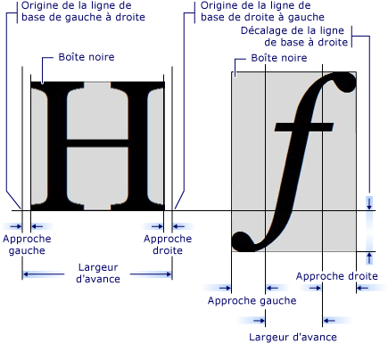

# Introduction à l'objet GlyphRun et à l'élément Glyphs
Cette rubrique décrit la <xref:System.Windows.Media.GlyphRun> objet et le <xref:System.Windows.Documents.Glyphs> élément.  
  
  
   
## Introduction à GlyphRun  
 [!INCLUDE[TLA#tla_winclient](../../../../includes/tlasharptla-winclient-md.md)]Fournit la prise en charge de texte avancée, y compris la balise de niveau glyphe avec accès direct au <xref:System.Windows.Documents.Glyphs> pour les clients qui souhaitent intercepter et rendre le texte persistant après la mise en forme. Ces fonctionnalités assurent une prise en charge critique pour les différentes spécifications de rendu de texte propres à chacun des scénarios suivants.  
  
1.  Affichage à l’écran de documents de format fixe.  
  
2.  Scénarios d’impression.  
  
    -   [!INCLUDE[TLA#tla_xaml](../../../../includes/tlasharptla-xaml-md.md)] comme langage d’imprimante.  
  
    -   [!INCLUDE[TLA#tla_mxdw](../../../../includes/tlasharptla-mxdw-md.md)].  
  
    -   Pilotes d’imprimante précédents, sortie d’applications [!INCLUDE[TLA#tla_win32](../../../../includes/tlasharptla-win32-md.md)] au format fixe.  
  
    -   Format de spouleur d’impression.  
  
3.  Représentation sous forme de document de format fixe, notamment des clients pour des versions précédentes de [!INCLUDE[TLA#tla_mswin](../../../../includes/tlasharptla-mswin-md.md)] et autres appareils informatiques.  
  
> [!NOTE]
>  <xref:System.Windows.Documents.Glyphs>et <xref:System.Windows.Media.GlyphRun> sont conçus pour la présentation du document de format fixe et les scénarios d’impression. [!INCLUDE[TLA#tla_winclient](../../../../includes/tlasharptla-winclient-md.md)]fournit plusieurs éléments pour la présentation générale et [!INCLUDE[TLA#tla_ui](../../../../includes/tlasharptla-ui-md.md)] scénarios tels que <xref:System.Windows.Controls.Label> et <xref:System.Windows.Controls.TextBlock>. Pour plus d’informations sur les scénarios de disposition et d’[!INCLUDE[TLA2#tla_ui](../../../../includes/tla2sharptla-ui-md.md)], consultez [Typographie dans WPF](../../../../docs/framework/wpf/advanced/typography-in-wpf.md).  
  
   
## Objet GlyphRun  
 Le <xref:System.Windows.Media.GlyphRun> objet représente une séquence de glyphes à partir d’un type unique d’une police unique à une taille unique et avec un style de rendu unique.  
  
 <xref:System.Windows.Media.GlyphRun>inclut les détails de la police telles que glyphe <xref:System.Windows.Documents.Glyphs.Indices%2A> et les positions de chaque glyphe. Il inclut également l’original [!INCLUDE[TLA#tla_unicode](../../../../includes/tlasharptla-unicode-md.md)] l’exécution a été générée à partir des informations de mappage offset de mémoire tampon de caractères de glyphe et les indicateurs par caractère et par glyphe de points de code.  
  
 <xref:System.Windows.Media.GlyphRun>a un niveau supérieur correspondant <xref:System.Windows.FrameworkElement>, <xref:System.Windows.Documents.Glyphs>. <xref:System.Windows.Documents.Glyphs>peut être utilisé dans l’arborescence d’éléments et dans [!INCLUDE[TLA2#tla_xaml](../../../../includes/tla2sharptla-xaml-md.md)] balisage utilisé pour représenter <xref:System.Windows.Media.GlyphRun> sortie.  
  
   
## Élément Glyphs  
 Le <xref:System.Windows.Documents.Glyphs> élément représente la sortie d’un <xref:System.Windows.Media.GlyphRun> dans [!INCLUDE[TLA2#tla_xaml](../../../../includes/tla2sharptla-xaml-md.md)]. La syntaxe de balisage suivante est utilisée pour décrire le <xref:System.Windows.Documents.Glyphs> élément.  
  
 [!code-xaml[GlyphsOvwSample1#1](../../../../samples/snippets/csharp/VS_Snippets_Wpf/GlyphsOvwSample1/CS/default.xaml#1)]  
  
 Les définitions de propriétés suivantes correspondent aux quatre premiers attributs de l’exemple de balisage.  
  
|Propriété|Description|  
|--------------|-----------------|  
|<xref:System.Windows.Documents.Glyphs.FontUri%2A>|Spécifie un identificateur de ressource : nom de fichier, Web [!INCLUDE[TLA#tla_uri](../../../../includes/tlasharptla-uri-md.md)], ou référence à une ressource dans l’application .exe ou le conteneur.|  
|<xref:System.Windows.Documents.Glyphs.FontRenderingEmSize%2A>|Spécifie la taille de police en unités de surface de dessin (la valeur par défaut est 0,96 pouce).|  
|<xref:System.Windows.Documents.Glyphs.StyleSimulations%2A>|Spécifie les indicateurs des styles gras et italique.|  
|<xref:System.Windows.Documents.Glyphs.BidiLevel%2A>|Spécifie le niveau de disposition bidirectionnelle. Les valeurs paires et nulles impliquent une disposition de gauche à droite ; les valeurs impaires impliquent une disposition de droite à gauche.|  
  
   
### Propriété Indices  
 Le <xref:System.Windows.Documents.Glyphs.Indices%2A> propriété est une chaîne de spécifications de glyphe. Quand une séquence de glyphes forme un groupement unique, la spécification du premier glyphe du groupement est précédée d’une spécification qui indique le nombre de glyphes et de points de code qui se combinent pour former le regroupement. Le <xref:System.Windows.Documents.Glyphs.Indices%2A> propriété recueille dans une chaîne les propriétés suivantes.  
  
-   Index de glyphe  
  
-   Largeurs d’avance de glyphe  
  
-   Combinaison de vecteurs d’attachement de glyphe  
  
-   Mappage de groupement des points de code aux glyphes  
  
-   Indicateurs de glyphe  
  
 Chaque spécification de glyphe présente la forme suivante.  
  
 `[GlyphIndex][,[Advance][,[uOffset][,[vOffset][,[Flags]]]]]`  
  
   
## Métriques de glyphe  
 Chaque glyphe définit des métriques qui spécifient comment il aligne avec d’autres <xref:System.Windows.Documents.Glyphs>. Le graphique suivant définit les diverses qualités typographiques de deux glyphes de caractères différents.  
  
   
  
   
## Balisage Glyphs  
 L’exemple de code suivant montre comment utiliser diverses propriétés de la <xref:System.Windows.Documents.Glyphs> élément [!INCLUDE[TLA2#tla_xaml](../../../../includes/tla2sharptla-xaml-md.md)].  
  
 [!code-xaml[GlyphsOvwSamp2#1](../../../../samples/snippets/csharp/VS_Snippets_Wpf/GlyphsOvwSamp2/CS/default.xaml#1)]  
  
## Voir aussi  
 [Typographie dans WPF](../../../../docs/framework/wpf/advanced/typography-in-wpf.md)  
 [Documents dans WPF](../../../../docs/framework/wpf/advanced/documents-in-wpf.md)  
 [Text](../../../../docs/framework/wpf/advanced/optimizing-performance-text.md)
