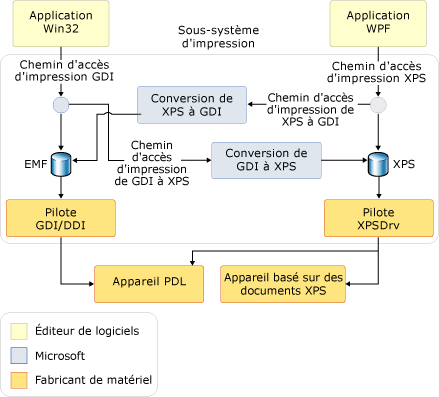

# Vue d'ensemble de l'impression
Avec [!INCLUDE[TLA#tla_winfx](../../../../includes/tlasharptla-winfx-md.md)], les développeurs d'applications utilisant [!INCLUDE[TLA#tla_wpf](../../../../includes/tlasharptla-wpf-md.md)] disposent d'un nouvel ensemble étoffé d'[!INCLUDE[TLA#tla_api#plural](../../../../includes/tlasharptla-apisharpplural-md.md)] d'impression et de gestion du système d'impression. Avec [!INCLUDE[TLA#tla_winvista](../../../../includes/tlasharptla-winvista-md.md)], certaines de ces améliorations du système d'impression sont aussi accessibles aux développeurs créant des applications [!INCLUDE[TLA#tla_winforms](../../../../includes/tlasharptla-winforms-md.md)] et à ceux utilisant du code non managé. Le nouveau format de fichier [!INCLUDE[TLA#tla_xps](../../../../includes/tlasharptla-xps-md.md)] et le chemin d'impression [!INCLUDE[TLA2#tla_xps](../../../../includes/tla2sharptla-xps-md.md)] sont au cœur de cette nouvelle fonctionnalité.  
  
 Cette rubrique contient les sections suivantes.  
  
   
## À propos de XPS  
 [!INCLUDE[TLA2#tla_metro](../../../../includes/tla2sharptla-metro-md.md)] est un format de document électronique, un format de fichier de mise en file d'attente (spool) et un langage de description de page. Il s'agit d'un format de document ouvert qui utilise [!INCLUDE[TLA#tla_xml](../../../../includes/tlasharptla-xml-md.md)], [!INCLUDE[TLA#tla_opc](../../../../includes/tlasharptla-opc-md.md)] et d'autres normes du secteur pour créer des documents multiplateformes. [!INCLUDE[TLA2#tla_metro](../../../../includes/tla2sharptla-metro-md.md)] simplifie le processus par lequel documents numériques sont créés, partagés, imprimés, affichés et archivés. Pour plus d'informations sur [!INCLUDE[TLA2#tla_metro](../../../../includes/tla2sharptla-metro-md.md)], consultez le [site web XPS](http://www.microsoft.com/xps).  
  
 Plusieurs techniques permettant d'imprimer du contenu [!INCLUDE[TLA2#tla_metro](../../../../includes/tla2sharptla-metro-md.md)] en utilisant [!INCLUDE[TLA2#tla_wpf](../../../../includes/tla2sharptla-wpf-md.md)] sont décrites dans [Imprimer par programmation des fichiers XPS](../../../../docs/framework/wpf/advanced/how-to-programmatically-print-xps-files.md). Il peut vous être utile de vous reporter à ces exemples pendant l'examen du contenu de cette rubrique. (Les développeurs de code non managé doivent consultez la documentation relative à la [(fonction) MXDC_ESCAPE](https://msdn.microsoft.com/library/windows/desktop/dd162739.aspx). Les développeurs [!INCLUDE[TLA2#tla_winforms#initcap](../../../../includes/tla2sharptla-winformssharpinitcap-md.md)] doivent utiliser l'[!INCLUDE[TLA2#tla_api](../../../../includes/tla2sharptla-api-md.md)] de l'espace de noms <xref:System.Drawing.Printing> qui ne prend pas en charge le chemin d'impression [!INCLUDE[TLA2#tla_xps](../../../../includes/tla2sharptla-xps-md.md)] complet, mais prend en charge un chemin d'impression hybride de GDI vers XPS. Consultez **Architecture du chemin d'impression** ci-dessous.)  
  
   
## Chemin d'impression XPS  
 Le chemin d'impression [!INCLUDE[TLA#tla_metro](../../../../includes/tlasharptla-metro-md.md)] est une nouvelle fonctionnalité [!INCLUDE[TLA#tla_mswin](../../../../includes/tlasharptla-mswin-md.md)] qui redéfinit la façon dont l'impression est gérée dans les applications [!INCLUDE[TLA2#tla_mswin](../../../../includes/tla2sharptla-mswin-md.md)]. Comme [!INCLUDE[TLA2#tla_xps](../../../../includes/tla2sharptla-xps-md.md)] peut remplacer un langage de présentation de document (comme RTF), un format de spouleur d'impression (comme WMF) et un langage de description de page (comme PCL ou Postscript), le nouveau chemin d'impression conserve le format [!INCLUDE[TLA2#tla_metro](../../../../includes/tla2sharptla-metro-md.md)] de la publication de l'application jusqu'au traitement final dans le pilote ou le périphérique d'impression.  
  
 Le chemin d'impression [!INCLUDE[TLA2#tla_metro](../../../../includes/tla2sharptla-metro-md.md)] repose sur le modèle de pilote d'imprimante [!INCLUDE[TLA2#tla_metro](../../../../includes/tla2sharptla-metro-md.md)] (XPSDrv), qui offre aux développeurs plusieurs avantages tels que l'impression [!INCLUDE[TLA#tla_wys](../../../../includes/tlasharptla-wys-md.md)], une meilleure prise en charge de la couleur et des performances d'impression nettement améliorées. (Pour plus d’informations sur XPSDrv, consultez [Windows Driver Kit (WDK)](https://msdn.microsoft.com/library/windows/hardware/ff557573.aspx).)  
  
 Le fonctionnement du spouleur d'impression pour les documents [!INCLUDE[TLA2#tla_metro](../../../../includes/tla2sharptla-metro-md.md)] est pour l'essentiel le même que dans les versions précédentes de [!INCLUDE[TLA2#tla_mswin](../../../../includes/tla2sharptla-mswin-md.md)]. Cependant, il a été amélioré pour prendre en charge le chemin d'impression [!INCLUDE[TLA2#tla_metro](../../../../includes/tla2sharptla-metro-md.md)], en plus du chemin d'impression existante [!INCLUDE[TLA2#tla_gdi](../../../../includes/tla2sharptla-gdi-md.md)]. Le nouveau chemin d'impression utilise un fichier spool [!INCLUDE[TLA2#tla_metro](../../../../includes/tla2sharptla-metro-md.md)] en mode natif. Bien que les pilotes d'imprimantes en mode utilisateur écrits pour les versions antérieures de [!INCLUDE[TLA#tla_mswin](../../../../includes/tlasharptla-mswin-md.md)] continuent de fonctionner, un pilote d'imprimante [!INCLUDE[TLA2#tla_metro](../../../../includes/tla2sharptla-metro-md.md)] (XPSDrv) est nécessaire pour pouvoir utiliser le chemin d'impression [!INCLUDE[TLA2#tla_metro](../../../../includes/tla2sharptla-metro-md.md)].  
  
 Le chemin d'impression [!INCLUDE[TLA2#tla_metro](../../../../includes/tla2sharptla-metro-md.md)] présente des avantages significatifs, à savoir :  
  
-   prise en charge de l'impression [!INCLUDE[TLA2#tla_wys](../../../../includes/tla2sharptla-wys-md.md)] ;  
  
-   prise en charge native de profils de couleurs avancés, qui incluent 32 bits par canal (bpc), CMJN, les couleurs nommées, les encres n et prise en charge native de la transparence et des dégradés ;  
  
-   performances d'impression améliorées pour les applications [!INCLUDE[TLA2#tla_winfx](../../../../includes/tla2sharptla-winfx-md.md)] et [!INCLUDE[TLA#tla_win32](../../../../includes/tlasharptla-win32-md.md)] ;  
  
-   format [!INCLUDE[TLA2#tla_metro](../../../../includes/tla2sharptla-metro-md.md)] conforme aux normes du secteur.  
  
 Pour les scénarios d'impression de base, une [!INCLUDE[TLA2#tla_api](../../../../includes/tla2sharptla-api-md.md)] simple et intuitive est disponible avec un point d'entrée unique pour l'interface utilisateur, la configuration et la soumission de travaux. Pour les scénarios avancés, une prise en charge supplémentaire est ajoutée pour la personnalisation de l'[!INCLUDE[TLA#tla_ui](../../../../includes/tlasharptla-ui-md.md)] (ou pas d'[!INCLUDE[TLA2#tla_ui](../../../../includes/tla2sharptla-ui-md.md)] du tout), l'impression synchrone ou asynchrone et les fonctions d'impression par lots. Les deux options assurent une prise en charge de l'impression en mode confiance totale ou partielle.  
  
 [!INCLUDE[TLA2#tla_metro](../../../../includes/tla2sharptla-metro-md.md)] a été conçu dans l'optique d'offrir une extensibilité. Grâce au framework d’extensibilité, il est possible d’ajouter des fonctionnalités et des fonctions à [!INCLUDE[TLA2#tla_metro](../../../../includes/tla2sharptla-metro-md.md)] de façon modulaire. Les fonctionnalités d'extensibilité sont les suivantes :  
  
-   Schéma d'impression. Le schéma public est mis à jour régulièrement et permet l’extension rapide des fonctions des appareils. (Consultez **PrintTicket et PrintCapabilities** ci-dessous.)  
  
-   Pipeline de filtres extensible. Le pipeline de filtres du pilote d'imprimante [!INCLUDE[TLA2#tla_metro](../../../../includes/tla2sharptla-metro-md.md)] (XPSDrv) a été conçu pour permettre l'impression directe et évolutive de documents [!INCLUDE[TLA2#tla_metro](../../../../includes/tla2sharptla-metro-md.md)]. (Recherche « XPSDrv » dans le [Windows Driver Kit](https://msdn.microsoft.com/library/windows/hardware/ff557573.aspx).)  
  
### Architecture du chemin d'impression  
 Bien que les applications [!INCLUDE[TLA2#tla_win32](../../../../includes/tla2sharptla-win32-md.md)] et [!INCLUDE[TLA2#tla_winfx](../../../../includes/tla2sharptla-winfx-md.md)] prennent en charge [!INCLUDE[TLA2#tla_metro](../../../../includes/tla2sharptla-metro-md.md)], les applications [!INCLUDE[TLA2#tla_win32](../../../../includes/tla2sharptla-win32-md.md)] et [!INCLUDE[TLA2#tla_winforms](../../../../includes/tla2sharptla-winforms-md.md)] utilisent une conversion [!INCLUDE[TLA2#tla_gdi](../../../../includes/tla2sharptla-gdi-md.md)] à [!INCLUDE[TLA2#tla_metro](../../../../includes/tla2sharptla-metro-md.md)] pour créer du contenu au format [!INCLUDE[TLA2#tla_metro](../../../../includes/tla2sharptla-metro-md.md)] pour le pilote d'imprimante [!INCLUDE[TLA2#tla_metro](../../../../includes/tla2sharptla-metro-md.md)] (XPSDrv). Ces applications ne sont pas tenues d'utiliser le chemin d'impression [!INCLUDE[TLA2#tla_metro](../../../../includes/tla2sharptla-metro-md.md)] et peuvent continuer d'utiliser l'impression [!INCLUDE[TLA#tla_emf](../../../../includes/tlasharptla-emf-md.md)] Toutefois, la plupart des fonctionnalités et améliorations de [!INCLUDE[TLA2#tla_metro](../../../../includes/tla2sharptla-metro-md.md)] sont disponibles uniquement pour les applications qui ciblent le chemin d'impression [!INCLUDE[TLA2#tla_metro](../../../../includes/tla2sharptla-metro-md.md)].  
  
 Pour permettre aux applications [!INCLUDE[TLA2#tla_win32](../../../../includes/tla2sharptla-win32-md.md)] et [!INCLUDE[TLA2#tla_winforms](../../../../includes/tla2sharptla-winforms-md.md)] d'utiliser des imprimantes XPSDrv, le pilote d'imprimante [!INCLUDE[TLA2#tla_metro](../../../../includes/tla2sharptla-metro-md.md)] (XPSDrv) prend en charge la conversion du format [!INCLUDE[TLA2#tla_gdi](../../../../includes/tla2sharptla-gdi-md.md)] au format [!INCLUDE[TLA2#tla_metro](../../../../includes/tla2sharptla-metro-md.md)]. Le modèle XPSDrv fournit également un convertisseur du format [!INCLUDE[TLA2#tla_metro](../../../../includes/tla2sharptla-metro-md.md)] au format [!INCLUDE[TLA2#tla_gdi](../../../../includes/tla2sharptla-gdi-md.md)] pour permettre aux applications [!INCLUDE[TLA2#tla_win32](../../../../includes/tla2sharptla-win32-md.md)] d'imprimer des documents [!INCLUDE[TLA2#tla_xps](../../../../includes/tla2sharptla-xps-md.md)]. Pour [!INCLUDE[TLA2#tla_wpf](../../../../includes/tla2sharptla-wpf-md.md)] applications, la conversion de [!INCLUDE[TLA2#tla_metro](../../../../includes/tla2sharptla-metro-md.md)] à [!INCLUDE[TLA2#tla_gdi](../../../../includes/tla2sharptla-gdi-md.md)] format est effectuée automatiquement par le <xref:System.Windows.Xps.XpsDocumentWriter.Write%2A> et <xref:System.Windows.Xps.XpsDocumentWriter.WriteAsync%2A> méthodes de la <xref:System.Windows.Xps.XpsDocumentWriter> chaque fois que la file d’attente d’impression cible de l’opération d’écriture n’a pas de classe un pilote XPSDrv. (Les applications [!INCLUDE[TLA2#tla_winforms#initcap](../../../../includes/tla2sharptla-winformssharpinitcap-md.md)] ne peuvent pas imprimer de documents [!INCLUDE[TLA2#tla_xps](../../../../includes/tla2sharptla-xps-md.md)].)  
  
 L'illustration suivante représente le sous-système d'impression et définit les parties fournies par [!INCLUDE[TLA#tla_ms](../../../../includes/tlasharptla-ms-md.md)] et celles définies par les fournisseurs de matériel et de logiciels.  
  
   
  
### Impression XPS de base  
 [!INCLUDE[TLA2#tla_wpf](../../../../includes/tla2sharptla-wpf-md.md)] définit une [!INCLUDE[TLA#tla_api](../../../../includes/tlasharptla-api-md.md)] de base et avancée. Pour les applications qui n'exigent pas une personnalisation étendue de l'impression ou un accès à l'ensemble complet de fonctionnalités [!INCLUDE[TLA2#tla_metro](../../../../includes/tla2sharptla-metro-md.md)], la prise en charge de l'impression de base est disponible. La prise en charge de l'impression de base est exposé via un contrôle de boîte de dialogue d'impression qui nécessite une configuration minime et présente une [!INCLUDE[TLA2#tla_ui](../../../../includes/tla2sharptla-ui-md.md)] familière. De nombreuses fonctionnalités [!INCLUDE[TLA2#tla_metro](../../../../includes/tla2sharptla-metro-md.md)] sont disponibles en utilisant ce modèle d'impression simplifié.  
  
#### PrintDialog  
 Le contrôle <xref:System.Windows.Controls.PrintDialog?displayProperty=nameWithType> offre un point d'entrée unique pour l'[!INCLUDE[TLA2#tla_ui](../../../../includes/tla2sharptla-ui-md.md)], la configuration et la soumission de travaux [!INCLUDE[TLA2#tla_metro](../../../../includes/tla2sharptla-metro-md.md)]. Pour plus d'informations sur l'instanciation et l'utilisation du contrôle, consultez [Appeler une boîte de dialogue d'impression](../../../../docs/framework/wpf/advanced/how-to-invoke-a-print-dialog.md).  
  
### Impression XPS avancée  
 Pour accéder à l'ensemble complet de fonctionnalités [!INCLUDE[TLA2#tla_metro](../../../../includes/tla2sharptla-metro-md.md)], il convient d'utiliser l'[!INCLUDE[TLA2#tla_api](../../../../includes/tla2sharptla-api-md.md)] d'impression avancée. Plusieurs [!INCLUDE[TLA2#tla_api](../../../../includes/tla2sharptla-api-md.md)] pertinentes sont décrites plus en détail ci-dessous. Pour une liste complète des [!INCLUDE[TLA2#tla_metro](../../../../includes/tla2sharptla-metro-md.md)] d’impression [!INCLUDE[TLA2#tla_api#plural](../../../../includes/tla2sharptla-apisharpplural-md.md)], consultez la <xref:System.Windows.Xps> et <xref:System.Printing> références de l’espace de noms.  
  
#### PrintTicket et PrintCapabilities  
 Le <xref:System.Printing.PrintTicket> et <xref:System.Printing.PrintCapabilities> classes sont le fondement d’avancées [!INCLUDE[TLA2#tla_metro](../../../../includes/tla2sharptla-metro-md.md)] fonctionnalités. Ces deux types d'objets sont des structures [!INCLUDE[TLA#tla_xml](../../../../includes/tlasharptla-xml-md.md)] de fonctionnalités d'impression telles que le classement, l'impression recto verso, l'agrafage, etc. Ces structures sont définies par le schéma d'impression. <xref:System.Printing.PrintTicket> indique à une imprimante comment traiter un travail d'impression. La classe <xref:System.Printing.PrintCapabilities> définit les fonctionnalités d'une imprimante. En interrogeant les fonctionnalités d'une imprimante, un <xref:System.Printing.PrintTicket> peut être créé pour tirer pleinement parti des fonctionnalités prises en charge de l'imprimante. De la même manière, les fonctionnalités non prises en charge peuvent être évitées.  
  
 L'exemple suivant montre comment interroger l'élément <xref:System.Printing.PrintCapabilities> d'une imprimante et créer un <xref:System.Printing.PrintTicket> à l'aide de code.  
  
 [!code-cpp[xpscreate#PrinterCapabilities](../../../../samples/snippets/cpp/VS_Snippets_Wpf/XpsCreate/CPP/XpsCreate.cpp#printercapabilities)]
 [!code-csharp[xpscreate#PrinterCapabilities](../../../../samples/snippets/csharp/VS_Snippets_Wpf/XpsCreate/CSharp/XpsCreate.cs#printercapabilities)]
 [!code-vb[xpscreate#PrinterCapabilities](../../../../samples/snippets/visualbasic/VS_Snippets_Wpf/XpsCreate/visualbasic/xpscreate.vb#printercapabilities)]  
  
#### PrintServer et PrintQueue  
 La classe <xref:System.Printing.PrintServer> représente un serveur d'impression réseau et la classe <xref:System.Printing.PrintQueue> représente une imprimante et la file d'attente des travaux de sortie qui lui est associée. Ensemble, ces [!INCLUDE[TLA2#tla_api#plural](../../../../includes/tla2sharptla-apisharpplural-md.md)] permettent une gestion avancée des travaux d'impression d'un serveur. Un <xref:System.Printing.PrintServer> ou l'une de ses classes dérivées est utilisé pour gérer un <xref:System.Printing.PrintQueue>. La méthode <xref:System.Printing.PrintQueue.AddJob%2A> est utilisée pour insérer un nouveau travail d'impression dans la file d'attente.  
  
 L'exemple suivant montre comment créer un <xref:System.Printing.LocalPrintServer> et comment accéder au <xref:System.Printing.PrintQueue> par défaut associé avec du code.  
  
 [!code-csharp[xpsprint#PrintQueueSnip](../../../../samples/snippets/csharp/VS_Snippets_Wpf/XpsPrint/CSharp/XpsPrintHelper.cs#printqueuesnip)]
 [!code-vb[xpsprint#PrintQueueSnip](../../../../samples/snippets/visualbasic/VS_Snippets_Wpf/XpsPrint/visualbasic/xpsprinthelper.vb#printqueuesnip)]  
  
#### XpsDocumentWriter  
 Un <xref:System.Windows.Xps.XpsDocumentWriter>, avec ses nombreuses méthodes <xref:System.Windows.Xps.XpsDocumentWriter.Write%2A> et <xref:System.Windows.Xps.XpsDocumentWriter.WriteAsync%2A>, permet d'écrire des documents [!INCLUDE[TLA2#tla_metro](../../../../includes/tla2sharptla-metro-md.md)] dans un <xref:System.Printing.PrintQueue>. Par exemple, la méthode <xref:System.Windows.Xps.XpsDocumentWriter.Write%28System.Windows.Documents.FixedPage%2CSystem.Printing.PrintTicket%29> permet de sortir un document [!INCLUDE[TLA2#tla_metro](../../../../includes/tla2sharptla-metro-md.md)] et un <xref:System.Printing.PrintTicket> de manière synchrone. La méthode <xref:System.Windows.Xps.XpsDocumentWriter.WriteAsync%28System.Windows.Documents.FixedDocument%2CSystem.Printing.PrintTicket%29> permet de sortir un document [!INCLUDE[TLA2#tla_metro](../../../../includes/tla2sharptla-metro-md.md)] et un <xref:System.Printing.PrintTicket> de manière asynchrone.  
  
 L'exemple suivant montre comment créer un <xref:System.Windows.Xps.XpsDocumentWriter> avec du code.  
  
 [!code-csharp[XpsPrint#PrintQueueSnip](../../../../samples/snippets/csharp/VS_Snippets_Wpf/XpsPrint/CSharp/XpsPrintHelper.cs#printqueuesnip)]
 [!code-vb[XpsPrint#PrintQueueSnip](../../../../samples/snippets/visualbasic/VS_Snippets_Wpf/XpsPrint/visualbasic/xpsprinthelper.vb#printqueuesnip)]  
  
 Le méthodes <xref:System.Printing.PrintQueue.AddJob%2A> permettent aussi d'imprimer. Consultez [Imprimer des fichiers XPS par programmation](../../../../docs/framework/wpf/advanced/how-to-programmatically-print-xps-files.md). pour plus d'informations.  
  
   
## Chemin d'impression GDI  
 Bien que les applications [!INCLUDE[TLA2#tla_wpf](../../../../includes/tla2sharptla-wpf-md.md)] prennent en charge les chemins d'impression [!INCLUDE[TLA2#tla_metro](../../../../includes/tla2sharptla-metro-md.md)] en mode natif, les applications [!INCLUDE[TLA2#tla_win32](../../../../includes/tla2sharptla-win32-md.md)] et [!INCLUDE[TLA2#tla_winforms](../../../../includes/tla2sharptla-winforms-md.md)] peuvent aussi tirer parti de certaines fonctionnalités [!INCLUDE[TLA2#tla_metro](../../../../includes/tla2sharptla-metro-md.md)]. Le pilote d'imprimante [!INCLUDE[TLA2#tla_metro](../../../../includes/tla2sharptla-metro-md.md)] (XPSDrv) peut convertir une sortie [!INCLUDE[TLA2#tla_gdi](../../../../includes/tla2sharptla-gdi-md.md)] au format [!INCLUDE[TLA2#tla_metro](../../../../includes/tla2sharptla-metro-md.md)]. Pour les scénarios avancés, conversion personnalisée du contenu est pris en charge à l’aide de la [Microsoft XPS Document Converter (MXDC)](https://msdn.microsoft.com/library/windows/desktop/ff686803.aspx). De même, [!INCLUDE[TLA2#tla_wpf](../../../../includes/tla2sharptla-wpf-md.md)] applications génère également à la [!INCLUDE[TLA2#tla_gdi](../../../../includes/tla2sharptla-gdi-md.md)] d’impression en appelant une de la <xref:System.Windows.Xps.XpsDocumentWriter.Write%2A> ou <xref:System.Windows.Xps.XpsDocumentWriter.WriteAsync%2A> méthodes de la <xref:System.Windows.Xps.XpsDocumentWriter> classe et en spécifiant une imprimante en tant que la cible de file d’attente.  

Pour les applications qui n'exigent pas la fonctionnalité ou la prise en charge [!INCLUDE[TLA2#tla_metro](../../../../includes/tla2sharptla-metro-md.md)], le chemin d'impression [!INCLUDE[TLA2#tla_gdi](../../../../includes/tla2sharptla-gdi-md.md)] actif reste inchangé.  
  
-   Pour les documents de référence supplémentaires sur le [!INCLUDE[TLA2#tla_gdi](../../../../includes/tla2sharptla-gdi-md.md)] imprimer le chemin d’accès et les différents [!INCLUDE[TLA2#tla_metro](../../../../includes/tla2sharptla-metro-md.md)] les options de conversion, consultez [Microsoft XPS Document Converter (MXDC)](https://msdn.microsoft.com/library/windows/desktop/ff686803.aspx) et « XPSDrv » dans le [Windows Driver Kit](https://msdn.microsoft.com/library/windows/hardware/ff557573.aspx).  
  
   
## Modèle de pilote XPSDrv  
 Le chemin d'impression [!INCLUDE[TLA2#tla_metro](../../../../includes/tla2sharptla-metro-md.md)] améliore l'efficacité du spouleur en utilisant [!INCLUDE[TLA2#tla_metro](../../../../includes/tla2sharptla-metro-md.md)] comme format spool d'impression natif lors de l'impression vers une imprimante ou un pilote [!INCLUDE[TLA2#tla_metro](../../../../includes/tla2sharptla-metro-md.md)]. Le processus de mise en file d'attente simplifié dispense de la nécessité de générer un fichier spool intermédiaire, tel qu'un fichier de données [!INCLUDE[TLA2#tla_emf](../../../../includes/tla2sharptla-emf-md.md)] avant que le document soit mis en file d'attente. À la faveur de fichiers spool de plus petite taille, le chemin d'impression [!INCLUDE[TLA2#tla_metro](../../../../includes/tla2sharptla-metro-md.md)] peut réduire le trafic réseau et améliorer les performances d'impression.  
  
 [!INCLUDE[TLA2#tla_emf](../../../../includes/tla2sharptla-emf-md.md)] est un format fermé qui représente la sortie de l'application sous la forme d'une série d'appels dans [!INCLUDE[TLA2#tla_gdi](../../../../includes/tla2sharptla-gdi-md.md)] pour le rendu des services. Contrairement à [!INCLUDE[TLA2#tla_emf](../../../../includes/tla2sharptla-emf-md.md)], le format de fichier spool [!INCLUDE[TLA2#tla_metro](../../../../includes/tla2sharptla-metro-md.md)] représente le document réel sans nécessiter d'interprétation supplémentaire lors de sortie vers un pilote d'imprimante [!INCLUDE[TLA2#tla_metro](../../../../includes/tla2sharptla-metro-md.md)] (XPSDrv). Les pilotes peuvent fonctionner directement sur les données dans le format concerné. Ainsi, il n'est plus utile de procéder aux conversions de données et d'espaces de couleurs qu'impose l'utilisation des fichiers [!INCLUDE[TLA2#tla_emf](../../../../includes/tla2sharptla-emf-md.md)] et des pilotes d'imprimante [!INCLUDE[TLA2#tla_gdi](../../../../includes/tla2sharptla-gdi-md.md)].  
  
 Les tailles de fichier de mise en attente sont généralement réduites quand vous utilisez des documents [!INCLUDE[TLA2#tla_metro](../../../../includes/tla2sharptla-metro-md.md)] qui ciblent un pilote d'imprimante [!INCLUDE[TLA2#tla_metro](../../../../includes/tla2sharptla-metro-md.md)] (XPSDrv) par rapport à leurs équivalents [!INCLUDE[TLA2#tla_emf](../../../../includes/tla2sharptla-emf-md.md)], mais il existe des exceptions :  
  
-   Un graphique vectoriel très complexe, superposé en plusieurs couches ou mal écrit peut être plus grand qu'une version bitmap du même graphique.  
  
-   À des fins d'affichage sur écran, les fichiers XPS incorporent des polices de périphérique, ainsi que des polices basées sur ordinateur, alors que les fichiers spool GDI n'incorporent pas de polices de périphérique. Mais les deux types de polices sont des sous-ensembles (voir ci-dessous) et les pilotes d'imprimante peuvent supprimer les polices de périphérique avant de transmettre le fichier à l'imprimante.  
  
 La réduction de la taille des fichiers spool est exécutée via plusieurs mécanismes :  
  
-   **Création de sous-ensembles de polices** : seuls les caractères utilisés dans le document réel sont stockés dans le fichier [!INCLUDE[TLA2#tla_metro](../../../../includes/tla2sharptla-metro-md.md)].  
  
-   **Prise en charge avancée des graphiques** : la prise en charge native des primitives de transparence et de dégradé évite la rastérisation du contenu dans le document [!INCLUDE[TLA2#tla_xps](../../../../includes/tla2sharptla-xps-md.md)].  
  
-   **Identification des ressources communes** : les ressources utilisées plusieurs fois (comme une image qui représente un logo d'entreprise) sont traitées comme des ressources partagées et sont chargées une seule fois.  
  
-   **Compression ZIP** : tous les documents [!INCLUDE[TLA2#tla_metro](../../../../includes/tla2sharptla-metro-md.md)] utilisent la compression ZIP.  
  
## Voir aussi  
 <xref:System.Windows.Controls.PrintDialog>  
 <xref:System.Windows.Xps.XpsDocumentWriter>  
 <xref:System.Windows.Xps.Packaging.XpsDocument>  
 <xref:System.Printing.PrintTicket>  
 <xref:System.Printing.PrintCapabilities>  
 <xref:System.Printing.PrintServer>  
 <xref:System.Printing.PrintQueue>  
 [Rubriques de guide pratique](../../../../docs/framework/wpf/advanced/printing-how-to-topics.md)  
 [Documents dans WPF](../../../../docs/framework/wpf/advanced/documents-in-wpf.md)  
 [XPS](http://www.microsoft.com/xps)  
 [Sérialisation et stockage de documents](../../../../docs/framework/wpf/advanced/document-serialization-and-storage.md)  
 [Microsoft XPS Document Converter (MXDC)](https://msdn.microsoft.com/library/windows/desktop/ff686803.aspx)
