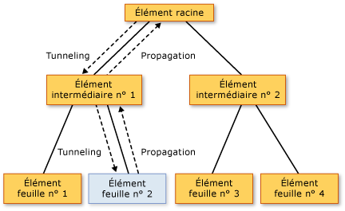

# Vue d&#39;ensemble des &#233;v&#233;nements rout&#233;s
Cette rubrique décrit le concept d'événements routés dans [!INCLUDE[TLA#tla_winclient](../../../../includes/tlasharptla-winclient-md.md)].  Elle définit la terminologie liée aux événements routés, explique le routage des événements routés dans une arborescence d'éléments, fournit un résumé de la gestion des événements routés et présente la création d'événements routés personnalisés.  
  
   
  
   
## Composants requis  
 Cette rubrique suppose que vous disposez de connaissances de base relatives au [!INCLUDE[TLA#tla_clr](../../../../includes/tlasharptla-clr-md.md)] et à la programmation orientée objet, ainsi que sur la conceptualisation des relations entre des éléments [!INCLUDE[TLA2#tla_winclient](../../../../includes/tla2sharptla-winclient-md.md)] sous la forme d'une arborescence.  Pour pouvoir suivre les exemples de cette rubrique, vous devez également maîtriser [!INCLUDE[TLA#tla_xaml](../../../../includes/tlasharptla-xaml-md.md)] et savoir écrire des applications ou des pages [!INCLUDE[TLA2#tla_winclient](../../../../includes/tla2sharptla-winclient-md.md)] de base.  Pour plus d'informations, consultez [Procédure pas à pas : mise en route de WPF](../../../../docs/framework/wpf/getting-started/walkthrough-my-first-wpf-desktop-application.md) et [Vue d'ensemble du langage XAML \(WPF\)](../../../../docs/framework/wpf/advanced/xaml-overview-wpf.md).  
  
   
## Qu'est\-ce qu'un événement routé ?  
 Vous pouvez considérer les événements routés d'un point de vue fonctionnel ou d'implémentation.  Cette rubrique présente les deux définitions, car certaines personnes comprennent mieux l'une que l'autre.  
  
 Définition fonctionnelle : Un événement routé est un type d'événement qui peut appeler des gestionnaires sur plusieurs écouteurs dans une arborescence d'éléments, plutôt que seulement sur l'objet qui a déclenché l'événement.  
  
 Définition d'implémentation : Un [événement routé](GTMT) est un événement [!INCLUDE[TLA2#tla_clr](../../../../includes/tla2sharptla-clr-md.md)] qui est stocké par une instance de la classe <xref:System.Windows.RoutedEvent> et est traité par le système d'événements [!INCLUDE[TLA#tla_winclient](../../../../includes/tlasharptla-winclient-md.md)].  
  
 Une application [!INCLUDE[TLA2#tla_winclient](../../../../includes/tla2sharptla-winclient-md.md)] classique contient de nombreux éléments.  Qu'ils soient créés à l'aide de code ou déclarés en [!INCLUDE[TLA2#tla_xaml](../../../../includes/tla2sharptla-xaml-md.md)], ces éléments existent dans une relation d'arborescence d'éléments réciproque.  L'itinéraire d'événement peut suivre l'une des deux directions en fonction de la définition d'événement. Toutefois, l'itinéraire part généralement de l'élément source puis "se propage" vers le haut dans l'arborescence d'éléments jusqu'à ce qu'il atteigne la racine de l'arborescence d'éléments \(en général, une page ou une fenêtre\).  Ce concept de propagation peut vous être familier si vous avez déjà utilisé le modèle objet DHTML.  
  
 Soit l'arborescence d'éléments simple suivante :  
  
 [!code-xml[EventOvwSupport#GroupButton](../../../../samples/snippets/csharp/VS_Snippets_Wpf/EventOvwSupport/CSharp/default.xaml#groupbutton)]  
  
 Cette arborescence d'éléments se présente comme suit :  
  
   
  
 Dans cette arborescence d'éléments simplifiée, la source d'un événement <xref:System.Windows.Controls.Primitives.ButtonBase.Click> est l'un des éléments <xref:System.Windows.Controls.Button> et le <xref:System.Windows.Controls.Button> sur lequel l'utilisateur a cliqué correspond au premier élément pouvant gérer l'événement.  Toutefois, si aucun gestionnaire attaché au <xref:System.Windows.Controls.Button> n'agit sur l'événement, celui\-ci se propage vers le haut jusqu'au parent <xref:System.Windows.Controls.Button> de l'arborescence d'éléments, à savoir le <xref:System.Windows.Controls.StackPanel>.  Potentiellement, l'événement se propage jusqu'à <xref:System.Windows.Controls.Border>, puis au\-delà pour atteindre la racine de page de l'arborescence d'éléments \(non illustré\).  
  
 En d'autres termes, l'itinéraire de cet événement <xref:System.Windows.Controls.Primitives.ButtonBase.Click> est le suivant :  
  
 Button\-\-\>StackPanel\-\-\>Border\-\-\>...  
  
### Scénarios de niveau supérieur pour les événements routés  
 Vous trouverez ci\-après un bref résumé des scénarios à l'origine du concept d'événement routé qui vous permettra de comprendre pourquoi un événement [!INCLUDE[TLA2#tla_clr](../../../../includes/tla2sharptla-clr-md.md)] classique n'est pas approprié pour ces scénarios :  
  
 **Composition et encapsulation de contrôles :** dans [!INCLUDE[TLA2#tla_winclient](../../../../includes/tla2sharptla-winclient-md.md)], différents contrôles présentent un modèle de contenu riche.  Par exemple, vous pouvez placer une image dans un <xref:System.Windows.Controls.Button>, ce qui étend l'arborescence d'éléments visuels du bouton.  Toutefois, l'image ajoutée ne doit pas interrompre le comportement de test d'atteinte qui entraîne la réponse d'un bouton à un <xref:System.Windows.Controls.Primitives.ButtonBase.Click> de son contenu, même si l'utilisateur clique sur des pixels faisant techniquement partie de l'image.  
  
 **Points d'attache de gestionnaire singuliers :** dans [!INCLUDE[TLA#tla_winforms](../../../../includes/tlasharptla-winforms-md.md)], vous devez attacher plusieurs fois le même gestionnaire pour traiter les événements pouvant être déclenchés par plusieurs éléments.  Les événements routés vous permettent d'attacher ce gestionnaire une seule fois, comme dans l'exemple précédent, et d'utiliser la logique de gestionnaire pour déterminer l'origine de l'événement, si nécessaire.  Par exemple, le gestionnaire ci\-dessous peut correspondre au langage [!INCLUDE[TLA2#tla_xaml](../../../../includes/tla2sharptla-xaml-md.md)] précédent :  
  
 [!code-csharp[EventOvwSupport#GroupButtonCodeBehind](../../../../samples/snippets/csharp/VS_Snippets_Wpf/EventOvwSupport/CSharp/default.xaml.cs#groupbuttoncodebehind)]
 [!code-vb[EventOvwSupport#GroupButtonCodeBehind](../../../../samples/snippets/visualbasic/VS_Snippets_Wpf/EventOvwSupport/visualbasic/default.xaml.vb#groupbuttoncodebehind)]  
  
 **Gestion de classe :** les événements routés autorisent un gestionnaire statique défini par la classe.  Ce gestionnaire de classe peut gérer un événement avant les gestionnaires d'instance attachés.  
  
 **Référencement d'un événement sans réflexion :** pour certaines techniques de code et de balisage, il est nécessaire de pouvoir identifier un événement spécifique.  Un événement routé crée un champ <xref:System.Windows.RoutedEvent> en tant qu'identificateur afin de fournir une technique d'identification d'événement fiable qui ne nécessite pas de réflexion statique ou du runtime.  
  
### Implémentation des événements routés  
 Un [événement routé](GTMT) est un événement [!INCLUDE[TLA2#tla_clr](../../../../includes/tla2sharptla-clr-md.md)] stocké par une instance de la classe <xref:System.Windows.RoutedEvent> et inscrit auprès du système d'événements [!INCLUDE[TLA2#tla_winclient](../../../../includes/tla2sharptla-winclient-md.md)].  L'instance <xref:System.Windows.RoutedEvent> obtenue lors de l'inscription est généralement conservée en tant que membre de champ `public` `static` `readonly` de la classe qui inscrit et qui "possède" l'événement routé.  La connexion à l'événement [!INCLUDE[TLA2#tla_clr](../../../../includes/tla2sharptla-clr-md.md)] ayant un nom identique \(parfois appelé événement "wrapper"\) est réalisée en substituant les implémentations `add` et `remove` pour l'événement [!INCLUDE[TLA2#tla_clr](../../../../includes/tla2sharptla-clr-md.md)].  Les implémentations `add` et `remove` sont normalement conservées comme valeurs par défaut implicites qui utilisent la syntaxe d'événement spécifique du langage appropriée pour ajouter et supprimer des gestionnaires de cet événement.  Du point de vue du concept, le mécanisme de connexion et de stockage d'événements routés est semblable au principe d'une [propriété de dépendance](GTMT) qui correspond à une propriété [!INCLUDE[TLA2#tla_clr](../../../../includes/tla2sharptla-clr-md.md)] stockée par la classe <xref:System.Windows.DependencyProperty> et inscrite auprès du système de propriétés [!INCLUDE[TLA2#tla_winclient](../../../../includes/tla2sharptla-winclient-md.md)].  
  
 L'exemple suivant affiche la déclaration d'un événement routé `Tap` personnalisé, y compris l'inscription et l'exposition du champ d'identificateur <xref:System.Windows.RoutedEvent> et des implémentations `add` et `remove` pour l'événement `Tap`[!INCLUDE[TLA2#tla_clr](../../../../includes/tla2sharptla-clr-md.md)].  
  
 [!code-csharp[RoutedEventCustom#AddRemoveHandler](../../../../samples/snippets/csharp/VS_Snippets_Wpf/RoutedEventCustom/CSharp/SDKSampleLibrary/class1.cs#addremovehandler)]
 [!code-vb[RoutedEventCustom#AddRemoveHandler](../../../../samples/snippets/visualbasic/VS_Snippets_Wpf/RoutedEventCustom/VB/SDKSampleLibrary/Class1.vb#addremovehandler)]  
  
### Gestionnaires d'événements routés et XAML  
 Pour ajouter un gestionnaire pour un événement à l'aide de [!INCLUDE[TLA2#tla_xaml](../../../../includes/tla2sharptla-xaml-md.md)], vous déclarez le nom de l'événement en tant qu'attribut sur l'élément correspondant à un écouteur d'événements.  La valeur de l'attribut est le nom de la méthode de gestionnaire implémentée, qui doit exister dans la classe partielle du fichier code\-behind.  
  
 [!code-xml[EventOvwSupport#SimplestSyntax](../../../../samples/snippets/csharp/VS_Snippets_Wpf/EventOvwSupport/CSharp/default.xaml#simplestsyntax)]  
  
 La syntaxe [!INCLUDE[TLA2#tla_xaml](../../../../includes/tla2sharptla-xaml-md.md)] utilisée pour ajouter des gestionnaires d'événements [!INCLUDE[TLA2#tla_clr](../../../../includes/tla2sharptla-clr-md.md)] standard permet également d'ajouter des gestionnaires d'événements routés, car vous ajoutez des gestionnaires au wrapper d'événement [!INCLUDE[TLA2#tla_clr](../../../../includes/tla2sharptla-clr-md.md)], qui contient une implémentation d'événement routé sous\-jacente.  Pour plus d'informations sur l'ajout de gestionnaires d'événements en [!INCLUDE[TLA2#tla_xaml](../../../../includes/tla2sharptla-xaml-md.md)], consultez [Vue d'ensemble du langage XAML \(WPF\)](../../../../docs/framework/wpf/advanced/xaml-overview-wpf.md).  
  
   
## Stratégies de routage  
 Les événements routés utilisent l'une des trois stratégies de routage suivantes :  
  
-   **Propagation :** les gestionnaires d'événements sur la source d'événement sont appelés.  L'événement routé passe ensuite par des éléments parents successifs jusqu'à atteindre la racine de l'arborescence d'éléments.  La plupart des événements routés utilisent la stratégie de routage par propagation.  En règle générale, les événements routés de propagation servent à signaler les modifications d'entrée ou d'état à partir de contrôles distincts ou d'autres éléments de l'interface utilisateur.  
  
-   **Routage direct :** seul l'élément source peut appeler des gestionnaires en réponse.  Ce principe est similaire au "routage" utilisé par [!INCLUDE[TLA#tla_winforms](../../../../includes/tlasharptla-winforms-md.md)] pour les événements.  Toutefois, contrairement à un événement [!INCLUDE[TLA2#tla_clr](../../../../includes/tla2sharptla-clr-md.md)] standard, les événements routés directs prennent en charge la gestion de classe \(expliquée dans une section ultérieure\) et peuvent être utilisés par <xref:System.Windows.EventSetter> et <xref:System.Windows.EventTrigger>.  
  
-   **Tunneling :** initialement, des gestionnaires d'événements situés à la racine de l'arborescence d'éléments sont appelés.  L'événement routé passe ensuite par des éléments enfants successifs sur l'itinéraire jusqu'à atteindre l'élément nœud correspondant à la source de l'événement routé \(l'élément qui a déclenché l'événement routé\).  Les événements routés de tunneling sont souvent utilisés ou gérés dans le cadre de la composition d'un contrôle, de sorte que les événements de parties composites peuvent être délibérément supprimés ou remplacés par des événements spécifiques du contrôle complet.  Les événements d'entrée fournis dans [!INCLUDE[TLA2#tla_winclient](../../../../includes/tla2sharptla-winclient-md.md)] sont souvent implémentés sous la forme d'une parie tunneling\/propagation.  En outre, les événements de tunneling sont parfois appelés "événements d'aperçu" en raison d'une convention d'affectation de noms utilisée pour les paires.  
  
   
## Pourquoi utiliser des événements routés ?  
 En tant que développeur d'applications, vous n'avez pas toujours besoin de savoir si l'événement géré est implémenté en tant qu'événement routé.  Les événements routés présentent un comportement particulier, qui est toutefois invisible en grande partie si vous gérez un événement sur l'élément où il est déclenché.  
  
 Les événements routés deviennent performants si vous utilisez l'un des scénarios suggérés : définition des gestionnaires communs au niveau d'une racine commune, composition d'un contrôle personnalisé ou définition d'une classe de contrôle personnalisée.  
  
 Les écouteurs et les sources d'événements routés ne doivent pas nécessairement partager un événement commun dans leur hiérarchie.  Un <xref:System.Windows.UIElement> ou un <xref:System.Windows.ContentElement> peut être un écouteur d'événements pour un événement routé.  Par conséquent, vous pouvez utiliser le jeu complet d'événements routés disponibles dans l'interface [!INCLUDE[TLA2#tla_api](../../../../includes/tla2sharptla-api-md.md)] active définie en tant qu'"interface" conceptuelle les différents éléments de l'application peuvent échanger des informations d'événement.  Ce concept d'"interface" pour les événements routés convient tout particulièrement pour les événements d'entrée.  
  
 Les événements routés peuvent également être utilisés pour communiquer dans l'arborescence d'éléments, car les données de l'événement sont perpétuées à chaque élément de l'itinéraire.  Un élément peut modifier les données d'événement, modification qui est ensuite disponible pour l'élément suivant de l'itinéraire.  
  
 Outre l'aspect de routage, deux autres raisons peuvent justifier l'implémentation d'un événement [!INCLUDE[TLA2#tla_winclient](../../../../includes/tla2sharptla-winclient-md.md)] donné en tant qu'événement routé au lieu d'un événement [!INCLUDE[TLA2#tla_clr](../../../../includes/tla2sharptla-clr-md.md)] standard.  Si vous implémentez des événements personnalisés, vous pouvez également tenir compte des principes suivants :  
  
-   Pour certaines fonctionnalités liées aux styles et aux modèles [!INCLUDE[TLA2#tla_winclient](../../../../includes/tla2sharptla-winclient-md.md)] \(comme <xref:System.Windows.EventSetter> et <xref:System.Windows.EventTrigger>\), l'événement référencé doit être un événement routé.  Il s'agit du scénario d'identificateur de l'événement mentionné précédemment.  
  
-   Les événements routés prennent en charge un mécanisme de gestion de classe qui permet à la classe de spécifier des méthodes statiques pouvant gérer les événements routés avant que les gestionnaires d'instance inscrits n'y accèdent.  Cela s'avère particulièrement utile dans le cadre de la conception de contrôles, car la classe peut appliquer des comportements de classe pilotés par des évènements qui ne peuvent pas être supprimés par inadvertance lors de la gestion d'un événement sur une instance.  
  
 Chacune des considérations ci\-dessus fait l'objet d'une section distincte de cette rubrique.  
  
   
## Ajout et implémentation d'un gestionnaire d'événements pour un événement routé  
 Pour ajouter un gestionnaire d'événements dans [!INCLUDE[TLA2#tla_xaml](../../../../includes/tla2sharptla-xaml-md.md)], il vous suffit d'ajouter le nom de l'événement à un élément en tant qu'attribut et de définir la valeur d'attribut comme nom du gestionnaire d'événements qui implémente un délégué approprié, comme dans l'exemple suivant.  
  
 [!code-xml[EventOvwSupport#SimplestSyntax](../../../../samples/snippets/csharp/VS_Snippets_Wpf/EventOvwSupport/CSharp/default.xaml#simplestsyntax)]  
  
 `b1SetColor` est le nom du gestionnaire implémenté qui contient le code qui gère l'événement <xref:System.Windows.Controls.Primitives.ButtonBase.Click>.  `b1SetColor` doit avoir la même signature que le délégué <xref:System.Windows.RoutedEventHandler>, qui est le délégué de gestionnaires d'événements de l'événement <xref:System.Windows.Controls.Primitives.ButtonBase.Click>.  Le premier paramètre de chaque délégué de gestionnaires d'événements routés spécifie l'élément auquel le gestionnaire d'événements est ajouté, tandis que le second paramètre détermine les données de l'événement.  
  
 [!code-csharp[EventOvwSupport#SimpleHandlerA](../../../../samples/snippets/csharp/VS_Snippets_Wpf/EventOvwSupport/CSharp/default.xaml.cs#simplehandlera)]
 [!code-vb[EventOvwSupport#SimpleHandlerA](../../../../samples/snippets/visualbasic/VS_Snippets_Wpf/EventOvwSupport/visualbasic/default.xaml.vb#simplehandlera)]  
[!code-csharp[EventOvwSupport#SimpleHandlerB](../../../../samples/snippets/csharp/VS_Snippets_Wpf/EventOvwSupport/CSharp/default.xaml.cs#simplehandlerb)]
[!code-vb[EventOvwSupport#SimpleHandlerB](../../../../samples/snippets/visualbasic/VS_Snippets_Wpf/EventOvwSupport/visualbasic/default.xaml.vb#simplehandlerb)]  
  
 <xref:System.Windows.RoutedEventHandler> correspond au délégué de gestionnaires d'événements routés de base.  En ce qui concerne les événements routés conçus spécialement pour certains contrôles ou scénarios, les délégués à utiliser pour les gestionnaires d'événements routés peuvent se spécialiser davantage et transmettre des données d'événement spécialisées.  Par exemple, dans un scénario d'entrée courant, vous pouvez gérer un événement routé <xref:System.Windows.UIElement.DragEnter>.  Le gestionnaire doit implémenter le délégué <xref:System.Windows.DragEventHandler>.  Si vous utilisez le délégué le plus spécifique, vous pouvez traiter <xref:System.Windows.DragEventArgs> dans le gestionnaire et lire la propriété <xref:System.Windows.DragEventArgs.Data%2A>, qui contient la charge utile de Presse\-papiers de l'opération glisser.  
  
 Pour un exemple complet indiquant comment ajouter un gestionnaire d'événements à un élément à l'aide de [!INCLUDE[TLA2#tla_xaml](../../../../includes/tla2sharptla-xaml-md.md)], consultez [Gérer un événement routé](../../../../docs/framework/wpf/advanced/how-to-handle-a-routed-event.md).  
  
 L'ajout d'un gestionnaire pour un événement routé dans une application créée à l'aide de code est une opération très simple.  En effet, les gestionnaires d'événements routés peuvent toujours être ajoutés via une méthode d'assistance <xref:System.Windows.UIElement.AddHandler%2A> \(identique à celle appelée par le stockage pour `add`.\) Toutefois, les événements routés [!INCLUDE[TLA2#tla_winclient](../../../../includes/tla2sharptla-winclient-md.md)] existants comportent généralement des implémentations de stockage de la logique `add` et `remove` qui permet d'ajouter les gestionnaires d'événements routés à l'aide d'une syntaxe d'événement spécifique d'un langage, plus intuitive que la méthode d'assistance.  L'exemple suivant illustre une utilisation de la méthode d'assistance :  
  
 [!code-csharp[EventOvwSupport#AddHandlerCode](../../../../samples/snippets/csharp/VS_Snippets_Wpf/EventOvwSupport/CSharp/default.xaml.cs#addhandlercode)]
 [!code-vb[EventOvwSupport#AddHandlerCode](../../../../samples/snippets/visualbasic/VS_Snippets_Wpf/EventOvwSupport/visualbasic/default.xaml.vb#addhandlercode)]  
  
 L'exemple suivant montre la syntaxe d'opérateur [!INCLUDE[TLA#tla_cshrp](../../../../includes/tlasharptla-cshrp-md.md)] \([!INCLUDE[TLA2#tla_visualb](../../../../includes/tla2sharptla-visualb-md.md)] présente une syntaxe d'opérateur légèrement différente en raison de la gestion du déréférencement\) :  
  
 [!code-csharp[EventOvwSupport#AddHandlerPlusEquals](../../../../samples/snippets/csharp/VS_Snippets_Wpf/EventOvwSupport/CSharp/default.xaml.cs#addhandlerplusequals)]
 [!code-vb[EventOvwSupport#AddHandlerPlusEquals](../../../../samples/snippets/visualbasic/VS_Snippets_Wpf/EventOvwSupport/visualbasic/default.xaml.vb#addhandlerplusequals)]  
  
 Pour un exemple indiquant comment ajouter un gestionnaire d'événements à l'aide de code, consultez [Ajouter un gestionnaire d'événements à l'aide de code](../../../../docs/framework/wpf/advanced/how-to-add-an-event-handler-using-code.md).  
  
 Si vous utilisez [!INCLUDE[TLA2#tla_visualb](../../../../includes/tla2sharptla-visualb-md.md)], vous pouvez également utiliser le mot clé `Handles` pour ajouter des gestionnaires dans le cadre des déclarations de gestionnaire.  Pour plus d'informations, consultez [Gestion des événements Visual Basic et WPF](../../../../docs/framework/wpf/advanced/visual-basic-and-wpf-event-handling.md).  
  
   
### Concept Handled  
 Tous les événements routés partagent une classe de base de données d'événement commune, <xref:System.Windows.RoutedEventArgs>.  <xref:System.Windows.RoutedEventArgs> définit la propriété <xref:System.Windows.RoutedEventArgs.Handled%2A>, qui accepte une valeur booléenne.  Le but de la propriété <xref:System.Windows.RoutedEventArgs.Handled%2A> est de permettre à un gestionnaire d'événements situé sur l'itinéraire de marquer l'événement routé comme étant *géré*, en définissant <xref:System.Windows.RoutedEventArgs.Handled%2A> sur la valeur `true`.  Une fois traitées par le gestionnaire au niveau d'un élément de l'itinéraire, les données d'événement partagées sont à nouveau signalées à chaque écouteur situé sur l'itinéraire.  
  
 La valeur de <xref:System.Windows.RoutedEventArgs.Handled%2A> détermine la façon dont un événement routé est signalé ou traité lorsqu'il parcourt l'itinéraire.  Si <xref:System.Windows.RoutedEventArgs.Handled%2A> a la valeur `true` dans les données d'un événement routé, les gestionnaires qui écoutent cet événement routé sur d'autres éléments ne sont généralement plus appelés pour cette instance d'événement particulière.  Ce principe est valable pour les gestionnaires attachés en [!INCLUDE[TLA2#tla_xaml](../../../../includes/tla2sharptla-xaml-md.md)] et pour ceux ajoutés par des syntaxes d'attachement de gestionnaire d'événements spécifiques d'un langage telles que `+=` et `Handles`.  Pour la plupart des scénarios de gestionnaire communs, si un événement est marqué comme étant géré en définissant <xref:System.Windows.RoutedEventArgs.Handled%2A> sur la valeur `true`, le routage est « interrompu » pour un itinéraire de tunneling ou de propagation, ainsi que pour tous les événements gérés à un point de l'itinéraire par un gestionnaire de classe.  
  
 Toutefois, un mécanisme "handledEventsToo" permet aux écouteurs d'exécuter des gestionnaires en réponse à des événements routés où <xref:System.Windows.RoutedEventArgs.Handled%2A> a la valeur `true` dans les données d'événement.  Autrement dit, l'itinéraire d'événement n'est pas réellement interrompu lors du marquage des données d'événement comme gérées.  Vous ne pouvez utiliser le mécanisme handledEventsToo que dans le code ou dans un <xref:System.Windows.EventSetter> :  
  
-   Dans le code, au lieu d'utiliser une syntaxe d'événement spécifique d'un langage compatible avec les événements [!INCLUDE[TLA2#tla_clr](../../../../includes/tla2sharptla-clr-md.md)] généraux, appelez la méthode [!INCLUDE[TLA2#tla_winclient](../../../../includes/tla2sharptla-winclient-md.md)] <xref:System.Windows.UIElement.AddHandler%28System.Windows.RoutedEvent%2CSystem.Delegate%2CSystem.Boolean%29> pour ajouter votre gestionnaire.  Affectez la valeur `true` à `handledEventsToo`.  
  
-   Dans un <xref:System.Windows.EventSetter>, définissez l'attribut <xref:System.Windows.EventSetter.HandledEventsToo%2A> sur la valeur `true`.  
  
 Outre le comportement induit par l'état <xref:System.Windows.RoutedEventArgs.Handled%2A> sur les événements routés, le concept de <xref:System.Windows.RoutedEventArgs.Handled%2A> a des conséquences sur la conception de l'application et sur l'écriture du code du gestionnaire d'événements.  Vous pouvez conceptualiser <xref:System.Windows.RoutedEventArgs.Handled%2A> en tant que protocole simple exposé par les événements routés.  L'utilisation de ce protocole varie en fonction de vos besoins. Toutefois, l'étude conceptuelle liée à l'utilisation de la valeur de <xref:System.Windows.RoutedEventArgs.Handled%2A> est la suivante :  
  
-   Si un événement routé est marqué comme géré, il ne doit plus nécessairement être à nouveau géré par les autres éléments de cet itinéraire.  
  
-   Si un événement routé n'est pas marqué comme géré, les autres écouteurs situés en amont sur l'itinéraire ont choisi de ne pas inscrire de gestionnaire ou les gestionnaires inscrits ont choisi de ne pas manipuler les données d'événement et de définir <xref:System.Windows.RoutedEventArgs.Handled%2A> sur la valeur `true`.  \(Il est évidemment possible que l'écouteur actuel corresponde au premier point de l'itinéraire.\) Les gestionnaires sur l'écouteur actuel disposent de trois actions possibles :  
  
    -   Ne prendre aucune action. L'événement reste non géré et il passe à l'écouteur suivant.  
  
    -   Exécuter le code en réponse à l'événement, tout en déterminant que l'action prise n'est pas assez importante pour garantir le marquage de l'événement comme géré.  L'événement passe à l'écouteur suivant.  
  
    -   Exécuter le code en réponse à l'événement.  Marquer l'événement comme géré dans les données d'événement passées au gestionnaire, car l'action prise est jugée suffisamment importante pour garantir le marquage comme géré.  L'événement passe encore à l'écouteur suivant, mais ses données d'événement comportent <xref:System.Windows.RoutedEventArgs.Handled%2A>\=`true`. Ainsi, seuls les écouteurs `handledEventsToo` peuvent appeler d'autres gestionnaires.  
  
 Cette étude conceptuelle est renforcée par le comportement de routage mentionné précédemment. Il est dès lors plus difficile \(mais toutefois possible dans le code ou des styles\) d'attacher des gestionnaires pour les événements routés appelés même si un gestionnaire précédent de l'itinéraire a déjà défini <xref:System.Windows.RoutedEventArgs.Handled%2A> sur la valeur `true`.  
  
 Pour plus d'informations sur <xref:System.Windows.RoutedEventArgs.Handled%2A>, sur la gestion de classe d'événements routés et sur les scénarios dans lesquels il est recommandé de marquer un événement routé comme <xref:System.Windows.RoutedEventArgs.Handled%2A>, consultez [Marquage des événements routés comme gérés et gestion de classe](../../../../docs/framework/wpf/advanced/marking-routed-events-as-handled-and-class-handling.md).  
  
 Dans les applications, il est fréquent de gérer uniquement un événement routé de propagation sur l'objet qui l'a déclenché, sans se soucier des caractéristiques de routage de l'événement.  Toutefois, il est toujours recommandé de marquer un événement routé comme géré dans les données d'événement afin d'éviter tout effet secondaire indésirable si un élément situé à un niveau supérieur de l'arborescence d'éléments comporte également un gestionnaire attaché pour cet événement routé.  
  
   
## Gestionnaires de classe  
 Si vous définissez une classe dérivée de <xref:System.Windows.DependencyObject>, vous pouvez également définir et attacher un gestionnaire de classe pour un événement routé correspondant à un membre d'événement déclaré ou hérité de votre classe.  Les gestionnaires de classe sont appelés avant les gestionnaires d'écouteur d'instance attachés à une instance de cette classe, lorsqu'un événement routé atteint une instance d'élément sur son itinéraire.  
  
 Certains contrôles [!INCLUDE[TLA2#tla_winclient](../../../../includes/tla2sharptla-winclient-md.md)] bénéficient de la gestion de classe inhérente pour certains événements routés.  De l'extérieur, on peut penser que l'événement routé n'est jamais déclenché, alors qu'en réalité, il est géré par la classe. L'événement routé peut potentiellement encore être géré par vos gestionnaires d'instance si vous utilisez certaines techniques.  Par ailleurs, de nombreuses classes et contrôles de base exposent des méthodes virtuelles qui peuvent être utilisées pour substituer le comportement de gestion de classe.  Pour plus d'informations sur le contournement d'une gestion de classe indésirable et sur la définition de votre propre gestion de classe dans une classe personnalisée, consultez [Marquage des événements routés comme gérés et gestion de classe](../../../../docs/framework/wpf/advanced/marking-routed-events-as-handled-and-class-handling.md).  
  
   
## Événements attachés dans WPF  
 Le langage [!INCLUDE[TLA2#tla_xaml](../../../../includes/tla2sharptla-xaml-md.md)] définit également un type d'événement spécial appelé *événement attaché*.  Grâce à un événement attaché, vous pouvez ajouter un gestionnaire pour un événement particulier à un élément arbitraire.  L'élément qui gère l'événement ne doit pas définir l'événement attaché ou en hériter. En outre, ni l'objet qui déclenche potentiellement l'événement, ni l'instance de gestion de destination ne doivent définir ou « posséder » cet événement en tant que membre de classe.  
  
 Le système d'entrée [!INCLUDE[TLA2#tla_winclient](../../../../includes/tla2sharptla-winclient-md.md)] utilise largement les événements attachés.  Toutefois, presque tous ces événements attachés sont transférés via des éléments de base.  Les événements d'entrée apparaissent ensuite en tant qu'événements routés non attachés équivalents qui font partie de la classe d'élément de base.  Par exemple, l'événement <xref:System.Windows.Input.Mouse.MouseDown?displayProperty=fullName> attaché sous\-jacent peut être plus facilement géré sur tout <xref:System.Windows.UIElement> donné en utilisant <xref:System.Windows.UIElement.MouseDown> sur ce <xref:System.Windows.UIElement> plutôt que de se servir de la syntaxe d'événement attaché dans [!INCLUDE[TLA2#tla_xaml](../../../../includes/tla2sharptla-xaml-md.md)] ou dans le code.  
  
 Pour plus d'informations sur les événements attachés dans [!INCLUDE[TLA2#tla_winclient](../../../../includes/tla2sharptla-winclient-md.md)], consultez [Vue d'ensemble des événements attachés](../../../../docs/framework/wpf/advanced/attached-events-overview.md).  
  
   
## Noms d'événements qualifiés en XAML  
 L'attachement de gestionnaires pour les événements routés déclenchés par les éléments enfants constitue une autre utilisation de syntaxe qui ressemble à la syntaxe d'événement attaché *NomType*.*NomÉvénement*. Il ne s'agit toutefois pas à proprement parler d'une utilisation d'événement attaché.  Pour tirer parti du routage d'événement, vous attachez les gestionnaires à un parent commun, même si l'événement routé approprié n'est pas membre de ce parent commun.  Reprenons l'exemple suivant :  
  
 [!code-xml[EventOvwSupport#GroupButton](../../../../samples/snippets/csharp/VS_Snippets_Wpf/EventOvwSupport/CSharp/default.xaml#groupbutton)]  
  
 Dans ce cas, l'écouteur d'élément parent auquel le gestionnaire est ajouté est un <xref:System.Windows.Controls.StackPanel>.  Toutefois, il ajoute un gestionnaire pour un événement routé qui a été déclaré et sera déclenché par la classe <xref:System.Windows.Controls.Button> \(<xref:System.Windows.Controls.Primitives.ButtonBase> en réalité, mais disponible dans <xref:System.Windows.Controls.Button> par héritage\).  <xref:System.Windows.Controls.Button> "possède" l'événement, mais le système d'événements routés autorise l'attachement des gestionnaires d'un événement routé à un écouteur d'instance <xref:System.Windows.UIElement> ou <xref:System.Windows.ContentElement>, qui peuvent, dans d'autres cas, attacher des écouteurs pour un événement [!INCLUDE[TLA#tla_clr](../../../../includes/tlasharptla-clr-md.md)].  L'espace de noms xmlns par défaut pour ces noms d'attributs d'événement qualifiés correspond en général à l'espace de noms xmlns [!INCLUDE[TLA2#tla_winclient](../../../../includes/tla2sharptla-winclient-md.md)] par défaut. Il est toutefois également possible de spécifier des espaces de noms préfixés pour des événements routés personnalisés.  Pour plus d'informations sur xmlns, consultez [Espaces de noms XAML et mappage d'espace de noms pour XAML WPF](../../../../docs/framework/wpf/advanced/xaml-namespaces-and-namespace-mapping-for-wpf-xaml.md).  
  
   
## Événements d'entrée WPF  
 Les événements d'entrée constituent une application fréquente des événements routés dans la plateforme [!INCLUDE[TLA2#tla_winclient](../../../../includes/tla2sharptla-winclient-md.md)]. Dans [!INCLUDE[TLA2#tla_winclient](../../../../includes/tla2sharptla-winclient-md.md)], les noms d'événements routés de tunneling sont, par convention, précédés du mot « Preview ».  Les événements d'entrée se présentent souvent sous la forme de paires, l'un correspondant à l'événement de propagation et l'autre à l'événement de tunneling.  Par exemple, les événements <xref:System.Windows.ContentElement.KeyDown> et <xref:System.Windows.ContentElement.PreviewKeyDown> comportent la même signature, le premier étant l'événement d'entrée de propagation et le dernier, l'événement d'entrée de tunneling.  Parfois, les événements d'entrée ne comportent qu'une version de propagation ou une version à routage direct.  Dans la documentation, les rubriques relatives aux événements routés font référence à des événements routés similaires avec des stratégies de routage différentes si ces événements routés existent. En outre, les sections des pages de références managées clarifient la stratégie de routage de chaque événement routé.  
  
 Les événements d'entrée [!INCLUDE[TLA2#tla_winclient](../../../../includes/tla2sharptla-winclient-md.md)] se présentant sous la forme de paires sont implémentés afin qu'une seule action d'entrée utilisateur \(clic sur un bouton de la souris, par exemple\) déclenche les deux événements de la paire dans l'ordre.  Tout d'abord, l'événement de tunneling est déclenché et parcourt son itinéraire.  Ensuite, c'est l'événement de propagation qui est déclenché et qui parcourt son itinéraire.  Ces deux événements partagent littéralement la même instance de données d'événement, car l'appel de méthode <xref:System.Windows.UIElement.RaiseEvent%2A> dans la classe d'implémentation qui déclenche l'événement de propagation écoute les données d'événement issues de l'événement de tunneling et les réutilise dans le nouvel événement déclenché.  Les écouteurs comportant des gestionnaires pour l'événement de tunneling sont les premiers à pouvoir marquer l'événement routé comme géré \(gestionnaires de classe d'abord, puis gestionnaires d'instance\).  Si un élément situé sur l'itinéraire de tunneling a marqué l'événement routé comme géré, les données de l'événement déjà géré sont envoyées pour l'événement de propagation et aucun gestionnaire standard attaché pour les événements d'entrée de propagation équivalents n'est appelé.  D'un point de vue externe, l'événement de propagation géré se présente comme s'il n'avait pas été déclenché.  Ce comportement de gestion s'avère utile pour composer des contrôles. En effet, vous pouvez déterminer que tous les événements d'entrée basés sur un test d'atteinte ou sur un focus doivent être signalés par le dernier contrôle, plutôt que par ses parties composites.  Étant plus proche de la racine dans la composition, le dernier élément de contrôle peut gérer d'abord la classe pour l'événement de tunneling, puis "remplacer" cet événement routé par un événement plus spécifique du contrôle, dans le cadre du code qui stocke la classe de contrôle.  
  
 Afin d'illustrer le fonctionnement du traitement des événements d'entrée, prenons l'exemple d'événement d'entrée suivant.  Dans cette illustration d'arborescence, `leaf element #2` correspond à la source d'un événement `PreviewMouseDown`, puis d'un événement `MouseDown`.  
  
   
Propagation et tunneling d'événements d'entrée  
  
 L'ordre de traitement des événements est le suivant :  
  
1.  `PreviewMouseDown` \(tunneling\) sur l'élément racine.  
  
2.  `PreviewMouseDown` \(tunneling\) sur l'élément intermédiaire n°1.  
  
3.  `PreviewMouseDown` \(tunneling\) sur l'élément source n°2.  
  
4.  `MouseDown` \(propagation\) sur l'élément source n°2.  
  
5.  `MouseDown` \(propagation\) sur l'élément intermédiaire n°1.  
  
6.  `MouseDown` \(propagation\) sur l'élément racine.  
  
 Un délégué de gestionnaires d'événements routés fournit les références à deux objets : l'objet qui a déclenché l'événement et celui où le gestionnaire a été appelé.  Ce dernier correspond à l'objet signalé par le paramètre `sender`,  tandis que l'objet dans lequel l'événement a été déclenché pour la première fois est signalé par la propriété <xref:System.Windows.RoutedEventArgs.Source%2A> dans les données d'événement.  Un événement routé peut encore être déclenché et géré par le même objet, auquel cas `sender` et <xref:System.Windows.RoutedEventArgs.Source%2A> sont identiques \(c'est le cas pour les étapes 3 et 4 de la liste de l'exemple de traitement d'événements\).  
  
 En raison du tunneling et de la propagation, les éléments parents reçoivent des événements d'entrée là où <xref:System.Windows.RoutedEventArgs.Source%2A> correspond à un élément enfant.  Si l'élément source doit être connu, vous pouvez l'identifier en accédant à la propriété <xref:System.Windows.RoutedEventArgs.Source%2A>.  
  
 En règle générale, une fois l'événement d'entrée marqué comme <xref:System.Windows.RoutedEventArgs.Handled%2A>, aucun autre gestionnaire n'est appelé par la suite.  Vous devez marquer des événements d'entrée comme gérés dès qu'un gestionnaire est appelé pour traiter la gestion logique spécifique de l'application afin de déterminer la signification de l'événement d'entrée.  
  
 Ce principe général relatif à l'état <xref:System.Windows.RoutedEventArgs.Handled%2A> présente toutefois une exception : les gestionnaires d'événements d'entrée inscrits pour ignorer délibérément l'état <xref:System.Windows.RoutedEventArgs.Handled%2A> pour les données d'événement peuvent encore être appelés sur l'un des itinéraires.  Pour plus d'informations, consultez [Aperçu des événements](../../../../docs/framework/wpf/advanced/preview-events.md) ou [Marquage des événements routés comme gérés et gestion de classe](../../../../docs/framework/wpf/advanced/marking-routed-events-as-handled-and-class-handling.md).  
  
 Le modèle des données d'événement partagées entre les événements de tunneling et de propagation, ainsi que le déclenchement séquentiel des événements de tunneling, puis de propagation, constituent un concept qui n'est généralement pas valable pour l'ensemble des événements routés.  Ce comportement est implémenté par la façon dont les périphériques d'entrée [!INCLUDE[TLA2#tla_winclient](../../../../includes/tla2sharptla-winclient-md.md)] déclenchent les paires d'événements d'entrée et s'y connectent.  L'implémentation d'événements d'entrée personnalisés est un scénario avancé, mais vous pouvez également suivre ce modèle dans ce contexte.  
  
 Certaines classes gèrent par classe des événements d'entrée spécifiques, généralement pour redéfinir la signification d'un événement d'entrée donné piloté par l'utilisateur dans ce contrôle et pour déclencher un nouvel événement.  Pour plus d'informations, consultez [Marquage des événements routés comme gérés et gestion de classe](../../../../docs/framework/wpf/advanced/marking-routed-events-as-handled-and-class-handling.md).  
  
 Pour plus d'informations sur l'entrée et sur l'interaction entre l'entrée et les événements dans des scénarios d'application standard, consultez [Vue d'ensemble des entrées](../../../../docs/framework/wpf/advanced/input-overview.md).  
  
   
## EventSetters et EventTriggers  
 Dans les styles, vous pouvez inclure une syntaxe de gestion d'événements [!INCLUDE[TLA2#tla_xaml](../../../../includes/tla2sharptla-xaml-md.md)] déclarés au préalable dans le balisage à l'aide d'un <xref:System.Windows.EventSetter>.  Lors de l'application du style, le gestionnaire référencé est ajouté à l'instance à laquelle est appliquée le style.  Vous ne pouvez déclarer un <xref:System.Windows.EventSetter> que pour un événement routé  Voici un exemple :  Notez que la méthode `b1SetColor` référencée dans cet exemple est située dans un fichier code\-behind.  
  
 [!code-xml[EventOvwSupport#XAML2](../../../../samples/snippets/csharp/VS_Snippets_Wpf/EventOvwSupport/CSharp/page2.xaml#xaml2)]  
  
 Cet exemple présente l'avantage que le style peut contenir une quantité importante d'autres informations pouvant s'appliquer aux boutons de votre application. En outre, le <xref:System.Windows.EventSetter> faisant partie de ce style favorise la réutilisation de code au niveau du balisage.  Par ailleurs, un <xref:System.Windows.EventSetter> isole davantage les noms de méthodes pour les gestionnaires par rapport à l'application générale et au balisage de page.  
  
 <xref:System.Windows.EventTrigger> représente une autre syntaxe spéciale qui combine les fonctionnalités d'événement routé et d'animation de [!INCLUDE[TLA2#tla_winclient](../../../../includes/tla2sharptla-winclient-md.md)].  Tout comme avec <xref:System.Windows.EventSetter>, seuls les événements routés peuvent être utilisés pour un <xref:System.Windows.EventTrigger>. En général, un <xref:System.Windows.EventTrigger> est déclaré dans le cadre d'un style, mais un <xref:System.Windows.EventTrigger> peut également être déclaré sur des éléments de page dans le cadre de la collection <xref:System.Windows.FrameworkElement.Triggers%2A> ou bien dans un <xref:System.Windows.Controls.ControlTemplate>. Un <xref:System.Windows.EventTrigger> vous permet de spécifier un <xref:System.Windows.Media.Animation.Storyboard> s'exécutant à chaque fois qu'un événement routé atteint un élément sur son itinéraire déclarant un <xref:System.Windows.EventTrigger> pour cet événement.  Par rapport à la simple gestion de l'événement et au démarrage d'un storyboard existant, un <xref:System.Windows.EventTrigger> présente l'avantage de fournir un meilleur contrôle sur le storyboard et sur son comportement au moment de l'exécution. Pour plus d'informations, consultez [Utiliser des déclencheurs d'événements pour contrôler un storyboard après son démarrage](../../../../docs/framework/wpf/graphics-multimedia/how-to-use-event-triggers-to-control-a-storyboard-after-it-starts.md).  
  
   
## Informations complémentaires sur les événements routés  
 Cette rubrique décrit principalement les événements routés en termes de concepts de base et d'aide sur la manière de répondre aux événements routés déjà présents dans les différents contrôles et éléments de base.  Vous pouvez toutefois créer un événement routé personnalisé sur une classe personnalisée avec la prise en charge nécessaire, comme des classes de données d'événement et des délégués spéciaux.  Le propriétaire d'un événement routé peut être une classe, mais, pour pouvoir être utiles, les événements routés doivent être déclenchés et gérés par des classes dérivées <xref:System.Windows.UIElement> ou <xref:System.Windows.ContentElement>.  Pour plus d'informations sur les événements personnalisés, consultez [Créer un événement routé personnalisé](../../../../docs/framework/wpf/advanced/how-to-create-a-custom-routed-event.md).  
  
## Voir aussi  
 <xref:System.Windows.EventManager>   
 <xref:System.Windows.RoutedEvent>   
 <xref:System.Windows.RoutedEventArgs>   
 [Marquage des événements routés comme gérés et gestion de classe](../../../../docs/framework/wpf/advanced/marking-routed-events-as-handled-and-class-handling.md)   
 [Vue d'ensemble des entrées](../../../../docs/framework/wpf/advanced/input-overview.md)   
 [Vue d'ensemble des commandes](../../../../docs/framework/wpf/advanced/commanding-overview.md)   
 [Propriétés de dépendance personnalisées](../../../../docs/framework/wpf/advanced/custom-dependency-properties.md)   
 [Arborescences dans WPF](../../../../docs/framework/wpf/advanced/trees-in-wpf.md)   
 [Modèles d'événement faible](../../../../docs/framework/wpf/advanced/weak-event-patterns.md)