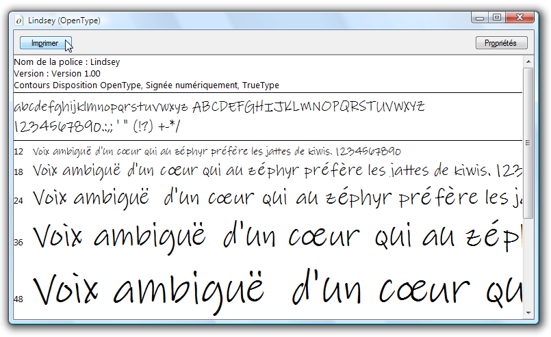

# Exemple de pack de polices OpenType
Cette rubrique fournit une vue d'ensemble des exemples de polices [!INCLUDE[TLA#tla_opentype](../../../../includes/tlasharptla-opentype-md.md)] distribuées avec le [!INCLUDE[TLA2#tla_wcsdk](../../../../includes/tla2sharptla-wcsdk-md.md)].  Les exemples de polices prennent en charge les fonctions [!INCLUDE[TLA#tla_opentype](../../../../includes/tlasharptla-opentype-md.md)] étendues qui peuvent être utilisées par les applications [!INCLUDE[TLA#tla_winclient](../../../../includes/tlasharptla-winclient-md.md)].  
  
 [!INCLUDE[autoOutline](../Token/autoOutline_md.md)]  
  
   
## Polices dans le pack de polices OpenType  
 [!INCLUDE[TLA2#tla_wcsdk](../../../../includes/tla2sharptla-wcsdk-md.md)] fournit un jeu des exemples de polices [!INCLUDE[TLA#tla_opentype](../../../../includes/tlasharptla-opentype-md.md)] que vous pouvez utiliser pour créer des applications [!INCLUDE[TLA#tla_winclient](../../../../includes/tlasharptla-winclient-md.md)].  Ces exemples de polices sont fournis sous licence d'Ascender Corporation.  Ces polices implémentent uniquement un sous\-ensemble des fonctionnalités définies par le format [!INCLUDE[TLA#tla_opentype](../../../../includes/tlasharptla-opentype-md.md)].  Le tableau suivant répertorie les noms des exemples de polices [!INCLUDE[TLA#tla_opentype](../../../../includes/tlasharptla-opentype-md.md)].  
  
|**Nom**|**Fichier**|  
|-------------|-----------------|  
|Kootenay|Kooten.ttf|  
|Lindsey|Linds.ttf|  
|Miramonte|Miramo.ttf|  
|Miramonte Bold|Miramob.ttf|  
|Pericles|Peric.ttf|  
|Pericles Light|Pericl.ttf|  
|Pescadero|Pesca.ttf|  
|Pescadero Bold|Pescab.ttf|  
  
 L'illustration suivante montre à quoi ressemblent les exemples de polices [!INCLUDE[TLA#tla_opentype](../../../../includes/tlasharptla-opentype-md.md)].  
  
   
Polices dans le pack de polices OpenType  
  
 Ces exemples de polices sont fournis sous licence d'Ascender Corporation.  Ascender est un fournisseur de produits de police avancés.  Pour obtenir une licence d'utilisation pour les versions étendues ou personnalisées des exemples de polices, consultez le [site Web d'Ascender Corporation \(éventuellement en anglais\)](http://go.microsoft.com/fwlink/?LinkId=182627).  
  
> [!NOTE]
>  En tant que développeur, il vous incombe de veiller à disposer des droits de licence requis pour toute police incorporée dans une application ou redistribuée de toute autre manière.  
  
   
## Installation des polices  
 Vous avez la possibilité d'installer les exemples de polices [!INCLUDE[TLA#tla_opentype](../../../../includes/tlasharptla-opentype-md.md)] dans le répertoire de polices [!INCLUDE[TLA#tla_mswin](../../../../includes/tlasharptla-mswin-md.md)] par défaut, **\\WINDOWS\\Fonts**.  Utilisez le panneau de configuration Polices pour installer les polices.  Une fois ces polices sur votre ordinateur, elles sont accessibles pour toutes les applications qui référencent les polices par défaut [!INCLUDE[TLA#tla_mswin](../../../../includes/tlasharptla-mswin-md.md)]. Vous pouvez afficher un ensemble représentatif de caractères dans plusieurs tailles de police en double\-cliquant sur le fichier de police.  La capture d'écran suivante affiche le fichier de police Lindsey, Linds.ttf.  
  
   
Affichage de la police Lindsey  
  
   
## Utilisation des polices  
 Il existe deux façons d'utiliser des polices dans votre application.  Vous pouvez ajouter des polices à votre application en tant qu'éléments de contenu du projet qui ne sont pas incorporés comme des ressources dans l'assembly.  Vous pouvez également ajouter des polices à votre application comme éléments de ressource du projet qui sont incorporés dans les fichiers d'assembly de l'application.  Pour plus d'informations, consultez [Empaquetage de polices avec des applications](../../../../docs/framework/wpf/advanced/packaging-fonts-with-applications.md).  
  
## Voir aussi  
 <xref:System.Windows.Documents.Typography>   
 [Fonctionnalités des polices OpenType](../../../../docs/framework/wpf/advanced/opentype-font-features.md)   
 [Empaquetage de polices avec des applications](../../../../docs/framework/wpf/advanced/packaging-fonts-with-applications.md)