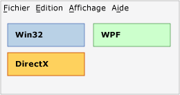
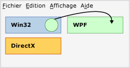
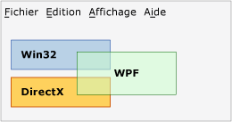
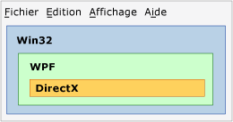
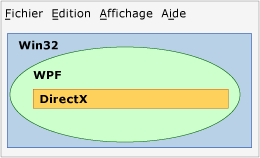

# Vue d&#39;ensemble des r&#233;gions de technologie
Si plusieurs technologies de présentation sont utilisées dans une application, telles que WPF, Win32 ou DirectX, elles doivent partager les zones de rendu dans une fenêtre de niveau supérieur commune.  Cette rubrique décrit les problèmes qui peuvent influencer la présentation et la saisie pour votre application d'interopérabilité WPF.  
  
## Régions  
 Dans une fenêtre de niveau supérieur, vous pouvez conceptualiser le fait que chaque HWND qui comprend l'une des technologies d'une application d'interopérabilité dispose de sa propre région \(ou « espace de rendu »\).  Chaque pixel de la fenêtre appartient exactement à un HWND, qui constitue la région de ce HWND.  \(À proprement parler, il existe plusieurs régions [!INCLUDE[TLA2#tla_winclient](../../../../includes/tla2sharptla-winclient-md.md)] s'il existe plusieurs HWND [!INCLUDE[TLA2#tla_winclient](../../../../includes/tla2sharptla-winclient-md.md)], mais pour les besoins de cette discussion, vous pouvez supposer qu'il n'en existe qu'une seule\).  Le concept de région implique que toutes les couches ou autres fenêtres qui tentent de restituer au\-dessus de ce pixel pendant la durée de vie d'application doivent faire partie de la même technologie de niveau de rendu.  En tentant de restituer des pixels [!INCLUDE[TLA2#tla_winclient](../../../../includes/tla2sharptla-winclient-md.md)] sur [!INCLUDE[TLA2#tla_win32](../../../../includes/tla2sharptla-win32-md.md)], vous obtenez des résultats indésirables. Cette opération est rejetée autant que possible dans les [!INCLUDE[TLA2#tla_api#plural](../../../../includes/tla2sharptla-apisharpplural-md.md)] d'interopérabilité.  
  
### Exemples de région  
 L'illustration suivante montre une application qui mélange [!INCLUDE[TLA2#tla_win32](../../../../includes/tla2sharptla-win32-md.md)], [!INCLUDE[TLA2#tla_dx](../../../../includes/tla2sharptla-dx-md.md)] et [!INCLUDE[TLA2#tla_winclient](../../../../includes/tla2sharptla-winclient-md.md)].  Chaque technologie utilise son propre jeu séparé non superposé de pixels et la région ne pose aucun problème.  
  
   
  
 Supposez que cette application utilise la position du pointeur de la souris pour créer une animation qui tente de s'afficher dans l'une de ces trois régions.  Quelle que soit la technologie responsable de l'animation elle\-même, cette technologie viole la région des deux autres.  L'illustration suivante montre une tentative de rendu d'un cercle WPF dans une région Win32.  
  
   
  
 Autre violation : vous essayez d'utiliser la transparence\/fusion alpha entre des technologies différentes.  Dans l'illustration suivante, la zone [!INCLUDE[TLA2#tla_winclient](../../../../includes/tla2sharptla-winclient-md.md)] viole les régions [!INCLUDE[TLA2#tla_win32](../../../../includes/tla2sharptla-win32-md.md)] et [!INCLUDE[TLA2#tla_dx](../../../../includes/tla2sharptla-dx-md.md)].  Comme les pixels de cette zone [!INCLUDE[TLA2#tla_winclient](../../../../includes/tla2sharptla-winclient-md.md)] sont semi\-transparents, ils devraient être possédés conjointement par [!INCLUDE[TLA2#tla_dx](../../../../includes/tla2sharptla-dx-md.md)] et [!INCLUDE[TLA2#tla_winclient](../../../../includes/tla2sharptla-winclient-md.md)], ce qui n'est pas possible.  Il existe donc une autre violation et la génération est impossible.  
  
   
  
 Les trois exemples précédents ont utilisé des régions rectangulaires, mais les différentes formes sont possibles.  Par exemple, une région peut présenter un trou.  L'illustration suivante montre une région [!INCLUDE[TLA2#tla_win32](../../../../includes/tla2sharptla-win32-md.md)] avec un trou rectangulaire de la taille des régions [!INCLUDE[TLA2#tla_winclient](../../../../includes/tla2sharptla-winclient-md.md)] et [!INCLUDE[TLA2#tla_dx](../../../../includes/tla2sharptla-dx-md.md)] combinées.  
  
   
  
 Les régions peuvent également prendre une forme totalement non rectangulaire ou toute forme pouvant être décrite par un HRGN [!INCLUDE[TLA2#tla_win32](../../../../includes/tla2sharptla-win32-md.md)] \(région\).  
  
   
  
## Transparence et fenêtres de niveau supérieur  
 Le gestionnaire de fenêtrage Windows ne traite vraiment que les HWDN [!INCLUDE[TLA2#tla_win32](../../../../includes/tla2sharptla-win32-md.md)].  Par conséquent, chaque <xref:System.Windows.Window> [!INCLUDE[TLA2#tla_winclient](../../../../includes/tla2sharptla-winclient-md.md)] est un HWND.  Le HWND <xref:System.Windows.Window> doit se conformer aux règles générales de tout HWND.  Dans ce HWND, le code [!INCLUDE[TLA2#tla_winclient](../../../../includes/tla2sharptla-winclient-md.md)] peut faire tout ce que les [!INCLUDE[TLA2#tla_api#plural](../../../../includes/tla2sharptla-apisharpplural-md.md)] [!INCLUDE[TLA2#tla_winclient](../../../../includes/tla2sharptla-winclient-md.md)] prennent en charge.  En revanche, pour les interactions avec d'autres HWND sur le Bureau, [!INCLUDE[TLA2#tla_winclient](../../../../includes/tla2sharptla-winclient-md.md)] doit se conformer aux règles de traitement et de rendu de [!INCLUDE[TLA2#tla_win32](../../../../includes/tla2sharptla-win32-md.md)].  [!INCLUDE[TLA2#tla_winclient](../../../../includes/tla2sharptla-winclient-md.md)] prend en charge les fenêtres non rectangulaires à l'aide des [!INCLUDE[TLA2#tla_win32](../../../../includes/tla2sharptla-win32-md.md)] [!INCLUDE[TLA2#tla_api#plural](../../../../includes/tla2sharptla-apisharpplural-md.md)] \(des HRGN pour des fenêtres non rectangulaires et des fenêtres superposées pour un alpha par pixel\).  
  
 La valeur alpha constante et les clés de couleur ne sont pas prises en charge.  Les fonctions de fenêtre superposée [!INCLUDE[TLA2#tla_win32](../../../../includes/tla2sharptla-win32-md.md)] varient selon la plateforme.  
  
 Les fenêtres superposées peuvent rendre toute la fenêtre translucide \(semi\-transparente\) en spécifiant une valeur alpha à appliquer à chaque pixel de la fenêtre.  \(En fait, [!INCLUDE[TLA2#tla_win32](../../../../includes/tla2sharptla-win32-md.md)] prend en charge l'alpha par pixel, mais il est très difficile à utiliser dans les programmes pratiques car, dans ce mode, vous devez dessiner vous\-même tous les enfants HWND, y compris les boîtes de dialogue et les menus déroulants\).  
  
 [!INCLUDE[TLA2#tla_winclient](../../../../includes/tla2sharptla-winclient-md.md)] prend en charge les HRGN. Il n'existe toutefois pas d'[!INCLUDE[TLA2#tla_api#plural](../../../../includes/tla2sharptla-apisharpplural-md.md)] managées pour ces fonctionnalités.  Vous pouvez utiliser l'appel de code non managé et <xref:System.Windows.Interop.HwndSource> pour appeler les [!INCLUDE[TLA2#tla_api#plural](../../../../includes/tla2sharptla-apisharpplural-md.md)] [!INCLUDE[TLA2#tla_win32](../../../../includes/tla2sharptla-win32-md.md)] appropriées.  Pour plus d'informations, consultez [Appel à des fonctions natives à partir de code managé](../Topic/Calling%20Native%20Functions%20from%20Managed%20Code.md).  
  
 Les fenêtres [!INCLUDE[TLA2#tla_winclient](../../../../includes/tla2sharptla-winclient-md.md)] superposées ont des fonctions différentes sur des systèmes d'exploitation différents.  Cela est dû au fait que [!INCLUDE[TLA2#tla_winclient](../../../../includes/tla2sharptla-winclient-md.md)] utilise [!INCLUDE[TLA2#tla_dx](../../../../includes/tla2sharptla-dx-md.md)] pour s'afficher, et que les fenêtres superposées ont été principalement conçues pour le rendu de [!INCLUDE[TLA2#tla_gdi](../../../../includes/tla2sharptla-gdi-md.md)], pas de [!INCLUDE[TLA2#tla_dx](../../../../includes/tla2sharptla-dx-md.md)].  
  
-   [!INCLUDE[TLA2#tla_winclient](../../../../includes/tla2sharptla-winclient-md.md)] prend en charge les fenêtres superposées accélérées par le matériel sur [!INCLUDE[TLA#tla_longhorn](../../../../includes/tlasharptla-longhorn-md.md)] et versions ultérieures.  Comme les fenêtres superposées accélérées par le matériel sur [!INCLUDE[TLA2#tla_winxp](../../../../includes/tla2sharptla-winxp-md.md)] requièrent la prise en charge de [!INCLUDE[TLA#tla_dx](../../../../includes/tlasharptla-dx-md.md)], les fonctions dépendront de la version de [!INCLUDE[TLA#tla_dx](../../../../includes/tlasharptla-dx-md.md)] sur cet ordinateur.  
  
-   [!INCLUDE[TLA2#tla_winclient](../../../../includes/tla2sharptla-winclient-md.md)] ne prend pas en charge les clés de couleur de transparence car il ne peut pas garantir de rendre la couleur exacte demandée, surtout lorsque le rendu est accéléré par le matériel.  
  
-   Si votre application est exécutée sur [!INCLUDE[TLA2#tla_winxp](../../../../includes/tla2sharptla-winxp-md.md)], les fenêtres superposées sur des surfaces [!INCLUDE[TLA2#tla_dx](../../../../includes/tla2sharptla-dx-md.md)] scintillent lors du rendu de l'application [!INCLUDE[TLA2#tla_dx](../../../../includes/tla2sharptla-dx-md.md)].  \(La séquence de rendu réelle est la suivante : [!INCLUDE[TLA#tla_gdi](../../../../includes/tlasharptla-gdi-md.md)] masque la fenêtre superposée, puis [!INCLUDE[TLA2#tla_dx](../../../../includes/tla2sharptla-dx-md.md)] dessine, puis [!INCLUDE[TLA#tla_gdi](../../../../includes/tlasharptla-gdi-md.md)] remet la fenêtre superposée.\)  Les fenêtres superposées non\-[!INCLUDE[TLA2#tla_winclient](../../../../includes/tla2sharptla-winclient-md.md)] connaissent également cette limitation.  
  
## Voir aussi  
 [Interopérabilité WPF et Win32](../../../../docs/framework/wpf/advanced/wpf-and-win32-interoperation.md)   
 [Procédure pas à pas : hébergement d'un WPF Clock dans Win32](../../../../docs/framework/wpf/advanced/walkthrough-hosting-a-wpf-clock-in-win32.md)   
 [Hébergement de contenu Win32 dans WPF](../../../../docs/framework/wpf/advanced/hosting-win32-content-in-wpf.md)