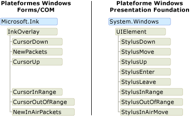
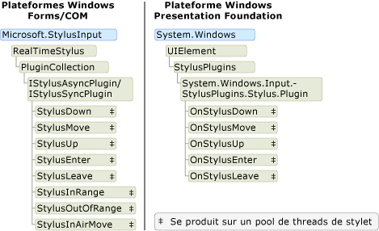

# Modèle objet encre : Windows Forms et COM ou WPFThe Ink Object Model: Windows Forms and COM versus WPF

Il existe essentiellement trois plateformes qui prennent en charge de l’encre numérique : la plateforme Tablet PC Windows Forms, la plateforme Tablet PC COM et le [!INCLUDE[TLA#tla_wpf](../../../../includes/tlasharptla-wpf-md.md)] plateforme.There are essentially three platforms that support digital ink: the Tablet PC Windows Forms platform, the Tablet PC COM platform, and the [!INCLUDE[TLA#tla_wpf](../../../../includes/tlasharptla-wpf-md.md)] platform.  Le partage de plateformes Windows Forms et COM, un modèle objet semblable, mais le modèle objet pour la [!INCLUDE[TLA2#tla_wpf](../../../../includes/tla2sharptla-wpf-md.md)] plate-forme est très différente.The Windows Forms and COM platforms share a similar object model, but the object model for the [!INCLUDE[TLA2#tla_wpf](../../../../includes/tla2sharptla-wpf-md.md)] platform is substantially different.  Cette rubrique explique les différences à un niveau élevé pour que les développeurs qui ont travaillé avec un modèle objet peuvent de mieux comprendre l’autre.This topic discusses the differences at a high-level so that developers that have worked with one object model can better understand the other.  
  
## Activation d’encre dans une ApplicationEnabling Ink in an Application  
 Les trois plateformes fournissent des objets et des contrôles qui permettent à une application recevoir une entrée d’un stylet.All three platforms ship objects and controls that enable an application to receive input from a tablet pen.  Les plateformes de COM et Windows Forms sont fournis avec [Microsoft.Ink.InkPicture](https://msdn.microsoft.com/library/aa514604.aspx), [Microsoft.Ink.InkEdit](https://msdn.microsoft.com/library/ms835842.aspx), [Microsoft.Ink.InkOverlay](https://msdn.microsoft.com/library/ms833057.aspx) et [ Microsoft.Ink.InkCollector](https://msdn.microsoft.com/library/ms836493.aspx) classes.The Windows Forms and COM platforms ship with [Microsoft.Ink.InkPicture](https://msdn.microsoft.com/library/aa514604.aspx), [Microsoft.Ink.InkEdit](https://msdn.microsoft.com/library/ms835842.aspx), [Microsoft.Ink.InkOverlay](https://msdn.microsoft.com/library/ms833057.aspx) and [Microsoft.Ink.InkCollector](https://msdn.microsoft.com/library/ms836493.aspx) classes.  [Microsoft.Ink.InkPicture](https://msdn.microsoft.com/library/aa514604.aspx) et [Microsoft.Ink.InkEdit](https://msdn.microsoft.com/library/ms835842.aspx) sont des contrôles que vous pouvez ajouter à une application pour collecter de l’encre.[Microsoft.Ink.InkPicture](https://msdn.microsoft.com/library/aa514604.aspx) and [Microsoft.Ink.InkEdit](https://msdn.microsoft.com/library/ms835842.aspx) are controls that you can add to an application to collect ink.  Le [Microsoft.Ink.InkOverlay](https://msdn.microsoft.com/library/ms833057.aspx) et [Microsoft.Ink.InkCollector](https://msdn.microsoft.com/library/ms836493.aspx) peuvent être attachés à une fenêtre existante pour activer la prise en charge windows et des contrôles personnalisés.The [Microsoft.Ink.InkOverlay](https://msdn.microsoft.com/library/ms833057.aspx) and [Microsoft.Ink.InkCollector](https://msdn.microsoft.com/library/ms836493.aspx) can be attached to an existing window to ink-enable windows and custom controls.  
  
 La plateforme WPF inclut le <xref:System.Windows.Controls.InkCanvas> contrôle.The WPF platform includes the <xref:System.Windows.Controls.InkCanvas> control.  Vous pouvez ajouter un <xref:System.Windows.Controls.InkCanvas> à votre application et commencer à collecter l’encre immédiatement.You can add an <xref:System.Windows.Controls.InkCanvas> to your application and begin collecting ink immediately. Avec la <xref:System.Windows.Controls.InkCanvas>, l’utilisateur peut copier, sélectionner et redimensionner l’encre.With the <xref:System.Windows.Controls.InkCanvas>, the user can copy, select, and resize ink.  Vous pouvez ajouter d’autres contrôles à le <xref:System.Windows.Controls.InkCanvas>, et l’utilisateur peut écrire à la main sur ces contrôles.You can add other controls to the <xref:System.Windows.Controls.InkCanvas>, and the user can handwrite over those controls, too.  Vous pouvez créer un contrôle personnalisé d’encre compatible en ajoutant une <xref:System.Windows.Controls.InkPresenter> et en collectant ses points de stylet.You can create an ink-enabled custom control by adding an <xref:System.Windows.Controls.InkPresenter> to it and collecting its stylus points.  
  
 Le tableau suivant répertorie les emplacements pour en savoir plus sur l’activation d’encre dans une application :The following table lists where to learn more about enabling ink in an application:  
  
|Pour ce faire...To do this…|Sur la plateforme WPF...On the WPF Platform…|Sur les plateformes Windows Forms/COM chargées...On the Windows Forms/COM Platforms…|  
|-----------------|--------------------------|------------------------------------------|  
|Ajouter un contrôle manuscrite à une applicationAdd an ink-enabled control to an application|Consultez [prise en main d’encre](../../../../docs/framework/wpf/advanced/getting-started-with-ink.md).See [Getting Started with Ink](../../../../docs/framework/wpf/advanced/getting-started-with-ink.md).|Consultez [automatique revendications forment l’exemple](http://msdn.microsoft.com/bec4333a-62ca-4254-a39b-04bc2c556992)See [Auto Claims Form Sample](http://msdn.microsoft.com/bec4333a-62ca-4254-a39b-04bc2c556992)|  
|Activer l’encre sur un contrôle personnaliséEnable ink on a custom control|Consultez [création d’une prise en charge d’entrée de contrôle](../../../../docs/framework/wpf/advanced/creating-an-ink-input-control.md).See [Creating an Ink Input Control](../../../../docs/framework/wpf/advanced/creating-an-ink-input-control.md).|Consultez [d’encre Presse-papiers exemple](http://msdn.microsoft.com/a0c42f1c-543d-44f8-83d9-fe810de410ff).See [Ink Clipboard Sample](http://msdn.microsoft.com/a0c42f1c-543d-44f8-83d9-fe810de410ff).|  
  
## Données d’entrée manuscriteInk Data  
 Sur les plateformes de COM et Windows Forms [Microsoft.Ink.InkCollector](https://msdn.microsoft.com/library/ms836493.aspx), [Microsoft.Ink.InkOverlay](https://msdn.microsoft.com/library/ms833057.aspx), [Microsoft.Ink.InkEdit](https://msdn.microsoft.com/library/ms835842.aspx), et [ Microsoft.Ink.InkPicture](https://msdn.microsoft.com/library/aa514604.aspx) chaque exposent un [Microsoft.Ink.Ink](https://msdn.microsoft.com/library/aa515768.aspx?displayProperty=nameWithType) objet.On the Windows Forms and COM platforms, [Microsoft.Ink.InkCollector](https://msdn.microsoft.com/library/ms836493.aspx), [Microsoft.Ink.InkOverlay](https://msdn.microsoft.com/library/ms833057.aspx), [Microsoft.Ink.InkEdit](https://msdn.microsoft.com/library/ms835842.aspx), and [Microsoft.Ink.InkPicture](https://msdn.microsoft.com/library/aa514604.aspx) each expose a [Microsoft.Ink.Ink](https://msdn.microsoft.com/library/aa515768.aspx?displayProperty=nameWithType) object. Le [Microsoft.Ink.Ink](https://msdn.microsoft.com/library/aa515768.aspx) objet contient les données pour un ou plusieurs [Microsoft.Ink.Stroke](https://msdn.microsoft.com/library/ms827842.aspx?displayProperty=nameWithType) des objets et expose des méthodes et des propriétés pour gérer et manipuler ces traits communes.The [Microsoft.Ink.Ink](https://msdn.microsoft.com/library/aa515768.aspx) object contains the data for one or more [Microsoft.Ink.Stroke](https://msdn.microsoft.com/library/ms827842.aspx?displayProperty=nameWithType) objects and exposes common methods and properties to manage and manipulate those strokes.  Le [Microsoft.Ink.Ink](https://msdn.microsoft.com/library/aa515768.aspx) objet gère la durée de vie des traits qu’elle contient ; le [Microsoft.Ink.Ink](https://msdn.microsoft.com/library/aa515768.aspx) objet crée et supprime les traits qu’il détient.The [Microsoft.Ink.Ink](https://msdn.microsoft.com/library/aa515768.aspx) object manages the lifetime of the strokes it contains; the [Microsoft.Ink.Ink](https://msdn.microsoft.com/library/aa515768.aspx) object creates and deletes the strokes that it owns.  Chaque [Microsoft.Ink.Stroke](https://msdn.microsoft.com/library/ms827842.aspx) a un identificateur qui est unique au sein de son parent [Microsoft.Ink.Ink](https://msdn.microsoft.com/library/aa515768.aspx) objet.Each [Microsoft.Ink.Stroke](https://msdn.microsoft.com/library/ms827842.aspx) has an identifier that is unique within its parent [Microsoft.Ink.Ink](https://msdn.microsoft.com/library/aa515768.aspx) object.  
  
 Sur la plateforme WPF, la <xref:System.Windows.Ink.Stroke?displayProperty=nameWithType> classe possède et gère son propre durée de vie.On the WPF platform, the <xref:System.Windows.Ink.Stroke?displayProperty=nameWithType> class owns and manages its own lifetime. Un groupe de <xref:System.Windows.Ink.Stroke> objets peuvent être regroupés dans un <xref:System.Windows.Ink.StrokeCollection>, qui fournit des opérations de gestion des données méthodes pour encre communes telles qu’atteint test, de suppression, de transformation et de sérialisation de l’encre.A group of <xref:System.Windows.Ink.Stroke> objects can be collected together in a <xref:System.Windows.Ink.StrokeCollection>, which provides methods for common ink data management operations such as hit testing, erasing, transforming, and serializing the ink. A <xref:System.Windows.Ink.Stroke> peut appartenir à zéro, une ou plusieurs <xref:System.Windows.Ink.StrokeCollection> tous les objets que le temps.A <xref:System.Windows.Ink.Stroke> can belong to zero, one, or more <xref:System.Windows.Ink.StrokeCollection> objects at any give time.  Au lieu d’avoir un [Microsoft.Ink.Ink](https://msdn.microsoft.com/library/aa515768.aspx?displayProperty=nameWithType) objet, le <xref:System.Windows.Controls.InkCanvas> et <xref:System.Windows.Controls.InkPresenter> contiennent un <xref:System.Windows.Ink.StrokeCollection?displayProperty=nameWithType>.Instead of having a [Microsoft.Ink.Ink](https://msdn.microsoft.com/library/aa515768.aspx?displayProperty=nameWithType) object, the <xref:System.Windows.Controls.InkCanvas> and <xref:System.Windows.Controls.InkPresenter> contain a <xref:System.Windows.Ink.StrokeCollection?displayProperty=nameWithType>.  
  
 La paire d’illustrations suivante compare les modèles d’objet de données d’encre.The following pair of illustrations compares the ink data object models.  Sur les Windows Forms et les plateformes de COM, le [Microsoft.Ink.Ink](https://msdn.microsoft.com/library/aa515768.aspx?displayProperty=nameWithType) objet contraint la durée de vie de la [Microsoft.Ink.Stroke](https://msdn.microsoft.com/library/ms827842.aspx?displayProperty=nameWithType) objets et les paquets de stylet appartiennent aux traits individuels.On the Windows Forms and COM platforms, the [Microsoft.Ink.Ink](https://msdn.microsoft.com/library/aa515768.aspx?displayProperty=nameWithType) object constrains the lifetime of the [Microsoft.Ink.Stroke](https://msdn.microsoft.com/library/ms827842.aspx?displayProperty=nameWithType) objects, and the stylus packets belong to the individual strokes.  Deux ou plusieurs traits peuvent référencer le même [Microsoft.Ink.DrawingAttributes](https://msdn.microsoft.com/library/ms837931.aspx?displayProperty=nameWithType) de l’objet, comme indiqué dans l’illustration suivante.Two or more strokes can reference the same [Microsoft.Ink.DrawingAttributes](https://msdn.microsoft.com/library/ms837931.aspx?displayProperty=nameWithType) object, as shown in the following illustration.  
  
 ![Diagramme du modèle d’objet manuscrit pour COM &#47; WinForms. ] (../../../../docs/framework/wpf/advanced/media/ink-inkownsstrokes.png "Ink_InkOwnsStrokes")  
  
 Sur le [!INCLUDE[TLA2#tla_winclient](../../../../includes/tla2sharptla-winclient-md.md)], chaque <xref:System.Windows.Ink.Stroke?displayProperty=nameWithType> est un objet du common language runtime qui existe tant que quelque chose a une référence à celui-ci.On the [!INCLUDE[TLA2#tla_winclient](../../../../includes/tla2sharptla-winclient-md.md)], each <xref:System.Windows.Ink.Stroke?displayProperty=nameWithType> is a common language runtime object that exists as long as something has a reference to it.  Chaque <xref:System.Windows.Ink.Stroke> références un <xref:System.Windows.Input.StylusPointCollection> et <xref:System.Windows.Ink.DrawingAttributes?displayProperty=nameWithType> objet, qui sont également des objets common language runtime.Each <xref:System.Windows.Ink.Stroke> references a <xref:System.Windows.Input.StylusPointCollection> and <xref:System.Windows.Ink.DrawingAttributes?displayProperty=nameWithType> object, which are also common language runtime objects.  
  
 ![Diagramme du modèle d’objet manuscrit pour WPF. ] (../../../../docs/framework/wpf/advanced/media/ink-wpfinkobjectmodel.png "Ink_WPFInkObjectModel")  
  
 Le tableau suivant compare la façon d’accomplir certaines tâches courantes sur les [!INCLUDE[TLA2#tla_wpf](../../../../includes/tla2sharptla-wpf-md.md)] plate-forme et les plateformes COM et Windows Forms.The following table compares how to accomplish some common tasks on the [!INCLUDE[TLA2#tla_wpf](../../../../includes/tla2sharptla-wpf-md.md)] platform and the Windows Forms and COM platforms.  
  
|TâcheTask|Windows Presentation FoundationWindows Presentation Foundation|COM et Windows FormsWindows Forms and COM|  
|----------|-------------------------------------|---------------------------|  
|Économiser de l’encreSave Ink|<xref:System.Windows.Ink.StrokeCollection.Save%2A>|[Microsoft.Ink.Ink.Save](https://technet.microsoft.com/library/security/microsoft.ink.ink.save(v=vs.90))[Microsoft.Ink.Ink.Save](https://technet.microsoft.com/library/security/microsoft.ink.ink.save(v=vs.90))|  
|Prise en charge de la chargeLoad Ink|Créer un <xref:System.Windows.Ink.StrokeCollection> avec la <xref:System.Windows.Ink.StrokeCollection.%23ctor%2A> constructeur.Create a <xref:System.Windows.Ink.StrokeCollection> with the <xref:System.Windows.Ink.StrokeCollection.%23ctor%2A> constructor.|[Microsoft.Ink.Ink.Load](https://msdn.microsoft.com/library/microsoft.ink.ink.load(v=vs.90).aspx)[Microsoft.Ink.Ink.Load](https://msdn.microsoft.com/library/microsoft.ink.ink.load(v=vs.90).aspx)|  
|Test de positionnementHit test|<xref:System.Windows.Ink.StrokeCollection.HitTest%2A>|[Microsoft.Ink.Ink.HitTestMicrosoft.Ink.Ink.HitTest](https://msdn.microsoft.com/library/aa515934.aspx)|  
|Copier l’entrée manuscriteCopy Ink|<xref:System.Windows.Controls.InkCanvas.CopySelection%2A>|[Microsoft.Ink.Ink.ClipboardCopy](https://msdn.microsoft.com/library/microsoft.ink.ink.clipboardcopy(v=vs.100).aspx)[Microsoft.Ink.Ink.ClipboardCopy](https://msdn.microsoft.com/library/microsoft.ink.ink.clipboardcopy(v=vs.100).aspx)|  
|Collez une entrée manuscritePaste Ink|<xref:System.Windows.Controls.InkCanvas.Paste%2A>|[Microsoft.Ink.Ink.ClipboardPaste](https://msdn.microsoft.com/library/microsoft.ink.ink.clipboardpaste(v=vs.100).aspx)[Microsoft.Ink.Ink.ClipboardPaste](https://msdn.microsoft.com/library/microsoft.ink.ink.clipboardpaste(v=vs.100).aspx)|  
|Propriétés personnalisées de l’accès sur une collection de traitsAccess custom properties on a collection of strokes|<xref:System.Windows.Ink.StrokeCollection.AddPropertyData%2A>(les propriétés sont stockées en interne et accessibles via <xref:System.Windows.Ink.StrokeCollection.AddPropertyData%2A>, <xref:System.Windows.Ink.StrokeCollection.RemovePropertyData%2A>, et <xref:System.Windows.Ink.StrokeCollection.ContainsPropertyData%2A>)<xref:System.Windows.Ink.StrokeCollection.AddPropertyData%2A> (the properties are stored internally and accessed via <xref:System.Windows.Ink.StrokeCollection.AddPropertyData%2A>, <xref:System.Windows.Ink.StrokeCollection.RemovePropertyData%2A>, and <xref:System.Windows.Ink.StrokeCollection.ContainsPropertyData%2A>)|Utilisez [Microsoft.Ink.Ink.ExtendedProperties](https://msdn.microsoft.com/library/microsoft.ink.ink.extendedproperties(v=vs.100).aspx)Use [Microsoft.Ink.Ink.ExtendedProperties](https://msdn.microsoft.com/library/microsoft.ink.ink.extendedproperties(v=vs.100).aspx)|  
  
### Partage d’encre entre les plateformesSharing ink between platforms  
 Bien que les plateformes aient des modèles objet différents pour les données de l’encre, il est très facile de partager les données entre les plateformes.Although the platforms have different object models for the ink data, sharing the data between the platforms is very easy. Les exemples suivants enregistrent l’encre d’une application Windows Forms et chargent l’encre dans une application Windows Presentation Foundation.The following examples save ink from a Windows Forms application and load the ink into a Windows Presentation Foundation application.  
  
 [!code-csharp[WinFormWPFInk#UsingWinforms](../../../../samples/snippets/csharp/VS_Snippets_Wpf/WinformWPFInk/CSharp/Program.cs#usingwinforms)]
 [!code-vb[WinFormWPFInk#UsingWinforms](../../../../samples/snippets/visualbasic/VS_Snippets_Wpf/WinformWPFInk/VisualBasic/Module1.vb#usingwinforms)]  
[!code-csharp[WinFormWPFInk#SaveWinforms](../../../../samples/snippets/csharp/VS_Snippets_Wpf/WinformWPFInk/CSharp/Program.cs#savewinforms)]
[!code-vb[WinFormWPFInk#SaveWinforms](../../../../samples/snippets/visualbasic/VS_Snippets_Wpf/WinformWPFInk/VisualBasic/Module1.vb#savewinforms)]  
  
 [!code-csharp[WinFormWPFInk#UsingWPF](../../../../samples/snippets/csharp/VS_Snippets_Wpf/WinformWPFInk/CSharp/Program.cs#usingwpf)]
 [!code-vb[WinFormWPFInk#UsingWPF](../../../../samples/snippets/visualbasic/VS_Snippets_Wpf/WinformWPFInk/VisualBasic/Module1.vb#usingwpf)]  
[!code-csharp[WinFormWPFInk#LoadWPF](../../../../samples/snippets/csharp/VS_Snippets_Wpf/WinformWPFInk/CSharp/Program.cs#loadwpf)]
[!code-vb[WinFormWPFInk#LoadWPF](../../../../samples/snippets/visualbasic/VS_Snippets_Wpf/WinformWPFInk/VisualBasic/Module1.vb#loadwpf)]  
  
 Les exemples suivants enregistrent l’encre d’une application Windows Presentation Foundation et chargent l’encre dans une application Windows Forms.The following examples save ink from a Windows Presentation Foundation application and load the ink into a Windows Forms application.  
  
 [!code-csharp[WinFormWPFInk#UsingWPF](../../../../samples/snippets/csharp/VS_Snippets_Wpf/WinformWPFInk/CSharp/Program.cs#usingwpf)]
 [!code-vb[WinFormWPFInk#UsingWPF](../../../../samples/snippets/visualbasic/VS_Snippets_Wpf/WinformWPFInk/VisualBasic/Module1.vb#usingwpf)]  
[!code-csharp[WinFormWPFInk#SaveWPF](../../../../samples/snippets/csharp/VS_Snippets_Wpf/WinformWPFInk/CSharp/Program.cs#savewpf)]
[!code-vb[WinFormWPFInk#SaveWPF](../../../../samples/snippets/visualbasic/VS_Snippets_Wpf/WinformWPFInk/VisualBasic/Module1.vb#savewpf)]  
  
 [!code-csharp[WinFormWPFInk#UsingWinforms](../../../../samples/snippets/csharp/VS_Snippets_Wpf/WinformWPFInk/CSharp/Program.cs#usingwinforms)]
 [!code-vb[WinFormWPFInk#UsingWinforms](../../../../samples/snippets/visualbasic/VS_Snippets_Wpf/WinformWPFInk/VisualBasic/Module1.vb#usingwinforms)]  
[!code-csharp[WinFormWPFInk#LoadWinforms](../../../../samples/snippets/csharp/VS_Snippets_Wpf/WinformWPFInk/CSharp/Program.cs#loadwinforms)]
[!code-vb[WinFormWPFInk#LoadWinforms](../../../../samples/snippets/visualbasic/VS_Snippets_Wpf/WinformWPFInk/VisualBasic/Module1.vb#loadwinforms)]
## Événements du styletEvents from the Tablet Pen  
 Le [Microsoft.Ink.InkOverlay](https://msdn.microsoft.com/library/ms833057.aspx), [Microsoft.Ink.InkCollector](https://msdn.microsoft.com/library/ms836493.aspx), et [Microsoft.Ink.InkPicture](https://msdn.microsoft.com/library/aa514604.aspx) sur les Windows Forms et COM plateformes recevoir des événements lorsque l’utilisateur entrées de stylet de données.The [Microsoft.Ink.InkOverlay](https://msdn.microsoft.com/library/ms833057.aspx), [Microsoft.Ink.InkCollector](https://msdn.microsoft.com/library/ms836493.aspx), and [Microsoft.Ink.InkPicture](https://msdn.microsoft.com/library/aa514604.aspx) on the Windows Forms and COM platforms receive events when the user inputs pen data.  Le [Microsoft.Ink.InkOverlay](https://msdn.microsoft.com/library/ms833057.aspx) ou [Microsoft.Ink.InkCollector](https://msdn.microsoft.com/library/ms836493.aspx) est attaché à une fenêtre ou un contrôle et peuvent s’abonner aux événements déclenchés par les données d’entrée de tablette.The [Microsoft.Ink.InkOverlay](https://msdn.microsoft.com/library/ms833057.aspx) or [Microsoft.Ink.InkCollector](https://msdn.microsoft.com/library/ms836493.aspx) is attached to a window or a control, and can subscribe to the events raised by the tablet input data.  Le thread sur lequel ces événements se produit dépend si les événements sont déclenchés avec un stylet, une souris, ou par programme.The thread on which these events occurs depends on whether the events are raised with a pen, a mouse, or programmatically.  Pour plus d’informations sur les threads par rapport à ces événements, consultez [considérations générales de Threading](http://msdn.microsoft.com/cf35724f-5f80-4b3e-992a-a9d5ea99aae9) et [Threads sur ce qui peut déclencher un événement](http://msdn.microsoft.com/d1a5ab9b-d474-4ed7-9aa8-b5bdb771934f).For more information about threading in relation to these events, see [General Threading Considerations](http://msdn.microsoft.com/cf35724f-5f80-4b3e-992a-a9d5ea99aae9) and [Threads on Which an Event Can Fire](http://msdn.microsoft.com/d1a5ab9b-d474-4ed7-9aa8-b5bdb771934f).  
  
 Sur la plateforme Windows Presentation Foundation, la <xref:System.Windows.UIElement> classe a des événements pour l’entrée de stylet.On the Windows Presentation Foundation platform, the <xref:System.Windows.UIElement> class has events for pen input. Cela signifie que chaque contrôle expose l’ensemble des événements de stylet.This means that every control exposes the full set of stylus events.  Les événements de stylet ont des événements de tunneling/propagation paires et sont toujours effectuées sur le thread d’application.The stylus events have tunneling/bubbling event pairs and always occur on the application thread.  Pour plus d’informations, consultez [vue d’ensemble des événements routés](../../../../docs/framework/wpf/advanced/routed-events-overview.md).For more information, see [Routed Events Overview](../../../../docs/framework/wpf/advanced/routed-events-overview.md).  
  
 Le schéma suivant compare les modèles objet pour les classes qui déclenchent des événements de stylet.The following diagram shows compares the object models for the classes that raise stylus events. Le modèle objet Windows Presentation Foundation affiche uniquement les événements de propagation, pas les équivalents d’événements de tunneling.The Windows Presentation Foundation object model shows only the bubbling events, not the tunneling event counterparts.  
  
 ![Diagramme des événements de stylet dans WPF par rapport à Winforms. ] (../../../../docs/framework/wpf/advanced/media/ink-stylusevents.png "Ink_StylusEvents")  
  
## Données du styletPen Data  
 Les trois plateformes vous permettent d’intercepter et de manipuler les données qui proviennent du stylet.All three platforms provide you with ways to intercept and manipulate the data that comes in from a tablet pen.  Sur les plateformes Windows Forms et COM, ceci est obtenue en créant un [Microsoft.StylusInput.RealTimeStylus](https://msdn.microsoft.com/library/microsoft.stylusinput.realtimestylus(v=vs.100).aspx), l’attachement d’une fenêtre ou un contrôle à ce dernier et création d’une classe qui implémente le [ Microsoft.StylusInput.IStylusSyncPlugin](https://msdn.microsoft.com/library/microsoft.stylusinput.istylussyncplugin(v=vs.100).aspx) ou [Microsoft.StylusInput.IStylusAsyncPlugin](https://msdn.microsoft.com/library/microsoft.stylusinput.istylusasyncplugin(v=vs.100).aspx) interface.On the Windows Forms and COM Platforms, this is achieved by creating a [Microsoft.StylusInput.RealTimeStylus](https://msdn.microsoft.com/library/microsoft.stylusinput.realtimestylus(v=vs.100).aspx), attaching a window or control to it, and creating a class that implements the [Microsoft.StylusInput.IStylusSyncPlugin](https://msdn.microsoft.com/library/microsoft.stylusinput.istylussyncplugin(v=vs.100).aspx) or [Microsoft.StylusInput.IStylusAsyncPlugin](https://msdn.microsoft.com/library/microsoft.stylusinput.istylusasyncplugin(v=vs.100).aspx) interface. Le plug-in personnalisé est ensuite ajouté à la collection de plug-in de la [Microsoft.StylusInput.RealTimeStylus](https://msdn.microsoft.com/library/microsoft.stylusinput.realtimestylus(v=vs.100).aspx).The custom plug-in is then added to the plug-in collection of the [Microsoft.StylusInput.RealTimeStylus](https://msdn.microsoft.com/library/microsoft.stylusinput.realtimestylus(v=vs.100).aspx). Pour plus d’informations sur ce modèle objet, consultez [Architecture de the StylusInput APIs](http://msdn.microsoft.com/88bab0ab-df9f-4813-9a9f-9a137813f0b4).For more information about this object model, see [Architecture of the StylusInput APIs](http://msdn.microsoft.com/88bab0ab-df9f-4813-9a9f-9a137813f0b4).  
  
 Sur le [!INCLUDE[TLA2#tla_wpf](../../../../includes/tla2sharptla-wpf-md.md)] plateforme, le <xref:System.Windows.UIElement> classe expose une collection de plug-ins similaires dans la conception pour le [Microsoft.StylusInput.RealTimeStylus](https://msdn.microsoft.com/library/microsoft.stylusinput.realtimestylus(v=vs.100).aspx).On the [!INCLUDE[TLA2#tla_wpf](../../../../includes/tla2sharptla-wpf-md.md)] platform, the <xref:System.Windows.UIElement> class exposes a collection of plug-ins, similar in design to the [Microsoft.StylusInput.RealTimeStylus](https://msdn.microsoft.com/library/microsoft.stylusinput.realtimestylus(v=vs.100).aspx).  Pour intercepter les données de stylet, créez une classe qui hérite de <xref:System.Windows.Input.StylusPlugIns.StylusPlugIn> et ajouter cet objet à la <xref:System.Windows.UIElement.StylusPlugIns%2A> collection de la <xref:System.Windows.UIElement>.To intercept pen data, create a class that inherits from <xref:System.Windows.Input.StylusPlugIns.StylusPlugIn> and add the object to the <xref:System.Windows.UIElement.StylusPlugIns%2A> collection of the <xref:System.Windows.UIElement>. Pour plus d’informations sur cette interaction, consultez [interceptant l’entrée du stylet](../../../../docs/framework/wpf/advanced/intercepting-input-from-the-stylus.md).For more information about this interaction, see [Intercepting Input from the Stylus](../../../../docs/framework/wpf/advanced/intercepting-input-from-the-stylus.md).  
  
 Sur toutes les plateformes, un pool de threads reçoit les données de l’encre via des événements de stylet et l’envoie au thread d’application.On all platforms, a thread pool receives the ink data via stylus events and sends it to the application thread.  Pour plus d’informations concernant les threads sur les plateformes COM et Windows, consultez [Threading Considerations for the StylusInput APIs](http://msdn.microsoft.com/5d98768a-c60b-4bb0-8640-9bf38254d41f).For more information about threading on the COM and Windows Platforms, see [Threading Considerations for the StylusInput APIs](http://msdn.microsoft.com/5d98768a-c60b-4bb0-8640-9bf38254d41f).  Pour plus d’informations concernant les threads sur le logiciel de présentation de Windows, consultez [le modèle de thread d’encre](../../../../docs/framework/wpf/advanced/the-ink-threading-model.md).For more information about threading on the Windows Presentation Software, see [The Ink Threading Model](../../../../docs/framework/wpf/advanced/the-ink-threading-model.md).  
  
 L’illustration suivante compare les modèles objet pour les classes qui reçoivent des données de stylet sur le pool de threads de stylet.The following illustration compares the object models for the classes that receive pen data on the pen thread pool.  
  
 ![Diagramme de la StylusPlugIn dans modèle WPF par rapport à Winforms. ] (../../../../docs/framework/wpf/advanced/media/ink-stylusplugins.png "Ink_StylusPlugins")
