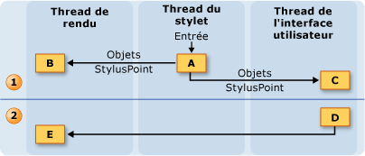
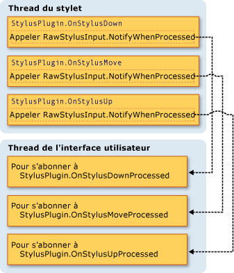

# Mod&#232;le de thread de l&#39;encre
L'un des avantages de l'encre dans un Tablet PC est que la sensation est presque la même que lorsqu'on écrit sur du papier avec un vrai crayon.  Pour cela, le stylet collecte les données d'entrée à un taux beaucoup plus élevé que ne le fait une souris et restitue l'encre lorsque l'utilisateur écrit.  Le thread de l'interface utilisateur de l'application n'est pas suffisant pour collecter les données du stylet et restituer l'encre car il peut se bloquer.  Pour résoudre ce problème, une application [!INCLUDE[TLA2#tla_winclient](../../../../includes/tla2sharptla-winclient-md.md)] utilise deux threads supplémentaires lorsqu'un utilisateur écrit avec de l'encre.  
  
 La liste suivante décrit les threads qui participent à la collecte et à la restitution de l'encre numérique :  
  
-   Thread du stylet : thread qui accepte la saisie du stylet.  \(En fait, il s'agit d'un pool de threads, mais dans cette rubrique, on l'appelle thread du stylet\).  
  
-   Thread de l'interface utilisateur d'une application : thread qui contrôle l'interface utilisateur de l'application.  
  
-   Thread de rendu dynamique : thread qui restitue l'encre lorsque l'utilisateur trace un trait.  Le thread de rendu dynamique est différent du thread qui restitue d'autres éléments d'interface pour l'application, comme mentionné dans le [Modèle de thread](../../../../docs/framework/wpf/advanced/threading-model.md) de Windows Presentation Foundation.  
  
 Le modèle d'encrage est le même, que l'application utilise le <xref:System.Windows.Controls.InkCanvas> ou un contrôle personnalisé similaire à celui présenté dans [Création d'un contrôle d'entrée d'encre](../../../../docs/framework/wpf/advanced/creating-an-ink-input-control.md).  Bien que cette rubrique étudie les threads en termes de <xref:System.Windows.Controls.InkCanvas>, les mêmes concepts s'appliquent lorsque vous créez un contrôle personnalisé.  
  
## Vue d'ensemble des threads  
 Le diagramme suivant illustre le modèle de thread lorsqu'un utilisateur trace un trait :  
  
   
  
1.  Actions effectuées lorsque l'utilisateur trace le trait  
  
    1.  Lorsque l'utilisateur trace un trait, les points du stylet arrivent sur le thread du stylet.  Les plug\-ins du stylet, y compris le <xref:System.Windows.Input.StylusPlugIns.DynamicRenderer>, acceptent les points du stylet sur le thread du stylet et peuvent les modifier avant que le <xref:System.Windows.Controls.InkCanvas> ne les reçoive.  
  
    2.  Le <xref:System.Windows.Input.StylusPlugIns.DynamicRenderer> restitue les points du stylet sur le thread de rendu dynamique.  Cela se produit au même moment que l'étape précédente.  
  
    3.  Le <xref:System.Windows.Controls.InkCanvas> reçoit les points du stylet sur le thread de l'interface utilisateur.  
  
2.  Actions effectuées après que l'utilisateur ait terminé le trait  
  
    1.  Lorsque l'utilisateur a terminé de tracer le trait, le <xref:System.Windows.Controls.InkCanvas> crée un objet <xref:System.Windows.Ink.Stroke> et l'ajoute au <xref:System.Windows.Controls.InkPresenter> qui le restitue de manière statique.  
  
    2.  Le thread de l'interface utilisateur informe le <xref:System.Windows.Input.StylusPlugIns.DynamicRenderer> que le trait est restitué de manière statique, de sorte que le <xref:System.Windows.Input.StylusPlugIns.DynamicRenderer> supprime la représentation visuelle du trait.  
  
## Plug\-ins de collection de l'encre et de stylet  
 Chaque <xref:System.Windows.UIElement> dispose d'un <xref:System.Windows.Input.StylusPlugIns.StylusPlugInCollection>.  Les objets <xref:System.Windows.Input.StylusPlugIns.StylusPlugIn> de <xref:System.Windows.Input.StylusPlugIns.StylusPlugInCollection> reçoivent et peuvent modifier les points du stylet sur le thread du stylet.  Les objets <xref:System.Windows.Input.StylusPlugIns.StylusPlugIn> reçoivent les points du stylet selon leur ordre dans <xref:System.Windows.Input.StylusPlugIns.StylusPlugInCollection>.  
  
 Le diagramme suivant illustre la situation hypothétique où la collection <xref:System.Windows.UIElement.StylusPlugIns%2A> d'un <xref:System.Windows.UIElement> contient `stylusPlugin1`, un <xref:System.Windows.Input.StylusPlugIns.DynamicRenderer>, et `stylusPlugin2`, dans cet ordre.  
  
   
  
 Dans le diagramme précédent, le comportement suivant est observé :  
  
1.  `StylusPlugin1` modifie les valeurs de x et y.  
  
2.  <xref:System.Windows.Input.StylusPlugIns.DynamicRenderer> reçoit les points modifiés du stylet et les restitue sur le thread de rendu dynamique.  
  
3.  `StylusPlugin2` reçoit les points modifiés du stylet, puis modifie les valeurs de x et y.  
  
4.  L'application collecte les points du stylet et, lorsque l'utilisateur a terminé son trait, restitue le trait de manière statique.  
  
 Supposez que `stylusPlugin1` restreint les points du stylet à un rectangle et que `stylusPlugin2` traduit les points du stylet vers la droite.  Dans le scénario précédent, le <xref:System.Windows.Input.StylusPlugIns.DynamicRenderer> reçoit les points du stylet restreints, mais pas les points du stylet traduits.  Lorsque l'utilisateur trace son trait, ce dernier est restitué dans les limites du rectangle, mais le trait ne semble pas traduit tant que l'utilisateur n'a pas soulevé le stylet.  
  
### Exécution d'opérations avec un plug\-in de stylet sur le thread de l'interface utilisateur  
 Étant donné que le test de recherche précis ne peut pas être exécuté sur le thread du stylet, certains éléments sont susceptibles de recevoir une entrée de stylet destinée à d'autres éléments.  Si vous devez vous assurer que l'entrée a été correctement routée avant d'exécuter une opération, abonnez\-vous et exécutez l'opération dans la méthode <xref:System.Windows.Input.StylusPlugIns.StylusPlugIn.OnStylusDownProcessed%2A>, <xref:System.Windows.Input.StylusPlugIns.StylusPlugIn.OnStylusMoveProcessed%2A> ou <xref:System.Windows.Input.StylusPlugIns.StylusPlugIn.OnStylusUpProcessed%2A>.  Ces méthodes sont appelées par le thread d'application après l'exécution du test de recherche précis.  Pour s'abonner à ces méthodes, appelez la méthode <xref:System.Windows.Input.StylusPlugIns.RawStylusInput.NotifyWhenProcessed%2A> dans la méthode qui a lieu sur le thread du stylet.  
  
 Le diagramme suivant illustre la relation entre le thread du stylet et le thread de l'interface utilisateur par rapport aux événements du stylet d'un <xref:System.Windows.Input.StylusPlugIns.StylusPlugIn>.  
  
   
  
## Restitution de l'encre  
 Lorsque l'utilisateur trace un trait, <xref:System.Windows.Input.StylusPlugIns.DynamicRenderer> restitue l'encre sur un thread séparé pour que l'encre semble « couler » du stylet même lorsque le thread de l'interface utilisateur est occupé.  Le <xref:System.Windows.Input.StylusPlugIns.DynamicRenderer> génère une arborescence visuelle sur le thread de rendu dynamique pendant qu'il collecte des points de stylet.  Lorsque l'utilisateur a terminé son trait, le <xref:System.Windows.Input.StylusPlugIns.DynamicRenderer> demande à être informé de la prochaine passe de rendu effectuée par l'application.  Une fois que l'application a terminé la passe de rendu suivante, le <xref:System.Windows.Input.StylusPlugIns.DynamicRenderer> nettoie son arborescence visuelle.  Le schéma suivant illustre ce processus.  
  
   
  
1.  L'utilisateur commence à tracer le trait.  
  
    1.  Le <xref:System.Windows.Input.StylusPlugIns.DynamicRenderer> crée l'arborescence visuelle.  
  
2.  L'utilisateur trace le trait.  
  
    1.  Le <xref:System.Windows.Input.StylusPlugIns.DynamicRenderer> génère l'arborescence visuelle.  
  
3.  L'utilisateur termine le trait.  
  
    1.  Le <xref:System.Windows.Controls.InkPresenter> ajoute le trait à son arborescence visuelle.  
  
    2.  Media Integration Layer \(MIL\) restitue les traits de manière statique.  
  
    3.  Le <xref:System.Windows.Input.StylusPlugIns.DynamicRenderer> nettoie les effets visuels.