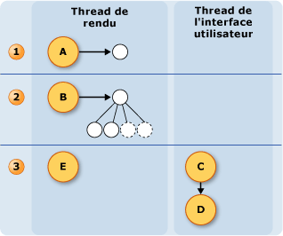

# Modèle de thread de l'encre
Un des avantages de l’encre sur un Tablet PC est qu’il semble beaucoup l’écriture avec un stylet régulière et un livre.  Pour ce faire, le stylet collecte les données d’entrée à un taux beaucoup plus important que la souris et restitue l’encre lorsque l’utilisateur écrit.  Thread d’interface utilisateur de l’application utilisateur n’est pas suffisant pour collecter les données du stylet et restituer l’encre car il peut se bloquer.  Pour résoudre ce problème, un [!INCLUDE[TLA2#tla_winclient](../../../../includes/tla2sharptla-winclient-md.md)] application utilise deux threads supplémentaires lorsqu’un utilisateur écrit d’encre.  
  
 La liste suivante décrit les threads qui participent à la collecte et le rendu de l’encre numérique :  
  
-   Thread de stylet : le thread qui accepte une entrée du stylet.  (En réalité, il s’agit d’un pool de threads, mais cette rubrique fait référence à ce dernier en tant qu’un thread de stylet.)  
  
-   Thread d’interface utilisateur application - le thread qui contrôle l’interface utilisateur de l’application.  
  
-   Thread de rendu dynamique - le thread qui restitue l’encre lorsque l’utilisateur trace un trait. Le thread de rendu dynamique est différent du thread qui restitue d’autres éléments d’interface utilisateur pour l’application, comme indiqué dans Windows Presentation Foundation [modèle de thread](../../../../docs/framework/wpf/advanced/threading-model.md).  
  
 Le modèle pour l’écriture manuscrite est le même que l’application utilise le <xref:System.Windows.Controls.InkCanvas> ou un contrôle personnalisé similaire à celui de [création d’un contrôle d’entrée manuscrite](../../../../docs/framework/wpf/advanced/creating-an-ink-input-control.md).  Bien que cette rubrique traite des threads en termes de la <xref:System.Windows.Controls.InkCanvas>, les mêmes concepts s’appliquent lorsque vous créez un contrôle personnalisé.  
  
## Vue d’ensemble des threads  
 Le diagramme suivant illustre le modèle de thread lorsqu’un utilisateur trace un trait :  
  
 ![Modèle de thread lors du dessin d’un trait. ] (../../../../docs/framework/wpf/advanced/media/inkthreading-drawingink.png "InkThreading_DrawingInk")  
  
1.  Actions qui se produisent pendant que l’utilisateur dessine le tracé  
  
    1.  Lorsque l’utilisateur trace un trait, les points du stylet arrivent sur le thread du stylet.  Plug-ins du stylet, y compris le <xref:System.Windows.Input.StylusPlugIns.DynamicRenderer>, acceptez les points du stylet sur le thread du stylet et ont la possibilité de les modifier avant du <xref:System.Windows.Controls.InkCanvas> les reçoit.  
  
    2.  Le <xref:System.Windows.Input.StylusPlugIns.DynamicRenderer> restitue les points du stylet sur le thread de rendu dynamique. Cela se produit en même temps que l’étape précédente.  
  
    3.  Le <xref:System.Windows.Controls.InkCanvas> reçoit les points du stylet sur le thread d’interface utilisateur.  
  
2.  Action qui se produit une fois que l’utilisateur termine le trait  
  
    1.  Lorsque l’utilisateur termine le trait, la <xref:System.Windows.Controls.InkCanvas> crée un <xref:System.Windows.Ink.Stroke> de l’objet et l’ajoute à la <xref:System.Windows.Controls.InkPresenter>, qui le restitue de manière statique.  
  
    2.  Les alertes de thread d’interface utilisateur du <xref:System.Windows.Input.StylusPlugIns.DynamicRenderer> que le trait est restitué de manière statique, donc la <xref:System.Windows.Input.StylusPlugIns.DynamicRenderer> supprime la représentation visuelle du trait.  
  
## Collecte d’encre et Plug-ins du stylet  
 Chaque <xref:System.Windows.UIElement> a un <xref:System.Windows.Input.StylusPlugIns.StylusPlugInCollection>.  Le <xref:System.Windows.Input.StylusPlugIns.StylusPlugIn> des objets dans le <xref:System.Windows.Input.StylusPlugIns.StylusPlugInCollection> reçoivent et peuvent modifier les points du stylet sur le thread du stylet. Le <xref:System.Windows.Input.StylusPlugIns.StylusPlugIn> objets reçoivent les points du stylet selon leur ordre dans le <xref:System.Windows.Input.StylusPlugIns.StylusPlugInCollection>.  
  
 Le diagramme suivant illustre la situation hypothétique où la <xref:System.Windows.UIElement.StylusPlugIns%2A> collection d’un <xref:System.Windows.UIElement> contient `stylusPlugin1`, un <xref:System.Windows.Input.StylusPlugIns.DynamicRenderer>, et `stylusPlugin2`, dans cet ordre.  
  
 ![Ordre des StylusPlugins affecte la sortie. ] (../../../../docs/framework/wpf/advanced/media/inkthreading-pluginorder.png "InkThreading_PluginOrder")  
  
 Dans le diagramme précédent, le comportement suivant se produit :  
  
1.  `StylusPlugin1`Modifie les valeurs de x et y.  
  
2.  <xref:System.Windows.Input.StylusPlugIns.DynamicRenderer>reçoit les points modifiés du stylet et les restitue sur le thread de rendu dynamique.  
  
3.  `StylusPlugin2`reçoit les points modifiés du stylet, puis modifie les valeurs de x et y.  
  
4.  L’application collecte les points du stylet et, lorsque l’utilisateur termine le trait, restitue le trait de manière statique.  
  
 Supposons que `stylusPlugin1` restreint les points du stylet à un rectangle et `stylusPlugin2` traduit les points du stylet à droite.  Dans le scénario précédent, le <xref:System.Windows.Input.StylusPlugIns.DynamicRenderer> reçoit les points du stylet restreints, mais pas les points du stylet traduits.  Lorsque l’utilisateur dessine le trait, le trait est restitué dans les limites du rectangle, mais le trait ne semble pas être traduite jusqu'à ce que l’utilisateur lève le stylet.  
  
### Exécution d’opérations avec un plug-in sur le thread d’interface utilisateur du stylet  
 Étant donné que le test de positionnement précis ne peut pas être effectué sur le thread du stylet, certains éléments susceptibles de recevoir une entrée de stylet destinée aux autres éléments. Si vous devez vous assurer que l’entrée a été correctement routée avant d’effectuer une opération, s’abonner à et effectuer l’opération dans le <xref:System.Windows.Input.StylusPlugIns.StylusPlugIn.OnStylusDownProcessed%2A>, <xref:System.Windows.Input.StylusPlugIns.StylusPlugIn.OnStylusMoveProcessed%2A>, ou <xref:System.Windows.Input.StylusPlugIns.StylusPlugIn.OnStylusUpProcessed%2A> (méthode). Ces méthodes sont appelées par le thread d’application après l’exécution du test de positionnement précis. Pour vous abonner à ces méthodes, appelez le <xref:System.Windows.Input.StylusPlugIns.RawStylusInput.NotifyWhenProcessed%2A> méthode dans la méthode qui se produit sur le thread du stylet.  
  
 Le diagramme suivant illustre la relation entre le thread du stylet et le thread d’interface utilisateur en ce qui concerne les événements de stylet d’un <xref:System.Windows.Input.StylusPlugIns.StylusPlugIn>.  
  
 ![Encre des modèles de threads &#40; L’interface utilisateur et stylet &#41; ] (../../../../docs/framework/wpf/advanced/media/inkthreading-plugincallbacks.png "InkThreading_PluginCallbacks")  
  
## Rendu de l’encre  
 Lorsque l’utilisateur trace un trait, <xref:System.Windows.Input.StylusPlugIns.DynamicRenderer> restitue l’encre sur un thread séparé pour que l’encre semble « couler » du stylet même lorsque le thread d’interface utilisateur est occupé.  Le <xref:System.Windows.Input.StylusPlugIns.DynamicRenderer> génère une arborescence visuelle sur le thread de rendu dynamique pendant qu’il collecte les points du stylet.  Lorsque l’utilisateur termine le trait, la <xref:System.Windows.Input.StylusPlugIns.DynamicRenderer> demande à être informé de la prochaine passe de rendu effectuée par l’application.  Une fois que l’application a terminé la passe de rendu suivante, le <xref:System.Windows.Input.StylusPlugIns.DynamicRenderer> nettoie son arborescence d’éléments visuels.  Le diagramme suivant illustre ce processus.  
  
   
  
1.  L’utilisateur commence le trait.  
  
    1.  Le <xref:System.Windows.Input.StylusPlugIns.DynamicRenderer> crée l’arborescence d’éléments visuels.  
  
2.  L’utilisateur est le trait.  
  
    1.  Le <xref:System.Windows.Input.StylusPlugIns.DynamicRenderer> génère l’arborescence visuelle.  
  
3.  L’utilisateur termine le trait.  
  
    1.  Le <xref:System.Windows.Controls.InkPresenter> ajoute le trait à son arborescence d’éléments visuels.  
  
    2.  La couche MIL (Media Integration) restitue les traits de manière statique.  
  
    3.  Le <xref:System.Windows.Input.StylusPlugIns.DynamicRenderer> nettoie les éléments visuels.
