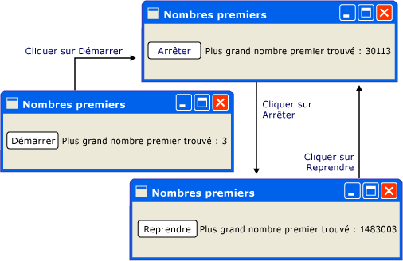
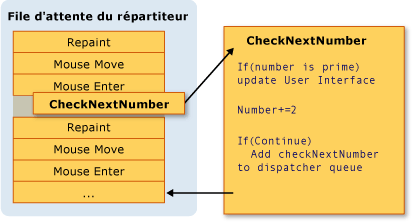
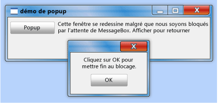
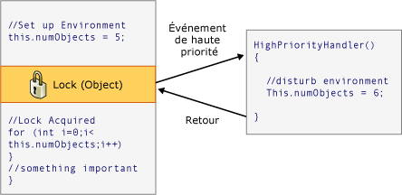

# Modèle de threadThreading Model
[!INCLUDE[TLA#tla_winclient](../../../../includes/tlasharptla-winclient-md.md)] est conçu pour épargner aux développeurs les difficultés d’utilisation des threads. is designed to save developers from the difficulties of threading. Par conséquent, la majorité des [!INCLUDE[TLA2#tla_winclient](../../../../includes/tla2sharptla-winclient-md.md)] n’auront pas les développeurs à écrire une interface qui utilise plusieurs threads.As a result, the majority of [!INCLUDE[TLA2#tla_winclient](../../../../includes/tla2sharptla-winclient-md.md)] developers won't have to write an interface that uses more than one thread. Comme les programmes multithreads sont complexes et difficiles à déboguer, il est préférable de les éviter quand des solutions à thread unique existent.Because multithreaded programs are complex and difficult to debug, they should be avoided when single-threaded solutions exist.  
  
 Aucune question correctement mise en œuvre, toutefois, aucune [!INCLUDE[TLA2#tla_ui](../../../../includes/tla2sharptla-ui-md.md)] framework sera jamais en mesure de fournir une solution monothread pour chaque type de problème.No matter how well architected, however, no [!INCLUDE[TLA2#tla_ui](../../../../includes/tla2sharptla-ui-md.md)] framework will ever be able to provide a single-threaded solution for every sort of problem. [!INCLUDE[TLA2#tla_winclient](../../../../includes/tla2sharptla-winclient-md.md)]s’en rapproche, mais il existe toujours des situations où plusieurs threads améliorent [!INCLUDE[TLA#tla_ui](../../../../includes/tlasharptla-ui-md.md)] performances ou la réactivité des applications. comes close, but there are still situations where multiple threads improve [!INCLUDE[TLA#tla_ui](../../../../includes/tlasharptla-ui-md.md)] responsiveness or application performance. Après avoir présenté des informations d’ordre général, ce document explore certaines de ces situations puis se termine par une présentation de certaines informations de bas niveau.After discussing some background material, this paper explores some of these situations and then concludes with a discussion of some lower-level details.  
  

  
> [!NOTE]
>  Cette rubrique traite des threads à l’aide de la <xref:System.Windows.Threading.Dispatcher.BeginInvoke%2A> méthode pour les appels asynchrones.This topic discusses threading by using the <xref:System.Windows.Threading.Dispatcher.BeginInvoke%2A> method for asynchronous calls. Vous pouvez également effectuer des appels asynchrones en appelant le <xref:System.Windows.Threading.Dispatcher.InvokeAsync%2A> (méthode), qui prennent un <xref:System.Action> ou <xref:System.Func%601> en tant que paramètre.You can also make asynchronous calls by calling the <xref:System.Windows.Threading.Dispatcher.InvokeAsync%2A> method, which take an <xref:System.Action> or <xref:System.Func%601> as a parameter.  Le <xref:System.Windows.Threading.Dispatcher.InvokeAsync%2A> méthode retourne un <xref:System.Windows.Threading.DispatcherOperation> ou <xref:System.Windows.Threading.DispatcherOperation%601>, qui a un <xref:System.Windows.Threading.DispatcherOperation.Task%2A> propriété.The <xref:System.Windows.Threading.Dispatcher.InvokeAsync%2A> method returns a <xref:System.Windows.Threading.DispatcherOperation> or <xref:System.Windows.Threading.DispatcherOperation%601>, which has a <xref:System.Windows.Threading.DispatcherOperation.Task%2A> property. Vous pouvez utiliser la `await` mot clé avec l’option le <xref:System.Windows.Threading.DispatcherOperation> ou associé <xref:System.Threading.Tasks.Task>.You can use the `await` keyword with either the <xref:System.Windows.Threading.DispatcherOperation> or the associated <xref:System.Threading.Tasks.Task>. Si vous avez besoin d’attente de façon synchrone de la <xref:System.Threading.Tasks.Task> qui est retourné par une <xref:System.Windows.Threading.DispatcherOperation> ou <xref:System.Windows.Threading.DispatcherOperation%601>, appelez le <xref:System.Windows.Threading.TaskExtensions.DispatcherOperationWait%2A> méthode d’extension.If you need to wait synchronously for the <xref:System.Threading.Tasks.Task> that is returned by a <xref:System.Windows.Threading.DispatcherOperation> or <xref:System.Windows.Threading.DispatcherOperation%601>, call the <xref:System.Windows.Threading.TaskExtensions.DispatcherOperationWait%2A> extension method.  Appel de <xref:System.Threading.Tasks.Task.Wait%2A?displayProperty=nameWithType> entraîne un blocage.Calling <xref:System.Threading.Tasks.Task.Wait%2A?displayProperty=nameWithType> will result in a deadlock. Pour plus d’informations sur l’utilisation d’un <xref:System.Threading.Tasks.Task> pour effectuer des opérations asynchrones, consultez le parallélisme des tâches.For more information about using a <xref:System.Threading.Tasks.Task> to perform asynchronous operations, see Task Parallelism.  Le <xref:System.Windows.Threading.Dispatcher.Invoke%2A> méthode présente également des surcharges qui prennent un <xref:System.Action> ou <xref:System.Func%601> en tant que paramètre.The <xref:System.Windows.Threading.Dispatcher.Invoke%2A> method also has overloads that take an <xref:System.Action> or <xref:System.Func%601> as a parameter.  Vous pouvez utiliser la <xref:System.Windows.Threading.Dispatcher.Invoke%2A> des appels de méthode pour rendre synchrones en passant un délégué, <xref:System.Action> ou <xref:System.Func%601>.You can use the <xref:System.Windows.Threading.Dispatcher.Invoke%2A> method to make synchronous calls by passing in a delegate, <xref:System.Action> or <xref:System.Func%601>.  
  
   
## Vue d’ensemble du répartiteurOverview and the Dispatcher  
 En règle générale, [!INCLUDE[TLA2#tla_winclient](../../../../includes/tla2sharptla-winclient-md.md)] applications démarrent avec deux threads : un pour gérer le rendu et un autre pour gérer les [!INCLUDE[TLA2#tla_ui](../../../../includes/tla2sharptla-ui-md.md)].Typically, [!INCLUDE[TLA2#tla_winclient](../../../../includes/tla2sharptla-winclient-md.md)] applications start with two threads: one for handling rendering and another for managing the [!INCLUDE[TLA2#tla_ui](../../../../includes/tla2sharptla-ui-md.md)]. Le thread de rendu s’exécute efficacement masqué en arrière-plan lors de la [!INCLUDE[TLA2#tla_ui](../../../../includes/tla2sharptla-ui-md.md)] thread reçoit l’entrée, gère les événements, peint l’écran et exécute le code d’application.The rendering thread effectively runs hidden in the background while the [!INCLUDE[TLA2#tla_ui](../../../../includes/tla2sharptla-ui-md.md)] thread receives input, handles events, paints the screen, and runs application code. La plupart des applications utilisent une seule [!INCLUDE[TLA2#tla_ui](../../../../includes/tla2sharptla-ui-md.md)] thread, bien que dans certaines situations, il est préférable d’utiliser plusieurs.Most applications use a single [!INCLUDE[TLA2#tla_ui](../../../../includes/tla2sharptla-ui-md.md)] thread, although in some situations it is best to use several. Nous traitons de cet aspect plus loin avec un exemple.We’ll discuss this with an example later.  
  
 Le [!INCLUDE[TLA2#tla_ui](../../../../includes/tla2sharptla-ui-md.md)] files d’attente du thread de travail des éléments à l’intérieur d’un objet appelé un <xref:System.Windows.Threading.Dispatcher>.The [!INCLUDE[TLA2#tla_ui](../../../../includes/tla2sharptla-ui-md.md)] thread queues work items inside an object called a <xref:System.Windows.Threading.Dispatcher>. Le <xref:System.Windows.Threading.Dispatcher> sélectionne des éléments de travail en fonction de l'ordre de priorité et exécute chacun d'eux jusqu'à leur achèvement.The <xref:System.Windows.Threading.Dispatcher> selects work items on a priority basis and runs each one to completion.  Chaque [!INCLUDE[TLA2#tla_ui](../../../../includes/tla2sharptla-ui-md.md)] thread doit avoir au moins un <xref:System.Windows.Threading.Dispatcher>et chaque <xref:System.Windows.Threading.Dispatcher> peut exécuter les éléments de travail dans un seul thread.Every [!INCLUDE[TLA2#tla_ui](../../../../includes/tla2sharptla-ui-md.md)] thread must have at least one <xref:System.Windows.Threading.Dispatcher>, and each <xref:System.Windows.Threading.Dispatcher> can execute work items in exactly one thread.  
  
 L’astuce pour générer des applications conviviales et réactives est d’optimiser la <xref:System.Windows.Threading.Dispatcher> débit en conservant les éléments de travail petit.The trick to building responsive, user-friendly applications is to maximize the <xref:System.Windows.Threading.Dispatcher> throughput by keeping the work items small. Cette façon dont les éléments jamais périmés dans la <xref:System.Windows.Threading.Dispatcher> file d’attente de traitement.This way items never get stale sitting in the <xref:System.Windows.Threading.Dispatcher> queue waiting for processing. Tout délai perceptible entre une entrée et sa réponse peut frustrer un utilisateur.Any perceivable delay between input and response can frustrate a user.  
  
 Comment sont [!INCLUDE[TLA2#tla_winclient](../../../../includes/tla2sharptla-winclient-md.md)] applications supposées pour gérer les opérations volumineuses ?How then are [!INCLUDE[TLA2#tla_winclient](../../../../includes/tla2sharptla-winclient-md.md)] applications supposed to handle big operations? Que se passe-t-il si votre code implique un grand calcul ou doit interroger une base de données sur un serveur distant ?What if your code involves a large calculation or needs to query a database on some remote server? En règle générale, la réponse est pour gérer l’opération volumineuse dans un thread séparé, en laissant le [!INCLUDE[TLA2#tla_ui](../../../../includes/tla2sharptla-ui-md.md)] thread libre pour gérer les éléments dans le <xref:System.Windows.Threading.Dispatcher> file d’attente.Usually, the answer is to handle the big operation in a separate thread, leaving the [!INCLUDE[TLA2#tla_ui](../../../../includes/tla2sharptla-ui-md.md)] thread free to tend to items in the <xref:System.Windows.Threading.Dispatcher> queue. Lorsque l’opération volumineuse est terminée, il peut indiquer son résultat à le [!INCLUDE[TLA2#tla_ui](../../../../includes/tla2sharptla-ui-md.md)] thread pour l’affichage.When the big operation is complete, it can report its result back to the [!INCLUDE[TLA2#tla_ui](../../../../includes/tla2sharptla-ui-md.md)] thread for display.  
  
 Historiquement, [!INCLUDE[TLA#tla_mswin](../../../../includes/tlasharptla-mswin-md.md)] permet [!INCLUDE[TLA2#tla_ui](../../../../includes/tla2sharptla-ui-md.md)] éléments accessibles uniquement par le thread qui les a créés.Historically, [!INCLUDE[TLA#tla_mswin](../../../../includes/tlasharptla-mswin-md.md)] allows [!INCLUDE[TLA2#tla_ui](../../../../includes/tla2sharptla-ui-md.md)] elements to be accessed only by the thread that created them. Cela signifie qu’un thread d’arrière-plan chargé des tâches d’exécution longue ne peut pas mettre à jour une zone de texte quand il est terminé.This means that a background thread in charge of some long-running task cannot update a text box when it is finished. [!INCLUDE[TLA#tla_mswin](../../../../includes/tlasharptla-mswin-md.md)]Pour cela, pour garantir l’intégrité de [!INCLUDE[TLA2#tla_ui](../../../../includes/tla2sharptla-ui-md.md)] composants. does this to ensure the integrity of [!INCLUDE[TLA2#tla_ui](../../../../includes/tla2sharptla-ui-md.md)] components. Une zone de liste pourrait sembler étrange si son contenu était mis à jour par un thread d’arrière-plan pendant la phase de dessin.A list box could look strange if its contents were updated by a background thread during painting.  
  
 [!INCLUDE[TLA2#tla_winclient](../../../../includes/tla2sharptla-winclient-md.md)] a un mécanisme d’exclusion mutuelle intégré qui applique cette coordination. has a built-in mutual exclusion mechanism that enforces this coordination. La plupart des classes dans [!INCLUDE[TLA2#tla_winclient](../../../../includes/tla2sharptla-winclient-md.md)] dérivent <xref:System.Windows.Threading.DispatcherObject>.Most classes in [!INCLUDE[TLA2#tla_winclient](../../../../includes/tla2sharptla-winclient-md.md)] derive from <xref:System.Windows.Threading.DispatcherObject>. Lors de la construction, un <xref:System.Windows.Threading.DispatcherObject> stocke une référence à la <xref:System.Windows.Threading.Dispatcher> lié au thread en cours d’exécution.At construction, a <xref:System.Windows.Threading.DispatcherObject> stores a reference to the <xref:System.Windows.Threading.Dispatcher> linked to the currently running thread. En effet, le <xref:System.Windows.Threading.DispatcherObject> associe au thread qui le crée.In effect, the <xref:System.Windows.Threading.DispatcherObject> associates with the thread that creates it. Pendant l’exécution du programme, un <xref:System.Windows.Threading.DispatcherObject> peut appeler son public <xref:System.Windows.Threading.DispatcherObject.VerifyAccess%2A> (méthode).During program execution, a <xref:System.Windows.Threading.DispatcherObject> can call its public <xref:System.Windows.Threading.DispatcherObject.VerifyAccess%2A> method. <xref:System.Windows.Threading.DispatcherObject.VerifyAccess%2A>examine la <xref:System.Windows.Threading.Dispatcher> associé au thread actuel et le compare à la <xref:System.Windows.Threading.Dispatcher> stockée pendant la construction de référence.<xref:System.Windows.Threading.DispatcherObject.VerifyAccess%2A> examines the <xref:System.Windows.Threading.Dispatcher> associated with the current thread and compares it to the <xref:System.Windows.Threading.Dispatcher> reference stored during construction. Si elles ne correspondent pas, <xref:System.Windows.Threading.DispatcherObject.VerifyAccess%2A> lève une exception.If they don’t match, <xref:System.Windows.Threading.DispatcherObject.VerifyAccess%2A> throws an exception. <xref:System.Windows.Threading.DispatcherObject.VerifyAccess%2A>est destiné à être appelé au début de chaque méthode qui appartient à un <xref:System.Windows.Threading.DispatcherObject>.<xref:System.Windows.Threading.DispatcherObject.VerifyAccess%2A> is intended to be called at the beginning of every method belonging to a <xref:System.Windows.Threading.DispatcherObject>.  
  
 Si seul un thread peut modifier le [!INCLUDE[TLA2#tla_ui](../../../../includes/tla2sharptla-ui-md.md)], comment interagir les threads d’arrière-plan avec l’utilisateur ?If only one thread can modify the [!INCLUDE[TLA2#tla_ui](../../../../includes/tla2sharptla-ui-md.md)], how do background threads interact with the user? Un thread d’arrière-plan peut demander le [!INCLUDE[TLA2#tla_ui](../../../../includes/tla2sharptla-ui-md.md)] thread pour effectuer une opération sur son nom.A background thread can ask the [!INCLUDE[TLA2#tla_ui](../../../../includes/tla2sharptla-ui-md.md)] thread to perform an operation on its behalf. Pour ce faire, il enregistre un élément de travail avec le <xref:System.Windows.Threading.Dispatcher> de la [!INCLUDE[TLA2#tla_ui](../../../../includes/tla2sharptla-ui-md.md)] thread.It does this by registering a work item with the <xref:System.Windows.Threading.Dispatcher> of the [!INCLUDE[TLA2#tla_ui](../../../../includes/tla2sharptla-ui-md.md)] thread. Le <xref:System.Windows.Threading.Dispatcher> classe fournit deux méthodes d’enregistrement des éléments de travail : <xref:System.Windows.Threading.Dispatcher.Invoke%2A> et <xref:System.Windows.Threading.Dispatcher.BeginInvoke%2A>.The <xref:System.Windows.Threading.Dispatcher> class provides two methods for registering work items: <xref:System.Windows.Threading.Dispatcher.Invoke%2A> and <xref:System.Windows.Threading.Dispatcher.BeginInvoke%2A>. Ces deux méthodes planifient un délégué pour l’exécution.Both methods schedule a delegate for execution. <xref:System.Windows.Threading.Dispatcher.Invoke%2A>est un appel synchrone, autrement dit, il ne retourne pas jusqu'à ce que le [!INCLUDE[TLA2#tla_ui](../../../../includes/tla2sharptla-ui-md.md)] thread réellement termine l’exécution du délégué.<xref:System.Windows.Threading.Dispatcher.Invoke%2A> is a synchronous call – that is, it doesn’t return until the [!INCLUDE[TLA2#tla_ui](../../../../includes/tla2sharptla-ui-md.md)] thread actually finishes executing the delegate. <xref:System.Windows.Threading.Dispatcher.BeginInvoke%2A>est asynchrone et retourne immédiatement.<xref:System.Windows.Threading.Dispatcher.BeginInvoke%2A> is asynchronous and returns immediately.  
  
 Le <xref:System.Windows.Threading.Dispatcher> trie les éléments dans sa file d’attente par priorité.The <xref:System.Windows.Threading.Dispatcher> orders the elements in its queue by priority. Il existe dix niveaux qui peuvent être spécifiées lors de l’ajout d’un élément à la <xref:System.Windows.Threading.Dispatcher> file d’attente.There are ten levels that may be specified when adding an element to the <xref:System.Windows.Threading.Dispatcher> queue. Ces priorités sont maintenues dans le <xref:System.Windows.Threading.DispatcherPriority> énumération.These priorities are maintained in the <xref:System.Windows.Threading.DispatcherPriority> enumeration. Informations détaillées sur <xref:System.Windows.Threading.DispatcherPriority> niveaux se trouvent dans le [!INCLUDE[TLA2#tla_winfxsdk](../../../../includes/tla2sharptla-winfxsdk-md.md)] documentation.Detailed information about <xref:System.Windows.Threading.DispatcherPriority> levels can be found in the [!INCLUDE[TLA2#tla_winfxsdk](../../../../includes/tla2sharptla-winfxsdk-md.md)] documentation.  
  
   
## Threads en action : les exemplesThreads in Action: The Samples  
  
   
### Une application à thread unique avec un calcul de longue duréeA Single-Threaded Application with a Long-Running Calculation  
 La plupart des [!INCLUDE[TLA#tla_gui#plural](../../../../includes/tlasharptla-guisharpplural-md.md)] passent à une grande partie de leur temps inactif en attendant des événements qui sont générés en réponse aux interactions de l’utilisateur.Most [!INCLUDE[TLA#tla_gui#plural](../../../../includes/tlasharptla-guisharpplural-md.md)] spend a large portion of their time idle while waiting for events that are generated in response to user interactions. Programmation prudence cette durée d’inactivité peut être utilisée de manière constructive, sans affecter la réactivité de le [!INCLUDE[TLA2#tla_ui](../../../../includes/tla2sharptla-ui-md.md)].With careful programming this idle time can be used constructively, without affecting the responsiveness of the [!INCLUDE[TLA2#tla_ui](../../../../includes/tla2sharptla-ui-md.md)]. Le [!INCLUDE[TLA2#tla_winclient](../../../../includes/tla2sharptla-winclient-md.md)] modèle de thread n’autorise pas l’entrée d’interrompre une opération qui se passe dans le [!INCLUDE[TLA2#tla_ui](../../../../includes/tla2sharptla-ui-md.md)] thread.The [!INCLUDE[TLA2#tla_winclient](../../../../includes/tla2sharptla-winclient-md.md)] threading model doesn’t allow input to interrupt an operation happening in the [!INCLUDE[TLA2#tla_ui](../../../../includes/tla2sharptla-ui-md.md)] thread. Cela signifie que vous devez être sûr de revenir à la <xref:System.Windows.Threading.Dispatcher> régulièrement au processus en attente d’événements d’entrée avant de pouvoir obsolètes.This means you must be sure to return to the <xref:System.Windows.Threading.Dispatcher> periodically to process pending input events before they get stale.  
  
 Prenons l'exemple suivant :Consider the following example:  
  
   
  
 Cette application simple compte à partir de trois de façon croissante, en recherchant les nombres premiers.This simple application counts upwards from three, searching for prime numbers. Lorsque l’utilisateur clique sur le **Démarrer** bouton, la recherche commence.When the user clicks the **Start** button, the search begins. Quand le programme trouve un nombre premier, il met à jour l’interface utilisateur avec sa découverte.When the program finds a prime, it updates the user interface with its discovery. À tout moment, l’utilisateur peut arrêter la recherche.At any point, the user can stop the search.  
  
 Bien qu’assez simple, la recherche des nombres premiers peut être illimitée dans le temps, ce qui présente quelques difficultés.Although simple enough, the prime number search could go on forever, which presents some difficulties.  Si nous avions géré l’intégralité de la recherche à l’intérieur du Gestionnaire d’événements click du bouton, nous n’aurions jamais le [!INCLUDE[TLA2#tla_ui](../../../../includes/tla2sharptla-ui-md.md)] une chance de traiter d’autres événements de thread.If we handled the entire search inside of the click event handler of the button, we would never give the [!INCLUDE[TLA2#tla_ui](../../../../includes/tla2sharptla-ui-md.md)] thread a chance to handle other events. Le [!INCLUDE[TLA2#tla_ui](../../../../includes/tla2sharptla-ui-md.md)] ne pourra pas répondre à l’entrée ou de traiter les messages.The [!INCLUDE[TLA2#tla_ui](../../../../includes/tla2sharptla-ui-md.md)] would be unable to respond to input or process messages. Elle ne redessinerait jamais l’interface et ne répondrait jamais aux clics sur le bouton.It would never repaint and never respond to button clicks.  
  
 Nous aurions pu effectuer la recherche des nombres premiers dans un thread distinct, mais nous devrions alors faire face à des problèmes de synchronisation.We could conduct the prime number search in a separate thread, but then we would need to deal with synchronization issues. Avec une approche à thread unique, nous pouvons directement mettre à jour le libellé qui indique le plus grand nombre premier trouvé.With a single-threaded approach, we can directly update the label that lists the largest prime found.  
  
 Si nous arrêter la tâche de calcul en segments maniables, nous pouvons périodiquement retourner à la <xref:System.Windows.Threading.Dispatcher> et traiter les événements.If we break up the task of calculation into manageable chunks, we can periodically return to the <xref:System.Windows.Threading.Dispatcher> and process events. Nous pouvons [!INCLUDE[TLA2#tla_winclient](../../../../includes/tla2sharptla-winclient-md.md)] une opportunité pour redessiner et traiter l’entrée.We can give [!INCLUDE[TLA2#tla_winclient](../../../../includes/tla2sharptla-winclient-md.md)] an opportunity to repaint and process input.  
  
 La meilleure façon de fractionner le traitement entre calcul et la gestion des événements consiste à gérer le calcul à partir de la <xref:System.Windows.Threading.Dispatcher>.The best way to split processing time between calculation and event handling is to manage calculation from the <xref:System.Windows.Threading.Dispatcher>. À l’aide de la <xref:System.Windows.Threading.Dispatcher.BeginInvoke%2A> (méthode), nous pouvons planifier des vérifications de nombres premiers dans la même file d’attente qui [!INCLUDE[TLA2#tla_ui](../../../../includes/tla2sharptla-ui-md.md)] proviennent des événements.By using the <xref:System.Windows.Threading.Dispatcher.BeginInvoke%2A> method, we can schedule prime number checks in the same queue that [!INCLUDE[TLA2#tla_ui](../../../../includes/tla2sharptla-ui-md.md)] events are drawn from. Dans notre exemple, nous planifions une seule vérification de nombre premier à la fois.In our example, we schedule only a single prime number check at a time. Une fois la vérification de nombre premier terminée, nous planifions immédiatement la vérification suivante.After the prime number check is complete, we schedule the next check immediately. Cette vérification se déroule uniquement après avoir en attente [!INCLUDE[TLA2#tla_ui](../../../../includes/tla2sharptla-ui-md.md)] événements ont été traités.This check proceeds only after pending [!INCLUDE[TLA2#tla_ui](../../../../includes/tla2sharptla-ui-md.md)] events have been handled.  
  
   
  
 [!INCLUDE[TLA#tla_word](../../../../includes/tlasharptla-word-md.md)] effectue la vérification orthographique à l’aide de ce mécanisme. accomplishes spell checking using this mechanism. La correction orthographique est effectuée en arrière-plan à l’aide de la durée d’inactivité de le [!INCLUDE[TLA2#tla_ui](../../../../includes/tla2sharptla-ui-md.md)] thread.Spell checking is done in the background using the idle time of the [!INCLUDE[TLA2#tla_ui](../../../../includes/tla2sharptla-ui-md.md)] thread. Regardons ce code.Let's take a look at the code.  
  
 L’exemple suivant montre le code XAML qui crée l’interface utilisateur.The following example shows the XAML that creates the user interface.  
  
 [!code-xaml[ThreadingPrimeNumbers#ThreadingPrimeNumberXAML](../../../../samples/snippets/csharp/VS_Snippets_Wpf/ThreadingPrimeNumbers/CSharp/Window1.xaml#threadingprimenumberxaml)]  
  
 L’exemple suivant montre le code-behind.The following example shows the code-behind.  
  
 [!code-csharp[ThreadingPrimeNumbers#ThreadingPrimeNumberCodeBehind](../../../../samples/snippets/csharp/VS_Snippets_Wpf/ThreadingPrimeNumbers/CSharp/Window1.xaml.cs#threadingprimenumbercodebehind)]
 [!code-vb[ThreadingPrimeNumbers#ThreadingPrimeNumberCodeBehind](../../../../samples/snippets/visualbasic/VS_Snippets_Wpf/ThreadingPrimeNumbers/visualbasic/mainwindow.xaml.vb#threadingprimenumbercodebehind)]  
  
 L’exemple suivant montre le Gestionnaire d’événements pour le <xref:System.Windows.Controls.Button>.The following example shows the event handler for the <xref:System.Windows.Controls.Button>.  
  
 [!code-csharp[ThreadingPrimeNumbers#ThreadingPrimeNumberStartOrStop](../../../../samples/snippets/csharp/VS_Snippets_Wpf/ThreadingPrimeNumbers/CSharp/Window1.xaml.cs#threadingprimenumberstartorstop)]
 [!code-vb[ThreadingPrimeNumbers#ThreadingPrimeNumberStartOrStop](../../../../samples/snippets/visualbasic/VS_Snippets_Wpf/ThreadingPrimeNumbers/visualbasic/mainwindow.xaml.vb#threadingprimenumberstartorstop)]  
  
 Outre la mise à jour le texte sur le <xref:System.Windows.Controls.Button>, ce gestionnaire est chargé de planifier le premier nombre premier en ajoutant un délégué pour la <xref:System.Windows.Threading.Dispatcher> file d’attente.Besides updating the text on the <xref:System.Windows.Controls.Button>, this handler is responsible for scheduling the first prime number check by adding a delegate to the <xref:System.Windows.Threading.Dispatcher> queue. Après que ce gestionnaire d’événements a terminé son travail, le <xref:System.Windows.Threading.Dispatcher> sélectionne ce délégué pour l’exécution.Sometime after this event handler has completed its work, the <xref:System.Windows.Threading.Dispatcher> will select this delegate for execution.  
  
 Comme mentionné précédemment, <xref:System.Windows.Threading.Dispatcher.BeginInvoke%2A> est la <xref:System.Windows.Threading.Dispatcher> membre utilisé pour planifier un délégué pour l’exécution.As we mentioned earlier, <xref:System.Windows.Threading.Dispatcher.BeginInvoke%2A> is the <xref:System.Windows.Threading.Dispatcher> member used to schedule a delegate for execution. Dans ce cas, nous choisissons le <xref:System.Windows.Threading.DispatcherPriority.SystemIdle> priorité.In this case, we choose the <xref:System.Windows.Threading.DispatcherPriority.SystemIdle> priority. Le <xref:System.Windows.Threading.Dispatcher> exécutera ce délégué uniquement lorsqu’il n’y a aucuns événements importants à traiter.The <xref:System.Windows.Threading.Dispatcher> will execute this delegate only when there are no important events to process. La réactivité de l’[!INCLUDE[TLA2#tla_ui](../../../../includes/tla2sharptla-ui-md.md)] est plus importante que la vérification des nombres.[!INCLUDE[TLA2#tla_ui](../../../../includes/tla2sharptla-ui-md.md)] responsiveness is more important than number checking. Nous passons également un nouveau délégué qui représente la routine de vérification des nombres.We also pass a new delegate representing the number-checking routine.  
  
 [!code-csharp[ThreadingPrimeNumbers#ThreadingPrimeNumberCheckNextNumber](../../../../samples/snippets/csharp/VS_Snippets_Wpf/ThreadingPrimeNumbers/CSharp/Window1.xaml.cs#threadingprimenumberchecknextnumber)]
 [!code-vb[ThreadingPrimeNumbers#ThreadingPrimeNumberCheckNextNumber](../../../../samples/snippets/visualbasic/VS_Snippets_Wpf/ThreadingPrimeNumbers/visualbasic/mainwindow.xaml.vb#threadingprimenumberchecknextnumber)]  
  
 Cette méthode vérifie si le nombre impair suivant est un nombre premier.This method checks if the next odd number is prime. Si c’est le principal, la méthode met à jour directement le `bigPrime` <xref:System.Windows.Controls.TextBlock> pour refléter sa découverte.If it is prime, the method directly updates the `bigPrime`<xref:System.Windows.Controls.TextBlock> to reflect its discovery. Nous pouvons procéder ainsi, car le calcul est effectué dans le même thread que celui utilisé pour créer le composant.We can do this because the calculation is occurring in the same thread that was used to create the component. Si nous avions choisi d’utiliser un thread séparé pour le calcul, nous aurait utiliser un mécanisme de synchronisation plus compliqué et exécuter la mise à jour dans le [!INCLUDE[TLA2#tla_ui](../../../../includes/tla2sharptla-ui-md.md)] thread.Had we chosen to use a separate thread for the calculation, we would have to use a more complicated synchronization mechanism and execute the update in the [!INCLUDE[TLA2#tla_ui](../../../../includes/tla2sharptla-ui-md.md)] thread. Nous montrerons cette situation plus loin.We’ll demonstrate this situation next.  
  
 Pour le code source complet de cet exemple, consultez la [Single-Threaded Application avec l’exemple de calcul de longue](http://go.microsoft.com/fwlink/?LinkID=160038)For the complete source code for this sample, see the [Single-Threaded Application with Long-Running Calculation Sample](http://go.microsoft.com/fwlink/?LinkID=160038)  
  
   
### Gestion d’une opération bloquante avec un thread d’arrière-planHandling a Blocking Operation with a Background Thread  
 La gestion des opérations bloquantes dans une application graphique peuvent être difficile.Handling blocking operations in a graphical application can be difficult. Nous ne voulons pas appeler des méthodes bloquantes à partir de gestionnaires d’événements, car l’application apparaîtra figée.We don’t want to call blocking methods from event handlers because the application will appear to freeze up. Nous pouvons utiliser un thread séparé pour gérer ces opérations, mais lorsque nous avons terminé, nous devons effectuer une synchronisation avec la [!INCLUDE[TLA2#tla_ui](../../../../includes/tla2sharptla-ui-md.md)] thread, car nous ne pouvons pas modifier directement le [!INCLUDE[TLA2#tla_gui](../../../../includes/tla2sharptla-gui-md.md)] de notre thread de travail.We can use a separate thread to handle these operations, but when we’re done, we have to synchronize with the [!INCLUDE[TLA2#tla_ui](../../../../includes/tla2sharptla-ui-md.md)] thread because we can’t directly modify the [!INCLUDE[TLA2#tla_gui](../../../../includes/tla2sharptla-gui-md.md)] from our worker thread. Nous pouvons utiliser <xref:System.Windows.Threading.Dispatcher.Invoke%2A> ou <xref:System.Windows.Threading.Dispatcher.BeginInvoke%2A> pour insérer des délégués dans le <xref:System.Windows.Threading.Dispatcher> de la [!INCLUDE[TLA2#tla_ui](../../../../includes/tla2sharptla-ui-md.md)] thread.We can use <xref:System.Windows.Threading.Dispatcher.Invoke%2A> or <xref:System.Windows.Threading.Dispatcher.BeginInvoke%2A> to insert delegates into the <xref:System.Windows.Threading.Dispatcher> of the [!INCLUDE[TLA2#tla_ui](../../../../includes/tla2sharptla-ui-md.md)] thread. Finalement, ces délégués seront exécutés avec l’autorisation Modifier [!INCLUDE[TLA2#tla_ui](../../../../includes/tla2sharptla-ui-md.md)] éléments.Eventually, these delegates will be executed with permission to modify [!INCLUDE[TLA2#tla_ui](../../../../includes/tla2sharptla-ui-md.md)] elements.  
  
 Dans cet exemple, nous simulons un appel de procédure distante qui récupère une prévision météorologique.In this example, we mimic a remote procedure call that retrieves a weather forecast. Nous utilisons un thread de travail distinct pour exécuter cet appel, et nous planifions une méthode de mise à jour dans le <xref:System.Windows.Threading.Dispatcher> de la [!INCLUDE[TLA2#tla_ui](../../../../includes/tla2sharptla-ui-md.md)] thread lorsque nous avons fini.We use a separate worker thread to execute this call, and we schedule an update method in the <xref:System.Windows.Threading.Dispatcher> of the [!INCLUDE[TLA2#tla_ui](../../../../includes/tla2sharptla-ui-md.md)] thread when we’re finished.  
  
   
  
 [!code-csharp[ThreadingWeatherForecast#ThreadingWeatherCodeBehind](../../../../samples/snippets/csharp/VS_Snippets_Wpf/ThreadingWeatherForecast/CSharp/Window1.xaml.cs#threadingweathercodebehind)]
 [!code-vb[ThreadingWeatherForecast#ThreadingWeatherCodeBehind](../../../../samples/snippets/visualbasic/VS_Snippets_Wpf/ThreadingWeatherForecast/visualbasic/window1.xaml.vb#threadingweathercodebehind)]  
  
 Voici quelques-uns des détails à noter.The following are some of the details to be noted.  
  
-   Création du gestionnaire de boutonCreating the Button Handler  
  
     [!code-csharp[ThreadingWeatherForecast#ThreadingWeatherButtonHandler](../../../../samples/snippets/csharp/VS_Snippets_Wpf/ThreadingWeatherForecast/CSharp/Window1.xaml.cs#threadingweatherbuttonhandler)]
     [!code-vb[ThreadingWeatherForecast#ThreadingWeatherButtonHandler](../../../../samples/snippets/visualbasic/VS_Snippets_Wpf/ThreadingWeatherForecast/visualbasic/window1.xaml.vb#threadingweatherbuttonhandler)]  
  
 Quand l’utilisateur clique sur le bouton, nous affichons le dessin de l’horloge et nous commençons son animation.When the button is clicked, we display the clock drawing and start animating it. Nous désactivons le bouton.We disable the button. Nous appeler le `FetchWeatherFromServer` méthode dans un nouveau thread, puis nous retour, ce qui permet la <xref:System.Windows.Threading.Dispatcher> pour traiter les événements pendant que nous attendons pour collecter les prévisions météorologiques.We invoke the `FetchWeatherFromServer` method in a new thread, and then we return, allowing the <xref:System.Windows.Threading.Dispatcher> to process events while we wait to collect the weather forecast.  
  
-   Récupération de la météoFetching the Weather  
  
     [!code-csharp[ThreadingWeatherForecast#ThreadingWeatherFetchWeather](../../../../samples/snippets/csharp/VS_Snippets_Wpf/ThreadingWeatherForecast/CSharp/Window1.xaml.cs#threadingweatherfetchweather)]
     [!code-vb[ThreadingWeatherForecast#ThreadingWeatherFetchWeather](../../../../samples/snippets/visualbasic/VS_Snippets_Wpf/ThreadingWeatherForecast/visualbasic/window1.xaml.vb#threadingweatherfetchweather)]  
  
 Pour simplifier les choses, nous n’ajoutons pas de code pour la mise en réseau dans cet exemple.To keep things simple, we don’t actually have any networking code in this example. Au lieu de cela, nous simulons le délai d’accès réseau en plaçant notre nouveau thread en veille pendant quatre secondes.Instead, we simulate the delay of network access by putting our new thread to sleep for four seconds. Pendant ce temps, la version d’origine [!INCLUDE[TLA2#tla_ui](../../../../includes/tla2sharptla-ui-md.md)] thread est toujours en cours d’exécution et répondre aux événements.In this time, the original [!INCLUDE[TLA2#tla_ui](../../../../includes/tla2sharptla-ui-md.md)] thread is still running and responding to events. Pour illustrer ceci, nous avons laissé une animation en cours d’exécution, et les boutons pour réduire et pour agrandir continuent également de fonctionner.To show this, we’ve left an animation running, and the minimize and maximize buttons also continue to work.  
  
 Lorsque le délai est terminé et que nous avons aléatoirement sélectionné nos prévisions météorologiques, il est temps de rapport à la [!INCLUDE[TLA2#tla_ui](../../../../includes/tla2sharptla-ui-md.md)] thread.When the delay is finished, and we’ve randomly selected our weather forecast, it’s time to report back to the [!INCLUDE[TLA2#tla_ui](../../../../includes/tla2sharptla-ui-md.md)] thread. Pour ce faire, nous planifions un appel à `UpdateUserInterface` dans les [!INCLUDE[TLA2#tla_ui](../../../../includes/tla2sharptla-ui-md.md)] thread à l’aide de ce thread <xref:System.Windows.Threading.Dispatcher>.We do this by scheduling a call to `UpdateUserInterface` in the [!INCLUDE[TLA2#tla_ui](../../../../includes/tla2sharptla-ui-md.md)] thread using that thread’s <xref:System.Windows.Threading.Dispatcher>. Nous passons une chaîne décrivant la météo à cet appel de méthode planifié.We pass a string describing the weather to this scheduled method call.  
  
-   Mise à jour le[!INCLUDE[TLA2#tla_ui](../../../../includes/tla2sharptla-ui-md.md)]Updating the [!INCLUDE[TLA2#tla_ui](../../../../includes/tla2sharptla-ui-md.md)]  
  
     [!code-csharp[ThreadingWeatherForecast#ThreadingWeatherUpdateUI](../../../../samples/snippets/csharp/VS_Snippets_Wpf/ThreadingWeatherForecast/CSharp/Window1.xaml.cs#threadingweatherupdateui)]
     [!code-vb[ThreadingWeatherForecast#ThreadingWeatherUpdateUI](../../../../samples/snippets/visualbasic/VS_Snippets_Wpf/ThreadingWeatherForecast/visualbasic/window1.xaml.vb#threadingweatherupdateui)]  
  
 Lorsque le <xref:System.Windows.Threading.Dispatcher> dans les [!INCLUDE[TLA2#tla_ui](../../../../includes/tla2sharptla-ui-md.md)] thread ait le temps, il exécute l’appel planifié pour `UpdateUserInterface`.When the <xref:System.Windows.Threading.Dispatcher> in the [!INCLUDE[TLA2#tla_ui](../../../../includes/tla2sharptla-ui-md.md)] thread has time, it executes the scheduled call to `UpdateUserInterface`. Cette méthode arrête l’animation de l’horloge et choisit une image pour décrire le temps.This method stops the clock animation and chooses an image to describe the weather. Il affiche cette image et restaure le bouton de récupération des prévisions météo (« fetch forecast »).It displays this image and restores the "fetch forecast" button.  
  
   
### Plusieurs fenêtres, plusieurs threadsMultiple Windows, Multiple Threads  
 Certains [!INCLUDE[TLA2#tla_winclient](../../../../includes/tla2sharptla-winclient-md.md)] applications requièrent plusieurs fenêtres de niveau supérieur.Some [!INCLUDE[TLA2#tla_winclient](../../../../includes/tla2sharptla-winclient-md.md)] applications require multiple top-level windows. Il est parfaitement acceptable pour un seul Thread /<xref:System.Windows.Threading.Dispatcher> combinaison de gérer plusieurs fenêtres, mais plusieurs threads parfois préférables.It is perfectly acceptable for one Thread/<xref:System.Windows.Threading.Dispatcher> combination to manage multiple windows, but sometimes several threads do a better job. Ceci est particulièrement vrai s’il y a un risque que l’une des fenêtres monopolise le thread.This is especially true if there is any chance that one of the windows will monopolize the thread.  
  
 L’Explorateur [!INCLUDE[TLA#tla_mswin](../../../../includes/tlasharptla-mswin-md.md)] fonctionne de cette manière.[!INCLUDE[TLA#tla_mswin](../../../../includes/tlasharptla-mswin-md.md)] Explorer works in this fashion. Chaque nouvelle fenêtre de l’Explorateur appartient au processus d’origine, mais elle est créée sous le contrôle d’un thread indépendant.Each new Explorer window belongs to the original process, but it is created under the control of an independent thread.  
  
 En utilisant un [!INCLUDE[TLA2#tla_winclient](../../../../includes/tla2sharptla-winclient-md.md)] <xref:System.Windows.Controls.Frame> (contrôle), nous pouvons afficher des pages Web.By using a [!INCLUDE[TLA2#tla_winclient](../../../../includes/tla2sharptla-winclient-md.md)]<xref:System.Windows.Controls.Frame> control, we can display Web pages. Nous pouvons facilement créer un simple [!INCLUDE[TLA2#tla_ie](../../../../includes/tla2sharptla-ie-md.md)] remplacer.We can easily create a simple [!INCLUDE[TLA2#tla_ie](../../../../includes/tla2sharptla-ie-md.md)] substitute. Nous commençons par une fonctionnalité importante : la possibilité d’ouvrir une nouvelle fenêtre d’explorateur.We start with an important feature: the ability to open a new explorer window. Quand l’utilisateur clique sur le bouton « new window » (nouvelle fenêtre), nous lançons une copie de notre fenêtre dans un thread distinct.When the user clicks the "new window" button, we launch a copy of our window in a separate thread. De cette façon, les opérations longues ou bloquantes dans une des fenêtres ne verrouillent pas toutes les autres fenêtres.This way, long-running or blocking operations in one of the windows won’t lock all the other windows.  
  
 En réalité, le modèle de navigateur web a son propre modèle de thread complexe.In reality, the Web browser model has its own complicated threading model. Nous l’avons choisi, car la plupart des lecteurs le connaissent probablement bien.We’ve chosen it because it should be familiar to most readers.  
  
 L’exemple suivant montre le code.The following example shows the code.  
  
 [!code-xaml[ThreadingMultipleBrowsers#ThreadingMultiBrowserXAML](../../../../samples/snippets/csharp/VS_Snippets_Wpf/ThreadingMultipleBrowsers/CSharp/Window1.xaml#threadingmultibrowserxaml)]  
  
 [!code-csharp[ThreadingMultipleBrowsers#ThreadingMultiBrowserCodeBehind](../../../../samples/snippets/csharp/VS_Snippets_Wpf/ThreadingMultipleBrowsers/CSharp/Window1.xaml.cs#threadingmultibrowsercodebehind)]
 [!code-vb[ThreadingMultipleBrowsers#ThreadingMultiBrowserCodeBehind](../../../../samples/snippets/visualbasic/VS_Snippets_Wpf/ThreadingMultipleBrowsers/VisualBasic/Window1.xaml.vb#threadingmultibrowsercodebehind)]  
  
 Les segments suivants relatifs à la mise en œuvre des threads dans ce code sont les plus intéressants pour nous dans ce contexte :The following threading segments of this code are the most interesting to us in this context:  
  
 [!code-csharp[ThreadingMultipleBrowsers#ThreadingMultiBrowserNewWindow](../../../../samples/snippets/csharp/VS_Snippets_Wpf/ThreadingMultipleBrowsers/CSharp/Window1.xaml.cs#threadingmultibrowsernewwindow)]
 [!code-vb[ThreadingMultipleBrowsers#ThreadingMultiBrowserNewWindow](../../../../samples/snippets/visualbasic/VS_Snippets_Wpf/ThreadingMultipleBrowsers/VisualBasic/Window1.xaml.vb#threadingmultibrowsernewwindow)]  
  
 Cette méthode est appelée quand l’utilisateur clique sur le bouton « new window ».This method is called when the "new window" button is clicked. Elle crée un nouveau thread et le démarre de façon asynchrone.It creates a new thread and starts it asynchronously.  
  
 [!code-csharp[ThreadingMultipleBrowsers#ThreadingMultiBrowserThreadStart](../../../../samples/snippets/csharp/VS_Snippets_Wpf/ThreadingMultipleBrowsers/CSharp/Window1.xaml.cs#threadingmultibrowserthreadstart)]
 [!code-vb[ThreadingMultipleBrowsers#ThreadingMultiBrowserThreadStart](../../../../samples/snippets/visualbasic/VS_Snippets_Wpf/ThreadingMultipleBrowsers/VisualBasic/Window1.xaml.vb#threadingmultibrowserthreadstart)]  
  
 Cette méthode est le point de départ pour le nouveau thread.This method is the starting point for the new thread. Nous créons une nouvelle fenêtre sous le contrôle de ce thread.We create a new window under the control of this thread. [!INCLUDE[TLA2#tla_winclient](../../../../includes/tla2sharptla-winclient-md.md)]crée automatiquement une nouvelle <xref:System.Windows.Threading.Dispatcher> pour gérer le nouveau thread. automatically creates a new <xref:System.Windows.Threading.Dispatcher> to manage the new thread. Il nous suffit pour rendre la fenêtre fonctionnelle consiste à démarrer le <xref:System.Windows.Threading.Dispatcher>.All we have to do to make the window functional is to start the <xref:System.Windows.Threading.Dispatcher>.  
  
   
## Détails techniques et difficultésTechnical Details and Stumbling Points  
  
### Écriture de composants avec des threadsWriting Components Using Threading  
 Le [!INCLUDE[TLA#tla_netframewk](../../../../includes/tlasharptla-netframewk-md.md)] Guide du développeur décrit un modèle expliquant comment un composant peut exposer un comportement asynchrone à ses clients (voir [Event-based Asynchronous Pattern Overview](../../../../docs/standard/asynchronous-programming-patterns/event-based-asynchronous-pattern-overview.md)).The [!INCLUDE[TLA#tla_netframewk](../../../../includes/tlasharptla-netframewk-md.md)] Developer's Guide describes a pattern for how a component can expose asynchronous behavior to its clients (see [Event-based Asynchronous Pattern Overview](../../../../docs/standard/asynchronous-programming-patterns/event-based-asynchronous-pattern-overview.md)). Par exemple, supposons que nous voulions empaqueter le `FetchWeatherFromServer` méthode dans un composant réutilisable non graphique.For instance, suppose we wanted to package the `FetchWeatherFromServer` method into a reusable, nongraphical component. La norme [!INCLUDE[TLA#tla_netframewk](../../../../includes/tlasharptla-netframewk-md.md)] modèle, il se présente comme suit.Following the standard [!INCLUDE[TLA#tla_netframewk](../../../../includes/tlasharptla-netframewk-md.md)] pattern, this would look something like the following.  
  
 [!code-csharp[CommandingOverviewSnippets#ThreadingArticleWeatherComponent1](../../../../samples/snippets/csharp/VS_Snippets_Wpf/CommandingOverviewSnippets/CSharp/Window1.xaml.cs#threadingarticleweathercomponent1)]
 [!code-vb[CommandingOverviewSnippets#ThreadingArticleWeatherComponent1](../../../../samples/snippets/visualbasic/VS_Snippets_Wpf/CommandingOverviewSnippets/visualbasic/window1.xaml.vb#threadingarticleweathercomponent1)]  
  
 `GetWeatherAsync` utiliserait une des techniques décrites précédemment, comme la création d’un thread d’arrière-plan, pour faire le travail de façon asynchrone, sans bloquer le thread appelant.`GetWeatherAsync` would use one of the techniques described earlier, such as creating a background thread, to do the work asynchronously, not blocking the calling thread.  
  
 Une des parties plus importantes de ce modèle appelle la *MethodName* `Completed` méthode sur le même thread que celui qui a appelé le *MethodName* `Async` méthode doit commencer.One of the most important parts of this pattern is calling the *MethodName*`Completed` method on the same thread that called the *MethodName*`Async` method to begin with. Vous pouvez effectuer ceci à l’aide de [!INCLUDE[TLA2#tla_winclient](../../../../includes/tla2sharptla-winclient-md.md)] assez facilement, en stockant <xref:System.Windows.Threading.Dispatcher.CurrentDispatcher%2A>, mais ensuite le composant non graphique peut uniquement être utilisé dans [!INCLUDE[TLA2#tla_winclient](../../../../includes/tla2sharptla-winclient-md.md)] applications, pas dans [!INCLUDE[TLA#tla_winforms](../../../../includes/tlasharptla-winforms-md.md)] ou [!INCLUDE[TLA#tla_aspnet](../../../../includes/tlasharptla-aspnet-md.md)] programmes.You could do this using [!INCLUDE[TLA2#tla_winclient](../../../../includes/tla2sharptla-winclient-md.md)] fairly easily, by storing <xref:System.Windows.Threading.Dispatcher.CurrentDispatcher%2A>—but then the nongraphical component could only be used in [!INCLUDE[TLA2#tla_winclient](../../../../includes/tla2sharptla-winclient-md.md)] applications, not in [!INCLUDE[TLA#tla_winforms](../../../../includes/tlasharptla-winforms-md.md)] or [!INCLUDE[TLA#tla_aspnet](../../../../includes/tlasharptla-aspnet-md.md)] programs.  
  
 Le <xref:System.Windows.Threading.DispatcherSynchronizationContext> classe répond à ce besoin, considérez-le comme une version simplifiée de <xref:System.Windows.Threading.Dispatcher> qui fonctionne avec d’autres [!INCLUDE[TLA2#tla_ui](../../../../includes/tla2sharptla-ui-md.md)] frameworks.The <xref:System.Windows.Threading.DispatcherSynchronizationContext> class addresses this need—think of it as a simplified version of <xref:System.Windows.Threading.Dispatcher> that works with other [!INCLUDE[TLA2#tla_ui](../../../../includes/tla2sharptla-ui-md.md)] frameworks as well.  
  
 [!code-csharp[CommandingOverviewSnippets#ThreadingArticleWeatherComponent2](../../../../samples/snippets/csharp/VS_Snippets_Wpf/CommandingOverviewSnippets/CSharp/Window1.xaml.cs#threadingarticleweathercomponent2)]
 [!code-vb[CommandingOverviewSnippets#ThreadingArticleWeatherComponent2](../../../../samples/snippets/visualbasic/VS_Snippets_Wpf/CommandingOverviewSnippets/visualbasic/window1.xaml.vb#threadingarticleweathercomponent2)]  
  
### Pompage imbriquéNested Pumping  
 Parfois, il n’est pas complètement verrouiller le [!INCLUDE[TLA2#tla_ui](../../../../includes/tla2sharptla-ui-md.md)] thread.Sometimes it is not feasible to completely lock up the [!INCLUDE[TLA2#tla_ui](../../../../includes/tla2sharptla-ui-md.md)] thread. Prenons l’exemple du <xref:System.Windows.MessageBox.Show%2A> méthode de la <xref:System.Windows.MessageBox> classe.Let’s consider the <xref:System.Windows.MessageBox.Show%2A> method of the <xref:System.Windows.MessageBox> class. <xref:System.Windows.MessageBox.Show%2A>ne retourne pas jusqu'à ce que l’utilisateur clique sur le bouton OK.<xref:System.Windows.MessageBox.Show%2A> doesn’t return until the user clicks the OK button. Il peut cependant créer une fenêtre qui doit avoir une boucle de messages pour être interactive.It does, however, create a window that must have a message loop in order to be interactive. Pendant que nous attendons que l’utilisateur clique sur OK, la fenêtre d’application d’origine ne répond pas aux entrées utilisateur.While we are waiting for the user to click OK, the original application window does not respond to user input. Elle continue cependant de traiter les messages concernant le dessin.It does, however, continue to process paint messages. La fenêtre d’origine se redessine elle-même quand elle est couverte et découverte.The original window redraws itself when covered and revealed.  
  
   
  
 Un thread doit être chargé de la fenêtre de la boîte de message.Some thread must be in charge of the message box window. [!INCLUDE[TLA2#tla_winclient](../../../../includes/tla2sharptla-winclient-md.md)] pourrait créer un thread seulement pour la fenêtre de la boîte de message, mais ce thread ne pourrait pas dessiner les éléments désactivés dans la fenêtre d’origine (rappelez-vous de ce qui a été indiqué plus haut sur l’exclusion mutuelle). could create a new thread just for the message box window, but this thread would be unable to paint the disabled elements in the original window (remember the earlier discussion of mutual exclusion). Au lieu de cela, [!INCLUDE[TLA2#tla_winclient](../../../../includes/tla2sharptla-winclient-md.md)] utilise un système de traitement de message imbriqué.Instead, [!INCLUDE[TLA2#tla_winclient](../../../../includes/tla2sharptla-winclient-md.md)] uses a nested message processing system. Le <xref:System.Windows.Threading.Dispatcher> classe inclut une méthode spéciale appelée <xref:System.Windows.Threading.Dispatcher.PushFrame%2A>, qui stocke les point d’exécution actuel d’une application, puis commence à une nouvelle boucle de message.The <xref:System.Windows.Threading.Dispatcher> class includes a special method called <xref:System.Windows.Threading.Dispatcher.PushFrame%2A>, which stores an application’s current execution point then begins a new message loop. Lorsque la boucle de messages imbriquée se termine, l’exécution reprend après l’original <xref:System.Windows.Threading.Dispatcher.PushFrame%2A> appeler.When the nested message loop finishes, execution resumes after the original <xref:System.Windows.Threading.Dispatcher.PushFrame%2A> call.  
  
 Dans ce cas, <xref:System.Windows.Threading.Dispatcher.PushFrame%2A> maintient le contexte du programme dans un appel à <xref:System.Windows.MessageBox>.<xref:System.Windows.MessageBox.Show%2A>, et il commence une nouvelle boucle de message pour repeindre la fenêtre d’arrière-plan et gérer l’entrée dans la fenêtre de message.In this case, <xref:System.Windows.Threading.Dispatcher.PushFrame%2A> maintains the program context at the call to <xref:System.Windows.MessageBox>.<xref:System.Windows.MessageBox.Show%2A>, and it starts a new message loop to repaint the background window and handle input to the message box window. Lorsque l’utilisateur clique sur OK et efface la fenêtre indépendante, la boucle imbriquée s’arrête et le contrôle reprend après l’appel à <xref:System.Windows.MessageBox.Show%2A>.When the user clicks OK and clears the pop-up window, the nested loop exits and control resumes after the call to <xref:System.Windows.MessageBox.Show%2A>.  
  
### Événements routés périmésStale Routed Events  
 Le système d’événements routés dans [!INCLUDE[TLA2#tla_winclient](../../../../includes/tla2sharptla-winclient-md.md)] notifie des arborescences entières lorsque les événements sont déclenchés.The routed event system in [!INCLUDE[TLA2#tla_winclient](../../../../includes/tla2sharptla-winclient-md.md)] notifies entire trees when events are raised.  
  
 [!code-xaml[InputOvw#ThreadingArticleStaticRoutedEvent](../../../../samples/snippets/csharp/VS_Snippets_Wpf/InputOvw/CSharp/Page1.xaml#threadingarticlestaticroutedevent)]  
  
 Lorsque le bouton gauche de la souris est enfoncé sur l’ellipse, `handler2` est exécutée.When the left mouse button is pressed over the ellipse, `handler2` is executed. Après avoir `handler2` se termine, l’événement est passé à la <xref:System.Windows.Controls.Canvas> objet, qui utilise `handler1` pour le traiter.After `handler2` finishes, the event is passed along to the <xref:System.Windows.Controls.Canvas> object, which uses `handler1` to process it. Cela se produit uniquement si `handler2` ne sont pas explicitement marque l’objet d’événement comme géré.This happens only if `handler2` does not explicitly mark the event object as handled.  
  
 Il est possible que `handler2` prendra beaucoup de temps pour le traitement de cet événement.It’s possible that `handler2` will take a great deal of time processing this event. `handler2`peut utiliser <xref:System.Windows.Threading.Dispatcher.PushFrame%2A> pour commencer une boucle de messages imbriqués qui ne retourne pas pour les heures.`handler2` might use <xref:System.Windows.Threading.Dispatcher.PushFrame%2A> to begin a nested message loop that doesn’t return for hours. Si `handler2` ne marque pas l’événement comme géré lorsque cette boucle de message est terminer, l’événement est passé dans l’arborescence de la même s’il est très ancien.If `handler2` does not mark the event as handled when this message loop is complete, the event is passed up the tree even though it is very old.  
  
### Réentrance et verrouillageReentrancy and Locking  
 Le mécanisme de verrouillage de la [!INCLUDE[TLA#tla_clr](../../../../includes/tlasharptla-clr-md.md)] ne se comporte exactement comme l’imaginer ; attendre un thread cesse complètement l’opération lors de la demande un verrou.The locking mechanism of the [!INCLUDE[TLA#tla_clr](../../../../includes/tlasharptla-clr-md.md)] doesn’t behave exactly as one might imagine; one might expect a thread to cease operation completely when requesting a lock. En fait, le thread continue à recevoir et à traiter les messages de priorité élevée.In actuality, the thread continues to receive and process high-priority messages. Ceci permet d’éviter les blocages et de rendre les interfaces un minimum réactives, mais introduit la possibilité de bogues subtils.This helps prevent deadlocks and make interfaces minimally responsive, but it introduces the possibility for subtle bugs.  La plupart du temps, vous n’avez pas besoin de connaître quoi que ce soit à ce sujet, mais dans de rares circonstances (impliquant généralement [!INCLUDE[TLA2#tla_win32](../../../../includes/tla2sharptla-win32-md.md)] messages de fenêtre ou des composants COM STA) cela peut s’avérer utile.The vast majority of the time you don’t need to know anything about this, but under rare circumstances (usually involving [!INCLUDE[TLA2#tla_win32](../../../../includes/tla2sharptla-win32-md.md)] window messages or COM STA components) this can be worth knowing.  
  
 La plupart des interfaces ne sont pas générés avec la sécurité des threads à l’esprit, car les développeurs partent du principe qu’un [!INCLUDE[TLA2#tla_ui](../../../../includes/tla2sharptla-ui-md.md)] n’est jamais accessibles par plusieurs threads.Most interfaces are not built with thread safety in mind because developers work under the assumption that a [!INCLUDE[TLA2#tla_ui](../../../../includes/tla2sharptla-ui-md.md)] is never accessed by more than one thread. Dans ce cas, ce thread unique peut apporter des modifications d’ordre environnemental à des moments inattendus, provoquant des effets négatifs qui le <xref:System.Windows.Threading.DispatcherObject> mécanisme d’exclusion mutuelle est supposé pour résoudre.In this case, that single thread may make environmental changes at unexpected times, causing those ill effects that the <xref:System.Windows.Threading.DispatcherObject> mutual exclusion mechanism is supposed to solve. Considérez le pseudocode suivant :Consider the following pseudocode:  
  
   
  
 La plupart du temps, qui est la meilleure, mais il existe des cas dans [!INCLUDE[TLA2#tla_winclient](../../../../includes/tla2sharptla-winclient-md.md)] où ce réentrance inattendue risque des problèmes.Most of the time that’s the right thing, but there are times in [!INCLUDE[TLA2#tla_winclient](../../../../includes/tla2sharptla-winclient-md.md)] where such unexpected reentrancy can really cause problems. C’est le cas, à certains moments clés, [!INCLUDE[TLA2#tla_winclient](../../../../includes/tla2sharptla-winclient-md.md)] appels <xref:System.Windows.Threading.Dispatcher.DisableProcessing%2A>, qui modifie l’instruction lock pour ce thread afin d’utiliser le [!INCLUDE[TLA2#tla_winclient](../../../../includes/tla2sharptla-winclient-md.md)] verrou exempt de réentrance, au lieu de classiques [!INCLUDE[TLA2#tla_clr](../../../../includes/tla2sharptla-clr-md.md)] verrou.So, at certain key times, [!INCLUDE[TLA2#tla_winclient](../../../../includes/tla2sharptla-winclient-md.md)] calls <xref:System.Windows.Threading.Dispatcher.DisableProcessing%2A>, which changes the lock instruction for that thread to use the [!INCLUDE[TLA2#tla_winclient](../../../../includes/tla2sharptla-winclient-md.md)] reentrancy-free lock, instead of the usual [!INCLUDE[TLA2#tla_clr](../../../../includes/tla2sharptla-clr-md.md)] lock.  
  
 Raison pour laquelle c’est le cas a la [!INCLUDE[TLA2#tla_clr](../../../../includes/tla2sharptla-clr-md.md)] équipe choisi ce comportement ?So why did the [!INCLUDE[TLA2#tla_clr](../../../../includes/tla2sharptla-clr-md.md)] team choose this behavior? Elle devait tenir compte des objets STA COM et du thread de finalisation.It had to do with COM STA objects and the finalization thread. Lorsqu’un objet par le garbage collecté, sa `Finalize` méthode est exécutée sur le thread finaliseur dédié, pas le [!INCLUDE[TLA2#tla_ui](../../../../includes/tla2sharptla-ui-md.md)] thread.When an object is garbage collected, its `Finalize` method is run on the dedicated finalizer thread, not the [!INCLUDE[TLA2#tla_ui](../../../../includes/tla2sharptla-ui-md.md)] thread. Et qui y réside le problème, car un objet COM STA qui a été créé sur le [!INCLUDE[TLA2#tla_ui](../../../../includes/tla2sharptla-ui-md.md)] thread ne peut être supprimé sur le [!INCLUDE[TLA2#tla_ui](../../../../includes/tla2sharptla-ui-md.md)] thread.And therein lies the problem, because a COM STA object that was created on the [!INCLUDE[TLA2#tla_ui](../../../../includes/tla2sharptla-ui-md.md)] thread can only be disposed on the [!INCLUDE[TLA2#tla_ui](../../../../includes/tla2sharptla-ui-md.md)] thread. Le [!INCLUDE[TLA2#tla_clr](../../../../includes/tla2sharptla-clr-md.md)] fait l’équivalent d’un <xref:System.Windows.Threading.Dispatcher.BeginInvoke%2A> (dans ce cas à l’aide de Win32 `SendMessage`).The [!INCLUDE[TLA2#tla_clr](../../../../includes/tla2sharptla-clr-md.md)] does the equivalent of a <xref:System.Windows.Threading.Dispatcher.BeginInvoke%2A> (in this case using Win32’s `SendMessage`). Toutefois, si le [!INCLUDE[TLA2#tla_ui](../../../../includes/tla2sharptla-ui-md.md)] thread est occupé, le thread finaliseur est bloqué et l’objet COM STA ne peut pas être supprimé, ce qui crée une fuite de mémoire grave.But if the [!INCLUDE[TLA2#tla_ui](../../../../includes/tla2sharptla-ui-md.md)] thread is busy, the finalizer thread is stalled and the COM STA object can’t be disposed, which creates a serious memory leak. Par conséquent, le [!INCLUDE[TLA2#tla_clr](../../../../includes/tla2sharptla-clr-md.md)] équipe pris la décision difficile pour rendre les verrous fonctionnent comme ils le font.So the [!INCLUDE[TLA2#tla_clr](../../../../includes/tla2sharptla-clr-md.md)] team made the tough call to make locks work the way they do.  
  
 La tâche pour [!INCLUDE[TLA2#tla_winclient](../../../../includes/tla2sharptla-winclient-md.md)] consiste à éviter la réentrance inattendue sans réintroduction de la fuite de mémoire, c’est pourquoi nous ne bloquons pas la réentrance partout.The task for [!INCLUDE[TLA2#tla_winclient](../../../../includes/tla2sharptla-winclient-md.md)] is to avoid unexpected reentrancy without reintroducing the memory leak, which is why we don’t block reentrancy everywhere.  
  
## Voir aussiSee Also  
 [Application à thread unique avec un exemple de calcul de longueSingle-Threaded Application with Long-Running Calculation Sample](http://go.microsoft.com/fwlink/?LinkID=160038)
