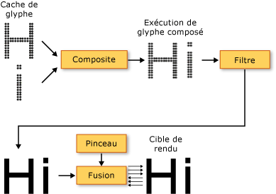
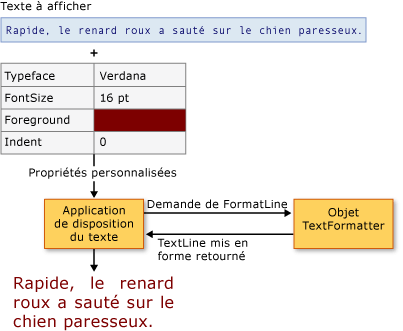

# Typographie dans WPFTypography in WPF
Cette rubrique présente les principales fonctionnalités typographiques de [!INCLUDE[TLA2#tla_winclient](../../../../includes/tla2sharptla-winclient-md.md)].This topic introduces the major typographic features of [!INCLUDE[TLA2#tla_winclient](../../../../includes/tla2sharptla-winclient-md.md)]. Ces fonctionnalités incluent l’amélioration de la qualité et des performances de rendu de texte, une prise en charge de la typographie [!INCLUDE[TLA#tla_opentype](../../../../includes/tlasharptla-opentype-md.md)], un texte international amélioré, une prise en charge de police améliorée et de nouvelles interfaces de programmation d’applications (API, Application Programming Interface) texte.These features include improved quality and performance of text rendering, [!INCLUDE[TLA#tla_opentype](../../../../includes/tlasharptla-opentype-md.md)] typography support, enhanced international text, enhanced font support, and new text application programming interfaces (APIs).  
  

  
   
## Amélioration de la qualité et des performances du texteImproved Quality and Performance of Text  
 Le texte dans [!INCLUDE[TLA2#tla_winclient](../../../../includes/tla2sharptla-winclient-md.md)] est affiché à l’aide de [!INCLUDE[TLA#tla_ct](../../../../includes/tlasharptla-ct-md.md)], ce qui améliore sa clarté et sa lisibilité.Text in [!INCLUDE[TLA2#tla_winclient](../../../../includes/tla2sharptla-winclient-md.md)] is rendered using [!INCLUDE[TLA#tla_ct](../../../../includes/tlasharptla-ct-md.md)], which enhances the clarity and readability of text. [!INCLUDE[TLA2#tla_ct](../../../../includes/tla2sharptla-ct-md.md)] est une technologie logicielle développée par [!INCLUDE[TLA#tla_ms](../../../../includes/tlasharptla-ms-md.md)] qui améliore la lisibilité du texte sur les écrans LCD existants, tels que les écrans d’ordinateurs portables, les écrans de Pocket PC et les écrans plats. is a software technology developed by [!INCLUDE[TLA#tla_ms](../../../../includes/tlasharptla-ms-md.md)] that improves the readability of text on existing LCDs (Liquid Crystal Displays), such as laptop screens, Pocket PC screens and flat panel monitors. [!INCLUDE[TLA2#tla_ct](../../../../includes/tla2sharptla-ct-md.md)] utilise un rendu d’une précision inférieure au pixel qui permet l’affichage du texte avec une fidélité supérieure à sa forme réelle en alignant les caractères sur une fraction d’un pixel. uses sub-pixel rendering which allows text to be displayed with a greater fidelity to its true shape by aligning characters on a fractional part of a pixel. Cette résolution accrue augmente la netteté des détails dans l’affichage textuel, ce qui facilite grandement la lecture pendant des périodes prolongées.The extra resolution increases the sharpness of the tiny details in text display, making it much easier to read over long durations. Parmi les autres améliorations de [!INCLUDE[TLA2#tla_ct](../../../../includes/tla2sharptla-ct-md.md)] dans [!INCLUDE[TLA2#tla_winclient](../../../../includes/tla2sharptla-winclient-md.md)], citons l’anticrénelage de direction y qui lisse le haut et le bas des courbes superficielles dans les caractères de texte.Another improvement of [!INCLUDE[TLA2#tla_ct](../../../../includes/tla2sharptla-ct-md.md)] in [!INCLUDE[TLA2#tla_winclient](../../../../includes/tla2sharptla-winclient-md.md)] is y-direction anti-aliasing, which smoothes the tops and bottoms of shallow curves in text characters. Pour plus d’informations sur les fonctionnalités [!INCLUDE[TLA2#tla_ct](../../../../includes/tla2sharptla-ct-md.md)], consultez [Vue d’ensemble de ClearType](../../../../docs/framework/wpf/advanced/cleartype-overview.md).For more details on [!INCLUDE[TLA2#tla_ct](../../../../includes/tla2sharptla-ct-md.md)] features, see [ClearType Overview](../../../../docs/framework/wpf/advanced/cleartype-overview.md).  
  
   
Texte avec anticrénelage ClearType dans la direction yText with ClearType y-direction antialiasing  
  
 L’ensemble du pipeline de rendu de texte peut être accéléré par matériel dans [!INCLUDE[TLA2#tla_winclient](../../../../includes/tla2sharptla-winclient-md.md)], sous réserve que votre ordinateur respecte le niveau matériel minimum exigé.The entire text rendering pipeline can be hardware-accelerated in [!INCLUDE[TLA2#tla_winclient](../../../../includes/tla2sharptla-winclient-md.md)] provided your machine meets the minimum level of hardware required. Un rendu ne pouvant pas être exécuté à l’aide de matériel repasse à un rendu logiciel.Rendering that cannot be performed using hardware falls back to software rendering. L’accélération matérielle affecte toutes les phases du pipeline de rendu de texte, du stockage de glyphes individuels à l’application de l’algorithme de fusion [!INCLUDE[TLA2#tla_ct](../../../../includes/tla2sharptla-ct-md.md)] à la sortie finale affichée, en passant par la constitution de glyphes en exécutions de glyphes et l’application d’effets.Hardware-acceleration affects all phases of the text rendering pipeline—from storing individual glyphs, compositing glyphs into glyph runs, applying effects, to applying the [!INCLUDE[TLA2#tla_ct](../../../../includes/tla2sharptla-ct-md.md)] blending algorithm to the final displayed output. Pour plus d’informations sur l’accélération matérielle, consultez [Couches de rendu graphiques](../../../../docs/framework/wpf/advanced/graphics-rendering-tiers.md).For more information on hardware acceleration, see [Graphics Rendering Tiers](../../../../docs/framework/wpf/advanced/graphics-rendering-tiers.md).  
  
   
Diagramme du pipeline de rendu de texteDiagram of the text rendering pipeline  
  
 En outre, un texte animé, par caractères ou par glyphes, tire pleinement parti de la fonction de matériel graphique activée par [!INCLUDE[TLA2#tla_winclient](../../../../includes/tla2sharptla-winclient-md.md)].In addition, animated text, whether by character or glyph, takes full advantage of the graphics hardware capability enabled by [!INCLUDE[TLA2#tla_winclient](../../../../includes/tla2sharptla-winclient-md.md)]. Il en résulte une animation de texte lisse.This results in smooth text animation.  
  
   
## Typographie richeRich Typography  
 Le format de police [!INCLUDE[TLA2#tla_opentype](../../../../includes/tla2sharptla-opentype-md.md)] est une extension du format de police [!INCLUDE[TLA#tla_truetype](../../../../includes/tlasharptla-truetype-md.md)].The [!INCLUDE[TLA2#tla_opentype](../../../../includes/tla2sharptla-opentype-md.md)] font format is an extension of the [!INCLUDE[TLA#tla_truetype](../../../../includes/tlasharptla-truetype-md.md)] font format. Le format de police [!INCLUDE[TLA2#tla_opentype](../../../../includes/tla2sharptla-opentype-md.md)], développé conjointement par [!INCLUDE[TLA#tla_ms](../../../../includes/tlasharptla-ms-md.md)] et Adobe, offre un large éventail de fonctionnalités typographiques avancées.The [!INCLUDE[TLA2#tla_opentype](../../../../includes/tla2sharptla-opentype-md.md)] font format was developed jointly by [!INCLUDE[TLA#tla_ms](../../../../includes/tlasharptla-ms-md.md)] and Adobe, and provides a rich assortment of advanced typographic features. Le <xref:System.Windows.Documents.Typography> objet expose la plupart des fonctionnalités avancées de [!INCLUDE[TLA2#tla_opentype](../../../../includes/tla2sharptla-opentype-md.md)] polices, tels que des glyphes ornés et les variantes stylistiques.The <xref:System.Windows.Documents.Typography> object exposes many of the advanced features of [!INCLUDE[TLA2#tla_opentype](../../../../includes/tla2sharptla-opentype-md.md)] fonts, such as stylistic alternates and swashes. Le [!INCLUDE[TLA2#tla_lhsdk](../../../../includes/tla2sharptla-lhsdk-md.md)] fournit un jeu d’exemples de polices [!INCLUDE[TLA2#tla_opentype](../../../../includes/tla2sharptla-opentype-md.md)] conçues avec des fonctionnalités riches, telles que les polices Pericles et Pescadero.The [!INCLUDE[TLA2#tla_lhsdk](../../../../includes/tla2sharptla-lhsdk-md.md)] provides a set of sample [!INCLUDE[TLA2#tla_opentype](../../../../includes/tla2sharptla-opentype-md.md)] fonts that are designed with rich features, such as the Pericles and Pescadero fonts. Pour plus d’informations, consultez [Exemple de pack de polices OpenType](../../../../docs/framework/wpf/advanced/sample-opentype-font-pack.md).For more information, see [Sample OpenType Font Pack](../../../../docs/framework/wpf/advanced/sample-opentype-font-pack.md).  
  
 La police [!INCLUDE[TLA2#tla_opentype](../../../../includes/tla2sharptla-opentype-md.md)] Pericles contient des glyphes supplémentaires qui représentent des variantes stylistiques au jeu de glyphes standard.The Pericles [!INCLUDE[TLA2#tla_opentype](../../../../includes/tla2sharptla-opentype-md.md)] font contains additional glyphs that provide stylistic alternates to the standard set of glyphs. Le texte suivant présente des glyphes de style alternatif.The following text displays stylistic alternate glyphs.  
  
   
Texte utilisant des glyphes de style alternatifs OpenTypeText using OpenType stylistic alternate glyphs  
  
 Les lettres ornées sont des glyphes décoratifs qui utilisent une ornementation élaborée souvent associée à la calligraphie.Swashes are decorative glyphs that use elaborate ornamentation often associated with calligraphy. Le texte suivant présente des glyphes standard et des glyphes à lettres ornées avec la police Pescadero.The following text displays standard and swash glyphs for the Pescadero font.  
  
   
Texte utilisant des glyphes standard et ornés OpenTypeText using OpenType standard and swash glyphs  
  
 Pour plus d’informations sur les fonctionnalités [!INCLUDE[TLA2#tla_opentype](../../../../includes/tla2sharptla-opentype-md.md)], consultez [Fonctionnalités des polices OpenType](../../../../docs/framework/wpf/advanced/opentype-font-features.md).For more details on [!INCLUDE[TLA2#tla_opentype](../../../../includes/tla2sharptla-opentype-md.md)] features, see [OpenType Font Features](../../../../docs/framework/wpf/advanced/opentype-font-features.md).  
  
   
## Prise en charge améliorée du texte internationalEnhanced International Text Support  
 [!INCLUDE[TLA2#tla_winclient](../../../../includes/tla2sharptla-winclient-md.md)] offre une prise en charge améliorée du texte international par le biais des fonctionnalités suivantes : provides enhanced international text support by providing the following features:  
  
-   Interligne automatique dans tous les systèmes d’écriture, par le biais de mesures adaptables.Automatic line-spacing in all writing systems, using adaptive measurement.  
  
-   Prise en charge générale du texte international.Broad support for international text. Pour plus d’informations, consultez [Globalisation pour WPF](../../../../docs/framework/wpf/advanced/globalization-for-wpf.md).For more information, see [Globalization for WPF](../../../../docs/framework/wpf/advanced/globalization-for-wpf.md).  
  
-   Saut de ligne, césure et justification par langue.Language-guided line breaking, hyphenation, and justification.  
  
   
## Prise en charge améliorée des policesEnhanced Font Support  
 [!INCLUDE[TLA2#tla_winclient](../../../../includes/tla2sharptla-winclient-md.md)] offre une prise en charge améliorée des polices par le biais des fonctionnalités suivantes : provides enhanced font support by providing the following features:  
  
-   Unicode pour tout le texte.Unicode for all text. La sélection et le comportement de la police ne requièrent plus de jeu de caractères ou de page de codes.Font behavior and selection no longer require charset or codepage.  
  
-   Comportement de police indépendant des paramètres globaux, tels que les paramètres régionaux du système.Font behavior independent of global settings, such as system locale.  
  
-   Distinct <xref:System.Windows.FontWeight>, <xref:System.Windows.FontStretch>, et <xref:System.Windows.FontStyle> types permettant de définir un <xref:System.Windows.Media.FontFamily>.Separate <xref:System.Windows.FontWeight>, <xref:System.Windows.FontStretch>, and <xref:System.Windows.FontStyle> types for defining a <xref:System.Windows.Media.FontFamily>. Cette fonctionnalité offre une souplesse plus importante que dans la programmation [!INCLUDE[TLA#tla_win32](../../../../includes/tlasharptla-win32-md.md)], dans laquelle des combinaisons Boolean de caractères italiques et gras sont utilisées pour définir une famille de polices.This provides greater flexibility than in [!INCLUDE[TLA#tla_win32](../../../../includes/tlasharptla-win32-md.md)] programming, in which Boolean combinations of italic and bold are used to define a font family.  
  
-   Sens d’écriture (horizontal ou vertical) géré indépendamment du nom de police.Writing direction (horizontal versus vertical) handled independent of font name.  
  
-   Police de liaison et police de substitution dans un fichier [!INCLUDE[TLA#tla_xml](../../../../includes/tlasharptla-xml-md.md)] portable, à l’aide de la technologie de police composite.Font linking and font fallback in a portable [!INCLUDE[TLA#tla_xml](../../../../includes/tlasharptla-xml-md.md)] file, using composite font technology. Les polices composites permettent de générer une gamme complète de polices multilingues.Composite fonts allow for the construction of full range multilingual fonts. Les polices composites fournissent également un mécanisme qui évite d’afficher les glyphes manquants.Composite fonts also provide a mechanism that avoids displaying missing glyphs. Pour plus d’informations, consultez les notes figurant dans la <xref:System.Windows.Media.FontFamily> classe.For more information, see the remarks in the <xref:System.Windows.Media.FontFamily> class.  
  
-   Polices internationales générées à partir de polices composites, à l’aide d’un groupe de polices d’une seule langue.International fonts built from composite fonts, using a group of single-language fonts. Cela permet de limiter les coûts de ressources lors du développement de polices pour plusieurs langues.This saves on resource costs when developing fonts for multiple languages.  
  
-   Polices composites incorporées dans un document, autorisant ainsi la portabilité du document.Composite fonts embedded in a document, thereby providing document portability. Pour plus d’informations, consultez les notes figurant dans la <xref:System.Windows.Media.FontFamily> classe.For more information, see the remarks in the <xref:System.Windows.Media.FontFamily> class.  
  
   
## Nouvelles interfaces de programmation d’applications (API) texteNew Text Application Programming Interfaces (APIs)  
 [!INCLUDE[TLA2#tla_winclient](../../../../includes/tla2sharptla-winclient-md.md)] fournit plusieurs [!INCLUDE[TLA2#tla_api#plural](../../../../includes/tla2sharptla-apisharpplural-md.md)] texte que les développeurs doivent utiliser quand ils incluent du texte dans leurs applications. provides several text [!INCLUDE[TLA2#tla_api#plural](../../../../includes/tla2sharptla-apisharpplural-md.md)] for developers to use when including text in their applications. Ces [!INCLUDE[TLA2#tla_api#plural](../../../../includes/tla2sharptla-apisharpplural-md.md)] sont réparties en trois catégories :These [!INCLUDE[TLA2#tla_api#plural](../../../../includes/tla2sharptla-apisharpplural-md.md)] are grouped into three categories:  
  
-   **Disposition et interface utilisateur**.**Layout and user interface**. Contrôles de texte courants pour l’interface graphique utilisateur ([!INCLUDE[TLA#tla_gui](../../../../includes/tlasharptla-gui-md.md)]).The common text controls for the [!INCLUDE[TLA#tla_gui](../../../../includes/tlasharptla-gui-md.md)].  
  
-   **Dessin de texte léger**.**Lightweight text drawing**. Permet de dessiner du texte directement sur des objets.Allows you to draw text directly to objects.  
  
-   **Mise en forme du texte avancée**.**Advanced text formatting**. Permet d’implémenter un moteur de texte personnalisé.Allows you to implement a custom text engine.  
  
### Disposition et interface utilisateurLayout and User Interface  
 Niveau le plus élevé de fonctionnalités, le texte [!INCLUDE[TLA2#tla_api#plural](../../../../includes/tla2sharptla-apisharpplural-md.md)] fournir commun [!INCLUDE[TLA#tla_ui](../../../../includes/tlasharptla-ui-md.md)] contrôles tels que <xref:System.Windows.Controls.Label>, <xref:System.Windows.Controls.TextBlock>, et <xref:System.Windows.Controls.TextBox>.At the highest level of functionality, the text [!INCLUDE[TLA2#tla_api#plural](../../../../includes/tla2sharptla-apisharpplural-md.md)] provide common [!INCLUDE[TLA#tla_ui](../../../../includes/tlasharptla-ui-md.md)] controls such as <xref:System.Windows.Controls.Label>, <xref:System.Windows.Controls.TextBlock>, and <xref:System.Windows.Controls.TextBox>. Ces contrôles fournissent les éléments [!INCLUDE[TLA2#tla_ui](../../../../includes/tla2sharptla-ui-md.md)] de base dans une application et proposent une méthode simple pour présenter le texte et interagir avec celui-ci.These controls provide the basic [!INCLUDE[TLA2#tla_ui](../../../../includes/tla2sharptla-ui-md.md)] elements within an application, and offer an easy way to present and interact with text. Les contrôles tels que <xref:System.Windows.Controls.RichTextBox> et <xref:System.Windows.Controls.PasswordBox> activer plus avancée ou spécialisée de la gestion du texte.Controls such as <xref:System.Windows.Controls.RichTextBox> and <xref:System.Windows.Controls.PasswordBox> enable more advanced or specialized text-handling. Les classes telles que <xref:System.Windows.Documents.TextRange>, <xref:System.Windows.Documents.TextSelection>, et <xref:System.Windows.Documents.TextPointer> activer manipulation utile du texte.And classes such as <xref:System.Windows.Documents.TextRange>, <xref:System.Windows.Documents.TextSelection>, and <xref:System.Windows.Documents.TextPointer> enable useful text manipulation. Ces [!INCLUDE[TLA2#tla_ui](../../../../includes/tla2sharptla-ui-md.md)] contrôles fournissent des propriétés telles que <xref:System.Windows.Controls.Control.FontFamily%2A>, <xref:System.Windows.Controls.Control.FontSize%2A>, et <xref:System.Windows.Controls.Control.FontStyle%2A>, qui permettent de contrôler la police qui est utilisée pour restituer le texte.These [!INCLUDE[TLA2#tla_ui](../../../../includes/tla2sharptla-ui-md.md)] controls provide properties such as <xref:System.Windows.Controls.Control.FontFamily%2A>, <xref:System.Windows.Controls.Control.FontSize%2A>, and <xref:System.Windows.Controls.Control.FontStyle%2A>, which enable you to control the font that is used to render the text.  
  
#### Utilisation d’effets bitmap, de transformations et d’effets de texteUsing Bitmap Effects, Transforms, and Text Effects  
 [!INCLUDE[TLA2#tla_winclient](../../../../includes/tla2sharptla-winclient-md.md)] vous permet de créer des utilisations visuellement intéressantes de texte par le biais des fonctionnalités d’utilisation telles que les effets bitmap, les transformations et les effets de texte. allows you to create visually interesting uses of text by uses features such as bitmap effects, transforms, and text effects. L’exemple suivant présente un type classique d’effet d’ombre portée appliqué au texte.The following example shows a typical type of a drop shadow effect applied to text.  
  
   
Texte avec ombre portéeText with a drop shadow  
  
 L’exemple suivant présente un effet d’ombre portée et un bruit appliqués au texte.The following example shows a drop shadow effect and noise applied to text.  
  
   
Texte avec ombre portée et bruitText with a drop shadow and noise  
  
 L’exemple suivant présente un effet d’éclat extérieur appliqué au texte.The following example shows an outer glow effect applied to text.  
  
   
Texte avec effet d’éclat extérieurText with an outer glow effect  
  
 L’exemple suivant présente un effet de flou appliqué au texte.The following example shows a blur effect applied to text.  
  
   
Texte avec effet de flouText with a blur effect  
  
 Dans l’exemple suivant, la deuxième ligne du texte est mise à l’échelle par 150 % le long de l’axe x et la troisième ligne du texte est mise à l’échelle par 150 % le long de l’axe y.The following example shows the second line of text scaled by 150% along the x-axis, and the third line of text scaled by 150% along the y-axis.  
  
   
Texte avec ScaleTransformText using a ScaleTransform  
  
 L’exemple suivant présente le texte incliné le long de l’axe x.The following example shows text skewed along the x-axis.  
  
   
Texte avec SkewTransformText using a SkewTransform  
  
 A <xref:System.Windows.Media.TextEffect> l’objet est un objet d’assistance qui vous permet de traiter le texte comme un ou plusieurs groupes de caractères dans une chaîne de texte.A <xref:System.Windows.Media.TextEffect> object is a helper object that allows you to treat text as one or more groups of characters in a text string. L’exemple suivant montre un caractère individuel qui fait l’objet d’une rotation.The following example shows an individual character being rotated. Chaque caractère fait indépendamment l’objet d’une rotation à intervalles d’une seconde.Each character is rotated independently at 1-second intervals.  
  
   
Exemple d’animation d’un effet de rotation du texteExample of a rotating text effect animation  
  
#### Utilisation de documents dynamiquesUsing Flow Documents  
 En plus courantes [!INCLUDE[TLA2#tla_ui](../../../../includes/tla2sharptla-ui-md.md)] contrôles, [!INCLUDE[TLA2#tla_winclient](../../../../includes/tla2sharptla-winclient-md.md)] offre un contrôle de disposition pour la présentation de texte : le <xref:System.Windows.Documents.FlowDocument> élément.In addition to the common [!INCLUDE[TLA2#tla_ui](../../../../includes/tla2sharptla-ui-md.md)] controls, [!INCLUDE[TLA2#tla_winclient](../../../../includes/tla2sharptla-winclient-md.md)] offers a layout control for text presentation—the <xref:System.Windows.Documents.FlowDocument> element. Le <xref:System.Windows.Documents.FlowDocument> élément, conjointement avec la <xref:System.Windows.Controls.DocumentViewer> élément, fournit un contrôle pour les grandes quantités de texte avec diverses spécifications de disposition.The <xref:System.Windows.Documents.FlowDocument> element, in conjunction with the <xref:System.Windows.Controls.DocumentViewer> element, provides a control for large amounts of text with varying layout requirements. Contrôles de disposition de fournissent un accès à une typographie avancée via le <xref:System.Windows.Documents.Typography> objet et les propriétés de police des autres [!INCLUDE[TLA2#tla_ui](../../../../includes/tla2sharptla-ui-md.md)] contrôles.Layout controls provide access to advanced typography through the <xref:System.Windows.Documents.Typography> object and font-related properties of other [!INCLUDE[TLA2#tla_ui](../../../../includes/tla2sharptla-ui-md.md)] controls.  
  
 L’exemple suivant montre le contenu de texte hébergé dans un <xref:System.Windows.Controls.FlowDocumentReader>, qui fournit la recherche, la navigation, la pagination et mise à l’échelle prise en charge de contenu.The following example shows text content hosted in a <xref:System.Windows.Controls.FlowDocumentReader>, which provides search, navigation, pagination, and content scaling support.  
  
   
Texte hébergé dans un FlowDocumentReaderText hosted in a FlowDocumentReader  
  
 Pour plus d’informations, consultez [Documents dans WPF](../../../../docs/framework/wpf/advanced/documents-in-wpf.md).For more information, see [Documents in WPF](../../../../docs/framework/wpf/advanced/documents-in-wpf.md).  
  
### Dessin de texte légerLightweight Text Drawing  
 Vous pouvez dessiner du texte directement à [!INCLUDE[TLA2#tla_winclient](../../../../includes/tla2sharptla-winclient-md.md)] objets à l’aide de la <xref:System.Windows.Media.DrawingContext.DrawText%2A> méthode de la <xref:System.Windows.Media.DrawingContext> objet.You can draw text directly to [!INCLUDE[TLA2#tla_winclient](../../../../includes/tla2sharptla-winclient-md.md)] objects by using the <xref:System.Windows.Media.DrawingContext.DrawText%2A> method of the <xref:System.Windows.Media.DrawingContext> object. Pour utiliser cette méthode, vous créez un <xref:System.Windows.Media.FormattedText> objet.To use this method, you create a <xref:System.Windows.Media.FormattedText> object. Cet objet vous permet de dessiner du texte multiligne dans lequel chaque caractère du texte peut être mis en forme individuellement.This object allows you to draw multi-line text, in which each character in the text can be individually formatted. Les fonctionnalités de la <xref:System.Windows.Media.FormattedText> objet contient une grande partie des fonctionnalités des indicateurs DrawText dans l’API Win32.The functionality of the <xref:System.Windows.Media.FormattedText> object contains much of the functionality of the DrawText flags in the Win32 API. En outre, le <xref:System.Windows.Media.FormattedText> objet contient des fonctionnalités telles que la prise en charge des points de suspension, dans lequel les points de suspension s’affiche lorsque le texte dépasse les limites.In addition, the <xref:System.Windows.Media.FormattedText> object contains functionality such as ellipsis support, in which an ellipsis is displayed when text exceeds its bounds. L’exemple suivant présente un texte auquel plusieurs formats sont appliqués, notamment un dégradé linéaire sur les deuxième et troisième mots.The following example shows text that has several formats applied to it, including a linear gradient on the second and third words.  
  
   
Texte affiché avec l’objet FormattedTextDisplayed text using FormattedText object  
  
 Vous pouvez convertir le texte mis en forme dans <xref:System.Windows.Media.Geometry> objets, ce qui vous permet de créer d’autres types de texte visuellement intéressant.You can convert formatted text into <xref:System.Windows.Media.Geometry> objects, allowing you to create other types of visually interesting text. Par exemple, vous pouvez créer un <xref:System.Windows.Media.Geometry> objet basé sur le contour d’une chaîne de texte.For example, you could create a <xref:System.Windows.Media.Geometry> object based on the outline of a text string.  
  
   
Contour du texte utilisant un pinceau de dégradé linéaireText outline using a linear gradient brush  
  
 Les exemples suivants illustrent plusieurs façons de créer des effets visuels intéressants en modifiant le trait, le remplissage et la surbrillance du texte converti.The following examples illustrate several ways of creating interesting visual effects by modifying the stroke, fill, and highlight of converted text.  
  
   
Exemple de définition du trait et du remplissage de différentes couleursExample of setting stroke and fill to different colors  
  
   
Exemple de pinceau image appliqué au traitExample of an image brush applied to the stroke  
  
   
Exemple de pinceau image appliqué au trait et surbrillanceExample of an image brush applied to the stroke and highlight  
  
 Pour plus d’informations sur la <xref:System.Windows.Media.FormattedText> d’objets, consultez [texte au format de dessin](../../../../docs/framework/wpf/advanced/drawing-formatted-text.md).For more information on the <xref:System.Windows.Media.FormattedText> object, see [Drawing Formatted Text](../../../../docs/framework/wpf/advanced/drawing-formatted-text.md).  
  
### Mise en forme de texte avancéeAdvanced Text Formatting  
 Au niveau le plus avancé du texte [!INCLUDE[TLA2#tla_api#plural](../../../../includes/tla2sharptla-apisharpplural-md.md)], [!INCLUDE[TLA2#tla_winclient](../../../../includes/tla2sharptla-winclient-md.md)] vous offre la possibilité de créer la disposition du texte personnalisé à l’aide de la <xref:System.Windows.Media.TextFormatting.TextFormatter> objet et autres types dans le <xref:System.Windows.Media.TextFormatting> espace de noms.At the most advanced level of the text [!INCLUDE[TLA2#tla_api#plural](../../../../includes/tla2sharptla-apisharpplural-md.md)], [!INCLUDE[TLA2#tla_winclient](../../../../includes/tla2sharptla-winclient-md.md)] offers you the ability to create custom text layout by using the <xref:System.Windows.Media.TextFormatting.TextFormatter> object and other types in the <xref:System.Windows.Media.TextFormatting> namespace. Le <xref:System.Windows.Media.TextFormatting.TextFormatter> et autoriser les classes associées vous permet d’implémenter la mise en page de texte personnalisé qui prend en charge votre propre définition des formats de caractère, styles de paragraphe, règles de saut de ligne et autres fonctionnalités de disposition pour le texte international.The <xref:System.Windows.Media.TextFormatting.TextFormatter> and associated classes allow you to implement custom text layout that supports your own definition of character formats, paragraph styles, line breaking rules, and other layout features for international text. Dans certains cas, vous pouvez être amené à remplacer l’implémentation par défaut de la prise en charge de la disposition du texte [!INCLUDE[TLA2#tla_winclient](../../../../includes/tla2sharptla-winclient-md.md)].There are very few cases in which you would want to override the default implementation of the [!INCLUDE[TLA2#tla_winclient](../../../../includes/tla2sharptla-winclient-md.md)] text layout support. Toutefois, si vous créez une application ou un contrôle d’édition de texte, vous aurez peut-être besoin d’une implémentation différente de l’implémentation [!INCLUDE[TLA2#tla_winclient](../../../../includes/tla2sharptla-winclient-md.md)] par défaut.However, if you were creating a text editing control or application, you might require a different implementation than the default [!INCLUDE[TLA2#tla_winclient](../../../../includes/tla2sharptla-winclient-md.md)] implementation.  
  
 Contrairement à un texte traditionnelle [!INCLUDE[TLA#tla_api](../../../../includes/tlasharptla-api-md.md)], le <xref:System.Windows.Media.TextFormatting.TextFormatter> interagit avec un client de mise en page de texte via un ensemble de méthodes de rappel.Unlike a traditional text [!INCLUDE[TLA#tla_api](../../../../includes/tlasharptla-api-md.md)], the <xref:System.Windows.Media.TextFormatting.TextFormatter> interacts with a text layout client through a set of callback methods. Il nécessite le client fournisse ces méthodes dans une implémentation de la <xref:System.Windows.Media.TextFormatting.TextSource> classe.It requires the client to provide these methods in an implementation of the <xref:System.Windows.Media.TextFormatting.TextSource> class. Le diagramme suivant illustre l’interaction de mise en page de texte entre l’application cliente et <xref:System.Windows.Media.TextFormatting.TextFormatter>.The following diagram illustrates the text layout interaction between the client application and <xref:System.Windows.Media.TextFormatting.TextFormatter>.  
  
   
Interaction entre l’application et TextFormatterInteraction between application and TextFormatter  
  
 Pour plus d’informations sur la création de la disposition de texte personnalisée, consultez [Mise en forme de texte avancée](../../../../docs/framework/wpf/advanced/advanced-text-formatting.md).For more details on creating custom text layout, see [Advanced Text Formatting](../../../../docs/framework/wpf/advanced/advanced-text-formatting.md).  
  
## Voir aussiSee Also  
 <xref:System.Windows.Media.FormattedText>  
 <xref:System.Windows.Media.TextFormatting.TextFormatter>  
 [Vue d’ensemble ClearTypeClearType Overview](../../../../docs/framework/wpf/advanced/cleartype-overview.md)  
 [Fonctionnalités des polices OpenTypeOpenType Font Features](../../../../docs/framework/wpf/advanced/opentype-font-features.md)  
 [Dessin du texte mis en formeDrawing Formatted Text](../../../../docs/framework/wpf/advanced/drawing-formatted-text.md)  
 [Mise en forme de texte avancéeAdvanced Text Formatting](../../../../docs/framework/wpf/advanced/advanced-text-formatting.md)  
 [TextText](../../../../docs/framework/wpf/advanced/optimizing-performance-text.md)  
 [Typographie MicrosoftMicrosoft Typography](http://www.microsoft.com/typography/default.mspx)
