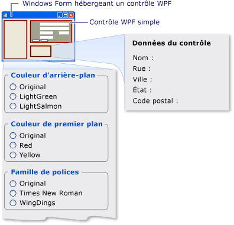

# <a name="walkthrough-hosting-a-wpf-composite-control-in-windows-forms"></a>Procédure pas à pas : hébergement d'un contrôle composite WPF dans les Windows Forms
[!INCLUDE[TLA#tla_winclient](../../../../includes/tlasharptla-winclient-md.md)] propose un environnement de création d'applications élaboré. Toutefois, lorsque vous avez beaucoup investi [!INCLUDE[TLA#tla_winforms](../../../../includes/tlasharptla-winforms-md.md)] code, il peut être plus efficace d’étendre votre [!INCLUDE[TLA#tla_winforms](../../../../includes/tlasharptla-winforms-md.md)] application avec [!INCLUDE[TLA2#tla_winclient](../../../../includes/tla2sharptla-winclient-md.md)] plutôt qu’à la réécrire à partir de zéro. Un scénario courant est lorsque vous souhaitez incorporer une ou plusieurs contrôles mis en œuvre avec [!INCLUDE[TLA2#tla_winclient](../../../../includes/tla2sharptla-winclient-md.md)] au sein de votre [!INCLUDE[TLA2#tla_winforms](../../../../includes/tla2sharptla-winforms-md.md)] application. Pour plus d’informations sur la personnalisation des contrôles WPF, consultez [personnalisation du contrôle](../../../../docs/framework/wpf/controls/control-customization.md).  
  
 Cette procédure pas à pas vous guide dans une application qui héberge un [!INCLUDE[TLA2#tla_winclient](../../../../includes/tla2sharptla-winclient-md.md)] contrôle composite pour effectuer la saisie de données dans un [!INCLUDE[TLA2#tla_winforms](../../../../includes/tla2sharptla-winforms-md.md)] application. Le contrôle composite est empaqueté dans une DLL. Cette procédure générale peut être étendue à des applications et des contrôles plus complexes. Cette procédure pas à pas est conçu pour être pratiquement identiques dans l’apparence et la fonctionnalité à [procédure pas à pas : hébergement d’un contrôle Windows Forms Composite dans WPF](../../../../docs/framework/wpf/advanced/walkthrough-hosting-a-windows-forms-composite-control-in-wpf.md). La principale différence est que le scénario d’hébergement est inversé.  
  
 La procédure pas à pas est divisée en deux sections. La première section décrit brièvement l’implémentation de la [!INCLUDE[TLA2#tla_winclient](../../../../includes/tla2sharptla-winclient-md.md)] contrôle composite. La deuxième section explique en détail comment héberger le contrôle composite dans une [!INCLUDE[TLA2#tla_winforms](../../../../includes/tla2sharptla-winforms-md.md)] application, recevoir des événements à partir du contrôle et accéder à certaines des propriétés du contrôle.  
  
 Cette procédure pas à pas décrit notamment les tâches suivantes :  
  
-   Implémentation du contrôle composite WPF  
  
-   Implémentation de l’application hôte Windows Forms  
  
 Pour l’intégralité du code des tâches illustrées dans cette procédure pas à pas, consultez [hébergement d’un contrôle Composite WPF dans les Windows Forms exemple](http://go.microsoft.com/fwlink/?LinkID=159996).  
  
## <a name="prerequisites"></a>Prérequis  
 Pour exécuter cette procédure pas à pas, vous devez disposer des composants suivants :  
  
-   [!INCLUDE[vs_dev10_long](../../../../includes/vs-dev10-long-md.md)].  
  
## <a name="implementing-the-wpf-composite-control"></a>Implémentation du contrôle composite WPF  
 Le [!INCLUDE[TLA2#tla_winclient](../../../../includes/tla2sharptla-winclient-md.md)] contrôle composite utilisée dans cet exemple est un formulaire de saisie de données simple qui prend le nom et l’adresse de l’utilisateur. Lorsque l’utilisateur clique sur l’un des deux boutons pour indiquer que la tâche est terminée, le contrôle déclenche un événement personnalisé pour retourner ces informations à l’hôte. L’illustration suivante montre le rendu du contrôle.  
  
   
Contrôle composite WPF  
  
### <a name="creating-the-project"></a>Création du projet  
 Pour démarrer le projet :  
  
1.  Lancez [!INCLUDE[TLA#tla_visualstu](../../../../includes/tlasharptla-visualstu-md.md)], puis ouvrez le **nouveau projet** boîte de dialogue.  
  
2.  Dans Visual c# et la catégorie de Windows, sélectionnez le **bibliothèque de contrôles utilisateur WPF** modèle.  
  
3.  Nommez le nouveau projet `MyControls`.  
  
4.  Pour l’emplacement, spécifiez un dossier, tel que `WindowsFormsHostingWpfControl`. Plus tard, vous placerez l’application hôte dans ce dossier.  
  
5.  Cliquez sur **OK** pour créer le projet. Le projet par défaut contienne un seul contrôle nommé `UserControl1`.  
  
6.  Dans l’Explorateur de solutions, renommez `UserControl1` à `MyControl1`.  
  
 Votre projet doit comporter des références aux DLL système suivantes. Si l’une de ces DLL n’est pas incluse par défaut, ajoutez-la à votre projet.  
  
-   PresentationCore  
  
-   PresentationFramework  
  
-   Système  
  
-   WindowsBase  
  
### <a name="creating-the-user-interface"></a>Création de l’interface utilisateur  
 Le [!INCLUDE[TLA#tla_ui](../../../../includes/tlasharptla-ui-md.md)] pour le contrôle composite est implémenté avec [!INCLUDE[TLA#tla_xaml](../../../../includes/tlasharptla-xaml-md.md)]. Le contrôle composite [!INCLUDE[TLA2#tla_ui](../../../../includes/tla2sharptla-ui-md.md)] se compose de cinq <xref:System.Windows.Controls.TextBox> éléments. Chaque <xref:System.Windows.Controls.TextBox> élément est associé à un <xref:System.Windows.Controls.TextBlock> élément qui sert d’étiquette. Il existe deux <xref:System.Windows.Controls.Button> éléments en bas, **OK** et **Annuler**. Lorsque l’utilisateur clique sur l’un de ces boutons, le contrôle déclenche un événement personnalisé pour retourner les informations à l’hôte.  
  
#### <a name="basic-layout"></a>Disposition de base  
 Les différentes [!INCLUDE[TLA2#tla_ui](../../../../includes/tla2sharptla-ui-md.md)] éléments sont contenus dans un <xref:System.Windows.Controls.Grid> élément. Vous pouvez utiliser <xref:System.Windows.Controls.Grid> pour organiser le contenu du composite contrôle à peu près la même façon vous utiliseriez un `Table` élément au format HTML. [!INCLUDE[TLA2#tla_winclient](../../../../includes/tla2sharptla-winclient-md.md)]possède également un <xref:System.Windows.Documents.Table> élément, mais <xref:System.Windows.Controls.Grid> est plus léger et convient mieux pour les tâches de mise en page simple.  
  
 Le code XAML suivant montre la disposition de base. Ce code XAML définit la structure globale du contrôle en spécifiant le nombre de colonnes et lignes dans le <xref:System.Windows.Controls.Grid> élément.  
  
 Dans MyControl1.xaml, remplacez le code XAML existant par le code XAML suivant.  
  
 [!code-xaml[WindowsFormsHostingWpfControl#101](../../../../samples/snippets/csharp/VS_Snippets_Wpf/WindowsFormsHostingWpfControl/CSharp/MyControls/Page1.xaml#101)]  
[!code-xaml[WindowsFormsHostingWpfControl#102](../../../../samples/snippets/csharp/VS_Snippets_Wpf/WindowsFormsHostingWpfControl/CSharp/MyControls/Page1.xaml#102)]  
  
#### <a name="adding-textblock-and-textbox-elements-to-the-grid"></a>Ajout d’éléments TextBlock et TextBox à la grille  
 Vous placez un [!INCLUDE[TLA2#tla_ui](../../../../includes/tla2sharptla-ui-md.md)] élément dans la grille en définissant l’élément <xref:System.Windows.Controls.Grid.RowProperty> et <xref:System.Windows.Controls.Grid.ColumnProperty> d’attributs pour le nombre de lignes et de colonnes approprié. N’oubliez pas que la numérotation des lignes et des colonnes est de base zéro. Vous pouvez avoir un élément s’étendent sur plusieurs colonnes en définissant son <xref:System.Windows.Controls.Grid.ColumnSpanProperty> attribut. Pour plus d’informations sur <xref:System.Windows.Controls.Grid> éléments, consultez [créer un élément de grille](../../../../docs/framework/wpf/controls/how-to-create-a-grid-element.md).  
  
 Le code XAML suivant montre le contrôle composite <xref:System.Windows.Controls.TextBox> et <xref:System.Windows.Controls.TextBlock> éléments avec leurs <xref:System.Windows.Controls.Grid.RowProperty> et <xref:System.Windows.Controls.Grid.ColumnProperty> les attributs qui sont définies à placer correctement les éléments dans la grille.  
  
 Dans MyControl1.xaml, ajoutez le code XAML suivant dans la <xref:System.Windows.Controls.Grid> élément.  
  
 [!code-xaml[WindowsFormsHostingWpfControl#103](../../../../samples/snippets/csharp/VS_Snippets_Wpf/WindowsFormsHostingWpfControl/CSharp/MyControls/Page1.xaml#103)]  
  
#### <a name="styling-the-ui-elements"></a>Styles des éléments d’interface utilisateur  
 De nombreux éléments du formulaire de saisie de données ont une apparence semblable, ce qui signifie qu’ils ont des paramètres identiques pour plusieurs de leurs propriétés. Plutôt que définir séparément les attributs de chaque élément, le code XAML précédent utilise <xref:System.Windows.Style> éléments pour définir les paramètres de propriété standard pour les classes d’éléments. Cette approche réduit la complexité du contrôle et permet de modifier l’apparence de plusieurs éléments via un même attribut de style.  
  
 Le <xref:System.Windows.Style> éléments sont contenus dans le <xref:System.Windows.Controls.Grid> l’élément <xref:System.Windows.FrameworkElement.Resources%2A> propriété, afin qu’ils puissent être utilisées par tous les éléments dans le contrôle. Si un style est nommé, vous l’appliquez à un élément en ajoutant un <xref:System.Windows.Style> élément défini sur le nom du style. Les styles qui ne sont pas nommés deviennent le style par défaut de l’élément. Pour plus d’informations sur [!INCLUDE[TLA2#tla_winclient](../../../../includes/tla2sharptla-winclient-md.md)] styles, consultez [styles et modèles](../../../../docs/framework/wpf/controls/styling-and-templating.md).  
  
 Le XAML suivant affiche le <xref:System.Windows.Style> éléments pour le contrôle composite. Pour voir comment les styles sont appliqués aux éléments, reportez-vous au code XAML précédent. Par exemple, le dernier <xref:System.Windows.Controls.TextBlock> élément a le `inlineText` style et le dernier <xref:System.Windows.Controls.TextBox> élément utilise le style par défaut.  
  
 Dans MyControl1.xaml, ajoutez le code XAML suivant juste après la <xref:System.Windows.Controls.Grid> élément de début.  
  
 [!code-xaml[WindowsFormsHostingWpfControl#104](../../../../samples/snippets/csharp/VS_Snippets_Wpf/WindowsFormsHostingWpfControl/CSharp/MyControls/Page1.xaml#104)]  
  
#### <a name="adding-the-ok-and-cancel-buttons"></a>Ajout des boutons OK et Annuler  
 Les derniers éléments du contrôle composite sont les **OK** et **Annuler** <xref:System.Windows.Controls.Button> éléments, qui occupent les deux premières colonnes de la dernière ligne de la <xref:System.Windows.Controls.Grid>. Ces éléments utilisent un gestionnaire d’événements courants `ButtonClicked`et la valeur par défaut <xref:System.Windows.Controls.Button> style défini dans le code XAML précédent.  
  
 Dans MyControl1.xaml, ajoutez le code XAML suivant après la dernière <xref:System.Windows.Controls.TextBox> élément. Le [!INCLUDE[TLA2#tla_xaml](../../../../includes/tla2sharptla-xaml-md.md)] partie du contrôle composite est maintenant terminée.  
  
 [!code-xaml[WindowsFormsHostingWpfControl#105](../../../../samples/snippets/csharp/VS_Snippets_Wpf/WindowsFormsHostingWpfControl/CSharp/MyControls/Page1.xaml#105)]  
  
### <a name="implementing-the-code-behind-file"></a>Implémentation du fichier code-behind  
 Le fichier code-behind, MyControl1.xaml.cs implémente trois tâches essentielles :
  
1.  La gestion de l’événement qui se produit lorsque l’utilisateur clique sur l’un des boutons  
  
2.  Récupère les données à partir de la <xref:System.Windows.Controls.TextBox> éléments et les empaquette dans un objet d’argument d’événement personnalisé.  
  
3.  Déclenche personnalisé `OnButtonClick` événement, qui avertit l’hôte que l’utilisateur est terminé et transmet les données à l’hôte.  
  
 Le contrôle expose également plusieurs propriétés de couleur et de police qui vous permettent de modifier l’apparence. Contrairement à la <xref:System.Windows.Forms.Integration.WindowsFormsHost> (classe), qui est utilisé pour héberger un [!INCLUDE[TLA2#tla_winforms](../../../../includes/tla2sharptla-winforms-md.md)] (contrôle), le <xref:System.Windows.Forms.Integration.ElementHost> classe expose du contrôle <xref:System.Windows.Controls.Panel.Background%2A> propriété uniquement. Pour maintenir la ressemblance entre cet exemple de code et l’exemple abordé dans [procédure pas à pas : hébergement d’un contrôle Windows Forms Composite dans WPF](../../../../docs/framework/wpf/advanced/walkthrough-hosting-a-windows-forms-composite-control-in-wpf.md), le contrôle expose les propriétés restantes directement.  
  
#### <a name="the-basic-structure-of-the-code-behind-file"></a>Structure de base du fichier code-behind  
 Le fichier code-behind se compose d’un espace de noms, `MyControls`, qui contiendra deux classes, `MyControl1` et `MyControlEventArgs`.  
  
```  
namespace MyControls  
{  
  public partial class MyControl1 : Grid  
  {  
    //...  
  }  
  public class MyControlEventArgs : EventArgs  
  {  
    //...  
  }  
}  
```  
  
 La première classe, `MyControl1`, est une classe partielle qui contient le code qui implémente les fonctionnalités de la [!INCLUDE[TLA2#tla_ui](../../../../includes/tla2sharptla-ui-md.md)] définies dans MyControl1.xaml. Lorsque MyControl1.xaml est analysé, le [!INCLUDE[TLA2#tla_xaml](../../../../includes/tla2sharptla-xaml-md.md)] est converti en la même classe partielle, et les deux classes partielles sont fusionnées pour former le contrôle compilé. Pour cette raison, le nom de classe du fichier code-behind doit correspondre à celui assigné à MyControl1.xaml, et il doit hériter de l’élément racine du contrôle. La deuxième classe, `MyControlEventArgs`, est une classe d’arguments d’événements est utilisée pour envoyer les données à l’hôte.  
  
 Ouvrez MyControl1.xaml.cs. Modifiez la déclaration de classe existante afin qu’il porte le nom suivant et hérite de <xref:System.Windows.Controls.Grid>.  
  
 [!code-csharp[WindowsFormsHostingWpfControl#21](../../../../samples/snippets/csharp/VS_Snippets_Wpf/WindowsFormsHostingWpfControl/CSharp/MyControls/Page1.xaml.cs#21)]  
  
#### <a name="initializing-the-control"></a>Initialisation du contrôle  
 Le code suivant implémente plusieurs tâches de base :  
  
-   Déclare un événement privé, `OnButtonClick`et son délégué associé, `MyControlEventHandler`.  
  
-   Crée plusieurs variables globales privées qui stockent les données de l’utilisateur. Ces données sont exposées via les propriétés correspondantes.  
  
-   Implémente un gestionnaire, `Init`, pour du contrôle <xref:System.Windows.FrameworkElement.Loaded> événements. Ce gestionnaire initialise les variables globales en leur assignant les valeurs définies dans MyControl1.xaml. Pour ce faire, il utilise le <xref:System.Windows.FrameworkElement.Name%2A> affectée à un type <xref:System.Windows.Controls.TextBlock> élément, `nameLabel`, pour accéder aux paramètres de propriété de cet élément.  
  
 Supprimez le constructeur existant et ajoutez le code suivant à votre `MyControl1` classe.  
  
 [!code-csharp[WindowsFormsHostingWpfControl#11](../../../../samples/snippets/csharp/VS_Snippets_Wpf/WindowsFormsHostingWpfControl/CSharp/MyControls/Page1.xaml.cs#11)]  
  
#### <a name="handling-the-buttons-click-events"></a>Gestion des événements de clic de bouton  
 L’utilisateur indique que la tâche de saisie de données est terminée en cliquant sur le **OK** bouton ou le **Annuler** bouton. Les deux boutons utilisent le même <xref:System.Windows.Controls.Primitives.ButtonBase.Click> Gestionnaire d’événements, `ButtonClicked`. Les deux boutons ont un nom, `btnOK` ou `btnCancel`, qui permet au Gestionnaire de déterminer quel bouton a été utilisé en examinant la valeur de la `sender` argument. Le gestionnaire fait ce qui suit :  
  
-   Crée un `MyControlEventArgs` objet qui contient les données à partir de la <xref:System.Windows.Controls.TextBox> éléments.  
  
-   Si l’utilisateur a cliqué sur le **Annuler** bouton, définit le `MyControlEventArgs` l’objet `IsOK` propriété `false`.  
  
-   Déclenche la `OnButtonClick` événement pour indiquer à l’hôte que l’utilisateur a fini, et passe sauvegarde les données collectées.  
  
 Ajoutez le code suivant à votre `MyControl1` classe après le `Init` (méthode).  
  
 [!code-csharp[WindowsFormsHostingWpfControl#12](../../../../samples/snippets/csharp/VS_Snippets_Wpf/WindowsFormsHostingWpfControl/CSharp/MyControls/Page1.xaml.cs#12)]  
  
#### <a name="creating-properties"></a>Création de propriétés  
 Le reste de la classe expose simplement les propriétés qui correspondent aux variables globales décrites précédemment. Lorsqu’une propriété change, le setter modifie l’apparence du contrôle en modifiant les propriétés de l’élément correspondant et en mettant à jour les variables globales sous-jacentes.  
  
 Ajoutez le code suivant à votre `MyControl1` classe.  
  
 [!code-csharp[WindowsFormsHostingWpfControl#13](../../../../samples/snippets/csharp/VS_Snippets_Wpf/WindowsFormsHostingWpfControl/CSharp/MyControls/Page1.xaml.cs#13)]  
  
#### <a name="sending-the-data-back-to-the-host"></a>Renvoi des données à l’hôte  
 Le dernier composant dans le fichier est le `MyControlEventArgs` (classe), qui est utilisé pour envoyer les données collectées à l’hôte.  
  
 Ajoutez le code suivant à votre `MyControls` espace de noms. L’implémentation est simple et n’est donc pas davantage expliquée.  
  
 [!code-csharp[WindowsFormsHostingWpfControl#14](../../../../samples/snippets/csharp/VS_Snippets_Wpf/WindowsFormsHostingWpfControl/CSharp/MyControls/Page1.xaml.cs#14)]  
  
 Générez la solution. La génération produira une DLL nommée MyControls.dll.  
  
<a name="winforms_host_section"></a>   
## <a name="implementing-the-windows-forms-host-application"></a>Implémentation de l’application hôte Windows Forms  
 Le [!INCLUDE[TLA2#tla_winforms](../../../../includes/tla2sharptla-winforms-md.md)] héberger l’application utilise un <xref:System.Windows.Forms.Integration.ElementHost> objet pour héberger le [!INCLUDE[TLA2#tla_winclient](../../../../includes/tla2sharptla-winclient-md.md)] contrôle composite. L’application gère le `OnButtonClick` événement pour recevoir les données du contrôle composite. L’application comprend également un ensemble de cases d’option que vous pouvez utiliser pour modifier l’apparence du contrôle. L’illustration suivante présente l’application.  
  
   
Contrôle composite WPF hébergé dans une application Windows Forms  
  
### <a name="creating-the-project"></a>Création du projet  
 Pour démarrer le projet :  
  
1.  Lancez [!INCLUDE[TLA2#tla_visualstu](../../../../includes/tla2sharptla-visualstu-md.md)], puis ouvrez le **nouveau projet** boîte de dialogue.  
  
2.  Dans Visual c# et la catégorie de Windows, sélectionnez le **Application Windows Forms** modèle.  
  
3.  Nommez le nouveau projet `WFHost`.  
  
4.  Pour l’emplacement, spécifiez le même dossier de premier niveau qui contient le projet MyControls.  
  
5.  Cliquez sur **OK** pour créer le projet.  
  
 Vous devez également ajouter des références à la DLL qui contient `MyControl1` et d’autres assemblys.  
  
1.  Cliquez sur le nom du projet dans l’Explorateur de solutions, puis sélectionnez **ajouter une référence**.  
  
2.  Cliquez sur le **Parcourir** onglet et accédez au dossier qui contient MyControls.dll. Pour cette procédure pas à pas, il s’agit du dossier MyControls\bin\Debug.  
  
3.  Sélectionnez MyControls.dll, puis cliquez sur **OK**.  
  
4.  Ajoutez les références aux assemblys suivants.  
  
    -   PresentationCore  
  
    -   PresentationFramework  
  
    -   System.Xaml  
  
    -   WindowsBase  
  
    -   WindowsFormsIntegration  
  
### <a name="implementing-the-user-interface-for-the-application"></a>Implémentation de l’interface utilisateur de l’application  
 L’interface utilisateur de l’application Windows Forms contient plusieurs contrôles permettant d’interagir avec le contrôle composite WPF.  
  
1.  Ouvrez Form1 dans le Concepteur Windows Forms.  
  
2.  Agrandissez le formulaire pour qu’il puisse contenir tous les contrôles.  
  
3.  Dans le coin supérieur droit du formulaire, ajoutez un <xref:System.Windows.Forms.Panel?displayProperty=nameWithType> contrôle pour contenir le [!INCLUDE[TLA2#tla_winclient](../../../../includes/tla2sharptla-winclient-md.md)] contrôle composite.  
  
4.  Ajoutez le code suivant <xref:System.Windows.Forms.GroupBox?displayProperty=nameWithType> contrôles au formulaire.  
  
    |Name|Texte|  
    |----------|----------|  
    |groupBox1|Couleur d'arrière-plan|  
    |groupBox2|Couleur de premier plan|  
    |groupBox3|Taille de police|  
    |groupBox4|Famille de polices|  
    |groupBox5|Style|  
    |groupBox6|Épaisseur de police|  
    |groupBox7|Données du contrôle|  
  
5.  Ajoutez le code suivant <xref:System.Windows.Forms.RadioButton?displayProperty=nameWithType> des contrôles à la <xref:System.Windows.Forms.GroupBox?displayProperty=nameWithType> contrôles.  
  
    |GroupBox|Name|Texte|  
    |--------------|----------|----------|  
    |groupBox1|radioBackgroundOriginal|D'origine|  
    |groupBox1|radioBackgroundLightGreen|LightGreen|  
    |groupBox1|radioBackgroundLightSalmon|LightSalmon|  
    |groupBox2|radioForegroundOriginal|D'origine|  
    |groupBox2|radioForegroundRed|Rouge|  
    |groupBox2|radioForegroundYellow|Jaune|  
    |groupBox3|radioSizeOriginal|D'origine|  
    |groupBox3|radioSizeTen|10|  
    |groupBox3|radioSizeTwelve|12|  
    |groupBox4|radioFamilyOriginal|D'origine|  
    |groupBox4|radioFamilyTimes|Times New Roman|  
    |groupBox4|radioFamilyWingDings|WingDings|  
    |groupBox5|radioStyleOriginal|Normale|  
    |groupBox5|radioStyleItalic|Italique|  
    |groupBox6|radioWeightOriginal|D'origine|  
    |groupBox6|radioWeightBold|Gras|  
  
6.  Ajoutez le code suivant <xref:System.Windows.Forms.Label?displayProperty=nameWithType> contrôle au dernier <xref:System.Windows.Forms.GroupBox?displayProperty=nameWithType>. Ces contrôles affichent les données retournées par la [!INCLUDE[TLA2#tla_winclient](../../../../includes/tla2sharptla-winclient-md.md)] contrôle composite.  
  
    |GroupBox|Name|Texte|  
    |--------------|----------|----------|  
    |groupBox7|lblName|Nom :|  
    |groupBox7|lblAddress|Adresse :|  
    |groupBox7|lblCity|Ville :|  
    |groupBox7|lblState|État :|  
    |groupBox7|lblZip|Code postal :|  
  
### <a name="initializing-the-form"></a>Initialisation du formulaire  
 Vous implémentez généralement le code d’hébergement du formulaire <xref:System.Windows.Forms.Form.Load> Gestionnaire d’événements. Le code suivant illustre la <xref:System.Windows.Forms.Form.Load> Gestionnaire d’événements, un gestionnaire pour le [!INCLUDE[TLA2#tla_winclient](../../../../includes/tla2sharptla-winclient-md.md)] du contrôle composite <xref:System.Windows.FrameworkElement.Loaded> événement et les déclarations de plusieurs variables globales qui seront utilisées ultérieurement.  
  
 Dans le Concepteur Windows Forms, double-cliquez sur le formulaire pour créer un <xref:System.Windows.Forms.Form.Load> Gestionnaire d’événements. En haut de Form1.cs, ajoutez le code suivant `using` instructions.  
  
 [!code-csharp[WindowsFormsHostingWpfControl#10](../../../../samples/snippets/csharp/VS_Snippets_Wpf/WindowsFormsHostingWpfControl/CSharp/WFHost/Form1.cs#10)]  
  
 Remplacez le contenu existants `Form1` classe par le code suivant.  
  
 [!code-csharp[WindowsFormsHostingWpfControl#2](../../../../samples/snippets/csharp/VS_Snippets_Wpf/WindowsFormsHostingWpfControl/CSharp/WFHost/Form1.cs#2)]  
  
 Le `Form1_Load` méthode dans le code précédent montre la procédure générale pour héberger un [!INCLUDE[TLA2#tla_winclient](../../../../includes/tla2sharptla-winclient-md.md)] contrôle :  
  
1.  Créer un nouveau <xref:System.Windows.Forms.Integration.ElementHost> objet.  
  
2.  Valeur du contrôle <xref:System.Windows.Forms.Control.Dock%2A> propriété <xref:System.Windows.Forms.DockStyle.Fill?displayProperty=nameWithType>.  
  
3.  Ajouter le <xref:System.Windows.Forms.Integration.ElementHost> le contrôle à la <xref:System.Windows.Forms.Panel> du contrôle <xref:System.Windows.Forms.Control.Controls%2A> collection.  
  
4.  Créez une instance de la [!INCLUDE[TLA2#tla_winclient](../../../../includes/tla2sharptla-winclient-md.md)] contrôle.  
  
5.  Héberger le contrôle composite sur le formulaire en assignant le contrôle à la <xref:System.Windows.Forms.Integration.ElementHost> du contrôle <xref:System.Windows.Forms.Integration.ElementHost.Child%2A> propriété.  
  
 Les deux lignes restantes dans le `Form1_Load` méthode attachent des gestionnaires à deux événements de contrôle :  
  
-   `OnButtonClick`est un événement personnalisé est déclenché par le contrôle composite lorsque l’utilisateur clique sur le **OK** ou **Annuler** bouton. Vous gérez l’événement pour obtenir la réponse de l’utilisateur et pour collecter les données spécifiées par l’utilisateur.  
  
-   <xref:System.Windows.FrameworkElement.Loaded>est un événement standard qui est déclenché par un [!INCLUDE[TLA2#tla_winclient](../../../../includes/tla2sharptla-winclient-md.md)] contrôle lorsqu’il est complètement chargé. L’événement est utilisé ici, parce que l’exemple doit initialiser plusieurs variables globales à l’aide de propriétés du contrôle. Au moment de l’écran <xref:System.Windows.Forms.Form.Load> événement, le contrôle n’est pas entièrement chargé et ces valeurs sont toujours définies sur `null`. Vous devez attendre jusqu'à ce que d' un contrôle <xref:System.Windows.FrameworkElement.Loaded> événement se produit avant que vous pouvez accéder à ces propriétés.  
  
 Le <xref:System.Windows.FrameworkElement.Loaded> Gestionnaire d’événements est indiqué dans le code précédent. Le `OnButtonClick` gestionnaire est décrite dans la section suivante.  
  
### <a name="handling-onbuttonclick"></a>Handling OnButtonClick  
 Le `OnButtonClick` événement se produit lorsque l’utilisateur clique sur le **OK** ou **Annuler** bouton.  
  
 Le Gestionnaire d’événements vérifie l’argument d’événement `IsOK` afin de déterminer quel bouton a été utilisé. Le `lbl` *données* variables correspondent à la <xref:System.Windows.Forms.Label> contrôles décrits précédemment. Si l’utilisateur clique sur le **OK** les données à partir d' un contrôle bouton <xref:System.Windows.Controls.TextBox> contrôles est attribué correspondant <xref:System.Windows.Forms.Label> contrôle. Si l’utilisateur clique sur **Annuler**, le <xref:System.Windows.Forms.Label.Text%2A> valeurs sont définies sur les chaînes par défaut.  
  
 Ajouter le bouton suivant cliquez sur le code de gestionnaire d’événements pour le `Form1` classe.  
  
 [!code-csharp[WindowsFormsHostingWpfControl#3](../../../../samples/snippets/csharp/VS_Snippets_Wpf/WindowsFormsHostingWpfControl/CSharp/WFHost/Form1.cs#3)]  
  
 Générez et exécutez l’application. Ajoutez du texte dans le contrôle composite WPF, puis **OK**. Le texte s’affiche dans les étiquettes. À ce stade, le code n’a pas été ajouté pour gérer les cases d’option.  
  
### <a name="modifying-the-appearance-of-the-control"></a>Modification de l’apparence du contrôle  
 Le <xref:System.Windows.Forms.RadioButton> contrôles du formulaire activera l’utilisateur de modifier le [!INCLUDE[TLA2#tla_winclient](../../../../includes/tla2sharptla-winclient-md.md)] ainsi que plusieurs propriétés de police de couleurs de premier plan et arrière-plan du contrôle composite. La couleur d’arrière-plan est exposée par le <xref:System.Windows.Forms.Integration.ElementHost> objet. Les propriétés restantes sont exposées comme des propriétés personnalisées du contrôle.  
  
 Double-cliquez sur chaque <xref:System.Windows.Forms.RadioButton> contrôle sur le formulaire pour créer <xref:System.Windows.Forms.RadioButton.CheckedChanged> gestionnaires d’événements. Remplacez le <xref:System.Windows.Forms.RadioButton.CheckedChanged> gestionnaires d’événements avec le code suivant.  
  
 [!code-csharp[WindowsFormsHostingWpfControl#4](../../../../samples/snippets/csharp/VS_Snippets_Wpf/WindowsFormsHostingWpfControl/CSharp/WFHost/Form1.cs#4)]  
  
 Générez et exécutez l’application. Cliquez sur les différentes cases d’option pour voir l’effet du contrôle composite WPF.  
  
## <a name="see-also"></a>Voir aussi  
 <xref:System.Windows.Forms.Integration.ElementHost>  
 <xref:System.Windows.Forms.Integration.WindowsFormsHost>  
 [Concepteur WPF](http://msdn.microsoft.com/library/c6c65214-8411-4e16-b254-163ed4099c26)  
 [Procédure pas à pas : hébergement d'un contrôle composite Windows Forms dans WPF](../../../../docs/framework/wpf/advanced/walkthrough-hosting-a-windows-forms-composite-control-in-wpf.md)  
 [Procédure pas à pas : hébergement d’un contrôle composite 3-D WPF dans les Windows Forms](../../../../docs/framework/wpf/advanced/walkthrough-hosting-a-3-d-wpf-composite-control-in-windows-forms.md)
