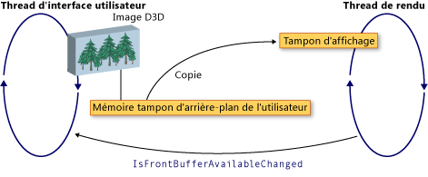

# Interop&#233;rabilit&#233; WPF et Direct3D9
Vous pouvez inclure du contenu Direct3D9 dans une application Windows Presentation Foundation \(WPF\).  Cette rubrique décrit comment créer du contenu Direct3D9 qui puisse interopérer efficacement avec WPF.  
  
> [!NOTE]
>  Lorsque vous utilisez du contenu Direct3D9 dans WPF, vous devez également tenir compte des performances.  Pour plus d'informations sur l'optimisation des performances, consultez [Considérations sur les performances de l'interopérabilité entre Direct3D9 et WPF](../../../../docs/framework/wpf/advanced/performance-considerations-for-direct3d9-and-wpf-interoperability.md).  
  
## Tampons d'affichage  
 La classe <xref:System.Windows.Interop.D3DImage> gère deux mémoires tampons d'affichage, appelées *mémoire tampon d'arrière\-plan* et *tampon d'affichage*.  La mémoire tampon d'arrière\-plan est votre surface Direct3D9.  Les modifications apportées à la mémoire tampon d'arrière\-plan sont copiées en avant dans le tampon d'affichage lorsque vous appelez la méthode <xref:System.Windows.Interop.D3DImage.Unlock%2A>.  
  
 L'illustration suivante montre la relation entre la mémoire tampon d'arrière\-plan et le tampon d'affichage.  
  
   
  
## Création d'un périphérique Direct3D9  
 Pour restituer du contenu Direct3D9, vous devez créer un périphérique Direct3D9.  Vous pouvez utiliser deux objets Direct3D9 pour créer un périphérique : `IDirect3D9` et `IDirect3D9Ex`.  Utilisez ces objets pour créer respectivement des périphériques `IDirect3DDevice9` et `IDirect3DDevice9Ex`.  
  
 Vous pouvez créer un périphérique en appelant l'une des méthodes suivantes :  
  
-   `IDirect3D9 * Direct3DCreate9(UINT SDKVersion);`  
  
-   `HRESULT Direct3DCreate9Ex(UINT SDKVersion, IDirect3D9Ex **ppD3D);`  
  
 Sur Windows Vista ou le système d'exploitation ultérieure, utilisez la méthode d' `Direct3DCreate9Ex` avec un affichage configuré pour utiliser le modèle \(WDDM\) de pilote d'affichage de windows.  Utilisez la méthode `Direct3DCreate9` sur toute autre plateforme.  
  
### Disponibilité de la méthode Direct3DCreate9Ex  
 Le d3d9.dll a la méthode d' `Direct3DCreate9Ex` que sur Windows Vista ou le système d'exploitation ultérieurement.  Si vous liez directement la fonction sur Windows XP, votre application risque de ne pas se charger.  Pour déterminer si la méthode `Direct3DCreate9Ex` est prise en charge, chargez la DLL et recherchez l'adresse de procédure.  Le code suivant indique comment tester la méthode `Direct3DCreate9Ex`.  Pour obtenir l'exemple de code complet, consultez [Procédure pas à pas : création de contenu Direct3D9 à héberger dans WPF](../../../../docs/framework/wpf/advanced/walkthrough-creating-direct3d9-content-for-hosting-in-wpf.md).  
  
 [!code-cpp[System.Windows.Interop.D3DImage#RendererManager_EnsureD3DObjects](../../../../samples/snippets/cpp/VS_Snippets_Wpf/System.Windows.Interop.D3DImage/cpp/renderermanager.cpp#renderermanager_ensured3dobjects)]  
  
### Création HWND  
 La création d'un périphérique passe par un HWND.  En général, vous créez un HWND factice pour le Direct3D9.  L'exemple de code suivant montre comment créer un HWND factice.  
  
 [!code-cpp[System.Windows.Interop.D3DImage#RendererManager_EnsureHWND](../../../../samples/snippets/cpp/VS_Snippets_Wpf/System.Windows.Interop.D3DImage/cpp/renderermanager.cpp#renderermanager_ensurehwnd)]  
  
### Paramètres Present  
 La création d'un périphérique requiert également une structure `D3DPRESENT_PARAMETERS`, mais seuls quelques paramètres sont importants.  Ces paramètres sont choisis pour réduire l'encombrement de la mémoire.  
  
 Affectez la valeur 1 aux champs `BackBufferHeight` et `BackBufferWidth`.  L'affectation de la valeur 0 entraîne l'affection des dimensions du HWND.  
  
 Définissez toujours les indicateurs `D3DCREATE_MULTITHREADED` et `D3DCREATE_FPU_PRESERVE` pour éviter d'endommager la mémoire utilisée par Direct3D9 et empêcher Direct3D9 de modifier les paramètres FPU.  
  
 Le code suivant indique comment initialiser la structure `D3DPRESENT_PARAMETERS`.  
  
 [!code-cpp[System.Windows.Interop.D3DImage#Renderer_Init](../../../../samples/snippets/cpp/VS_Snippets_Wpf/System.Windows.Interop.D3DImage/cpp/renderer.cpp#renderer_init)]  
  
## Création de la cible de rendu de la mémoire tampon d'arrière\-plan  
 Pour afficher du contenu Direct3D9 dans un <xref:System.Windows.Interop.D3DImage>, vous pouvez créer et assigner une surface Direct3D9 en appelant la méthode <xref:System.Windows.Interop.D3DImage.SetBackBuffer%2A>.  
  
### Vérification de la prise en charge des adaptateurs  
 Avant de créer une surface, vérifiez que tous les adaptateurs prennent en charge les propriétés de surface dont vous avez besoin.  Même si vous restituez sur un seul adaptateur, la fenêtre WPF peut s'afficher sur tout adaptateur du système.  Vous devez toujours écrire du code Direct3D9 qui gère des configurations multi\-adaptateur et vérifier la prise en charge de tous les adaptateurs, car WPF peut déplacer la surface d'un adaptateur à un autre en fonction de leur disponibilité.  
  
 L'exemple de code suivant indique comment vérifier la prise en charge de Direct3D9 par tous les adaptateurs du système.  
  
 [!code-cpp[System.Windows.Interop.D3DImage#RendererManager_TestSurfaceSettings](../../../../samples/snippets/cpp/VS_Snippets_Wpf/System.Windows.Interop.D3DImage/cpp/renderermanager.cpp#renderermanager_testsurfacesettings)]  
  
### Création de la surface  
 Avant de créer une surface, vérifiez que les fonctions du périphérique assurent de bonnes performance sur le système d'exploitation cible.  Pour plus d'informations, consultez [Considérations sur les performances de l'interopérabilité entre Direct3D9 et WPF](../../../../docs/framework/wpf/advanced/performance-considerations-for-direct3d9-and-wpf-interoperability.md).  
  
 Une fois les fonctions du périphérique vérifiées, vous pouvez créer la surface.  L'exemple de code suivant indique comment créer la cible de rendu.  
  
 [!code-cpp[System.Windows.Interop.D3DImage#Renderer_CreateSurface](../../../../samples/snippets/cpp/VS_Snippets_Wpf/System.Windows.Interop.D3DImage/cpp/renderer.cpp#renderer_createsurface)]  
  
### WDDM  
 Sous Windows Vista et les systèmes d'exploitation ultérieurs, configurés pour utiliser le WDDM, vous pouvez créer une texture de cible de rendu et passer le niveau 0 surfaces à la méthode d' <xref:System.Windows.Interop.D3DImage.SetBackBuffer%2A> .  Cette méthode n'est pas recommandée sur Windows XP, car vous ne pouvez pas créer de texture de cible de rendu verrouillable et les performances sont limitées.  
  
## Gestion de l'état du périphérique  
 La classe <xref:System.Windows.Interop.D3DImage> gère deux mémoires tampons d'affichage, appelées *mémoire tampon d'arrière\-plan* et *tampon d'affichage*.  La mémoire tampon d'arrière\-plan est votre surface Direct3D.  Les modifications apportées à la mémoire tampon d'arrière\-plan sont en avant copié dans le tampon d'affichage lorsque vous appelez la méthode d' <xref:System.Windows.Interop.D3DImage.Unlock%2A> , où elle est affichée sur le matériel.  Parfois, le tampon d'affichage est pas disponible.  Ce manque de disponibilité peut être provoqué par un verrouillage d'écran, des applications Direct3D utilisant exclusivement le plein écran, le changement d'utilisateur ou d'autres activités système.  Lorsque cela se produit, est averti votre application WPF en gérant l'événement d' <xref:System.Windows.Interop.D3DImage.IsFrontBufferAvailableChanged> .  Comment votre application répond dans le tampon d'affichage devenant pas disponible dépend de si WPF est activé retomber au rendu logiciel.  La méthode d' <xref:System.Windows.Interop.D3DImage.SetBackBuffer%2A> a une surcharge qui accepte un paramètre qui spécifie si WPF revient au rendu logiciel.  
  
 Lorsque vous appelez la surcharge d' <xref:System.Windows.Interop.D3DImage.SetBackBuffer%28System.Windows.Interop.D3DResourceType%2CSystem.IntPtr%29> ou appeler la surcharge d' <xref:System.Windows.Interop.D3DImage.SetBackBuffer%28System.Windows.Interop.D3DResourceType%2CSystem.IntPtr%2CSystem.Boolean%29> avec le jeu de paramètres d' `enableSoftwareFallback` à `false`, le système de rendu libère sa référence à la mémoire tampon d'arrière\-plan lorsque le tampon d'affichage est pas disponible et que rien n'est affiché.  Lorsque le tampon d'affichage est à nouveau disponible, le système de rendu déclenche l'événement d' <xref:System.Windows.Interop.D3DImage.IsFrontBufferAvailableChanged> pour informer votre application WPF.  Vous pouvez créer un gestionnaire d'événements pour l'événement d' <xref:System.Windows.Interop.D3DImage.IsFrontBufferAvailableChanged> redémarre s'afficher de nouveau avec une surface valide Direct3D.  Pour redémarrer le rendu, vous devez appeler <xref:System.Windows.Interop.D3DImage.SetBackBuffer%2A>.  
  
 Lorsque vous appelez la surcharge d' <xref:System.Windows.Interop.D3DImage.SetBackBuffer%28System.Windows.Interop.D3DResourceType%2CSystem.IntPtr%2CSystem.Boolean%29> avec le jeu de paramètres d' `enableSoftwareFallback` à `true`, le système de rendu conserve sa référence à la mémoire tampon d'arrière\-plan lorsque le tampon d'affichage est pas disponible, il n'est donc pas nécessaire d'appeler <xref:System.Windows.Interop.D3DImage.SetBackBuffer%2A> lorsque le tampon d'affichage est à nouveau disponible.  
  
 Lorsque le rendu logiciel est activé, il peut y avoir des situations où le périphérique de l'utilisateur est pas disponible, mais le système de rendu conserve une référence à la surface Direct3D.  Pour vérifier si un périphérique Direct3D9 est pas disponible, appelez la méthode d' `TestCooperativeLevel` .  Pour contrôler les périphériques d'un Direct3D9Ex appelez la méthode d' `CheckDeviceState` , car la méthode d' `TestCooperativeLevel` est déconseillée et retourne toujours le succès.  Si le périphérique d'utilisateur est devenu pas disponible, appelez <xref:System.Windows.Interop.D3DImage.SetBackBuffer%2A> pour libérer la référence WPF à la mémoire tampon d'arrière\-plan.  Si vous devez réinitialiser le périphérique, appelez <xref:System.Windows.Interop.D3DImage.SetBackBuffer%2A> avec le jeu de paramètres d' `backBuffer` à `null`, puis appelez <xref:System.Windows.Interop.D3DImage.SetBackBuffer%2A> de nouveau avec `backBuffer` fixent Direct3D à une surface valide.  
  
 Appelez la méthode `Reset` pour récupérer à partir d'un périphérique non valide uniquement si vous implémentez la prise en charge multi\-adaptateur.  Sinon, libérez toutes les interfaces Direct3D9 et recréez\-les complètement.  Si la disposition des adaptateurs a changé, les objets Direct3D9 créés avant le changement ne sont pas mis à jour.  
  
## Gestion du redimensionnement  
 Si <xref:System.Windows.Interop.D3DImage> s'affiche à une résolution autre que sa taille native, elle est mise à l'échelle selon <xref:System.Windows.Media.RenderOptions.BitmapScalingMode%2A>actuel, mais qu' <xref:System.Windows.Media.Effects.SamplingMode> est substituée pour <xref:System.Windows.Media.BitmapScalingMode>.  
  
 Si vous avez besoin d'une meilleure fidélité, vous devez créer une surface lorsque le conteneur du <xref:System.Windows.Interop.D3DImage> change de taille.  
  
 Il existe trois méthodes de gestion du redimensionnement.  
  
-   Participez au système de disposition et créez une surface lorsque la taille change.  Ne créez pas trop de surfaces, sinon vous risquez de saturer ou de fragmenter la mémoire vidéo.  
  
-   Attendez qu'un événement de redimensionnement ne se produise pas pendant une période déterminée pour créer la surface.  
  
-   Créez un <xref:System.Windows.Threading.DispatcherTimer> qui vérifie les dimensions de conteneur plusieurs fois par seconde.  
  
## Optimisation multi\-moniteur  
 Lorsque le système de rendu déplace un <xref:System.Windows.Interop.D3DImage> vers un autre moniteur, cela risque d'altérer considérablement les performances.  
  
 Sur WDDM, à partir du moment où les moniteurs sont connectés à la même carte vidéo et que vous utilisez `Direct3DCreate9Ex`, les performances ne sont pas altérées.  Si les moniteurs sont connectés à des cartes vidéo séparées, les performances s'en trouvent altérées.  Sur Windows XP, les performances sont toujours altérées.  
  
 Lorsque le <xref:System.Windows.Interop.D3DImage> se déplace vers un autre moniteur, vous pouvez créer une surface sur l'adaptateur correspondant pour restaurer de bonnes performances.  
  
 Pour éviter l'altération des performances, écrivez du code spécifiquement pour le cas multi\-moniteur.  La procédure ci\-dessous indique une façon d'écrire du code multi\-moniteur :  
  
1.  Recherchez un point du <xref:System.Windows.Interop.D3DImage> dans l'espace à l'écran avec la méthode `Visual.ProjectToScreen`.  
  
2.  Utilisez la méthode GDI `MonitorFromPoint` pour rechercher le moniteur qui affiche le point.  
  
3.  Utilisez la méthode `IDirect3D9::GetAdapterMonitor` pour rechercher l'adaptateur Direct3D9 auquel le moniteur est connecté.  
  
4.  Si l'adaptateur n'est pas le même que l'adaptateur avec la mémoire tampon d'arrière\-plan, créez une mémoire tampon d'arrière\-plan sur le nouveau moniteur et assignez\-la à la mémoire tampon d'arrière\-plan <xref:System.Windows.Interop.D3DImage>.  
  
> [!NOTE]
>  Si le <xref:System.Windows.Interop.D3DImage> chevauche des moniteurs, les performances s'en trouvent altérées, sauf si WDDM et `IDirect3D9Ex` se trouvent sur le même adaptateur.  Il est impossible d'améliorer les performances dans ce cas.  
  
 L'exemple de code suivant indique comment rechercher le moniteur actuel.  
  
 [!code-cpp[System.Windows.Interop.D3DImage#RendererManager_SetAdapter](../../../../samples/snippets/cpp/VS_Snippets_Wpf/System.Windows.Interop.D3DImage/cpp/renderermanager.cpp#renderermanager_setadapter)]  
  
 Mettez à jour le moniteur lorsque la position ou la taille du conteneur <xref:System.Windows.Interop.D3DImage> change ou mettez à jour le moniteur à l'aide d'un `DispatcherTimer` qui s'actualise plusieurs fois par seconde.  
  
## Rendu logiciel WPF  
 WPF restitue de façon synchrone le thread d'interface utilisateur dans le logiciel dans les cas suivants :  
  
-   Impression  
  
-   <xref:System.Windows.Media.Effects.BitmapEffect>  
  
-   <xref:System.Windows.Media.Imaging.RenderTargetBitmap>  
  
 Lorsque l'un de ces cas se produit, le système de rendu appelle la méthode <xref:System.Windows.Interop.D3DImage.CopyBackBuffer%2A> pour copier la mémoire tampon matérielle dans le logiciel.  L'implémentation par défaut appelle la méthode `GetRenderTargetData` avec la surface.  Comme cet appel se produit en dehors du modèle Verrouillage\/Déverrouillage, il risque d'échouer.  Dans ce cas, la méthode `CopyBackBuffer` retourne `null` et aucune image n'est affichée.  
  
 Vous pouvez remplacer la méthode <xref:System.Windows.Interop.D3DImage.CopyBackBuffer%2A>, appeler l'implémentation de base et, si elle retourne `null`, vous pouvez retourner un espace réservé <xref:System.Windows.Media.Imaging.BitmapSource>.  
  
 Vous pouvez également implémenter votre propre rendu logiciel au lieu d'appeler l'implémentation de base.  
  
> [!NOTE]
>  Si WPF effectue une restitution complète dans le logiciel, <xref:System.Windows.Interop.D3DImage> n'est pas indiqué, car WPF ne possède pas de tampon d'affichage.  
  
## Voir aussi  
 <xref:System.Windows.Interop.D3DImage>   
 [Considérations sur les performances de l'interopérabilité entre Direct3D9 et WPF](../../../../docs/framework/wpf/advanced/performance-considerations-for-direct3d9-and-wpf-interoperability.md)   
 [Procédure pas à pas : création de contenu Direct3D9 à héberger dans WPF](../../../../docs/framework/wpf/advanced/walkthrough-creating-direct3d9-content-for-hosting-in-wpf.md)   
 [Procédure pas à pas : hébergement de contenu Direct3D9 dans WPF](../../../../docs/framework/wpf/advanced/walkthrough-hosting-direct3d9-content-in-wpf.md)