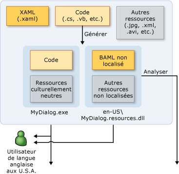
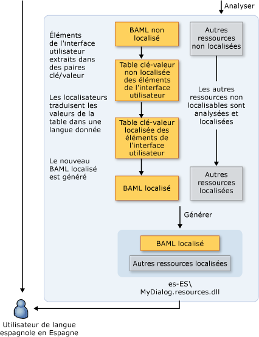

# Vue d&#39;ensemble de la globalisation et de la localisation WPF
Lorsque vous limitez la disponibilité de votre produit à une seule langue, vous limitez votre clientèle potentielle à une fraction des 6,5 milliards d'individus que compte la population mondiale.  Si vous souhaitez que vos applications touchent un public international, la localisation rentable de votre produit est l'une des solutions les plus intéressantes, y compris sur le plan financier.  
  
 Cette vue d'ensemble présente la globalisation et la localisation dans [!INCLUDE[TLA#tla_winclient](../../../../includes/tlasharptla-winclient-md.md)].  La globalisation consiste à concevoir et à développer des applications qui peuvent être utilisées dans plusieurs régions.  Par exemple, la globalisation prend en charge les interfaces utilisateur localisées et les données régionales pour des utilisateurs appartenant à différentes cultures.  [!INCLUDE[TLA2#tla_winclient](../../../../includes/tla2sharptla-winclient-md.md)] propose des fonctions de conception globalisées, notamment la disposition automatique, les assemblys satellites et les attributs et les commentaires localisés.  
  
 La localisation consiste en la traduction des ressources d'une application de manière à obtenir des versions localisées spécifiques à chaque culture prise en charge par l'application.  Lorsque vous localisez en [!INCLUDE[TLA2#tla_winclient](../../../../includes/tla2sharptla-winclient-md.md)], vous utilisez les API dans l'espace de noms <xref:System.Windows.Markup.Localizer>. Ces API font fonctionner l'outil en ligne de commande [Outil LocBaml, exemple \(page éventuellement en anglais\)](http://go.microsoft.com/fwlink/?LinkID=160016).  Pour plus d'informations sur la génération et l'utilisation de LocBaml, consultez [Localiser une application](../../../../docs/framework/wpf/advanced/how-to-localize-an-application.md).  
  
 [!INCLUDE[autoOutline](../Token/autoOutline_md.md)]  
  
## Meilleures pratiques pour la globalisation et la localisation dans WPF  
 Vous pouvez tirer le meilleur parti des fonctionnalités de globalisation et de localisation intégrées à [!INCLUDE[TLA2#tla_winclient](../../../../includes/tla2sharptla-winclient-md.md)] en suivant les conseils présentés dans cette section concernant la localisation et la conception d'interfaces utilisateur.  
  
### Meilleures pratiques pour la conception d'interfaces utilisateur WPF  
 Lors de la conception d'une [!INCLUDE[TLA2#tla_ui](../../../../includes/tla2sharptla-ui-md.md)] basée sur [!INCLUDE[TLA2#tla_winclient](../../../../includes/tla2sharptla-winclient-md.md)], envisagez la mise en œuvre des meilleures pratiques suivantes :  
  
-   Écrivez votre [!INCLUDE[TLA2#tla_ui](../../../../includes/tla2sharptla-ui-md.md)] en [!INCLUDE[TLA2#tla_xaml](../../../../includes/tla2sharptla-xaml-md.md)] ; évitez de créer l'[!INCLUDE[TLA2#tla_ui](../../../../includes/tla2sharptla-ui-md.md)] à l'aide de code.  Lorsque vous créez votre [!INCLUDE[TLA2#tla_ui](../../../../includes/tla2sharptla-ui-md.md)] à l'aide de [!INCLUDE[TLA2#tla_xaml](../../../../includes/tla2sharptla-xaml-md.md)], vous l'exposez à travers des API de localisation intégrées.  
  
-   Évitez d'utiliser des positions absolues et des tailles fixes pour mettre en forme le contenu ; utilisez plutôt un dimensionnement relatif ou automatique.  
  
    -   Utilisez <xref:System.Windows.Window.SizeToContent%2A> et laissez la valeur `Auto` attribuée aux largeurs et hauteurs.  
  
    -   Évitez d'utiliser <xref:System.Windows.Controls.Canvas> pour la présentation de l'[!INCLUDE[TLA2#tla_ui](../../../../includes/tla2sharptla-ui-md.md)].  
  
    -   Utilisez <xref:System.Windows.Controls.Grid> et sa fonction de partage de taille.  
  
-   Prévoyez un espace supplémentaire en marges car le texte localisé nécessite souvent davantage d'espace.  Cet espace supplémentaire permet d'accepter les caractères supplémentaires éventuels.  
  
-   Activez <xref:System.Windows.Controls.TextBlock.TextWrapping%2A> dans <xref:System.Windows.Controls.TextBlock> pour éviter que le texte ne soit tronqué.  
  
-   Définissez l'attribut **xml:lang**.  Cet attribut décrit la culture d'un élément spécifique et ses éléments enfants.  La valeur de cette propriété modifie le comportement de plusieurs fonctionnalités dans [!INCLUDE[TLA2#tla_winclient](../../../../includes/tla2sharptla-winclient-md.md)]. Par exemple, elle modifie le comportement de la coupure, de la vérification de l'orthographe, de la substitution de nombre, de la mise en forme de script complexe et de la police de substitution.  Consultez [Globalisation pour WPF](../../../../docs/framework/wpf/advanced/globalization-for-wpf.md) pour plus d'informations sur la définition du [Gestion de xml:lang en XAML](../../../../docs/framework/xaml-services/xml-lang-handling-in-xaml.md).  
  
-   Créez une police composite personnalisée pour obtenir un meilleur contrôle des polices utilisées pour les différentes langues.  Par défaut, [!INCLUDE[TLA2#tla_winclient](../../../../includes/tla2sharptla-winclient-md.md)] utilise la police GlobalUserInterface.composite qui se trouve dans votre répertoire Windows\\Fonts.  
  
-   Lorsque vous créez des applications de navigation qui peuvent être localisées dans une culture qui aligne le texte de droite à gauche, définissez explicitement le <xref:System.Windows.FlowDirection> de chaque page afin de veiller à ce que la page n'hérite pas de <xref:System.Windows.FlowDirection> du <xref:System.Windows.Navigation.NavigationWindow>.  
  
-   Lorsque vous créez des applications de navigation autonomes hébergées à l'extérieur d'un navigateur, affectez à l'<xref:System.Windows.Application.StartupUri%2A> de votre application initiale le <xref:System.Windows.Navigation.NavigationWindow> au lieu d'une page \(par exemple, `<Application StartupUri="NavigationWindow.xaml">`\).  Cette conception vous permet de modifier le <xref:System.Windows.FlowDirection> de la fenêtre et de la barre de navigation.  Pour plus d'informations et pour obtenir un exemple, consultez [Page d'accueil de globalisation, exemple](http://go.microsoft.com/fwlink/?LinkID=159990).  
  
### Meilleures pratiques pour la localisation WPF  
 Lorsque vous localisez des applications basées sur [!INCLUDE[TLA2#tla_winclient](../../../../includes/tla2sharptla-winclient-md.md)], envisagez d'appliquer les meilleures pratiques suivantes :  
  
-   Utilisez des commentaires de localisation afin de fournir aux localisateurs des informations contexte supplémentaires.  
  
-   Utilisez des attributs de localisation pour contrôler la localisation au lieu d'omettre de façon sélective des propriétés <xref:System.Windows.Markup.Localizer.BamlLocalizableResourceKey.Uid%2A> sur les éléments.  Pour plus d'informations, consultez [Attributs et commentaires de localisation](../../../../docs/framework/wpf/advanced/localization-attributes-and-comments.md).  
  
-   Utilisez **msbuild \/t:updateuid** et **\/t:checkuid** pour ajouter et vérifier des propriétés <xref:System.Windows.Markup.Localizer.BamlLocalizableResourceKey.Uid%2A> dans votre [!INCLUDE[TLA2#tla_xaml](../../../../includes/tla2sharptla-xaml-md.md)].  Utilisez les propriétés <xref:System.Windows.Markup.Localizer.BamlLocalizableResourceKey.Uid%2A> pour suivre les modifications entre le développement et la localisation. Les propriétés<xref:System.Windows.Markup.Localizer.BamlLocalizableResourceKey.Uid%2A>vous aident à localiser les nouvelles modifications apportées au développement.  Si vous ajoutez manuellement des propriétés <xref:System.Windows.Markup.Localizer.BamlLocalizableResourceKey.Uid%2A> à une[!INCLUDE[TLA2#tla_ui](../../../../includes/tla2sharptla-ui-md.md)], cette tâche est généralement fastidieuse et peut induire des erreurs.  
  
    -   Ne modifiez pas les propriétés <xref:System.Windows.Markup.Localizer.BamlLocalizableResourceKey.Uid%2A> une fois la localisation commencée.  
  
    -   N'utilisez pas de propriétés <xref:System.Windows.Markup.Localizer.BamlLocalizableResourceKey.Uid%2A> en double \(n'oubliez pas ce conseil lorsque vous utilisez la commande copier\-coller\).  
  
    -   Définissez l'emplacement de `UltimateResourceFallback` dans AssemblyInfo.\* afin de spécifier la langue de base appropriée \(par exemple, `[assembly: NeutralResourcesLanguage("en-US",   UltimateResourceFallbackLocation.Satellite)]`\).  
  
         Si vous décidez d'inclure votre langue source dans l'assembly principal en omettant la balise `<UICulture>` dans votre fichier de projet, définissez l'emplacement de `UltimateResourceFallback` comme assembly principal au lieu du satellite \(par exemple, `[assembly: NeutralResourcesLanguage("en-US", UltimateResourceFallbackLocation.MainAssembly)]`\).  
  
   
## Localiser une application WPF  
 Lorsque vous localisez une application [!INCLUDE[TLA2#tla_winclient](../../../../includes/tla2sharptla-winclient-md.md)], vous disposez de plusieurs options.  Par exemple, vous pouvez lier les ressources localisables dans votre application à un fichier [!INCLUDE[TLA2#tla_xml](../../../../includes/tla2sharptla-xml-md.md)], stocker le texte localisable dans les tables resx ou inviter votre localisateur à utiliser des fichiers [!INCLUDE[TLA#tla_xaml](../../../../includes/tlasharptla-xaml-md.md)].  Cette section décrit un flux de travail de localisation qui utilise le formulaire BAML de XAML, dont les avantages sont nombreux :  
  
-   Vous pouvez effectuer la localisation après la génération.  
  
-   Vous pouvez mettre à jour votre version antérieure du formulaire BAML de XAML avec les localisations afin de pouvoir effectuer la localisation parallèlement au développement.  
  
-   Vous pouvez valider les éléments source d'origine et la sémantique lors de la compilation car le formulaire BAML de XAML est la forme compilée de [!INCLUDE[TLA2#tla_xaml](../../../../includes/tla2sharptla-xaml-md.md)].  
  
### Processus de génération de localisation  
 Lorsque vous développez une application [!INCLUDE[TLA2#tla_winclient](../../../../includes/tla2sharptla-winclient-md.md)], le processus de génération de la localisation se déroule comme suit :  
  
-   Le développeur crée et globalise l'application [!INCLUDE[TLA2#tla_winclient](../../../../includes/tla2sharptla-winclient-md.md)].  Dans le fichier du projet, le développeur définit `<UICulture>en-US</UICulture>` afin que, lorsque l'application est compilée, un assembly principal indépendant de la langue soit généré. Cet assembly possède un fichier .resources.dll satellite qui contient toutes les ressources localisables. Vous pouvez également conserver la langue source dans l'assembly principal car notre [!INCLUDE[TLA2#tla_api#plural](../../../../includes/tla2sharptla-apisharpplural-md.md)] de localisation prend en charge l'extraction à partir de l'assembly principal.  
  
-   Lorsque le fichier est compilé dans la build, le [!INCLUDE[TLA2#tla_xaml](../../../../includes/tla2sharptla-xaml-md.md)] est converti en formulaire BAML de XAML.  Le fichier `MyDialog.exe` culturellement neutre et le fichier `MyDialog.resources.dll` culturellement dépendant \(anglais\) sont diffusés aux clients anglophones.  
  
### Workflow de localisation  
 Le processus de localisation commence après la génération du fichier `MyDialog.resources.dll` non localisé.  Les éléments et les propriétés de [!INCLUDE[TLA2#tla_ui](../../../../includes/tla2sharptla-ui-md.md)] dans votre [!INCLUDE[TLA2#tla_xaml](../../../../includes/tla2sharptla-xaml-md.md)] d'origine sont extraits du formulaire BAML de XAML en paires clé\-valeur à l'aide de [!INCLUDE[TLA2#tla_api#plural](../../../../includes/tla2sharptla-apisharpplural-md.md)] sous <xref:System.Windows.Markup.Localizer>.  Les localisateurs utilisent les paires clé\-valeur pour localiser l'application.  Vous pouvez générer un nouveau fichier .resource.dll à partir des nouvelles valeurs une fois la localisation terminée.  
  
 Les clés de paires clé\-valeur sont des valeurs `x:Uid` placées par le développeur dans le [!INCLUDE[TLA2#tla_xaml](../../../../includes/tla2sharptla-xaml-md.md)] d'origine.  Ces valeurs `x:Uid` permettent à l'[!INCLUDE[TLA2#tla_api](../../../../includes/tla2sharptla-api-md.md)] de suivre et de fusionner les modifications qui interviennent entre le développeur et le localisateur pendant la localisation.  Par exemple, si le développeur modifie l'[!INCLUDE[TLA2#tla_ui](../../../../includes/tla2sharptla-ui-md.md)] après que le localisateur a entamé la localisation, vous pouvez fusionner cette modification avec le travail de localisation réalisé à ce stade afin d'éviter au maximum de perdre le travail réalisé en traduction.  
  
 Le graphique suivant illustre un flux de travail de localisation typique fondé sur le formulaire BAML de XAML.  Ce diagramme suppose que le développeur écrit l'application en anglais.  Le développeur crée et globalise l'application WPF.  Dans le fichier du projet, le développeur définit `<UICulture>en-US</UICulture>` afin que lors de la génération, un assembly principal linguistiquement neutre soit généré avec un fichier .resources.dll satellite qui contient toutes les ressources localisables.  Vous pouvez aussi conserver la langue source dans l'assembly principal car les API de localisation WPF prennent en charge l'extraction à partir de l'assembly principal.  Une fois le processus de génération terminé, XAML est compilé dans BAML.  Le fichier MyDialog.exe.resources.dll culturellement neutre est expédié aux clients anglophones.  
  
   
  
   
  
   
## Exemples de localisation WPF  
 Cette section présente des exemples d'applications localisées pour vous aider à comprendre comment générer et localiser des applications [!INCLUDE[TLA2#tla_winclient](../../../../includes/tla2sharptla-winclient-md.md)].  
  
#### Exemple de boîte de dialogue Exécuter  
 Les graphiques suivants illustrent la sortie de l'exemple de boîte de dialogue **Exécuter**.  
  
 **Anglais :**  
  
   
  
 **Allemand :**  
  
   
  
 **Conception d'une boîte de dialogue Exécuter globale**  
  
 Cet exemple permet d'obtenir une boîte de dialogue **Exécuter** à l'aide de [!INCLUDE[TLA2#tla_winclient](../../../../includes/tla2sharptla-winclient-md.md)] et [!INCLUDE[TLA2#tla_xaml](../../../../includes/tla2sharptla-xaml-md.md)].  Celle\-ci équivaut à la boîte de dialogue **Exécuter** qui est disponible dans le menu Démarrer de [!INCLUDE[TLA#tla_win](../../../../includes/tlasharptla-win-md.md)].  
  
 Voici quelques informations importantes concernant la création de boîtes de dialogue globales :  
  
 **Automatic Layout**  
  
 *Dans Window1.xaml :*  
  
 `<Window SizeToContent="WidthAndHeight">`  
  
 La propriété Window précédente redimensionne automatiquement la fenêtre en fonction de la taille du contenu.  Cette propriété empêche la fenêtre de tronquer le contenu dont la taille augmente après la localisation ; elle supprime également l'espace superflu lorsque le contenu diminue en taille après la localisation.  
  
 `<Grid x:Uid="Grid_1">`  
  
 Les propriétés <xref:System.Windows.Markup.Localizer.BamlLocalizableResourceKey.Uid%2A> sont requises pour que les [!INCLUDE[TLA2#tla_api#plural](../../../../includes/tla2sharptla-apisharpplural-md.md)] de localisation [!INCLUDE[TLA2#tla_winclient](../../../../includes/tla2sharptla-winclient-md.md)] fonctionnent correctement.  
  
 Elles sont utilisées par la localisation des [!INCLUDE[TLA2#tla_api#plural](../../../../includes/tla2sharptla-apisharpplural-md.md)] de [!INCLUDE[TLA2#tla_winclient](../../../../includes/tla2sharptla-winclient-md.md)] pour suivre les modifications apportées entre le développement et la localisation de l'[!INCLUDE[TLA#tla_ui](../../../../includes/tlasharptla-ui-md.md)].  Les propriétés <xref:System.Windows.Markup.Localizer.BamlLocalizableResourceKey.Uid%2A> vous permettent de fusionner une version plus récente de l'[!INCLUDE[TLA2#tla_ui](../../../../includes/tla2sharptla-ui-md.md)] avec une localisation plus ancienne de l'[!INCLUDE[TLA2#tla_ui](../../../../includes/tla2sharptla-ui-md.md)].  Vous ajoutez une propriété <xref:System.Windows.Markup.Localizer.BamlLocalizableResourceKey.Uid%2A>en exécutant **msbuild \/t:updateuid RunDialog.csproj** dans un interpréteur de commandes.  Cette méthode est recommandée pour ajouter des propriétés <xref:System.Windows.Markup.Localizer.BamlLocalizableResourceKey.Uid%2A> car l'exécution de cette opération manuellement implique généralement des erreurs et est plus fastidieuse.  Vous pouvez vérifier que les propriétés <xref:System.Windows.Markup.Localizer.BamlLocalizableResourceKey.Uid%2A> sont correctement définies en exécutant **msbuild \/t:checkuid RunDialog.csproj**.  
  
 L'[!INCLUDE[TLA2#tla_ui](../../../../includes/tla2sharptla-ui-md.md)] est structurée à l'aide du contrôle <xref:System.Windows.Controls.Grid>, qui est permet de tirer parti de la disposition automatique dans [!INCLUDE[TLA2#tla_winclient](../../../../includes/tla2sharptla-winclient-md.md)].  Notez que la boîte de dialogue est fractionnée en trois lignes et cinq colonnes.  Aucune des définitions de lignes et de colonnes n'a une taille fixe ; de ce fait, la taille des éléments de l'[!INCLUDE[TLA2#tla_ui](../../../../includes/tla2sharptla-ui-md.md)] qui sont placés dans chaque cellule peut être augmentée ou réduite pendant la localisation.  
  
 [!code-xml[GlobalizationRunDialog#GridColumnDef](../../../../samples/snippets/csharp/VS_Snippets_Wpf/GlobalizationRunDialog/CS/Window1.xaml#gridcolumndef)]  
  
 Les deux premières colonnes dans lesquelles sont placés l'étiquette **Ouvrir :** et <xref:System.Windows.Controls.ComboBox> utilisent 10 % de la largeur totale de l'[!INCLUDE[TLA2#tla_ui](../../../../includes/tla2sharptla-ui-md.md)].  
  
 [!code-xml[GlobalizationRunDialog#GridColumnDef2](../../../../samples/snippets/csharp/VS_Snippets_Wpf/GlobalizationRunDialog/CS/Window1.xaml#gridcolumndef2)]  
  
 Notez que l'exemple utilise la fonctionnalité de dimensionnement partagé de <xref:System.Windows.Controls.Grid>.  Les trois dernières colonnes en tirent parti en se plaçant dans le même <xref:System.Windows.Controls.DefinitionBase.SharedSizeGroup%2A>.  Comme on peut l'attendre du nom de la propriété, cette dernière permet aux colonnes de partager la même taille.  Par conséquent, lorsque le terme « Browse… » est traduit en allemand en une chaîne plus longue, à savoir « Durchsuchen… », la largeur de tous les boutons augmente au lieu d'avoir un bouton « OK » de petite taille à côté d'un bouton « Durchsuchen… » de taille disproportionnée.  
  
 **Xml:lang**  
  
 `Xml:lang="en-US"`  
  
 Observez le [Gestion de xml:lang en XAML](../../../../docs/framework/xaml-services/xml-lang-handling-in-xaml.md) placé au niveau de l'élément racine de l'[!INCLUDE[TLA2#tla_ui](../../../../includes/tla2sharptla-ui-md.md)].  Cette propriété décrit la culture d'un élément donné et ses enfants.  Cette valeur est utilisée par plusieurs fonctions dans [!INCLUDE[TLA2#tla_winclient](../../../../includes/tla2sharptla-winclient-md.md)] et doit être correctement modifiée pendant la localisation.  Cette valeur change le dictionnaire de langue utilisé pour insérer un trait d'union et vérifier l'orthographe.  Elle affecte également l'affichage des chiffres et la manière dont le système sélectionne la police de substitution à utiliser.  Enfin, la propriété affecte l'affichage des nombres et la mise en forme des textes écrits dans les scripts complexes.  La valeur par défaut est « en\-US ».  
  
 **Building a Satellite Resource Assembly**  
  
 *Dans .csproj :*  
  
 `<UICulture>en-US</UICulture>`  
  
 Observez l'ajout d'une valeur `UICulture`.  Lorsque celle\-ci a une valeur <xref:System.Globalization.CultureInfo> correcte, par exemple en\-US, la génération du projet produira un assembly satellite contenant toutes les ressources localisables.  
  
 `<Resource Include="RunIcon.JPG">`  
  
 `<Localizable>False</Localizable>`  
  
 `</Resource>`  
  
 Le fichier `RunIcon.JPG` ne doit pas être localisé car il doit être identique quelle que soit la culture.  `Localizable` a la valeur `false` afin d'être conservé dans l'assembly principal linguistiquement neutre au lieu d'être placé dans l'assembly satellite.  La valeur par défaut de toutes les ressources non compilables affectée à `Localizable` est `true` .  
  
 **Localisation de la boîte de dialogue Exécuter**  
  
 **Parse**  
  
 Après avoir généré l'application, la première étape de sa localisation consiste à analyser les ressources localisables en dehors de l'assembly satellite.  Pour les besoins de cette rubrique, utilisez l'exemple d'outil LocBaml disponible dans [Outil LocBaml, exemple](http://go.microsoft.com/fwlink/?LinkID=160016).  Notez que LocBaml n'est qu'un exemple d'outil destiné à vous aider à vous familiariser avec la création d'un outil de localisation adapté à votre processus de localisation.  À l'aide de LocBaml, exécutez les éléments suivants à analyser : **LocBaml \/parse RunDialog.resources.dll \/out:** afin de générer un fichier « RunDialog.resources.dll.CSV ».  
  
 **Localize**  
  
 Utilisez votre éditeur CSV favori qui prend en charge Unicode pour modifier ce fichier.  Éliminez par filtrage toutes les entrées dont la catégorie de localisation est « Aucune ».  Les entrées suivantes devraient apparaître :  
  
||||  
|-|-|-|  
|Clé de ressource|Catégorie de localisation|Valeur|  
|Button\_1:System.Windows.Controls.Button.$Content|Button|OK|  
|Button\_2:System.Windows.Controls.Button.$Content|Button|Cancel|  
|Button\_3:System.Windows.Controls.Button.$Content|Button|Browse…|  
|ComboBox\_1:System.Windows.Controls.ComboBox.$Content|ComboBox||  
|TextBlock\_1:System.Windows.Controls.TextBlock.$Content|Texte|Type the name of a program, folder, document, or Internet resource, and Windows will open it for you.|  
|TextBlock\_2:System.Windows.Controls.TextBlock.$Content|Texte|Open:|  
|Window\_1:System.Windows.Window.Title|Titre|Run|  
  
 La localisation de l'application en allemand nécessiterait les traductions suivantes :  
  
||||  
|-|-|-|  
|Clé de ressource|Catégorie de localisation|Valeur|  
|Button\_1:System.Windows.Controls.Button.$Content|Button|OK|  
|Button\_2:System.Windows.Controls.Button.$Content|Button|Abbrechen|  
|Button\_3:System.Windows.Controls.Button.$Content|Button|Durchsuchen…|  
|ComboBox\_1:System.Windows.Controls.ComboBox.$Content|ComboBox||  
|TextBlock\_1:System.Windows.Controls.TextBlock.$Content|Texte|Geben Sie den Namen eines Programms, Ordners, Dokuments oder einer Internetresource an.|  
|TextBlock\_2:System.Windows.Controls.TextBlock.$Content|Texte|Öffnen:|  
|Window\_1:System.Windows.Window.Title|Titre|Run|  
  
 **Generate**  
  
 La dernière étape de la localisation implique la création du nouvel assembly satellite localisé.  Pour ce faire, vous pouvez utiliser la commande LocBaml suivante :  
  
 **LocBaml.exe \/generate RunDialog.resources.dll \/trans:RunDialog.resources.dll.CSV \/out: .  \/cul:de\-DE**  
  
 Dans la version allemande de [!INCLUDE[TLA#tla_mswin](../../../../includes/tlasharptla-mswin-md.md)], si ce fichier resources.dll est placé dans un dossier de\-DE placé à côté de l'assembly principal, cette ressource sera automatiquement chargée au lieu de celle contenue dans le dossier en\-US.  Si vous n'avez pas de version allemande de [!INCLUDE[TLA#tla_mswin](../../../../includes/tlasharptla-mswin-md.md)] pour tester ceci, affectez la culture de [!INCLUDE[TLA#tla_mswin](../../../../includes/tlasharptla-mswin-md.md)] que vous utilisez \(c.\-à\-d.  fr\-FR\) et remplacez le fichier resources.dll d'origine.  
  
 **Satellite Resource Loading**  
  
|MyDialog.exe|en\-US\\MyDialog.resources.dll|de\-DE\\MyDialog.resources.dll|  
|------------------|------------------------------------|------------------------------------|  
|Code|Version d'origine de BAML en anglais|Version localisée de BAML|  
|Ressources culturellement neutres|Autres ressources en anglais|Autres ressources localisées en allemand|  
  
 Le .NET Framework choisit automatiquement l'assembly de ressources satellite à charger en fonction du `Thread.CurrentThread.CurrentUICulture` de l'application.  Cette valeur correspond par défaut à la culture de votre système d'exploitation [!INCLUDE[TLA#tla_mswin](../../../../includes/tlasharptla-mswin-md.md)].  Par conséquent, si vous utilisez la version allemande de [!INCLUDE[TLA#tla_mswin](../../../../includes/tlasharptla-mswin-md.md)], le fichier de\-DE\\MyDialog.resources.dll est chargé. Si vous utilisez la version anglaise de [!INCLUDE[TLA#tla_mswin](../../../../includes/tlasharptla-mswin-md.md)], c'est le fichier en\-US\\MyDialog.resources.dll qui sera chargé.  Vous pouvez définir la ressource de base ultime de votre application en spécifiant le NeutralResourcesLanguage dans l'AssemblyInfo.\* de votre projet.  Par exemple, si vous spécifiez :  
  
 `[assembly: NeutralResourcesLanguage("en-US", UltimateResourceFallbackLocation.Satellite)]`  
  
 le fichier en\-US\\MyDialog.resources.dll sera alors utilisé avec la version allemande de Windows si les fichiers de\-DE\\MyDialog.resources.dll et de\\MyDialog.resources.dll sont tous deux indisponibles.  
  
### Page d'accueil de Microsoft Arabie Saoudite  
 Les graphiques suivants affichent une page d'accueil en anglais et en arabe.  Pour obtenir l'exemple complet qui produit ces graphiques, consultez [Page d'accueil de globalisation, exemple](http://go.microsoft.com/fwlink/?LinkID=159990).  
  
 **Anglais :**  
  
   
  
 **Arabe :**  
  
   
  
### Conception d'une page d'accueil Microsoft globale  
 Cette simulation du site Web de Microsoft Arabie Saoudite illustre les fonctions de globalisation disponibles pour les langues qui s'écrivent de droite à gauche.  L'hébreu et l'arabe se lisant de droite à gauche, la disposition de l'[!INCLUDE[TLA2#tla_ui](../../../../includes/tla2sharptla-ui-md.md)] doit souvent être très différente des interfaces utilisateur affichées dans des langues qui se lisent de gauche à droite, telles que l'anglais.  La localisation d'une langue s'écrivant de gauche à droite vers une langue s'écrivant de droite à gauche ou inversement peut se révéler difficile.  [!INCLUDE[TLA2#tla_winclient](../../../../includes/tla2sharptla-winclient-md.md)] a été conçu pour simplifier ce type de localisations.  
  
 **FlowDirection**  
  
 *Homepage.xaml:*  
  
 [!code-xml[GlobalizationHomepage#Homepage](../../../../samples/snippets/csharp/VS_Snippets_Wpf/GlobalizationHomepage/CS/Homepage.xaml#homepage)]  
  
 Observez la propriété <xref:System.Windows.FrameworkElement.FlowDirection%2A> sur <xref:System.Windows.Controls.Page>.  En remplaçant la valeur de cette propriété par <xref:System.Windows.FlowDirection>, vous modifiez le <xref:System.Windows.FrameworkElement.FlowDirection%2A> de <xref:System.Windows.Controls.Page> et de ses éléments enfants de sorte que la disposition de cette [!INCLUDE[TLA2#tla_ui](../../../../includes/tla2sharptla-ui-md.md)] soit inversée et se lise désormais de droite à gauche, comme l'attend un utilisateur arabe.  Vous pouvez remplacer le comportement d'héritage en spécifiant un <xref:System.Windows.FrameworkElement.FlowDirection%2A> explicite sur tout élément.  La propriété <xref:System.Windows.FrameworkElement.FlowDirection%2A> est disponible dans tout élément <xref:System.Windows.FrameworkElement> ou élément lié à un document et a la valeur implicite <xref:System.Windows.FlowDirection>.  
  
 Vous pouvez observer que même les pinceaux à dégradés d'arrière\-plan sont correctement inversés lorsque le <xref:System.Windows.FrameworkElement.FlowDirection%2A> racine change :  
  
 **FlowDirection\="LeftToRight"**  
  
   
  
 **FlowDirection\="RightToLeft"**  
  
   
  
 **Éviter d'utiliser des dimensions fixes pour les panneaux et les contrôles**  
  
 Si vous jetez un œil à Homepage.xaml, vous remarquerez qu'hormis la longueur et la hauteur fixes spécifiées pour l'intégralité de l'[!INCLUDE[TLA2#tla_ui](../../../../includes/tla2sharptla-ui-md.md)] dans le <xref:System.Windows.Controls.DockPanel> supérieur, il n'existe aucune autre dimension fixe.  Évitez d'utiliser des dimensions fixes pour empêcher le découpage du texte localisé qui peut être plus long que le texte source.  Les volets et contrôles [!INCLUDE[TLA2#tla_winclient](../../../../includes/tla2sharptla-winclient-md.md)] sont automatiquement redimensionnés en fonction de leur contenu.  La plupart des contrôles ont également des dimensions minimales et maximales que vous pouvez définir pour un meilleur contrôle \(par exemple,  MinWidth\= "20"\).  Avec <xref:System.Windows.Controls.Grid>, vous pouvez également définir des largeurs et des hauteurs relatives en utilisant « \* » \(par exemple,  Width\= "0.25\*"\) ou en utilisant sa fonctionnalité de partage de taille de cellule.  
  
 **Commentaires de localisation**  
  
 Il existe de nombreux cas où le contenu peut être ambigu et difficile à traduire.  Le développeur ou le concepteur a la possibilité d'ajouter des commentaires et des informations de contexte supplémentaires à l'attention des localisateurs par le biais de commentaires de localisation.  Par exemple, les commentaires de localisation ci\-dessous explicitent l'utilisation du caractère &#124;.  
  
 [!code-xml[GlobalizationHomepage#LocalizationComment](../../../../samples/snippets/csharp/VS_Snippets_Wpf/GlobalizationHomepage/CS/Homepage.xaml#localizationcomment)]  
  
 Ce commentaire est associé au contenu de TextBlock\_1 et, dans le cas de l'outil LocBaml \(consultez [Localiser une application](../../../../docs/framework/wpf/advanced/how-to-localize-an-application.md)\), on peut le voir dans la 6ème colonne de la ligne TextBlock\_1 dans le fichier de sortie .csv :  
  
|||||||  
|-|-|-|-|-|-|  
|Clé de ressource|Catégorie|Lisible|Modifiable|Commentaire|Valeur|  
|TextBlock\_1:System.Windows.Controls.TextBlock.$Content|Texte|TRUE|TRUE|Ce caractère est utilisé comme une règle décorative.|&#124;|  
  
 Des commentaires peuvent être placés sur le contenu ou la propriété de tout élément à l'aide de la syntaxe suivante :  
  
 [!code-xml[GlobalizationHomepage#LocalizationCommentsProp](../../../../samples/snippets/csharp/VS_Snippets_Wpf/GlobalizationHomepage/CS/Homepage.xaml#localizationcommentsprop)]  
  
 **Attributs de localisation**  
  
 Le développeur ou le responsable de la localisation doit souvent contrôler les informations que les localisateurs peuvent lire et modifier.  Par exemple, vous pouvez souhaiter que le localiseur ne traduise pas le nom ou les mentions légales de votre société.  [!INCLUDE[TLA2#tla_winclient](../../../../includes/tla2sharptla-winclient-md.md)] fournit des attributs qui vous permettent de définir la lisibilité, la modifiabilité et la catégorie du contenu ou de la propriété d'un élément que votre outil de localisation peut utiliser pour verrouiller, masquer ou trier les éléments.  Pour plus d'informations, consultez <xref:System.Windows.Localization.Attributes%2A>.  Pour les besoins de cet exemple, l'outil LocBaml affiche uniquement les valeurs de ces attributs.  Les contrôles [!INCLUDE[TLA2#tla_winclient](../../../../includes/tla2sharptla-winclient-md.md)] ont tous des valeurs par défaut pour ces attributs, mais vous pouvez les remplacer.  Par exemple, l'exemple suivant remplace les attributs de localisation par défaut de `TextBlock_1` et définit le contenu comme étant lisible mais non modifiable par les localisateurs.  
  
 [!code-xml[LocalizationComAtt#LocalizationAttributes](../../../../samples/snippets/csharp/VS_Snippets_Wpf/LocalizationComAtt/CSharp/Attributes.xaml#localizationattributes)]  
  
 Outre les attributs de lisibilité et de modifiabilité, [!INCLUDE[TLA2#tla_winclient](../../../../includes/tla2sharptla-winclient-md.md)] fournit une énumération des catégories d'UI courantes \(<xref:System.Windows.LocalizationCategory>\) qui peuvent être utilisées pour donner davantage de contexte aux localisateurs.  Les catégories par défaut [!INCLUDE[TLA2#tla_winclient](../../../../includes/tla2sharptla-winclient-md.md)] des contrôles de plateforme peuvent également être remplacées dans [!INCLUDE[TLA2#tla_xaml](../../../../includes/tla2sharptla-xaml-md.md)] :  
  
 [!code-xml[LocalizationComAtt#LocalizationAttributesOverridden](../../../../samples/snippets/csharp/VS_Snippets_Wpf/LocalizationComAtt/CSharp/Attributes.xaml#localizationattributesoverridden)]  
  
 Les attributs de localisation par défaut fournis par [!INCLUDE[TLA2#tla_winclient](../../../../includes/tla2sharptla-winclient-md.md)] peuvent aussi être remplacés par le biais du code, afin que vous puissiez définir correctement les valeurs par défaut adéquates des contrôles personnalisés.  Par exemple :  
  
 `[Localizability(Readability = Readability.Readable, Modifiability=Modifiability.Unmodifiable, LocalizationCategory.None)]`  
  
 `public class CorporateLogo: TextBlock`  
  
 `{`  
  
 `…`  
  
 `..`  
  
 `.`  
  
 `}`  
  
 Les attributs d'instance définis dans [!INCLUDE[TLA2#tla_xaml](../../../../includes/tla2sharptla-xaml-md.md)] priment sur les valeurs définies dans le code des contrôles personnalisés.  Pour plus d'informations sur les attributs et les commentaires, consultez [Attributs et commentaires de localisation](../../../../docs/framework/wpf/advanced/localization-attributes-and-comments.md).  
  
 **Polices de substitution et polices composites**  
  
 Si vous spécifiez une police qui ne prend pas en charge une plage de points de code donnée, [!INCLUDE[TLA2#tla_winclient](../../../../includes/tla2sharptla-winclient-md.md)] en choisira automatiquement une qui prend en charge cette plage en utilisant la police Global User Interface.compositefont, disponible dans votre répertoire Windows\\Fonts.  Les polices composites fonctionnent comme toute autre police et peuvent être utilisées explicitement en définissant la famille de polices \(FontFamily\) d'un élément \(par exemple,  FontFamily\= “Global User Interface”\).  Vous pouvez spécifier votre propre police de substitution préférée en créant votre propre police composite et en spécifiant la police à utiliser pour des plages de points de code et des langues spécifiques.  
  
 Pour plus d'informations sur les polices composites, consultez <xref:System.Windows.Media.FontFamily>.  
  
 **Localisation de la page d'accueil Microsoft**  
  
 Pour localiser cette application, vous pouvez suivre les mêmes étapes que celles décrites dans l'exemple la boîte de dialogue Exécuter.  Le fichier .csv localisé pour l'arabe est disponible dans [Page d'accueil de globalisation, exemple](http://go.microsoft.com/fwlink/?LinkID=159990).