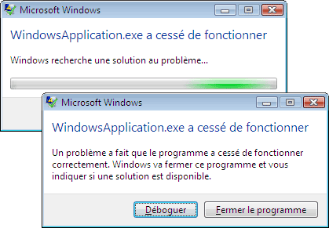
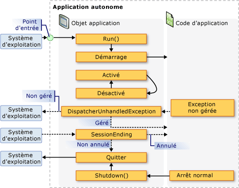
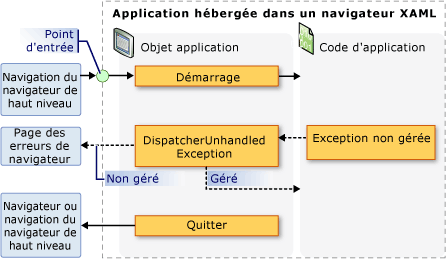

# Vue d&#39;ensemble de la gestion d&#39;applications
Toutes les applications tendent à partager un jeu de fonctionnalités commun qui s'applique à l'implémentation et à la gestion.  Cette rubrique fournit une vue d'ensemble de la fonctionnalité dans la classe d' <xref:System.Windows.Application> pour créer et gérer des applications.  
  
   
  
## La classe d'application  
 Dans [!INCLUDE[TLA2#tla_wpf](../../../../includes/tla2sharptla-wpf-md.md)], les fonctionnalités communes de portée application sont encapsulées dans la classe d' <xref:System.Windows.Application> .  La classe d' <xref:System.Windows.Application> inclut les fonctionnalités suivantes :  
  
-   Suivi de la durée de vie des applications et interaction avec celle\-ci  
  
-   Récupération et traitement des paramètres de ligne de commande  
  
-   Détection des exceptions non gérées et réponse à celles\-ci  
  
-   Partage des propriétés et des ressources de portée application  
  
-   La gestion des fenêtres dans des applications autonomes.  
  
-   Suivi et gestion de la navigation.  
  
<a name="The_Application_Class"></a>   
## Exécutez procédure les tâches courantes à l'aide de la classe d'application  
 Si vous intéresse pas tous les détails de la classe d' <xref:System.Windows.Application> , le tableau suivant répertorie certaines tâches courantes pour <xref:System.Windows.Application> et comment les accomplir.  En affichant l'API et les rubriques connexes, vous pouvez obtenir davantage d'informations et des exemples de code.  
  
|Tâche|Approche|  
|-----------|--------------|  
|obtenez un objet qui représente l'application actuelle|Utilisez la propriété <xref:System.Windows.Application.Current%2A?displayProperty=fullName>.|  
|ajoutez un écran de démarrage à une application|Consultez [Ajouter un écran de démarrage dans une application WPF](../../../../docs/framework/wpf/app-development/how-to-add-a-splash-screen-to-a-wpf-application.md).|  
|Démarrez une application|Utilisez la méthode <xref:System.Windows.Application.Run%2A?displayProperty=fullName>.|  
|Arrêt d'une application|Use la méthode <xref:System.Windows.Application.Shutdown%2A> de l'objet <xref:System.Windows.Application.Current%2A?displayProperty=fullName>.|  
|Arguments get de la ligne de commande|gérez l'événement d' <xref:System.Windows.Application.Startup?displayProperty=fullName> et utilisez la propriété d' <xref:System.Windows.StartupEventArgs.Args%2A?displayProperty=fullName> .  Pour obtenir un exemple, consultez l'événement d' <xref:System.Windows.Application.Startup?displayProperty=fullName> .|  
|Obtenez ou définissez le code de sortie d'application|Définissez la propriété d' <xref:System.Windows.ExitEventArgs.ApplicationExitCode%2A?displayProperty=fullName> dans le gestionnaire d'événements d' <xref:System.Windows.Application.Exit?displayProperty=fullName> ou appelez la méthode d' <xref:System.Windows.Application.Shutdown%2A> et passez un entier.|  
|Le détecter et répondre aux exceptions non gérées|Gérer l'événement <xref:System.Windows.Application.DispatcherUnhandledException>.|  
|Get et ressources de portée application lors ensemble|Utilisez la propriété <xref:System.Windows.Application.Resources%2A?displayProperty=fullName>.|  
|utilisez un dictionnaire de ressources de portée application|Consultez [Utiliser un dictionnaire de ressources de portée application](../../../../docs/framework/wpf/app-development/how-to-use-an-application-scope-resource-dictionary.md).|  
|Get et propriétés de portée application d'ensemble|Utilisez la propriété <xref:System.Windows.Application.Properties%2A?displayProperty=fullName>.|  
|Passez et enregistrez l'état d'une application|Consultez [Rendre persistantes et restaurer les propriétés de portée application d'une session d'application à l'autre](../../../../docs/framework/wpf/app-development/persist-and-restore-application-scope-properties.md).|  
|Gérer les fichiers de données non\-code, notamment les fichiers de ressources, les fichiers de contenu, et les fichiers de ressources.|Consultez [Fichiers de ressources, de contenu et de données d'une application WPF](../../../../docs/framework/wpf/app-development/wpf-application-resource-content-and-data-files.md).|  
|Gestion des fenêtres dans des applications autonomes|Consultez [Vue d'ensemble des fenêtres WPF](../../../../docs/framework/wpf/app-development/wpf-windows-overview.md).|  
|Suivez et gestion de la navigation|Consultez [Vue d'ensemble de la navigation](../../../../docs/framework/wpf/app-development/navigation-overview.md).|  
  
<a name="The_Application_Definition"></a>   
## Définition d'application.  
 Pour utiliser les fonctionnalités de la classe d' <xref:System.Windows.Application> , vous devez implémenter une définition d'application.  Une définition d'application [!INCLUDE[TLA2#tla_wpf](../../../../includes/tla2sharptla-wpf-md.md)] est une classe dérivée de <xref:System.Windows.Application> et est configurée avec un paramètre [!INCLUDE[TLA#tla_msbuild](../../../../includes/tlasharptla-msbuild-md.md)] spécial.  
  
### Implémentation d'une définition d'application  
 Une définition d'application [!INCLUDE[TLA2#tla_wpf](../../../../includes/tla2sharptla-wpf-md.md)] typique est implémentée à l'aide de balises et d'un fichier code\-behind.  Vous pouvez ainsi utiliser des balises pour définir de façon déclarative les propriétés, les ressources et les événements de registre d'une application, tout en gérant les événements et en implémentant le comportement spécifique de l'application dans un fichier code\-behind.  
  
 L'exemple suivant indique comment implémenter une définition d'application à l'aide de balises et du fichier code\-behind :  
  
 [!code-xml[ApplicationSnippets#ApplicationXAML](../../../../samples/snippets/csharp/VS_Snippets_Wpf/ApplicationSnippets/CSharp/App.xaml#applicationxaml)]  
  
 [!code-csharp[ApplicationSnippets#ApplicationCODEBEHIND](../../../../samples/snippets/csharp/VS_Snippets_Wpf/ApplicationSnippets/CSharp/App.xaml.cs#applicationcodebehind)]
 [!code-vb[ApplicationSnippets#ApplicationCODEBEHIND](../../../../samples/snippets/visualbasic/VS_Snippets_Wpf/ApplicationSnippets/visualbasic/application.xaml.vb#applicationcodebehind)]  
  
 Pour permettre l'interopérabilité d'un fichier de balisage et d'un fichier code\-behind, les conditions suivantes doivent être satisfaites :  
  
-   Dans les balises, l'élément `Application` doit inclure l'attribut `x:Class`.  Lorsque l'application est générée, l'existence de `x:Class` dans le fichier de balisage amène [!INCLUDE[TLA2#tla_msbuild](../../../../includes/tla2sharptla-msbuild-md.md)] à créer une classe `partial` qui dérive de <xref:System.Windows.Application> et qui porte le nom spécifié par l'attribut `x:Class`.  Cela requiert l'ajout d'une déclaration d'espace de noms [!INCLUDE[TLA2#tla_xml](../../../../includes/tla2sharptla-xml-md.md)] pour le schéma [!INCLUDE[TLA2#tla_xaml](../../../../includes/tla2sharptla-xaml-md.md)] \(`xmlns:x="http://schemas.microsoft.com/winfx/2006/xaml"`\).  
  
-   Dans le fichier code\-behind, la classe doit être une classe `partial` portant le même nom spécifié par l'attribut `x:Class` dans la balise et elle doit dériver de <xref:System.Windows.Application>.  Cela permet au fichier code\-behind d'être associé à la classe `partial` générée pour le fichier de balisage lorsque l'application est générée \(consultez [Génération d'une application WPF](../../../../docs/framework/wpf/app-development/building-a-wpf-application-wpf.md)\).  
  
> [!NOTE]
>  Lorsque vous créez un projet d'application WPF ou un projet d'application de navigateur WPF à l'aide de [!INCLUDE[TLA#tla_visualstu](../../../../includes/tlasharptla-visualstu-md.md)], une définition d'application est incluse par défaut et est définie à l'aide de fichiers de balisage et code\-behind.  
  
 Ce code est le minimum requis pour implémenter une définition d'application.  Toutefois, une configuration [!INCLUDE[TLA2#tla_msbuild](../../../../includes/tla2sharptla-msbuild-md.md)] supplémentaire de la définition d'application est nécessaire avant de générer et d'exécuter l'application.  
  
### Configuration de la définition d'application pour MSBuild  
 Les applications autonomes et les [!INCLUDE[TLA#tla_xbap#plural](../../../../includes/tlasharptla-xbapsharpplural-md.md)] requièrent l'implémentation d'un certain niveau d'infrastructure avant de pouvoir être exécutées.  La partie la plus importante de cette infrastructure est le point d'entrée.  Lorsqu'une application est lancée par un utilisateur, le système d'exploitation appelle le point d'entrée, qui est une fonction connue pour démarrer les applications.  
  
 Les développeurs ont toujours dû écrire eux\-mêmes une partie, voire l'intégralité, de ce code, selon la technologie employée.  En revanche, [!INCLUDE[TLA2#tla_wpf](../../../../includes/tla2sharptla-wpf-md.md)] génère automatiquement ce code lorsque le fichier de balisage de la définition d'application est configuré comme un élément  `ApplicationDefinition` [!INCLUDE[TLA2#tla_msbuild](../../../../includes/tla2sharptla-msbuild-md.md)], comme indiqué dans le fichier du projet [!INCLUDE[TLA2#tla_msbuild](../../../../includes/tla2sharptla-msbuild-md.md)] :  
  
```  
<Project   
  DefaultTargets="Build"  
  xmlns="http://schemas.microsoft.com/developer/msbuild/2003">  
  ...  
  <ApplicationDefinition Include="App.xaml" />  
  <Compile Include="App.xaml.cs" />  
  ...  
</Project>  
```  
  
 Étant donné que le fichier code\-behind contient le code, il est marqué comme un élément `Compile` [!INCLUDE[TLA2#tla_msbuild](../../../../includes/tla2sharptla-msbuild-md.md)], ce qui est normal.  
  
 L'application de ces configurations [!INCLUDE[TLA2#tla_msbuild](../../../../includes/tla2sharptla-msbuild-md.md)] aux fichiers de balisage et code\-behind d'une définition d'application entraîne la génération du code suivant par [!INCLUDE[TLA2#tla_msbuild](../../../../includes/tla2sharptla-msbuild-md.md)] :  
  
 [!code-csharp[AppDefAugSnippets#AppDefAugCODE1](../../../../samples/snippets/csharp/VS_Snippets_Wpf/AppDefAugSnippets/CSharp/App.cs#appdefaugcode1)]
 [!code-vb[AppDefAugSnippets#AppDefAugCODE1](../../../../samples/snippets/visualbasic/VS_Snippets_Wpf/AppDefAugSnippets/VisualBasic/App.vb#appdefaugcode1)]  
[!code-csharp[AppDefAugSnippets#AppDefAugCODE2](../../../../samples/snippets/csharp/VS_Snippets_Wpf/AppDefAugSnippets/CSharp/App.cs#appdefaugcode2)]
[!code-vb[AppDefAugSnippets#AppDefAugCODE2](../../../../samples/snippets/visualbasic/VS_Snippets_Wpf/AppDefAugSnippets/VisualBasic/App.vb#appdefaugcode2)]  
  
 Le code résultant ajoute à votre définition d'application le code d'infrastructure supplémentaire, qui inclut la méthode de point d'entrée `Main`.  L'attribut <xref:System.STAThreadAttribute> est appliqué à la méthode `Main` pour indiquer que le thread principal [!INCLUDE[TLA2#tla_ui](../../../../includes/tla2sharptla-ui-md.md)] de l'application [!INCLUDE[TLA2#tla_wpf](../../../../includes/tla2sharptla-wpf-md.md)] est un thread STA, qui est requis pour les applications [!INCLUDE[TLA2#tla_wpf](../../../../includes/tla2sharptla-wpf-md.md)]. Lorsqu'elle est appelée, `Main` crée une nouvelle instance de `App` avant l'appel de la méthode `InitializeComponent` pour enregistrer les événements et définir les propriétés qui sont implémentées dans le balisage.  Du fait que `InitializeComponent` soit généré automatiquement, vous n'avez pas besoin d'appeler explicitement `InitializeComponent` à partir d'une définition d'application comme vous le faites pour les implémentations <xref:System.Windows.Controls.Page> et <xref:System.Windows.Window>.  Enfin, la méthode <xref:System.Windows.Application.Run%2A> est appelée pour démarrer l'application.  
  
<a name="Getting_the_Current_Application"></a>   
## Obtention de l'application actuelle  
 Étant donné que les fonctionnalités de la classe d' <xref:System.Windows.Application> sont partagées entre une application, il peut y avoir qu'une seule instance de la classe d' <xref:System.Windows.Application> par <xref:System.AppDomain>.  Pour mettre en œuvre ce principe, la classe <xref:System.Windows.Application> est implémentée comme une classe Singleton \(consultez [Implémentation de Singleton en C\#](http://go.microsoft.com/fwlink/?LinkId=100567)\), ce qui entraîne la création d'une instance unique de cette classe et fournit un accès partagé à celle\-ci avec la propriété `static` <xref:System.Windows.Application.Current%2A>.  
  
 Le code suivant indique comment acquérir une référence à l'objet <xref:System.Windows.Application> pour le <xref:System.AppDomain> actuel.  
  
 [!code-csharp[ApplicationManagementOverviewSnippets#GetCurrentAppCODE](../../../../samples/snippets/csharp/VS_Snippets_Wpf/ApplicationManagementOverviewSnippets/CSharp/MainWindow.xaml.cs#getcurrentappcode)]
 [!code-vb[ApplicationManagementOverviewSnippets#GetCurrentAppCODE](../../../../samples/snippets/visualbasic/VS_Snippets_Wpf/ApplicationManagementOverviewSnippets/VisualBasic/MainWindow.xaml.vb#getcurrentappcode)]  
  
 <xref:System.Windows.Application.Current%2A> retourne une référence à une instance de la classe <xref:System.Windows.Application>.  Si vous souhaitez une référence à votre classe dérivée <xref:System.Windows.Application>, vous devez caster la valeur de la propriété <xref:System.Windows.Application.Current%2A>, comme illustré dans l'exemple suivant.  
  
 [!code-csharp[ApplicationManagementOverviewSnippets#GetSTCurrentAppCODE](../../../../samples/snippets/csharp/VS_Snippets_Wpf/ApplicationManagementOverviewSnippets/CSharp/MainWindow.xaml.cs#getstcurrentappcode)]
 [!code-vb[ApplicationManagementOverviewSnippets#GetSTCurrentAppCODE](../../../../samples/snippets/visualbasic/VS_Snippets_Wpf/ApplicationManagementOverviewSnippets/VisualBasic/MainWindow.xaml.vb#getstcurrentappcode)]  
  
 Vous pouvez vérifier la valeur de <xref:System.Windows.Application.Current%2A> à tout moment pendant la durée de vie d'un objet <xref:System.Windows.Application>.  Toutefois, vous devez être vigilant.  Après l'instanciation de la classe <xref:System.Windows.Application>, l'état de l'objet <xref:System.Windows.Application> est incohérent pendant quelque temps.  Pendant cette période, <xref:System.Windows.Application> effectue diverses tâches d'initialisation nécessaires à l'exécution de votre code, notamment l'établissement de l'infrastructure des applications, la définition des propriétés et l'enregistrement d'événements.  Si vous essayez d'utiliser l'objet <xref:System.Windows.Application> pendant cette période, votre code peut avoir des résultats inattendus, en particulier s'il dépend des diverses propriétés <xref:System.Windows.Application> qui sont définies.  
  
 Lorsque <xref:System.Windows.Application> achève son initialisation, sa durée de vie commence véritablement.  
  
<a name="Application_Lifetime"></a>   
## Durée de vie d'une application  
 La durée de vie d'une application [!INCLUDE[TLA2#tla_wpf](../../../../includes/tla2sharptla-wpf-md.md)] est marquée par plusieurs événements déclenchés par <xref:System.Windows.Application> pour vous tenir informé du moment où votre application a démarré, a été activée et désactivée et arrêtée.  
  
   
  
<a name="Splash_Screen"></a>   
### Écran de démarrage  
 À partir du [!INCLUDE[net_v35SP1_short](../../../../includes/net-v35sp1-short-md.md)], vous pouvez spécifier une image à utiliser dans une fenêtre de démarrage \(ou *écran de démarrage*\).  La classe <xref:System.Windows.SplashScreen> facilite l'affichage d'une fenêtre de démarrage pendant le chargement de votre application.  La fenêtre <xref:System.Windows.SplashScreen> est créée et affichée avant que <xref:System.Windows.Application.Run%2A> ne soit appelé.  Pour plus d'informations, consultez [Temps de démarrage d'une application](../../../../docs/framework/wpf/advanced/application-startup-time.md) et [Ajouter un écran de démarrage dans une application WPF](../../../../docs/framework/wpf/app-development/how-to-add-a-splash-screen-to-a-wpf-application.md).  
  
<a name="Starting_an_Application"></a>   
### Démarrage d'une application  
 Après que <xref:System.Windows.Application.Run%2A> a été appelé et l'application initialisée, cette dernière est prête à s'exécuter.  Ce moment est signifié par le déclenchement de l'événement <xref:System.Windows.Application.Startup> :  
  
 [!code-csharp[ApplicationStartupSnippets#StartupCODEBEHIND1](../../../../samples/snippets/csharp/VS_Snippets_Wpf/ApplicationStartupSnippets/CSharp/App.xaml.cs#startupcodebehind1)]
 [!code-vb[ApplicationStartupSnippets#StartupCODEBEHIND1](../../../../samples/snippets/visualbasic/VS_Snippets_Wpf/ApplicationStartupSnippets/visualbasic/application.xaml.vb#startupcodebehind1)]  
[!code-csharp[ApplicationStartupSnippets#StartupCODEBEHIND2](../../../../samples/snippets/csharp/VS_Snippets_Wpf/ApplicationStartupSnippets/CSharp/App.xaml.cs#startupcodebehind2)]
[!code-vb[ApplicationStartupSnippets#StartupCODEBEHIND2](../../../../samples/snippets/visualbasic/VS_Snippets_Wpf/ApplicationStartupSnippets/visualbasic/application.xaml.vb#startupcodebehind2)]  
  
 À ce stade de la durée de vie d'une application, une [!INCLUDE[TLA2#tla_ui](../../../../includes/tla2sharptla-ui-md.md)] s'affiche généralement.  
  
<a name="Showing_a_User_Interface"></a>   
### Affichage d'une interface utilisateur  
 La plupart des applications [!INCLUDE[TLA2#tla_mswin](../../../../includes/tla2sharptla-mswin-md.md)] autonomes affichent une <xref:System.Windows.Window> lorsqu'elles commencent à s'exécuter.  Le gestionnaire d'événements <xref:System.Windows.Application.Startup> est un emplacement à partir duquel vous pouvez effectuer cette opération, comme indiqué par le code suivant.  
  
 [!code-xml[AppShowWindowHardSnippets#StartupEventMARKUP](../../../../samples/snippets/csharp/VS_Snippets_Wpf/AppShowWindowHardSnippets/CSharp/App.xaml#startupeventmarkup)]  
  
 [!code-csharp[AppShowWindowHardSnippets#StartupEventCODEBEHIND](../../../../samples/snippets/csharp/VS_Snippets_Wpf/AppShowWindowHardSnippets/CSharp/App.xaml.cs#startupeventcodebehind)]
 [!code-vb[AppShowWindowHardSnippets#StartupEventCODEBEHIND](../../../../samples/snippets/visualbasic/VS_Snippets_Wpf/AppShowWindowHardSnippets/VisualBasic/Application.xaml.vb#startupeventcodebehind)]  
  
> [!NOTE]
>  La première <xref:System.Windows.Window> à instancier dans une application autonome devient par défaut la fenêtre d'application principale.  Cet objet <xref:System.Windows.Window> est référencé par la propriété <xref:System.Windows.Application.MainWindow%2A?displayProperty=fullName>.  La valeur de la propriété <xref:System.Windows.Application.MainWindow%2A> peut être modifiée par programme si une fenêtre différente de la première <xref:System.Windows.Window> instanciée doit être la fenêtre principale.  
  
 Lorsque [!INCLUDE[TLA2#tla_xbap](../../../../includes/tla2sharptla-xbap-md.md)] démarre en premier, il accèdera très probablement à une <xref:System.Windows.Controls.Page>.  Cela est illustré dans le code suivant.  
  
 [!code-xml[XBAPAppStartupSnippets#StartupXBAPMARKUP](../../../../samples/snippets/csharp/VS_Snippets_Wpf/XBAPAppStartupSnippets/CSharp/App.xaml#startupxbapmarkup)]  
  
 [!code-csharp[XBAPAppStartupSnippets#StartupXBAPCODEBEHIND](../../../../samples/snippets/csharp/VS_Snippets_Wpf/XBAPAppStartupSnippets/CSharp/App.xaml.cs#startupxbapcodebehind)]
 [!code-vb[XBAPAppStartupSnippets#StartupXBAPCODEBEHIND](../../../../samples/snippets/visualbasic/VS_Snippets_Wpf/XBAPAppStartupSnippets/VisualBasic/Application.xaml.vb#startupxbapcodebehind)]  
  
 Si vous gérez <xref:System.Windows.Application.Startup> pour ouvrir uniquement une <xref:System.Windows.Window> ou naviguer jusqu'à une <xref:System.Windows.Controls.Page>, vous pouvez définir à la place l'attribut `StartupUri` dans la balise.  
  
 L'exemple suivant indique comment utiliser l'<xref:System.Windows.Application.StartupUri%2A> d'une application autonome pour ouvrir une <xref:System.Windows.Window>.  
  
 [!code-xml[ApplicationManagementOverviewSnippets#OverviewStartupUriMARKUP](../../../../samples/snippets/csharp/VS_Snippets_Wpf/ApplicationManagementOverviewSnippets/CSharp/App.xaml#overviewstartupurimarkup)]  
  
 L'exemple suivant indique comment utiliser un <xref:System.Windows.Application.StartupUri%2A> à partir de [!INCLUDE[TLA2#tla_xbap](../../../../includes/tla2sharptla-xbap-md.md)] pour accéder à une <xref:System.Windows.Controls.Page>.  
  
 [!code-xml[PageSnippets#XBAPStartupUriMARKUP](../../../../samples/snippets/csharp/VS_Snippets_Wpf/PageSnippets/CSharp/App.xaml#xbapstartupurimarkup)]  
  
 Cette balise a le même effet que le code précédent pour ouvrir une fenêtre.  
  
> [!NOTE]
>  Pour plus d'informations sur la navigation, consultez [Vue d'ensemble de la navigation](../../../../docs/framework/wpf/app-development/navigation-overview.md).  
  
 Vous devez gérer l'événement <xref:System.Windows.Application.Startup> pour ouvrir une <xref:System.Windows.Window> si vous devez l'instancier à l'aide d'un constructeur non défini par défaut, ou vous devez définir ses propriétés ou vous abonner à ses événements avant de les afficher ou encore vous devez traiter tous les arguments de ligne de commande fournis au lancement de l'application.  
  
<a name="Processing_Command_Line_Arguments"></a>   
### Traitement des arguments de ligne de command  
 Dans [!INCLUDE[TLA2#tla_mswin](../../../../includes/tla2sharptla-mswin-md.md)], les applications autonomes peuvent être lancées à partir d'une invite de commande ou du Bureau.  Dans les deux cas, les arguments de la ligne de commande peuvent être passés à l'application. L'exemple suivant montre une application qui est lancée avec un seul argument de ligne de commande "\/StartMinimized":  
  
 `wpfapplication.exe /StartMinimized`  
  
 Pendant l'initialisation de l'application, [!INCLUDE[TLA2#tla_wpf](../../../../includes/tla2sharptla-wpf-md.md)] extrait les arguments de ligne de commande du système d'exploitation et les transmet au gestionnaire d'événements <xref:System.Windows.Application.Startup> par le biais de la propriété <xref:System.Windows.StartupEventArgs.Args%2A> du paramètre <xref:System.Windows.StartupEventArgs>.  Vous pouvez récupérer et stocker les arguments de ligne de commande à l'aide de code similaire à celui décrit ci\-dessous.  
  
 [!code-xml[ApplicationStartupSnippets#HandleStartupXAML](../../../../samples/snippets/csharp/VS_Snippets_Wpf/ApplicationStartupSnippets/CSharp/App.xaml#handlestartupxaml)]  
  
 [!code-csharp[ApplicationStartupSnippets#HandleStartupCODEBEHIND](../../../../samples/snippets/csharp/VS_Snippets_Wpf/ApplicationStartupSnippets/CSharp/App.xaml.cs#handlestartupcodebehind)]
 [!code-vb[ApplicationStartupSnippets#HandleStartupCODEBEHIND](../../../../samples/snippets/visualbasic/VS_Snippets_Wpf/ApplicationStartupSnippets/visualbasic/application.xaml.vb#handlestartupcodebehind)]  
  
 Le code gère <xref:System.Windows.Application.Startup> pour vérifier si l'argument de ligne de commande **\/StartMinimized** a été fourni ; si tel est le cas, il ouvre la fenêtre principale à l'<xref:System.Windows.WindowState> <xref:System.Windows.WindowState>.  Notez qu'étant donné que la propriété <xref:System.Windows.Window.WindowState%2A> doit être définie par programme, la <xref:System.Windows.Window> principale doit être ouverte explicitement dans le code.  
  
 Les [!INCLUDE[TLA2#tla_xbap#plural](../../../../includes/tla2sharptla-xbapsharpplural-md.md)] ne peuvent pas récupérer et traiter des arguments de ligne de commande car elles sont lancées à l'aide du déploiement de [!INCLUDE[TLA#tla_clickonce](../../../../includes/tlasharptla-clickonce-md.md)] \(consultez [Déploiement d'une application WPF](../../../../docs/framework/wpf/app-development/deploying-a-wpf-application-wpf.md)\).  En revanche, elles peuvent récupérer et traiter des paramètres de chaîne de requête à partir des URL servant à les lancer.  
  
<a name="Application_Activation_and_Deactivation"></a>   
### Activation et désactivation d'une application  
 [!INCLUDE[TLA2#tla_mswin](../../../../includes/tla2sharptla-mswin-md.md)] autorise les utilisateurs à passer d'une application à l'autre. La façon la plus courante consiste à utiliser la combinaison de touches ALT\+TAB.  Il n'est possible de basculer vers une application que si elle a une <xref:System.Windows.Window> visible qu'un utilisateur peut sélectionner.  La <xref:System.Windows.Window> actuellement sélectionnée est la *fenêtre active* \(également appelée *fenêtre de premier plan*\) et constitue la <xref:System.Windows.Window> recevant les entrées d'utilisateur. L'application contenant la fenêtre active est l'*application active* \(ou *application de premier plan*\). :Une application devient l'application active dans les circonstances suivantes :  
  
-   Elle est lancée et affiche une <xref:System.Windows.Window>.  
  
-   Un utilisateur y bascule depuis une autre application en sélectionnant une <xref:System.Windows.Window> de l'application.  
  
 Vous pouvez détecter qu'une application est devenue active en gérant l'événement <xref:System.Windows.Application.Activated?displayProperty=fullName>.  
  
 De même, une application peut devenir inactive dans les circonstances suivantes :  
  
-   Un utilisateur bascule vers une autre application à partir de l'application active.  
  
-   Lorsque l'application est arrêtée.  
  
 Vous pouvez détecter qu'une application est devenue inactive en gérant l'événement <xref:System.Windows.Application.Deactivated?displayProperty=fullName>.  
  
 Le code suivant indique comment gérer les événements <xref:System.Windows.Application.Activated> et <xref:System.Windows.Application.Deactivated> afin de déterminer si une application est active.  
  
 [!code-xml[ApplicationActivationSnippets#DetectActivationStateXAML](../../../../samples/snippets/csharp/VS_Snippets_Wpf/ApplicationActivationSnippets/CSharp/App.xaml#detectactivationstatexaml)]  
  
 [!code-csharp[ApplicationActivationSnippets#DetectActivationStateCODEBEHIND](../../../../samples/snippets/csharp/VS_Snippets_Wpf/ApplicationActivationSnippets/CSharp/App.xaml.cs#detectactivationstatecodebehind)]
 [!code-vb[ApplicationActivationSnippets#DetectActivationStateCODEBEHIND](../../../../samples/snippets/visualbasic/VS_Snippets_Wpf/ApplicationActivationSnippets/visualbasic/application.xaml.vb#detectactivationstatecodebehind)]  
  
 Une <xref:System.Windows.Window> peut également être activée et désactivée.  Pour plus d'informations, consultez <xref:System.Windows.Window.Activated?displayProperty=fullName> et <xref:System.Windows.Window.Deactivated?displayProperty=fullName>.  
  
> [!NOTE]
>  Ni <xref:System.Windows.Application.Activated?displayProperty=fullName> ni <xref:System.Windows.Application.Deactivated?displayProperty=fullName> n'est déclenché pour [!INCLUDE[TLA2#tla_xbap#plural](../../../../includes/tla2sharptla-xbapsharpplural-md.md)].  
  
<a name="Application_Shutdown"></a>   
### Arrêt d'une application  
 La vie d'une application s'achève lorsque celle\-ci est arrêtée, ce qui peut se produire pour les raisons suivantes :  
  
-   Un utilisateur ferme chaque <xref:System.Windows.Window>.  
  
-   Un utilisateur ferme la <xref:System.Windows.Window> principale.  
  
-   Un utilisateur met fin à la session [!INCLUDE[TLA2#tla_mswin](../../../../includes/tla2sharptla-mswin-md.md)] en se déconnectant ou en l'arrêtant.  
  
-   Une condition spécifique à l'application s'est produite.  
  
 Pour vous aider à gérer l'arrêt d'une application, <xref:System.Windows.Application> fournit la méthode <xref:System.Windows.Application.Shutdown%2A>, la propriété <xref:System.Windows.Application.ShutdownMode%2A> et les événements <xref:System.Windows.Application.SessionEnding> et <xref:System.Windows.Application.Exit>.  
  
> [!NOTE]
>  <xref:System.Windows.Application.Shutdown%2A> ne peut être appelé que dans les applications qui ont <xref:System.Security.Permissions.UIPermission>.  Les applications [!INCLUDE[TLA2#tla_wpf](../../../../includes/tla2sharptla-wpf-md.md)] autonomes ont toujours cette autorisation.  En revanche, les [!INCLUDE[TLA2#tla_xbap#plural](../../../../includes/tla2sharptla-xbapsharpplural-md.md)] qui s'exécutent dans le sandbox de sécurité présentant un niveau de confiance partiel de la zone Internet n'ont pas cette autorisation.  
  
#### Mode d'arrêt  
 La plupart des applications s'arrêtent à la fermeture de toutes les fenêtres ou de la fenêtre principale.  Toutefois, d'autres conditions spécifiques à l'application peuvent parfois déterminer l'arrêt d'une application.  Vous pouvez spécifier les conditions dans lesquelles votre application s'arrêtera en attribuant à <xref:System.Windows.Application.ShutdownMode%2A> l'une des valeurs d'énumération <xref:System.Windows.ShutdownMode> suivantes :  
  
-   <xref:System.Windows.ShutdownMode>  
  
-   <xref:System.Windows.ShutdownMode>  
  
-   <xref:System.Windows.ShutdownMode>  
  
 La valeur par défaut de <xref:System.Windows.Application.ShutdownMode%2A> est <xref:System.Windows.ShutdownMode>, ce qui signifie qu'une application s'arrête automatiquement lorsque sa dernière fenêtre est fermée par l'utilisateur.  Toutefois, si votre application doit s'arrêter lorsque la fenêtre principale est fermée, [!INCLUDE[TLA2#tla_wpf](../../../../includes/tla2sharptla-wpf-md.md)] l'arrête automatiquement si vous affectez à <xref:System.Windows.Application.ShutdownMode%2A> la valeur <xref:System.Windows.ShutdownMode>.  L'exemple suivant le démontre.  
  
 [!code-xml[ApplicationShutdownModeSnippets#OnMainWindowCloseMARKUP](../../../../samples/snippets/csharp/VS_Snippets_Wpf/ApplicationShutdownModeSnippets/CS/Page1.xaml#onmainwindowclosemarkup)]  
  
 Si des conditions d'arrêt spécifiques à l'application sont définies, vous affectez à <xref:System.Windows.Application.ShutdownMode%2A> la valeur <xref:System.Windows.ShutdownMode>.  Dans ce cas, il vous incombe d'arrêter une application en appelant explicitement la méthode <xref:System.Windows.Application.Shutdown%2A> ; sinon, votre application continuera de s'exécuter même si toutes les fenêtres sont fermées.  Notez que <xref:System.Windows.Application.Shutdown%2A> est appelé implicitement lorsque le <xref:System.Windows.Application.ShutdownMode%2A> a la valeur <xref:System.Windows.ShutdownMode> ou <xref:System.Windows.ShutdownMode>.  
  
> [!NOTE]
>  <xref:System.Windows.Application.ShutdownMode%2A> peut être défini à partir de [!INCLUDE[TLA2#tla_xbap](../../../../includes/tla2sharptla-xbap-md.md)], mais il est ignoré ; [!INCLUDE[TLA2#tla_xbap](../../../../includes/tla2sharptla-xbap-md.md)] est toujours arrêté lorsque l'utilisateur le quitte dans un navigateur ou lorsque le navigateur qui héberge [!INCLUDE[TLA2#tla_xbap](../../../../includes/tla2sharptla-xbap-md.md)] est fermé.  Pour plus d'informations, consultez [Vue d'ensemble de la navigation](../../../../docs/framework/wpf/app-development/navigation-overview.md).  
  
#### Fin de session  
 Les conditions d'arrêt décrites par la propriété <xref:System.Windows.Application.ShutdownMode%2A> sont spécifiques à une application.  Dans certains cas, pourtant, une application peut s'arrêter à la suite d'une condition externe.  La condition externe la plus courante se produit lorsqu'un utilisateur termine la session [!INCLUDE[TLA2#tla_mswin](../../../../includes/tla2sharptla-mswin-md.md)] en procédant comme suit :  
  
-   Par une déconnexion  
  
-   Par un arrêt  
  
-   Par un redémarrage  
  
-   Par une mise en veille  
  
 Pour détecter la fin d'une session [!INCLUDE[TLA2#tla_mswin](../../../../includes/tla2sharptla-mswin-md.md)], vous pouvez gérer l'événement <xref:System.Windows.Application.SessionEnding>, comme illustré dans l'exemple suivant.  
  
 [!code-xml[ApplicationSessionEndingSnippets#HandlingSessionEndingXAML](../../../../samples/snippets/csharp/VS_Snippets_Wpf/ApplicationSessionEndingSnippets/CSharp/App.xaml#handlingsessionendingxaml)]  
  
 [!code-csharp[ApplicationSessionEndingSnippets#HandlingSessionEndingCODEBEHIND](../../../../samples/snippets/csharp/VS_Snippets_Wpf/ApplicationSessionEndingSnippets/CSharp/App.xaml.cs#handlingsessionendingcodebehind)]
 [!code-vb[ApplicationSessionEndingSnippets#HandlingSessionEndingCODEBEHIND](../../../../samples/snippets/visualbasic/VS_Snippets_Wpf/ApplicationSessionEndingSnippets/visualbasic/application.xaml.vb#handlingsessionendingcodebehind)]  
  
 Dans cet exemple, le code vérifie la propriété <xref:System.Windows.SessionEndingCancelEventArgs.ReasonSessionEnding%2A> afin de déterminer comment se termine la session [!INCLUDE[TLA2#tla_mswin](../../../../includes/tla2sharptla-mswin-md.md)].  Il utilise cette valeur pour afficher un message de confirmation à l'attention de l'utilisateur.  Si ce dernier ne souhaite pas mettre fin à la session, le code attribue à <xref:System.ComponentModel.CancelEventArgs.Cancel%2A> la valeur `true` pour empêcher l'arrêt de la session [!INCLUDE[TLA2#tla_mswin](../../../../includes/tla2sharptla-mswin-md.md)].  
  
> [!NOTE]
>  <xref:System.Windows.Application.SessionEnding> n'est pas déclenché pour les [!INCLUDE[TLA2#tla_xbap#plural](../../../../includes/tla2sharptla-xbapsharpplural-md.md)].  
  
#### Exit  
 Lorsqu'une application s'arrête, il peut s'avérer nécessaire d'effectuer quelque traitement final, par exemple rendre persistant l'état de l'application.  Dans ces cas, vous pouvez gérer l'événement <xref:System.Windows.Application.Exit>.  
  
 [!code-xml[HOWTOApplicationModelSnippets#PersistRestoreAppScopePropertiesXAML1](../../../../samples/snippets/csharp/VS_Snippets_Wpf/HOWTOApplicationModelSnippets/CSharp/App.xaml#persistrestoreappscopepropertiesxaml1)]  
[!code-xml[HOWTOApplicationModelSnippets#PersistRestoreAppScopePropertiesXAML2](../../../../samples/snippets/csharp/VS_Snippets_Wpf/HOWTOApplicationModelSnippets/CSharp/App.xaml#persistrestoreappscopepropertiesxaml2)]  
  
 [!code-csharp[HOWTOApplicationModelSnippets#PersistAppScopePropertiesCODEBEHIND1](../../../../samples/snippets/csharp/VS_Snippets_Wpf/HOWTOApplicationModelSnippets/CSharp/App.xaml.cs#persistappscopepropertiescodebehind1)]
 [!code-vb[HOWTOApplicationModelSnippets#PersistAppScopePropertiesCODEBEHIND1](../../../../samples/snippets/visualbasic/VS_Snippets_Wpf/HOWTOApplicationModelSnippets/visualbasic/application.xaml.vb#persistappscopepropertiescodebehind1)]  
[!code-csharp[HOWTOApplicationModelSnippets#PersistAppScopePropertiesCODEBEHIND2](../../../../samples/snippets/csharp/VS_Snippets_Wpf/HOWTOApplicationModelSnippets/CSharp/App.xaml.cs#persistappscopepropertiescodebehind2)]
[!code-vb[HOWTOApplicationModelSnippets#PersistAppScopePropertiesCODEBEHIND2](../../../../samples/snippets/visualbasic/VS_Snippets_Wpf/HOWTOApplicationModelSnippets/visualbasic/application.xaml.vb#persistappscopepropertiescodebehind2)]  
  
 Pour accéder à l'intégralité de l'exemple, consultez la rubrique [Rendre persistantes et restaurer les propriétés de portée application d'une session d'application à l'autre](../../../../docs/framework/wpf/app-development/persist-and-restore-application-scope-properties.md).  
  
 <xref:System.Windows.Application.Exit> peut être géré à la fois par les applications autonomes et par les [!INCLUDE[TLA2#tla_xbap#plural](../../../../includes/tla2sharptla-xbapsharpplural-md.md)].  Pour les [!INCLUDE[TLA2#tla_xbap#plural](../../../../includes/tla2sharptla-xbapsharpplural-md.md)], <xref:System.Windows.Application.Exit> est déclenché dans les circonstances suivantes :  
  
-   L'utilisateur quitte [!INCLUDE[TLA2#tla_xbap](../../../../includes/tla2sharptla-xbap-md.md)].  
  
-   Dans [!INCLUDE[TLA2#tla_ie7](../../../../includes/tla2sharptla-ie7-md.md)], l'onglet hébergeant [!INCLUDE[TLA2#tla_xbap](../../../../includes/tla2sharptla-xbap-md.md)] est fermé.  
  
-   Le navigateur est fermé.  
  
#### Code de sortie  
 Les applications sont principalement lancées par le système d'exploitation en réponse à une requête utilisateur.  Toutefois, une application peut être lancée par une autre application pour effectuer une tâche spécifique.  Lorsque l'application lancée s'arrête, il est possible que l'application de lancement souhaite connaître la condition dans laquelle s'est effectué cet arrêt.  Dans ces cas, [!INCLUDE[TLA2#tla_mswin](../../../../includes/tla2sharptla-mswin-md.md)] permet aux applications de retourner un code de sortie d'application à l'arrêt.  Par défaut, les applications [!INCLUDE[TLA2#tla_wpf](../../../../includes/tla2sharptla-wpf-md.md)] retournent la valeur de sortie de code 0.  
  
> [!NOTE]
>  Lorsque vous effectuez un débogage à partir de [!INCLUDE[TLA2#tla_visualstu](../../../../includes/tla2sharptla-visualstu-md.md)], le code de sortie d'application est affiché dans la fenêtre **Sortie** à l'arrêt de l'application arrête, dans un message similaire à celui présenté ci\-dessous :  
>   
>  `The program '[5340] AWPFApp.vshost.exe: Managed' has exited with code 0 (0x0).`  
>   
>  Vous ouvrez la fenêtre **Sortie** en cliquant sur **Sortie** dans le menu **Affichage**.  
  
 Pour modifier le code de sortie, vous pouvez appeler la surcharge <xref:System.Windows.Application.Shutdown%28System.Int32%29>, qui accepte un argument entier comme code de sortie :  
  
 [!code-csharp[ApplicationExitSnippets#AppExitCODE](../../../../samples/snippets/csharp/VS_Snippets_Wpf/ApplicationExitSnippets/CSharp/MainWindow.xaml.cs#appexitcode)]
 [!code-vb[ApplicationExitSnippets#AppExitCODE](../../../../samples/snippets/visualbasic/VS_Snippets_Wpf/ApplicationExitSnippets/visualbasic/mainwindow.xaml.vb#appexitcode)]  
  
 Vous pouvez détecter la valeur du code de sortie et la modifier, en gérant l'événement <xref:System.Windows.Application.Exit>.  Un <xref:System.Windows.ExitEventArgs>, qui fournit l'accès au code de sortie avec la propriété <xref:System.Windows.ExitEventArgs.ApplicationExitCode%2A>, est transmis au gestionnaire d'événements <xref:System.Windows.Application.Exit>.  Pour plus d'informations, consultez <xref:System.Windows.Application.Exit>.  
  
> [!NOTE]
>  Vous pouvez définir le code de sortie à la fois dans les applications autonomes et dans [!INCLUDE[TLA2#tla_xbap#plural](../../../../includes/tla2sharptla-xbapsharpplural-md.md)].  Toutefois, la valeur du code de sortie est ignorée pour [!INCLUDE[TLA2#tla_xbap#plural](../../../../includes/tla2sharptla-xbapsharpplural-md.md)].  
  
<a name="Unhandled_Exceptions"></a>   
### Exceptions non gérées  
 Il peut parfois arriver qu'une application s'arrête anormalement, par exemple en cas d'exception inattendue.  Dans ce cas, il est possible qu'elle n'ait pas le code nécessaire à la détection et au traitement de l'exception.  Ce type d'exception est une exception non gérée ; une notification similaire à celle illustrée dans la figure ci\-dessous s'affiche avant la fermeture de l'application.  
  
   
  
 Pour l'expérience de l'utilisateur, il est préférable d'éviter ce comportement par défaut de l'application en effectuant l'une des opérations suivantes ou toutes :  
  
-   Affichage d'informations conviviales  
  
-   Tentative visant à maintenir une application en cours d'exécution  
  
-   Consignation d'informations conviviales et détaillées sur les exceptions dans le journal d'événements [!INCLUDE[TLA2#tla_mswin](../../../../includes/tla2sharptla-mswin-md.md)]  
  
 L'implémentation de cette prise en charge repose sur la possibilité de détecter les exceptions non gérées, ce pourquoi l'événement <xref:System.Windows.Application.DispatcherUnhandledException> est déclenché.  
  
 [!code-xml[ApplicationDispatcherUnhandledExceptionSnippets#HandleDispatcherUnhandledExceptionXAML](../../../../samples/snippets/csharp/VS_Snippets_Wpf/ApplicationDispatcherUnhandledExceptionSnippets/CSharp/App.xaml#handledispatcherunhandledexceptionxaml)]  
  
 [!code-csharp[ApplicationDispatcherUnhandledExceptionSnippets#HandleDispatcherUnhandledExceptionCODEBEHIND1](../../../../samples/snippets/csharp/VS_Snippets_Wpf/ApplicationDispatcherUnhandledExceptionSnippets/CSharp/App.xaml.cs#handledispatcherunhandledexceptioncodebehind1)]
 [!code-vb[ApplicationDispatcherUnhandledExceptionSnippets#HandleDispatcherUnhandledExceptionCODEBEHIND1](../../../../samples/snippets/visualbasic/VS_Snippets_Wpf/ApplicationDispatcherUnhandledExceptionSnippets/visualbasic/application.xaml.vb#handledispatcherunhandledexceptioncodebehind1)]  
[!code-csharp[ApplicationDispatcherUnhandledExceptionSnippets#HandleDispatcherUnhandledExceptionCODEBEHIND2](../../../../samples/snippets/csharp/VS_Snippets_Wpf/ApplicationDispatcherUnhandledExceptionSnippets/CSharp/App.xaml.cs#handledispatcherunhandledexceptioncodebehind2)]
[!code-vb[ApplicationDispatcherUnhandledExceptionSnippets#HandleDispatcherUnhandledExceptionCODEBEHIND2](../../../../samples/snippets/visualbasic/VS_Snippets_Wpf/ApplicationDispatcherUnhandledExceptionSnippets/visualbasic/application.xaml.vb#handledispatcherunhandledexceptioncodebehind2)]  
  
 Un paramètre <xref:System.Windows.Threading.DispatcherUnhandledExceptionEventArgs> contenant des informations contextuelles sur l'exception non gérée, y compris l'exception proprement dite \(<xref:System.Windows.Threading.DispatcherUnhandledExceptionEventArgs.Exception%2A?displayProperty=fullName>\), est transmis au gestionnaire d'événements <xref:System.Windows.Application.DispatcherUnhandledException>.  Vous pouvez utiliser ces informations pour déterminer comment gérer l'exception.  
  
 Lorsque vous gérez <xref:System.Windows.Application.DispatcherUnhandledException>, vous devez affecter à la propriété <xref:System.Windows.Threading.DispatcherUnhandledExceptionEventArgs.Handled%2A?displayProperty=fullName> la valeur `true` ; sinon, [!INCLUDE[TLA2#tla_wpf](../../../../includes/tla2sharptla-wpf-md.md)] considère toujours l'exception comme n'étant pas prise en charge et rétablit le comportement par défaut décrit précédemment.  Si une exception non gérée est déclenchée et l'événement <xref:System.Windows.Application.DispatcherUnhandledException> n'est pas non plus géré, ou l'événement est géré et <xref:System.Windows.Threading.DispatcherUnhandledExceptionEventArgs.Handled%2A> a la valeur `false`, l'application s'arrête immédiatement.  En outre, aucun autre événement <xref:System.Windows.Application> n'est déclenché.  Par conséquent, vous devez gérer <xref:System.Windows.Application.DispatcherUnhandledException> si votre application comprend du code qui doit s'exécuter avant son arrêt.  
  
 Bien qu'une application puisse s'arrêter à la suite d'une exception non gérée, elle s'arrête habituellement en réponse à une requête de l'utilisateur, comme décrit dans la section suivante.  
  
<a name="Application_Lifetime_Events"></a>   
### Événements de la durée de vie d'une application  
 Les applications autonomes et [!INCLUDE[TLA2#tla_xbap#plural](../../../../includes/tla2sharptla-xbapsharpplural-md.md)] n'ont pas exactement les mêmes durées de vie. L'illustration suivante montre les événements de touche dans la durée de vie d'une application autonome et indique la séquence dans laquelle ils sont déclenchés.  
  
   
  
 De même, la figure suivante illustre les principaux événements de la durée de vie de [!INCLUDE[TLA2#tla_xbap](../../../../includes/tla2sharptla-xbap-md.md)] et indique l'ordre dans lequel ils sont déclenchés.  
  
   
  
## Voir aussi  
 <xref:System.Windows.Application>   
 [Vue d'ensemble des fenêtres WPF](../../../../docs/framework/wpf/app-development/wpf-windows-overview.md)   
 [Vue d'ensemble de la navigation](../../../../docs/framework/wpf/app-development/navigation-overview.md)   
 [Fichiers de ressources, de contenu et de données d'une application WPF](../../../../docs/framework/wpf/app-development/wpf-application-resource-content-and-data-files.md)   
 [URI à en\-tête pack dans WPF](../../../../docs/framework/wpf/app-development/pack-uris-in-wpf.md)   
 [Application Model: How\-to Topics](http://msdn.microsoft.com/fr-fr/76771b09-3688-4d1c-8818-9b3f4cf39a30)   
 [Développement de l'application](../../../../docs/framework/wpf/app-development/index.md)