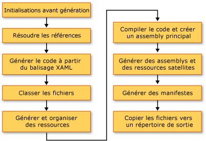

# G&#233;n&#233;ration d&#39;une application WPF (WPF)
Les applications [!INCLUDE[TLA#tla_wpf](../../../../includes/tlasharptla-wpf-md.md)] peuvent être générées comme fichiers exécutables [!INCLUDE[dnprdnshort](../../../../includes/dnprdnshort-md.md)] \(.exe\), comme bibliothèques \(.dll\) ou une combinaison des deux types d'assemblys.  Cette rubrique présente comment générer des applications [!INCLUDE[TLA2#tla_wpf](../../../../includes/tla2sharptla-wpf-md.md)] et décrit les principales étapes du processus de génération.  
  
 [!INCLUDE[autoOutline](../Token/autoOutline_md.md)]  
  
<a name="Building_a_WPF_Application_using_Command_Line"></a>   
## Génération d'une application WPF  
 Une application WPF peut être compilée des façons suivantes :  
  
-   Ligne de commande.  L'application doit contenir uniquement du code \(aucun XAML\) et un fichier de définition d'application.  Pour plus d'informations, consultez [Génération à partir de la ligne de commande avec csc.exe](../../../../ocs/csharp/language-reference/compiler-options/command-line-building-with-csc-exe.md) ou [Génération à partir de la ligne de commande \(Visual Basic\)](../Topic/Building%20from%20the%20Command%20Line%20\(Visual%20Basic\).md).  
  
-   Microsoft Build Engine \(MSBuild\).  Outre le code et les fichiers XAML, l'application doit contenir un fichier projet MSBuild.  Pour plus d'informations, consultez [MSBuild](../Topic/MSBuild1.md).  
  
-   Visual Studio.  Visual Studio est un environnement de développement intégré qui compile les applications WPF à l'aide de MSBuild et comprend un concepteur visuel pour créer l'interface utilisateur.  Pour plus d'informations, consultez [Développement d'applications dans Visual Studio](http://msdn.microsoft.com/fr-fr/97490c1b-a247-41fb-8f2c-bc4c201eff68) et [Concepteur WPF](http://msdn.microsoft.com/fr-fr/c6c65214-8411-4e16-b254-163ed4099c26).  
  
<a name="The_Windows_Presentation_Foundation_Build_Pipeline"></a>   
## Pipeline de génération WPF  
 Lorsqu'un projet [!INCLUDE[TLA2#tla_wpf](../../../../includes/tla2sharptla-wpf-md.md)] est généré, la combinaison de cibles spécifiques à une langue et spécifiques à [!INCLUDE[TLA2#tla_wpf](../../../../includes/tla2sharptla-wpf-md.md)] est appelée.  Le processus d'exécution de ces cibles est appelé le pipeline de génération, et les étapes clés sont représentées par l'illustration suivante.  
  
   
  
<a name="Pre_Build_Initializations"></a>   
### Initialisations avant génération  
 Avant la génération, [!INCLUDE[TLA2#tla_msbuild](../../../../includes/tla2sharptla-msbuild-md.md)] détermine l'emplacement des outils et des bibliothèques importants, y compris les éléments suivants :  
  
-   [!INCLUDE[TLA2#tla_winfx](../../../../includes/tla2sharptla-winfx-md.md)].  
  
-   Les répertoires [!INCLUDE[TLA2#tla_wcsdk](../../../../includes/tla2sharptla-wcsdk-md.md)].  
  
-   L'emplacement d'assemblys de référence [!INCLUDE[TLA2#tla_wpf](../../../../includes/tla2sharptla-wpf-md.md)].  
  
-   La propriété pour les chemins de recherche des assemblys.  
  
 Le premier emplacement où [!INCLUDE[TLA2#tla_msbuild](../../../../includes/tla2sharptla-msbuild-md.md)] recherche les assemblys est le répertoire de l'assembly de référence \(%ProgramFiles%\\Reference Assemblies\\Microsoft\\Framework\\v3.0\\\).  Pendant cette étape, le processus de génération initialise également les diverses propriétés et groupes d'éléments et exécute tout travail de nettoyage requis.  
  
<a name="Resolving_references"></a>   
### Résolution de références  
 Le processus de génération localise et lie les assemblys requis pour générer le projet d'application.  Cette logique est contenue dans la tâche `ResolveAssemblyReference`.  Tous les assemblys déclarés comme `Reference` dans le fichier projet sont fournis à la tâche avec les informations sur les chemins de recherche et les métadonnées sur les assemblys déjà installés sur le système.  La tâche examine les assemblys et utilise les métadonnées de l'assembly installé pour éliminer par filtrage les assemblys [!INCLUDE[TLA2#tla_wpf](../../../../includes/tla2sharptla-wpf-md.md)] principaux qui ne doivent pas apparaître dans les manifestes de sortie.  Cela est fait pour éviter des informations redondantes dans les manifestes ClickOnce.  Par exemple, comme PresentationFramework.dll peut être considéré être représentatif d'une application générée sur et pour le [!INCLUDE[TLA2#tla_wpf](../../../../includes/tla2sharptla-wpf-md.md)] et, qui plus est, comme tous les assemblys [!INCLUDE[TLA2#tla_wpf](../../../../includes/tla2sharptla-wpf-md.md)] existent au même emplacement sur chaque ordinateur où [!INCLUDE[TLA2#tla_winfx](../../../../includes/tla2sharptla-winfx-md.md)] est installé, il n'est pas besoin d'inclure toutes les informations sur tous les assemblys [!INCLUDE[TLA2#tla_winfx](../../../../includes/tla2sharptla-winfx-md.md)] de référence dans les manifestes.  
  
<a name="Markup_Compilation___Pass_1"></a>   
### Compilation de la balise—Passe 1  
 Dans cette étape, les fichiers [!INCLUDE[TLA2#tla_xaml](../../../../includes/tla2sharptla-xaml-md.md)] sont analysés et compilés afin que le runtime ne perde pas de temps à analyser [!INCLUDE[TLA2#tla_xml](../../../../includes/tla2sharptla-xml-md.md)] et à valider des valeurs de propriété.  Le fichier [!INCLUDE[TLA2#tla_xaml](../../../../includes/tla2sharptla-xaml-md.md)] compilé est sous forme de pré\-jetons de sorte que, lors de l'exécution, le chargement devrait être beaucoup plus rapide que le chargement d'un fichier [!INCLUDE[TLA2#tla_xaml](../../../../includes/tla2sharptla-xaml-md.md)].  
  
 Pendant cette étape, les activités suivantes ont lieu pour chaque fichier [!INCLUDE[TLA2#tla_xaml](../../../../includes/tla2sharptla-xaml-md.md)] qui est un élément de génération `Page` :  
  
1.  Le fichier [!INCLUDE[TLA2#tla_xaml](../../../../includes/tla2sharptla-xaml-md.md)] est analysé par le compilateur de balise.  
  
2.  Une représentation compilée est créée pour ce [!INCLUDE[TLA2#tla_xaml](../../../../includes/tla2sharptla-xaml-md.md)] et copiée dans le dossier obj\\Release.  
  
3.  Une représentation CodeDOM d'une nouvelle classe partielle est créée et copiée dans le dossier obj\\Release.  
  
 En outre, un fichier de code spécifique à un langage est généré pour chaque fichier [!INCLUDE[TLA2#tla_xaml](../../../../includes/tla2sharptla-xaml-md.md)]. Par exemple, pour une page Page1.xaml dans un projet [!INCLUDE[TLA2#tla_visualb](../../../../includes/tla2sharptla-visualb-md.md)], un fichier Page1.g.vb est généré ; pour une page Page1.xaml dans un projet [!INCLUDE[TLA2#tla_cshrp](../../../../includes/tla2sharptla-cshrp-md.md)], un fichier Page1.g.cs est généré.  Le ".g" dans le nom de fichier indique que le fichier est du code généré qui a une déclaration de classe partielle pour l'élément de niveau supérieur du fichier de balisage \(tel que `Page` ou `Window`\).  La classe est déclarée avec le modificateur `partial` dans [!INCLUDE[TLA2#tla_cshrp](../../../../includes/tla2sharptla-cshrp-md.md)] \(`Extends` dans [!INCLUDE[TLA2#tla_visualb](../../../../includes/tla2sharptla-visualb-md.md)]\) pour indiquer qu'une autre déclaration existe ailleurs pour la classe, habituellement dans le fichier code\-behind Page1.xaml.cs.  
  
 La classe partielle s'étend de la classe de base appropriée \(telle que <xref:System.Windows.Controls.Page> pour une page\) et implémente l'interface <xref:System.Windows.Markup.IComponentConnector?displayProperty=fullName>.  L'interface <xref:System.Windows.Markup.IComponentConnector> a des méthodes pour initialiser un composant et connecter des noms et des événements sur les éléments dans son contenu.  Par conséquent, le fichier de code généré a une implémentation de méthode comme suit :  
  
```csharp  
public void InitializeComponent() {  
    if (_contentLoaded) {  
        return;  
    }  
    _contentLoaded = true;  
    System.Uri resourceLocater =   
        new System.Uri(  
            "window1.xaml",   
            System.UriKind.RelativeOrAbsolute);  
    System.Windows.Application.LoadComponent(this, resourceLocater);  
}  
```  
  
```vb  
Public Sub InitializeComponent() _  
  
    If _contentLoaded Then  
        Return  
    End If  
  
    _contentLoaded = True  
    Dim resourceLocater As System.Uri = _  
        New System.Uri("mainwindow.xaml", System.UriKind.Relative)  
  
    System.Windows.Application.LoadComponent(Me, resourceLocater)  
  
End Sub  
```  
  
 Par défaut, la compilation de balise s'exécute dans le même <xref:System.AppDomain> que le moteur [!INCLUDE[TLA2#tla_msbuild](../../../../includes/tla2sharptla-msbuild-md.md)].  Cela assure des gains de performance significatifs.  Ce comportement peut être basculé avec la propriété `AlwaysCompileMarkupFilesInSeparateDomain`.  Cela présente l'avantage de décharger tous les assemblys de référence en déchargeant le <xref:System.AppDomain> séparé.  
  
<a name="Pass_2_of_Markup_Compilation"></a>   
### Compilation de la balise—Passe 2  
 Toutes les pages [!INCLUDE[TLA2#tla_xaml](../../../../includes/tla2sharptla-xaml-md.md)] ne sont pas compilées pendant la première passe de la compilation de balisage.  Les fichiers [!INCLUDE[TLA2#tla_xaml](../../../../includes/tla2sharptla-xaml-md.md)] qui ont des références de type définies localement \(références à des types définis ailleurs dans le code d'un même projet\) sont exemptés de compilation à ce moment.  Ceci parce que les types localement définis existent uniquement dans la source et n'ont pas encore été compilés.  Pour déterminer ceci, l'analyseur utilise des heuristiques qui impliquent la recherche d'éléments tels que `x:Name` dans le fichier de balisage.  Lorsqu'une telle instance est trouvée, la compilation de ce fichier de balisage est remise à plus tard jusqu'à ce que les fichiers de code aient été compilés, après quoi la deuxième passe de la compilation de la balise traite ces fichiers.  
  
<a name="File_Classification"></a>   
### Classification des fichiers  
 Le processus de génération organise les fichiers de sortie dans différents groupes de ressources en fonction de l'assembly d'application dans lequel ils seront placés.  Dans une application non localisée type, tous les fichiers de données marqués comme `Resource` sont placés dans l'assembly principal \(fichier exécutable ou bibliothèque\).  Lorsque `UICulture` est défini dans le projet, tous les fichiers [!INCLUDE[TLA2#tla_xaml](../../../../includes/tla2sharptla-xaml-md.md)] compilés et les ressources marquées spécifiquement comme spécifiques à une langue sont placés dans l'assembly de ressource satellite.  En outre, toutes les ressources indépendantes du langage sont placées dans l'assembly principal.  Cette détermination est faite lors de cette étape du processus de génération.  
  
 Les `ApplicationDefinition`, `Page` et les actions de génération `Resource` dans le fichier projet peuvent être augmentés avec les métadonnées `Localizable` \(les valeurs acceptables sont `true` et `false`\), qui déterminent si le fichier est spécifique ou indépendant du langage.  
  
<a name="Core_Compilation"></a>   
### Compilation principale  
 L'étape de compilation principale implique la compilation de fichiers de code.  Cela répond à une logique dans les fichiers cibles Microsoft.CSharp.targets et Microsoft.VisualBasic.targets spécifiques à une langue.  Si les heuristiques ont déterminé qu'un seul passage du compilateur de balisage suffit, l'assembly principal est alors généré.  Toutefois, si un ou plusieurs fichiers [!INCLUDE[TLA2#tla_xaml](../../../../includes/tla2sharptla-xaml-md.md)] dans le projet ont des références à des types définis localement, un fichier .dll temporaire est alors généré afin que les derniers assemblys d'application puissent être créés après la fin de la deuxième passe de compilation de balise.  
  
<a name="Manifest_generation"></a>   
### Génération de manifeste  
 À la fin du processus de génération, après que tous les assemblys d'application et les fichiers de contenu sont prêts, les manifestes [!INCLUDE[TLA2#tla_clickonce](../../../../includes/tla2sharptla-clickonce-md.md)] pour l'application sont générés.  
  
 Le fichier manifeste de déploiement décrit le modèle de déploiement : la version actuelle, le comportement de mise à jour et l'identité d'éditeur avec la signature numérique.  Ce manifeste est prévu pour être créé par les administrateurs qui gèrent le déploiement.  L'extension de fichier est .xbap \(pour les [!INCLUDE[TLA#tla_xbap#plural](../../../../includes/tlasharptla-xbapsharpplural-md.md)]\) et .application pour les applications installées.  La première extension est déterminée par la propriété du projet `HostInBrowser` et, en conséquence, le manifeste identifie l'application comme étant hébergée par le navigateur.  
  
 Le manifeste de l'application \(un fichier .exe.manifest\) décrit les assemblys d'application et les bibliothèques dépendantes et répertorie les autorisations requises par l'application.  Ce fichier est prévu pour être créé par le développeur d'applications.  Pour lancer une application [!INCLUDE[TLA2#tla_clickonce](../../../../includes/tla2sharptla-clickonce-md.md)], un utilisateur ouvre le fichier manifeste de déploiement de l'application.  
  
 Ces fichiers manifeste sont toujours créés pour [!INCLUDE[TLA2#tla_xbap#plural](../../../../includes/tla2sharptla-xbapsharpplural-md.md)].  Pour les applications installées, ils ne sont pas créés à moins que la propriété `GenerateManifests` ne soit spécifiée dans le fichier projet avec la valeur `true`.  
  
 Les applications [!INCLUDE[TLA2#tla_xbap#plural](../../../../includes/tla2sharptla-xbapsharpplural-md.md)] obtiennent deux autorisations supplémentaires en plus de celles assignées aux applications de zone Internet typiques : <xref:System.Security.Permissions.WebBrowserPermission> et <xref:System.Security.Permissions.MediaPermission>.  Le système de génération [!INCLUDE[TLA2#tla_wpf](../../../../includes/tla2sharptla-wpf-md.md)] déclare ces autorisations dans le manifeste de l'application.  
  
<a name="Incremental_Build_Support"></a>   
## Support de génération incrémentiel  
 Le système de génération [!INCLUDE[TLA2#tla_wpf](../../../../includes/tla2sharptla-wpf-md.md)] fournit le support pour les générations incrémentielles.  Il est assez intelligent pour détecter les modifications apportées à la balise ou au code, et il compile uniquement les artefacts affectés par la modification.  Le mécanisme de génération incrémentiel utilise les fichiers suivants :  
  
-   Un fichier $ \(*NomAssembly*\)\_MarkupCompiler.Cache pour gérer l'état du compilateur actuel.  
  
-   Un fichier $ \(*NomAssembly*\)\_MarkupCompiler.lref pour mettre en cache les fichiers [!INCLUDE[TLA2#tla_xaml](../../../../includes/tla2sharptla-xaml-md.md)] avec les références aux types définis localement.  
  
 Les éléments suivants sont un jeu des règles gouvernant la génération incrémentielle :  
  
-   Le fichier est la plus petite unité au niveau de laquelle le système de génération détecte une modification.  Ainsi, pour un fichier de code, le système de génération ne peut pas déterminer si un type a été modifié ou si du code a été ajouté.  Le même raisonnement s'applique aux fichiers projet.  
  
-   Le mécanisme de génération incrémentiel doit être informé qu'une page [!INCLUDE[TLA2#tla_xaml](../../../../includes/tla2sharptla-xaml-md.md)] définit une classe ou utilise d'autres classes.  
  
-   Si des entrées `Reference` sont modifiées, vous devez recompiler toutes les pages.  
  
-   Si un fichier de code est modifié, recompiler toutes les pages avec des références définies localement.  
  
-   Si un fichier [!INCLUDE[TLA2#tla_xaml](../../../../includes/tla2sharptla-xaml-md.md)] est modifié :  
  
    -   Si [!INCLUDE[TLA2#tla_xaml](../../../../includes/tla2sharptla-xaml-md.md)] est déclaré comme `Page` dans le projet : si le [!INCLUDE[TLA2#tla_xaml](../../../../includes/tla2sharptla-xaml-md.md)] ne contient pas de références de type définies localement, recompiler ce [!INCLUDE[TLA2#tla_xaml](../../../../includes/tla2sharptla-xaml-md.md)] plus toutes les pages [!INCLUDE[TLA2#tla_xaml](../../../../includes/tla2sharptla-xaml-md.md)] avec des références locales ; si le [!INCLUDE[TLA2#tla_xaml](../../../../includes/tla2sharptla-xaml-md.md)] contient des références locales, recompiler toutes les pages [!INCLUDE[TLA2#tla_xaml](../../../../includes/tla2sharptla-xaml-md.md)] avec les références locales.  
  
    -   Si [!INCLUDE[TLA2#tla_xaml](../../../../includes/tla2sharptla-xaml-md.md)] est déclaré comme `ApplicationDefinition` dans le projet : recompiler toutes les pages [!INCLUDE[TLA2#tla_xaml](../../../../includes/tla2sharptla-xaml-md.md)] \(raison : chaque [!INCLUDE[TLA2#tla_xaml](../../../../includes/tla2sharptla-xaml-md.md)] fait référence à un type <xref:System.Windows.Application> qui a pu changer\).  
  
-   Si le fichier projet déclare un fichier de code comme définition d'application au lieu d'un fichier [!INCLUDE[TLA2#tla_xaml](../../../../includes/tla2sharptla-xaml-md.md)] :  
  
    -   Vérifiez si la valeur `ApplicationClassName` dans le fichier projet a changé \(y a\-t\-il un nouveau type d'application ?\).  Si c'est le cas, recompiler toute l'application.  
  
    -   Sinon, recompiler toutes les pages [!INCLUDE[TLA2#tla_xaml](../../../../includes/tla2sharptla-xaml-md.md)] avec des références locales.  
  
-   Si un fichier projet change : appliquer toutes les règles précédentes et voir ce qui doit être recompilé.  Les modifications apportées aux propriétés suivantes entraînent une recompilation complète : `AssemblyName`, `IntermediateOutputPath`, `RootNamespace` et `HostInBrowser`.  
  
 Les scénarios de recompilation suivants sont possibles :  
  
-   Toute l'application est recompilée.  
  
-   Seuls les fichiers [!INCLUDE[TLA2#tla_xaml](../../../../includes/tla2sharptla-xaml-md.md)] qui contiennent des références de type définies localement sont recompilés.  
  
-   Rien n'est recompilé \(si rien dans le projet n'a changé\).  
  
## Voir aussi  
 [Déploiement d'une application WPF](../../../../docs/framework/wpf/app-development/deploying-a-wpf-application-wpf.md)   
 [Référence MSBuild \- WPF](../Topic/WPF%20MSBuild%20Reference.md)   
 [URI à en\-tête pack dans WPF](../../../../docs/framework/wpf/app-development/pack-uris-in-wpf.md)   
 [Fichiers de ressources, de contenu et de données d'une application WPF](../../../../docs/framework/wpf/app-development/wpf-application-resource-content-and-data-files.md)