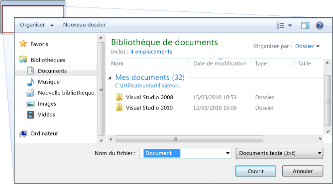
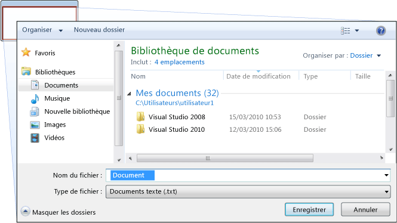
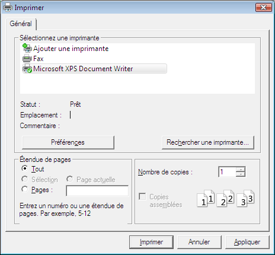
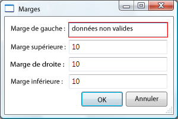
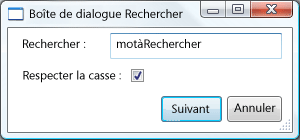

# Vue d&#39;ensemble des bo&#238;tes de dialogue
Applications autonomes possèdent en général une fenêtre principale qui affiche les données principales sur lesquelles l’application fonctionne et qui expose les fonctionnalités pour traiter ces données via [!INCLUDE[TLA#tla_ui](../../../../includes/tlasharptla-ui-md.md)] mécanismes tels que les barres de menus, barres d’outils et barres d’état. Une application non triviale peut afficher également des fenêtres supplémentaires pour effectuer les opérations suivantes :  
  
-   Afficher des informations spécifiques aux utilisateurs.  
  
-   Regrouper des informations sur les utilisateurs.  
  
-   Afficher et rassembler des informations.  
  
 Ces types de fenêtres sont appelés *boîtes de dialogue*, et il existe deux types : modales et non modales.  
  
 A *modale* boîte de dialogue est affichée par une fonction lorsque la fonction a besoin de données supplémentaires à partir d’un utilisateur pour continuer. Étant donné que la fonction dépend de la boîte de dialogue modale pour rassembler des données, la boîte de dialogue modale empêche également un utilisateur d’activer d’autres fenêtres de l’application pendant qu’elle reste ouverte. Dans la plupart des cas, une boîte de dialogue modale permet à un utilisateur de signaler lorsqu’ils ont terminé avec la boîte de dialogue modale en appuyant sur l’un **OK** ou **Annuler** bouton. En appuyant sur la **OK** bouton indique qu’un utilisateur a entré des données et souhaite que la fonction continue le traitement de ces données. En appuyant sur la **Annuler** bouton indique qu’un utilisateur veut arrêter complètement l’exécution de la fonction. Les exemples les plus courants de boîtes de dialogue modales sont affichées pour les ouvrir, enregistrer et imprimer des données.  
  
 A *non modales* boîte de dialogue, en revanche, n’empêche pas un utilisateur d’activer d’autres fenêtres lorsqu’il est ouvert. Par exemple, si un utilisateur souhaite rechercher des occurrences d’un mot particulier dans un document, une fenêtre principale ouvrira souvent une boîte de dialogue pour demander à l’utilisateur un mot qu’ils recherchent. Puisque rechercher un mot n’empêche pas un utilisateur de modifier le document, toutefois, la boîte de dialogue n’a pas besoin de la boîte de dialogue. Une boîte de dialogue non modale fournit au moins un **fermer** bouton pour fermer la boîte de dialogue et peut fournir des boutons supplémentaires pour exécuter des fonctions spécifiques, comme un **suivant** bouton pour rechercher le mot suivant qui correspond aux critères de recherche d’une recherche de texte.  
  
 [!INCLUDE[TLA#tla_wpf](../../../../includes/tlasharptla-wpf-md.md)]vous permet de créer plusieurs types de boîtes de dialogue, y compris les messages, les boîtes de dialogue courantes et boîtes de dialogue personnalisées. Cette rubrique présente chacune et le [boîte de dialogue, exemple](http://go.microsoft.com/fwlink/?LinkID=159984) fournit des exemples correspondants.  
  
 [!INCLUDE[autoOutline](../Token/autoOutline_md.md)]  
  
   
## Boîtes de message  
 A *boîte de message* est une boîte de dialogue qui peut être utilisée pour afficher des informations textuelles et permettre aux utilisateurs de prendre des décisions avec des boutons. L’illustration suivante montre une boîte de message qui affiche des informations textuelles, pose une question et fournit trois boutons pour répondre à la question à l’utilisateur.  
  
   
  
 Pour créer une boîte de message, vous utilisez la <xref:System.Windows.MessageBox> classe.                  <xref:System.Windows.MessageBox> vous permet de configurer le texte du message, un titre, une icône et un boutons, à l’aide de code comme suit.  
  
 [!code-csharp[DialogBoxesOverviewSnippets#MsgBoxConfigureCODEBEHIND](../../../../samples/snippets/csharp/VS_Snippets_Wpf/DialogBoxesOverviewSnippets/CSharp/Window1.xaml.cs#msgboxconfigurecodebehind)]
 [!code-vb[DialogBoxesOverviewSnippets#MsgBoxConfigureCODEBEHIND](../../../../samples/snippets/visualbasic/VS_Snippets_Wpf/DialogBoxesOverviewSnippets/VisualBasic/window1.xaml.vb#msgboxconfigurecodebehind)]  
  
 Pour afficher une boîte de message, vous appelez le `static` <xref:System.Windows.MessageBox.Show%2A> méthode, comme illustré dans le code suivant.  
  
 [!code-csharp[DialogBoxesOverviewSnippets#MsgBoxShowCODEBEHIND](../../../../samples/snippets/csharp/VS_Snippets_Wpf/DialogBoxesOverviewSnippets/CSharp/Window1.xaml.cs#msgboxshowcodebehind)]
 [!code-vb[DialogBoxesOverviewSnippets#MsgBoxShowCODEBEHIND](../../../../samples/snippets/visualbasic/VS_Snippets_Wpf/DialogBoxesOverviewSnippets/VisualBasic/window1.xaml.vb#msgboxshowcodebehind)]  
  
 Lorsque le code qui affiche une boîte de message doit détecter et traiter la décision de l’utilisateur (le bouton utilisé), le code peut vérifier le résultat du message, comme indiqué dans le code suivant.  
  
 [!code-csharp[DialogBoxesOverviewSnippets#MsgBoxShowAndResultCODEBEHIND1](../../../../samples/snippets/csharp/VS_Snippets_Wpf/DialogBoxesOverviewSnippets/CSharp/Window1.xaml.cs#msgboxshowandresultcodebehind1)]
 [!code-vb[DialogBoxesOverviewSnippets#MsgBoxShowAndResultCODEBEHIND1](../../../../samples/snippets/visualbasic/VS_Snippets_Wpf/DialogBoxesOverviewSnippets/VisualBasic/window1.xaml.vb#msgboxshowandresultcodebehind1)]  
  
 Pour plus d’informations sur l’utilisation des boîtes de message, consultez <xref:System.Windows.MessageBox>, [MessageBox, exemple](http://go.microsoft.com/fwlink/?LinkID=160023), et [boîte de dialogue, exemple](http://go.microsoft.com/fwlink/?LinkID=159984).  
  
 Bien que <xref:System.Windows.MessageBox> peut offrir une expérience utilisateur de boîte dialogue simple, l’avantage de l’utilisation de <xref:System.Windows.MessageBox> qui est le seul type de fenêtre qui peut être affiché par les applications qui s’exécutent dans un sandbox de sécurité de confiance partielle (consultez [sécurité](../../../../docs/framework/wpf/security-wpf.md)), tel que [!INCLUDE[TLA#tla_xbap#plural](../../../../includes/tlasharptla-xbapsharpplural-md.md)].  
  
 La plupart des boîtes de dialogue afficheront et collecter des données plus complexes que le résultat d’un message, y compris le texte, sélection (cases à cocher), la sélection mutuellement exclusive (boutons radio), liste de sélection (zones de liste, zones de liste modifiable, zones de liste déroulante). Dans ce cas, [!INCLUDE[TLA#tla_wpf](../../../../includes/tlasharptla-wpf-md.md)] fournit plusieurs boîtes de dialogue courantes et vous permet de créer vos propres boîtes de dialogue, bien que l’utilisation d’un est limitée aux applications s’exécutant avec une confiance totale.  
  
   
## Boîtes de dialogue communes  
 [!INCLUDE[TLA#tla_mswin](../../../../includes/tlasharptla-mswin-md.md)]implémente diverses boîtes de dialogue réutilisables qui sont communes à toutes les applications, y compris les boîtes de dialogue pour ouvrir, enregistrer des fichiers et d’impression. Étant donné que ces boîtes de dialogue sont implémentées par le système d’exploitation, ils peuvent être partagés entre toutes les applications qui s’exécutent sur le système d’exploitation, ce qui permet à utilisateur d’expérience cohérente ; Lorsque les utilisateurs sont habitués à l’utilisation d’une boîte de dialogue fournie par le système d’exploitation dans une application, ils ne doivent apprendre à utiliser cette boîte de dialogue dans d’autres applications. Étant donné que ces boîtes de dialogue sont disponibles pour toutes les applications et car ils permettent de fournir une expérience utilisateur cohérente, ils sont appelés *boîtes de dialogue communes*.  
  
 [!INCLUDE[TLA#tla_wpf](../../../../includes/tlasharptla-wpf-md.md)]encapsule le fichier ouvert, enregistrer le fichier et les boîtes de dialogue communes d’impression et les expose comme des classes managées à utiliser dans des applications autonomes. Cette rubrique fournit une brève présentation de chacun.  
  
   
### Boîte de dialogue Ouvrir un fichier  
 La boîte de dialogue Ouvrir le fichier indiquée dans l’illustration suivante, est utilisée par les fonctionnalités d’ouverture de fichier pour récupérer le nom d’un fichier à ouvrir.  
  
   
  
 La boîte de dialogue Ouvrir un fichier est implémentée en tant que la <xref:Microsoft.Win32.OpenFileDialog> classe et se trouve dans le <xref:Microsoft.Win32> espace de noms. Le code suivant montre comment créer, configurer et afficher une et comment traiter le résultat.  
  
 [!code-csharp[DialogBoxesOverviewSnippets#OpenFileDialogBoxCODEBEHIND](../../../../samples/snippets/csharp/VS_Snippets_Wpf/DialogBoxesOverviewSnippets/CSharp/Window1.xaml.cs#openfiledialogboxcodebehind)]
 [!code-vb[DialogBoxesOverviewSnippets#OpenFileDialogBoxCODEBEHIND](../../../../samples/snippets/visualbasic/VS_Snippets_Wpf/DialogBoxesOverviewSnippets/VisualBasic/window1.xaml.vb#openfiledialogboxcodebehind)]  
  
 Pour plus d’informations sur la boîte de dialogue Ouvrir un fichier, consultez <xref:Microsoft.Win32.OpenFileDialog?displayProperty=fullName>.  
  
> [!NOTE]
>  <xref:Microsoft.Win32.OpenFileDialog> peut servir à récupérer en toute sécurité des noms de fichiers par les applications qui s’exécutent avec une confiance partielle (consultez [sécurité](../../../../docs/framework/wpf/security-wpf.md)).  
  
   
### Boîte de dialogue Fichier Enregistrer  
 L’enregistrement boîte de dialogue de fichier indiqué dans l’illustration suivante, est utilisée par la fonctionnalité d’enregistrement de fichier pour récupérer le nom d’un fichier à enregistrer.  
  
   
  
 Enregistrer la boîte de dialogue de fichier courantes est implémenté en tant que le <xref:Microsoft.Win32.SaveFileDialog> de classe et se trouve dans le <xref:Microsoft.Win32> espace de noms. Le code suivant montre comment créer, configurer et afficher une et comment traiter le résultat.  
  
 [!code-csharp[DialogBoxesOverviewSnippets#SaveFileDialogBoxCODEBEHIND](../../../../samples/snippets/csharp/VS_Snippets_Wpf/DialogBoxesOverviewSnippets/CSharp/Window1.xaml.cs#savefiledialogboxcodebehind)]
 [!code-vb[DialogBoxesOverviewSnippets#SaveFileDialogBoxCODEBEHIND](../../../../samples/snippets/visualbasic/VS_Snippets_Wpf/DialogBoxesOverviewSnippets/VisualBasic/window1.xaml.vb#savefiledialogboxcodebehind)]  
  
 Pour plus d’informations sur l’enregistrement de fichier boîte de dialogue, consultez <xref:Microsoft.Win32.SaveFileDialog?displayProperty=fullName>.  
  
   
### Boîte de dialogue Imprimer  
 La boîte de dialogue d’impression, illustrée dans la figure ci-dessous, est utilisée par les fonctionnalités d’impression choisir et configurer l’imprimante sur laquelle un utilisateur souhaite imprimer les données.  
  
   
  
 La boîte de dialogue d’impression est implémentée en tant que la <xref:System.Windows.Controls.PrintDialog> de classe et se trouve dans le <xref:System.Windows.Controls> espace de noms. Le code suivant montre comment créer, configurer et afficher une.  
  
 [!code-csharp[DialogBoxesOverviewSnippets#PrintDialogBoxCODEBEHIND](../../../../samples/snippets/csharp/VS_Snippets_Wpf/DialogBoxesOverviewSnippets/CSharp/Window1.xaml.cs#printdialogboxcodebehind)]
 [!code-vb[DialogBoxesOverviewSnippets#PrintDialogBoxCODEBEHIND](../../../../samples/snippets/visualbasic/VS_Snippets_Wpf/DialogBoxesOverviewSnippets/VisualBasic/window1.xaml.vb#printdialogboxcodebehind)]  
  
 Pour plus d’informations sur la boîte de dialogue d’impression, consultez <xref:System.Windows.Controls.PrintDialog?displayProperty=fullName>. Pour une présentation détaillée de l’impression dans [!INCLUDE[TLA2#tla_wpf](../../../../includes/tla2sharptla-wpf-md.md)], consultez [vue d’ensemble de l’impression](../../../../docs/framework/wpf/advanced/printing-overview.md).  
  
   
## Boîtes de dialogue personnalisées  
 Bien que les boîtes de dialogue communes sont utiles et doivent être utilisées si possible, ils ne gèrent pas les exigences de boîtes de dialogue spécifiques au domaine. Dans ce cas, vous devez créer vos propres boîtes de dialogue. Comme nous allons le voir, une boîte de dialogue est une fenêtre avec des comportements spéciaux.                  <xref:System.Windows.Window> implémente ces comportements et, par conséquent, vous utilisez <xref:System.Windows.Window> pour créer des boîtes de dialogue modales et non modales personnalisée.  
  
   
### Création d’une boîte de dialogue modale  
 Cette rubrique montre comment utiliser <xref:System.Windows.Window> pour créer une implémentation de boîte de dialogue modale classique, à l’aide de la `Margins` boîte de dialogue par exemple (voir [boîte de dialogue, exemple](http://go.microsoft.com/fwlink/?LinkID=159984)). Le `Margins` boîte de dialogue est illustrée dans la figure suivante.  
  
   
  
#### Configuration d’une boîte de dialogue modale  
 L’interface utilisateur pour une boîte de dialogue classique inclut les éléments suivants :  
  
-   Les différents contrôles requis pour rassembler les données souhaitées.  
  
-   Affichant un **OK** bouton que les utilisateurs cliquez ici pour fermer la boîte de dialogue, retour à la fonction et poursuivre le traitement.  
  
-   Affichant un **Annuler** bouton utilisateurs cliquent pour fermer la boîte de dialogue et arrêter la traitement de la fonction.  
  
-   Affichant un **fermer** dans la barre de titre.  
  
-   Affichage d’une icône.  
  
-   Showing                                          **Minimize**,                                          **Maximize**, and                                          **Restore** buttons.  
  
-   Affichant un **système** menu pour réduire, agrandir, restaurer et fermer la boîte de dialogue.  
  
-   Ouverture au-dessus et dans le centre de la fenêtre qui a ouvert la boîte de dialogue.  
  
-   Boîtes de dialogue doivent être redimensionnables lorsque cela est possible, pour empêcher la boîte de dialogue d’être trop petite et pour fournir à l’utilisateur avec une taille par défaut utile, vous devez donc définir la valeur par défaut et un minimum dimensions respectivement.  
  
-   Appuyez sur la touche ÉCHAP doit être configuré comme un raccourci clavier qui provoque le **Annuler** bouton. Cela s’effectue en définissant le <xref:System.Windows.Controls.Button.IsCancel%2A> propriété de la **Annuler** bouton à `true`.  
  
-   Appuyez sur la touche entrée (ou retour) doit être configuré comme un raccourci clavier qui provoque le **OK** bouton. Cela s’effectue en définissant le <xref:System.Windows.Controls.Button.IsDefault%2A> propriété de la **OK** bouton `true`.  
  
 Le code suivant illustre cette configuration.  
  
 [!code-xml[DialogBoxSample#MarginsDialogBoxMainBitsMARKUP1](../../../../samples/snippets/csharp/VS_Snippets_Wpf/DialogBoxSample/CSharp/MarginsDialogBox.xaml#marginsdialogboxmainbitsmarkup1)]  
[!code-xml[DialogBoxSample#MarginsDialogBoxMainBitsMARKUP2](../../../../samples/snippets/csharp/VS_Snippets_Wpf/DialogBoxSample/CSharp/MarginsDialogBox.xaml#marginsdialogboxmainbitsmarkup2)]  
  
 [!code-csharp[DialogBoxSample#MarginsDialogBoxMainBitsCODEBEHIND1](../../../../samples/snippets/csharp/VS_Snippets_Wpf/DialogBoxSample/CSharp/MarginsDialogBox.xaml.cs#marginsdialogboxmainbitscodebehind1)]
 [!code-vb[DialogBoxSample#MarginsDialogBoxMainBitsCODEBEHIND1](../../../../samples/snippets/visualbasic/VS_Snippets_Wpf/DialogBoxSample/VisualBasic/MarginsDialogBox.xaml.vb#marginsdialogboxmainbitscodebehind1)]  
[!code-csharp[DialogBoxSample#MarginsDialogBoxMainBitsCODEBEHIND2](../../../../samples/snippets/csharp/VS_Snippets_Wpf/DialogBoxSample/CSharp/MarginsDialogBox.xaml.cs#marginsdialogboxmainbitscodebehind2)]
[!code-vb[DialogBoxSample#MarginsDialogBoxMainBitsCODEBEHIND2](../../../../samples/snippets/visualbasic/VS_Snippets_Wpf/DialogBoxSample/VisualBasic/MarginsDialogBox.xaml.vb#marginsdialogboxmainbitscodebehind2)]  
  
 L’expérience utilisateur pour une boîte de dialogue s’étend également dans la barre de menus de la fenêtre qui ouvre la boîte de dialogue. Lorsqu’un élément de menu exécute une fonction qui requiert une interaction utilisateur via une boîte de dialogue avant la poursuite de la fonction, l’élément de menu pour la fonction aura un bouton de sélection dans son en-tête, comme indiqué ici.  
  
 [!code-xml[DialogBoxSample#MainWindowMarginsDialogBoxMenuItemMARKUP1](../../../../samples/snippets/csharp/VS_Snippets_Wpf/DialogBoxSample/CSharp/MainWindow.xaml#mainwindowmarginsdialogboxmenuitemmarkup1)]  
[!code-xml[DialogBoxSample#MainWindowMarginsDialogBoxMenuItemMARKUP2](../../../../samples/snippets/csharp/VS_Snippets_Wpf/DialogBoxSample/CSharp/MainWindow.xaml#mainwindowmarginsdialogboxmenuitemmarkup2)]  
  
 Lorsqu’un élément de menu exécute une fonction qui affiche une boîte de dialogue qui ne nécessite pas d’intervention de l’utilisateur, par exemple une boîte de dialogue About, points de suspension n’est pas nécessaire.  
  
#### Ouverture d’une boîte de dialogue modale  
 Une boîte de dialogue apparaît généralement suite à un utilisateur sélectionne un élément de menu pour exécuter une fonction spécifique à un domaine, par exemple définir les marges d’un document dans un traitement de texte. Afficher une fenêtre en tant qu’une boîte de dialogue est similaire à l’affichage d’une fenêtre normale, bien que cela nécessite une configuration spécifique à la boîte de dialogue supplémentaires. L’ensemble du processus de l’instanciation, configuration et ouvrir une boîte de dialogue sont illustré dans le code suivant.  
  
 [!code-csharp[DialogBoxSample#OpenMarginsDialogCODEBEHIND1](../../../../samples/snippets/csharp/VS_Snippets_Wpf/DialogBoxSample/CSharp/MainWindow.xaml.cs#openmarginsdialogcodebehind1)]
 [!code-vb[DialogBoxSample#OpenMarginsDialogCODEBEHIND1](../../../../samples/snippets/visualbasic/VS_Snippets_Wpf/DialogBoxSample/VisualBasic/MainWindow.xaml.vb#openmarginsdialogcodebehind1)]  
[!code-csharp[DialogBoxSample#OpenMarginsDialogCODEBEHIND2](../../../../samples/snippets/csharp/VS_Snippets_Wpf/DialogBoxSample/CSharp/MainWindow.xaml.cs#openmarginsdialogcodebehind2)]
[!code-vb[DialogBoxSample#OpenMarginsDialogCODEBEHIND2](../../../../samples/snippets/visualbasic/VS_Snippets_Wpf/DialogBoxSample/VisualBasic/MainWindow.xaml.vb#openmarginsdialogcodebehind2)]  
[!code-csharp[DialogBoxSample#OpenMarginsDialogCODEBEHIND3](../../../../samples/snippets/csharp/VS_Snippets_Wpf/DialogBoxSample/CSharp/MainWindow.xaml.cs#openmarginsdialogcodebehind3)]
[!code-vb[DialogBoxSample#OpenMarginsDialogCODEBEHIND3](../../../../samples/snippets/visualbasic/VS_Snippets_Wpf/DialogBoxSample/VisualBasic/MainWindow.xaml.vb#openmarginsdialogcodebehind3)]  
[!code-csharp[DialogBoxSample#OpenMarginsDialogCODEBEHIND4](../../../../samples/snippets/csharp/VS_Snippets_Wpf/DialogBoxSample/CSharp/MainWindow.xaml.cs#openmarginsdialogcodebehind4)]
[!code-vb[DialogBoxSample#OpenMarginsDialogCODEBEHIND4](../../../../samples/snippets/visualbasic/VS_Snippets_Wpf/DialogBoxSample/VisualBasic/MainWindow.xaml.vb#openmarginsdialogcodebehind4)]  
  
 Ici, le code passe les informations par défaut (les marges actuelles) à la boîte de dialogue. Il définit également la <xref:System.Windows.Window.Owner%2A?displayProperty=fullName> propriété avec une référence à la fenêtre qui affiche la boîte de dialogue. En général, vous devez toujours définir le propriétaire d’une boîte de dialogue pour fournir des comportements liés à l’état de fenêtre qui sont communes à toutes les boîtes de dialogue (voir [WPF Windows Overview](../../../../docs/framework/wpf/app-development/wpf-windows-overview.md) pour plus d’informations).  
  
> [!NOTE]
>  Vous devez définir un propriétaire pour prendre en charge [!INCLUDE[TLA#tla_ui](../../../../includes/tlasharptla-ui-md.md)] automation pour les boîtes de dialogue (voir [UI Automation Overview](../../../../docs/framework/ui-automation/ui-automation-overview.md)).  
  
 Après avoir configuré la boîte de dialogue, il est affiché sous forme modale en appelant le <xref:System.Windows.Window.ShowDialog%2A> méthode.  
  
#### Validation des données fournies par l’utilisateur  
 Lorsqu’une boîte de dialogue est ouverte et que l’utilisateur fournit les données requises, une boîte de dialogue est chargée de s’assurer que les données fournies sont valides pour les raisons suivantes :  
  
-   Du point de vue de la sécurité, toutes les entrées doivent être validées.  
  
-   Du point de vue spécifique à un domaine, des données erronées empêche la validation des données le traitement par le code, ce qui pourrait éventuellement lever des exceptions.  
  
-   Du point de vue de l’expérience utilisateur, une boîte de dialogue peut aider les utilisateurs en les affichant les données qu’ils ont entré ne sont pas valides.  
  
-   À partir d’un point de vue performances, validation des données dans une application multicouche peut réduire le nombre d’allers-retours entre le client et les niveaux d’application, en particulier lorsque l’application est composée de services Web ou de bases de données serveur.  
  
 Pour valider un contrôle dépendant dans [!INCLUDE[TLA2#tla_wpf](../../../../includes/tla2sharptla-wpf-md.md)], vous devez définir une règle de validation et l’associer à la liaison. Une règle de validation est une classe personnalisée qui dérive de <xref:System.Windows.Controls.ValidationRule>. L’exemple suivant montre une règle de validation, `MarginValidationRule`, qui vérifie qu’une valeur liée est un <xref:System.Double> et se trouve dans une plage spécifiée.  
  
 [!code-csharp[DialogBoxSample#MarginValidationRuleCODE](../../../../samples/snippets/csharp/VS_Snippets_Wpf/DialogBoxSample/CSharp/MarginValidationRule.cs#marginvalidationrulecode)]
 [!code-vb[DialogBoxSample#MarginValidationRuleCODE](../../../../samples/snippets/visualbasic/VS_Snippets_Wpf/DialogBoxSample/VisualBasic/MarginValidationRule.vb#marginvalidationrulecode)]  
  
 Dans ce code, la logique de validation d’une règle de validation est implémentée en substituant la <xref:System.Windows.Controls.ValidationRule.Validate%2A> méthode, qui valide les données et retourne une fonction <xref:System.Windows.Controls.ValidationResult>.  
  
 Pour associer la règle de validation du contrôle lié, vous utilisez le balisage suivant.  
  
 [!code-xml[DialogBoxSample#MarginsValidationMARKUP1](../../../../samples/snippets/csharp/VS_Snippets_Wpf/DialogBoxSample/CSharp/MarginsDialogBox.xaml#marginsvalidationmarkup1)]  
[!code-xml[DialogBoxSample#MarginsValidationMARKUP2](../../../../samples/snippets/csharp/VS_Snippets_Wpf/DialogBoxSample/CSharp/MarginsDialogBox.xaml#marginsvalidationmarkup2)]  
[!code-xml[DialogBoxSample#MarginsValidationMARKUP3](../../../../samples/snippets/csharp/VS_Snippets_Wpf/DialogBoxSample/CSharp/MarginsDialogBox.xaml#marginsvalidationmarkup3)]  
  
 Une fois que la règle de validation est associée, [!INCLUDE[TLA2#tla_wpf](../../../../includes/tla2sharptla-wpf-md.md)] appliquera automatiquement lorsque les données entrées dans le contrôle dépendant. Lorsqu’un contrôle contient des données non valides, [!INCLUDE[TLA2#tla_wpf](../../../../includes/tla2sharptla-wpf-md.md)] affichera une bordure rouge autour du contrôle non valide, comme illustré dans la figure suivante.  
  
   
  
 [!INCLUDE[TLA2#tla_wpf](../../../../includes/tla2sharptla-wpf-md.md)]n’empêche pas un utilisateur au contrôle non valide jusqu'à ce qu’ils ont entré des données valides. Ceci est un bon comportement pour une boîte de dialogue. un utilisateur doit pouvoir naviguer librement entre les contrôles dans une boîte de dialogue données sont valides ou non. Toutefois, cela signifie un utilisateur peut entrer des données non valides, puis appuyez sur la **OK** bouton. Pour cette raison, votre code doit également valider tous les contrôles dans une boîte de dialogue lors du **OK** cliqué en gérant la <xref:System.Windows.Controls.Primitives.ButtonBase.Click> événement.  
  
 [!code-csharp[DialogBoxSample#MarginsDialogBoxValidationCODEBEHIND1](../../../../samples/snippets/csharp/VS_Snippets_Wpf/DialogBoxSample/CSharp/MarginsDialogBox.xaml.cs#marginsdialogboxvalidationcodebehind1)]
 [!code-vb[DialogBoxSample#MarginsDialogBoxValidationCODEBEHIND1](../../../../samples/snippets/visualbasic/VS_Snippets_Wpf/DialogBoxSample/VisualBasic/MarginsDialogBox.xaml.vb#marginsdialogboxvalidationcodebehind1)]  
[!code-csharp[DialogBoxSample#MarginsDialogBoxValidationCODEBEHIND2](../../../../samples/snippets/csharp/VS_Snippets_Wpf/DialogBoxSample/CSharp/MarginsDialogBox.xaml.cs#marginsdialogboxvalidationcodebehind2)]
[!code-vb[DialogBoxSample#MarginsDialogBoxValidationCODEBEHIND2](../../../../samples/snippets/visualbasic/VS_Snippets_Wpf/DialogBoxSample/VisualBasic/MarginsDialogBox.xaml.vb#marginsdialogboxvalidationcodebehind2)]  
[!code-csharp[DialogBoxSample#MarginsDialogBoxValidationCODEBEHIND3](../../../../samples/snippets/csharp/VS_Snippets_Wpf/DialogBoxSample/CSharp/MarginsDialogBox.xaml.cs#marginsdialogboxvalidationcodebehind3)]
[!code-vb[DialogBoxSample#MarginsDialogBoxValidationCODEBEHIND3](../../../../samples/snippets/visualbasic/VS_Snippets_Wpf/DialogBoxSample/VisualBasic/MarginsDialogBox.xaml.vb#marginsdialogboxvalidationcodebehind3)]  
  
 Ce code énumère tous les objets de dépendance sur une fenêtre et, si une est non valide (tel que retourné par <xref:System.Windows.Controls.Validation.GetHasError%2A>, le contrôle non valide Obtient le focus, le `IsValid` méthode retourne `false`, et la fenêtre est considéré comme non valide.  
  
 Une fois qu’une boîte de dialogue est valide, il peut en toute sécurité le fermer et le renvoyer. Dans le cadre du processus de retour, elle doit retourner un résultat à la fonction appelante.  
  
#### Définir le résultat de la boîte de dialogue modale  
 Ouverture d’une boîte de dialogue à l’aide de <xref:System.Windows.Window.ShowDialog%2A> est fondamentalement à appeler une méthode : le code qui a ouvert la boîte de dialogue à l’aide de <xref:System.Windows.Window.ShowDialog%2A> attend <xref:System.Windows.Window.ShowDialog%2A> retourne. Lors de la <xref:System.Windows.Window.ShowDialog%2A> retourne, le code qui l’a appelé doit décider s’il faut continuer ou arrêter le traitement, selon si l’utilisateur a appuyé sur le **OK** bouton ou **Annuler** bouton. Pour faciliter cette décision, la boîte de dialogue doit renvoyer le choix de l’utilisateur comme un <xref:System.Boolean> valeur retournée à partir de la <xref:System.Windows.Window.ShowDialog%2A> (méthode).  
  
 Lors de la **OK** bouton est cliqué, <xref:System.Windows.Window.ShowDialog%2A> doit retourner `true`. Cela s’effectue en définissant le <xref:System.Windows.Window.DialogResult%2A> boîte de propriété de la boîte de dialogue lorsque le **OK** bouton.  
  
 [!code-csharp[DialogBoxSample#MarginsDialogBoxOKResultSetCODEBEHIND1](../../../../samples/snippets/csharp/VS_Snippets_Wpf/DialogBoxSample/CSharp/MarginsDialogBox.xaml.cs#marginsdialogboxokresultsetcodebehind1)]
 [!code-vb[DialogBoxSample#MarginsDialogBoxOKResultSetCODEBEHIND1](../../../../samples/snippets/visualbasic/VS_Snippets_Wpf/DialogBoxSample/VisualBasic/MarginsDialogBox.xaml.vb#marginsdialogboxokresultsetcodebehind1)]  
[!code-csharp[DialogBoxSample#MarginsDialogBoxOKResultSetCODEBEHIND2](../../../../samples/snippets/csharp/VS_Snippets_Wpf/DialogBoxSample/CSharp/MarginsDialogBox.xaml.cs#marginsdialogboxokresultsetcodebehind2)]
[!code-vb[DialogBoxSample#MarginsDialogBoxOKResultSetCODEBEHIND2](../../../../samples/snippets/visualbasic/VS_Snippets_Wpf/DialogBoxSample/VisualBasic/MarginsDialogBox.xaml.vb#marginsdialogboxokresultsetcodebehind2)]  
[!code-csharp[DialogBoxSample#MarginsDialogBoxOKResultSetCODEBEHIND3](../../../../samples/snippets/csharp/VS_Snippets_Wpf/DialogBoxSample/CSharp/MarginsDialogBox.xaml.cs#marginsdialogboxokresultsetcodebehind3)]
[!code-vb[DialogBoxSample#MarginsDialogBoxOKResultSetCODEBEHIND3](../../../../samples/snippets/visualbasic/VS_Snippets_Wpf/DialogBoxSample/VisualBasic/MarginsDialogBox.xaml.vb#marginsdialogboxokresultsetcodebehind3)]  
[!code-csharp[DialogBoxSample#MarginsDialogBoxOKResultSetCODEBEHIND4](../../../../samples/snippets/csharp/VS_Snippets_Wpf/DialogBoxSample/CSharp/MarginsDialogBox.xaml.cs#marginsdialogboxokresultsetcodebehind4)]
[!code-vb[DialogBoxSample#MarginsDialogBoxOKResultSetCODEBEHIND4](../../../../samples/snippets/visualbasic/VS_Snippets_Wpf/DialogBoxSample/VisualBasic/MarginsDialogBox.xaml.vb#marginsdialogboxokresultsetcodebehind4)]  
  
 Notez que la définition du <xref:System.Windows.Window.DialogResult%2A> propriété entraîne également la fenêtre se ferme automatiquement, ce qui évite d’avoir à appeler explicitement <xref:System.Windows.Window.Close%2A>.  
  
 Lorsque le **Annuler** bouton, <xref:System.Windows.Window.ShowDialog%2A> doit retourner `false`, qui requiert également la définition du <xref:System.Windows.Window.DialogResult%2A> propriété.  
  
 [!code-csharp[DialogBoxSample#MarginsDialogBoxCancelResultSetCODEBEHIND1](../../../../samples/snippets/csharp/VS_Snippets_Wpf/DialogBoxSample/CSharp/MarginsDialogBox.xaml.cs#marginsdialogboxcancelresultsetcodebehind1)]
 [!code-vb[DialogBoxSample#MarginsDialogBoxCancelResultSetCODEBEHIND1](../../../../samples/snippets/visualbasic/VS_Snippets_Wpf/DialogBoxSample/VisualBasic/MarginsDialogBox.xaml.vb#marginsdialogboxcancelresultsetcodebehind1)]  
[!code-csharp[DialogBoxSample#MarginsDialogBoxCancelResultSetCODEBEHIND2](../../../../samples/snippets/csharp/VS_Snippets_Wpf/DialogBoxSample/CSharp/MarginsDialogBox.xaml.cs#marginsdialogboxcancelresultsetcodebehind2)]
[!code-vb[DialogBoxSample#MarginsDialogBoxCancelResultSetCODEBEHIND2](../../../../samples/snippets/visualbasic/VS_Snippets_Wpf/DialogBoxSample/VisualBasic/MarginsDialogBox.xaml.vb#marginsdialogboxcancelresultsetcodebehind2)]  
[!code-csharp[DialogBoxSample#MarginsDialogBoxCancelResultSetCODEBEHIND3](../../../../samples/snippets/csharp/VS_Snippets_Wpf/DialogBoxSample/CSharp/MarginsDialogBox.xaml.cs#marginsdialogboxcancelresultsetcodebehind3)]
[!code-vb[DialogBoxSample#MarginsDialogBoxCancelResultSetCODEBEHIND3](../../../../samples/snippets/visualbasic/VS_Snippets_Wpf/DialogBoxSample/VisualBasic/MarginsDialogBox.xaml.vb#marginsdialogboxcancelresultsetcodebehind3)]  
  
 Lorsqu’un bouton de <xref:System.Windows.Controls.Button.IsCancel%2A> est définie sur `true` et que l’utilisateur appuie sur soit le **Annuler** bouton ou la touche ÉCHAP, <xref:System.Windows.Window.DialogResult%2A> est automatiquement défini sur `false`. La balise suivante a le même effet que le code précédent, sans avoir à gérer la <xref:System.Windows.Controls.Primitives.ButtonBase.Click> événement.  
  
 [!code-xml[DialogBoxSample#MarginsDialogDefaultCancelMARKUP](../../../../samples/snippets/csharp/VS_Snippets_Wpf/DialogBoxSample/CSharp/MarginsDialogBox.xaml#marginsdialogdefaultcancelmarkup)]  
  
 Une boîte de dialogue retourne automatiquement `false` lorsqu’un utilisateur appuie sur le **fermer** bouton dans la barre de titre ou s’il choisit le **fermer** élément de menu à partir de la **système** menu.  
  
#### Traitement des données retournées à partir de la boîte de dialogue modale  
 Lors de la <xref:System.Windows.Window.DialogResult%2A> est défini par une boîte de dialogue, la fonction qui l’a ouvert peut obtenir le résultat de la boîte de dialogue en inspectant la <xref:System.Windows.Window.DialogResult%2A> propriété lorsque <xref:System.Windows.Window.ShowDialog%2A> retourne.  
  
 [!code-csharp[DialogBoxSample#OpenMarginsDialogProcessReturnCODEBEHIND1](../../../../samples/snippets/csharp/VS_Snippets_Wpf/DialogBoxSample/CSharp/MainWindow.xaml.cs#openmarginsdialogprocessreturncodebehind1)]
 [!code-vb[DialogBoxSample#OpenMarginsDialogProcessReturnCODEBEHIND1](../../../../samples/snippets/visualbasic/VS_Snippets_Wpf/DialogBoxSample/VisualBasic/MainWindow.xaml.vb#openmarginsdialogprocessreturncodebehind1)]  
[!code-csharp[DialogBoxSample#OpenMarginsDialogProcessReturnCODEBEHIND2](../../../../samples/snippets/csharp/VS_Snippets_Wpf/DialogBoxSample/CSharp/MainWindow.xaml.cs#openmarginsdialogprocessreturncodebehind2)]
[!code-vb[DialogBoxSample#OpenMarginsDialogProcessReturnCODEBEHIND2](../../../../samples/snippets/visualbasic/VS_Snippets_Wpf/DialogBoxSample/VisualBasic/MainWindow.xaml.vb#openmarginsdialogprocessreturncodebehind2)]  
[!code-csharp[DialogBoxSample#OpenMarginsDialogProcessReturnCODEBEHIND3](../../../../samples/snippets/csharp/VS_Snippets_Wpf/DialogBoxSample/CSharp/MainWindow.xaml.cs#openmarginsdialogprocessreturncodebehind3)]
[!code-vb[DialogBoxSample#OpenMarginsDialogProcessReturnCODEBEHIND3](../../../../samples/snippets/visualbasic/VS_Snippets_Wpf/DialogBoxSample/VisualBasic/MainWindow.xaml.vb#openmarginsdialogprocessreturncodebehind3)]  
[!code-csharp[DialogBoxSample#OpenMarginsDialogProcessReturnCODEBEHIND4](../../../../samples/snippets/csharp/VS_Snippets_Wpf/DialogBoxSample/CSharp/MainWindow.xaml.cs#openmarginsdialogprocessreturncodebehind4)]
[!code-vb[DialogBoxSample#OpenMarginsDialogProcessReturnCODEBEHIND4](../../../../samples/snippets/visualbasic/VS_Snippets_Wpf/DialogBoxSample/VisualBasic/MainWindow.xaml.vb#openmarginsdialogprocessreturncodebehind4)]  
  
 Si le résultat de la boîte de dialogue est `true`, la fonction utilise comme une file d’attente pour récupérer et traiter les données fournies par l’utilisateur.  
  
> [!NOTE]
>  Après avoir <xref:System.Windows.Window.ShowDialog%2A> a été retourné, une boîte de dialogue ne peut pas être rouverte. Au lieu de cela, vous devez créer une nouvelle instance.  
  
 Si le résultat de la boîte de dialogue est `false`, la fonction doit terminer le traitement de façon appropriée.  
  
   
### Création d’une boîte de dialogue non modales  
 Une boîte de dialogue non modale, telles que la boîte de dialogue Rechercher affichée dans l’illustration suivante, a la même apparence fondamentale que la boîte de dialogue modale.  
  
   
  
 Toutefois, le comportement est légèrement différent, comme décrit dans les sections suivantes.  
  
#### Ouverture d’une boîte de dialogue non modales  
 Une boîte de dialogue non modale est ouverte en appelant le <xref:System.Windows.Window.Show%2A> méthode.  
  
 [!code-xml[DialogBoxSample#OpenFindDialogMARKUP1](../../../../samples/snippets/csharp/VS_Snippets_Wpf/DialogBoxSample/CSharp/MainWindow.xaml#openfinddialogmarkup1)]  
  
 [!code-csharp[DialogBoxSample#OpenFindDialogCODEBEHIND1](../../../../samples/snippets/csharp/VS_Snippets_Wpf/DialogBoxSample/CSharp/MainWindow.xaml.cs#openfinddialogcodebehind1)]
 [!code-vb[DialogBoxSample#OpenFindDialogCODEBEHIND1](../../../../samples/snippets/visualbasic/VS_Snippets_Wpf/DialogBoxSample/VisualBasic/MainWindow.xaml.vb#openfinddialogcodebehind1)]  
[!code-csharp[DialogBoxSample#OpenFindDialogCODEBEHIND2](../../../../samples/snippets/csharp/VS_Snippets_Wpf/DialogBoxSample/CSharp/MainWindow.xaml.cs#openfinddialogcodebehind2)]
[!code-vb[DialogBoxSample#OpenFindDialogCODEBEHIND2](../../../../samples/snippets/visualbasic/VS_Snippets_Wpf/DialogBoxSample/VisualBasic/MainWindow.xaml.vb#openfinddialogcodebehind2)]  
[!code-csharp[DialogBoxSample#OpenFindDialogCODEBEHIND3](../../../../samples/snippets/csharp/VS_Snippets_Wpf/DialogBoxSample/CSharp/MainWindow.xaml.cs#openfinddialogcodebehind3)]
[!code-vb[DialogBoxSample#OpenFindDialogCODEBEHIND3](../../../../samples/snippets/visualbasic/VS_Snippets_Wpf/DialogBoxSample/VisualBasic/MainWindow.xaml.vb#openfinddialogcodebehind3)]  
  
 Contrairement aux <xref:System.Windows.Window.ShowDialog%2A>, <xref:System.Windows.Window.Show%2A> retourne immédiatement. Par conséquent, la fenêtre appelante ne peut pas savoir quand la boîte de dialogue non modale est fermée et, par conséquent, ne sait pas quand vérifier le résultat d’une boîte de dialogue ou obtenir des données à partir de la boîte de dialogue pour un traitement ultérieur. Au lieu de cela, la boîte de dialogue doit créer une autre méthode pour retourner des données à la fenêtre appelante pour traitement.  
  
#### Traitement des données retournées à partir d’une boîte de dialogue non modales  
 Dans cet exemple, le `FindDialogBox` peut renvoyer un ou plusieurs résultats à la fenêtre principale, selon le texte recherché sans fréquence spécifique de la recherche. Comme avec une boîte de dialogue modale, une boîte de dialogue non modale peut retourner des résultats à l’aide des propriétés. Toutefois, la fenêtre propriétaire de la boîte de dialogue doit savoir quand vérifier ces propriétés. Permet d’activer cette option est la boîte de dialogue implémenter un événement est déclenché chaque fois que le texte est trouvé.                                  `FindDialogBox`implémente le `TextFoundEvent` à cet effet, qui requiert un délégué.  
  
 [!code-csharp[DialogBoxSample#TextFoundEventHandlerCODE](../../../../samples/snippets/csharp/VS_Snippets_Wpf/DialogBoxSample/CSharp/TextFoundEventHandler.cs#textfoundeventhandlercode)]
 [!code-vb[DialogBoxSample#TextFoundEventHandlerCODE](../../../../samples/snippets/visualbasic/VS_Snippets_Wpf/DialogBoxSample/VisualBasic/TextFoundEventHandler.vb#textfoundeventhandlercode)]  
  
 Using the                                  `TextFoundEventHandler` delegate,                                  `FindDialogBox` implements the                                  `TextFoundEvent`.  
  
 [!code-csharp[DialogBoxSample#TextFoundEventCODEBEHIND1](../../../../samples/snippets/csharp/VS_Snippets_Wpf/DialogBoxSample/CSharp/FindDialogBox.xaml.cs#textfoundeventcodebehind1)]
 [!code-vb[DialogBoxSample#TextFoundEventCODEBEHIND1](../../../../samples/snippets/visualbasic/VS_Snippets_Wpf/DialogBoxSample/VisualBasic/FindDialogBox.xaml.vb#textfoundeventcodebehind1)]  
[!code-csharp[DialogBoxSample#TextFoundEventCODEBEHIND2](../../../../samples/snippets/csharp/VS_Snippets_Wpf/DialogBoxSample/CSharp/FindDialogBox.xaml.cs#textfoundeventcodebehind2)]
[!code-vb[DialogBoxSample#TextFoundEventCODEBEHIND2](../../../../samples/snippets/visualbasic/VS_Snippets_Wpf/DialogBoxSample/VisualBasic/FindDialogBox.xaml.vb#textfoundeventcodebehind2)]  
  
 Par conséquent, `Find` peut déclencher l’événement lorsqu’un résultat de recherche est trouvé.  
  
 [!code-csharp[DialogBoxSample#TextFoundEventRaiseCODEBEHIND1](../../../../samples/snippets/csharp/VS_Snippets_Wpf/DialogBoxSample/CSharp/FindDialogBox.xaml.cs#textfoundeventraisecodebehind1)]
 [!code-vb[DialogBoxSample#TextFoundEventRaiseCODEBEHIND1](../../../../samples/snippets/visualbasic/VS_Snippets_Wpf/DialogBoxSample/VisualBasic/FindDialogBox.xaml.vb#textfoundeventraisecodebehind1)]  
[!code-csharp[DialogBoxSample#TextFoundEventRaiseCODEBEHIND2](../../../../samples/snippets/csharp/VS_Snippets_Wpf/DialogBoxSample/CSharp/FindDialogBox.xaml.cs#textfoundeventraisecodebehind2)]
[!code-vb[DialogBoxSample#TextFoundEventRaiseCODEBEHIND2](../../../../samples/snippets/visualbasic/VS_Snippets_Wpf/DialogBoxSample/VisualBasic/FindDialogBox.xaml.vb#textfoundeventraisecodebehind2)]  
[!code-csharp[DialogBoxSample#TextFoundEventRaiseCODEBEHIND3](../../../../samples/snippets/csharp/VS_Snippets_Wpf/DialogBoxSample/CSharp/FindDialogBox.xaml.cs#textfoundeventraisecodebehind3)]
[!code-vb[DialogBoxSample#TextFoundEventRaiseCODEBEHIND3](../../../../samples/snippets/visualbasic/VS_Snippets_Wpf/DialogBoxSample/VisualBasic/FindDialogBox.xaml.vb#textfoundeventraisecodebehind3)]  
[!code-csharp[DialogBoxSample#TextFoundEventRaiseCODEBEHIND4](../../../../samples/snippets/csharp/VS_Snippets_Wpf/DialogBoxSample/CSharp/FindDialogBox.xaml.cs#textfoundeventraisecodebehind4)]
[!code-vb[DialogBoxSample#TextFoundEventRaiseCODEBEHIND4](../../../../samples/snippets/visualbasic/VS_Snippets_Wpf/DialogBoxSample/VisualBasic/FindDialogBox.xaml.vb#textfoundeventraisecodebehind4)]  
[!code-csharp[DialogBoxSample#TextFoundEventRaiseCODEBEHIND5](../../../../samples/snippets/csharp/VS_Snippets_Wpf/DialogBoxSample/CSharp/FindDialogBox.xaml.cs#textfoundeventraisecodebehind5)]
[!code-vb[DialogBoxSample#TextFoundEventRaiseCODEBEHIND5](../../../../samples/snippets/visualbasic/VS_Snippets_Wpf/DialogBoxSample/VisualBasic/FindDialogBox.xaml.vb#textfoundeventraisecodebehind5)]  
  
 La fenêtre propriétaire doit ensuite pour vous inscrire et gérer cet événement.  
  
 [!code-csharp[DialogBoxSample#OpenFindDialogResultCODEBEHIND1](../../../../samples/snippets/csharp/VS_Snippets_Wpf/DialogBoxSample/CSharp/MainWindow.xaml.cs#openfinddialogresultcodebehind1)]
 [!code-vb[DialogBoxSample#OpenFindDialogResultCODEBEHIND1](../../../../samples/snippets/visualbasic/VS_Snippets_Wpf/DialogBoxSample/VisualBasic/MainWindow.xaml.vb#openfinddialogresultcodebehind1)]  
[!code-csharp[DialogBoxSample#OpenFindDialogResultCODEBEHIND2](../../../../samples/snippets/csharp/VS_Snippets_Wpf/DialogBoxSample/CSharp/MainWindow.xaml.cs#openfinddialogresultcodebehind2)]
[!code-vb[DialogBoxSample#OpenFindDialogResultCODEBEHIND2](../../../../samples/snippets/visualbasic/VS_Snippets_Wpf/DialogBoxSample/VisualBasic/MainWindow.xaml.vb#openfinddialogresultcodebehind2)]  
  
#### Fermeture d’une boîte de dialogue non modales  
 Étant donné que <xref:System.Windows.Window.DialogResult%2A> n’avez pas besoin d’être défini, une boîte de dialogue non modale peut être fermée à l’aide du système fournissent des mécanismes, y compris les éléments suivants :  
  
-   En cliquant sur les **fermer** dans la barre de titre.  
  
-   En appuyant sur ALT + F4.  
  
-   Choosing                                          **Close** from the                                          **System** menu.  
  
 Votre code peut aussi appeler <xref:System.Windows.Window.Close%2A> lors de la **fermer** du bouton.  
  
 [!code-csharp[DialogBoxSample#FindDialogCloseCODEBEHIND1](../../../../samples/snippets/csharp/VS_Snippets_Wpf/DialogBoxSample/CSharp/FindDialogBox.xaml.cs#finddialogclosecodebehind1)]
 [!code-vb[DialogBoxSample#FindDialogCloseCODEBEHIND1](../../../../samples/snippets/visualbasic/VS_Snippets_Wpf/DialogBoxSample/VisualBasic/FindDialogBox.xaml.vb#finddialogclosecodebehind1)]  
[!code-csharp[DialogBoxSample#FindDialogCloseCODEBEHIND2](../../../../samples/snippets/csharp/VS_Snippets_Wpf/DialogBoxSample/CSharp/FindDialogBox.xaml.cs#finddialogclosecodebehind2)]
[!code-vb[DialogBoxSample#FindDialogCloseCODEBEHIND2](../../../../samples/snippets/visualbasic/VS_Snippets_Wpf/DialogBoxSample/VisualBasic/FindDialogBox.xaml.vb#finddialogclosecodebehind2)]  
  
## Voir aussi  
 [Vue d’ensemble de Popup](../../../../docs/framework/wpf/controls/popup-overview.md)   
 [Exemple de boîte de dialogue](http://go.microsoft.com/fwlink/?LinkID=159984)   
 [Exemple de contrôle personnalisé ColorPicker](http://go.microsoft.com/fwlink/?LinkID=159977)