# Vue d&#39;ensemble de la navigation
[!INCLUDE[TLA#tla_wpf](../../../../includes/tlasharptla-wpf-md.md)] prend en charge la navigation de style navigateur qui peut être utilisée dans deux types d'applications : les applications autonomes et les [!INCLUDE[TLA#tla_xbap#plural](../../../../includes/tlasharptla-xbapsharpplural-md.md)]. Pour empaqueter du contenu à des fins de navigation, [!INCLUDE[TLA2#tla_wpf](../../../../includes/tla2sharptla-wpf-md.md)] fournit la classe <xref:System.Windows.Controls.Page>.  Vous pouvez naviguer de façon déclarative d'un <xref:System.Windows.Controls.Page> à l'autre en utilisant un<xref:System.Windows.Documents.Hyperlink>, ou par programmation en utilisant le <xref:System.Windows.Navigation.NavigationService>. [!INCLUDE[TLA2#tla_wpf](../../../../includes/tla2sharptla-wpf-md.md)]utilise le journal pour se souvenir des pages depuis lesquelles l'utilisateur a navigué afin d'y revenir.  
  
 <xref:System.Windows.Controls.Page>, <xref:System.Windows.Documents.Hyperlink>, <xref:System.Windows.Navigation.NavigationService> et le journal forment le cœur de la prise en charge de la navigation offert par [!INCLUDE[TLA2#tla_wpf](../../../../includes/tla2sharptla-wpf-md.md)].  Cette vue d'ensemble explore ces fonctionnalités en détail avant de couvrir la prise en charge de la navigation avancée qui inclut la navigation vers les fichiers en [!INCLUDE[TLA#tla_xaml](../../../../includes/tlasharptla-xaml-md.md)] libre, les fichiers [!INCLUDE[TLA#tla_html](../../../../includes/tlasharptla-html-md.md)] et les objets.  
  
> [!NOTE]
>  Dans cette rubrique, le terme « navigateur » désigne uniquement les navigateurs qui peuvent héberger des applications [!INCLUDE[TLA2#tla_wpf](../../../../includes/tla2sharptla-wpf-md.md)], à savoir [!INCLUDE[TLA#tla_ie](../../../../includes/tlasharptla-ie-md.md)] et Firefox pour le moment.  Lorsque des fonctionnalités [!INCLUDE[TLA2#tla_wpf](../../../../includes/tla2sharptla-wpf-md.md)] spécifiques sont prises en charge uniquement par un navigateur donné, la version du navigateur en question est indiquée.  
  
   
  
   
## Navigation dans les applications WPF  
 Cette rubrique fournit une vue d'ensemble des principales fonctionnalités dans [!INCLUDE[TLA2#tla_wpf](../../../../includes/tla2sharptla-wpf-md.md)].  Ces fonctions sont disponibles à la fois aux applications autonomes et [!INCLUDE[TLA2#tla_xbap#plural](../../../../includes/tla2sharptla-xbapsharpplural-md.md)], bien que cette rubrique les présente dans le contexte d'une application [!INCLUDE[TLA2#tla_xbap](../../../../includes/tla2sharptla-xbap-md.md)].  
  
> [!NOTE]
>  Cette rubrique n'explique pas comment générer et déployer des [!INCLUDE[TLA2#tla_xbap#plural](../../../../includes/tla2sharptla-xbapsharpplural-md.md)].  Pour plus d'informations sur [!INCLUDE[TLA2#tla_xbap#plural](../../../../includes/tla2sharptla-xbapsharpplural-md.md)], consultez [Vue d'ensemble des applications de navigateur XAML](../../../../docs/framework/wpf/app-development/wpf-xaml-browser-applications-overview.md).  
  
 Cette section explique et montre les aspects de navigation suivants :  
  
-   [Implémentation d'une page](#CreatingAXAMLPage)  
  
-   [Configuration d'une page de démarrage](#Configuring_a_Start_Page)  
  
-   [Configuration du titre, de la largeur et de la hauteur de la fenêtre hôte](#ConfiguringAXAMLPage)  
  
-   [Navigation par lien hypertexte](#NavigatingBetweenXAMLPages)  
  
-   [Navigation vers un fragment](#FragmentNavigation)  
  
-   [Service de navigation](#NavigationService)  
  
-   [Navigation par programmation avec le service de navigation](#Programmatic_Navigation_with_the_Navigation_Service)  
  
-   [Durée de vie de la navigation](#Navigation_Lifetime)  
  
-   [Mémorisation de la navigation avec le journal](#NavigationHistory)  
  
-   [Durée de vie d'une page et le journal](#PageLifetime)  
  
-   [Conserver l'état du contenu avec l'historique de navigation](#RetainingContentStateWithNavigationHistory)  
  
-   [Cookies](#Cookies)  
  
-   [Navigation structurée](#Structured_Navigation)  
  
   
### Implémentation d'une page  
 Dans [!INCLUDE[TLA2#tla_wpf](../../../../includes/tla2sharptla-wpf-md.md)], vous pouvez naviguer vers plusieurs types de contenu incluant des objets [!INCLUDE[TLA2#tla_winfx](../../../../includes/tla2sharptla-winfx-md.md)], des objets personnalisés, des valeurs d'énumération, des contrôles utilisateur, des fichiers [!INCLUDE[TLA2#tla_xaml](../../../../includes/tla2sharptla-xaml-md.md)] et des fichiers [!INCLUDE[TLA#tla_html](../../../../includes/tlasharptla-html-md.md)].  Toutefois, vous trouverez que la méthode la plus fréquente et la plus commode pour emballer le contenu consiste à utiliser <xref:System.Windows.Controls.Page>.  En outre, <xref:System.Windows.Controls.Page> implémente des fonctionnalités spécifiques à la navigation pour améliorer leur apparence et simplifier le développement.  
  
 À l'aide de <xref:System.Windows.Controls.Page>, vous pouvez implémenter de façon déclarative une page navigable de contenu [!INCLUDE[TLA2#tla_xaml](../../../../includes/tla2sharptla-xaml-md.md)] en utilisant une balise comme la suivante.  
  
 [!code-xml[NavigationOverviewSnippets#Page1XAML](../../../../samples/snippets/csharp/VS_Snippets_Wpf/NavigationOverviewSnippets/CSharp/Page1.xaml#page1xaml)]  
  
 Une <xref:System.Windows.Controls.Page> implémenté dans la balise [!INCLUDE[TLA2#tla_xaml](../../../../includes/tla2sharptla-xaml-md.md)] a `Page` comme élément racine et requiert la déclaration d'espace de noms [!INCLUDE[TLA2#tla_wpf](../../../../includes/tla2sharptla-wpf-md.md)][!INCLUDE[TLA#tla_xml](../../../../includes/tlasharptla-xml-md.md)].  L'élément `Page` contient le contenu vers lequel vous souhaitez naviguer et que vous voulez afficher.  Vous ajoutez le contenu en définissant l'élément de propriété `Page.Content`, comme représenté dans la balise suivante.  
  
 [!code-xml[NavigationOverviewSnippets#Page2XAML](../../../../samples/snippets/csharp/VS_Snippets_Wpf/NavigationOverviewSnippets/CSharp/Page2.xaml#page2xaml)]  
  
 `Page.Content` peut contenir un seul élément enfant ; dans l'exemple précédent, le contenu est une chaîne unique, « Hello, Page\!». Dans la pratique, vous utiliserez généralement un contrôle de disposition comme élément enfant \(consultez [Disposition](../../../../docs/framework/wpf/advanced/layout.md)\) pour contenir et composer votre contenu.  
  
 Les éléments enfants d'un élément `Page` sont considérés comme le contenu d'une <xref:System.Windows.Controls.Page> et, par conséquent, vous n'avez pas besoin d'utiliser la déclaration `Page.Content` explicite.  La balise suivante est l'équivalent déclaratif de l'exemple précédent.  
  
 [!code-xml[NavigationOverviewSnippets#Page3XAML](../../../../samples/snippets/csharp/VS_Snippets_Wpf/NavigationOverviewSnippets/CSharp/Page3.xaml#page3xaml)]  
  
 Dans ce cas, `Page.Content` est défini automatiquement avec les éléments enfants de l'élément `Page`.  Pour plus d'informations, consultez [Modèle de contenu WPF](../../../../docs/framework/wpf/controls/wpf-content-model.md).  
  
 Un <xref:System.Windows.Controls.Page> de balisage uniquement est utile pour afficher le contenu.  Toutefois, une <xref:System.Windows.Controls.Page> peut également afficher des contrôles permettant aux utilisateurs d'interagir avec la page et répondre à l'interaction de l'utilisateur en gérant des événements et en appelant la logique d'application.  Une <xref:System.Windows.Controls.Page> interactive est implémentée en utilisant une combinaison de balise et de code\-behind, comme représenté dans l'exemple suivant.  
  
 [!code-xml[XBAPAppDefSnippets#HomePageMARKUP](../../../../samples/snippets/csharp/VS_Snippets_Wpf/XBAPAppDefSnippets/CSharp/HomePage.xaml#homepagemarkup)]  
  
 [!code-csharp[XBAPAppDefSnippets#HomePageCODEBEHIND](../../../../samples/snippets/csharp/VS_Snippets_Wpf/XBAPAppDefSnippets/CSharp/HomePage.xaml.cs#homepagecodebehind)]
 [!code-vb[XBAPAppDefSnippets#HomePageCODEBEHIND](../../../../samples/snippets/visualbasic/VS_Snippets_Wpf/XBAPAppDefSnippets/VisualBasic/HomePage.xaml.vb#homepagecodebehind)]  
  
 Pour permettre à un fichier de balisage et à un fichier code\-behind de fonctionner ensemble, la configuration suivante est requise :  
  
-   Dans les balises, l'élément `Page` doit inclure l'attribut `x:Class`.  Lorsque l'application est générée, l'existence de `x:Class` dans le fichier de balisage amène [!INCLUDE[TLA#tla_msbuild](../../../../includes/tlasharptla-msbuild-md.md)] à créer une classe `partial` qui dérive de <xref:System.Windows.Controls.Page> et qui porte le nom spécifié par l'attribut `x:Class`.  Cela requiert l'ajout d'une déclaration d'espace de noms [!INCLUDE[TLA2#tla_xml](../../../../includes/tla2sharptla-xml-md.md)] pour le schéma [!INCLUDE[TLA2#tla_xaml](../../../../includes/tla2sharptla-xaml-md.md)] \(`xmlns:x="http://schemas.microsoft.com/winfx/2006/xaml"`\).  La classe `partial` générée implémente `InitializeComponent` qui appelé pour enregistrer les événements et définir les propriétés implémentées dans la balise.  
  
-   Dans code\-behind, la classe doit être une classe `partial` avec le même nom spécifié par l'attribut `x:Class` dans la balise et elle doit dériver de <xref:System.Windows.Controls.Page>.  Cela permet au fichier code\-behind d'être associé à la classe `partial` générée pour le fichier de balisage lorsque l'application est générée \(consultez [Génération d'une application WPF](../../../../docs/framework/wpf/app-development/building-a-wpf-application-wpf.md)\).  
  
-   Dans le code\-behind, la classe <xref:System.Windows.Controls.Page> doit implémenter un constructeur qui appelle la méthode `InitializeComponent`.  `InitializeComponent` est implémenté par la classe `partial` générée du fichier de balisage pour enregistrer les événements et configurer les propriétés définies dans le balisage.  
  
> [!NOTE]
>  Lorsque vous ajoutez une nouvelle <xref:System.Windows.Controls.Page> à votre projet en utilisant [!INCLUDE[TLA#tla_visualstu](../../../../includes/tlasharptla-visualstu-md.md)], <xref:System.Windows.Controls.Page> est implémentée à l'aide de la balise et du code\-behind, et inclut la configuration nécessaire pour créer l'association entre les fichiers de balisage et les fichiers code\-behind comme décrit ici.  
  
 Une fois que vous avez une <xref:System.Windows.Controls.Page>, vous pouvez naviguer vers cette dernière.  Pour spécifier la première <xref:System.Windows.Controls.Page> vers laquelle une application navigue, vous devez configurer la <xref:System.Windows.Controls.Page> de démarrage.  
  
   
### Configuration d'une page de démarrage  
 [!INCLUDE[TLA2#tla_xbap#plural](../../../../includes/tla2sharptla-xbapsharpplural-md.md)] requièrent l'hébergement d'une certaine quantité de l'infrastructure d'application dans un navigateur.  Dans [!INCLUDE[TLA2#tla_wpf](../../../../includes/tla2sharptla-wpf-md.md)], la classe <xref:System.Windows.Application> fait partie d'une définition d'application qui établit l'infrastructure d'application requise \(consultez [Vue d'ensemble de la gestion d'applications](../../../../docs/framework/wpf/app-development/application-management-overview.md)\).  
  
 Une définition d'application est généralement implémentée à l'aide d'une balise et du code\-behind, avec le fichier de balisage configuré en tant qu'élément [!INCLUDE[TLA2#tla_msbuild](../../../../includes/tla2sharptla-msbuild-md.md)]`ApplicationDefinition`. L'exemple suivant est une définition d'application pour une application [!INCLUDE[TLA2#tla_xbap](../../../../includes/tla2sharptla-xbap-md.md)].  
  
 [!code-xml[XBAPAppDefSnippets#XBAPApplicationDefinitionMARKUP](../../../../samples/snippets/csharp/VS_Snippets_Wpf/XBAPAppDefSnippets/CSharp/App.xaml#xbapapplicationdefinitionmarkup)]  
  
 [!code-csharp[XBAPAppDefSnippets#XBAPApplicationDefinitionCODEBEHIND](../../../../samples/snippets/csharp/VS_Snippets_Wpf/XBAPAppDefSnippets/CSharp/App.xaml.cs#xbapapplicationdefinitioncodebehind)]
 [!code-vb[XBAPAppDefSnippets#XBAPApplicationDefinitionCODEBEHIND](../../../../samples/snippets/visualbasic/VS_Snippets_Wpf/XBAPAppDefSnippets/VisualBasic/Application.xaml.vb#xbapapplicationdefinitioncodebehind)]  
  
 Une application [!INCLUDE[TLA2#tla_xbap](../../../../includes/tla2sharptla-xbap-md.md)] peut utiliser sa définition d'application pour spécifier un <xref:System.Windows.Controls.Page> de démarrage, qui correspond au <xref:System.Windows.Controls.Page> qui est automatiquement chargé lors du lancement de l'application [!INCLUDE[TLA2#tla_xbap](../../../../includes/tla2sharptla-xbap-md.md)].  Pour ce faire, affectez à la propriété <xref:System.Windows.Application.StartupUri%2A> l'[!INCLUDE[TLA#tla_uri](../../../../includes/tlasharptla-uri-md.md)] du <xref:System.Windows.Controls.Page> souhaité.  
  
> [!NOTE]
>  Dans la plupart des cas, la <xref:System.Windows.Controls.Page> est compilée dans ou déployée avec une application.  Dans ces cas, l'[!INCLUDE[TLA2#tla_uri](../../../../includes/tla2sharptla-uri-md.md)] qui identifie une <xref:System.Windows.Controls.Page> est un [!INCLUDE[TLA2#tla_uri](../../../../includes/tla2sharptla-uri-md.md)] à en\-tête pack conforme au modèle *pack*.  Les [!INCLUDE[TLA2#tla_uri#plural](../../../../includes/tla2sharptla-urisharpplural-md.md)] à en\-tête pack sont traités plus loin dans [URI à en\-tête pack dans WPF](../../../../docs/framework/wpf/app-development/pack-uris-in-wpf.md). Vous pouvez également naviguer vers du contenu à l'aide du schéma http, comme indiqué ci\-dessous.  
  
 Vous pouvez définir <xref:System.Windows.Application.StartupUri%2A> de façon déclarative dans la balise, comme indiqué dans l'exemple suivant.  
  
 [!code-xml[NavigationOverviewSnippets#XBAPApplicationDefinitionMARKUP](../../../../samples/snippets/csharp/VS_Snippets_Wpf/NavigationOverviewSnippets/CSharp/App.xaml#xbapapplicationdefinitionmarkup)]  
  
 Dans cet exemple, l'attribut `StartupUri` est défini avec un [!INCLUDE[TLA2#tla_uri](../../../../includes/tla2sharptla-uri-md.md)] à en\-tête pack relatif qui identifie HomePage.xaml.  Lorsque l'application [!INCLUDE[TLA2#tla_xbap](../../../../includes/tla2sharptla-xbap-md.md)] est lancée, la navigation s'effectue automatiquement vers HomePage.xaml qui s'affiche.  L'illustration suivante, qui montre une application [!INCLUDE[TLA2#tla_xbap](../../../../includes/tla2sharptla-xbap-md.md)] lancée à partir d'un serveur Web, atteste de ce comportement.  
  
 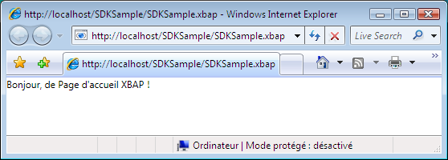  
  
> [!NOTE]
>  Pour plus d'informations sur le développement et le déploiement des applications [!INCLUDE[TLA2#tla_xbap#plural](../../../../includes/tla2sharptla-xbapsharpplural-md.md)], consultez [Vue d'ensemble des applications de navigateur XAML](../../../../docs/framework/wpf/app-development/wpf-xaml-browser-applications-overview.md) et [Déploiement d'une application WPF](../../../../docs/framework/wpf/app-development/deploying-a-wpf-application-wpf.md).  
  
   
### Configuration du titre, de la largeur et de la hauteur de la fenêtre hôte  
 Vous aurez peut\-être remarqué dans l'illustration précédente que le titre du volet de navigation et du volet d'onglets est l'[!INCLUDE[TLA2#tla_uri](../../../../includes/tla2sharptla-uri-md.md)] de l'application [!INCLUDE[TLA2#tla_xbap](../../../../includes/tla2sharptla-xbap-md.md)].  Outre sa longueur, le titre n'est ni attirant ni informatif.  Pour cette raison, <xref:System.Windows.Controls.Page> vous permet de modifier le titre en définissant la propriété <xref:System.Windows.Controls.Page.WindowTitle%2A>.  En outre, vous pouvez configurer la largeur et la hauteur de la fenêtre du navigateur en définissant <xref:System.Windows.Controls.Page.WindowWidth%2A> et <xref:System.Windows.Controls.Page.WindowHeight%2A>, respectivement.  
  
 <xref:System.Windows.Controls.Page.WindowTitle%2A>, <xref:System.Windows.Controls.Page.WindowWidth%2A> et <xref:System.Windows.Controls.Page.WindowHeight%2A> peuvent être déclarés de façon déclarative dans la balise, comme indiqué dans l'exemple suivant.  
  
 [!code-xml[NavigationOverviewSnippets#HomePageMARKUP](../../../../samples/snippets/csharp/VS_Snippets_Wpf/NavigationOverviewSnippets/CSharp/HomePage.xaml#homepagemarkup)]  
  
 Le résultat est affiché dans l'illustration suivante.  
  
   
  
   
### Navigation par lien hypertexte  
 Une application [!INCLUDE[TLA2#tla_xbap](../../../../includes/tla2sharptla-xbap-md.md)] classique comprend plusieurs pages.  La méthode la plus simple pour naviguer d'une page à une autre consiste à utiliser un <xref:System.Windows.Documents.Hyperlink>.  Vous pouvez ajouter de façon déclarative un <xref:System.Windows.Documents.Hyperlink> à une <xref:System.Windows.Controls.Page> en utilisant l'élément `Hyperlink` représenté dans la balise suivante.  
  
 [!code-xml[NavigationOverviewSnippets#HyperlinkXAML1](../../../../samples/snippets/csharp/VS_Snippets_Wpf/NavigationOverviewSnippets/CSharp/PageWithHyperlink.xaml#hyperlinkxaml1)]  
[!code-xml[NavigationOverviewSnippets#HyperlinkXAML2](../../../../samples/snippets/csharp/VS_Snippets_Wpf/NavigationOverviewSnippets/CSharp/PageWithHyperlink.xaml#hyperlinkxaml2)]  
[!code-xml[NavigationOverviewSnippets#HyperlinkXAML3](../../../../samples/snippets/csharp/VS_Snippets_Wpf/NavigationOverviewSnippets/CSharp/PageWithHyperlink.xaml#hyperlinkxaml3)]  
  
 Un élément `Hyperlink` requiert les éléments suivants :  
  
-   L'[!INCLUDE[TLA2#tla_uri](../../../../includes/tla2sharptla-uri-md.md)] à en\-tête pack de la <xref:System.Windows.Controls.Page> vers laquelle s'effectue la navigation, comme spécifié par l'attribut `NavigateUri`.  
  
-   Contenu sur lequel un utilisateur peut cliquer pour initialiser la navigation, comme du texte et des images \(pour le contenu que l'élément `Hyperlink` peut contenir, consultez <xref:System.Windows.Documents.Hyperlink>\).  
  
 L'illustration suivante montre une application [!INCLUDE[TLA2#tla_xbap](../../../../includes/tla2sharptla-xbap-md.md)] avec une <xref:System.Windows.Controls.Page> qui a un <xref:System.Windows.Documents.Hyperlink>.  
  
 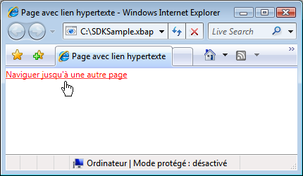  
  
 Comme vous vous y attendez, cliquer sur <xref:System.Windows.Documents.Hyperlink> amène l'application [!INCLUDE[TLA2#tla_xbap](../../../../includes/tla2sharptla-xbap-md.md)] à naviguer vers <xref:System.Windows.Controls.Page> identifié par l'attribut `NavigateUri`.  En outre, l'application [!INCLUDE[TLA2#tla_xbap](../../../../includes/tla2sharptla-xbap-md.md)] ajoute une entrée pour la <xref:System.Windows.Controls.Page> précédente à la liste Pages récentes dans [!INCLUDE[TLA2#tla_ie](../../../../includes/tla2sharptla-ie-md.md)].  Ce cas est représenté dans l'illustration suivante :  
  
 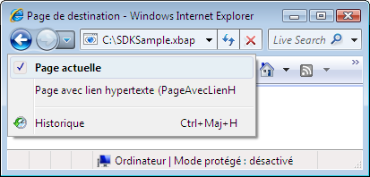  
  
 Outre la prise en charge de la navigation d'une <xref:System.Windows.Controls.Page> à une autre, <xref:System.Windows.Documents.Hyperlink> prend également en charge la navigation vers un fragment.  
  
   
### Navigation vers un fragment  
 La *navigation vers un fragment* est la navigation vers un fragment de contenu dans la <xref:System.Windows.Controls.Page> actuelle ou une autre <xref:System.Windows.Controls.Page>.  Dans [!INCLUDE[TLA2#tla_wpf](../../../../includes/tla2sharptla-wpf-md.md)], un fragment de contenu est le contenu que contient un élément nommé.  Un élément nommé est un élément dont l'attribut `Name` est défini.  La balise suivante montre un élément `TextBlock` nommé qui contient un fragment de contenu.  
  
 [!code-xml[NavigationOverviewSnippets#PageWithContentFragmentsMARKUP1](../../../../samples/snippets/csharp/VS_Snippets_Wpf/NavigationOverviewSnippets/CSharp/PageWithFragments.xaml#pagewithcontentfragmentsmarkup1)]  
[!code-xml[NavigationOverviewSnippets#PageWithContentFragmentsMARKUP2](../../../../samples/snippets/csharp/VS_Snippets_Wpf/NavigationOverviewSnippets/CSharp/PageWithFragments.xaml#pagewithcontentfragmentsmarkup2)]  
[!code-xml[NavigationOverviewSnippets#PageWithContentFragmentsMARKUP3](../../../../samples/snippets/csharp/VS_Snippets_Wpf/NavigationOverviewSnippets/CSharp/PageWithFragments.xaml#pagewithcontentfragmentsmarkup3)]  
  
 Pour qu'un <xref:System.Windows.Documents.Hyperlink> navigue vers un fragment de contenu, l'attribut `NavigateUri` doit inclure les éléments suivants :  
  
-   L'[!INCLUDE[TLA2#tla_uri](../../../../includes/tla2sharptla-uri-md.md)] du <xref:System.Windows.Controls.Page> avec le fragment de contenu vers lequel naviguer.  
  
-   Un caractère \#.  
  
-   Le nom d'élément sur la <xref:System.Windows.Controls.Page> qui contient le fragment de contenu.  
  
 Un [!INCLUDE[TLA2#tla_uri](../../../../includes/tla2sharptla-uri-md.md)] de fragment a le format suivant :  
  
 *URIPage* `#` *NomÉlement*  
  
 Les éléments suivants affichent un exemple d'un `Hyperlink` configuré pour naviguer vers un fragment de contenu.  
  
 [!code-xml[NavigationOverviewSnippets#PageThatNavigatesXAML1](../../../../samples/snippets/csharp/VS_Snippets_Wpf/NavigationOverviewSnippets/CSharp/PageThatNavigatesToFragment.xaml#pagethatnavigatesxaml1)]  
[!code-xml[NavigationOverviewSnippets#PageThatNavigatesXAML2](../../../../samples/snippets/csharp/VS_Snippets_Wpf/NavigationOverviewSnippets/CSharp/PageThatNavigatesToFragment.xaml#pagethatnavigatesxaml2)]  
[!code-xml[NavigationOverviewSnippets#PageThatNavigatesXAML3](../../../../samples/snippets/csharp/VS_Snippets_Wpf/NavigationOverviewSnippets/CSharp/PageThatNavigatesToFragment.xaml#pagethatnavigatesxaml3)]  
  
> [!NOTE]
>  Cette section décrit l'implémentation de navigation vers un fragment par défaut dans [!INCLUDE[TLA2#tla_wpf](../../../../includes/tla2sharptla-wpf-md.md)].  [!INCLUDE[TLA2#tla_wpf](../../../../includes/tla2sharptla-wpf-md.md)] vous permet également d'implémenter votre propre schéma de navigation vers un fragment qui, en partie, nécessite la gestion de l'événement <xref:System.Windows.Navigation.NavigationService.FragmentNavigation?displayProperty=fullName>.  
  
> [!IMPORTANT]
>  Vous pouvez naviguer vers des fragments dans des pages [!INCLUDE[TLA2#tla_xaml](../../../../includes/tla2sharptla-xaml-md.md)] libre \(fichiers [!INCLUDE[TLA2#tla_xaml](../../../../includes/tla2sharptla-xaml-md.md)] de balisage uniquement avec `Page` comme élément racine\) si les pages peuvent être parcourues via [!INCLUDE[TLA2#tla_http](../../../../includes/tla2sharptla-http-md.md)].  
>   
>  Toutefois, une page [!INCLUDE[TLA2#tla_xaml](../../../../includes/tla2sharptla-xaml-md.md)] libre peut naviguer vers ses propres fragments.  
  
   
### Service de navigation  
 Bien que <xref:System.Windows.Documents.Hyperlink> permette à un utilisateur d'initialiser la navigation vers une <xref:System.Windows.Controls.Page> particulière, le travail de localisation et de téléchargement de la page est exécuté par la classe <xref:System.Windows.Navigation.NavigationService>.  <xref:System.Windows.Navigation.NavigationService> fournit essentiellement la capacité de traiter une requête de navigation pour le compte du code client, tel que le <xref:System.Windows.Documents.Hyperlink>.  En outre, <xref:System.Windows.Navigation.NavigationService> implémente une prise en charge de niveau supérieur pour suivre et influencer une requête de navigation.  
  
 Lors d'un clic sur un <xref:System.Windows.Documents.Hyperlink>, [!INCLUDE[TLA2#tla_wpf](../../../../includes/tla2sharptla-wpf-md.md)] appelle <xref:System.Windows.Navigation.NavigationService.Navigate%2A?displayProperty=fullName> pour localiser et télécharger la <xref:System.Windows.Controls.Page> à l'[!INCLUDE[TLA2#tla_uri](../../../../includes/tla2sharptla-uri-md.md)] à en\-tête pack spécifié.  La <xref:System.Windows.Controls.Page> téléchargée est convertie en une arborescence d'objets dont l'objet racine est une instance de la <xref:System.Windows.Controls.Page> téléchargée.  Une référence à l'objet <xref:System.Windows.Controls.Page> racine est stockée dans la propriété <xref:System.Windows.Navigation.NavigationService.Content%2A?displayProperty=fullName>.  L'[!INCLUDE[TLA2#tla_uri](../../../../includes/tla2sharptla-uri-md.md)] à en\-tête pack du contenu consulté est stockée dans la propriété <xref:System.Windows.Navigation.NavigationService.Source%2A?displayProperty=fullName>, tandis que <xref:System.Windows.Navigation.NavigationService.CurrentSource%2A?displayProperty=fullName> stocke l'[!INCLUDE[TLA2#tla_uri](../../../../includes/tla2sharptla-uri-md.md)] à en\-tête pack de la dernière page consultée.  
  
> [!NOTE]
>  Il est possible pour une application [!INCLUDE[TLA2#tla_wpf](../../../../includes/tla2sharptla-wpf-md.md)] d'avoir plusieurs <xref:System.Windows.Navigation.NavigationService> simultanément actifs.  Pour plus d'informations, consultez [Hôtes de navigation](#Navigation_Hosts) plus loin dans cette rubrique.  
  
   
### Navigation par programmation avec le service de navigation  
 Vous n'avez pas besoin de connaître <xref:System.Windows.Navigation.NavigationService> si la navigation est implémentée de façon déclarative dans la balise à l'aide de <xref:System.Windows.Documents.Hyperlink>, parce que <xref:System.Windows.Documents.Hyperlink> utilise le <xref:System.Windows.Navigation.NavigationService> pour votre compte.  Cela signifie que, tant que le parent direct ou indirect d'un <xref:System.Windows.Documents.Hyperlink> est un hôte de navigation \(consultez [Hôtes de navigation](#Navigation_Hosts)\), le <xref:System.Windows.Documents.Hyperlink> est en mesure de rechercher et d'utiliser le service de navigation de cet hôte pour traiter une requête de navigation.  
  
 Toutefois, il existe des situations où vous devez utiliser <xref:System.Windows.Navigation.NavigationService> directement, y compris :  
  
-   Lorsque vous devez instancier une <xref:System.Windows.Controls.Page> à l'aide d'un constructeur non défini par défaut.  
  
-   Lorsque vous devez définir des propriétés sur la <xref:System.Windows.Controls.Page> avant de naviguer vers elle.  
  
-   Lorsque la <xref:System.Windows.Controls.Page> qui est la cible de la navigation ne peut être déterminée qu'au moment de l'exécution.  
  
 Dans ces situations, vous devez écrire le code pour initialiser la navigation par programmation en appelant la méthode <xref:System.Windows.Navigation.NavigationService.Navigate%2A> de l'objet <xref:System.Windows.Navigation.NavigationService>.  Cela requiert l'obtention d'une référence à <xref:System.Windows.Navigation.NavigationService>.  
  
#### Obtention d'une référence à NavigationService  
 Pour les raisons couvertes dans la section [Hôtes de navigation](#Navigation_Hosts), une application [!INCLUDE[TLA2#tla_wpf](../../../../includes/tla2sharptla-wpf-md.md)] peut avoir plusieurs <xref:System.Windows.Navigation.NavigationService>.  Cela signifie que votre code a besoin d'une méthode pour rechercher un <xref:System.Windows.Navigation.NavigationService>, qui est habituellement le <xref:System.Windows.Navigation.NavigationService> qui a navigué vers le <xref:System.Windows.Controls.Page> actif. Vous pouvez obtenir une référence à <xref:System.Windows.Navigation.NavigationService> en appelant la méthode `static` <xref:System.Windows.Navigation.NavigationService.GetNavigationService%2A?displayProperty=fullName>.  Pour obtenir le <xref:System.Windows.Navigation.NavigationService> qui a navigué vers une <xref:System.Windows.Controls.Page> particulière, vous passez une référence à la <xref:System.Windows.Controls.Page> comme argument de la méthode <xref:System.Windows.Navigation.NavigationService.GetNavigationService%2A>.  L'exemple de code suivant montre comment obtenir le <xref:System.Windows.Navigation.NavigationService> pour la <xref:System.Windows.Controls.Page> active.  
  
 [!code-csharp[NavigationOverviewSnippets#GetNSCODEBEHIND1](../../../../samples/snippets/csharp/VS_Snippets_Wpf/NavigationOverviewSnippets/CSharp/GetNSPage.xaml.cs#getnscodebehind1)]  
[!code-csharp[NavigationOverviewSnippets#GetNSCODEBEHIND2](../../../../samples/snippets/csharp/VS_Snippets_Wpf/NavigationOverviewSnippets/CSharp/GetNSPage.xaml.cs#getnscodebehind2)]
[!code-vb[NavigationOverviewSnippets#GetNSCODEBEHIND2](../../../../samples/snippets/visualbasic/VS_Snippets_Wpf/NavigationOverviewSnippets/VisualBasic/GetNSPage.xaml.vb#getnscodebehind2)]  
  
 Comme raccourci pour trouver le <xref:System.Windows.Navigation.NavigationService> pour une <xref:System.Windows.Controls.Page>, <xref:System.Windows.Controls.Page> implémente la propriété <xref:System.Windows.Controls.Page.NavigationService%2A>.  L'exemple suivant le démontre.  
  
 [!code-csharp[NavigationOverviewSnippets#GetNSShortcutCODEBEHIND1](../../../../samples/snippets/csharp/VS_Snippets_Wpf/NavigationOverviewSnippets/CSharp/GetNSPageShortCut.xaml.cs#getnsshortcutcodebehind1)]  
[!code-csharp[NavigationOverviewSnippets#GetNSShortcutCODEBEHIND2](../../../../samples/snippets/csharp/VS_Snippets_Wpf/NavigationOverviewSnippets/CSharp/GetNSPageShortCut.xaml.cs#getnsshortcutcodebehind2)]
[!code-vb[NavigationOverviewSnippets#GetNSShortcutCODEBEHIND2](../../../../samples/snippets/visualbasic/VS_Snippets_Wpf/NavigationOverviewSnippets/VisualBasic/GetNSPageShortCut.xaml.vb#getnsshortcutcodebehind2)]  
  
> [!NOTE]
>  Une <xref:System.Windows.Controls.Page> peut obtenir une référence à son <xref:System.Windows.Navigation.NavigationService> seulement lorsque <xref:System.Windows.Controls.Page> déclenche l'événement <xref:System.Windows.FrameworkElement.Loaded>.  
  
#### Navigation par programmation vers un objet page  
 L'exemple suivant montre comment utiliser le <xref:System.Windows.Navigation.NavigationService> pour naviguer par programmation vers une <xref:System.Windows.Controls.Page>.  La navigation par programmation est requise parce que la <xref:System.Windows.Controls.Page> qui est la cible de la navigation ne peut être instanciée qu'à l'aide d'un constructeur unique, non défini par défaut.  La <xref:System.Windows.Controls.Page> avec le constructeur non défini par défaut est montrée dans la balise et le code suivants.  
  
 [!code-xml[NavigationOverviewSnippets#PageWithNonDefaultConstructorXAML](../../../../samples/snippets/csharp/VS_Snippets_Wpf/NavigationOverviewSnippets/CSharp/PageWithNonDefaultConstructor.xaml#pagewithnondefaultconstructorxaml)]  
  
 [!code-csharp[NavigationOverviewSnippets#PageWithNonDefaultConstructorCODEBEHIND](../../../../samples/snippets/csharp/VS_Snippets_Wpf/NavigationOverviewSnippets/CSharp/PageWithNonDefaultConstructor.xaml.cs#pagewithnondefaultconstructorcodebehind)]
 [!code-vb[NavigationOverviewSnippets#PageWithNonDefaultConstructorCODEBEHIND](../../../../samples/snippets/visualbasic/VS_Snippets_Wpf/NavigationOverviewSnippets/VisualBasic/PageWithNonDefaultConstructor.xaml.vb#pagewithnondefaultconstructorcodebehind)]  
  
 La <xref:System.Windows.Controls.Page> qui navigue vers la <xref:System.Windows.Controls.Page> avec le constructeur non défini par défaut est montrée dans la balise et le code suivants.  
  
 [!code-xml[NavigationOverviewSnippets#NSNavigationPageXAML](../../../../samples/snippets/csharp/VS_Snippets_Wpf/NavigationOverviewSnippets/CSharp/NSNavigationPage.xaml#nsnavigationpagexaml)]  
  
 [!code-csharp[NavigationOverviewSnippets#NSNavigationPageCODEBEHIND](../../../../samples/snippets/csharp/VS_Snippets_Wpf/NavigationOverviewSnippets/CSharp/NSNavigationPage.xaml.cs#nsnavigationpagecodebehind)]
 [!code-vb[NavigationOverviewSnippets#NSNavigationPageCODEBEHIND](../../../../samples/snippets/visualbasic/VS_Snippets_Wpf/NavigationOverviewSnippets/VisualBasic/NSNavigationPage.xaml.vb#nsnavigationpagecodebehind)]  
  
 Lorsque l'utilisateur clique sur le <xref:System.Windows.Documents.Hyperlink> sur ce <xref:System.Windows.Controls.Page>, la navigation est initialisée en instanciant le <xref:System.Windows.Controls.Page> à afficher en utilisant un constructeur non défini par défaut et en appelant la méthode <xref:System.Windows.Navigation.NavigationService.Navigate%2A?displayProperty=fullName>.  <xref:System.Windows.Navigation.NavigationService.Navigate%2A> accepte une référence à l'objet auquel <xref:System.Windows.Navigation.NavigationService> va accéder, plutôt qu'un [!INCLUDE[TLA2#tla_uri](../../../../includes/tla2sharptla-uri-md.md)] à en\-tête pack.  
  
#### Navigation par programmation avec un URI à en\-tête pack  
 Si vous devez construire un [!INCLUDE[TLA2#tla_uri](../../../../includes/tla2sharptla-uri-md.md)] à en\-tête pack par programmation \(lorsque vous ne pouvez déterminer l'[!INCLUDE[TLA2#tla_uri](../../../../includes/tla2sharptla-uri-md.md)] à en\-tête pack qu'au moment de l'exécution, par exemple\), vous pouvez utiliser la méthode <xref:System.Windows.Navigation.NavigationService.Navigate%2A?displayProperty=fullName>.  L'exemple suivant le démontre.  
  
 [!code-xml[NavigationOverviewSnippets#NSUriNavigationPageXAML](../../../../samples/snippets/csharp/VS_Snippets_Wpf/NavigationOverviewSnippets/CSharp/NSUriNavigationPage.xaml#nsurinavigationpagexaml)]  
  
 [!code-csharp[NavigationOverviewSnippets#NSUriNavigationPageCODEBEHIND](../../../../samples/snippets/csharp/VS_Snippets_Wpf/NavigationOverviewSnippets/CSharp/NSUriNavigationPage.xaml.cs#nsurinavigationpagecodebehind)]
 [!code-vb[NavigationOverviewSnippets#NSUriNavigationPageCODEBEHIND](../../../../samples/snippets/visualbasic/VS_Snippets_Wpf/NavigationOverviewSnippets/VisualBasic/NSUriNavigationPage.xaml.vb#nsurinavigationpagecodebehind)]  
  
#### Actualisation de la page active  
 Une <xref:System.Windows.Controls.Page> n'est pas téléchargée si elle a le même [!INCLUDE[TLA2#tla_uri](../../../../includes/tla2sharptla-uri-md.md)] à en\-tête pack que l'[!INCLUDE[TLA2#tla_uri](../../../../includes/tla2sharptla-uri-md.md)] stocké dans la propriété <xref:System.Windows.Navigation.NavigationService.Source%2A?displayProperty=fullName>.  Pour forcer [!INCLUDE[TLA2#tla_wpf](../../../../includes/tla2sharptla-wpf-md.md)] à télécharger de nouveau la page actuelle, vous pouvez appeler la méthode <xref:System.Windows.Navigation.NavigationService.Refresh%2A?displayProperty=fullName>, comme représenté dans l'exemple suivant.  
  
 [!code-xml[NavigationOverviewSnippets#NSRefreshNavigationPageXAML1](../../../../samples/snippets/csharp/VS_Snippets_Wpf/NavigationOverviewSnippets/CSharp/NSRefreshNavigationPage.xaml#nsrefreshnavigationpagexaml1)]  
  
 [!code-csharp[NavigationOverviewSnippets#NSRefreshNavigationPageCODEBEHIND1](../../../../samples/snippets/csharp/VS_Snippets_Wpf/NavigationOverviewSnippets/CSharp/NSRefreshNavigationPage.xaml.cs#nsrefreshnavigationpagecodebehind1)]
 [!code-vb[NavigationOverviewSnippets#NSRefreshNavigationPageCODEBEHIND1](../../../../samples/snippets/visualbasic/VS_Snippets_Wpf/NavigationOverviewSnippets/VisualBasic/NSRefreshNavigationPage.xaml.vb#nsrefreshnavigationpagecodebehind1)]  
[!code-csharp[NavigationOverviewSnippets#NSRefreshNavigationPageCODEBEHIND2](../../../../samples/snippets/csharp/VS_Snippets_Wpf/NavigationOverviewSnippets/CSharp/NSRefreshNavigationPage.xaml.cs#nsrefreshnavigationpagecodebehind2)]
[!code-vb[NavigationOverviewSnippets#NSRefreshNavigationPageCODEBEHIND2](../../../../samples/snippets/visualbasic/VS_Snippets_Wpf/NavigationOverviewSnippets/VisualBasic/NSRefreshNavigationPage.xaml.vb#nsrefreshnavigationpagecodebehind2)]  
  
   
### Durée de vie de la navigation  
 Il existe de nombreuses méthodes pour initialiser la navigation, comme vous l'avez vu.  Lorsque la navigation est initialisée, et pendant que la navigation est en cours, vous pouvez suivre et influencer la navigation à l'aide des événements suivants implémentés par <xref:System.Windows.Navigation.NavigationService> :  
  
-   <xref:System.Windows.Navigation.NavigationService.Navigating>.  Se produit lorsqu'une nouvelle navigation est demandée.  Peut être utilisé pour annuler la navigation.  
  
-   <xref:System.Windows.Navigation.NavigationService.NavigationProgress>.  Se produit périodiquement pendant un téléchargement pour fournir des informations sur la progression de la navigation.  
  
-   <xref:System.Windows.Navigation.NavigationService.Navigated>.  . Se produit lorsque la page a été localisée et téléchargée.  
  
-   <xref:System.Windows.Navigation.NavigationService.NavigationStopped>.  Se produit lorsque la navigation est arrêtée \(en appelant <xref:System.Windows.Navigation.NavigationService.StopLoading%2A>\) ou lorsqu'une nouvelle navigation est demandée alors qu'une navigation est déjà en cours.  
  
-   <xref:System.Windows.Navigation.NavigationService.NavigationFailed>.  Se produit lorsqu'une erreur est déclenchée au cours de la navigation jusqu'au contenu demandé.  
  
-   <xref:System.Windows.Navigation.NavigationService.LoadCompleted>.  Se produit lorsque le contenu cible de la navigation est chargé et analysé et que son rendu a commencé.  
  
-   <xref:System.Windows.Navigation.NavigationService.FragmentNavigation>.  Se produit lorsque la navigation vers un fragment de contenu commence, ce qui survient dans les cas suivants :  
  
    -   Immédiatement, si le fragment désiré est dans le contenu actuel.  
  
    -   Après avoir chargé le contenu source, si le fragment désiré est dans un contenu différent.  
  
 Les événements de navigation sont déclenchés dans l'ordre indiqué par l'illustration suivante.  
  
 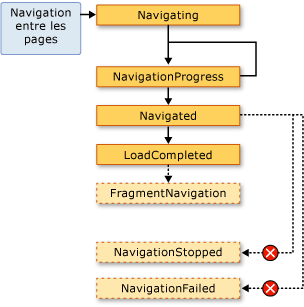  
  
 En général, une <xref:System.Windows.Controls.Page> n'est pas concernée par ces événements.  Il est plus probable qu'ils concernent une application et, pour cette raison, ils sont également déclenchés par la classe <xref:System.Windows.Application> :  
  
-   <xref:System.Windows.Application.Navigating?displayProperty=fullName>  
  
-   <xref:System.Windows.Application.NavigationProgress?displayProperty=fullName>  
  
-   <xref:System.Windows.Application.Navigated?displayProperty=fullName>  
  
-   <xref:System.Windows.Application.NavigationFailed?displayProperty=fullName>  
  
-   <xref:System.Windows.Application.NavigationStopped?displayProperty=fullName>  
  
-   <xref:System.Windows.Application.LoadCompleted?displayProperty=fullName>  
  
-   <xref:System.Windows.Application.FragmentNavigation?displayProperty=fullName>  
  
 À chaque fois que <xref:System.Windows.Navigation.NavigationService> déclenche un événement, la classe <xref:System.Windows.Application> déclenche l'événement correspondant.  <xref:System.Windows.Controls.Frame> et <xref:System.Windows.Navigation.NavigationWindow> offrent les mêmes événements pour détecter la navigation dans leurs portées respectives.  
  
 Dans certains cas, une <xref:System.Windows.Controls.Page> peut s'intéresser à ces événements.  Par exemple, un <xref:System.Windows.Controls.Page> peut gérer l'événement <xref:System.Windows.Navigation.NavigationService.Navigating?displayProperty=fullName> pour déterminer si annuler ou non une navigation qui s'en éloigne.  L'exemple suivant le démontre.  
  
 [!code-xml[NavigationOverviewSnippets#CancelNavigationPageXAML](../../../../samples/snippets/csharp/VS_Snippets_Wpf/NavigationOverviewSnippets/CSharp/CancelNavigationPage.xaml#cancelnavigationpagexaml)]  
  
 [!code-csharp[NavigationOverviewSnippets#CancelNavigationPageCODEBEHIND](../../../../samples/snippets/csharp/VS_Snippets_Wpf/NavigationOverviewSnippets/CSharp/CancelNavigationPage.xaml.cs#cancelnavigationpagecodebehind)]
 [!code-vb[NavigationOverviewSnippets#CancelNavigationPageCODEBEHIND](../../../../samples/snippets/visualbasic/VS_Snippets_Wpf/NavigationOverviewSnippets/VisualBasic/CancelNavigationPage.xaml.vb#cancelnavigationpagecodebehind)]  
  
 Si vous enregistrez un gestionnaire avec un événement de navigation d'une <xref:System.Windows.Controls.Page>, comme dans l'exemple précédent, vous devez également annuler l'enregistrement du gestionnaire d'événements.  Si vous ne le faites pas, il peut y avoir des effets secondaires en ce qui concerne la manière dont la navigation [!INCLUDE[TLA2#tla_wpf](../../../../includes/tla2sharptla-wpf-md.md)] se souvient de la navigation <xref:System.Windows.Controls.Page> à l'aide du journal.  
  
   
### Mémorisation de la navigation avec le journal  
 [!INCLUDE[TLA2#tla_wpf](../../../../includes/tla2sharptla-wpf-md.md)] utilise deux piles pour se souvenir des pages à partir desquelles vous avez navigué : une pile Back et une pile Forward.  Lorsque vous naviguez de la <xref:System.Windows.Controls.Page> actuelle vers un nouvelle <xref:System.Windows.Controls.Page> ou avancez vers une <xref:System.Windows.Controls.Page> existante, la <xref:System.Windows.Controls.Page> actuelle est ajoutée à la *pile Back*.  Lorsque vous naviguez de la <xref:System.Windows.Controls.Page> actuelle vers la <xref:System.Windows.Controls.Page> précédente, la <xref:System.Windows.Controls.Page> actuelle est ajoutée à la *pile Forward*.  La pile Back, la pile Forward et les fonctionnalités pour les gérer sont collectivement appelées le journal.  Chaque élément des piles Back et Forward est une instance de la classe <xref:System.Windows.Navigation.JournalEntry> et est connu sous le nom d'une *entrée de journal*.  
  
#### Navigation dans le journal à partir d'Internet Explorer  
 Du point de vue conceptuel, le journal fonctionne de la même manière que les boutons **Précédent** et **Suivant** dans [!INCLUDE[TLA2#tla_ie](../../../../includes/tla2sharptla-ie-md.md)].  Ces boutons sont représentés dans l'illustration ci\-dessous.  
  
   
  
 Pour les applications [!INCLUDE[TLA2#tla_xbap#plural](../../../../includes/tla2sharptla-xbapsharpplural-md.md)] hébergées par [!INCLUDE[TLA2#tla_ie](../../../../includes/tla2sharptla-ie-md.md)], [!INCLUDE[TLA2#tla_wpf](../../../../includes/tla2sharptla-wpf-md.md)] intègre le journal dans l'[!INCLUDE[TLA2#tla_ui](../../../../includes/tla2sharptla-ui-md.md)] de navigation d'[!INCLUDE[TLA2#tla_ie](../../../../includes/tla2sharptla-ie-md.md)].  Cela permet aux utilisateurs de naviguer dans les pages d'une application [!INCLUDE[TLA2#tla_xbap](../../../../includes/tla2sharptla-xbap-md.md)] à l'aide des boutons **Précédent**, **Suivant** et**Pages récentes** dans [!INCLUDE[TLA2#tla_ie](../../../../includes/tla2sharptla-ie-md.md)]. Le journal n'est pas intégré dans [!INCLUDE[TLA2#tla_ie6](../../../../includes/tla2sharptla-ie6-md.md)] de la même manière que dans [!INCLUDE[TLA2#tla_ie7](../../../../includes/tla2sharptla-ie7-md.md)] ou Internet Explorer 8.  À la place, [!INCLUDE[TLA2#tla_wpf](../../../../includes/tla2sharptla-wpf-md.md)] restitue une [!INCLUDE[TLA2#tla_ui](../../../../includes/tla2sharptla-ui-md.md)] de navigation de substitution.  
  
> [!IMPORTANT]
>  Dans [!INCLUDE[TLA2#tla_ie](../../../../includes/tla2sharptla-ie-md.md)], lorsqu'un utilisateur s'éloigne d'une application [!INCLUDE[TLA2#tla_xbap](../../../../includes/tla2sharptla-xbap-md.md)], puis y retourne dans le cadre de sa navigation, seules les entrées de journal pour les pages qui n'ont pas été gardées actives sont conservées dans le journal.  Pour savoir comment garder des pages actives, consultez [Durée de vie d'une page et le journal](#PageLifetime) plus loin dans cette rubrique.  
  
 Par défaut, le texte pour chaque <xref:System.Windows.Controls.Page> qui apparaît dans la liste **Pages récentes** d'[!INCLUDE[TLA2#tla_ie](../../../../includes/tla2sharptla-ie-md.md)] est l'[!INCLUDE[TLA2#tla_uri](../../../../includes/tla2sharptla-uri-md.md)] pour la <xref:System.Windows.Controls.Page>.  Dans de nombreux cas, ce n'est pas particulièrement explicite pour l'utilisateur.  Heureusement, vous pouvez modifier le texte à l'aide d'une des options suivantes :  
  
1.  La valeur de l'attribut `JournalEntry.Name` attaché.  
  
2.  La valeur de l'attribut `Page.Title`.  
  
3.  La valeur de l'attribut `Page.WindowTitle` et l'[!INCLUDE[TLA2#tla_uri](../../../../includes/tla2sharptla-uri-md.md)] pour la <xref:System.Windows.Controls.Page> actuelle.  
  
4.  L'[!INCLUDE[TLA2#tla_uri](../../../../includes/tla2sharptla-uri-md.md)] pour la <xref:System.Windows.Controls.Page> actuelle.  \(Valeur par défaut\)  
  
 L'ordre dans lequel les options sont répertoriées correspond à l'ordre de priorité pour rechercher le texte.  Par exemple, si `JournalEntry.Name` est défini, les autres valeurs sont ignorées.  
  
 L'exemple suivant utilise l'attribut `Page.Title` pour modifier le texte qui s'affiche pour une entrée de journal.  
  
 [!code-xml[NavigationOverviewSnippets#PageTitleMARKUP1](../../../../samples/snippets/csharp/VS_Snippets_Wpf/NavigationOverviewSnippets/CSharp/PageWithTitle.xaml#pagetitlemarkup1)]  
[!code-xml[NavigationOverviewSnippets#PageTitleMARKUP2](../../../../samples/snippets/csharp/VS_Snippets_Wpf/NavigationOverviewSnippets/CSharp/PageWithTitle.xaml#pagetitlemarkup2)]  
  
 [!code-csharp[NavigationOverviewSnippets#PageTitleCODEBEHIND1](../../../../samples/snippets/csharp/VS_Snippets_Wpf/NavigationOverviewSnippets/CSharp/PageWithTitle.xaml.cs#pagetitlecodebehind1)]
 [!code-vb[NavigationOverviewSnippets#PageTitleCODEBEHIND1](../../../../samples/snippets/visualbasic/VS_Snippets_Wpf/NavigationOverviewSnippets/VisualBasic/PageWithTitle.xaml.vb#pagetitlecodebehind1)]  
[!code-csharp[NavigationOverviewSnippets#PageTitleCODEBEHIND2](../../../../samples/snippets/csharp/VS_Snippets_Wpf/NavigationOverviewSnippets/CSharp/PageWithTitle.xaml.cs#pagetitlecodebehind2)]
[!code-vb[NavigationOverviewSnippets#PageTitleCODEBEHIND2](../../../../samples/snippets/visualbasic/VS_Snippets_Wpf/NavigationOverviewSnippets/VisualBasic/PageWithTitle.xaml.vb#pagetitlecodebehind2)]  
  
#### Navigation dans le journal à l'aide de WPF  
 Bien qu'un utilisateur puisse naviguer dans le journal à l'aide des options **Précédent**, **Suivant** et **Pages récentes** d'[!INCLUDE[TLA2#tla_ie](../../../../includes/tla2sharptla-ie-md.md)], vous pouvez également naviguer dans le journal à l'aide des mécanismes déclaratifs et de programmation fournis par [!INCLUDE[TLA2#tla_wpf](../../../../includes/tla2sharptla-wpf-md.md)].  Une raison pour ce faire est de fournir des [!INCLUDE[TLA2#tla_ui#plural](../../../../includes/tla2sharptla-uisharpplural-md.md)] de navigation personnalisées dans vos pages.  
  
 Vous pouvez ajouter de façon déclarative la prise en charge de la navigation dans le journal à l'aide des commandes de navigation exposées par <xref:System.Windows.Input.NavigationCommands>.  L'exemple suivant montre comment utiliser la commande de navigation `BrowseBack`.  
  
 [!code-xml[NavigationOverviewSnippets#NavigationCommandsPageXAML1](../../../../samples/snippets/csharp/VS_Snippets_Wpf/NavigationOverviewSnippets/CSharp/NavigationCommandsPage.xaml#navigationcommandspagexaml1)]  
[!code-xml[NavigationOverviewSnippets#NavigationCommandsPageXAML2](../../../../samples/snippets/csharp/VS_Snippets_Wpf/NavigationOverviewSnippets/CSharp/NavigationCommandsPage.xaml#navigationcommandspagexaml2)]  
[!code-xml[NavigationOverviewSnippets#NavigationCommandsPageXAML3](../../../../samples/snippets/csharp/VS_Snippets_Wpf/NavigationOverviewSnippets/CSharp/NavigationCommandsPage.xaml#navigationcommandspagexaml3)]  
[!code-xml[NavigationOverviewSnippets#NavigationCommandsPageXAML4](../../../../samples/snippets/csharp/VS_Snippets_Wpf/NavigationOverviewSnippets/CSharp/NavigationCommandsPage.xaml#navigationcommandspagexaml4)]  
  
 Vous pouvez également naviguer par programmation dans le journal à l'aide d'un des membres suivants de la classe <xref:System.Windows.Navigation.NavigationService> :  
  
-   <xref:System.Windows.Navigation.NavigationService.GoBack%2A>  
  
-   <xref:System.Windows.Navigation.NavigationService.GoForward%2A>  
  
-   <xref:System.Windows.Navigation.NavigationService.CanGoBack%2A>  
  
-   <xref:System.Windows.Navigation.NavigationService.CanGoForward%2A>  
  
 Le journal peut également être manipulé par programmation \(consultez [Conserver l'état du contenu avec l'historique de navigation](#RetainingContentStateWithNavigationHistory) plus loin dans cette rubrique\).  
  
   
### Durée de vie d'une page et le journal  
 Considérez une application [!INCLUDE[TLA2#tla_xbap](../../../../includes/tla2sharptla-xbap-md.md)] avec plusieurs pages contenant du contenu riche, y compris des images, des animations et des médias.  L'encombrement mémoire de pages comme celles\-ci peut être assez important, en particulier si des médias audio et vidéo sont utilisés.  Étant donné que le journal « se souvient » des pages vers lesquelles l'utilisateur a navigué, une telle application [!INCLUDE[TLA2#tla_xbap](../../../../includes/tla2sharptla-xbap-md.md)] pourrait consommer rapidement une grande quantité de mémoire.  
  
 Pour cette raison, le comportement par défaut du journal est de stocker les métadonnées <xref:System.Windows.Controls.Page> dans chaque entrée de journal plutôt qu'une référence à un objet <xref:System.Windows.Controls.Page>.  Lorsqu'une entrée de journal est la cible de la navigation, ses métadonnées <xref:System.Windows.Controls.Page> sont utilisées pour créer une nouvelle instance de la <xref:System.Windows.Controls.Page> spécifiée.  En conséquence, chaque <xref:System.Windows.Controls.Page> cible de la navigation a la durée de vie illustrée ci\-dessous.  
  
 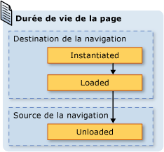  
  
 Bien que l'utilisation du comportement de journalisation par défaut puisse économiser de la mémoire, les performances de rendu par page peuvent réduire ; la réinstanciation d'un <xref:System.Windows.Controls.Page> pouvant prendre beaucoup de temps, en particulier si le contenu est volumineux.  Si vous devez conserver une instance <xref:System.Windows.Controls.Page> dans le journal, vous pouvez vous inspirer de deux techniques pour ce faire.  Tout d'abord, vous pouvez naviguer par programmation vers un objet <xref:System.Windows.Controls.Page> en appelant la méthode <xref:System.Windows.Navigation.NavigationService.Navigate%2A?displayProperty=fullName>.  
  
 Ensuite, vous pouvez spécifier que [!INCLUDE[TLA2#tla_wpf](../../../../includes/tla2sharptla-wpf-md.md)] conserve une instance d'une <xref:System.Windows.Controls.Page> dans le journal en affectant à la propriété <xref:System.Windows.Controls.Page.KeepAlive%2A> la valeur `true` \(la valeur par défaut est `false`\).  Comme indiqué dans l'exemple suivant, vous pouvez définir <xref:System.Windows.Controls.Page.KeepAlive%2A> de façon déclarative dans la balise.  
  
 [!code-xml[NavigationOverviewSnippets#KeepAlivePageXAML](../../../../samples/snippets/csharp/VS_Snippets_Wpf/NavigationOverviewSnippets/CSharp/KeepAlivePage.xaml#keepalivepagexaml)]  
  
 La différence de durée de vie entre une <xref:System.Windows.Controls.Page> gardée active est une qui ne l'est pas est subtile.  La première fois que l'on navigue vers une <xref:System.Windows.Controls.Page> gardé actif, elle est instanciée tout comme une <xref:System.Windows.Controls.Page> qui n'est pas gardée active.  Toutefois, comme une instance de la <xref:System.Windows.Controls.Page> est conservée dans le journal, elle n'est jamais instanciée de nouveau tant qu'elle reste dans le journal.  Par conséquent, si une <xref:System.Windows.Controls.Page> a une logique d'initialisation qui doit être appelée chaque fois que l'on navigue vers la <xref:System.Windows.Controls.Page>, vous devez la déplacer du constructeur dans un gestionnaire pour l'événement <xref:System.Windows.FrameworkElement.Loaded>.  Comme indiqué dans l'illustration suivante, les événements <xref:System.Windows.FrameworkElement.Loaded> et <xref:System.Windows.FrameworkElement.Unloaded> sont encore déclenchés chaque fois que la navigation s'effectue depuis et vers une <xref:System.Windows.Controls.Page>, respectivement.  
  
 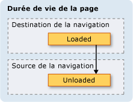  
  
 Lorsqu'une <xref:System.Windows.Controls.Page> n'est pas gardée active, vous ne devez suivre ni l'une ni l'autre des options suivantes :  
  
-   Stocker une référence la concernant, en tout ou partie.  
  
-   Enregistrer des gestionnaires d'événements avec des événements qu'elle n'implémente pas.  
  
 Suivre l'une ou l'autre de ces deux options crée des références qui forcent le stockage de la <xref:System.Windows.Controls.Page> en mémoire, même après sa suppression du journal.  
  
 En général, vous devez préférer le comportement de <xref:System.Windows.Controls.Page> par défaut qui consiste à ne pas garder de <xref:System.Windows.Controls.Page> active.  Toutefois, cela a des conséquences sur l'état dont nous traiterons dans la section suivante.  
  
   
### Conserver l'état du contenu avec l'historique de navigation  
 Si une <xref:System.Windows.Controls.Page> n'est pas gardée active et qu'elle possède des contrôles qui collectent des données de l'utilisateur, qu'arrive\-t\-il aux données si un utilisateur s'éloigne de la <xref:System.Windows.Controls.Page>, puis qu'il y retourne ?  L'utilisateur, de son côté, s'attend à voir les données qu'il a entrées précédemment.  Malheureusement, comme une nouvelle instance de la <xref:System.Windows.Controls.Page> est créée à chaque navigation, les contrôles qui ont collecté les données sont réinstanciés et les données sont perdues.  
  
 Heureusement, le journal assure la prise en charge requise pour se souvenir des données issues de la navigation dans les <xref:System.Windows.Controls.Page>, y compris les données de commande.  L'entrée de journal pour chaque <xref:System.Windows.Controls.Page> agit spécifiquement comme un conteneur temporaire pour l'état de <xref:System.Windows.Controls.Page> associé.  Les étapes suivantes décrivent comment cette prise en charge est utilisée lorsque l'on navigue à partir d'une <xref:System.Windows.Controls.Page> :  
  
1.  Une entrée pour la <xref:System.Windows.Controls.Page> actuelle est ajoutée au journal.  
  
2.  L'état de la <xref:System.Windows.Controls.Page> est stocké avec l'entrée de journal pour cette page et ajouté à la pile Back.  
  
3.  La navigation s'effectue vers la nouvelle <xref:System.Windows.Controls.Page>.  
  
 Lorsque la navigation retourne à la page <xref:System.Windows.Controls.Page>, à l'aide du journal, les étapes suivantes sont effectuées :  
  
1.  Le <xref:System.Windows.Controls.Page> \(l'entrée de journal du dessus sur la pile Back\) est instancié.  
  
2.  La <xref:System.Windows.Controls.Page> est actualisée avec l'état qui était stocké avec l'entrée de journal pour la <xref:System.Windows.Controls.Page>.  
  
3.  La navigation retourne à <xref:System.Windows.Controls.Page>.  
  
 [!INCLUDE[TLA2#tla_wpf](../../../../includes/tla2sharptla-wpf-md.md)] utilise automatiquement cette prise en charge lorsque les contrôles suivants sont utilisés sur une <xref:System.Windows.Controls.Page> :  
  
-   <xref:System.Windows.Controls.CheckBox>  
  
-   <xref:System.Windows.Controls.ComboBox>  
  
-   <xref:System.Windows.Controls.Expander>  
  
-   <xref:System.Windows.Controls.Frame>  
  
-   <xref:System.Windows.Controls.ListBox>  
  
-   <xref:System.Windows.Controls.ListBoxItem>  
  
-   <xref:System.Windows.Controls.MenuItem>  
  
-   <xref:System.Windows.Controls.ProgressBar>  
  
-   <xref:System.Windows.Controls.RadioButton>  
  
-   <xref:System.Windows.Controls.Slider>  
  
-   <xref:System.Windows.Controls.TabControl>  
  
-   <xref:System.Windows.Controls.TabItem>  
  
-   <xref:System.Windows.Controls.TextBox>  
  
 Si une <xref:System.Windows.Controls.Page> utilise ces contrôles, les données qui y sont entrées ne sont pas oubliées au fil de la navigation entre les <xref:System.Windows.Controls.Page>, comme indiqué par la zone de liste **Couleur favorite**<xref:System.Windows.Controls.ListBox> dans l'illustration suivante.  
  
   
  
 Lorsqu'une <xref:System.Windows.Controls.Page> a des contrôles autres que ceux de la liste précédente, ou lorsque l'état est stocké dans des objets personnalisés, vous devez écrire du code pour faire en sorte que le journal se souvienne de l'état au fil de la navigation entre les <xref:System.Windows.Controls.Page>.  
  
 Si vous devez vous souvenir de petites parties d'état au fil de la navigation dans les <xref:System.Windows.Controls.Page>, vous pouvez utiliser des propriétés de dépendance \(consultez <xref:System.Windows.DependencyProperty>\) configurées avec l'indicateur de métadonnées <xref:System.Windows.FrameworkPropertyMetadata.Journal%2A?displayProperty=fullName>.  
  
 Si l'état dont votre <xref:System.Windows.Controls.Page> doit se souvenir à travers des navigations comprend plusieurs éléments de données, vous aurez peut\-être besoin de moins de code pour encapsuler votre état dans une classe unique et implémenter l'interface <xref:System.Windows.Navigation.IProvideCustomContentState>.  
  
 Si vous devez naviguer à travers différents états d'une <xref:System.Windows.Controls.Page> unique, sans naviguer à partir de la <xref:System.Windows.Controls.Page> elle\-même, vous pouvez utiliser <xref:System.Windows.Navigation.IProvideCustomContentState> et <xref:System.Windows.Navigation.NavigationService.AddBackEntry%2A?displayProperty=fullName>.  
  
   
### Cookies  
 Pour les applications [!INCLUDE[TLA2#tla_wpf](../../../../includes/tla2sharptla-wpf-md.md)], les cookies constituent une autre manière de stocker des données. Ils sont créés, mis à jour et supprimés à l'aide des méthodes <xref:System.Windows.Application.SetCookie%2A> et <xref:System.Windows.Application.GetCookie%2A>.  Les cookies que vous pouvez créer dans [!INCLUDE[TLA2#tla_wpf](../../../../includes/tla2sharptla-wpf-md.md)] sont les mêmes cookies que d'autres types d'applications Web utilisent ; les cookies sont des éléments de données arbitraires qui sont stockés par une application sur un ordinateur client pendant ou à travers des sessions d'application.  Les données de cookie prennent généralement la forme d'une paire nom\/valeur avec le format suivant.  
  
 *Nom* `=` *Valeur*  
  
 Lorsque les données sont passées à <xref:System.Windows.Application.SetCookie%2A>, avec le <xref:System.Uri> de l'emplacement pour lequel le cookie doit être défini, un cookie est créé en mémoire et n'est disponible que pendant la durée de la session d'application en cours.  Ce type de cookie est connu sous le nom de *cookie de session*.  
  
 Pour stocker un cookie à travers des sessions d'application, une date d'expiration doit être ajoutée au cookie, selon le format suivant :  
  
 *NOM* `=` *VALEUR* `; expires=DAY, DD-MMM-YYYY HH:MM:SS GMT`  
  
 Un cookie avec une date d'expiration est stocké dans le dossier des fichiers Internet temporaires de l'installation [!INCLUDE[TLA#tla_mswin](../../../../includes/tlasharptla-mswin-md.md)] actuelle jusqu'à ce que le cookie expire.  Un cookie de ce type est connu sous le nom de *cookie persistant* parce qu'il persiste à travers les sessions d'application.  
  
 Vous récupérez tant les cookies de session que les cookies persistants en appelant la méthode <xref:System.Windows.Application.GetCookie%2A>, en passant l'<xref:System.Uri> de l'emplacement où le cookie a été défini avec la méthode <xref:System.Windows.Application.SetCookie%2A>.  
  
 Voici quelques\-unes des façons dont les cookies sont pris en charge dans [!INCLUDE[TLA2#tla_wpf](../../../../includes/tla2sharptla-wpf-md.md)] :  
  
-   Les applications autonomes [!INCLUDE[TLA2#tla_wpf](../../../../includes/tla2sharptla-wpf-md.md)] et les applications [!INCLUDE[TLA2#tla_xbap#plural](../../../../includes/tla2sharptla-xbapsharpplural-md.md)] peuvent toutes les deux créer et gérer des cookies.  
  
-   L'accès aux cookies créés par une application [!INCLUDE[TLA2#tla_xbap](../../../../includes/tla2sharptla-xbap-md.md)] s'effectue à partir du navigateur.  
  
-   Des applications [!INCLUDE[TLA2#tla_xbap#plural](../../../../includes/tla2sharptla-xbapsharpplural-md.md)] du même domaine peuvent créer et partager des cookies.  
  
-   Des pages [!INCLUDE[TLA2#tla_xbap#plural](../../../../includes/tla2sharptla-xbapsharpplural-md.md)] et [!INCLUDE[TLA2#tla_html](../../../../includes/tla2sharptla-html-md.md)] du même domaine peuvent créer et partager des cookies.  
  
-   Les cookies sont distribués lorsque des pages [!INCLUDE[TLA2#tla_xbap#plural](../../../../includes/tla2sharptla-xbapsharpplural-md.md)] et des pages [!INCLUDE[TLA2#tla_xaml](../../../../includes/tla2sharptla-xaml-md.md)] libre adressent des requêtes Web.  
  
-   Les pages [!INCLUDE[TLA2#tla_xbap#plural](../../../../includes/tla2sharptla-xbapsharpplural-md.md)] de niveau supérieur et [!INCLUDE[TLA2#tla_xbap#plural](../../../../includes/tla2sharptla-xbapsharpplural-md.md)] hébergé dans IFRAMES peuvent toutes deux accéder aux cookies.  
  
-   La prise en charge des cookies dans [!INCLUDE[TLA2#tla_wpf](../../../../includes/tla2sharptla-wpf-md.md)] est la même pour tous les navigateurs pris en charge.  
  
-   Dans [!INCLUDE[TLA2#tla_ie](../../../../includes/tla2sharptla-ie-md.md)], la stratégie P3P qui concerne les cookies est honorée par [!INCLUDE[TLA2#tla_wpf](../../../../includes/tla2sharptla-wpf-md.md)], en particulier en ce qui concerne les applications [!INCLUDE[TLA2#tla_xbap#plural](../../../../includes/tla2sharptla-xbapsharpplural-md.md)] internes ou tierces.  
  
   
### Navigation structurée  
 Si vous devez passer des données d'une <xref:System.Windows.Controls.Page> à une autre, vous pouvez passer les données comme arguments à un constructeur non défini par défaut de la <xref:System.Windows.Controls.Page>.  Notez que si vous utilisez cette technique, vous devez garder la <xref:System.Windows.Controls.Page> active ; sinon, la prochaine fois que vous naviguez vers la <xref:System.Windows.Controls.Page>, [!INCLUDE[TLA2#tla_wpf](../../../../includes/tla2sharptla-wpf-md.md)] la réinstancie en utilisant le constructeur par défaut.  
  
 Votre <xref:System.Windows.Controls.Page> peut également implémenter des propriétés définies avec les données qui doivent être passées.  Toutefois, cela se complique lorsqu'une <xref:System.Windows.Controls.Page> doit repasser des données à la <xref:System.Windows.Controls.Page> qui a navigué jusqu'à elle.  Le problème est que la navigation ne prend en charge aucun mécanisme en mode natif pour garantir le retour à une <xref:System.Windows.Controls.Page> qui vient juste de faire l'objet d'un accès.  Fondamentalement, la navigation ne prend pas en charge la sémantique d'appel\/retour.  Pour résoudre ce problème, [!INCLUDE[TLA2#tla_wpf](../../../../includes/tla2sharptla-wpf-md.md)] fournit la classe <xref:System.Windows.Navigation.PageFunction%601> que vous pouvez utiliser pour garantir le retour à une <xref:System.Windows.Controls.Page> de façon prédictible et structurée.  Pour plus d'informations, consultez [Vue d'ensemble de la navigation structurée](../../../../docs/framework/wpf/app-development/structured-navigation-overview.md).  
  
   
## La classe NavigationWindow  
 Jusqu'à présent, vous avez découvert la gamme des services de navigation que vous êtes le plus susceptible d'utiliser pour générer des applications au contenu navigable.  Ces services ont été abordés dans le cadre des applications [!INCLUDE[TLA2#tla_xbap#plural](../../../../includes/tla2sharptla-xbapsharpplural-md.md)], même s'ils ne se limitent pas aux applications [!INCLUDE[TLA2#tla_xbap#plural](../../../../includes/tla2sharptla-xbapsharpplural-md.md)].  Les systèmes d'exploitation et les applications [!INCLUDE[TLA2#tla_mswin](../../../../includes/tla2sharptla-mswin-md.md)] modernes tirent parti de l'expérience acquise avec les navigateurs par les utilisateurs modernes pour incorporer une navigation de style navigateur dans des applications autonomes. En voici quelques exemples courants :  
  
-   **Dictionnaire des synonymes** : pour naviguer parmi un choix de mots.  
  
-   **Explorateur de fichiers** : pour naviguer parmi des fichiers et dossiers.  
  
-   **Assistant** : pour décomposer une tâche complexe en plusieurs pages entre lesquelles il est possible de naviguer.  Un exemple est l'Assistant Composants de Windows qui gère l'ajout et la suppression de fonctionnalités [!INCLUDE[TLA2#tla_mswin](../../../../includes/tla2sharptla-mswin-md.md)].  
  
 Pour incorporer la navigation de type navigateur dans vos applications autonomes, vous pouvez utiliser la classe <xref:System.Windows.Navigation.NavigationWindow>.  <xref:System.Windows.Navigation.NavigationWindow> dérive de <xref:System.Windows.Window> et l'étend pour offrir la même prise en charge de navigation que celle fournie par les applications [!INCLUDE[TLA2#tla_xbap#plural](../../../../includes/tla2sharptla-xbapsharpplural-md.md)]. Vous pouvez utiliser <xref:System.Windows.Navigation.NavigationWindow> comme fenêtre principale de votre application autonome ou comme fenêtre secondaire \(boîte de dialogue, par exemple\).  
  
 Pour implémenter une classe <xref:System.Windows.Navigation.NavigationWindow>, comme avec la plupart des classes de premier niveau dans [!INCLUDE[TLA2#tla_wpf](../../../../includes/tla2sharptla-wpf-md.md)] \(<xref:System.Windows.Window>, <xref:System.Windows.Controls.Page>, etc.\), vous utilisez une combinaison de balises et de code\-behind.  L'exemple suivant le démontre.  
  
 [!code-xml[IntroToNavNavigationWindowSnippets#NavigationWindowMARKUP](../../../../samples/snippets/csharp/VS_Snippets_Wpf/IntroToNavNavigationWindowSnippets/CSharp/MainWindow.xaml#navigationwindowmarkup)]  
  
 [!code-csharp[IntroToNavNavigationWindowSnippets#NavigationWindowCODEBEHIND](../../../../samples/snippets/csharp/VS_Snippets_Wpf/IntroToNavNavigationWindowSnippets/CSharp/MainWindow.xaml.cs#navigationwindowcodebehind)]
 [!code-vb[IntroToNavNavigationWindowSnippets#NavigationWindowCODEBEHIND](../../../../samples/snippets/visualbasic/VS_Snippets_Wpf/IntroToNavNavigationWindowSnippets/VisualBasic/MainWindow.xaml.vb#navigationwindowcodebehind)]  
  
 Ce code crée une <xref:System.Windows.Navigation.NavigationWindow> qui navigue automatiquement vers une <xref:System.Windows.Controls.Page> \(HomePage.xaml\) lorsque la <xref:System.Windows.Navigation.NavigationWindow> est ouverte.  Si la <xref:System.Windows.Navigation.NavigationWindow> est la fenêtre d'application principale, vous pouvez utiliser l'attribut `StartupUri` pour la lancer.  Ce cas est illustré dans la balise suivante :  
  
 [!code-xml[IntroToNavNavigationWindowSnippets#AppLaunchNavWindow](../../../../samples/snippets/csharp/VS_Snippets_Wpf/IntroToNavNavigationWindowSnippets/CSharp/App.xaml#applaunchnavwindow)]  
  
 L'illustration suivante montre la <xref:System.Windows.Navigation.NavigationWindow> comme fenêtre principale d'une application autonome.  
  
   
  
 Dans l'illustration, vous pouvez voir que la <xref:System.Windows.Navigation.NavigationWindow> a un titre, bien qu'il n'ait pas été défini dans le code d'implémentation <xref:System.Windows.Navigation.NavigationWindow> de l'exemple précédent.  À la place, le titre est défini à l'aide de la propriété <xref:System.Windows.Controls.Page.WindowTitle%2A>, qui figure dans le code suivant.  
  
 [!code-xml[IntroToNavNavigationWindowSnippets#HomePageMARKUP1](../../../../samples/snippets/csharp/VS_Snippets_Wpf/IntroToNavNavigationWindowSnippets/CSharp/HomePage.xaml#homepagemarkup1)]  
[!code-xml[IntroToNavNavigationWindowSnippets#HomePageMARKUP2](../../../../samples/snippets/csharp/VS_Snippets_Wpf/IntroToNavNavigationWindowSnippets/CSharp/HomePage.xaml#homepagemarkup2)]  
  
 La définition des propriétés <xref:System.Windows.Controls.Page.WindowWidth%2A> et <xref:System.Windows.Controls.Page.WindowHeight%2A> affecte aussi la <xref:System.Windows.Navigation.NavigationWindow>.  
  
 Habituellement, vous implémentez votre propre <xref:System.Windows.Navigation.NavigationWindow> lorsque vous devez personnaliser son comportement ou son apparence.  Si vous faites ni l'un ni l'autre, vous pouvez utiliser un raccourci.  Si vous spécifiez l'[!INCLUDE[TLA2#tla_uri](../../../../includes/tla2sharptla-uri-md.md)] à en\-tête pack d'une <xref:System.Windows.Controls.Page> comme <xref:System.Windows.Application.StartupUri%2A> dans une application autonome, <xref:System.Windows.Application> crée automatiquement une <xref:System.Windows.Navigation.NavigationWindow> pour héberger la <xref:System.Windows.Controls.Page>.  La balise suivante indique comment y parvenir.  
  
 [!code-xml[IntroToNavNavigationWindowSnippets#AppLaunchPage](../../../../samples/snippets/csharp/VS_Snippets_Wpf/IntroToNavNavigationWindowSnippets/CSharp/AnotherApp.xaml#applaunchpage)]  
  
 Si vous souhaitez qu'une fenêtre d'application secondaire telle qu'une boîte de dialogue soit une <xref:System.Windows.Navigation.NavigationWindow>, vous pouvez utiliser le code dans l'exemple suivant pour l'ouvrir.  
  
 [!code-csharp[IntroToNavNavigationWindowSnippets#CreateNWDialogBox](../../../../samples/snippets/csharp/VS_Snippets_Wpf/IntroToNavNavigationWindowSnippets/CSharp/DialogOwnerWindow.xaml.cs#createnwdialogbox)]
 [!code-vb[IntroToNavNavigationWindowSnippets#CreateNWDialogBox](../../../../samples/snippets/visualbasic/VS_Snippets_Wpf/IntroToNavNavigationWindowSnippets/VisualBasic/DialogOwnerWindow.xaml.vb#createnwdialogbox)]  
  
 L'illustration suivante affiche le résultat.  
  
   
  
 Comme vous pouvez le voir, <xref:System.Windows.Navigation.NavigationWindow> affiche des boutons **Précédent** et **Suivant** de style [!INCLUDE[TLA2#tla_ie](../../../../includes/tla2sharptla-ie-md.md)] qui permettent aux utilisateurs de naviguer dans le journal.  Ces boutons fournissent les mêmes fonctions à l'utilisateur, comme indiqué dans l'illustration suivante.  
  
   
  
 Si vos pages fournissent leur propre interface utilisateur et prise en charge de navigation dans le journal, vous pouvez masquer les boutons **Précédent** et **Suivant** affichés par <xref:System.Windows.Navigation.NavigationWindow> en affectant à la propriété <xref:System.Windows.Navigation.NavigationWindow.ShowsNavigationUI%2A> la valeur `false`.  
  
 Vous pouvez également utiliser la prise en charge de la personnalisation dans [!INCLUDE[TLA2#tla_wpf](../../../../includes/tla2sharptla-wpf-md.md)] pour remplacer l'[!INCLUDE[TLA2#tla_ui](../../../../includes/tla2sharptla-ui-md.md)] de la <xref:System.Windows.Navigation.NavigationWindow> elle\-même.  
  
   
## La classe Frame  
 Le navigateur et <xref:System.Windows.Navigation.NavigationWindow> sont tous deux des fenêtres qui hébergent du contenu navigable.  Dans certains cas, les applications ont un contenu qui n'a pas besoin d'être hébergé par une fenêtre entière.  À la place, ce contenu sera hébergé à l'intérieur d'un autre contenu.  Vous pouvez insérer du contenu navigable dans autre contenu à l'aide de la classe <xref:System.Windows.Controls.Frame>.  <xref:System.Windows.Controls.Frame> assure la même prise en charge que <xref:System.Windows.Navigation.NavigationWindow> et [!INCLUDE[TLA2#tla_xbap#plural](../../../../includes/tla2sharptla-xbapsharpplural-md.md)].  
  
 L'exemple suivant montre comment ajouter un <xref:System.Windows.Controls.Frame> à une <xref:System.Windows.Controls.Page> de manière déclarative à l'aide de l'élément `Frame`.  
  
 [!code-xml[NavigationOverviewSnippets#FrameHostPageXAML1](../../../../samples/snippets/csharp/VS_Snippets_Wpf/NavigationOverviewSnippets/CSharp/FrameHostPage.xaml#framehostpagexaml1)]  
[!code-xml[NavigationOverviewSnippets#FrameHostPageXAML2](../../../../samples/snippets/csharp/VS_Snippets_Wpf/NavigationOverviewSnippets/CSharp/FrameHostPage.xaml#framehostpagexaml2)]  
[!code-xml[NavigationOverviewSnippets#FrameHostPageXAML3](../../../../samples/snippets/csharp/VS_Snippets_Wpf/NavigationOverviewSnippets/CSharp/FrameHostPage.xaml#framehostpagexaml3)]  
  
 Cette balise définit l'attribut `Source` de l'élément `Frame` avec un [!INCLUDE[TLA2#tla_uri](../../../../includes/tla2sharptla-uri-md.md)] à en\-tête pack pour la <xref:System.Windows.Controls.Page> vers laquelle <xref:System.Windows.Controls.Frame> doit naviguer initialement.  L'illustration suivante montre une application [!INCLUDE[TLA2#tla_xbap](../../../../includes/tla2sharptla-xbap-md.md)] avec une <xref:System.Windows.Controls.Page> qui a un <xref:System.Windows.Controls.Frame> qui a navigué entre plusieurs pages.  
  
 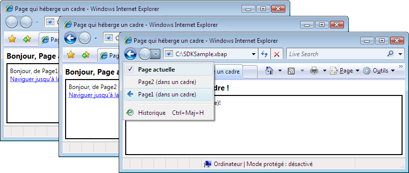  
  
 Vous ne devez pas seulement utiliser <xref:System.Windows.Controls.Frame> à l'intérieur du contenu d'une <xref:System.Windows.Controls.Page>.  Il est également commun d'héberger un <xref:System.Windows.Controls.Frame> à l'intérieur du contenu d'une <xref:System.Windows.Window>.  
  
 Par défaut, <xref:System.Windows.Controls.Frame> utilise seulement son propre journal en l'absence d'un autre journal.  Si un <xref:System.Windows.Controls.Frame> fait partie du contenu hébergé dans un <xref:System.Windows.Navigation.NavigationWindow> ou un [!INCLUDE[TLA2#tla_xbap](../../../../includes/tla2sharptla-xbap-md.md)], <xref:System.Windows.Controls.Frame> utilise le journal qui appartient au <xref:System.Windows.Navigation.NavigationWindow> ou à l'application [!INCLUDE[TLA2#tla_xbap](../../../../includes/tla2sharptla-xbap-md.md)]. Il arrive parfois qu'un <xref:System.Windows.Controls.Frame> doive être responsable de son propre journal.  Une raison pour ce faire est de permettre la navigation dans le journal à l'intérieur des pages hébergées par un <xref:System.Windows.Controls.Frame>.  L'exemple suivant illustre ce propos :  
  
 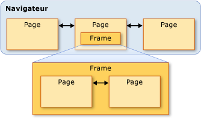  
  
 Dans ce cas, vous pouvez configurer le <xref:System.Windows.Controls.Frame> pour utiliser son propre journal en affectant à la propriété <xref:System.Windows.Controls.Frame.JournalOwnership%2A> du <xref:System.Windows.Controls.Frame> la valeur <xref:System.Windows.Navigation.JournalOwnership>.  Ce cas est illustré dans la balise suivante :  
  
 [!code-xml[NavigationOverviewSnippets#FrameHostPageOwnJournalXAML1](../../../../samples/snippets/csharp/VS_Snippets_Wpf/NavigationOverviewSnippets/CSharp/FrameHostPageOwnJournal.xaml#framehostpageownjournalxaml1)]  
[!code-xml[NavigationOverviewSnippets#FrameHostPageOwnJournalXAML2](../../../../samples/snippets/csharp/VS_Snippets_Wpf/NavigationOverviewSnippets/CSharp/FrameHostPageOwnJournal.xaml#framehostpageownjournalxaml2)]  
[!code-xml[NavigationOverviewSnippets#FrameHostPageOwnJournalXAML3](../../../../samples/snippets/csharp/VS_Snippets_Wpf/NavigationOverviewSnippets/CSharp/FrameHostPageOwnJournal.xaml#framehostpageownjournalxaml3)]  
  
 L'exemple suivant illustre l'effet de la navigation dans un <xref:System.Windows.Controls.Frame> qui utilise son propre journal.  
  
 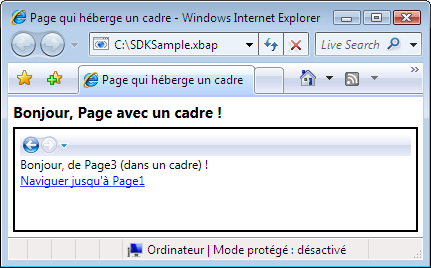  
  
 Remarquez que les entrées de journal sont affichées par l'[!INCLUDE[TLA2#tla_ui](../../../../includes/tla2sharptla-ui-md.md)] de navigation dans le <xref:System.Windows.Controls.Frame>, plutôt que par [!INCLUDE[TLA2#tla_ie](../../../../includes/tla2sharptla-ie-md.md)].  
  
> [!NOTE]
>  Si un <xref:System.Windows.Controls.Frame> fait partie du contenu hébergé dans une <xref:System.Windows.Window>, <xref:System.Windows.Controls.Frame> utilise son propre journal et, par conséquent, affiche sa propre [!INCLUDE[TLA2#tla_ui](../../../../includes/tla2sharptla-ui-md.md)] de navigation.  
  
 Si votre expérience utilisateur requiert qu'un <xref:System.Windows.Controls.Frame> fournisse son propre journal sans afficher l'[!INCLUDE[TLA2#tla_ui](../../../../includes/tla2sharptla-ui-md.md)] de navigation, vous pouvez masquer l'[!INCLUDE[TLA2#tla_ui](../../../../includes/tla2sharptla-ui-md.md)] de navigation en affectant à <xref:System.Windows.Controls.Frame.NavigationUIVisibility%2A> la valeur <xref:System.Windows.Visibility>.  Ce cas est illustré dans la balise suivante :  
  
 [!code-xml[NavigationOverviewSnippets#FrameHostPageHidesUIXAML1](../../../../samples/snippets/csharp/VS_Snippets_Wpf/NavigationOverviewSnippets/CSharp/FrameHostPageOwnHiddenJournal.xaml#framehostpagehidesuixaml1)]  
[!code-xml[NavigationOverviewSnippets#FrameHostPageHidesUIXAML2](../../../../samples/snippets/csharp/VS_Snippets_Wpf/NavigationOverviewSnippets/CSharp/FrameHostPageOwnHiddenJournal.xaml#framehostpagehidesuixaml2)]  
[!code-xml[NavigationOverviewSnippets#FrameHostPageHidesUIXAML3](../../../../samples/snippets/csharp/VS_Snippets_Wpf/NavigationOverviewSnippets/CSharp/FrameHostPageOwnHiddenJournal.xaml#framehostpagehidesuixaml3)]  
  
   
## Hôtes de navigation  
 <xref:System.Windows.Controls.Frame> et <xref:System.Windows.Navigation.NavigationWindow> sont des classes appelées hôtes de navigation.  Un *hôte de navigation* est une classe qui peut naviguer vers un contenu et l'afficher.  Pour ce faire, chaque hôte de navigation utilise son propre <xref:System.Windows.Navigation.NavigationService> et journal.  La construction de base d'un hôte de navigation est illustrée ci\-dessous.  
  
   
  
 Fondamentalement, cela permet à <xref:System.Windows.Navigation.NavigationWindow> et <xref:System.Windows.Controls.Frame> de fournir la même prise en charge de navigation qu'une application [!INCLUDE[TLA2#tla_xbap](../../../../includes/tla2sharptla-xbap-md.md)] lorsqu'elle est hébergée dans le navigateur.  
  
 Outre l'utilisation de <xref:System.Windows.Navigation.NavigationService> et d'un journal, les hôtes de navigation implémentent les mêmes membres que <xref:System.Windows.Navigation.NavigationService>.  L'exemple suivant illustre ce propos :  
  
 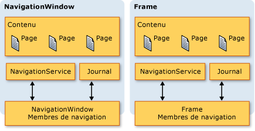  
  
 Cela vous permet de programmer la prise en charge de navigation directement sur eux.  Vous pouvez en tenir compte si vous devez fournir une [!INCLUDE[TLA2#tla_ui](../../../../includes/tla2sharptla-ui-md.md)] de navigation personnalisée pour un <xref:System.Windows.Controls.Frame> hébergé dans un <xref:System.Windows.Window>. De plus, les deux types implémentent des membres supplémentaires associés à la navigation, notamment `BackStack` \(<xref:System.Windows.Navigation.NavigationWindow.BackStack%2A?displayProperty=fullName>, <xref:System.Windows.Controls.Frame.BackStack%2A?displayProperty=fullName>\) et `ForwardStack` \(<xref:System.Windows.Navigation.NavigationWindow.ForwardStack%2A?displayProperty=fullName>, <xref:System.Windows.Controls.Frame.ForwardStack%2A?displayProperty=fullName>\), qui vous permettent d'énumérer les entrées de journal dans les piles Back et Forward respectivement.  
  
 Comme mentionné précédemment, plusieurs journaux peuvent exister dans une application.  L'exemple suivant illustre ce cas de figure.  
  
   
  
   
## Navigation vers un autre contenu que des pages XAML  
 Partout dans cette rubrique, <xref:System.Windows.Controls.Page> et les [!INCLUDE[TLA2#tla_xbap#plural](../../../../includes/tla2sharptla-xbapsharpplural-md.md)] à en\-tête pack ont été utilisés pour montrer les diverses fonctionnalités de navigation de [!INCLUDE[TLA2#tla_wpf](../../../../includes/tla2sharptla-wpf-md.md)].  Toutefois, une <xref:System.Windows.Controls.Page> compilée dans une application n'est pas le seul type de contenu vers lequel on peut naviguer et les [!INCLUDE[TLA2#tla_xbap#plural](../../../../includes/tla2sharptla-xbapsharpplural-md.md)] à en\-tête pack ne sont pas la seule méthode pour identifier un contenu.  
  
 Comme illustré dans cette section, vous pouvez également naviguer vers des fichiers [!INCLUDE[TLA2#tla_xaml](../../../../includes/tla2sharptla-xaml-md.md)] libre, des fichiers [!INCLUDE[TLA2#tla_html](../../../../includes/tla2sharptla-html-md.md)] et des objets.  
  
   
### Navigation vers des fichiers XAML libre  
 Un fichier [!INCLUDE[TLA2#tla_xaml](../../../../includes/tla2sharptla-xaml-md.md)] libre est un fichier présentant les caractéristiques suivantes :  
  
-   Il contient uniquement du langage [!INCLUDE[TLA2#tla_xaml](../../../../includes/tla2sharptla-xaml-md.md)] \(autrement dit, aucun code\).  
  
-   Il possède une déclaration d'espace de noms appropriée.  
  
-   Son nom de fichier possède une extension .xaml.  
  
 Par exemple, considérez le contenu suivant stocké comme un fichier [!INCLUDE[TLA2#tla_xaml](../../../../includes/tla2sharptla-xaml-md.md)] libre, Person.xaml.  
  
 [!code-xml[NavigationOverviewSnippets#LooseXAML](../../../../samples/snippets/csharp/VS_Snippets_Wpf/NavigationOverviewSnippets/CSharp/Person.xaml#loosexaml)]  
  
 Lorsque vous double\-cliquez sur le fichier, le navigateur s'ouvre et navigue vers son contenu qu'il affiche.  Ce cas est représenté dans l'illustration suivante :  
  
 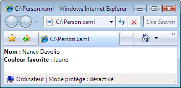  
  
 Vous pouvez afficher un fichier en [!INCLUDE[TLA2#tla_xaml](../../../../includes/tla2sharptla-xaml-md.md)] libre à partir des éléments suivants :  
  
-   Un site Web sur l'ordinateur local, l'intranet ou Internet.  
  
-   Un partage de fichiers [!INCLUDE[TLA#tla_unc](../../../../includes/tlasharptla-unc-md.md)].  
  
-   Le disque local.  
  
 Un fichier en [!INCLUDE[TLA2#tla_xaml](../../../../includes/tla2sharptla-xaml-md.md)] libre peut être ajouté aux favoris du navigateur ou constituer la page d'accueil du navigateur.  
  
> [!NOTE]
>  Pour plus d'informations sur la publication et le lancement de pages en [!INCLUDE[TLA2#tla_xaml](../../../../includes/tla2sharptla-xaml-md.md)] libre, consultez [Déploiement d'une application WPF](../../../../docs/framework/wpf/app-development/deploying-a-wpf-application-wpf.md).  
  
 Une limitation relative au [!INCLUDE[TLA2#tla_xaml](../../../../includes/tla2sharptla-xaml-md.md)] libre est que vous pouvez uniquement héberger du contenu exécutable à un niveau de confiance partielle.  Par exemple, `Window` ne peut pas être l'élément racine d'un fichier en [!INCLUDE[TLA2#tla_xaml](../../../../includes/tla2sharptla-xaml-md.md)] libre.  Pour plus d'informations, consultez [Sécurité de confiance partielle de WPF](../../../../docs/framework/wpf/wpf-partial-trust-security.md).  
  
   
### Navigation vers des fichiers HTML à l'aide d'un Frame  
 Comme vous pouvez vous y attendre, vous pouvez également naviguer vers des fichiers [!INCLUDE[TLA2#tla_html](../../../../includes/tla2sharptla-html-md.md)].  Vous devez simplement fournir un [!INCLUDE[TLA2#tla_uri](../../../../includes/tla2sharptla-uri-md.md)] qui utilise la méthode http.  Par exemple, le [!INCLUDE[TLA2#tla_xaml](../../../../includes/tla2sharptla-xaml-md.md)] suivant montre un <xref:System.Windows.Controls.Frame> qui navigue vers une page [!INCLUDE[TLA2#tla_html](../../../../includes/tla2sharptla-html-md.md)].  
  
 [!code-xml[NavigationOverviewSnippets#FrameHtmlNavMARKUP](../../../../samples/snippets/csharp/VS_Snippets_Wpf/NavigationOverviewSnippets/CSharp/FrameHTMLNavPage.xaml#framehtmlnavmarkup)]  
  
 La navigation vers du contenu [!INCLUDE[TLA2#tla_html](../../../../includes/tla2sharptla-html-md.md)] requiert des autorisations spéciales.  Par exemple, vous ne pouvez pas naviguer à partir d'une application [!INCLUDE[TLA2#tla_xbap](../../../../includes/tla2sharptla-xbap-md.md)] qui s'exécute dans le bac à sable \(sandbox\) de sécurité de confiance partielle de la zone Internet. Pour plus d'informations, consultez [Sécurité de confiance partielle de WPF](../../../../docs/framework/wpf/wpf-partial-trust-security.md).  
  
   
### Navigation vers des fichiers HTML à l'aide du contrôle WebBrowser  
 Le contrôle <xref:System.Windows.Controls.WebBrowser> prend en charge l'hébergement de document [!INCLUDE[TLA2#tla_html](../../../../includes/tla2sharptla-html-md.md)], la navigation et l'interopérabilité de script\/code managé.  Pour plus d'informations sur le contrôle <xref:System.Windows.Controls.WebBrowser>, consultez <xref:System.Windows.Controls.WebBrowser>.  
  
 Comme pour <xref:System.Windows.Controls.Frame>, la navigation vers le [!INCLUDE[TLA2#tla_html](../../../../includes/tla2sharptla-html-md.md)] à l'aide de <xref:System.Windows.Controls.WebBrowser> requiert des autorisations spéciales.  Par exemple, à partir d'une application de confiance partielle, vous ne pouvez naviguer que vers le [!INCLUDE[TLA2#tla_html](../../../../includes/tla2sharptla-html-md.md)] se trouvant sur le site d'origine.  Pour plus d'informations, consultez [Sécurité de confiance partielle de WPF](../../../../docs/framework/wpf/wpf-partial-trust-security.md).  
  
   
### Navigation vers des objets personnalisés  
 Si vous avez des données stockées comme objets personnalisés, une façon d'afficher ces données est de créer une <xref:System.Windows.Controls.Page> avec un contenu lié à ces objets \(consultez [Vue d'ensemble de la liaison de données](../../../../docs/framework/wpf/data/data-binding-overview.md)\).  Si vous n'avez pas besoin de la charge additionnelle liée à la création d'une page entière simplement pour afficher les objets, vous pouvez naviguer directement vers eux à la place.  
  
 Considérez la classe `Person` implémentée dans le code suivant.  
  
 [!code-csharp[NavigateToObjectSnippets#PersonClassCODE](../../../../samples/snippets/csharp/VS_Snippets_Wpf/NavigateToObjectSnippets/CSharp/Person.cs#personclasscode)]
 [!code-vb[NavigateToObjectSnippets#PersonClassCODE](../../../../samples/snippets/visualbasic/VS_Snippets_Wpf/NavigateToObjectSnippets/VisualBasic/Person.vb#personclasscode)]  
  
 Pour naviguer vers elle, vous appelez la méthode <xref:System.Windows.Navigation.NavigationWindow.Navigate%2A?displayProperty=fullName>, comme indiqué dans le code suivant.  
  
 [!code-xml[NavigateToObjectSnippets#PageThatNavsToObject1](../../../../samples/snippets/csharp/VS_Snippets_Wpf/NavigateToObjectSnippets/CSharp/HomePage.xaml#pagethatnavstoobject1)]  
[!code-xml[NavigateToObjectSnippets#PageThatNavsToObject2](../../../../samples/snippets/csharp/VS_Snippets_Wpf/NavigateToObjectSnippets/CSharp/HomePage.xaml#pagethatnavstoobject2)]  
[!code-xml[NavigateToObjectSnippets#PageThatNavsToObject3](../../../../samples/snippets/csharp/VS_Snippets_Wpf/NavigateToObjectSnippets/CSharp/HomePage.xaml#pagethatnavstoobject3)]  
  
 [!code-csharp[NavigateToObjectSnippets#PageThatNavsToObjectCODEBEHIND](../../../../samples/snippets/csharp/VS_Snippets_Wpf/NavigateToObjectSnippets/CSharp/HomePage.xaml.cs#pagethatnavstoobjectcodebehind)]
 [!code-vb[NavigateToObjectSnippets#PageThatNavsToObjectCODEBEHIND](../../../../samples/snippets/visualbasic/VS_Snippets_Wpf/NavigateToObjectSnippets/VisualBasic/HomePage.xaml.vb#pagethatnavstoobjectcodebehind)]  
  
 L'illustration suivante affiche le résultat.  
  
 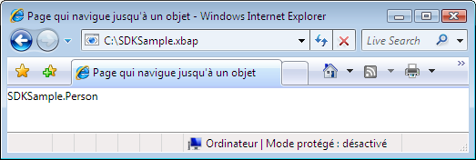  
  
 Dans cette illustration, vous pouvez voir que rien d'utile n'est affiché.  En fait, la valeur affichée est la valeur de retour de la méthode `ToString` pour l'objet **Person** ; par défaut, c'est la seule valeur que [!INCLUDE[TLA2#tla_wpf](../../../../includes/tla2sharptla-wpf-md.md)] peut utiliser pour représenter votre objet.  Vous pourriez remplacer la méthode `ToString` pour retourner des informations plus explicites, bien qu'il ne s'agira encore que d'une valeur de chaîne.  Une autre technique permettant de tirer partir des fonctionnalités de présentation de [!INCLUDE[TLA2#tla_wpf](../../../../includes/tla2sharptla-wpf-md.md)] consiste à utiliser un modèle de données.  Vous pouvez implémenter un modèle de données que [!INCLUDE[TLA2#tla_wpf](../../../../includes/tla2sharptla-wpf-md.md)] peut associer à un objet d'un type particulier.  Le code suivant montre un modèle de données pour l'objet `Person`.  
  
 [!code-xml[NavigateToObjectSnippets#DataTemplateMARKUP](../../../../samples/snippets/csharp/VS_Snippets_Wpf/NavigateToObjectSnippets/CSharp/App.xaml#datatemplatemarkup)]  
  
 Ici, le modèle de données est associé au type `Person` en utilisant l'extension de balisage `x:Type` dans l'attribut `DataType`.  Le modèle de données lie ensuite des éléments `TextBlock` \(consultez <xref:System.Windows.Controls.TextBlock>\) aux propriétés de la classe `Person`.  L'illustration suivante montre l'apparence de l'objet `Person` après mise à jour.  
  
 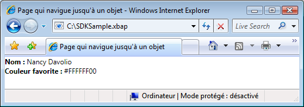  
  
 Un des avantages de cette technique est de pouvoir afficher vos objets de manière cohérente en tout point de votre application grâce à la réutilisation du modèle de données.  
  
 Pour plus d'informations sur les modèles de données, consultez [Vue d'ensemble des modèles de données](../../../../docs/framework/wpf/data/data-templating-overview.md).  
  
   
## Sécurité  
 La prise en charge de la navigation [!INCLUDE[TLA2#tla_wpf](../../../../includes/tla2sharptla-wpf-md.md)] permet de naviguer dans les applications [!INCLUDE[TLA2#tla_xbap#plural](../../../../includes/tla2sharptla-xbapsharpplural-md.md)] sur Internet et permet aux applications d'héberger du contenu tiers.  Pour protéger les applications et les utilisateurs de comportements malfaisants, [!INCLUDE[TLA2#tla_wpf](../../../../includes/tla2sharptla-wpf-md.md)] fournit diverses fonctionnalités de sécurité couvertes dans [Sécurité](../../../../docs/framework/wpf/security-wpf.md) et [Sécurité de confiance partielle de WPF](../../../../docs/framework/wpf/wpf-partial-trust-security.md).  
  
## Voir aussi  
 <xref:System.Windows.Application.SetCookie%2A>   
 <xref:System.Windows.Application.GetCookie%2A>   
 [Vue d'ensemble de la gestion d'applications](../../../../docs/framework/wpf/app-development/application-management-overview.md)   
 [URI à en\-tête pack dans WPF](../../../../docs/framework/wpf/app-development/pack-uris-in-wpf.md)   
 [Vue d'ensemble de la navigation structurée](../../../../docs/framework/wpf/app-development/structured-navigation-overview.md)   
 [Vue d'ensemble des topologies de navigation](../../../../docs/framework/wpf/app-development/navigation-topologies-overview.md)   
 [Rubriques Comment](../../../../docs/framework/wpf/app-development/navigation-how-to-topics.md)   
 [Déploiement d'une application WPF](../../../../docs/framework/wpf/app-development/deploying-a-wpf-application-wpf.md)