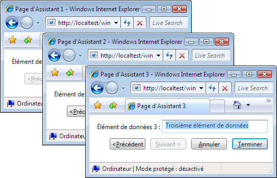
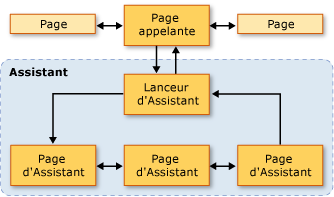
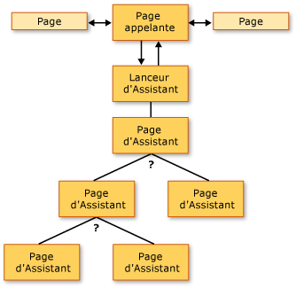
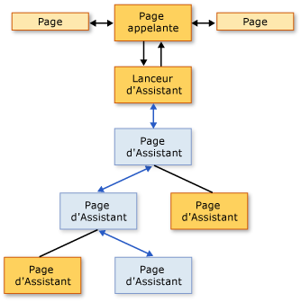
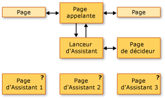
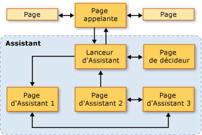

# Vue d&#39;ensemble des topologies de navigation
 Cette vue d'ensemble fournit une introduction aux topologies de navigation dans [!INCLUDE[TLA2#tla_wpf](../../../../includes/tla2sharptla-wpf-md.md)].  Trois topologies de navigation courantes, avec les exemples, sont abordées par la suite.  
  
> [!NOTE]
>  Avant de lire cette rubrique, vous devez être familiarisé avec le concept de navigation structurée dans [!INCLUDE[TLA2#tla_wpf](../../../../includes/tla2sharptla-wpf-md.md)] à l'aide de fonctions de page.  Pour plus d'informations sur ces deux rubriques, consultez [Vue d'ensemble de la navigation structurée](../../../../docs/framework/wpf/app-development/structured-navigation-overview.md).  
  
 Cette rubrique contient les sections suivantes :  
  
-   [Topologies de navigation](#Navigation_Topologies)  
  
-   [Topologies de navigation structurées](#Structured_Navigation_Topologies)  
  
-   [Navigation sur une topologie linéaire fixe](#Navigation_over_a_Fixed_Linear_Topology)  
  
-   [Navigation dynamique sur une topologie hiérarchique fixe](#Dynamic_Navigation_over_a_Fixed_Hierarchical_Topology)  
  
-   [Navigation dans une topologie générée dynamiquement](#Navigation_over_a_Dynamically_Generated_Topology)  
  
   
## Topologies de navigation  
 Dans [!INCLUDE[TLA2#tla_wpf](../../../../includes/tla2sharptla-wpf-md.md)], la navigation se compose en général de pages \(<xref:System.Windows.Controls.Page>\) avec des liens hypertexte \(<xref:System.Windows.Documents.Hyperlink>\) qui naviguent jusqu'à d'autres pages s'ils sont activés.  Les pages accédées sont identifiées par des [!INCLUDE[TLA#tla_uri#plural](../../../../includes/tlasharptla-urisharpplural-md.md)] \(voir [URI à en\-tête pack dans WPF](../../../../docs/framework/wpf/app-development/pack-uris-in-wpf.md)\).  Considérez l'exemple simple suivant qui montre des pages, des liens hypertexte et des [!INCLUDE[TLA#tla_uri#plural](../../../../includes/tlasharptla-urisharpplural-md.md)] :  
  
 [!code-xml[NavigationTopologiesOverviewSnippets#Page1](../../../../samples/snippets/csharp/VS_Snippets_Wpf/NavigationTopologiesOverviewSnippets/CS/Page1.xaml#page1)]  
  
 [!code-xml[NavigationTopologiesOverviewSnippets#Page2](../../../../samples/snippets/csharp/VS_Snippets_Wpf/NavigationTopologiesOverviewSnippets/CS/Page2.xaml#page2)]  
  
 Ces pages sont réorganisées dans une *topologie de navigation* dont la structure est déterminée en fonction de la façon dont vous pouvez naviguer entre les pages.  Cette topologie de navigation particulière est appropriée dans les scénarios simples, bien que la navigation puisse nécessiter davantage de topologies complexes, dont certaines peuvent être définies uniquement lorsqu'une application s'exécute.  
  
 Cette rubrique couvre trois topologies de navigation courantes : *linéaire fixe*, *hiérarchique fixe* et *générée dynamiquement*.  Chaque topologie de navigation est montrée avec un exemple qui a un [!INCLUDE[TLA2#tla_ui](../../../../includes/tla2sharptla-ui-md.md)] comme celui affiché dans l'illustration suivante :  
  
   
  
   
## Topologies de navigation structurées  
 Il existe deux types courants de topologies de navigation :  
  
-   **Topologie fixe** : définie au moment de la compilation et ne change pas au moment de l'exécution.  Les topologies fixes sont utiles pour la navigation à travers une séquence fixe de pages dans un ordre linéaire ou hiérarchique.  
  
-   **Topologie dynamique** : définie au moment de l'exécution selon les entrées collectées par l'utilisateur, l'application ou le système.  Les topologies dynamiques sont utiles lorsque les pages peuvent être accédées dans des séquences différentes.  
  
 Bien qu'il soit possible de créer des topologies de navigation à l'aide de pages, les exemples utilisent des fonctions de page car elles fournissent une prise en charge supplémentaire qui simplifie la prise en charge du transfert et du retour des données à travers les pages d'une topologie.  
  
   
## Navigation sur une topologie linéaire fixe  
 Une topologie linéaire fixe est analogue à la structure d'un Assistant qui a une ou plusieurs pages de l'assistant qui sont accédées dans une séquence fixe.  L'illustration suivante montre la structure et le flux de niveau supérieur d'un Assistant avec une topologie linéaire fixe.  
  
   
  
 Les comportements types pour naviguer sur une topologie linéaire fixe incluent les éléments suivants :  
  
-   Navigation depuis la page appelante jusqu'à une page de lancement qui initialise l'Assistant et navigue jusqu'à la première page de l'Assistant.  Une page de lancement \(un [!INCLUDE[TLA2#tla_ui](../../../../includes/tla2sharptla-ui-md.md)]\- moins <xref:System.Windows.Navigation.PageFunction%601>\) n'est pas requise, car une page appelante peut appeler la première page de l'Assistant directement.  L'utilisation d'une page de lancement peut néanmoins simplifier l'initialisation de l'Assistant, en particulier si l'initialisation est complexe.  
  
-   Les utilisateurs peuvent naviguer entre les pages en utilisant les boutons Précédent et Suivant \(ou des liens hypertexte\).  
  
-   Les utilisateurs peuvent naviguer entre les pages à l'aide du journal.  
  
-   Les utilisateurs peuvent annuler l'Assistant depuis n'importe quelle page de l'Assistant en appuyant sur le bouton Annuler.  
  
-   Les utilisateurs peuvent accepter l'Assistant sur la dernière page de l'Assistant en appuyant sur le bouton Terminer.  
  
-   Si un Assistant est annulé, l'Assistant retourne un résultat approprié et ne retourne aucune donnée.  
  
-   Si un utilisateur accepte un Assistant, l'Assistant retourne un résultat approprié et retourne les données qu'il a collectées.  
  
-   Lorsque l'Assistant est terminé \(accepté ou annulé\), les pages que l'Assistant comporte sont supprimées du journal.  Cela garde chaque instance de l'Assistant isolée, en évitant de cette façon des anomalies de données ou d'état potentielles.  
  
   
## Navigation dynamique sur une topologie hiérarchique fixe  
 Dans certaines applications, les pages autorisent la navigation à deux autres pages ou plus, comme illustré dans la figure suivante.  
  
   
  
 Cette structure est connue comme une topologie hiérarchique fixe, et la séquence dans laquelle la hiérarchie est parcourue est souvent déterminée au moment de l'exécution par l'application ou l'utilisateur.  Au moment de l'exécution, chaque page dans la hiérarchie qui autorise la navigation à deux autres pages ou plus rassemble les données nécessaires pour déterminer sur quelle page naviguer.  La figure suivante illustre l'une des nombreuses séquences de navigation possibles en fonction de la figure précédente.  
  
   
  
 Bien que la séquence dans laquelle les pages dans une structure hiérarchique fixe sont accédées soit déterminée au moment de l'exécution, l'expérience utilisateur est la même que pour une topologie linéaire fixe :  
  
-   Navigation depuis la page appelante jusqu'à une page de lancement qui initialise l'Assistant et navigue jusqu'à la première page de l'Assistant.  Une page de lancement \(un [!INCLUDE[TLA2#tla_ui](../../../../includes/tla2sharptla-ui-md.md)]\- moins <xref:System.Windows.Navigation.PageFunction%601>\) n'est pas requise, car une page appelante peut appeler la première page de l'Assistant directement.  L'utilisation d'une page de lancement peut néanmoins simplifier l'initialisation de l'Assistant, en particulier si l'initialisation est complexe.  
  
-   Les utilisateurs peuvent naviguer entre les pages en utilisant les boutons Précédent et Suivant \(ou des liens hypertexte\).  
  
-   Les utilisateurs peuvent naviguer entre les pages à l'aide du journal.  
  
-   Les utilisateurs peuvent modifier la séquence de navigation s'ils naviguent en arrière par le biais du journal.  
  
-   Les utilisateurs peuvent annuler l'Assistant depuis n'importe quelle page de l'Assistant en appuyant sur le bouton Annuler.  
  
-   Les utilisateurs peuvent accepter l'Assistant sur la dernière page de l'Assistant en appuyant sur le bouton Terminer.  
  
-   Si un Assistant est annulé, l'Assistant retourne un résultat approprié et ne retourne aucune donnée.  
  
-   Si un utilisateur accepte un Assistant, l'Assistant retourne un résultat approprié et retourne les données qu'il a collectées.  
  
-   Lorsque l'Assistant est terminé \(accepté ou annulé\), les pages que l'Assistant comporte sont supprimées du journal.  Cela garde chaque instance de l'Assistant isolée, en évitant de cette façon des anomalies de données ou d'état potentielles.  
  
   
## Navigation dans une topologie générée dynamiquement  
 Dans certaines applications, la séquence dans laquelle deux pages ou plus sont accédées peut uniquement être déterminée au moment de l'exécution par l'utilisateur, l'application ou des données externes.  La figure suivante illustre un jeu de pages avec une séquence de navigation indéterminée.  
  
   
  
 La figure suivante illustre une séquence de navigation choisie par l'utilisateur au moment de l'exécution.  
  
   
  
 La séquence de navigation est connue comme une topologie générée dynamiquement.  Pour l'utilisateur, comme avec les autres topologies de navigation, l'expérience utilisateur est la même que pour les topologies précédentes :  
  
-   Navigation depuis la page appelante jusqu'à une page de lancement qui initialise l'Assistant et navigue jusqu'à la première page de l'Assistant.  Une page de lancement \(un [!INCLUDE[TLA2#tla_ui](../../../../includes/tla2sharptla-ui-md.md)]\- moins <xref:System.Windows.Navigation.PageFunction%601>\) n'est pas requise, car une page appelante peut appeler la première page de l'Assistant directement.  L'utilisation d'une page de lancement peut néanmoins simplifier l'initialisation de l'Assistant, en particulier si l'initialisation est complexe.  
  
-   Les utilisateurs peuvent naviguer entre les pages en utilisant les boutons Précédent et Suivant \(ou des liens hypertexte\).  
  
-   Les utilisateurs peuvent naviguer entre les pages à l'aide du journal.  
  
-   Les utilisateurs peuvent annuler l'Assistant depuis n'importe quelle page de l'Assistant en appuyant sur le bouton Annuler.  
  
-   Les utilisateurs peuvent accepter l'Assistant sur la dernière page de l'Assistant en appuyant sur le bouton Terminer.  
  
-   Si un Assistant est annulé, l'Assistant retourne un résultat approprié et ne retourne aucune donnée.  
  
-   Si un utilisateur accepte un Assistant, l'Assistant retourne un résultat approprié et retourne les données qu'il a collectées.  
  
-   Lorsque l'Assistant est terminé \(accepté ou annulé\), les pages que l'Assistant comporte sont supprimées du journal.  Cela garde chaque instance de l'Assistant isolée, en évitant de cette façon des anomalies de données ou d'état potentielles.  
  
## Voir aussi  
 <xref:System.Windows.Controls.Page>   
 <xref:System.Windows.Navigation.PageFunction%601>   
 <xref:System.Windows.Navigation.NavigationService>   
 [Vue d'ensemble de la navigation structurée](../../../../docs/framework/wpf/app-development/structured-navigation-overview.md)