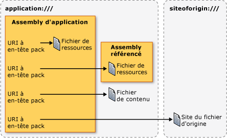

# <a name="pack-uris-in-wpf"></a><span data-ttu-id="4ac46-102">URI à en-tête pack dans WPF</span><span class="sxs-lookup"><span data-stu-id="4ac46-102">Pack URIs in WPF</span></span>
<span data-ttu-id="4ac46-103">Dans [!INCLUDE[TLA#tla_wpf](../../../../includes/tlasharptla-wpf-md.md)], [!INCLUDE[TLA#tla_uri#plural](../../../../includes/tlasharptla-urisharpplural-md.md)] sont utilisées pour identifier et charger des fichiers de nombreuses manières, notamment les suivantes :</span><span class="sxs-lookup"><span data-stu-id="4ac46-103">In [!INCLUDE[TLA#tla_wpf](../../../../includes/tlasharptla-wpf-md.md)], [!INCLUDE[TLA#tla_uri#plural](../../../../includes/tlasharptla-urisharpplural-md.md)] are used to identify and load files in many ways, including the following:</span></span>  
  
-   <span data-ttu-id="4ac46-104">En spécifiant le [!INCLUDE[TLA#tla_ui](../../../../includes/tlasharptla-ui-md.md)] à afficher lorsqu’une application démarre.</span><span class="sxs-lookup"><span data-stu-id="4ac46-104">Specifying the [!INCLUDE[TLA#tla_ui](../../../../includes/tlasharptla-ui-md.md)] to show when an application first starts.</span></span>  
  
-   <span data-ttu-id="4ac46-105">En chargeant des images</span><span class="sxs-lookup"><span data-stu-id="4ac46-105">Loading images.</span></span>  
  
-   <span data-ttu-id="4ac46-106">En naviguant vers des pages</span><span class="sxs-lookup"><span data-stu-id="4ac46-106">Navigating to pages.</span></span>  
  
-   <span data-ttu-id="4ac46-107">En chargeant des fichiers de données non exécutables</span><span class="sxs-lookup"><span data-stu-id="4ac46-107">Loading non-executable data files.</span></span>  
  
 <span data-ttu-id="4ac46-108">En outre, [!INCLUDE[TLA2#tla_uri#plural](../../../../includes/tla2sharptla-urisharpplural-md.md)] peut être utilisé pour identifier et charger des fichiers à partir de différents emplacements, notamment les suivantes :</span><span class="sxs-lookup"><span data-stu-id="4ac46-108">Furthermore, [!INCLUDE[TLA2#tla_uri#plural](../../../../includes/tla2sharptla-urisharpplural-md.md)] can be used to identify and load files from a variety of locations, including the following:</span></span>  
  
-   <span data-ttu-id="4ac46-109">L’assembly actuel</span><span class="sxs-lookup"><span data-stu-id="4ac46-109">The current assembly.</span></span>  
  
-   <span data-ttu-id="4ac46-110">Un assembly référencé</span><span class="sxs-lookup"><span data-stu-id="4ac46-110">A referenced assembly.</span></span>  
  
-   <span data-ttu-id="4ac46-111">Un emplacement relatif à un assembly</span><span class="sxs-lookup"><span data-stu-id="4ac46-111">A location relative to an assembly.</span></span>  
  
-   <span data-ttu-id="4ac46-112">Le site d’origine de l’application</span><span class="sxs-lookup"><span data-stu-id="4ac46-112">The application's site of origin.</span></span>  
  
 <span data-ttu-id="4ac46-113">Pour fournir un mécanisme cohérent d’identification et le chargement de ces types de fichiers à partir de ces emplacements, [!INCLUDE[TLA2#tla_wpf](../../../../includes/tla2sharptla-wpf-md.md)] tire parti de l’extensibilité de la *schéma d’URI pack*.</span><span class="sxs-lookup"><span data-stu-id="4ac46-113">To provide a consistent mechanism for identifying and loading these types of files from these locations, [!INCLUDE[TLA2#tla_wpf](../../../../includes/tla2sharptla-wpf-md.md)] leverages the extensibility of the *pack URI scheme*.</span></span> <span data-ttu-id="4ac46-114">Cette rubrique fournit une vue d’ensemble du schéma, explique comment construire le pack [!INCLUDE[TLA2#tla_uri#plural](../../../../includes/tla2sharptla-urisharpplural-md.md)] pour une variété de scénarios, explique absolute et relative [!INCLUDE[TLA2#tla_uri#plural](../../../../includes/tla2sharptla-urisharpplural-md.md)] et [!INCLUDE[TLA2#tla_uri](../../../../includes/tla2sharptla-uri-md.md)] résolution, avant l’affichage de l’utilisation du pack [!INCLUDE[TLA2#tla_uri#plural](../../../../includes/tla2sharptla-urisharpplural-md.md)] à partir de deux marques et le code.</span><span class="sxs-lookup"><span data-stu-id="4ac46-114">This topic provides an overview of the scheme, covers how to construct pack [!INCLUDE[TLA2#tla_uri#plural](../../../../includes/tla2sharptla-urisharpplural-md.md)] for a variety of scenarios, discusses absolute and relative [!INCLUDE[TLA2#tla_uri#plural](../../../../includes/tla2sharptla-urisharpplural-md.md)] and [!INCLUDE[TLA2#tla_uri](../../../../includes/tla2sharptla-uri-md.md)] resolution, before showing how to use pack [!INCLUDE[TLA2#tla_uri#plural](../../../../includes/tla2sharptla-urisharpplural-md.md)] from both markup and code.</span></span>  
  
  
<a name="The_Pack_URI_Scheme"></a>   
## <a name="the-pack-uri-scheme"></a><span data-ttu-id="4ac46-115">Schéma URI à en-tête pack</span><span class="sxs-lookup"><span data-stu-id="4ac46-115">The Pack URI Scheme</span></span>  
 <span data-ttu-id="4ac46-116">Le pack [!INCLUDE[TLA2#tla_uri](../../../../includes/tla2sharptla-uri-md.md)] schéma est utilisé par le [Open Packaging Conventions](http://go.microsoft.com/fwlink/?LinkID=71255) spécification (OPC), qui décrit un modèle pour organiser et identifier le contenu.</span><span class="sxs-lookup"><span data-stu-id="4ac46-116">The pack [!INCLUDE[TLA2#tla_uri](../../../../includes/tla2sharptla-uri-md.md)] scheme is used by the [Open Packaging Conventions](http://go.microsoft.com/fwlink/?LinkID=71255) (OPC) specification, which describes a model for organizing and identifying content.</span></span> <span data-ttu-id="4ac46-117">Les éléments clés de ce modèle sont des packages et des parties, où un *package* est un conteneur logique pour un ou plus logique *parties*.</span><span class="sxs-lookup"><span data-stu-id="4ac46-117">The key elements of this model are packages and parts, where a *package* is a logical container for one or more logical *parts*.</span></span> <span data-ttu-id="4ac46-118">La figure suivante illustre ce concept.</span><span class="sxs-lookup"><span data-stu-id="4ac46-118">The following figure illustrates this concept.</span></span>  
  
 <span data-ttu-id="4ac46-119"></span><span class="sxs-lookup"><span data-stu-id="4ac46-119"></span></span>  
  
 <span data-ttu-id="4ac46-120">Pour identifier les parties, la spécification OPC tire parti de l’extensibilité de la RFC 2396 (identificateurs de ressource uniforme (URI) : syntaxe générique) pour définir le pack [!INCLUDE[TLA2#tla_uri](../../../../includes/tla2sharptla-uri-md.md)] schéma.</span><span class="sxs-lookup"><span data-stu-id="4ac46-120">To identify parts, the OPC specification leverages the extensibility of RFC 2396 (Uniform Resource Identifiers (URI): Generic Syntax) to define the pack [!INCLUDE[TLA2#tla_uri](../../../../includes/tla2sharptla-uri-md.md)] scheme.</span></span>  
  
 <span data-ttu-id="4ac46-121">Le schéma qui est spécifié par un [!INCLUDE[TLA2#tla_uri](../../../../includes/tla2sharptla-uri-md.md)] est défini par son préfixe ; http, ftp et file sont des exemples connus.</span><span class="sxs-lookup"><span data-stu-id="4ac46-121">The scheme that is specified by a [!INCLUDE[TLA2#tla_uri](../../../../includes/tla2sharptla-uri-md.md)] is defined by its prefix; http, ftp, and file are well-known examples.</span></span> <span data-ttu-id="4ac46-122">Le pack [!INCLUDE[TLA2#tla_uri](../../../../includes/tla2sharptla-uri-md.md)] schéma utilise « pack » comme modèle et contient deux composants : autorité et chemin d’accès.</span><span class="sxs-lookup"><span data-stu-id="4ac46-122">The pack [!INCLUDE[TLA2#tla_uri](../../../../includes/tla2sharptla-uri-md.md)] scheme uses "pack" as its scheme, and contains two components: authority and path.</span></span> <span data-ttu-id="4ac46-123">Voici le format d’un Pack de [!INCLUDE[TLA2#tla_uri](../../../../includes/tla2sharptla-uri-md.md)].</span><span class="sxs-lookup"><span data-stu-id="4ac46-123">The following is the format for a pack [!INCLUDE[TLA2#tla_uri](../../../../includes/tla2sharptla-uri-md.md)].</span></span>  
  
 <span data-ttu-id="4ac46-124">Pack : / /*autorité*/*chemin d’accès*</span><span class="sxs-lookup"><span data-stu-id="4ac46-124">pack://*authority*/*path*</span></span>
  
 <span data-ttu-id="4ac46-125">Le *autorité* Spécifie le type de package contenant une partie, tandis que la *chemin d’accès* Spécifie l’emplacement d’une partie dans un package.</span><span class="sxs-lookup"><span data-stu-id="4ac46-125">The *authority* specifies the type of package that a part is contained by, while the *path* specifies the location of a part within a package.</span></span>  
  
 <span data-ttu-id="4ac46-126">Ce concept est illustré par le figure suivante :</span><span class="sxs-lookup"><span data-stu-id="4ac46-126">This concept is illustrated by the following figure:</span></span>  
  
 <span data-ttu-id="4ac46-127"></span><span class="sxs-lookup"><span data-stu-id="4ac46-127"></span></span>  
  
 <span data-ttu-id="4ac46-128">Les packages et les parties s’apparentent à des applications et des fichiers, où une application (package) peut inclure un ou plusieurs fichiers (parties), notamment :</span><span class="sxs-lookup"><span data-stu-id="4ac46-128">Packages and parts are analogous to applications and files, where an application (package) can include one or more files (parts), including:</span></span>  
  
-   <span data-ttu-id="4ac46-129">Des fichiers de ressources compilés dans l’assembly local</span><span class="sxs-lookup"><span data-stu-id="4ac46-129">Resource files that are compiled into the local assembly.</span></span>  
  
-   <span data-ttu-id="4ac46-130">Des fichiers de ressources compilés dans un assembly référencé</span><span class="sxs-lookup"><span data-stu-id="4ac46-130">Resource files that are compiled into a referenced assembly.</span></span>  
  
-   <span data-ttu-id="4ac46-131">Des fichiers de ressources compilés dans un assembly de référence</span><span class="sxs-lookup"><span data-stu-id="4ac46-131">Resource files that are compiled into a referencing assembly.</span></span>  
  
-   <span data-ttu-id="4ac46-132">Des fichiers de contenu</span><span class="sxs-lookup"><span data-stu-id="4ac46-132">Content files.</span></span>  
  
-   <span data-ttu-id="4ac46-133">Des fichiers de site d’origine</span><span class="sxs-lookup"><span data-stu-id="4ac46-133">Site of origin files.</span></span>  
  
 <span data-ttu-id="4ac46-134">Pour accéder à ces types de fichiers, [!INCLUDE[TLA2#tla_wpf](../../../../includes/tla2sharptla-wpf-md.md)] prend en charge deux autorités : application : / / / et siteoforigin : / / /.</span><span class="sxs-lookup"><span data-stu-id="4ac46-134">To access these types of files, [!INCLUDE[TLA2#tla_wpf](../../../../includes/tla2sharptla-wpf-md.md)] supports two authorities: application:/// and siteoforigin:///.</span></span> <span data-ttu-id="4ac46-135">L’autorité application:/// identifie les fichiers de données d’application qui sont connus au moment de la compilation, notamment les fichiers de ressources et de contenu.</span><span class="sxs-lookup"><span data-stu-id="4ac46-135">The application:/// authority identifies application data files that are known at compile time, including resource and content files.</span></span> <span data-ttu-id="4ac46-136">L’autorité siteoforigin:/// identifie les fichiers de site d’origine.</span><span class="sxs-lookup"><span data-stu-id="4ac46-136">The siteoforigin:/// authority identifies site of origin files.</span></span> <span data-ttu-id="4ac46-137">La portée de chaque autorité est indiquée dans la figure suivante.</span><span class="sxs-lookup"><span data-stu-id="4ac46-137">The scope of each authority is shown in the following figure.</span></span>  
  
 <span data-ttu-id="4ac46-138"></span><span class="sxs-lookup"><span data-stu-id="4ac46-138"></span></span>  
  
> [!NOTE]
>  <span data-ttu-id="4ac46-139">Le composant d’autorité d’un Pack de [!INCLUDE[TLA2#tla_uri](../../../../includes/tla2sharptla-uri-md.md)] est incorporé [!INCLUDE[TLA2#tla_uri](../../../../includes/tla2sharptla-uri-md.md)] qui pointe vers un package et doit être conforme à RFC 2396.</span><span class="sxs-lookup"><span data-stu-id="4ac46-139">The authority component of a pack [!INCLUDE[TLA2#tla_uri](../../../../includes/tla2sharptla-uri-md.md)] is an embedded [!INCLUDE[TLA2#tla_uri](../../../../includes/tla2sharptla-uri-md.md)] that points to a package and must conform to RFC 2396.</span></span> <span data-ttu-id="4ac46-140">De plus, le caractère « / » doit être remplacé par le caractère « , » et les caractères réservés tels que « % » et « ? » doivent être échappés.</span><span class="sxs-lookup"><span data-stu-id="4ac46-140">Additionally, the "/" character must be replaced with the "," character, and reserved characters such as "%" and "?" must be escaped.</span></span> <span data-ttu-id="4ac46-141">Pour plus d’informations, consultez l’OPC.</span><span class="sxs-lookup"><span data-stu-id="4ac46-141">See the OPC for details.</span></span>  
  
 <span data-ttu-id="4ac46-142">Les sections suivantes expliquent comment construire pack [!INCLUDE[TLA2#tla_uri#plural](../../../../includes/tla2sharptla-urisharpplural-md.md)] à l’aide de ces deux autorités conjointement avec les chemins d’accès appropriés pour identifier les ressources, de contenu et de site des fichiers d’origine.</span><span class="sxs-lookup"><span data-stu-id="4ac46-142">The following sections explain how to construct pack [!INCLUDE[TLA2#tla_uri#plural](../../../../includes/tla2sharptla-urisharpplural-md.md)] using these two authorities in conjunction with the appropriate paths for identifying resource, content, and site of origin files.</span></span>  
  
<a name="Resource_File_Pack_URIs___Local_Assembly"></a>   
## <a name="resource-file-pack-uris"></a><span data-ttu-id="4ac46-143">URI à en-tête pack de fichier de ressources</span><span class="sxs-lookup"><span data-stu-id="4ac46-143">Resource File Pack URIs</span></span>  
 <span data-ttu-id="4ac46-144">Fichiers de ressources sont configurés en tant que [!INCLUDE[TLA2#tla_msbuild](../../../../includes/tla2sharptla-msbuild-md.md)] `Resource` les éléments et sont compilés dans des assemblys.</span><span class="sxs-lookup"><span data-stu-id="4ac46-144">Resource files are configured as [!INCLUDE[TLA2#tla_msbuild](../../../../includes/tla2sharptla-msbuild-md.md)]`Resource` items and are compiled into assemblies.</span></span> [!INCLUDE[TLA2#tla_wpf](../../../../includes/tla2sharptla-wpf-md.md)]<span data-ttu-id="4ac46-145">prend en charge la construction du pack [!INCLUDE[TLA2#tla_uri#plural](../../../../includes/tla2sharptla-urisharpplural-md.md)] qui peut être utilisé pour identifier les fichiers de ressources qui sont compilés dans l’assembly local ou compilés dans un assembly qui est référencé à partir de l’assembly local.</span><span class="sxs-lookup"><span data-stu-id="4ac46-145"> supports the construction of pack [!INCLUDE[TLA2#tla_uri#plural](../../../../includes/tla2sharptla-urisharpplural-md.md)] that can be used to identify resource files that are either compiled into the local assembly or compiled into an assembly that is referenced from the local assembly.</span></span>  
  
<a name="Local_Assembly_Resource_File"></a>   
### <a name="local-assembly-resource-file"></a><span data-ttu-id="4ac46-146">Fichier de ressources d’assembly local</span><span class="sxs-lookup"><span data-stu-id="4ac46-146">Local Assembly Resource File</span></span>  
 <span data-ttu-id="4ac46-147">Le pack [!INCLUDE[TLA2#tla_uri](../../../../includes/tla2sharptla-uri-md.md)] pour une ressource de fichier qui est compilé dans l’assembly local utilise l’autorité et chemin d’accès suivants :</span><span class="sxs-lookup"><span data-stu-id="4ac46-147">The pack [!INCLUDE[TLA2#tla_uri](../../../../includes/tla2sharptla-uri-md.md)] for a resource file that is compiled into the local assembly uses the following authority and path:</span></span>  
  
-   <span data-ttu-id="4ac46-148">**Autorité** : application:///.</span><span class="sxs-lookup"><span data-stu-id="4ac46-148">**Authority**: application:///.</span></span>  
  
-   <span data-ttu-id="4ac46-149">**Chemin** : nom du fichier de ressources, y compris son chemin relatif à la racine du dossier du projet de l’assembly local.</span><span class="sxs-lookup"><span data-stu-id="4ac46-149">**Path**: The name of the resource file, including its path, relative to the local assembly project folder root.</span></span>  
  
 <span data-ttu-id="4ac46-150">L’exemple suivant montre le pack [!INCLUDE[TLA2#tla_uri](../../../../includes/tla2sharptla-uri-md.md)] pour un [!INCLUDE[TLA2#tla_xaml](../../../../includes/tla2sharptla-xaml-md.md)] fichier de ressources qui se trouve à la racine du dossier du projet de l’assembly local.</span><span class="sxs-lookup"><span data-stu-id="4ac46-150">The following example shows the pack [!INCLUDE[TLA2#tla_uri](../../../../includes/tla2sharptla-uri-md.md)] for a [!INCLUDE[TLA2#tla_xaml](../../../../includes/tla2sharptla-xaml-md.md)] resource file that is located in the root of the local assembly's project folder.</span></span>  
  
 `pack://application:,,,/ResourceFile.xaml`  
  
 <span data-ttu-id="4ac46-151">L’exemple suivant montre le pack [!INCLUDE[TLA2#tla_uri](../../../../includes/tla2sharptla-uri-md.md)] pour un [!INCLUDE[TLA2#tla_xaml](../../../../includes/tla2sharptla-xaml-md.md)] fichier de ressources qui se trouve dans un sous-dossier du dossier du projet de l’assembly local.</span><span class="sxs-lookup"><span data-stu-id="4ac46-151">The following example shows the pack [!INCLUDE[TLA2#tla_uri](../../../../includes/tla2sharptla-uri-md.md)] for a [!INCLUDE[TLA2#tla_xaml](../../../../includes/tla2sharptla-xaml-md.md)] resource file that is located in a subfolder of the local assembly's project folder.</span></span>  
  
 `pack://application:,,,/Subfolder/ResourceFile.xaml`  
  
<a name="Resource_File_Pack_URIs___Referenced_Assembly"></a>   
### <a name="referenced-assembly-resource-file"></a><span data-ttu-id="4ac46-152">Fichier de ressources d’assembly référencé</span><span class="sxs-lookup"><span data-stu-id="4ac46-152">Referenced Assembly Resource File</span></span>  
 <span data-ttu-id="4ac46-153">Le pack [!INCLUDE[TLA2#tla_uri](../../../../includes/tla2sharptla-uri-md.md)] pour une ressource de fichier qui est compilé dans un assembly référencé utilise l’autorité et chemin d’accès suivants :</span><span class="sxs-lookup"><span data-stu-id="4ac46-153">The pack [!INCLUDE[TLA2#tla_uri](../../../../includes/tla2sharptla-uri-md.md)] for a resource file that is compiled into a referenced assembly uses the following authority and path:</span></span>  
  
-   <span data-ttu-id="4ac46-154">**Autorité** : application:///.</span><span class="sxs-lookup"><span data-stu-id="4ac46-154">**Authority**: application:///.</span></span>  
  
-   <span data-ttu-id="4ac46-155">**Chemin** : nom d’un fichier de ressources compilé dans un assembly référencé.</span><span class="sxs-lookup"><span data-stu-id="4ac46-155">**Path**: The name of a resource file that is compiled into a referenced assembly.</span></span> <span data-ttu-id="4ac46-156">Le chemin doit respecter le format suivant :</span><span class="sxs-lookup"><span data-stu-id="4ac46-156">The path must conform to the following format:</span></span>  
  
     <span data-ttu-id="4ac46-157">*AssemblyShortName*{*; Version*] {*; PublicKey*] ; component /*chemin d’accès*</span><span class="sxs-lookup"><span data-stu-id="4ac46-157">*AssemblyShortName*{*;Version*]{*;PublicKey*];component/*Path*</span></span>  
  
    -   <span data-ttu-id="4ac46-158">**NomCourtAssembly** : nom court de l’assembly référencé.</span><span class="sxs-lookup"><span data-stu-id="4ac46-158">**AssemblyShortName**: the short name for the referenced assembly.</span></span>  
  
    -   <span data-ttu-id="4ac46-159">**;Version** [facultatif] : version de l’assembly référencé qui contient le fichier de ressources.</span><span class="sxs-lookup"><span data-stu-id="4ac46-159">**;Version** [optional]: the version of the referenced assembly that contains the resource file.</span></span> <span data-ttu-id="4ac46-160">Elle est utilisée quand plusieurs assemblys référencés ayant le même nom court sont chargés.</span><span class="sxs-lookup"><span data-stu-id="4ac46-160">This is used when two or more referenced assemblies with the same short name are loaded.</span></span>  
  
    -   <span data-ttu-id="4ac46-161">**;CléPublique** [facultatif] : clé publique utilisée pour signer l’assembly référencé.</span><span class="sxs-lookup"><span data-stu-id="4ac46-161">**;PublicKey** [optional]: the public key that was used to sign the referenced assembly.</span></span> <span data-ttu-id="4ac46-162">Elle est utilisée quand plusieurs assemblys référencés ayant le même nom court sont chargés.</span><span class="sxs-lookup"><span data-stu-id="4ac46-162">This is used when two or more referenced assemblies with the same short name are loaded.</span></span>  
  
    -   <span data-ttu-id="4ac46-163">**;component** : indique que l’assembly désigné est référencé à partir de l’assembly local.</span><span class="sxs-lookup"><span data-stu-id="4ac46-163">**;component**: specifies that the assembly being referred to is referenced from the local assembly.</span></span>  
  
    -   <span data-ttu-id="4ac46-164">**/Chemin** : nom du fichier de ressources, y compris son chemin relatif à la racine du dossier du projet de l’assembly référencé.</span><span class="sxs-lookup"><span data-stu-id="4ac46-164">**/Path**: the name of the resource file, including its path, relative to the root of the referenced assembly's project folder.</span></span>  
  
 <span data-ttu-id="4ac46-165">L’exemple suivant montre le pack [!INCLUDE[TLA2#tla_uri](../../../../includes/tla2sharptla-uri-md.md)] pour un [!INCLUDE[TLA2#tla_xaml](../../../../includes/tla2sharptla-xaml-md.md)] fichier de ressources qui se trouve à la racine du dossier du projet de l’assembly référencé.</span><span class="sxs-lookup"><span data-stu-id="4ac46-165">The following example shows the pack [!INCLUDE[TLA2#tla_uri](../../../../includes/tla2sharptla-uri-md.md)] for a [!INCLUDE[TLA2#tla_xaml](../../../../includes/tla2sharptla-xaml-md.md)] resource file that is located in the root of the referenced assembly's project folder.</span></span>  
  
 `pack://application:,,,/ReferencedAssembly;component/ResourceFile.xaml`  
  
 <span data-ttu-id="4ac46-166">L’exemple suivant montre le pack [!INCLUDE[TLA2#tla_uri](../../../../includes/tla2sharptla-uri-md.md)] pour un [!INCLUDE[TLA2#tla_xaml](../../../../includes/tla2sharptla-xaml-md.md)] fichier de ressources qui se trouve dans un sous-dossier du dossier de projet de l’assembly référencé.</span><span class="sxs-lookup"><span data-stu-id="4ac46-166">The following example shows the pack [!INCLUDE[TLA2#tla_uri](../../../../includes/tla2sharptla-uri-md.md)] for a [!INCLUDE[TLA2#tla_xaml](../../../../includes/tla2sharptla-xaml-md.md)] resource file that is located in a subfolder of the referenced assembly's project folder.</span></span>  
  
 `pack://application:,,,/ReferencedAssembly;component/Subfolder/ResourceFile.xaml`  
  
 <span data-ttu-id="4ac46-167">L’exemple suivant montre le pack [!INCLUDE[TLA2#tla_uri](../../../../includes/tla2sharptla-uri-md.md)] pour un [!INCLUDE[TLA2#tla_xaml](../../../../includes/tla2sharptla-xaml-md.md)] fichier de ressources qui se trouve dans le dossier racine du dossier de projet de l’assembly référencé, spécifique à la version.</span><span class="sxs-lookup"><span data-stu-id="4ac46-167">The following example shows the pack [!INCLUDE[TLA2#tla_uri](../../../../includes/tla2sharptla-uri-md.md)] for a [!INCLUDE[TLA2#tla_xaml](../../../../includes/tla2sharptla-xaml-md.md)] resource file that is located in the root folder of a referenced, version-specific assembly's project folder.</span></span>  
  
 `pack://application:,,,/ReferencedAssembly;v1.0.0.1;component/ResourceFile.xaml`  
  
 <span data-ttu-id="4ac46-168">Notez que le pack [!INCLUDE[TLA2#tla_uri](../../../../includes/tla2sharptla-uri-md.md)] syntaxe pour les fichiers de ressources de l’assembly référencé peut être utilisé uniquement avec l’application : / / / autorité.</span><span class="sxs-lookup"><span data-stu-id="4ac46-168">Note that the pack [!INCLUDE[TLA2#tla_uri](../../../../includes/tla2sharptla-uri-md.md)] syntax for referenced assembly resource files can be used only with the application:/// authority.</span></span> <span data-ttu-id="4ac46-169">Par exemple, ce qui suit n’est pas pris en charge dans [!INCLUDE[TLA2#tla_wpf](../../../../includes/tla2sharptla-wpf-md.md)].</span><span class="sxs-lookup"><span data-stu-id="4ac46-169">For example, the following is not supported in [!INCLUDE[TLA2#tla_wpf](../../../../includes/tla2sharptla-wpf-md.md)].</span></span>  
  
 `pack://siteoforigin:,,,/SomeAssembly;component/ResourceFile.xaml`  
  
<a name="Content_File_Pack_URIs"></a>   
## <a name="content-file-pack-uris"></a><span data-ttu-id="4ac46-170">URI à en-tête pack de fichier de contenu</span><span class="sxs-lookup"><span data-stu-id="4ac46-170">Content File Pack URIs</span></span>  
 <span data-ttu-id="4ac46-171">Le pack [!INCLUDE[TLA2#tla_uri](../../../../includes/tla2sharptla-uri-md.md)] pour un fichier de contenu utilise l’autorité et chemin d’accès suivants :</span><span class="sxs-lookup"><span data-stu-id="4ac46-171">The pack [!INCLUDE[TLA2#tla_uri](../../../../includes/tla2sharptla-uri-md.md)] for a content file uses the following authority and path:</span></span>  
  
-   <span data-ttu-id="4ac46-172">**Autorité** : application:///.</span><span class="sxs-lookup"><span data-stu-id="4ac46-172">**Authority**: application:///.</span></span>  
  
-   <span data-ttu-id="4ac46-173">**Chemin** : nom du fichier de contenu, y compris son chemin relatif à l’emplacement, dans le système de fichiers, de l’assembly exécutable principal de l’application.</span><span class="sxs-lookup"><span data-stu-id="4ac46-173">**Path**: The name of the content file, including its path relative to the file system location of the application's main executable assembly.</span></span>  
  
 <span data-ttu-id="4ac46-174">L’exemple suivant montre le pack [!INCLUDE[TLA2#tla_uri](../../../../includes/tla2sharptla-uri-md.md)] pour un [!INCLUDE[TLA2#tla_xaml](../../../../includes/tla2sharptla-xaml-md.md)] fichier de contenu, situé dans le même dossier que l’assembly exécutable.</span><span class="sxs-lookup"><span data-stu-id="4ac46-174">The following example shows the pack [!INCLUDE[TLA2#tla_uri](../../../../includes/tla2sharptla-uri-md.md)] for a [!INCLUDE[TLA2#tla_xaml](../../../../includes/tla2sharptla-xaml-md.md)] content file, located in the same folder as the executable assembly.</span></span>  
  
 `pack://application:,,,/ContentFile.xaml`  
  
 <span data-ttu-id="4ac46-175">L’exemple suivant montre le pack [!INCLUDE[TLA2#tla_uri](../../../../includes/tla2sharptla-uri-md.md)] pour un [!INCLUDE[TLA2#tla_xaml](../../../../includes/tla2sharptla-xaml-md.md)] fichier de contenu, situé dans un sous-dossier relatif à l’assembly l’application exécutable.</span><span class="sxs-lookup"><span data-stu-id="4ac46-175">The following example shows the pack [!INCLUDE[TLA2#tla_uri](../../../../includes/tla2sharptla-uri-md.md)] for a [!INCLUDE[TLA2#tla_xaml](../../../../includes/tla2sharptla-xaml-md.md)] content file, located in a subfolder that is relative to the application's executable assembly.</span></span>  
  
 `pack://application:,,,/Subfolder/ContentFile.xaml`  
  
> [!NOTE]
>  <span data-ttu-id="4ac46-176">Il est impossible de naviguer vers les fichiers de contenu [!INCLUDE[TLA2#tla_html](../../../../includes/tla2sharptla-html-md.md)].</span><span class="sxs-lookup"><span data-stu-id="4ac46-176">[!INCLUDE[TLA2#tla_html](../../../../includes/tla2sharptla-html-md.md)] content files cannot be navigated to.</span></span> <span data-ttu-id="4ac46-177">Le [!INCLUDE[TLA2#tla_uri](../../../../includes/tla2sharptla-uri-md.md)] schéma prend uniquement en charge la navigation vers [!INCLUDE[TLA2#tla_html](../../../../includes/tla2sharptla-html-md.md)] fichiers qui se trouvent sur le site d’origine.</span><span class="sxs-lookup"><span data-stu-id="4ac46-177">The [!INCLUDE[TLA2#tla_uri](../../../../includes/tla2sharptla-uri-md.md)] scheme only supports navigation to [!INCLUDE[TLA2#tla_html](../../../../includes/tla2sharptla-html-md.md)] files that are located at the site of origin.</span></span>  
  
<a name="The_siteoforigin_____Authority"></a>   
## <a name="site-of-origin-pack-uris"></a><span data-ttu-id="4ac46-178">URI à en-tête pack de site d’origine</span><span class="sxs-lookup"><span data-stu-id="4ac46-178">Site of Origin Pack URIs</span></span>  
 <span data-ttu-id="4ac46-179">Le pack [!INCLUDE[TLA2#tla_uri](../../../../includes/tla2sharptla-uri-md.md)] pour un site d’origine fichier utilise l’autorité et chemin d’accès suivants :</span><span class="sxs-lookup"><span data-stu-id="4ac46-179">The pack [!INCLUDE[TLA2#tla_uri](../../../../includes/tla2sharptla-uri-md.md)] for a site of origin file uses the following authority and path:</span></span>  
  
-   <span data-ttu-id="4ac46-180">**Autorité** : siteoforigin:///.</span><span class="sxs-lookup"><span data-stu-id="4ac46-180">**Authority**: siteoforigin:///.</span></span>  
  
-   <span data-ttu-id="4ac46-181">**Chemin** : nom du fichier de site d’origine, y compris son chemin relatif à l’emplacement à partir duquel l’assembly exécutable a été lancé.</span><span class="sxs-lookup"><span data-stu-id="4ac46-181">**Path**: The name of the site of origin file, including its path relative to the location from which the executable assembly was launched.</span></span>  
  
 <span data-ttu-id="4ac46-182">L’exemple suivant montre le pack [!INCLUDE[TLA2#tla_uri](../../../../includes/tla2sharptla-uri-md.md)] pour un [!INCLUDE[TLA2#tla_xaml](../../../../includes/tla2sharptla-xaml-md.md)] fichier site d’origine, stocké dans l’emplacement à partir duquel l’assembly exécutable est lancé.</span><span class="sxs-lookup"><span data-stu-id="4ac46-182">The following example shows the pack [!INCLUDE[TLA2#tla_uri](../../../../includes/tla2sharptla-uri-md.md)] for a [!INCLUDE[TLA2#tla_xaml](../../../../includes/tla2sharptla-xaml-md.md)] site of origin file, stored in the location from which the executable assembly is launched.</span></span>  
  
 `pack://siteoforigin:,,,/SiteOfOriginFile.xaml`  
  
 <span data-ttu-id="4ac46-183">L’exemple suivant montre le pack [!INCLUDE[TLA2#tla_uri](../../../../includes/tla2sharptla-uri-md.md)] pour un [!INCLUDE[TLA2#tla_xaml](../../../../includes/tla2sharptla-xaml-md.md)] fichier site d’origine, stocké dans un sous-dossier relatif à l’emplacement à partir duquel l’assembly exécutable de l’application est lancée.</span><span class="sxs-lookup"><span data-stu-id="4ac46-183">The following example shows the pack [!INCLUDE[TLA2#tla_uri](../../../../includes/tla2sharptla-uri-md.md)] for a [!INCLUDE[TLA2#tla_xaml](../../../../includes/tla2sharptla-xaml-md.md)] site of origin file, stored in subfolder that is relative to the location from which the application's executable assembly is launched.</span></span>  
  
 `pack://siteoforigin:,,,/Subfolder/SiteOfOriginFile.xaml`  
  
<a name="Page_Files"></a>   
## <a name="page-files"></a><span data-ttu-id="4ac46-184">Fichiers d’échange</span><span class="sxs-lookup"><span data-stu-id="4ac46-184">Page Files</span></span>  
 [!INCLUDE[TLA2#tla_xaml](../../../../includes/tla2sharptla-xaml-md.md)]<span data-ttu-id="4ac46-185">les fichiers qui sont configurés en tant que [!INCLUDE[TLA2#tla_msbuild](../../../../includes/tla2sharptla-msbuild-md.md)] `Page` éléments sont compilés dans des assemblys de la même façon que les fichiers de ressources.</span><span class="sxs-lookup"><span data-stu-id="4ac46-185"> files that are configured as [!INCLUDE[TLA2#tla_msbuild](../../../../includes/tla2sharptla-msbuild-md.md)]`Page` items are compiled into assemblies in the same way as resource files.</span></span> <span data-ttu-id="4ac46-186">Par conséquent, [!INCLUDE[TLA2#tla_msbuild](../../../../includes/tla2sharptla-msbuild-md.md)] `Page` éléments peuvent être identifiés à l’aide du pack [!INCLUDE[TLA2#tla_uri#plural](../../../../includes/tla2sharptla-urisharpplural-md.md)] pour les fichiers de ressources.</span><span class="sxs-lookup"><span data-stu-id="4ac46-186">Consequently, [!INCLUDE[TLA2#tla_msbuild](../../../../includes/tla2sharptla-msbuild-md.md)]`Page` items can be identified using pack [!INCLUDE[TLA2#tla_uri#plural](../../../../includes/tla2sharptla-urisharpplural-md.md)] for resource files.</span></span>  
  
 <span data-ttu-id="4ac46-187">Les types de [!INCLUDE[TLA2#tla_xaml](../../../../includes/tla2sharptla-xaml-md.md)] les fichiers qui sont généralement configurés en tant que [!INCLUDE[TLA2#tla_msbuild](../../../../includes/tla2sharptla-msbuild-md.md)] `Page` éléments ont les valeurs suivantes en tant que leur élément racine :</span><span class="sxs-lookup"><span data-stu-id="4ac46-187">The types of [!INCLUDE[TLA2#tla_xaml](../../../../includes/tla2sharptla-xaml-md.md)] files that are commonly configured as [!INCLUDE[TLA2#tla_msbuild](../../../../includes/tla2sharptla-msbuild-md.md)]`Page` items have one of the following as their root element:</span></span>  
  
-   <xref:System.Windows.Window?displayProperty=nameWithType>  
  
-   <xref:System.Windows.Controls.Page?displayProperty=nameWithType>  
  
-   <xref:System.Windows.Navigation.PageFunction%601?displayProperty=nameWithType>  
  
-   <xref:System.Windows.ResourceDictionary?displayProperty=nameWithType>  
  
-   <xref:System.Windows.Documents.FlowDocument?displayProperty=nameWithType>  
  
-   <xref:System.Windows.Controls.UserControl?displayProperty=nameWithType>  
  
<a name="Absolute_vs_Relative_Pack_URIs"></a>   
## <a name="absolute-vs-relative-pack-uris"></a><span data-ttu-id="4ac46-188">URI à en-tête pack absolus et relatifs</span><span class="sxs-lookup"><span data-stu-id="4ac46-188">Absolute vs. Relative Pack URIs</span></span>  
 <span data-ttu-id="4ac46-189">Un pack complet [!INCLUDE[TLA2#tla_uri](../../../../includes/tla2sharptla-uri-md.md)] inclut le schéma, l’autorité et le chemin d’accès, et il est considéré comme un pack absolu [!INCLUDE[TLA2#tla_uri](../../../../includes/tla2sharptla-uri-md.md)].</span><span class="sxs-lookup"><span data-stu-id="4ac46-189">A fully qualified pack [!INCLUDE[TLA2#tla_uri](../../../../includes/tla2sharptla-uri-md.md)] includes the scheme, the authority, and the path, and it is considered an absolute pack [!INCLUDE[TLA2#tla_uri](../../../../includes/tla2sharptla-uri-md.md)].</span></span> <span data-ttu-id="4ac46-190">Comme une simplification pour les développeurs, [!INCLUDE[TLA2#tla_xaml](../../../../includes/tla2sharptla-xaml-md.md)] éléments généralement vous permettent de définir des attributs appropriés avec un pack relatif [!INCLUDE[TLA2#tla_uri](../../../../includes/tla2sharptla-uri-md.md)], qui inclut uniquement le chemin d’accès.</span><span class="sxs-lookup"><span data-stu-id="4ac46-190">As a simplification for developers, [!INCLUDE[TLA2#tla_xaml](../../../../includes/tla2sharptla-xaml-md.md)] elements typically allow you to set appropriate attributes with a relative pack [!INCLUDE[TLA2#tla_uri](../../../../includes/tla2sharptla-uri-md.md)], which includes only the path.</span></span>  
  
 <span data-ttu-id="4ac46-191">Par exemple, considérez le pack absolu suivant [!INCLUDE[TLA2#tla_uri](../../../../includes/tla2sharptla-uri-md.md)] pour un fichier de ressources dans l’assembly local.</span><span class="sxs-lookup"><span data-stu-id="4ac46-191">For example, consider the following absolute pack [!INCLUDE[TLA2#tla_uri](../../../../includes/tla2sharptla-uri-md.md)] for a resource file in the local assembly.</span></span>  
  
 `pack://application:,,,/ResourceFile.xaml`  
  
 <span data-ttu-id="4ac46-192">Le pack relatif [!INCLUDE[TLA2#tla_uri](../../../../includes/tla2sharptla-uri-md.md)] qui fait référence à cette ressource de fichier est le suivant.</span><span class="sxs-lookup"><span data-stu-id="4ac46-192">The relative pack [!INCLUDE[TLA2#tla_uri](../../../../includes/tla2sharptla-uri-md.md)] that refers to this resource file would be the following.</span></span>  
  
 `/ResourceFile.xaml`  
  
> [!NOTE]
>  <span data-ttu-id="4ac46-193">Étant donné que le site des fichiers d’origine ne sont pas associés aux assemblys, ils peuvent uniquement être référencées à pack absolu [!INCLUDE[TLA2#tla_uri#plural](../../../../includes/tla2sharptla-urisharpplural-md.md)].</span><span class="sxs-lookup"><span data-stu-id="4ac46-193">Because site of origin files are not associated with assemblies, they can only be referred to with absolute pack [!INCLUDE[TLA2#tla_uri#plural](../../../../includes/tla2sharptla-urisharpplural-md.md)].</span></span>  
  
 <span data-ttu-id="4ac46-194">Par défaut, un pack relatif [!INCLUDE[TLA2#tla_uri](../../../../includes/tla2sharptla-uri-md.md)] est considéré comme relatif à l’emplacement de la balise ou le code qui contient la référence.</span><span class="sxs-lookup"><span data-stu-id="4ac46-194">By default, a relative pack [!INCLUDE[TLA2#tla_uri](../../../../includes/tla2sharptla-uri-md.md)] is considered relative to the location of the markup or code that contains the reference.</span></span> <span data-ttu-id="4ac46-195">Si une barre oblique inverse de début est utilisée, toutefois, relatif pack [!INCLUDE[TLA2#tla_uri](../../../../includes/tla2sharptla-uri-md.md)] référence est alors considéré comme relatif à la racine de l’application.</span><span class="sxs-lookup"><span data-stu-id="4ac46-195">If a leading backslash is used, however, the relative pack [!INCLUDE[TLA2#tla_uri](../../../../includes/tla2sharptla-uri-md.md)] reference is then considered relative to the root of the application.</span></span> <span data-ttu-id="4ac46-196">Par exemple, considérez la structure de projet suivante.</span><span class="sxs-lookup"><span data-stu-id="4ac46-196">For example, consider the following project structure.</span></span>  
  
 `App.xaml`  
  
 `Page2.xaml`  
  
 `\SubFolder`  
  
 `+ Page1.xaml`  
  
 `+ Page2.xaml`  
  
 <span data-ttu-id="4ac46-197">Si Page1.xaml contient un [!INCLUDE[TLA2#tla_uri](../../../../includes/tla2sharptla-uri-md.md)] qui fait référence à *racine*\SubFolder\Page2.XAML, la référence peut utiliser le pack relatif suivant [!INCLUDE[TLA2#tla_uri](../../../../includes/tla2sharptla-uri-md.md)].</span><span class="sxs-lookup"><span data-stu-id="4ac46-197">If Page1.xaml contains a [!INCLUDE[TLA2#tla_uri](../../../../includes/tla2sharptla-uri-md.md)] that references *Root*\SubFolder\Page2.xaml, the reference can use the following relative pack [!INCLUDE[TLA2#tla_uri](../../../../includes/tla2sharptla-uri-md.md)].</span></span>  
  
 `Page2.xaml`  
  
 <span data-ttu-id="4ac46-198">Si Page1.xaml contient un [!INCLUDE[TLA2#tla_uri](../../../../includes/tla2sharptla-uri-md.md)] qui fait référence à *racine*\Page2.xaml, la référence peut utiliser le pack relatif suivant [!INCLUDE[TLA2#tla_uri](../../../../includes/tla2sharptla-uri-md.md)].</span><span class="sxs-lookup"><span data-stu-id="4ac46-198">If Page1.xaml contains a [!INCLUDE[TLA2#tla_uri](../../../../includes/tla2sharptla-uri-md.md)] that references *Root*\Page2.xaml, the reference can use the following relative pack [!INCLUDE[TLA2#tla_uri](../../../../includes/tla2sharptla-uri-md.md)].</span></span>  
  
 `/Page2.xaml`  
  
<a name="Pack_URI_Resolution"></a>   
## <a name="pack-uri-resolution"></a><span data-ttu-id="4ac46-199">Résolution des URI à en-tête pack</span><span class="sxs-lookup"><span data-stu-id="4ac46-199">Pack URI Resolution</span></span>  
 <span data-ttu-id="4ac46-200">Le format du pack [!INCLUDE[TLA2#tla_uri#plural](../../../../includes/tla2sharptla-urisharpplural-md.md)] fait, il est possible pour le pack [!INCLUDE[TLA2#tla_uri#plural](../../../../includes/tla2sharptla-urisharpplural-md.md)] pour différents types de fichiers à la même apparence.</span><span class="sxs-lookup"><span data-stu-id="4ac46-200">The format of pack [!INCLUDE[TLA2#tla_uri#plural](../../../../includes/tla2sharptla-urisharpplural-md.md)] makes it is possible for pack [!INCLUDE[TLA2#tla_uri#plural](../../../../includes/tla2sharptla-urisharpplural-md.md)] for different types of files to look the same.</span></span> <span data-ttu-id="4ac46-201">Par exemple, considérez le pack absolu suivant [!INCLUDE[TLA2#tla_uri](../../../../includes/tla2sharptla-uri-md.md)].</span><span class="sxs-lookup"><span data-stu-id="4ac46-201">For example, consider the following absolute pack [!INCLUDE[TLA2#tla_uri](../../../../includes/tla2sharptla-uri-md.md)].</span></span>  
  
 `pack://application:,,,/ResourceOrContentFile.xaml`  
  
 <span data-ttu-id="4ac46-202">Ce pack absolu [!INCLUDE[TLA2#tla_uri](../../../../includes/tla2sharptla-uri-md.md)] peut faire référence à un fichier de ressources dans l’assembly local ou un fichier de contenu.</span><span class="sxs-lookup"><span data-stu-id="4ac46-202">This absolute pack [!INCLUDE[TLA2#tla_uri](../../../../includes/tla2sharptla-uri-md.md)] could refer to either a resource file in the local assembly or a content file.</span></span> <span data-ttu-id="4ac46-203">Est de même pour relatif suivant [!INCLUDE[TLA2#tla_uri](../../../../includes/tla2sharptla-uri-md.md)].</span><span class="sxs-lookup"><span data-stu-id="4ac46-203">The same is true for the following relative [!INCLUDE[TLA2#tla_uri](../../../../includes/tla2sharptla-uri-md.md)].</span></span>  
  
 `/ResourceOrContentFile.xaml`  
  
 <span data-ttu-id="4ac46-204">Afin de déterminer le type de fichier auquel un pack [!INCLUDE[TLA2#tla_uri](../../../../includes/tla2sharptla-uri-md.md)] fait référence à, [!INCLUDE[TLA2#tla_wpf](../../../../includes/tla2sharptla-wpf-md.md)] résout [!INCLUDE[TLA2#tla_uri#plural](../../../../includes/tla2sharptla-urisharpplural-md.md)] pour les fichiers de ressources dans les assemblys locaux et des fichiers de contenu à l’aide de l’heuristique suivante :</span><span class="sxs-lookup"><span data-stu-id="4ac46-204">In order to determine the type of file that a pack [!INCLUDE[TLA2#tla_uri](../../../../includes/tla2sharptla-uri-md.md)] refers to, [!INCLUDE[TLA2#tla_wpf](../../../../includes/tla2sharptla-wpf-md.md)] resolves [!INCLUDE[TLA2#tla_uri#plural](../../../../includes/tla2sharptla-urisharpplural-md.md)] for resource files in local assemblies and content files by using the following heuristics:</span></span>  
  
1.  <span data-ttu-id="4ac46-205">Recherchez dans les métadonnées d’assembly pour un <xref:System.Windows.Resources.AssemblyAssociatedContentFileAttribute> attribut qui correspond à la pack [!INCLUDE[TLA2#tla_uri](../../../../includes/tla2sharptla-uri-md.md)].</span><span class="sxs-lookup"><span data-stu-id="4ac46-205">Probe the assembly metadata for an <xref:System.Windows.Resources.AssemblyAssociatedContentFileAttribute> attribute that matches the pack [!INCLUDE[TLA2#tla_uri](../../../../includes/tla2sharptla-uri-md.md)].</span></span>  
  
2.  <span data-ttu-id="4ac46-206">Si le <xref:System.Windows.Resources.AssemblyAssociatedContentFileAttribute> attribut est trouvé, le chemin d’accès du pack [!INCLUDE[TLA2#tla_uri](../../../../includes/tla2sharptla-uri-md.md)] fait référence à un fichier de contenu.</span><span class="sxs-lookup"><span data-stu-id="4ac46-206">If the <xref:System.Windows.Resources.AssemblyAssociatedContentFileAttribute> attribute is found, the path of the pack [!INCLUDE[TLA2#tla_uri](../../../../includes/tla2sharptla-uri-md.md)] refers to a content file.</span></span>  
  
3.  <span data-ttu-id="4ac46-207">Si le <xref:System.Windows.Resources.AssemblyAssociatedContentFileAttribute> attribut n’est trouvé, recherchez les fichiers de ressources définis qui sont compilés dans l’assembly local.</span><span class="sxs-lookup"><span data-stu-id="4ac46-207">If the <xref:System.Windows.Resources.AssemblyAssociatedContentFileAttribute> attribute is not found, probe the set resource files that are compiled into the local assembly.</span></span>  
  
4.  <span data-ttu-id="4ac46-208">Si un fichier de ressources qui correspond au chemin d’accès du pack [!INCLUDE[TLA2#tla_uri](../../../../includes/tla2sharptla-uri-md.md)] est trouvée, le chemin d’accès du pack [!INCLUDE[TLA2#tla_uri](../../../../includes/tla2sharptla-uri-md.md)] fait référence à un fichier de ressources.</span><span class="sxs-lookup"><span data-stu-id="4ac46-208">If a resource file that matches the path of the pack [!INCLUDE[TLA2#tla_uri](../../../../includes/tla2sharptla-uri-md.md)] is found, the path of the pack [!INCLUDE[TLA2#tla_uri](../../../../includes/tla2sharptla-uri-md.md)] refers to a resource file.</span></span>  
  
5.  <span data-ttu-id="4ac46-209">Si la ressource est introuvable, créé en interne <xref:System.Uri> n’est pas valide.</span><span class="sxs-lookup"><span data-stu-id="4ac46-209">If the resource is not found, the internally created <xref:System.Uri> is invalid.</span></span>  
  
 [!INCLUDE[TLA2#tla_uri](../../../../includes/tla2sharptla-uri-md.md)]<span data-ttu-id="4ac46-210">résolution n’est pas applicable à [!INCLUDE[TLA2#tla_uri#plural](../../../../includes/tla2sharptla-urisharpplural-md.md)] qui font référence à ce qui suit :</span><span class="sxs-lookup"><span data-stu-id="4ac46-210"> resolution does not apply for [!INCLUDE[TLA2#tla_uri#plural](../../../../includes/tla2sharptla-urisharpplural-md.md)] that refer to the following:</span></span>  
  
-   <span data-ttu-id="4ac46-211">Fichiers de contenu dans les assemblys référencés : ces types de fichiers ne sont pas pris en charge par [!INCLUDE[TLA2#tla_wpf](../../../../includes/tla2sharptla-wpf-md.md)].</span><span class="sxs-lookup"><span data-stu-id="4ac46-211">Content files in referenced assemblies: these file types are not supported by [!INCLUDE[TLA2#tla_wpf](../../../../includes/tla2sharptla-wpf-md.md)].</span></span>  
  
-   <span data-ttu-id="4ac46-212">Fichiers incorporés dans les assemblys référencés : [!INCLUDE[TLA2#tla_uri#plural](../../../../includes/tla2sharptla-urisharpplural-md.md)] qui les identifient sont uniques car elles incluent le nom de l’assembly référencé et le `;component` suffixe.</span><span class="sxs-lookup"><span data-stu-id="4ac46-212">Embedded files in referenced assemblies: [!INCLUDE[TLA2#tla_uri#plural](../../../../includes/tla2sharptla-urisharpplural-md.md)] that identify them are unique because they include both the name of the referenced assembly and the `;component` suffix.</span></span>  
  
-   <span data-ttu-id="4ac46-213">Site des fichiers d’origine : [!INCLUDE[TLA2#tla_uri#plural](../../../../includes/tla2sharptla-urisharpplural-md.md)] qui identifient les sont uniques, car ils sont les seuls les fichiers qui peuvent être identifiés par le pack [!INCLUDE[TLA2#tla_uri#plural](../../../../includes/tla2sharptla-urisharpplural-md.md)] qui contiennent le siteoforigin : / / / autorité.</span><span class="sxs-lookup"><span data-stu-id="4ac46-213">Site of origin files: [!INCLUDE[TLA2#tla_uri#plural](../../../../includes/tla2sharptla-urisharpplural-md.md)] that identify them are unique because they are the only files that can be identified by pack [!INCLUDE[TLA2#tla_uri#plural](../../../../includes/tla2sharptla-urisharpplural-md.md)] that contain the siteoforigin:/// authority.</span></span>  
  
 <span data-ttu-id="4ac46-214">Une simplification qui pack [!INCLUDE[TLA2#tla_uri](../../../../includes/tla2sharptla-uri-md.md)] permet de résolution pour le code peut être quelque peu indépendant des emplacements des fichiers de ressources et de contenu.</span><span class="sxs-lookup"><span data-stu-id="4ac46-214">One simplification that pack [!INCLUDE[TLA2#tla_uri](../../../../includes/tla2sharptla-uri-md.md)] resolution allows is for code to be somewhat independent of the locations of resource and content files.</span></span> <span data-ttu-id="4ac46-215">Par exemple, si vous avez un fichier de ressources dans l’assembly local est reconfiguré afin d’être un fichier de contenu, le pack [!INCLUDE[TLA2#tla_uri](../../../../includes/tla2sharptla-uri-md.md)] de la ressource reste le même que le code qui utilise le pack [!INCLUDE[TLA2#tla_uri](../../../../includes/tla2sharptla-uri-md.md)].</span><span class="sxs-lookup"><span data-stu-id="4ac46-215">For example, if you have a resource file in the local assembly that is reconfigured to be a content file, the pack [!INCLUDE[TLA2#tla_uri](../../../../includes/tla2sharptla-uri-md.md)] for the resource remains the same, as does the code that uses the pack [!INCLUDE[TLA2#tla_uri](../../../../includes/tla2sharptla-uri-md.md)].</span></span>  
  
<a name="Programming_with_Pack_URIs"></a>   
## <a name="programming-with-pack-uris"></a><span data-ttu-id="4ac46-216">Programmation avec des URI à en-tête pack</span><span class="sxs-lookup"><span data-stu-id="4ac46-216">Programming with Pack URIs</span></span>  
 <span data-ttu-id="4ac46-217">Nombreux [!INCLUDE[TLA2#tla_wpf](../../../../includes/tla2sharptla-wpf-md.md)] classes implémentent des propriétés qui peuvent être définies avec le pack [!INCLUDE[TLA2#tla_uri#plural](../../../../includes/tla2sharptla-urisharpplural-md.md)], y compris :</span><span class="sxs-lookup"><span data-stu-id="4ac46-217">Many [!INCLUDE[TLA2#tla_wpf](../../../../includes/tla2sharptla-wpf-md.md)] classes implement properties that can be set with pack [!INCLUDE[TLA2#tla_uri#plural](../../../../includes/tla2sharptla-urisharpplural-md.md)], including:</span></span>  
  
-   <xref:System.Windows.Application.StartupUri%2A?displayProperty=nameWithType>  
  
-   <xref:System.Windows.Controls.Frame.Source%2A?displayProperty=nameWithType>  
  
-   <xref:System.Windows.Navigation.NavigationWindow.Source%2A?displayProperty=nameWithType>  
  
-   <xref:System.Windows.Documents.Hyperlink.NavigateUri%2A?displayProperty=nameWithType>  
  
-   <xref:System.Windows.Window.Icon%2A?displayProperty=nameWithType>  
  
-   <xref:System.Windows.Controls.Image.Source%2A?displayProperty=nameWithType>  
  
 <span data-ttu-id="4ac46-218">Ces propriétés peuvent être définies à partir du balisage et du code.</span><span class="sxs-lookup"><span data-stu-id="4ac46-218">These properties can be set from both markup and code.</span></span> <span data-ttu-id="4ac46-219">Cette section décrit les constructions de base pour les deux, et fournit des exemples de scénarios courants.</span><span class="sxs-lookup"><span data-stu-id="4ac46-219">This section demonstrates the basic constructions for both and then shows examples of common scenarios.</span></span>  
  
<a name="Using_Pack_URIs_in_Markup"></a>   
### <a name="using-pack-uris-in-markup"></a><span data-ttu-id="4ac46-220">Utilisation d’URI à en-tête pack dans le balisage</span><span class="sxs-lookup"><span data-stu-id="4ac46-220">Using Pack URIs in Markup</span></span>  
 <span data-ttu-id="4ac46-221">Un pack [!INCLUDE[TLA2#tla_uri](../../../../includes/tla2sharptla-uri-md.md)] est spécifié dans le balisage en définissant l’élément d’un attribut avec le pack [!INCLUDE[TLA2#tla_uri](../../../../includes/tla2sharptla-uri-md.md)].</span><span class="sxs-lookup"><span data-stu-id="4ac46-221">A pack [!INCLUDE[TLA2#tla_uri](../../../../includes/tla2sharptla-uri-md.md)] is specified in markup by setting the element of an attribute with the pack [!INCLUDE[TLA2#tla_uri](../../../../includes/tla2sharptla-uri-md.md)].</span></span> <span data-ttu-id="4ac46-222">Exemple :</span><span class="sxs-lookup"><span data-stu-id="4ac46-222">For example:</span></span>  
  
 `<element attribute="pack://application:,,,/File.xaml" />`  
  
 <span data-ttu-id="4ac46-223">Le tableau 1 illustre les différents pack absolu [!INCLUDE[TLA2#tla_uri#plural](../../../../includes/tla2sharptla-urisharpplural-md.md)] que vous pouvez spécifier dans le balisage.</span><span class="sxs-lookup"><span data-stu-id="4ac46-223">Table 1 illustrates the various absolute pack [!INCLUDE[TLA2#tla_uri#plural](../../../../includes/tla2sharptla-urisharpplural-md.md)] that you can specify in markup.</span></span>  
  
 <span data-ttu-id="4ac46-224">Tableau 1 : URI à en-tête pack absolus dans le balisage</span><span class="sxs-lookup"><span data-stu-id="4ac46-224">Table 1: Absolute Pack URIs in Markup</span></span>  
  
|<span data-ttu-id="4ac46-225">Fichier</span><span class="sxs-lookup"><span data-stu-id="4ac46-225">File</span></span>|<span data-ttu-id="4ac46-226">Pack absolu[!INCLUDE[TLA2#tla_uri](../../../../includes/tla2sharptla-uri-md.md)]</span><span class="sxs-lookup"><span data-stu-id="4ac46-226">Absolute pack [!INCLUDE[TLA2#tla_uri](../../../../includes/tla2sharptla-uri-md.md)]</span></span>|  
|----------|-------------------------------------------------------------------------------------------------------------------------|  
|<span data-ttu-id="4ac46-227">Fichier de ressources - assembly local</span><span class="sxs-lookup"><span data-stu-id="4ac46-227">Resource file - local assembly</span></span>|`"pack://application:,,,/ResourceFile.xaml"`|  
|<span data-ttu-id="4ac46-228">Fichier de ressources dans un sous-dossier - assembly local</span><span class="sxs-lookup"><span data-stu-id="4ac46-228">Resource file in subfolder - local assembly</span></span>|`"pack://application:,,,/Subfolder/ResourceFile.xaml"`|  
|<span data-ttu-id="4ac46-229">Fichier de ressources - assembly référencé</span><span class="sxs-lookup"><span data-stu-id="4ac46-229">Resource file - referenced assembly</span></span>|`"pack://application:,,,/ReferencedAssembly;component/ResourceFile.xaml"`|  
|<span data-ttu-id="4ac46-230">Fichier de ressources dans un sous-dossier de l’assembly référencé</span><span class="sxs-lookup"><span data-stu-id="4ac46-230">Resource file in subfolder of referenced assembly</span></span>|`"pack://application:,,,/ReferencedAssembly;component/Subfolder/ResourceFile.xaml"`|  
|<span data-ttu-id="4ac46-231">Fichier de ressources dans un assembly référencé avec version</span><span class="sxs-lookup"><span data-stu-id="4ac46-231">Resource file in versioned referenced assembly</span></span>|`"pack://application:,,,/ReferencedAssembly;v1.0.0.0;component/ResourceFile.xaml"`|  
|<span data-ttu-id="4ac46-232">Fichier de contenu</span><span class="sxs-lookup"><span data-stu-id="4ac46-232">Content file</span></span>|`"pack://application:,,,/ContentFile.xaml"`|  
|<span data-ttu-id="4ac46-233">Fichier contenu dans un sous-dossier</span><span class="sxs-lookup"><span data-stu-id="4ac46-233">Content file in subfolder</span></span>|`"pack://application:,,,/Subfolder/ContentFile.xaml"`|  
|<span data-ttu-id="4ac46-234">Fichier de site d’origine</span><span class="sxs-lookup"><span data-stu-id="4ac46-234">Site of origin file</span></span>|`"pack://siteoforigin:,,,/SOOFile.xaml"`|  
|<span data-ttu-id="4ac46-235">Fichier de site d’origine dans un sous-dossier</span><span class="sxs-lookup"><span data-stu-id="4ac46-235">Site of origin file in subfolder</span></span>|`"pack://siteoforigin:,,,/Subfolder/SOOFile.xaml"`|  
  
 <span data-ttu-id="4ac46-236">Le tableau 2 illustre les différents pack relatif [!INCLUDE[TLA2#tla_uri#plural](../../../../includes/tla2sharptla-urisharpplural-md.md)] que vous pouvez spécifier dans le balisage.</span><span class="sxs-lookup"><span data-stu-id="4ac46-236">Table 2 illustrates the various relative pack [!INCLUDE[TLA2#tla_uri#plural](../../../../includes/tla2sharptla-urisharpplural-md.md)] that you can specify in markup.</span></span>  
  
 <span data-ttu-id="4ac46-237">Tableau 2 : URI à en-tête pack relatifs dans le balisage</span><span class="sxs-lookup"><span data-stu-id="4ac46-237">Table 2: Relative Pack URIs in Markup</span></span>  
  
|<span data-ttu-id="4ac46-238">Fichier</span><span class="sxs-lookup"><span data-stu-id="4ac46-238">File</span></span>|<span data-ttu-id="4ac46-239">Pack relatif[!INCLUDE[TLA2#tla_uri](../../../../includes/tla2sharptla-uri-md.md)]</span><span class="sxs-lookup"><span data-stu-id="4ac46-239">Relative pack [!INCLUDE[TLA2#tla_uri](../../../../includes/tla2sharptla-uri-md.md)]</span></span>|  
|----------|-------------------------------------------------------------------------------------------------------------------------|  
|<span data-ttu-id="4ac46-240">Fichier de ressources dans un assembly local</span><span class="sxs-lookup"><span data-stu-id="4ac46-240">Resource file in local assembly</span></span>|`"/ResourceFile.xaml"`|  
|<span data-ttu-id="4ac46-241">Fichier de ressources dans un sous-dossier de l’assembly local</span><span class="sxs-lookup"><span data-stu-id="4ac46-241">Resource file in subfolder of local assembly</span></span>|`"/Subfolder/ResourceFile.xaml"`|  
|<span data-ttu-id="4ac46-242">Fichier de ressources dans l’assembly référencé</span><span class="sxs-lookup"><span data-stu-id="4ac46-242">Resource file in referenced assembly</span></span>|`"/ReferencedAssembly;component/ResourceFile.xaml"`|  
|<span data-ttu-id="4ac46-243">Fichier de ressources dans un sous-dossier de l’assembly référencé</span><span class="sxs-lookup"><span data-stu-id="4ac46-243">Resource file in subfolder of referenced assembly</span></span>|`"/ReferencedAssembly;component/Subfolder/ResourceFile.xaml"`|  
|<span data-ttu-id="4ac46-244">Fichier de contenu</span><span class="sxs-lookup"><span data-stu-id="4ac46-244">Content file</span></span>|`"/ContentFile.xaml"`|  
|<span data-ttu-id="4ac46-245">Fichier contenu dans un sous-dossier</span><span class="sxs-lookup"><span data-stu-id="4ac46-245">Content file in subfolder</span></span>|`"/Subfolder/ContentFile.xaml"`|  
  
<a name="Using_Pack_URIs_in_Code"></a>   
### <a name="using-pack-uris-in-code"></a><span data-ttu-id="4ac46-246">Utilisation d’URI à en-tête pack dans le code</span><span class="sxs-lookup"><span data-stu-id="4ac46-246">Using Pack URIs in Code</span></span>  
 <span data-ttu-id="4ac46-247">Vous spécifiez un pack [!INCLUDE[TLA2#tla_uri](../../../../includes/tla2sharptla-uri-md.md)] dans le code en instanciant le <xref:System.Uri> classe et en passant le pack [!INCLUDE[TLA2#tla_uri](../../../../includes/tla2sharptla-uri-md.md)] en tant que paramètre au constructeur.</span><span class="sxs-lookup"><span data-stu-id="4ac46-247">You specify a pack [!INCLUDE[TLA2#tla_uri](../../../../includes/tla2sharptla-uri-md.md)] in code by instantiating the <xref:System.Uri> class and passing the pack [!INCLUDE[TLA2#tla_uri](../../../../includes/tla2sharptla-uri-md.md)] as a parameter to the constructor.</span></span> <span data-ttu-id="4ac46-248">Cela est illustré par l'exemple suivant.</span><span class="sxs-lookup"><span data-stu-id="4ac46-248">This is demonstrated in the following example.</span></span>  
  
```csharp  
Uri uri = new Uri("pack://application:,,,/File.xaml");  
```  
  
 <span data-ttu-id="4ac46-249">Par défaut, le <xref:System.Uri> classe considère que le pack [!INCLUDE[TLA2#tla_uri#plural](../../../../includes/tla2sharptla-urisharpplural-md.md)] pour être absolus.</span><span class="sxs-lookup"><span data-stu-id="4ac46-249">By default, the <xref:System.Uri> class considers pack [!INCLUDE[TLA2#tla_uri#plural](../../../../includes/tla2sharptla-urisharpplural-md.md)] to be absolute.</span></span> <span data-ttu-id="4ac46-250">Par conséquent, une exception est levée lorsqu’une instance de la <xref:System.Uri> classe est créée avec un pack relatif [!INCLUDE[TLA2#tla_uri](../../../../includes/tla2sharptla-uri-md.md)].</span><span class="sxs-lookup"><span data-stu-id="4ac46-250">Consequently, an exception is raised when an instance of the <xref:System.Uri> class is created with a relative pack [!INCLUDE[TLA2#tla_uri](../../../../includes/tla2sharptla-uri-md.md)].</span></span>  
  
```csharp  
Uri uri = new Uri("/File.xaml");  
```  
  
 <span data-ttu-id="4ac46-251">Heureusement, le <xref:System.Uri.%23ctor%28System.String%2CSystem.UriKind%29> surcharge de la <xref:System.Uri> constructeur de classe accepte un paramètre de type <xref:System.UriKind> vous permet de spécifier si un pack [!INCLUDE[TLA2#tla_uri](../../../../includes/tla2sharptla-uri-md.md)] est absolu ou relatif.</span><span class="sxs-lookup"><span data-stu-id="4ac46-251">Fortunately, the <xref:System.Uri.%23ctor%28System.String%2CSystem.UriKind%29> overload of the <xref:System.Uri> class constructor accepts a parameter of type <xref:System.UriKind> to allow you to specify whether a pack [!INCLUDE[TLA2#tla_uri](../../../../includes/tla2sharptla-uri-md.md)] is either absolute or relative.</span></span>  
  
```csharp  
// Absolute URI (default)  
Uri absoluteUri = new Uri("pack://application:,,,/File.xaml", UriKind.Absolute);  
// Relative URI  
Uri relativeUri = new Uri("/File.xaml",   
                        UriKind.Relative);  
```  
  
 <span data-ttu-id="4ac46-252">Vous devez spécifier uniquement <xref:System.UriKind.Absolute> ou <xref:System.UriKind.Relative> lorsque vous êtes certain que le pack fourni [!INCLUDE[TLA2#tla_uri](../../../../includes/tla2sharptla-uri-md.md)] est un ou l’autre.</span><span class="sxs-lookup"><span data-stu-id="4ac46-252">You should specify only <xref:System.UriKind.Absolute> or <xref:System.UriKind.Relative> when you are certain that the provided pack [!INCLUDE[TLA2#tla_uri](../../../../includes/tla2sharptla-uri-md.md)] is one or the other.</span></span> <span data-ttu-id="4ac46-253">Si vous ne connaissez pas le type de module [!INCLUDE[TLA2#tla_uri](../../../../includes/tla2sharptla-uri-md.md)] qui est utilisé, par exemple lorsqu’un utilisateur entre un pack [!INCLUDE[TLA2#tla_uri](../../../../includes/tla2sharptla-uri-md.md)] au moment de l’exécution, utilisez <xref:System.UriKind.RelativeOrAbsolute> à la place.</span><span class="sxs-lookup"><span data-stu-id="4ac46-253">If you don't know the type of pack [!INCLUDE[TLA2#tla_uri](../../../../includes/tla2sharptla-uri-md.md)] that is used, such as when a user enters a pack [!INCLUDE[TLA2#tla_uri](../../../../includes/tla2sharptla-uri-md.md)] at run time, use <xref:System.UriKind.RelativeOrAbsolute> instead.</span></span>  
  
```csharp  
// Relative or Absolute URI provided by user via a text box  
TextBox userProvidedUriTextBox = new TextBox();  
Uri uri = new Uri(userProvidedUriTextBox.Text, UriKind.RelativeOrAbsolute);  
```  
  
 <span data-ttu-id="4ac46-254">Le tableau 3 illustre les différents pack relatif [!INCLUDE[TLA2#tla_uri#plural](../../../../includes/tla2sharptla-urisharpplural-md.md)] que vous pouvez spécifier dans le code à l’aide de <xref:System.Uri?displayProperty=nameWithType>.</span><span class="sxs-lookup"><span data-stu-id="4ac46-254">Table 3 illustrates the various relative pack [!INCLUDE[TLA2#tla_uri#plural](../../../../includes/tla2sharptla-urisharpplural-md.md)] that you can specify in code by using <xref:System.Uri?displayProperty=nameWithType>.</span></span>  
  
 <span data-ttu-id="4ac46-255">Tableau 3 : URI à en-tête pack absolus dans le code</span><span class="sxs-lookup"><span data-stu-id="4ac46-255">Table 3: Absolute Pack URIs in Code</span></span>  
  
|<span data-ttu-id="4ac46-256">Fichier</span><span class="sxs-lookup"><span data-stu-id="4ac46-256">File</span></span>|<span data-ttu-id="4ac46-257">Pack absolu[!INCLUDE[TLA2#tla_uri](../../../../includes/tla2sharptla-uri-md.md)]</span><span class="sxs-lookup"><span data-stu-id="4ac46-257">Absolute pack [!INCLUDE[TLA2#tla_uri](../../../../includes/tla2sharptla-uri-md.md)]</span></span>|  
|----------|-------------------------------------------------------------------------------------------------------------------------|  
|<span data-ttu-id="4ac46-258">Fichier de ressources - assembly local</span><span class="sxs-lookup"><span data-stu-id="4ac46-258">Resource file - local assembly</span></span>|`Uri uri = new Uri("pack://application:,,,/ResourceFile.xaml", UriKind.Absolute);`|  
|<span data-ttu-id="4ac46-259">Fichier de ressources dans un sous-dossier - assembly local</span><span class="sxs-lookup"><span data-stu-id="4ac46-259">Resource file in subfolder - local assembly</span></span>|`Uri uri = new Uri("pack://application:,,,/Subfolder/ResourceFile.xaml", UriKind.Absolute);`|  
|<span data-ttu-id="4ac46-260">Fichier de ressources - assembly référencé</span><span class="sxs-lookup"><span data-stu-id="4ac46-260">Resource file - referenced assembly</span></span>|`Uri uri = new Uri("pack://application:,,,/ReferencedAssembly;component/ResourceFile.xaml", UriKind.Absolute);`|  
|<span data-ttu-id="4ac46-261">Fichier de ressources dans un sous-dossier de l’assembly référencé</span><span class="sxs-lookup"><span data-stu-id="4ac46-261">Resource file in subfolder of referenced assembly</span></span>|`Uri uri = new Uri("pack://application:,,,/ReferencedAssembly;component/Subfolder/ResourceFile.xaml", UriKind.Absolute);`|  
|<span data-ttu-id="4ac46-262">Fichier de ressources dans un assembly référencé avec version</span><span class="sxs-lookup"><span data-stu-id="4ac46-262">Resource file in versioned referenced assembly</span></span>|`Uri uri = new Uri("pack://application:,,,/ReferencedAssembly;v1.0.0.0;component/ResourceFile.xaml", UriKind.Absolute);`|  
|<span data-ttu-id="4ac46-263">Fichier de contenu</span><span class="sxs-lookup"><span data-stu-id="4ac46-263">Content file</span></span>|`Uri uri = new Uri("pack://application:,,,/ContentFile.xaml", UriKind.Absolute);`|  
|<span data-ttu-id="4ac46-264">Fichier contenu dans un sous-dossier</span><span class="sxs-lookup"><span data-stu-id="4ac46-264">Content file in subfolder</span></span>|`Uri uri = new Uri("pack://application:,,,/Subfolder/ContentFile.xaml", UriKind.Absolute);`|  
|<span data-ttu-id="4ac46-265">Fichier de site d’origine</span><span class="sxs-lookup"><span data-stu-id="4ac46-265">Site of origin file</span></span>|`Uri uri = new Uri("pack://siteoforigin:,,,/SOOFile.xaml", UriKind.Absolute);`|  
|<span data-ttu-id="4ac46-266">Fichier de site d’origine dans un sous-dossier</span><span class="sxs-lookup"><span data-stu-id="4ac46-266">Site of origin file in subfolder</span></span>|`Uri uri = new Uri("pack://siteoforigin:,,,/Subfolder/SOOFile.xaml", UriKind.Absolute);`|  
  
 <span data-ttu-id="4ac46-267">Le tableau 4 illustre les différents pack relatif [!INCLUDE[TLA2#tla_uri#plural](../../../../includes/tla2sharptla-urisharpplural-md.md)] que vous pouvez spécifier dans le code à l’aide <xref:System.Uri?displayProperty=nameWithType>.</span><span class="sxs-lookup"><span data-stu-id="4ac46-267">Table 4 illustrates the various relative pack [!INCLUDE[TLA2#tla_uri#plural](../../../../includes/tla2sharptla-urisharpplural-md.md)] that you can specify in code using <xref:System.Uri?displayProperty=nameWithType>.</span></span>  
  
 <span data-ttu-id="4ac46-268">Tableau 4 : URI à en-tête pack relatifs dans le code</span><span class="sxs-lookup"><span data-stu-id="4ac46-268">Table 4: Relative Pack URIs in Code</span></span>  
  
|<span data-ttu-id="4ac46-269">Fichier</span><span class="sxs-lookup"><span data-stu-id="4ac46-269">File</span></span>|<span data-ttu-id="4ac46-270">Pack relatif[!INCLUDE[TLA2#tla_uri](../../../../includes/tla2sharptla-uri-md.md)]</span><span class="sxs-lookup"><span data-stu-id="4ac46-270">Relative pack [!INCLUDE[TLA2#tla_uri](../../../../includes/tla2sharptla-uri-md.md)]</span></span>|  
|----------|-------------------------------------------------------------------------------------------------------------------------|  
|<span data-ttu-id="4ac46-271">Fichier de ressources - assembly local</span><span class="sxs-lookup"><span data-stu-id="4ac46-271">Resource file - local assembly</span></span>|`Uri uri = new Uri("/ResourceFile.xaml", UriKind.Relative);`|  
|<span data-ttu-id="4ac46-272">Fichier de ressources dans un sous-dossier - assembly local</span><span class="sxs-lookup"><span data-stu-id="4ac46-272">Resource file in subfolder - local assembly</span></span>|`Uri uri = new Uri("/Subfolder/ResourceFile.xaml", UriKind.Relative);`|  
|<span data-ttu-id="4ac46-273">Fichier de ressources - assembly référencé</span><span class="sxs-lookup"><span data-stu-id="4ac46-273">Resource file - referenced assembly</span></span>|`Uri uri = new Uri("/ReferencedAssembly;component/ResourceFile.xaml", UriKind.Relative);`|  
|<span data-ttu-id="4ac46-274">Fichier de ressources dans un sous-dossier - assembly référencé</span><span class="sxs-lookup"><span data-stu-id="4ac46-274">Resource file in subfolder - referenced assembly</span></span>|`Uri uri = new Uri("/ReferencedAssembly;component/Subfolder/ResourceFile.xaml", UriKind.Relative);`|  
|<span data-ttu-id="4ac46-275">Fichier de contenu</span><span class="sxs-lookup"><span data-stu-id="4ac46-275">Content file</span></span>|`Uri uri = new Uri("/ContentFile.xaml", UriKind.Relative);`|  
|<span data-ttu-id="4ac46-276">Fichier contenu dans un sous-dossier</span><span class="sxs-lookup"><span data-stu-id="4ac46-276">Content file in subfolder</span></span>|`Uri uri = new Uri("/Subfolder/ContentFile.xaml", UriKind.Relative);`|  
  
<a name="Common_Pack_URI_Scenarios"></a>   
### <a name="common-pack-uri-scenarios"></a><span data-ttu-id="4ac46-277">Scénarios courants d’URI à en-tête pack</span><span class="sxs-lookup"><span data-stu-id="4ac46-277">Common Pack URI Scenarios</span></span>  
 <span data-ttu-id="4ac46-278">Les sections précédentes ont expliqué comment construire des pack [!INCLUDE[TLA2#tla_uri#plural](../../../../includes/tla2sharptla-urisharpplural-md.md)] pour identifier les ressources, de contenu et de site des fichiers d’origine.</span><span class="sxs-lookup"><span data-stu-id="4ac46-278">The preceding sections have discussed how to construct pack [!INCLUDE[TLA2#tla_uri#plural](../../../../includes/tla2sharptla-urisharpplural-md.md)] to identify resource, content, and site of origin files.</span></span> <span data-ttu-id="4ac46-279">Dans [!INCLUDE[TLA2#tla_wpf](../../../../includes/tla2sharptla-wpf-md.md)], ces constructions sont utilisées de différentes manières et les sections suivantes décrivent plusieurs usages courants.</span><span class="sxs-lookup"><span data-stu-id="4ac46-279">In [!INCLUDE[TLA2#tla_wpf](../../../../includes/tla2sharptla-wpf-md.md)], these constructions are used in a variety of ways, and the following sections cover several common usages.</span></span>  
  
<a name="Specifying_the_UI_to_Show_when_an_Application_Starts"></a>   
#### <a name="specifying-the-ui-to-show-when-an-application-starts"></a><span data-ttu-id="4ac46-280">Spécification de l’interface utilisateur à afficher au démarrage d’une application</span><span class="sxs-lookup"><span data-stu-id="4ac46-280">Specifying the UI to Show When an Application Starts</span></span>  
 <span data-ttu-id="4ac46-281"><xref:System.Windows.Application.StartupUri%2A>Spécifie le premier [!INCLUDE[TLA2#tla_ui](../../../../includes/tla2sharptla-ui-md.md)] à afficher lorsqu’un [!INCLUDE[TLA2#tla_wpf](../../../../includes/tla2sharptla-wpf-md.md)] application est lancée.</span><span class="sxs-lookup"><span data-stu-id="4ac46-281"><xref:System.Windows.Application.StartupUri%2A> specifies the first [!INCLUDE[TLA2#tla_ui](../../../../includes/tla2sharptla-ui-md.md)] to show when a [!INCLUDE[TLA2#tla_wpf](../../../../includes/tla2sharptla-wpf-md.md)] application is launched.</span></span> <span data-ttu-id="4ac46-282">Pour les applications autonomes, le [!INCLUDE[TLA2#tla_ui](../../../../includes/tla2sharptla-ui-md.md)] peut être une fenêtre, comme illustré dans l’exemple suivant.</span><span class="sxs-lookup"><span data-stu-id="4ac46-282">For standalone applications, the [!INCLUDE[TLA2#tla_ui](../../../../includes/tla2sharptla-ui-md.md)] can be a window, as shown in the following example.</span></span>  
  
 [!code-xaml[PackURIOverviewSnippets#StartupUriWindow](../../../../samples/snippets/csharp/VS_Snippets_Wpf/PackURIOverviewSnippets/CS/Copy of App.xaml#startupuriwindow)]  
  
 <span data-ttu-id="4ac46-283">Applications autonomes et [!INCLUDE[TLA#tla_xbap#plural](../../../../includes/tlasharptla-xbapsharpplural-md.md)] peut également spécifier une page comme interface utilisateur initiale, comme indiqué dans l’exemple suivant.</span><span class="sxs-lookup"><span data-stu-id="4ac46-283">Standalone applications and [!INCLUDE[TLA#tla_xbap#plural](../../../../includes/tlasharptla-xbapsharpplural-md.md)] can also specify a page as the initial UI, as shown in the following example.</span></span>  
  
 [!code-xaml[PackURIOverviewSnippets#StartupUriPage](../../../../samples/snippets/csharp/VS_Snippets_Wpf/PackURIOverviewSnippets/CS/App.xaml#startupuripage)]  
  
 <span data-ttu-id="4ac46-284">Si l’application est une application autonome et une page est spécifiée avec <xref:System.Windows.Application.StartupUri%2A>, [!INCLUDE[TLA2#tla_wpf](../../../../includes/tla2sharptla-wpf-md.md)] ouvre un <xref:System.Windows.Navigation.NavigationWindow> pour héberger la page.</span><span class="sxs-lookup"><span data-stu-id="4ac46-284">If the application is a standalone application and a page is specified with <xref:System.Windows.Application.StartupUri%2A>, [!INCLUDE[TLA2#tla_wpf](../../../../includes/tla2sharptla-wpf-md.md)] opens a <xref:System.Windows.Navigation.NavigationWindow> to host the page.</span></span> <span data-ttu-id="4ac46-285">Pour [!INCLUDE[TLA2#tla_xbap#plural](../../../../includes/tla2sharptla-xbapsharpplural-md.md)], la page est affichée dans le navigateur de l’hôte.</span><span class="sxs-lookup"><span data-stu-id="4ac46-285">For [!INCLUDE[TLA2#tla_xbap#plural](../../../../includes/tla2sharptla-xbapsharpplural-md.md)], the page is shown in the host browser.</span></span>  
  
<a name="Navigating_to_a_Page"></a>   
#### <a name="navigating-to-a-page"></a><span data-ttu-id="4ac46-286">Navigation vers une page</span><span class="sxs-lookup"><span data-stu-id="4ac46-286">Navigating to a Page</span></span>  
 <span data-ttu-id="4ac46-287">L’exemple suivant montre comment naviguer vers une page.</span><span class="sxs-lookup"><span data-stu-id="4ac46-287">The following example shows how to navigate to a page.</span></span>  
  
 [!code-xaml[NavigationOverviewSnippets#HyperlinkXAML1](../../../../samples/snippets/csharp/VS_Snippets_Wpf/NavigationOverviewSnippets/CSharp/PageWithHyperlink.xaml#hyperlinkxaml1)]  
[!code-xaml[NavigationOverviewSnippets#HyperlinkXAML2](../../../../samples/snippets/csharp/VS_Snippets_Wpf/NavigationOverviewSnippets/CSharp/PageWithHyperlink.xaml#hyperlinkxaml2)]  
[!code-xaml[NavigationOverviewSnippets#HyperlinkXAML3](../../../../samples/snippets/csharp/VS_Snippets_Wpf/NavigationOverviewSnippets/CSharp/PageWithHyperlink.xaml#hyperlinkxaml3)]  
  
 <span data-ttu-id="4ac46-288">Pour plus d’informations sur les différentes façons de naviguer dans [!INCLUDE[TLA2#tla_wpf](../../../../includes/tla2sharptla-wpf-md.md)], consultez [vue d’ensemble de la Navigation](../../../../docs/framework/wpf/app-development/navigation-overview.md).</span><span class="sxs-lookup"><span data-stu-id="4ac46-288">For more information on the various ways to navigate in [!INCLUDE[TLA2#tla_wpf](../../../../includes/tla2sharptla-wpf-md.md)], see [Navigation Overview](../../../../docs/framework/wpf/app-development/navigation-overview.md).</span></span>  
  
<a name="Specifying_a_Window_Icon"></a>   
#### <a name="specifying-a-window-icon"></a><span data-ttu-id="4ac46-289">Spécification d’une icône de fenêtre</span><span class="sxs-lookup"><span data-stu-id="4ac46-289">Specifying a Window Icon</span></span>  
 <span data-ttu-id="4ac46-290">L’exemple suivant montre comment utiliser un URI pour spécifier l’icône d’une fenêtre.</span><span class="sxs-lookup"><span data-stu-id="4ac46-290">The following example shows how to use a URI to specify a window's icon.</span></span>  
  
 [!code-xaml[WindowIconSnippets#WindowIconSetXAML](../../../../samples/snippets/xaml/VS_Snippets_Wpf/WindowIconSnippets/XAML/MainWindow.xaml#windowiconsetxaml)]  
  
 <span data-ttu-id="4ac46-291">Pour plus d'informations, consultez <xref:System.Windows.Window.Icon%2A>.</span><span class="sxs-lookup"><span data-stu-id="4ac46-291">For more information, see <xref:System.Windows.Window.Icon%2A>.</span></span>  
  
<a name="Loading_Image__Audio__and_Video_Files"></a>   
#### <a name="loading-image-audio-and-video-files"></a><span data-ttu-id="4ac46-292">Chargement de fichiers vidéo, audio et image</span><span class="sxs-lookup"><span data-stu-id="4ac46-292">Loading Image, Audio, and Video Files</span></span>  
 [!INCLUDE[TLA2#tla_wpf](../../../../includes/tla2sharptla-wpf-md.md)]<span data-ttu-id="4ac46-293">permet aux applications d’utiliser une grande variété de types de médias, qui peuvent être identifiés et chargé avec le pack [!INCLUDE[TLA2#tla_uri#plural](../../../../includes/tla2sharptla-urisharpplural-md.md)], comme illustré dans les exemples suivants.</span><span class="sxs-lookup"><span data-stu-id="4ac46-293"> allows applications to use a wide variety of media types, all of which can be identified and loaded with pack [!INCLUDE[TLA2#tla_uri#plural](../../../../includes/tla2sharptla-urisharpplural-md.md)], as shown in the following examples.</span></span>  
  
 [!code-xaml[MediaPlayerVideoSample#VideoPackURIAtSOO](../../../../samples/snippets/csharp/VS_Snippets_Wpf/MediaPlayerVideoSample/CS/HomePage.xaml#videopackuriatsoo)]  
  
 [!code-xaml[MediaPlayerAudioSample#AudioPackURIAtSOO](../../../../samples/snippets/csharp/VS_Snippets_Wpf/MediaPlayerAudioSample/CS/HomePage.xaml#audiopackuriatsoo)]  
  
 [!code-xaml[ImageSample#ImagePackURIContent](../../../../samples/snippets/csharp/VS_Snippets_Wpf/ImageSample/CS/HomePage.xaml#imagepackuricontent)]  
  
 <span data-ttu-id="4ac46-294">Pour plus d’informations sur l’utilisation de contenu multimédia, consultez [graphiques et multimédia](../../../../docs/framework/wpf/graphics-multimedia/index.md).</span><span class="sxs-lookup"><span data-stu-id="4ac46-294">For more information on working with media content, see [Graphics and Multimedia](../../../../docs/framework/wpf/graphics-multimedia/index.md).</span></span>  
  
<a name="Loading_a_Resource_Dictionary_from_the_Site_of_Origin"></a>   
#### <a name="loading-a-resource-dictionary-from-the-site-of-origin"></a><span data-ttu-id="4ac46-295">Chargement d’un dictionnaire de ressources à partir du site d’origine</span><span class="sxs-lookup"><span data-stu-id="4ac46-295">Loading a Resource Dictionary from the Site of Origin</span></span>  
 <span data-ttu-id="4ac46-296">Les dictionnaires de ressources (<xref:System.Windows.ResourceDictionary>) peut être utilisé pour prendre en charge les thèmes de l’application.</span><span class="sxs-lookup"><span data-stu-id="4ac46-296">Resource dictionaries (<xref:System.Windows.ResourceDictionary>) can be used to support application themes.</span></span> <span data-ttu-id="4ac46-297">L’une des façons de créer et de gérer des thèmes consiste à créer plusieurs thèmes en tant que dictionnaires de ressources situés dans le site d’origine d’une application.</span><span class="sxs-lookup"><span data-stu-id="4ac46-297">One way to create and manage themes is to create multiple themes as resource dictionaries that are located at an application's site of origin.</span></span> <span data-ttu-id="4ac46-298">Ainsi, les thèmes peuvent être ajoutés et mis à jour sans qu’il soit nécessaire de recompiler et de redéployer une application.</span><span class="sxs-lookup"><span data-stu-id="4ac46-298">This allows themes to be added and updated without recompiling and redeploying an application.</span></span> <span data-ttu-id="4ac46-299">Ces dictionnaires de ressources peuvent être identifiés et chargés à l’aide du pack [!INCLUDE[TLA2#tla_uri#plural](../../../../includes/tla2sharptla-urisharpplural-md.md)], qui est indiqué dans l’exemple suivant.</span><span class="sxs-lookup"><span data-stu-id="4ac46-299">These resource dictionaries can be identified and loaded using pack [!INCLUDE[TLA2#tla_uri#plural](../../../../includes/tla2sharptla-urisharpplural-md.md)], which is shown in the following example.</span></span>  
  
 [!code-xaml[ResourceDictionarySnippets#ResourceDictionaryPackURI](../../../../samples/snippets/csharp/VS_Snippets_Wpf/ResourceDictionarySnippets/CS/App.xaml#resourcedictionarypackuri)]  
  
 <span data-ttu-id="4ac46-300">Pour une vue d’ensemble des thèmes dans [!INCLUDE[TLA2#tla_wpf](../../../../includes/tla2sharptla-wpf-md.md)], consultez [styles et modèles](../../../../docs/framework/wpf/controls/styling-and-templating.md).</span><span class="sxs-lookup"><span data-stu-id="4ac46-300">For an overview of themes in [!INCLUDE[TLA2#tla_wpf](../../../../includes/tla2sharptla-wpf-md.md)], see [Styling and Templating](../../../../docs/framework/wpf/controls/styling-and-templating.md).</span></span>  
  
## <a name="see-also"></a><span data-ttu-id="4ac46-301">Voir aussi</span><span class="sxs-lookup"><span data-stu-id="4ac46-301">See Also</span></span>  
 [<span data-ttu-id="4ac46-302">Fichiers de ressources, de contenu et de données d’une application WPF</span><span class="sxs-lookup"><span data-stu-id="4ac46-302">WPF Application Resource, Content, and Data Files</span></span>](../../../../docs/framework/wpf/app-development/wpf-application-resource-content-and-data-files.md)
