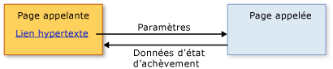

# Vue d'ensemble de la navigation structurée
Contenu qui peut être hébergé par une [!INCLUDE[TLA#tla_xbap](../../../../includes/tlasharptla-xbap-md.md)], un <xref:System.Windows.Controls.Frame>, ou un <xref:System.Windows.Navigation.NavigationWindow> est composé de pages qui peuvent être identifiés par le pack [!INCLUDE[TLA#tla_uri#plural](../../../../includes/tlasharptla-urisharpplural-md.md)] et navigation en liens hypertexte. La structure des pages et comment elles sont accessibles, tel que défini par des liens hypertexte, porte le nom de topologie de navigation. Une telle topologie convient à différents types d’applications, notamment celles permettant de parcourir des documents. Pour de telles applications, l’utilisateur peut naviguer d’une page à une autre page sans qu’une page ait besoin de savoir quoi que ce soit sur l’autre page.  
  
 Toutefois, d’autres types d’applications ont des pages qui ont besoin de savoir quand une navigation parmi les pages a eu lieu. Par exemple, considérez une application de ressources humaines ayant une page pour répertorier tous les employés d’une organisation, la page « Liste des employés ». Cette page pourrait également permettre aux utilisateurs d’ajouter un nouvel employé en cliquant sur un lien hypertexte. En cas de clic sur ce lien, l’utilisateur accède à une page « Ajouter un employé » pour recueillir les détails du nouvel employé et les retourner à la page « Liste des employés » afin de créer le nouvel employé et de mettre à jour la liste. Ce style de navigation s’apparente à l’appel d’une méthode pour effectuer un traitement et retourner une valeur, ce qui porte le nom de programmation structurée. Ce style de navigation est appelé *navigation structurée*.  
  
 La <xref:System.Windows.Controls.Page> classe n’implémente pas la prise en charge pour la navigation structurée. Au lieu de cela, le <xref:System.Windows.Navigation.PageFunction%601> dérive de la classe <xref:System.Windows.Controls.Page> et l’étend avec les constructions de base requises pour la navigation structurée. Cette rubrique montre comment établir à l’aide de la navigation structurée <xref:System.Windows.Navigation.PageFunction%601>.  
  
 
  
   
## Navigation structurée  
 Quand une page en appelle une autre dans une navigation structurée, certains ou tous les comportements suivants sont nécessaires :  
  
-   La page appelante accède à la page appelée, éventuellement en passant les paramètres exigés par cette dernière.  
  
-   La page appelée, quand un utilisateur a fini d’utiliser la page appelante, revient spécifiquement à la page appelante et, éventuellement :  
  
    -   Retourne des informations d’état qui décrivent comment la page appelante a été terminée (par exemple, si un utilisateur a appuyé sur un bouton OK ou Annuler)  
  
    -   Retourne les données recueillies auprès de l’utilisateur (par exemple, les détails du nouvel employé)  
  
-   Quand la page appelante revient à la page appelée, celle-ci est supprimée de l’historique de navigation afin d’isoler une instance d’une page appelée d’une autre.  
  
 Ces comportements sont illustrés par la figure ci-dessous.  
  
   
  
 Vous pouvez implémenter ces comportements en utilisant un <xref:System.Windows.Navigation.PageFunction%601> en tant que la page appelée.  
  
   
## Navigation structurée avec PageFunction  
 Cette rubrique montre comment implémenter les mécanismes de base de la navigation structurée impliquant un seul <xref:System.Windows.Navigation.PageFunction%601>. Dans cet exemple, un <xref:System.Windows.Controls.Page> appelle un <xref:System.Windows.Navigation.PageFunction%601> pour obtenir un <xref:System.String> à partir de l’utilisateur et le retourner.  
  
### Création d’une page appelante  
 La page qui appelle un <xref:System.Windows.Navigation.PageFunction%601> peut être un <xref:System.Windows.Controls.Page> ou <xref:System.Windows.Navigation.PageFunction%601>. Dans cet exemple, il est un <xref:System.Windows.Controls.Page>, comme illustré dans le code suivant.  
  
 [!code-xaml[StructuredNavigationSample#CallingPageDefaultMARKUP1](../../../../samples/snippets/csharp/VS_Snippets_Wpf/StructuredNavigationSample/CSharp/CallingPage.xaml#callingpagedefaultmarkup1)]  
[!code-xaml[StructuredNavigationSample#CallingPageDefaultMARKUP2](../../../../samples/snippets/csharp/VS_Snippets_Wpf/StructuredNavigationSample/CSharp/CallingPage.xaml#callingpagedefaultmarkup2)]  
  
 [!code-csharp[StructuredNavigationSample#CallingPageDefaultCODEBEHIND1](../../../../samples/snippets/csharp/VS_Snippets_Wpf/StructuredNavigationSample/CSharp/CallingPage.xaml.cs#callingpagedefaultcodebehind1)]
 [!code-vb[StructuredNavigationSample#CallingPageDefaultCODEBEHIND1](../../../../samples/snippets/visualbasic/VS_Snippets_Wpf/StructuredNavigationSample/VisualBasic/CallingPage.xaml.vb#callingpagedefaultcodebehind1)]  
[!code-csharp[StructuredNavigationSample#CallingPageDefaultCODEBEHIND2](../../../../samples/snippets/csharp/VS_Snippets_Wpf/StructuredNavigationSample/CSharp/CallingPage.xaml.cs#callingpagedefaultcodebehind2)]
[!code-vb[StructuredNavigationSample#CallingPageDefaultCODEBEHIND2](../../../../samples/snippets/visualbasic/VS_Snippets_Wpf/StructuredNavigationSample/VisualBasic/CallingPage.xaml.vb#callingpagedefaultcodebehind2)]  
[!code-csharp[StructuredNavigationSample#CallingPageDefaultCODEBEHIND3](../../../../samples/snippets/csharp/VS_Snippets_Wpf/StructuredNavigationSample/CSharp/CallingPage.xaml.cs#callingpagedefaultcodebehind3)]
[!code-vb[StructuredNavigationSample#CallingPageDefaultCODEBEHIND3](../../../../samples/snippets/visualbasic/VS_Snippets_Wpf/StructuredNavigationSample/VisualBasic/CallingPage.xaml.vb#callingpagedefaultcodebehind3)]  
  
### Création d’une fonction de page à appeler  
 Étant donné que la page appelante peut utiliser la page appelée pour recueillir et renvoyer des données à partir de l’utilisateur, <xref:System.Windows.Navigation.PageFunction%601> est implémenté comme une classe générique dont l’argument de type spécifie le type de la valeur de la page appelée. Le code suivant montre l’implémentation initiale de la page, à l’aide un <xref:System.Windows.Navigation.PageFunction%601>, qui retourne un <xref:System.String>.  
  
 [!code-xaml[StructuredNavigationSample#CalledPageFunctionMARKUP](../../../../samples/snippets/csharp/VS_Snippets_Wpf/StructuredNavigationSample/CSharp/CalledPageFunction.xaml#calledpagefunctionmarkup)]  
  
 [!code-csharp[StructuredNavigationSample#CalledPageFunctionCODEBEHIND1](../../../../samples/snippets/csharp/VS_Snippets_Wpf/StructuredNavigationSample/CSharp/CalledPageFunction.xaml.cs#calledpagefunctioncodebehind1)]
 [!code-vb[StructuredNavigationSample#CalledPageFunctionCODEBEHIND1](../../../../samples/snippets/visualbasic/VS_Snippets_Wpf/StructuredNavigationSample/VisualBasic/CalledPageFunction.xaml.vb#calledpagefunctioncodebehind1)]  
[!code-csharp[StructuredNavigationSample#CalledPageFunctionCODEBEHIND2](../../../../samples/snippets/csharp/VS_Snippets_Wpf/StructuredNavigationSample/CSharp/CalledPageFunction.xaml.cs#calledpagefunctioncodebehind2)]
[!code-vb[StructuredNavigationSample#CalledPageFunctionCODEBEHIND2](../../../../samples/snippets/visualbasic/VS_Snippets_Wpf/StructuredNavigationSample/VisualBasic/CalledPageFunction.xaml.vb#calledpagefunctioncodebehind2)]  
  
 La déclaration d’un <xref:System.Windows.Navigation.PageFunction%601> est similaire à la déclaration d’un <xref:System.Windows.Controls.Page> avec en plus des arguments de type. Comme vous pouvez le constater dans l’exemple de code, les arguments de type sont spécifiés à la fois dans le balisage [!INCLUDE[TLA2#tla_xaml](../../../../includes/tla2sharptla-xaml-md.md)] (à l’aide de l’attribut `x:TypeArguments`) et dans le code-behind (à l’aide de la syntaxe d’argument de type générique standard).  
  
 Vous n’êtes pas obligé d’utiliser uniquement des classes [!INCLUDE[dnprdnshort](../../../../includes/dnprdnshort-md.md)] en tant qu’arguments de type. Un <xref:System.Windows.Navigation.PageFunction%601> peut être appelé pour collecter des données spécifiques à un domaine qui sont abstraites en tant qu’un type personnalisé. Le code suivant montre comment utiliser un type personnalisé en tant qu’argument de type pour un <xref:System.Windows.Navigation.PageFunction%601>.  
  
 [!code-csharp[CustomTypePageFunctionSnippets#CustomTypeCODE1](../../../../samples/snippets/csharp/VS_Snippets_Wpf/CustomTypePageFunctionSnippets/CSharp/CustomType.cs#customtypecode1)]
 [!code-vb[CustomTypePageFunctionSnippets#CustomTypeCODE1](../../../../samples/snippets/visualbasic/VS_Snippets_Wpf/CustomTypePageFunctionSnippets/VisualBasic/CustomType.vb#customtypecode1)]  
[!code-csharp[CustomTypePageFunctionSnippets#CustomTypeCODE2](../../../../samples/snippets/csharp/VS_Snippets_Wpf/CustomTypePageFunctionSnippets/CSharp/CustomType.cs#customtypecode2)]
[!code-vb[CustomTypePageFunctionSnippets#CustomTypeCODE2](../../../../samples/snippets/visualbasic/VS_Snippets_Wpf/CustomTypePageFunctionSnippets/VisualBasic/CustomType.vb#customtypecode2)]  
  
 [!code-xaml[CustomTypePageFunctionSnippets#CustomTypePageFunctionMARKUP1](../../../../samples/snippets/csharp/VS_Snippets_Wpf/CustomTypePageFunctionSnippets/CSharp/CustomTypePageFunction.xaml#customtypepagefunctionmarkup1)]  
[!code-xaml[CustomTypePageFunctionSnippets#CustomTypePageFunctionMARKUP2](../../../../samples/snippets/csharp/VS_Snippets_Wpf/CustomTypePageFunctionSnippets/CSharp/CustomTypePageFunction.xaml#customtypepagefunctionmarkup2)]  
  
 [!code-csharp[CustomTypePageFunctionSnippets#CustomTypePageFunctionCODEBEHIND1](../../../../samples/snippets/csharp/VS_Snippets_Wpf/CustomTypePageFunctionSnippets/CSharp/CustomTypePageFunction.xaml.cs#customtypepagefunctioncodebehind1)]
 [!code-vb[CustomTypePageFunctionSnippets#CustomTypePageFunctionCODEBEHIND1](../../../../samples/snippets/visualbasic/VS_Snippets_Wpf/CustomTypePageFunctionSnippets/VisualBasic/CustomTypePageFunction.xaml.vb#customtypepagefunctioncodebehind1)]  
[!code-csharp[CustomTypePageFunctionSnippets#CustomTypePageFunctionCODEBEHIND2](../../../../samples/snippets/csharp/VS_Snippets_Wpf/CustomTypePageFunctionSnippets/CSharp/CustomTypePageFunction.xaml.cs#customtypepagefunctioncodebehind2)]
[!code-vb[CustomTypePageFunctionSnippets#CustomTypePageFunctionCODEBEHIND2](../../../../samples/snippets/visualbasic/VS_Snippets_Wpf/CustomTypePageFunctionSnippets/VisualBasic/CustomTypePageFunction.xaml.vb#customtypepagefunctioncodebehind2)]  
  
 Les arguments de type pour le <xref:System.Windows.Navigation.PageFunction%601> fournissent la base de la communication entre une page appelante et la page appelée, qui sont décrites dans les sections suivantes.  
  
 Comme vous le verrez, le type qui est identifié par la déclaration d’un <xref:System.Windows.Navigation.PageFunction%601> joue un rôle important pour retourner des données d’une <xref:System.Windows.Navigation.PageFunction%601> à la page appelante.  
  
### Appel de PageFunction et passage de paramètres  
 Pour appeler une page, la page appelante doit instancier la page appelée et accédez à l’aide de la <xref:System.Windows.Navigation.NavigationService.Navigate%2A> (méthode). Cela permet à la page appelante de passer les données initiales à la page appelée, par exemple les valeurs par défaut des données recueillies par la page appelée.  
  
 Le code suivant montre la page appelée avec un constructeur autre que le constructeur par défaut pour accepter les paramètres de la page appelante.  
  
 [!code-csharp[StructuredNavigationSample#AcceptsInitialDataCODEBEHIND1](../../../../samples/snippets/csharp/VS_Snippets_Wpf/StructuredNavigationSample/CSharp/CalledPageFunction.xaml.cs#acceptsinitialdatacodebehind1)]
 [!code-vb[StructuredNavigationSample#AcceptsInitialDataCODEBEHIND1](../../../../samples/snippets/visualbasic/VS_Snippets_Wpf/StructuredNavigationSample/VisualBasic/CalledPageFunction.xaml.vb#acceptsinitialdatacodebehind1)]  
[!code-csharp[StructuredNavigationSample#AcceptsInitialDataCODEBEHIND2](../../../../samples/snippets/csharp/VS_Snippets_Wpf/StructuredNavigationSample/CSharp/CalledPageFunction.xaml.cs#acceptsinitialdatacodebehind2)]
[!code-vb[StructuredNavigationSample#AcceptsInitialDataCODEBEHIND2](../../../../samples/snippets/visualbasic/VS_Snippets_Wpf/StructuredNavigationSample/VisualBasic/CalledPageFunction.xaml.vb#acceptsinitialdatacodebehind2)]  
[!code-csharp[StructuredNavigationSample#AcceptsInitialDataCODEBEHIND3](../../../../samples/snippets/csharp/VS_Snippets_Wpf/StructuredNavigationSample/CSharp/CalledPageFunction.xaml.cs#acceptsinitialdatacodebehind3)]
[!code-vb[StructuredNavigationSample#AcceptsInitialDataCODEBEHIND3](../../../../samples/snippets/visualbasic/VS_Snippets_Wpf/StructuredNavigationSample/VisualBasic/CalledPageFunction.xaml.vb#acceptsinitialdatacodebehind3)]  
[!code-csharp[StructuredNavigationSample#AcceptsInitialDataCODEBEHIND4](../../../../samples/snippets/csharp/VS_Snippets_Wpf/StructuredNavigationSample/CSharp/CalledPageFunction.xaml.cs#acceptsinitialdatacodebehind4)]
[!code-vb[StructuredNavigationSample#AcceptsInitialDataCODEBEHIND4](../../../../samples/snippets/visualbasic/VS_Snippets_Wpf/StructuredNavigationSample/VisualBasic/CalledPageFunction.xaml.vb#acceptsinitialdatacodebehind4)]  
  
 Le code suivant montre la page appelante qui gère la <xref:System.Windows.Documents.Hyperlink.Click> l’événement de la <xref:System.Windows.Documents.Hyperlink> pour instancier la page appelée et lui passer une valeur de chaîne initiale.  
  
 [!code-xaml[StructuredNavigationSample#PassingDataMARKUP2](../../../../samples/snippets/csharp/VS_Snippets_Wpf/StructuredNavigationSample/CSharp/CallingPage.xaml#passingdatamarkup2)]  
[!code-csharp[StructuredNavigationSample#PassingDataCODEBEHIND1](../../../../samples/snippets/csharp/VS_Snippets_Wpf/StructuredNavigationSample/CSharp/CallingPage.xaml.cs#passingdatacodebehind1)]
[!code-vb[StructuredNavigationSample#PassingDataCODEBEHIND1](../../../../samples/snippets/visualbasic/VS_Snippets_Wpf/StructuredNavigationSample/VisualBasic/CallingPage.xaml.vb#passingdatacodebehind1)]  
[!code-csharp[StructuredNavigationSample#PassingDataCODEBEHIND2](../../../../samples/snippets/csharp/VS_Snippets_Wpf/StructuredNavigationSample/CSharp/CallingPage.xaml.cs#passingdatacodebehind2)]
[!code-vb[StructuredNavigationSample#PassingDataCODEBEHIND2](../../../../samples/snippets/visualbasic/VS_Snippets_Wpf/StructuredNavigationSample/VisualBasic/CallingPage.xaml.vb#passingdatacodebehind2)]  
[!code-csharp[StructuredNavigationSample#PassingDataCODEBEHIND3](../../../../samples/snippets/csharp/VS_Snippets_Wpf/StructuredNavigationSample/CSharp/CallingPage.xaml.cs#passingdatacodebehind3)]
[!code-vb[StructuredNavigationSample#PassingDataCODEBEHIND3](../../../../samples/snippets/visualbasic/VS_Snippets_Wpf/StructuredNavigationSample/VisualBasic/CallingPage.xaml.vb#passingdatacodebehind3)]  
  
 Vous n’êtes pas obligé de passer des paramètres à la page appelée. Au lieu de cela, vous pouvez procéder comme suit :  
  
-   À partir de la page appelante :  
  
    1.  Instancier appelé <xref:System.Windows.Navigation.PageFunction%601> à l’aide du constructeur par défaut.  
  
    2.  Stocker les paramètres dans <xref:System.Windows.Application.Properties%2A>.  
  
    3.  Accédez à l’appelé <xref:System.Windows.Navigation.PageFunction%601>.  
  
-   À partir de l’appelé <xref:System.Windows.Navigation.PageFunction%601>:  
  
    -   Récupérer et utiliser les paramètres stockés dans <xref:System.Windows.Application.Properties%2A>.  
  
 Toutefois, comme vous le verrez bientôt, vous devrez quand même utiliser du code pour instancier et accéder à la page appelée afin de recueillir les données qu’elle a retournées. Pour cette raison, le <xref:System.Windows.Navigation.PageFunction%601> doivent rester alive ; sinon, la prochaine fois que vous accédez à la <xref:System.Windows.Navigation.PageFunction%601>, [!INCLUDE[TLA2#tla_wpf](../../../../includes/tla2sharptla-wpf-md.md)] instancie le <xref:System.Windows.Navigation.PageFunction%601> à l’aide du constructeur par défaut.  
  
 Avant que la page appelée puisse retourner, toutefois, elle doit retourner des données qui peuvent être récupérées par la page appelante.  
  
### Retour de résultat de tâche et de données de tâche à une page appelante  
 Une fois que l’utilisateur a fini d’utiliser la page appelée, ce qui est indiqué dans cet exemple par un appui sur le bouton Annuler ou OK, la page appelée doit retourner. Étant donné que la page appelante a utilisé la page appelée pour recueillir des données auprès de l’utilisateur, la page appelante nécessite deux types d’informations :  
  
1.  Si l’utilisateur a annulé la page appelée (en appuyant sur le bouton OK ou Annuler dans cet exemple). Cela permet à la page appelante de déterminer s’il faut traiter les données recueillies auprès de l’utilisateur par la page appelée.  
  
2.  Les données qui ont été fournies par l’utilisateur.  
  
 Pour retourner des informations, <xref:System.Windows.Navigation.PageFunction%601> implémente le <xref:System.Windows.Navigation.PageFunction%601.OnReturn%2A> (méthode). L’exemple de code suivant montre comment l’appeler.  
  
 [!code-csharp[StructuredNavigationSample#ReturnCODEBEHIND1](../../../../samples/snippets/csharp/VS_Snippets_Wpf/StructuredNavigationSample/CSharp/CalledPageFunction.xaml.cs#returncodebehind1)]
 [!code-vb[StructuredNavigationSample#ReturnCODEBEHIND1](../../../../samples/snippets/visualbasic/VS_Snippets_Wpf/StructuredNavigationSample/VisualBasic/CalledPageFunction.xaml.vb#returncodebehind1)]  
[!code-csharp[StructuredNavigationSample#ReturnCODEBEHIND2](../../../../samples/snippets/csharp/VS_Snippets_Wpf/StructuredNavigationSample/CSharp/CalledPageFunction.xaml.cs#returncodebehind2)]
[!code-vb[StructuredNavigationSample#ReturnCODEBEHIND2](../../../../samples/snippets/visualbasic/VS_Snippets_Wpf/StructuredNavigationSample/VisualBasic/CalledPageFunction.xaml.vb#returncodebehind2)]  
  
 Dans cet exemple, si l’utilisateur appuie sur le bouton Annuler, une valeur `null` est retournée à la page appelante. Si en revanche il appuie sur le bouton OK, la valeur de chaîne fournie par l’utilisateur est retournée. <xref:System.Windows.Navigation.PageFunction%601.OnReturn%2A>est un `protected``virtual` que vous appelez pour retourner les données à la page appelante. Vos données doivent être empaquetées dans une instance de l’objet générique <xref:System.Windows.Navigation.ReturnEventArgs%601> type, dont l’argument de type spécifie le type de valeur <xref:System.Windows.Navigation.ReturnEventArgs%601.Result%2A> retourne. De cette façon, lorsque vous déclarez un <xref:System.Windows.Navigation.PageFunction%601> avec un argument de type particulier, vous indiquez qu’un <xref:System.Windows.Navigation.PageFunction%601> retourne une instance du type spécifié par l’argument de type. Dans cet exemple, l’argument de type et, par conséquent, la valeur de retour est de type <xref:System.String>.  
  
 Lorsque <xref:System.Windows.Navigation.PageFunction%601.OnReturn%2A> est appelée, la page appelante doit pouvoir recevoir la valeur de retour de la <xref:System.Windows.Navigation.PageFunction%601>. Pour cette raison, <xref:System.Windows.Navigation.PageFunction%601> implémente la <xref:System.Windows.Navigation.PageFunction%601.Return> événements pour appeler des pages à gérer. Lorsque <xref:System.Windows.Navigation.PageFunction%601.OnReturn%2A> est appelée, <xref:System.Windows.Navigation.PageFunction%601.Return> est déclenché, ce qui la page appelante peut inscrire avec <xref:System.Windows.Navigation.PageFunction%601.Return> pour recevoir la notification.  
  
 [!code-csharp[StructuredNavigationSample#ProcessResultCODEBEHIND1](../../../../samples/snippets/csharp/VS_Snippets_Wpf/StructuredNavigationSample/CSharp/CallingPage.xaml.cs#processresultcodebehind1)]
 [!code-vb[StructuredNavigationSample#ProcessResultCODEBEHIND1](../../../../samples/snippets/visualbasic/VS_Snippets_Wpf/StructuredNavigationSample/VisualBasic/CallingPage.xaml.vb#processresultcodebehind1)]  
[!code-csharp[StructuredNavigationSample#ProcessResultCODEBEHIND2](../../../../samples/snippets/csharp/VS_Snippets_Wpf/StructuredNavigationSample/CSharp/CallingPage.xaml.cs#processresultcodebehind2)]
[!code-vb[StructuredNavigationSample#ProcessResultCODEBEHIND2](../../../../samples/snippets/visualbasic/VS_Snippets_Wpf/StructuredNavigationSample/VisualBasic/CallingPage.xaml.vb#processresultcodebehind2)]  
  
### Suppression de pages de tâche quand une tâche se termine  
 Quand une page appelée est retournée, et que l’utilisateur ne l’a pas annulée, la page appelante traite les données fournies par l’utilisateur et retournées par la page appelée. L’acquisition de données de cette manière est généralement une opération isolée. Quand la page appelée est retournée, la page appelante doit créer et naviguer vers une nouvelle page appelante pour capturer davantage de données.  
  
 Toutefois, sauf si une page appelée est supprimée du journal, un utilisateur pourra revenir à une instance précédente de la page appelante. Si un <xref:System.Windows.Navigation.PageFunction%601> sont conservées dans le journal est déterminé par le <xref:System.Windows.Navigation.PageFunctionBase.RemoveFromJournal%2A> propriété. Par défaut, une fonction de page est automatiquement supprimée lorsque <xref:System.Windows.Navigation.PageFunction%601.OnReturn%2A> est appelée car <xref:System.Windows.Navigation.PageFunctionBase.RemoveFromJournal%2A> a la valeur `true`. Pour conserver une fonction de page dans l’historique de navigation après <xref:System.Windows.Navigation.PageFunction%601.OnReturn%2A> est appelée, définissez <xref:System.Windows.Navigation.PageFunctionBase.RemoveFromJournal%2A> à `false`.  
  
   
## Autres types de navigation structurée  
 Cette rubrique illustre l’utilisation de base d’un <xref:System.Windows.Navigation.PageFunction%601> pour prendre en charge d’appel/retour de la navigation structurée. Cette base vous permet de créer des types de navigation structurée plus complexes.  
  
 Par exemple, parfois plusieurs pages sont requises par une page appelante pour recueillir suffisamment de données auprès d’un utilisateur ou pour effectuer une tâche. En cas d’utilisation de plusieurs pages, on emploie le terme « Assistant ».  
  
 Dans d’autres cas, les applications peuvent avoir des topologies de navigation complexes qui dépendent de la navigation structurée pour fonctionner efficacement. Pour plus d’informations, consultez [Vue d’ensemble des topologies de navigation](../../../../docs/framework/wpf/app-development/navigation-topologies-overview.md).  
  
## Voir aussi  
 <xref:System.Windows.Navigation.PageFunction%601>  
 <xref:System.Windows.Navigation.NavigationService>  
 [Vue d’ensemble des topologies de navigation](../../../../docs/framework/wpf/app-development/navigation-topologies-overview.md)
