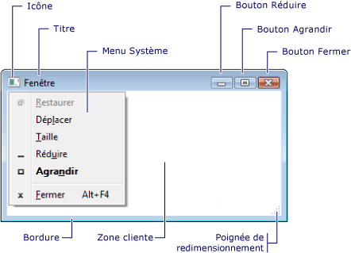
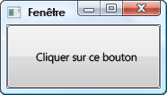
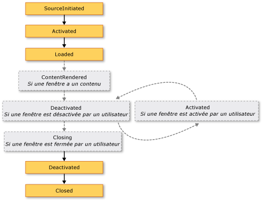
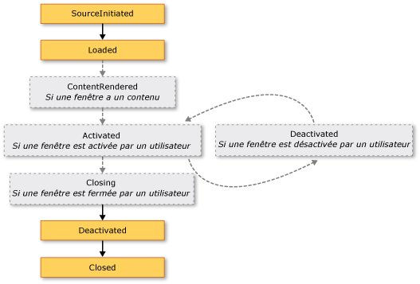

# <a name="wpf-windows-overview"></a>Vue d'ensemble des fenêtres WPF
Les utilisateurs interagissent avec les applications autonomes [!INCLUDE[TLA#tla_wpf](../../../../includes/tlasharptla-wpf-md.md)] par le biais de fenêtres. L’objectif principal d’une fenêtre est d’héberger du contenu qui permet aux utilisateurs de visualiser les données et d’interagir avec celles-ci. Autonome [!INCLUDE[TLA2#tla_wpf](../../../../includes/tla2sharptla-wpf-md.md)] applications fournissent leurs propres fenêtres à l’aide de la <xref:System.Windows.Window> classe. Cette rubrique présente les <xref:System.Windows.Window> avant de couvrir les notions de base de la création et la gestion de fenêtres dans des applications autonomes.  
  
> [!NOTE]
>  Hébergées par un navigateur [!INCLUDE[TLA2#tla_wpf](../../../../includes/tla2sharptla-wpf-md.md)] applications, y compris [!INCLUDE[TLA#tla_xbap#plural](../../../../includes/tlasharptla-xbapsharpplural-md.md)] et libre [!INCLUDE[TLA#tla_xaml](../../../../includes/tlasharptla-xaml-md.md)] pages, ne fournissent pas leurs propres fenêtres. Au lieu de cela, ils sont hébergés dans des fenêtres fournies par [!INCLUDE[TLA#tla_iegeneric](../../../../includes/tlasharptla-iegeneric-md.md)]. Consultez [vue d’ensemble des Applications de navigateur XAML WPF](../../../../docs/framework/wpf/app-development/wpf-xaml-browser-applications-overview.md).  
  
  
<a name="TheWindowClass"></a>   
## <a name="the-window-class"></a>Window, classe  
 La figure suivante illustre les éléments constitutifs d’une fenêtre.  
  
   
  
 Une fenêtre est divisée en deux zones : la zone non cliente et la zone cliente.  
  
 Le *zone non cliente* d’une fenêtre est implémentée par [!INCLUDE[TLA2#tla_wpf](../../../../includes/tla2sharptla-wpf-md.md)] et inclut les parties d’une fenêtre qui sont communes à la plupart des fenêtres, notamment les suivantes :  
  
-   bordure ;  
  
-   barre de titre ;  
  
-   icône ;  
  
-   boutons Réduire, Agrandir et Restaurer ;  
  
-   bouton Fermer ;  
  
-   menu système avec des éléments de menu qui permettent aux utilisateurs de réduire, agrandir, restaurer, déplacer, redimensionner et fermer une fenêtre.  
  
 Le *zone cliente* d’une fenêtre est la zone dans la zone non cliente d’une fenêtre et est utilisé par les développeurs pour ajouter du contenu spécifique à l’application, telles que les barres de menus, barres d’outils et contrôles.  
  
 Dans [!INCLUDE[TLA2#tla_wpf](../../../../includes/tla2sharptla-wpf-md.md)], une fenêtre est encapsulée par la <xref:System.Windows.Window> classe que vous utilisez pour effectuer les opérations suivantes :  
  
-   afficher une fenêtre ;  
  
-   configurer la taille, la position et l’apparence d’une fenêtre ;  
  
-   héberger un contenu spécifique à l’application ;  
  
-   gérer la durée de vie d’une fenêtre.  
  
<a name="DefiningAWindow"></a>   
## <a name="implementing-a-window"></a>Implémentation d’une fenêtre  
 L’implémentation d’une fenêtre typique comprend l’apparence et le comportement, où *apparence* définit l’apparence d’une fenêtre pour les utilisateurs et *comportement* définit la façon dont les fonctions d’une fenêtre lorsque les utilisateurs interagissent avec elle. Dans [!INCLUDE[TLA2#tla_wpf](../../../../includes/tla2sharptla-wpf-md.md)], vous pouvez implémenter l’apparence et le comportement d’une fenêtre à l’aide de code soit ou [!INCLUDE[TLA2#tla_xaml](../../../../includes/tla2sharptla-xaml-md.md)] balisage.  
  
 En général, toutefois, l’apparence d’une fenêtre est implémentée à l’aide de [!INCLUDE[TLA2#tla_xaml](../../../../includes/tla2sharptla-xaml-md.md)] balisage et son comportement est implémenté à l’aide de code-behind, comme indiqué dans l’exemple suivant.  
  
 [!code-xaml[WindowsOverviewSnippets#MarkupAndCodeBehindWindowMARKUP](../../../../samples/snippets/csharp/VS_Snippets_Wpf/WindowsOverviewSnippets/CSharp/MarkupAndCodeBehindWindow.xaml#markupandcodebehindwindowmarkup)]  
  
 [!code-csharp[WindowsOverviewSnippets#MarkupAndCodeBehindWindowCODEBEHIND](../../../../samples/snippets/csharp/VS_Snippets_Wpf/WindowsOverviewSnippets/CSharp/MarkupAndCodeBehindWindow.xaml.cs#markupandcodebehindwindowcodebehind)]
 [!code-vb[WindowsOverviewSnippets#MarkupAndCodeBehindWindowCODEBEHIND](../../../../samples/snippets/visualbasic/VS_Snippets_Wpf/WindowsOverviewSnippets/VisualBasic/MarkupAndCodeBehindWindow.xaml.vb#markupandcodebehindwindowcodebehind)]  
  
 Pour activer un [!INCLUDE[TLA2#tla_xaml](../../../../includes/tla2sharptla-xaml-md.md)] fichier de balisage et le fichier code-behind pour fonctionner ensemble, les éléments suivants sont requis :  
  
-   Dans le balisage, la `Window` élément doit inclure le `x:Class` attribut. Lorsque l’application est générée, l’existence de `x:Class` dans le balisage de fichier entraîne [!INCLUDE[TLA#tla_msbuild](../../../../includes/tlasharptla-msbuild-md.md)] pour créer un `partial` classe qui dérive de <xref:System.Windows.Window> et porte le nom spécifié par le `x:Class` attribut. Cela requiert l’ajout d’un [!INCLUDE[TLA2#tla_xml](../../../../includes/tla2sharptla-xml-md.md)] déclaration d’espace de noms pour le [!INCLUDE[TLA2#tla_xaml](../../../../includes/tla2sharptla-xaml-md.md)] schéma ( `xmlns:x="http://schemas.microsoft.com/winfx/2006/xaml"` ). Le texte généré `partial` la classe implémente le `InitializeComponent` (méthode), qui est appelée pour enregistrer les événements et définir les propriétés qui sont implémentées dans le balisage.  
  
-   Dans le code-behind, la classe doit être un `partial` classe portant le même nom que celui spécifié par le `x:Class` attribut dans le balisage et elle doit dériver de <xref:System.Windows.Window>. Cela permet au fichier code-behind à associer à la `partial` classe qui est généré pour le fichier de balisage lorsque l’application est générée (consultez [création d’une Application WPF](../../../../docs/framework/wpf/app-development/building-a-wpf-application-wpf.md)).  
  
-   Dans le code-behind, le <xref:System.Windows.Window> classe doit implémenter un constructeur qui appelle le `InitializeComponent` (méthode). `InitializeComponent`est implémentée par le balisage générée du fichier `partial` classe pour enregistrer les événements et définir les propriétés qui sont définies dans le balisage.  
  
> [!NOTE]
>  Lorsque vous ajoutez un nouveau <xref:System.Windows.Window> à votre projet à l’aide de [!INCLUDE[TLA#tla_visualstu](../../../../includes/tlasharptla-visualstu-md.md)], le <xref:System.Windows.Window> est implémentée à l’aide de balisage et code-behind et inclut la configuration nécessaire pour créer l’association entre les fichiers de balisage et code-behind en tant que décrites ici.  
  
 Avec cette configuration en place, vous pouvez vous concentrer sur la définition de l’apparence de la fenêtre en [!INCLUDE[TLA2#tla_xaml](../../../../includes/tla2sharptla-xaml-md.md)] balisage et l’implémentation de son comportement dans le code-behind. L’exemple suivant montre une fenêtre avec un bouton, implémentée dans [!INCLUDE[TLA2#tla_xaml](../../../../includes/tla2sharptla-xaml-md.md)] balisage et un gestionnaire d’événements du bouton <xref:System.Windows.Controls.Primitives.ButtonBase.Click> événement, implémentée dans le code-behind.  
  
 [!code-xaml[WindowsOverviewWindowWithButtonSnippets#MarkupAndCodeBehindWindowMARKUP](../../../../samples/snippets/csharp/VS_Snippets_Wpf/WindowsOverviewWindowWithButtonSnippets/CSharp/MarkupAndCodeBehindWindow.xaml#markupandcodebehindwindowmarkup)]  
  
 [!code-csharp[WindowsOverviewWindowWithButtonSnippets#MarkupAndCodeBehindWindowCODEBEHIND](../../../../samples/snippets/csharp/VS_Snippets_Wpf/WindowsOverviewWindowWithButtonSnippets/CSharp/MarkupAndCodeBehindWindow.xaml.cs#markupandcodebehindwindowcodebehind)]
 [!code-vb[WindowsOverviewWindowWithButtonSnippets#MarkupAndCodeBehindWindowCODEBEHIND](../../../../samples/snippets/visualbasic/VS_Snippets_Wpf/WindowsOverviewWindowWithButtonSnippets/VisualBasic/MarkupAndCodeBehindWindow.xaml.vb#markupandcodebehindwindowcodebehind)]  
  
<a name="ConfiguringWindowForMSBuild"></a>   
## <a name="configuring-a-window-definition-for-msbuild"></a>Configuration d’une définition de fenêtre pour MSBuild  
 Manière dont vous implémentez votre fenêtre détermine la façon dont il est configuré pour [!INCLUDE[TLA2#tla_msbuild](../../../../includes/tla2sharptla-msbuild-md.md)]. Pour une fenêtre qui est définie en utilisant les deux [!INCLUDE[TLA2#tla_xaml](../../../../includes/tla2sharptla-xaml-md.md)] balisage et code-behind :  
  
-   [!INCLUDE[TLA2#tla_xaml](../../../../includes/tla2sharptla-xaml-md.md)] fichiers de balisage sont configurés en tant que [!INCLUDE[TLA2#tla_msbuild](../../../../includes/tla2sharptla-msbuild-md.md)] `Page` éléments.  
  
-   Les fichiers code-behind sont configurés en tant que [!INCLUDE[TLA2#tla_msbuild](../../../../includes/tla2sharptla-msbuild-md.md)] `Compile` éléments.  
  
 Cela est illustré dans l’exemple suivant [!INCLUDE[TLA2#tla_msbuild](../../../../includes/tla2sharptla-msbuild-md.md)] fichier projet.  
  
```xml  
<Project ...  
                xmlns="http://schemas.microsoft.com/developer/msbuild/2003">  
    ...  
    <Page Include="MarkupAndCodeBehindWindow.xaml" />  
    <Compile Include=" MarkupAndCodeBehindWindow.xaml.cs" />  
    ...  
</Project>  
```  
  
 Pour plus d’informations sur la génération [!INCLUDE[TLA2#tla_wpf](../../../../includes/tla2sharptla-wpf-md.md)] les applications, consultez [création d’une Application WPF](../../../../docs/framework/wpf/app-development/building-a-wpf-application-wpf.md).  
  
<a name="WindowLifetime"></a>   
## <a name="window-lifetime"></a>Durée de vie d'une fenêtre  
 Comme pour toute classe, une fenêtre a une durée de vie qui commence quand elle est instanciée pour la première fois. Elle est ensuite ouverte, activée et désactivée, et finalement fermée.  
  
  
<a name="Opening_a_Window"></a>   
### <a name="opening-a-window"></a>Ouverture d’une fenêtre  
 Pour ouvrir une fenêtre, commencez par créer une instance de celle-ci, comme le montre l’exemple suivant.  
  
 [!code-xaml[WindowsOverviewStartupEventSnippets#AppMARKUP](../../../../samples/snippets/csharp/VS_Snippets_Wpf/WindowsOverviewStartupEventSnippets/CSharp/App.xaml#appmarkup)]  
  
 [!code-csharp[WindowsOverviewStartupEventSnippets#AppCODEBEHIND](../../../../samples/snippets/csharp/VS_Snippets_Wpf/WindowsOverviewStartupEventSnippets/CSharp/App.xaml.cs#appcodebehind)]  
  
 Dans cet exemple, le `MarkupAndCodeBehindWindow` est instancié lorsque l’application démarre, ce qui se produit lorsque le <xref:System.Windows.Application.Startup> événement est déclenché.  
  
 Lorsqu’une fenêtre est instanciée, une référence à celui-ci est automatiquement ajoutée à une liste de windows qui est gérée par le <xref:System.Windows.Application> objet (voir <xref:System.Windows.Application.Windows%2A?displayProperty=nameWithType>). En outre, la première fenêtre à être instanciée est, par défaut, définie par <xref:System.Windows.Application> en tant que fenêtre d’application principale (voir <xref:System.Windows.Application.MainWindow%2A?displayProperty=nameWithType>).  
  
 La fenêtre est ouverte enfin en appelant le <xref:System.Windows.Window.Show%2A> méthode ; le résultat est illustré dans l’illustration suivante.  
  
   
  
 Une fenêtre ouverte en appelant <xref:System.Windows.Window.Show%2A> est une fenêtre non modale, ce qui signifie que l’application fonctionne dans un mode qui permet aux utilisateurs d’activer d’autres fenêtres dans la même application.  
  
> [!NOTE]
>  <xref:System.Windows.Window.ShowDialog%2A>est appelé pour ouvrir windows tels que des boîtes de dialogue modale. Consultez [vue d’ensemble des boîtes de dialogue](../../../../docs/framework/wpf/app-development/dialog-boxes-overview.md) pour plus d’informations.  
  
 Lorsque <xref:System.Windows.Window.Show%2A> est appelée, une fenêtre exécute un travail d’initialisation avant d’être affiché pour établir l’infrastructure qui permet à l’entrée d’utilisateur. Lorsque la fenêtre est initialisée, le <xref:System.Windows.Window.SourceInitialized> événement est déclenché et la fenêtre est affichée.  
  
 Il existe un raccourci, <xref:System.Windows.Application.StartupUri%2A> peut être définie pour spécifier la première fenêtre qui s’ouvre automatiquement lorsqu’une application démarre.  
  
 [!code-xaml[WindowsOverviewSnippets#ApplicationStartupUriMARKUP](../../../../samples/snippets/csharp/VS_Snippets_Wpf/WindowsOverviewSnippets/CSharp/App.xaml#applicationstartupurimarkup)]  
  
 Lorsque l’application démarre, la fenêtre spécifiée par la valeur de <xref:System.Windows.Application.StartupUri%2A> est ouvert non modale ; en interne, la fenêtre est ouverte en appelant son <xref:System.Windows.Window.Show%2A> (méthode).  
  
<a name="Ownership"></a>   
#### <a name="window-ownership"></a>Propriété de la fenêtre  
 Une fenêtre ouverte à l’aide de la <xref:System.Windows.Window.Show%2A> méthode n’a pas de relation implicite avec la fenêtre qui l’a créée ; les utilisateurs peuvent interagir avec les deux fenêtres indépendamment de l’autre, ce qui signifie que les deux fenêtres pouvez procédez comme suit :  
  
-   Couvre l’autre (sauf si une des fenêtres a son <xref:System.Windows.Window.Topmost%2A> propriété `true`).  
  
-   être réduite, agrandie et restaurée sans affecter l’autre fenêtre.  
  
 Certaines fenêtres nécessitent une relation avec la fenêtre qui les ouvre. Par exemple, un [!INCLUDE[TLA#tla_ide](../../../../includes/tlasharptla-ide-md.md)] application peut ouvrir des fenêtres de propriétés et des fenêtres Outil dont le comportement par défaut est de couvrir la fenêtre qui les crée. De plus, ces fenêtres doivent toujours se fermer, se réduire, s’agrandir et se restaurer conjointement avec la fenêtre qui les a créées. Une telle relation peut être établie en effectuant une fenêtre *propre* un autre et en définissant le <xref:System.Windows.Window.Owner%2A> propriété de la *détenus fenêtre* avec une référence à la *propriétaire fenêtre*. L'exemple suivant le démontre.  
  
 [!code-csharp[WindowOwnerOwnedWindowsSnippets#SetWindowOwnerCODE](../../../../samples/snippets/csharp/VS_Snippets_Wpf/WindowOwnerOwnedWindowsSnippets/CSharp/MainWindow.xaml.cs#setwindowownercode)]
 [!code-vb[WindowOwnerOwnedWindowsSnippets#SetWindowOwnerCODE](../../../../samples/snippets/visualbasic/VS_Snippets_Wpf/WindowOwnerOwnedWindowsSnippets/visualbasic/mainwindow.xaml.vb#setwindowownercode)]  
  
 Une fois la propriété établie :  
  
-   La fenêtre enfant peut faire référence à sa fenêtre propriétaire en consultant la valeur de son <xref:System.Windows.Window.Owner%2A> propriété.  
  
-   La fenêtre propriétaire peut découvrir toutes les fenêtres qu’elle possède en consultant la valeur de son <xref:System.Windows.Window.OwnedWindows%2A> propriété.  
  
<a name="Preventing"></a>   
#### <a name="preventing-window-activation"></a>Blocage de l’activation de la fenêtre  
 Il existe des scénarios où windows ne doivent pas être activées lors de la montre, telles que les fenêtres de conversation d’une application de style messenger Internet ou les fenêtres de notification d’une application de messagerie.  
  
 Si votre application possède une fenêtre qui ne doit pas être activée lorsque affichée, vous pouvez définir ses <xref:System.Windows.Window.ShowActivated%2A> propriété `false` avant d’appeler le <xref:System.Windows.Window.Show%2A> méthode pour la première fois. En conséquence :  
  
-   La fenêtre n’est pas activée.  
  
-   La fenêtre <xref:System.Windows.Window.Activated> événement n’est pas déclenché.  
  
-   La fenêtre déjà activée reste activée.  
  
 Toutefois, la fenêtre est activée dès que l’utilisateur clique sur la zone cliente ou non cliente. Dans ce cas :  
  
-   La fenêtre est activée.  
  
-   La fenêtre <xref:System.Windows.Window.Activated> événement est déclenché.  
  
-   La fenêtre qui était activée est désactivée.  
  
-   La fenêtre <xref:System.Windows.Window.Deactivated> et <xref:System.Windows.Window.Activated> sont ensuite déclenchés comme prévu en réponse aux actions de l’utilisateur.  
  
<a name="Window_Activation"></a>   
### <a name="window-activation"></a>Activation de la fenêtre  
 Quand une fenêtre s’ouvre, elle devient la fenêtre active (sauf si elle est affichée avec <xref:System.Windows.Window.ShowActivated%2A> la valeur `false`). Le *fenêtre active* est la fenêtre qui capture actuellement les entrées utilisateur, telles que les séquences de touches et les clics de souris. Lorsqu’une fenêtre devient active, elle déclenche le <xref:System.Windows.Window.Activated> événement.  
  
> [!NOTE]
>  Quand une fenêtre s’ouvre, la <xref:System.Windows.FrameworkElement.Loaded> et <xref:System.Windows.Window.ContentRendered> sont déclenchés uniquement après le <xref:System.Windows.Window.Activated> événement est déclenché. Dans cet esprit, une fenêtre peut effectivement être considérée ouverte lorsque <xref:System.Windows.Window.ContentRendered> est déclenché.  
  
 Une fois qu’une fenêtre est active, un utilisateur peut activer une autre fenêtre de la même application ou activer une autre application. Lorsque cela se produit, la fenêtre actuellement active est désactivée et déclenche le <xref:System.Windows.Window.Deactivated> événement. De même, lorsque l’utilisateur sélectionne une fenêtre actuellement désactivée, celle-ci redevient active et <xref:System.Windows.Window.Activated> est déclenché.  
  
 Une des raisons courantes pour gérer les <xref:System.Windows.Window.Activated> et <xref:System.Windows.Window.Deactivated> consiste à activer et désactiver les fonctionnalités qui peuvent s’exécuter uniquement lorsqu’une fenêtre est active. Par exemple, certaines fenêtres affichent du contenu interactif qui nécessite en permanence l’attention de l’utilisateur ou une entrée de sa part, notamment les jeux et les lecteurs vidéo. L’exemple suivant est un lecteur de vidéo simplifié qui montre comment gérer <xref:System.Windows.Window.Activated> et <xref:System.Windows.Window.Deactivated> pour implémenter ce comportement.  
  
 [!code-xaml[WindowsOverviewSnippets#ActivationDeactivationMARKUP](../../../../samples/snippets/csharp/VS_Snippets_Wpf/WindowsOverviewSnippets/CSharp/CustomMediaPlayerWindow.xaml#activationdeactivationmarkup)]  
  
 [!code-csharp[WindowsOverviewSnippets#ActivationDeactivationCODEBEHIND](../../../../samples/snippets/csharp/VS_Snippets_Wpf/WindowsOverviewSnippets/CSharp/CustomMediaPlayerWindow.xaml.cs#activationdeactivationcodebehind)]
 [!code-vb[WindowsOverviewSnippets#ActivationDeactivationCODEBEHIND](../../../../samples/snippets/visualbasic/VS_Snippets_Wpf/WindowsOverviewSnippets/VisualBasic/CustomMediaPlayerWindow.xaml.vb#activationdeactivationcodebehind)]  
  
 D’autres types d’application peuvent toujours exécuter du code en arrière-plan quand une fenêtre est désactivée. Par exemple, un client d’e-mail peut continuer à interroger le serveur d’e-mail pendant que l’utilisateur utilise d’autres applications. Les applications de ce type ont souvent un comportement différent ou supplémentaire pendant que la fenêtre principale est désactivée. En ce qui concerne le programme d’e-mail, cela peut signifier l’ajout du nouvel élément d’e-mail à la boîte de réception, ainsi que l’ajout d’une icône de notification à la zone de notification. Une icône de notification n’a besoin être affichée lorsque la fenêtre de courrier n’est pas active, ce qui peut être déterminée en examinant le <xref:System.Windows.Window.IsActive%2A> propriété.  
  
 Si une tâche en arrière-plan se termine, une fenêtre peut souhaiter notifier plus rapidement l’utilisateur en appelant <xref:System.Windows.Window.Activate%2A> (méthode). Si l’utilisateur interagit avec une autre application activée lorsque <xref:System.Windows.Window.Activate%2A> est appelée, le bouton de fenêtre barre des tâches clignote. Si un utilisateur interagit avec l’application en cours, l’appel <xref:System.Windows.Window.Activate%2A> s’affiche la fenêtre au premier plan.  
  
> [!NOTE]
>  Vous pouvez gérer à l’aide de l’activation de l’étendue de l’application le <xref:System.Windows.Application.Activated?displayProperty=nameWithType> et <xref:System.Windows.Application.Deactivated?displayProperty=nameWithType> les événements.  
  
<a name="Closing_a_Window"></a>   
### <a name="closing-a-window"></a>Fermeture d’une fenêtre  
 Quand un utilisateur ferme une fenêtre, celle-ci cesse d’exister. Vous pouvez fermer une fenêtre à l’aide d’éléments de la zone non cliente, notamment :  
  
-   Le **fermer** élément de la **système** menu.  
  
-   en appuyant sur Alt+F4 ;  
  
-   En appuyant sur la **fermer** bouton.  
  
 Vous pouvez fournir des mécanismes supplémentaires à la zone cliente pour fermer une fenêtre, notamment :  
  
-   Un **Exit** d’élément dans le **fichier** menu, généralement pour les fenêtres d’application principal.  
  
-   A **fermer** d’élément dans le **fichier** menu, généralement sur une fenêtre d’application secondaire.  
  
-   A **Annuler** bouton, généralement sur une boîte de dialogue modale.  
  
-   A **fermer** bouton, généralement sur une boîte de dialogue non modale.  
  
 Pour fermer une fenêtre en réponse à un de ces mécanismes personnalisés, vous devez appeler la <xref:System.Windows.Window.Close%2A> (méthode). L’exemple suivant implémente la capacité de fermer une fenêtre en choisissant le **Exit** sur la **fichier** menu.  
  
 [!code-xaml[WindowsOverviewSnippets#WindowWithFileExitMARKUP](../../../../samples/snippets/csharp/VS_Snippets_Wpf/WindowsOverviewSnippets/CSharp/WindowWithFileExit.xaml#windowwithfileexitmarkup)]  
  
 [!code-csharp[WindowsOverviewSnippets#WindowWithFileExitCODEBEHIND](../../../../samples/snippets/csharp/VS_Snippets_Wpf/WindowsOverviewSnippets/CSharp/WindowWithFileExit.xaml.cs#windowwithfileexitcodebehind)]
 [!code-vb[WindowsOverviewSnippets#WindowWithFileExitCODEBEHIND](../../../../samples/snippets/visualbasic/VS_Snippets_Wpf/WindowsOverviewSnippets/VisualBasic/WindowWithFileExit.xaml.vb#windowwithfileexitcodebehind)]  
  
 Lorsqu’une fenêtre se ferme, elle déclenche deux événements : <xref:System.Windows.Window.Closing> et <xref:System.Windows.Window.Closed>.  
  
 <xref:System.Windows.Window.Closing>est déclenché avant la fermeture de la fenêtre, et il fournit un mécanisme en fenêtre qui peut empêcher la fermeture. Bien souvent, la fermeture d’une fenêtre est nécessaire si elle contient des données qui ont été modifiées. Dans ce cas, le <xref:System.Windows.Window.Closing> événement peut être géré pour déterminer si les données sont modifiées et, dans ce cas, demander à l’utilisateur s’il faut continuer à fermer la fenêtre sans enregistrer les données ou annuler la fermeture de la fenêtre. L’exemple suivant montre les principaux aspects de la gestion des <xref:System.Windows.Window.Closing>.  
  
 [!code-csharp[WindowClosingSnippets](../../../../samples/snippets/csharp/VS_Snippets_Wpf/WindowClosingSnippets/CSharp/DataWindow.xaml.cs)]
 [!code-vb[WindowClosingSnippets](../../../../samples/snippets/visualbasic/VS_Snippets_Wpf/WindowClosingSnippets/visualbasic/datawindow.xaml.vb)]  
 
  
 Le <xref:System.Windows.Window.Closing> Gestionnaire d’événements est passé un <xref:System.ComponentModel.CancelEventArgs>, qui implémente le `Boolean` <xref:System.ComponentModel.CancelEventArgs.Cancel%2A> que vous avez définie à `true` pour empêcher la fermeture d’une fenêtre.  
  
 Si <xref:System.Windows.Window.Closing> n’est pas gérée, ou elle est gérée, mais pas annulé, la fenêtre se fermera. Juste avant la fermeture d’une fenêtre réellement, <xref:System.Windows.Window.Closed> est déclenché. À ce stade, il est impossible d’empêcher une fenêtre de se fermer.  
  
> [!NOTE]
>  Une application peut être configurée pour les arrêter lorsque la fenêtre principale de l’application se ferme automatiquement (voir <xref:System.Windows.Application.MainWindow%2A>) ou la dernière fenêtre est fermée. Pour plus d'informations, consultez <xref:System.Windows.Application.ShutdownMode%2A>.  
  
 Pendant une fenêtre peut être fermée explicitement par le biais des mécanismes fournis dans les zones non clientes et de client, une fenêtre peut aussi être implicitement fermée à la suite de comportement dans d’autres parties de l’application ou [!INCLUDE[TLA#tla_mswin](../../../../includes/tlasharptla-mswin-md.md)], notamment les suivantes :  
  
-   Un utilisateur se déconnecte ou arrête [!INCLUDE[TLA2#tla_mswin](../../../../includes/tla2sharptla-mswin-md.md)].  
  
-   Propriétaire d’une fenêtre se ferme (voir <xref:System.Windows.Window.Owner%2A>).  
  
-   La fenêtre principale de l’application est fermée et <xref:System.Windows.Application.ShutdownMode%2A> est <xref:System.Windows.ShutdownMode.OnMainWindowClose>.  
  
-   La méthode <xref:System.Windows.Application.Shutdown%2A> est appelée.  
  
> [!NOTE]
>  Une fenêtre ne peut pas être rouverte après sa fermeture.  
  
<a name="Window_Lifetime_Events"></a>   
### <a name="window-lifetime-events"></a>Événements de la durée de vie d’une fenêtre  
 L’illustration suivante montre la séquence des événements principaux de la durée de vie d’une fenêtre.  
  
   
  
 L’illustration suivante montre la séquence des principaux événements de la durée de vie d’une fenêtre qui est affichée sans activation (<xref:System.Windows.Window.ShowActivated%2A> est définie sur `false` avant que la fenêtre est affichée).  
  
   
  
<a name="WindowLocation"></a>   
## <a name="window-location"></a>Emplacement d’une fenêtre  
 Quand une fenêtre est ouverte, elle dispose d’un emplacement dans les dimensions x et y du Bureau. Cet emplacement peut être déterminé en examinant le <xref:System.Windows.Window.Left%2A> et <xref:System.Windows.Window.Top%2A> propriétés, respectivement. Vous pouvez définir ces propriétés pour changer l’emplacement de la fenêtre.  
  
 Vous pouvez également spécifier l’emplacement initial d’un <xref:System.Windows.Window> lorsqu’il apparaît en définissant le <xref:System.Windows.Window.WindowStartupLocation%2A> propriété avec l’une des opérations suivantes <xref:System.Windows.WindowStartupLocation> valeurs d’énumération :  
  
-   <xref:System.Windows.WindowStartupLocation.CenterOwner> (par défaut)  
  
-   <xref:System.Windows.WindowStartupLocation.CenterScreen>  
  
-   <xref:System.Windows.WindowStartupLocation.Manual>  
  
 Si l’emplacement de démarrage est spécifié en tant que <xref:System.Windows.WindowStartupLocation.Manual>et le <xref:System.Windows.Window.Left%2A> et <xref:System.Windows.Window.Top%2A> propriétés n’ont pas été définies, <xref:System.Windows.Window> demandera [!INCLUDE[TLA2#tla_mswin](../../../../includes/tla2sharptla-mswin-md.md)] pour un emplacement s’affichent dans.  
  
<a name="Topmost_Windows_and_Z_Order"></a>   
### <a name="topmost-windows-and-z-order"></a>Fenêtres au premier plan et ordre de plan  
 Outre un emplacement dans les dimensions x et y, une fenêtre a également un emplacement dans la dimension z, qui détermine sa position verticale par rapport à d’autres fenêtres. Il s’agit de l’ordre de plan de la fenêtre. Il en existe deux types : l’ordre de plan normal et l’ordre de plan le plus haut. L’emplacement d’une fenêtre dans le *ordre de plan normal* est déterminée par qu’il soit actif ou non. Par défaut, une fenêtre est située dans l’ordre de plan normal. L’emplacement d’une fenêtre dans le *ordre z supérieure* est également déterminé par qu’il soit actif ou non. De plus, les fenêtres dans l’ordre de plan le plus haut sont toujours situées au-dessus des fenêtres dans l’ordre de plan normal. Une fenêtre est située dans l’ordre de plan au premier plan en définissant son <xref:System.Windows.Window.Topmost%2A> propriété `true`.  
  
 [!code-xaml[WindowsOverviewSnippets#TopmostWindowMARKUP1](../../../../samples/snippets/csharp/VS_Snippets_Wpf/WindowsOverviewSnippets/CSharp/TopmostWindow.xaml#topmostwindowmarkup1)]  
[!code-xaml[WindowsOverviewSnippets#TopmostWindowMARKUP2](../../../../samples/snippets/csharp/VS_Snippets_Wpf/WindowsOverviewSnippets/CSharp/TopmostWindow.xaml#topmostwindowmarkup2)]  
  
 Dans chaque ordre de plan, la fenêtre active apparaît au-dessus de toutes les autres fenêtres du même ordre de plan.  
  
<a name="WindowSize"></a>   
## <a name="window-size"></a>Taille de la fenêtre  
 Outre un emplacement sur le bureau, une fenêtre a une taille déterminée par plusieurs propriétés, notamment les différentes propriétés width et height et <xref:System.Windows.Window.SizeToContent%2A>.  
  
 <xref:System.Windows.FrameworkElement.MinWidth%2A>, <xref:System.Windows.FrameworkElement.Width%2A>, et <xref:System.Windows.FrameworkElement.MaxWidth%2A> sont utilisées pour gérer la plage des largeurs qu’une fenêtre peut avoir pendant sa durée de vie et sont configurés comme illustré dans l’exemple suivant.  
  
 [!code-xaml[WindowsOverviewSnippets#WidthWindowMARKUP1](../../../../samples/snippets/csharp/VS_Snippets_Wpf/WindowsOverviewSnippets/CSharp/WidthWindow.xaml#widthwindowmarkup1)]  
[!code-xaml[WindowsOverviewSnippets#WidthWindowMARKUP2](../../../../samples/snippets/csharp/VS_Snippets_Wpf/WindowsOverviewSnippets/CSharp/WidthWindow.xaml#widthwindowmarkup2)]  
  
 Hauteur de fenêtre est gérée par <xref:System.Windows.FrameworkElement.MinHeight%2A>, <xref:System.Windows.FrameworkElement.Height%2A>, et <xref:System.Windows.FrameworkElement.MaxHeight%2A>et sont configurés comme indiqué dans l’exemple suivant.  
  
 [!code-xaml[WindowsOverviewSnippets#HeightWindowMARKUP1](../../../../samples/snippets/csharp/VS_Snippets_Wpf/WindowsOverviewSnippets/CSharp/HeightWindow.xaml#heightwindowmarkup1)]  
[!code-xaml[WindowsOverviewSnippets#HeightWindowMARKUP2](../../../../samples/snippets/csharp/VS_Snippets_Wpf/WindowsOverviewSnippets/CSharp/HeightWindow.xaml#heightwindowmarkup2)]  
  
 Comme les diverses valeurs de largeur et de hauteur spécifient chacune une plage, il est possible pour la largeur et la hauteur d’une fenêtre redimensionnable de se situer n’importe où dans la plage spécifiée pour la dimension respective. Pour détecter sa largeur et hauteur actuelle, consultez <xref:System.Windows.FrameworkElement.ActualWidth%2A> et <xref:System.Windows.FrameworkElement.ActualHeight%2A>, respectivement.  
  
 Si vous souhaitez que la largeur et la hauteur de votre fenêtre correspondent à la taille de la fenêtre de la taille du contenu, vous pouvez utiliser le <xref:System.Windows.Window.SizeToContent%2A> propriété, qui a les valeurs suivantes :  
  
-   <xref:System.Windows.SizeToContent.Manual>. Aucun effet (par défaut).  
  
-   <xref:System.Windows.SizeToContent.Width>. Ajuster à la largeur du contenu, qui a le même effet que la définition à la fois <xref:System.Windows.FrameworkElement.MinWidth%2A> et <xref:System.Windows.FrameworkElement.MaxWidth%2A> à la largeur du contenu.  
  
-   <xref:System.Windows.SizeToContent.Height>. Ajuster à la hauteur du contenu, qui a le même effet que la définition à la fois <xref:System.Windows.FrameworkElement.MinHeight%2A> et <xref:System.Windows.FrameworkElement.MaxHeight%2A> à la hauteur du contenu.  
  
-   <xref:System.Windows.SizeToContent.WidthAndHeight>. Ajuster à la largeur et hauteur, qui a le même effet que la définition à la fois <xref:System.Windows.FrameworkElement.MinHeight%2A> et <xref:System.Windows.FrameworkElement.MaxHeight%2A> à la hauteur du contenu et le paramètre des <xref:System.Windows.FrameworkElement.MinWidth%2A> et <xref:System.Windows.FrameworkElement.MaxWidth%2A> à la largeur du contenu.  
  
 L’exemple suivant montre une fenêtre qui s’ajuste automatiquement en fonction de son contenu, verticalement et horizontalement, au moment où elle s’affiche pour la première fois.  
  
 [!code-xaml[WindowsOverviewSnippets#SizeToContentWindowMARKUP1](../../../../samples/snippets/csharp/VS_Snippets_Wpf/WindowsOverviewSnippets/CSharp/SizeToContentWindow.xaml#sizetocontentwindowmarkup1)]  
[!code-xaml[WindowsOverviewSnippets#SizeToContentWindowMARKUP2](../../../../samples/snippets/csharp/VS_Snippets_Wpf/WindowsOverviewSnippets/CSharp/SizeToContentWindow.xaml#sizetocontentwindowmarkup2)]  
  
 L’exemple suivant montre comment définir le <xref:System.Windows.Window.SizeToContent%2A> propriété dans le code pour spécifier la manière dont une fenêtre se redimensionne en fonction de son contenu.
  
 [!code-csharp[HOWTOWindowManagementSnippets#SetWindowSizeToContentPropertyCODE](../../../../samples/snippets/csharp/VS_Snippets_Wpf/HOWTOWindowManagementSnippets/CSharp/MainWindow.xaml.cs#setwindowsizetocontentpropertycode)]
 [!code-vb[HOWTOWindowManagementSnippets#SetWindowSizeToContentPropertyCODE](../../../../samples/snippets/visualbasic/VS_Snippets_Wpf/HOWTOWindowManagementSnippets/visualbasic/mainwindow.xaml.vb#setwindowsizetocontentpropertycode)]  
  
<a name="OrderOfPrecedence"></a>   
## <a name="order-of-precedence-for-sizing-properties"></a>Ordre de priorité des propriétés de dimensionnement  
 Pour l’essentiel, les diverses propriétés de dimensionnement d’une fenêtre se combinent pour définir la plage de largeur et de hauteur d’une fenêtre redimensionnable. Pour garantir une plage valide est conservée, <xref:System.Windows.Window> évalue les valeurs des propriétés de taille à l’aide des commandes suivantes de priorité.  
  
 **Pour les propriétés de hauteur :**  
  
1.  <xref:System.Windows.FrameworkElement.MinHeight%2A?displayProperty=nameWithType> >  
  
2.  <xref:System.Windows.FrameworkElement.MaxHeight%2A?displayProperty=nameWithType> >  
  
3.  <xref:System.Windows.SizeToContent.Height?displayProperty=nameWithType>/<xref:System.Windows.SizeToContent.WidthAndHeight?displayProperty=nameWithType> >  
  
4.  <xref:System.Windows.FrameworkElement.Height%2A?displayProperty=nameWithType>  
  
 **Pour les propriétés de largeur :**  
  
1.  <xref:System.Windows.FrameworkElement.MinWidth%2A?displayProperty=nameWithType> >  
  
2.  <xref:System.Windows.FrameworkElement.MaxWidth%2A?displayProperty=nameWithType> >  
  
3.  <xref:System.Windows.SizeToContent.Width?displayProperty=nameWithType>/<xref:System.Windows.SizeToContent.WidthAndHeight?displayProperty=nameWithType> >  
  
4.  <xref:System.Windows.FrameworkElement.Width%2A?displayProperty=nameWithType>  
  
 L’ordre de priorité peut également déterminer la taille d’une fenêtre lorsqu’elle est agrandie, ce qui est géré avec le <xref:System.Windows.Window.WindowState%2A> propriété.  
  
<a name="WindowState"></a>   
## <a name="window-state"></a>État de la fenêtre  
 Au cours de sa durée de vie, une fenêtre redimensionnable peut avoir trois états : normal, réduit et agrandi. Une fenêtre avec un *normal* état est l’état par défaut d’une fenêtre. Quand une fenêtre est dans cet état, l’utilisateur peut la déplacer et la redimensionner à l’aide d’une poignée de redimensionnement ou de la bordure, si elle est redimensionnable.  
  
 Une fenêtre avec un *réduite* état réduit à son bouton de barre des tâches se <xref:System.Windows.Window.ShowInTaskbar%2A> a la valeur `true`; sinon, elle est réduite à la plus petite taille possible qu’il peut être et se place dans le coin inférieur gauche du bureau. Aucun type de fenêtre réduite ne peut être redimensionné à l’aide d’une bordure ou d’une poignée de redimensionnement. Toutefois, une fenêtre réduite qui n’est pas affichée dans la barre des tâches peut être déplacée partout sur le Bureau.  
  
 Une fenêtre avec un *agrandie* état se développe à la taille maximale possible, que vous ne pourrez aussi grande que son <xref:System.Windows.FrameworkElement.MaxWidth%2A>, <xref:System.Windows.FrameworkElement.MaxHeight%2A>, et <xref:System.Windows.Window.SizeToContent%2A> définissent des propriétés. Comme pour une fenêtre réduite, vous ne pouvez pas redimensionner une fenêtre agrandie à l’aide d’une poignée de redimensionnement ou en faisant glisser sa bordure.  
  
> [!NOTE]
>  Les valeurs de la <xref:System.Windows.Window.Top%2A>, <xref:System.Windows.Window.Left%2A>, <xref:System.Windows.FrameworkElement.Width%2A>, et <xref:System.Windows.FrameworkElement.Height%2A> propriétés d’une fenêtre représentent toujours les valeurs de l’état normal, même lorsque la fenêtre est actuellement agrandie ou réduite.  
  
 L’état d’une fenêtre peut être configuré en définissant sa <xref:System.Windows.Window.WindowState%2A> propriété, qui peut avoir l’une des opérations suivantes <xref:System.Windows.WindowState> valeurs d’énumération :  
  
-   <xref:System.Windows.WindowState.Normal> (par défaut)  
  
-   <xref:System.Windows.WindowState.Maximized>  
  
-   <xref:System.Windows.WindowState.Minimized>  
  
 L’exemple suivant montre comment créer une fenêtre agrandie quand elle s’ouvre.  
  
 [!code-xaml[WindowsOverviewSnippets#WindowStateWindowMARKUP1](../../../../samples/snippets/csharp/VS_Snippets_Wpf/WindowsOverviewSnippets/CSharp/WindowStateWindow.xaml#windowstatewindowmarkup1)]  
[!code-xaml[WindowsOverviewSnippets#WindowStateWindowMARKUP2](../../../../samples/snippets/csharp/VS_Snippets_Wpf/WindowsOverviewSnippets/CSharp/WindowStateWindow.xaml#windowstatewindowmarkup2)]  
  
 En général, vous devez définir <xref:System.Windows.Window.WindowState%2A> pour configurer l’état initial d’une fenêtre. Une fois qu’une fenêtre redimensionnable est affichée, les utilisateurs peuvent cliquer dans la barre de titre de la fenêtre sur les boutons de réduction, d’agrandissement et de restauration pour changer son état.  
  
<a name="WindowAppearance"></a>   
## <a name="window-appearance"></a>Apparence de la fenêtre  
 Vous pouvez changer l’apparence de la zone cliente d’une fenêtre en lui ajoutant un contenu spécifique, par exemple des boutons, des étiquettes et des zones de texte. Pour configurer la zone non cliente, <xref:System.Windows.Window> fournit plusieurs propriétés, notamment <xref:System.Windows.Window.Icon%2A> pour définir icône d’une fenêtre et <xref:System.Windows.Window.Title%2A> pour définir son titre.  
  
 Vous pouvez également changer l’apparence et le comportement d’une bordure de zone non cliente en configurant le mode de redimensionnement d’une fenêtre, le style de fenêtre, ainsi que son affichage ou non sous forme de bouton dans la barre des tâches du Bureau.  
  
  
<a name="Resize_Mode"></a>   
### <a name="resize-mode"></a>Mode de redimensionnement  
 Selon le <xref:System.Windows.Window.WindowStyle%2A> propriété, vous pouvez contrôler comment (et si) les utilisateurs peuvent redimensionner la fenêtre. Le choix de style de fenêtre affecte si un utilisateur peut redimensionner la fenêtre en faisant glisser sa bordure avec la souris, si le **réduire**, **agrandir**, et **redimensionner** boutons s’affichent dans la zone non cliente, et, s’ils apparaissent, s’ils sont activés.  
  
 Vous pouvez configurer la manière dont une fenêtre se redimensionne en définissant sa <xref:System.Windows.Window.ResizeMode%2A> propriété, qui peut prendre l’une des opérations suivantes <xref:System.Windows.ResizeMode> valeurs d’énumération :  
  
-   <xref:System.Windows.ResizeMode.NoResize>  
  
-   <xref:System.Windows.ResizeMode.CanMinimize>  
  
-   <xref:System.Windows.ResizeMode.CanResize> (par défaut)  
  
-   <xref:System.Windows.ResizeMode.CanResizeWithGrip>  
  
 Comme avec <xref:System.Windows.Window.WindowStyle%2A>, le mode de redimensionnement d’une fenêtre est peu susceptible de changer pendant sa durée de vie, ce qui signifie que vous allez probablement définir à partir de [!INCLUDE[TLA2#tla_xaml](../../../../includes/tla2sharptla-xaml-md.md)] balisage.  
  
 [!code-xaml[WindowsOverviewSnippets#ResizeModeWindowMARKUP1](../../../../samples/snippets/csharp/VS_Snippets_Wpf/WindowsOverviewSnippets/CSharp/ResizeModeWindow.xaml#resizemodewindowmarkup1)]  
[!code-xaml[WindowsOverviewSnippets#ResizeModeWindowMARKUP2](../../../../samples/snippets/csharp/VS_Snippets_Wpf/WindowsOverviewSnippets/CSharp/ResizeModeWindow.xaml#resizemodewindowmarkup2)]  
  
 Notez que vous pouvez détecter si une fenêtre est agrandie, réduite ou restaurée en consultant la <xref:System.Windows.Window.WindowState%2A> propriété.  
  
<a name="Window_Style"></a>   
### <a name="window-style"></a>Style de la fenêtre  
 La bordure exposée à partir de la zone non cliente d’une fenêtre convient à la plupart des applications. Toutefois, selon les circonstances, il arrive que d’autres types de bordure (voire aucune bordure) soient nécessaires, en fonction du type de fenêtre.  
  
 Pour contrôler à quel type de bordure une fenêtre récupère, vous définissez son <xref:System.Windows.Window.WindowStyle%2A> propriété avec l’une des valeurs suivantes de la <xref:System.Windows.WindowStyle> énumération :  
  
-   <xref:System.Windows.WindowStyle.None>  
  
-   <xref:System.Windows.WindowStyle.SingleBorderWindow> (par défaut)  
  
-   <xref:System.Windows.WindowStyle.ThreeDBorderWindow>  
  
-   <xref:System.Windows.WindowStyle.ToolWindow>  
  
 L’effet de ces styles de fenêtre est illustré dans la figure suivante.  
  
   
  
 Vous pouvez définir <xref:System.Windows.Window.WindowStyle%2A> à l’aide [!INCLUDE[TLA2#tla_xaml](../../../../includes/tla2sharptla-xaml-md.md)] balises ou le code ; car il est peu susceptible de changer pendant la durée de vie d’une fenêtre, vous allez probablement configurer à l’aide de [!INCLUDE[TLA2#tla_xaml](../../../../includes/tla2sharptla-xaml-md.md)] balisage.  
  
 [!code-xaml[WindowsOverviewSnippets#WindowStyleWindowMARKUP1](../../../../samples/snippets/csharp/VS_Snippets_Wpf/WindowsOverviewSnippets/CSharp/WindowStyleWindow.xaml#windowstylewindowmarkup1)]  
[!code-xaml[WindowsOverviewSnippets#WindowStyleWindowMARKUP2](../../../../samples/snippets/csharp/VS_Snippets_Wpf/WindowsOverviewSnippets/CSharp/WindowStyleWindow.xaml#windowstylewindowmarkup2)]  
  
#### <a name="non-rectangular-window-style"></a>Style de fenêtre non rectangulaire  
 Il existe également des situations où les styles de bordure qui <xref:System.Windows.Window.WindowStyle%2A> permet de disposer ne sont pas suffisantes. Par exemple, vous souhaitez créer une application avec une bordure non rectangulaire, comme [!INCLUDE[TLA#tla_wmp](../../../../includes/tlasharptla-wmp-md.md)] utilise.  
  
 Prenons le cas de la fenêtre de bulle de commentaire représentée dans la figure suivante.  
  
   
  
 Ce type de fenêtre peut être créé en définissant le <xref:System.Windows.Window.WindowStyle%2A> propriété <xref:System.Windows.WindowStyle.None>et à l’aide spéciale prise en charge que <xref:System.Windows.Window> a pour la transparence.  
  
 [!code-xaml[WindowsOverviewSnippets#TransparentWindowMARKUP1](../../../../samples/snippets/csharp/VS_Snippets_Wpf/WindowsOverviewSnippets/CSharp/TransparentWindow.xaml#transparentwindowmarkup1)]  
[!code-xaml[WindowsOverviewSnippets#TransparentWindowMARKUP2](../../../../samples/snippets/csharp/VS_Snippets_Wpf/WindowsOverviewSnippets/CSharp/TransparentWindow.xaml#transparentwindowmarkup2)]  
  
 Cette combinaison de valeurs indique à la fenêtre de s’afficher de manière totalement transparente. Dans cet état, les ornements de la zone non cliente (menu Fermer, boutons Réduire, Agrandir, Restaurer, etc.) de la fenêtre ne peuvent pas être utilisés. Vous devez donc fournir vos propres ornements.  
  
<a name="Task_Bar_Presence"></a>   
### <a name="task-bar-presence"></a>Présence de la barre des tâches  
 L’apparence par défaut d’une fenêtre inclut un bouton de barre des tâches, comme celui illustré dans la figure suivante.  
  
   
  
 Certains types de windows ne possèdent pas un bouton de barre des tâches, telles que les boîtes de message et les boîtes de dialogue (consultez [vue d’ensemble des boîtes de dialogue](../../../../docs/framework/wpf/app-development/dialog-boxes-overview.md)). Vous pouvez contrôler si le bouton de barre de tâches pour une fenêtre est affiché en définissant le <xref:System.Windows.Window.ShowInTaskbar%2A> propriété (`true` par défaut).  
  
 [!code-xaml[WindowsOverviewSnippets#ShowInTaskbarWindowMARKUP1](../../../../samples/snippets/csharp/VS_Snippets_Wpf/WindowsOverviewSnippets/CSharp/ShowInTaskbarWindow.xaml#showintaskbarwindowmarkup1)]  
[!code-xaml[WindowsOverviewSnippets#ShowInTaskbarWindowMARKUP2](../../../../samples/snippets/csharp/VS_Snippets_Wpf/WindowsOverviewSnippets/CSharp/ShowInTaskbarWindow.xaml#showintaskbarwindowmarkup2)]  
  
<a name="SecurityConsiderations"></a>   
## <a name="security-considerations"></a>Considérations relatives à la sécurité  
 <xref:System.Windows.Window>requiert `UnmanagedCode` autorisation de sécurité pour être instancié. Pour les applications installées sur la machine locale et lancées à partir de celle-ci, cette autorisation fait partie du jeu d’autorisations accordé à l’application.  
  
 Toutefois, cela se situe en dehors du jeu d’autorisations accordé aux applications lancées à partir de l’Internet ou Local intranet zone à l’aide de [!INCLUDE[TLA#tla_clickonce](../../../../includes/tlasharptla-clickonce-md.md)]. Par conséquent, les utilisateurs reçoivent un [!INCLUDE[TLA2#tla_clickonce](../../../../includes/tla2sharptla-clickonce-md.md)] avertissement de sécurité et devront élever la jeu d’autorisations pour l’application à confiance totale.  
  
 En outre, [!INCLUDE[TLA2#tla_xbap#plural](../../../../includes/tla2sharptla-xbapsharpplural-md.md)] ne peut pas afficher les fenêtres ou boîtes de dialogue par défaut. Pour une discussion sur les considérations de sécurité des applications autonomes, consultez [stratégie de sécurité de WPF - sécurité de la plate-forme](../../../../docs/framework/wpf/wpf-security-strategy-platform-security.md).  
  
<a name="Other_Types_of_Windows"></a>   
## <a name="other-types-of-windows"></a>Autres types de fenêtre  
 <xref:System.Windows.Navigation.NavigationWindow>est une fenêtre conçue pour héberger un contenu navigable. Pour plus d’informations, consultez [vue d’ensemble de la Navigation](../../../../docs/framework/wpf/app-development/navigation-overview.md)).  
  
 Les boîtes de dialogue sont des fenêtres souvent utilisées pour rassembler des informations fournies par un utilisateur afin d’exécuter une fonction. Par exemple, lorsqu’un utilisateur veut ouvrir un fichier, le **ouvrir un fichier** boîte de dialogue s’affiche généralement par une application pour obtenir le nom de fichier de l’utilisateur. Pour plus d’informations, consultez [Vue d’ensemble des boîtes de dialogue](../../../../docs/framework/wpf/app-development/dialog-boxes-overview.md).  
  
## <a name="see-also"></a>Voir aussi  
 <xref:System.Windows.Window>  
 <xref:System.Windows.MessageBox>  
 <xref:System.Windows.Navigation.NavigationWindow>  
 <xref:System.Windows.Application>  
 [Vue d’ensemble des boîtes de dialogue](../../../../docs/framework/wpf/app-development/dialog-boxes-overview.md)  
 [Génération d’une application WPF](../../../../docs/framework/wpf/app-development/building-a-wpf-application-wpf.md)
