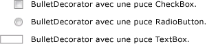

# BulletDecorator
<xref:System.Windows.Controls.Primitives.BulletDecorator>a deux propriétés de contenu : <xref:System.Windows.Controls.Primitives.BulletDecorator.Bullet%2A> et <xref:System.Windows.Controls.Decorator.Child%2A>. Le <xref:System.Windows.Controls.Primitives.BulletDecorator.Bullet%2A> propriété définit le <xref:System.Windows.UIElement> à utiliser en tant que puce. Le <xref:System.Windows.Controls.Decorator.Child%2A> propriété définit un <xref:System.Windows.UIElement> qui s’aligne visuellement avec la puce.  
  
 L’illustration suivante montre des exemples de contrôles qui utilisent un <xref:System.Windows.Controls.Primitives.BulletDecorator>.  
  
   
  
## Référence  
 <xref:System.Windows.Controls.Primitives.BulletDecorator>
